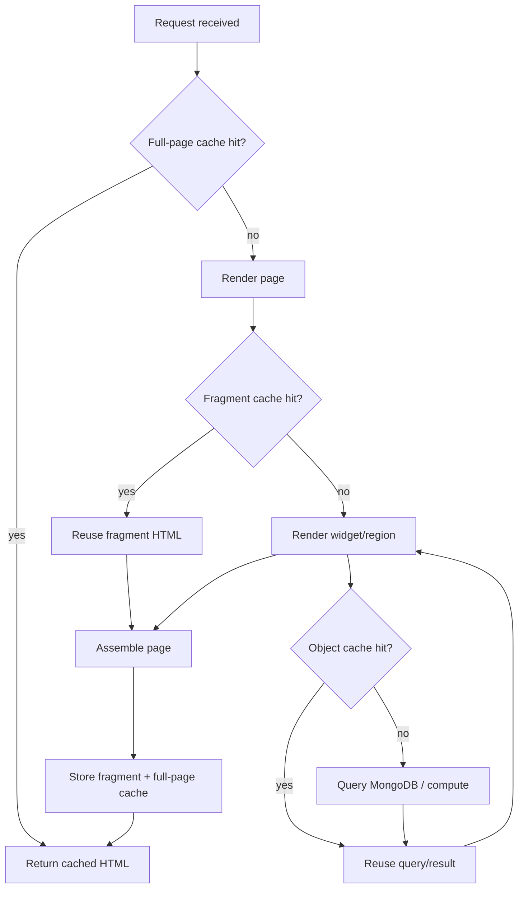
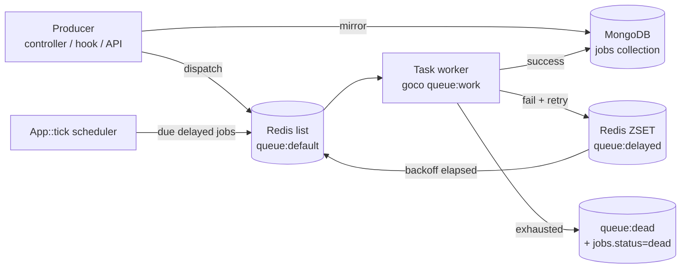
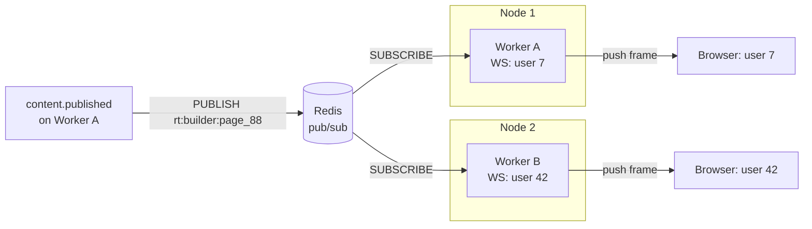

# Caching, Queue & Realtime (Redis)

> How GOCO CMS uses **Redis** as its unified backbone for layered caching, sessions, background jobs, pub/sub realtime, distributed locks, and rate limiting — all served from the persistent [ZealPHP](https://github.com/sibidharan/zealphp) + OpenSwoole runtime.

Redis is the second pillar of every GOCO deployment, sitting beside MongoDB. Where MongoDB is the **durable source of truth**, Redis is the **fast, ephemeral, coordination layer**: it caches rendered output, holds sessions, backs the job queue, bridges realtime messages between workers and browsers, enforces rate limits, and hands out the distributed locks that keep scheduled publishing, migrations, and singleton jobs correct across a multi-worker, multi-node cluster. This document is the canonical reference for all Redis usage in GOCO.

`stable` — the Redis contract (key namespacing, cache tags, queue envelope, lock semantics) is stable pre-1.0; individual convenience helpers may be `beta`.

---

## Why Redis, and where it sits

GOCO runs on persistent OpenSwoole workers (see [ZealPHP Foundation](zealphp-foundation.md)). Because workers are long-lived and multi-process, GOCO needs a **shared, out-of-process** store that every worker on every node can read and write consistently. Redis provides that with sub-millisecond latency, atomic primitives (`INCR`, `SETNX`, `Lua EVAL`), native pub/sub, sorted sets for delay queues, and hash/set structures for cache tagging.

| Concern | Backed by | Package | Key prefix |
| --- | --- | --- | --- |
| Object / fragment / full-page cache | Redis | `Goco\Cache` (`packages/queue` + core) | `cache:` |
| Sessions | Redis | `Goco\Auth` session store | `sess:` |
| Job queue / delayed jobs | Redis + `jobs` collection | `Goco\Queue` (`packages/queue`) | `queue:` |
| Pub/Sub & realtime fan-out | Redis pub/sub | `Goco\Realtime` | `rt:` |
| Distributed locks | Redis | `Goco\Lock` | `lock:` |
| Rate limiting | Redis | ZealPHP `RateLimit` middleware + `Goco\RateLimit` | `rl:` |
| Cross-worker in-memory state | `ZealPHP\Store` (optionally Redis-backed) | ZealPHP | `store:` |

> **Note**
> Redis holds **ephemeral and reconstructable** state only. Anything that must survive a full Redis flush lives in MongoDB. Cache entries, sessions, queued job envelopes, and locks can all be rebuilt or safely lost; GOCO never treats Redis as the last word on durable data. The one exception — queued jobs — is mirrored to the `jobs` collection so no work is lost if Redis restarts.

The Docker Compose service name is `redis` (see [Docker Architecture](../deployment/docker.md)). Connection settings come from the environment:

```env
REDIS_URL=redis://redis:6379
REDIS_DB_CACHE=0
REDIS_DB_SESSION=1
REDIS_DB_QUEUE=2
REDIS_DB_PUBSUB=3
REDIS_KEY_PREFIX=goco
REDIS_POOL_SIZE=64
```

GOCO opens one pooled Redis client per logical database at `onWorkerStart` and reuses connections across coroutines. All Redis calls are coroutine-aware (OpenSwoole hooks the `redis` extension), so they never block the worker.

---

## Key namespacing & multi-tenancy

Every Redis key is namespaced so tenants never collide and so a single flush can target one website. The canonical key shape is:

```
{REDIS_KEY_PREFIX}:{concern}:{workspace_id}:{website_id}:{logical-key}
```

For example, a full-page cache entry for a page on website `web_88` in workspace `ws_12`:

```
goco:cache:page:ws_12:web_88:/pricing
```

Global (non-tenant) keys use `_` in the tenant positions, e.g. `goco:cache:object:_:_:plugin-registry`. This mirrors the `workspace_id` + `website_id` isolation model used throughout the [Data Model](data-model.md) and [Multi-Tenancy](multi-tenancy.md). A tenant purge is therefore a scan-and-delete over `goco:cache:*:ws_12:web_88:*`, and an enterprise database-per-workspace deployment can additionally point each workspace at its own Redis logical DB via `REDIS_DB_*` overrides.

```php
use Goco\Cache\KeyBuilder;

$key = KeyBuilder::for('cache', 'page')
    ->tenant($ctx->workspaceId, $ctx->websiteId)
    ->logical($request->path())
    ->build(); // goco:cache:page:ws_12:web_88:/pricing
```

---

## Layered cache

GOCO caches at three layers. Each layer is optional per route/widget and each has its own TTL and tag set. Requests fall through the layers from most-specific (full page) to least (object), so a cache miss at one layer still benefits from hits below it.



### 1. Object cache

The lowest layer memoizes expensive, reusable values: MongoDB query results, resolved permission sets, compiled property schemas, theme manifests, and the plugin registry. It is a plain key → serialized-value store with a TTL.

```php
use Goco\Cache\Cache;

// Remember: return the cached value or compute, store, and return it.
$menu = Cache::object()->remember(
    key: 'menu:primary',
    ttl: 600, // seconds
    tags: ['menu', 'menu:primary'],
    resolver: fn() => $menus->findBySlug('primary')->toTree()
);
```

### 2. Fragment cache

Fragments cache the rendered HTML of a **region, container, row, or single widget** (see the Website Hierarchy). A fragment key incorporates the widget type, a hash of its resolved props, and the viewer's cache **variance** (locale, device class, and — when the widget is permission-sensitive — a role fingerprint). This is what makes a heavy widget (a product grid, a related-posts block) render once and serve many times.

```php
use Goco\Cache\Cache;
use Goco\SDK\Widget;

$html = Cache::fragment()->remember(
    key: KeyBuilder::widget('product-grid', $props, $ctx),
    ttl: 300,
    tags: ['widget:product-grid', 'collection:products'],
    resolver: fn() => Widget::render('product-grid', $props, $ctx)
);
```

A widget declares its own cache policy in its definition so the engine can cache it automatically during the [Rendering Pipeline](rendering-pipeline.md):

```php
Widget::register('product-grid', [
    'render' => ProductGrid::class,
    'cache'  => [
        'enabled' => true,
        'ttl'     => 300,
        'varyBy'  => ['locale', 'device'],
        'tags'    => ['collection:products'],
    ],
]);
```

### 3. Full-page cache

For anonymous, cacheable routes GOCO stores the entire rendered response (HTML body plus a whitelist of headers). A full-page hit short-circuits the router before any widget renders — the fastest possible path. Full-page caching is skipped automatically for authenticated sessions, requests carrying a CSRF-mutating method, or routes flagged `no-cache`.

```php
$app->route('/{slug}', function ($slug, $request, $response) use ($ctx) {
    return Cache::page()->serveOrRender(
        request: $request,
        response: $response,
        ttl: 3600,
        tags: ['page', "page:{$slug}"],
        render: fn() => Renderer::renderPage($slug, $ctx),
    );
});
```

> **Tip**
> Full-page cache pairs with an HTTP layer. GOCO emits `ETag` and `Cache-Control` via ZealPHP's `ETag` and `Compression` middleware, and Traefik can additionally serve stale-while-revalidate. The Redis full-page cache is the origin cache; edge/HTTP caches sit in front of it. See [Traefik Reverse Proxy](../deployment/traefik.md).

### Tags & TTL

Every entry carries a TTL (hard expiry) and zero or more **tags** (logical groups for invalidation). Tags are implemented as Redis sets that map a tag → the set of keys carrying it. Writing a cache entry adds its key to each tag set; purging a tag deletes every member key and then the set itself, atomically via a Lua script.

```php
// Purge everything tagged with the products collection — object, fragment, and page.
Cache::tags(['collection:products'])->flush();
```

| Layer | Typical TTL | Typical tags | Invalidation trigger |
| --- | --- | --- | --- |
| Object | 5–15 min | `menu`, `settings`, `roles` | Settings/menu/role writes |
| Fragment | 1–10 min | `widget:*`, `collection:*` | Widget config or source data change |
| Full page | 15 min–24 h | `page`, `page:{slug}`, `post:{id}` | Publish/unpublish, revision, redirect |

### Event-driven invalidation

Cache invalidation is **never** manual guesswork — it is driven by the same content events described in [Event & Hook System](event-hook-system.md). GOCO ships a cache invalidator that listens on the canonical content actions and flushes the matching tags:

```php
use Goco\SDK\Hook;
use Goco\Cache\Cache;

Hook::listen('content.published', function (array $doc) {
    Cache::tags([
        'page',
        "page:{$doc['slug']}",
        "website:{$doc['website_id']}",
    ])->flush();
}, priority: 5);

Hook::listen('collection.entry.saved', function (array $entry) {
    Cache::tags(["collection:{$entry['collection']}"])->flush();
});

Hook::listen('menu.updated', fn() => Cache::tags(['menu'])->flush());
```

Because invalidation is event-sourced, any code path that mutates content — the admin UI, the REST API, a plugin, a bulk import, a scheduled publish job — invalidates correctly for free simply by dispatching the standard action. Plugins can subscribe to `cache.flushing` / `cache.flushed` to extend or observe purges.

---

## Sessions

Sessions are stored in Redis (logical DB `REDIS_DB_SESSION`) with per-session TTL and sliding expiry. GOCO plugs its Redis session store into **ZealPHP's session overrides**: ZealPHP's `ext-zealphp` replaces PHP's process-global `$_SESSION` with a **per-coroutine isolated** superglobal, so two concurrent requests in the same worker never see each other's session despite sharing a process.

```php
// A request handler reads/writes the current session normally…
session_start();                       // resolves the session id from cookie/JWT
$_SESSION['last_seen'] = time();       // isolated to THIS coroutine/request
$userId = $_SESSION['uid'] ?? null;
```

Under the hood, `session_start()` resolves the session id from the `goco_sid` cookie (or a JWT for API clients), loads the session hash from Redis, and binds it to the coroutine's `RequestContext`. On response, the mutated session is written back with a refreshed TTL. Because the store is Redis, sessions survive worker restarts and are shared across every node in the cluster — essential for horizontal scaling behind Traefik (see [Scaling Strategy](../deployment/scaling.md)).

```php
// Session store configuration (packages/auth)
return [
    'driver'      => 'redis',
    'db'          => (int) env('REDIS_DB_SESSION', 1),
    'prefix'      => 'sess',
    'ttl'         => 7200,       // 2h idle timeout
    'sliding'     => true,       // refresh TTL on each request
    'absolute'    => 86400 * 14, // hard cap regardless of activity
    'same_site'   => 'Lax',
    'secure'      => true,       // Traefik terminates TLS in front
];
```

Sessions integrate with [Authentication](../core/authentication.md): login stores the user id, active workspace/website, and a session fingerprint; logout deletes the Redis key immediately (true server-side invalidation); "log out everywhere" scans and deletes `sess:*` keys carrying the user id from a per-user index set (`sess:user:{uid}` → session ids).

---

## Queue & background jobs

GOCO offloads slow, retryable, or scheduled work to a background queue. The queue is **Redis-backed for dispatch and coordination**, and every job is **mirrored to the MongoDB `jobs` collection** for durability, observability, and audit. Job execution runs on **OpenSwoole task workers** (or dedicated `goco queue:work` processes), so heavy work never occupies an HTTP worker's coroutine.

### Anatomy



- **Ready queue** — a Redis list per named queue: `queue:default`, `queue:emails`, `queue:media`, `queue:search-index`. Producers `LPUSH`, workers `BRPOPLPUSH` into a per-worker processing list for at-least-once safety.
- **Delayed set** — a Redis sorted set `queue:delayed` scored by "run at" epoch ms; the scheduler moves due members into the ready list.
- **Dead-letter** — `queue:dead` plus `jobs.status = "dead"` for jobs that exhaust their retries.
- **Durable mirror** — the `jobs` collection (see [Data Model](data-model.md)) holds the full envelope, attempt count, timestamps, tenant scope, and last error.

### The `jobs` collection

```javascript
// jobs — durable mirror + audit of every queued job
db.createCollection("jobs", {
  validator: { $jsonSchema: {
    bsonType: "object",
    required: ["_id","queue","type","payload","status","attempts","max_attempts",
               "available_at","created_at"],
    properties: {
      queue:        { bsonType: "string" },
      type:         { bsonType: "string" },   // job class / handler id
      payload:      { bsonType: "object" },
      status:       { enum: ["queued","running","succeeded","failed","dead"] },
      attempts:     { bsonType: "int", minimum: 0 },
      max_attempts: { bsonType: "int", minimum: 1 },
      priority:     { bsonType: "int" },
      available_at: { bsonType: "date" },      // delay / backoff target
      reserved_at:  { bsonType: ["date","null"] },
      finished_at:  { bsonType: ["date","null"] },
      last_error:   { bsonType: ["string","null"] },
      workspace_id: { bsonType: ["objectId","null"] },
      website_id:   { bsonType: ["objectId","null"] }
    }
  }}
});

db.jobs.createIndex({ queue: 1, status: 1, available_at: 1 });   // worker claim scan
db.jobs.createIndex({ status: 1, finished_at: 1 });              // reaping succeeded/dead
db.jobs.createIndex({ workspace_id: 1, website_id: 1, status: 1 });
```

### Defining and dispatching a job

```php
use Goco\Queue\Job;

final class SendWelcomeEmail extends Job
{
    public string $queue = 'emails';
    public int $maxAttempts = 5;
    public int $timeout = 30; // seconds

    public function __construct(private string $userId) {}

    public function handle(): void
    {
        $user = app(UserRepository::class)->find($this->userId);
        app(Mailer::class)->send(new WelcomeMessage($user));
    }

    // Exponential backoff with jitter: 2s, 4s, 8s, 16s… capped.
    public function backoff(int $attempt): int
    {
        return min(2 ** $attempt, 300) + random_int(0, 5);
    }
}
```

```php
use Goco\Queue\Queue;

// Dispatch now
Queue::push(new SendWelcomeEmail($user->id));

// Dispatch with a delay (goes to the delayed ZSET)
Queue::later(new SendWelcomeEmail($user->id), delaySeconds: 60);

// Dispatch onto a specific queue with priority
Queue::onQueue('emails')->priority(10)->push(new SendWelcomeEmail($user->id));
```

Dispatch is transaction-aware: when a job is pushed inside a MongoDB multi-document transaction, its `jobs` document is written in the same transaction and the Redis `LPUSH` is deferred until commit, so a rolled-back transaction never leaks a queued job.

### Running workers

Workers run in two modes. In small/single-node deployments, GOCO can process jobs on **OpenSwoole task workers** in the same server process (configured via `task_worker_num`), dispatched with `$server->task()`. In production, run dedicated worker processes:

```bash
# Dedicated worker: process the default + emails queues, 8 coroutine slots
goco queue:work --queue=default,emails --concurrency=8 --max-jobs=1000 --max-time=3600

# Restart-friendly: workers exit after --max-jobs / --max-time; a supervisor relaunches them
goco queue:restart          # signal all workers to finish current job and exit
goco queue:status           # depth per queue, in-flight, failed, dead counts
goco queue:retry <job_id>   # requeue a failed/dead job
goco queue:flush --dead     # clear the dead-letter set
```

Each worker claims a job (`BRPOPLPUSH` → processing list, mark `jobs.status = running` with a lease recorded in `reserved_at`), runs `handle()` inside a coroutine with the job's timeout, then:

- **Success** → remove from processing list, set `jobs.status = done`, `finished_at`.
- **Failure** & attempts remaining → increment `attempts`, compute `backoff($attempt)`, push to `queue:delayed`, set `status = failed`, record `last_error`.
- **Failure** & attempts exhausted → move to `queue:dead`, set `status = dead`, dispatch `job.dead` hook.

A **reaper** (an `App::tick` timer, below) returns orphaned jobs — those whose processing-list lease expired because a worker crashed mid-job — back to the ready queue, guaranteeing at-least-once delivery. Jobs must therefore be **idempotent**; GOCO provides an optional job-level dedupe key backed by a Redis `SETNX` lock.

### Scheduled jobs

Recurring work is driven by ZealPHP in-process timers registered at worker start (see [ZealPHP Foundation](zealphp-foundation.md)). GOCO elects a **single scheduler** across the cluster using a distributed lock (below) so a cron job fires once, not once per worker.

```php
use ZealPHP\App;
use Goco\Lock\Lock;
use Goco\Queue\Queue;

App::onWorkerStart(function ($server, $wid) {
    // Only worker 0 runs schedulers/reapers to avoid duplication within a node…
    if ($wid !== 0) return;

    // Every 1s: move due delayed jobs into their ready queues (all workers race, ZSET is atomic).
    App::tick(1000, fn() => Queue::promoteDueDelayedJobs());

    // Every 5s: reap orphaned (lease-expired) in-flight jobs.
    App::tick(5000, fn() => Queue::reapExpiredLeases());

    // Every 60s: run the cron scheduler — but only if THIS node holds the cluster lock.
    App::tick(60000, function () {
        Lock::tryWith('scheduler:cron', ttl: 90, callback: function () {
            Scheduler::runDue([
                'publish:scheduled' => '* * * * *',   // scheduled publish sweep
                'sitemap:rebuild'   => '0 * * * *',
                'analytics:rollup'  => '*/15 * * * *',
                'jobs:reap-done'    => '0 3 * * *',    // prune old done rows
            ]);
        });
    });

    // One-off delayed action example
    App::after(5000, fn() => Cache::warm(['/','/pricing']));
});
```

Scheduled **content publishing** is a first-class case: when an editor schedules a page, GOCO writes `available_at` on a `publish:scheduled` job. The per-minute sweep claims due publishes under a per-document lock and dispatches `content.publishing` → `content.published`, which in turn triggers cache invalidation (above) and search re-indexing.

---

## Pub/Sub & realtime

Redis pub/sub is the message bus that fans out realtime events to connected browsers across every worker and node. GOCO uses it for two headline features: **live collaboration in the Page Builder** and **user notifications**. Because a WebSocket connection is pinned to whichever worker/node accepted it, a message produced on worker A must reach a socket held on worker B — Redis pub/sub bridges that gap.



### Bridging Redis → WebSocket/SSE

Each worker opens a subscriber connection at start and re-broadcasts channel messages to any local sockets/SSE streams registered for that channel. GOCO wires the WebSocket endpoint with ZealPHP's `$app->ws()`:

```php
use Goco\Realtime\Presence;

// Builder collaboration channel: /ws/builder/{pageId}
$app->ws('/ws/builder/{pageId}',
    onOpen: function ($server, $req) {
        $pageId = $req->pathParam('pageId');
        Presence::join("builder:{$pageId}", $req->fd, userId: $req->user->id);
        Realtime::subscribeLocal("rt:builder:{$pageId}", $req->fd);
    },
    onMessage: function ($server, $frame) {
        // A builder edit: persist intent, then broadcast to every subscriber cluster-wide.
        $msg = json_decode($frame->data, true);
        Realtime::publish("rt:builder:{$msg['pageId']}", [
            'op'     => $msg['op'],        // move, resize, edit-prop, add-widget…
            'by'     => $frame->user->id,
            'patch'  => $msg['patch'],
            'ts'     => microtime(true),
        ]);
    },
    onClose: function ($server, $fd) {
        Presence::leave($fd);
    },
);
```

`Realtime::publish()` does a Redis `PUBLISH rt:builder:{pageId} {json}`. Every worker's subscriber receives it and calls `$server->push($fd, $json)` for each locally-registered socket — so all collaborators, wherever their socket lives, see the edit. Presence (who is editing, cursor positions) is tracked in a Redis hash per channel with a heartbeat TTL. See [Page Builder](../core/page-builder.md) for the collaboration model and conflict resolution.

Server-sent events use the same bus for one-way streams (notifications, job progress, live logs) via a generator + `$response->sse()`:

```php
$app->route('/sse/notifications', function ($request, $response) {
    $response->sse();
    $channel = "rt:notify:{$request->user->id}";
    foreach (Realtime::stream($channel) as $event) {  // Generator, yields on Redis message
        yield "event: notification\n";
        yield 'data: ' . json_encode($event) . "\n\n";
    }
});
```

### Notifications

Domain events dispatch notifications that are both **persisted** (the `notifications` collection, for the bell/inbox) and **pushed live**:

```php
Hook::listen('comment.created', function (array $comment) {
    $note = Notifications::create($comment['author_of_post'], [
        'type' => 'comment', 'ref' => $comment['_id'],
    ]);
    Realtime::publish("rt:notify:{$note['user_id']}", $note);
});
```

### Cross-worker state: `ZealPHP\Store` & `App::subscribe`

For lightweight, high-frequency shared state that does not need a full round-trip to Redis — connection presence counts, feature flags, live worker metrics — GOCO uses ZealPHP's shared-memory primitives, which can themselves be **backed by Redis** for cross-node coherence:

```php
use ZealPHP\Store;
use ZealPHP\Counter;
use ZealPHP\App;

// Cross-worker table for active builder editors per page
Store::make('builder_presence', size: 4096, cols: [
    ['page_id', Store::STRING, 64],
    ['count',   Store::INT],
]);

// Fan a message to every worker in-process, and (Redis backend) every node.
Store::defaultBackend(Store::BACKEND_REDIS);
Store::publish('builder:page_88', json_encode(['editors' => 3]));

App::subscribe('builder:page_88', function ($message) {
    // Runs on every worker that subscribed; update local UI/metrics.
});

// Atomic cross-worker counter (e.g. concurrent SSE streams)
$streams = new Counter(0);
$streams->increment();
```

> **Tip**
> Use `ZealPHP\Store`/`Counter` for hot, tiny, in-memory shared values (counters, flags, presence tallies). Use `Goco\Realtime` (raw Redis pub/sub) for message fan-out to sockets. Use the cache layer for reconstructable rendered output. They are complementary, not interchangeable.

---

## Rate limiting

Rate limiting is enforced at two levels, both backed by Redis so limits are consistent across workers and nodes.

**1. Edge/HTTP** — ZealPHP's `RateLimit` middleware (token-bucket) fronts public and API routes and is Redis-backed for cluster consistency. Traefik can also rate-limit at the proxy for coarse DDoS protection.

```php
use ZealPHP\Middleware\RateLimit;

$app->addMiddleware(new RateLimit(
    key: fn($req) => 'rl:api:' . ($req->user?->id ?? $req->ip()),
    limit: 120,          // requests
    window: 60,          // per 60s
    store: 'redis',
));
```

**2. Application** — `Goco\RateLimit` guards specific actions (login attempts, password resets, form submissions, AI calls, plugin webhooks) with named limiters keyed per tenant + subject. The check is an atomic Redis Lua script (increment + expire) so it is race-free under concurrency.

```php
use Goco\RateLimit\Limiter;

if (! Limiter::for("login:{$request->ip()}")->allow(max: 5, perSeconds: 300)) {
    return $response->status(429)->json(['error' => 'too_many_attempts']);
}
```

| Limiter | Key | Default budget |
| --- | --- | --- |
| API (per token) | `rl:api:{uid}` | 120 / min |
| Login | `rl:login:{ip}` | 5 / 5 min |
| Form submit | `rl:form:{form_id}:{ip}` | 10 / min |
| AI generation | `rl:ai:{workspace_id}` | plan-dependent |
| Plugin webhook | `rl:hook:{slug}` | plugin-declared |

Exceeded limits emit `Retry-After` headers and dispatch a `ratelimit.exceeded` hook so security tooling and the audit log can react. See [Security Model](../security/security-model.md).

---

## Distributed locks

A multi-worker, multi-node cluster must ensure certain operations run **exactly once at a time**. GOCO's `Goco\Lock` implements a Redis lock using `SET key token NX PX ttl` for acquisition and a Lua compare-and-delete for release (so a lock is only released by its owner, never by a laggard whose lease already expired). Locks always carry a TTL to survive a crashed holder.

```php
use Goco\Lock\Lock;

// Fenced critical section — auto-acquires, runs, and releases (even on exception).
Lock::with('migration:2026_07_add_indexes', ttl: 300, callback: function () {
    Migrator::run('2026_07_add_indexes');
});

// Non-blocking attempt: run only if the lock is free, otherwise skip.
Lock::tryWith('publish:page_88', ttl: 30, callback: function () {
    Publisher::publish('page_88');
});

// Manual acquire/renew for long operations
$lock = Lock::acquire('reindex:products', ttl: 60);
try {
    foreach ($batches as $batch) {
        Search::index($batch);
        $lock->renew(60); // extend the lease while work continues
    }
} finally {
    $lock->release();
}
```

Locks guard, among others:

- **Scheduled publish** — one publisher per document (`lock:publish:{doc_id}`), so a page never double-publishes when the sweep overlaps.
- **Migrations** — a single node runs schema/index migrations (`lock:migration:*`); see [MongoDB Data Layer](database-mongodb.md).
- **Singleton jobs** — the cron scheduler and reaper elect one runner cluster-wide (`lock:scheduler:cron`).
- **Cache stampede protection** — a per-key "recompute" lock so only one coroutine rebuilds an expired hot cache entry while others serve stale-then-fresh.

> **Warning**
> A Redis lock is a **coordination hint under a lease**, not a guarantee of mutual exclusion across a network partition. GOCO keeps lock TTLs short, makes every locked operation **idempotent**, and never uses a lock as the sole correctness mechanism where money or data integrity is at stake — those invariants are enforced by MongoDB multi-document transactions. For the strongest guarantees, deploy Redis in a single-primary configuration and keep locked sections short.

---

## Failure & degradation behavior

Redis is critical but GOCO degrades gracefully when it is briefly unavailable:

| Subsystem | If Redis is down |
| --- | --- |
| Cache | Misses fall through to MongoDB/compute; site is slower, still correct |
| Sessions | New logins fail; existing JWT-based API auth continues; a health probe fails the container |
| Queue | Dispatch buffers to the `jobs` collection (`status = queued`); a reconciler re-pushes to Redis on reconnect |
| Realtime | Live updates pause; clients reconnect and reconcile via a full fetch |
| Rate limit | Fails **closed** for security-sensitive limiters (login), **open** for cosmetic ones |
| Locks | Locked operations refuse to run (fail closed) rather than risk duplication |

The `redis` container declares a healthcheck and `restart: unless-stopped` in Compose; GOCO's own `/healthz` reports Redis reachability so Traefik and orchestrators can route around a sick node. See [Deployment Guide](../deployment/deployment-guide.md) and [Backup & Restore](../deployment/backup-restore.md) (Redis is treated as a cache/coordination tier — GOCO backs up MongoDB, not Redis, and rebuilds Redis state on recovery).

---

## Configuration reference

```env
# Connection
REDIS_URL=redis://redis:6379
REDIS_PASSWORD=
REDIS_KEY_PREFIX=goco
REDIS_POOL_SIZE=64

# Logical DB separation
REDIS_DB_CACHE=0
REDIS_DB_SESSION=1
REDIS_DB_QUEUE=2
REDIS_DB_PUBSUB=3

# Cache
CACHE_DEFAULT_TTL=600
CACHE_PAGE_ENABLED=true
CACHE_FRAGMENT_ENABLED=true

# Queue
QUEUE_DEFAULT=default
QUEUE_TASK_WORKERS=4          # OpenSwoole task_worker_num for in-process mode
QUEUE_MAX_ATTEMPTS=5
QUEUE_RETENTION_DONE_HOURS=72

# Sessions
SESSION_DRIVER=redis
SESSION_TTL=7200
SESSION_SLIDING=true

# Rate limiting
RATE_LIMIT_API=120/60
RATE_LIMIT_LOGIN=5/300
```

See the full [Configuration Reference](../reference/configuration-reference.md) for every key.

---

## Related

- [ZealPHP Foundation](zealphp-foundation.md) — the persistent-worker runtime, timers, `Store`, and coroutines
- [Rendering Pipeline](rendering-pipeline.md) — how fragment/full-page caches slot into rendering
- [Request Lifecycle](request-lifecycle.md) — where cache lookups and session load happen per request
- [Event & Hook System](event-hook-system.md) — the content events that drive cache invalidation
- [MongoDB Data Layer](database-mongodb.md) — the `jobs` collection and transaction-aware dispatch
- [Data Model (Collections & Indexes)](data-model.md) — `jobs`, `sessions`, `notifications` schemas
- [Multi-Tenancy](multi-tenancy.md) — per-tenant keyspaces and isolation
- [Search](search.md) — the search-index queue consumer
- [Authentication](../core/authentication.md) — Redis sessions, JWT, and login rate limits
- [Page Builder (Visual Editor)](../core/page-builder.md) — realtime collaboration over pub/sub
- [Traefik Reverse Proxy](../deployment/traefik.md) — edge caching, HTTP/3, and edge rate limiting
- [Scaling Strategy](../deployment/scaling.md) — horizontal scaling with shared Redis state
- [Configuration Reference](../reference/configuration-reference.md) — all Redis-related settings
- [Documentation Home](../README.md)
