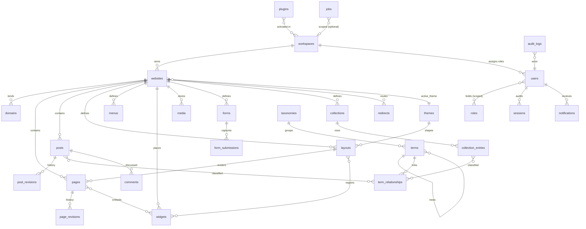

# Data Model (Collections & Indexes)

> The canonical catalog of every MongoDB collection in GOCO CMS — base fields, key fields, real sample documents, recommended indexes, and relationships.

This document is the authoritative reference for the GOCO persistence layer. It describes the
**physical data model**: the collections that live in the single logical MongoDB database of a
deployment, the shape of the documents inside them, and the indexes that keep queries fast under
load. It is the companion to [MongoDB Data Layer](database-mongodb.md), which explains the
*mechanics* (repositories, validators, transactions); here we enumerate the *contents*.

Everything below is consistent with the conventions established in
[Architecture Overview](overview.md) and [Multi-Tenancy](multi-tenancy.md): one logical database
per deployment, tenant isolation via `workspace_id` + `website_id`, soft deletes, optimistic
versioning, and audit trails. The data layer is a lightweight document-mapper + Repository pattern
in `packages/database` (`Goco\Database`) — never a heavy ORM.

Stability: `stable` for the collection set and base-field contract; individual optional fields are
marked inline where they are `beta` or `experimental`.

---

## 1. Conventions

Before the catalog, the rules that every collection obeys.

| Convention | Rule |
|------------|------|
| **Collection names** | `snake_case`, plural (`page_revisions`, `form_submissions`). |
| **Field names** | `snake_case`. Foreign keys are `<singular>_id` (`website_id`, `created_by`). |
| **Identifiers** | `_id` is a native `ObjectId` unless a natural key is required (e.g. `settings._id` is a string key). Cross-references store the referenced `ObjectId`. |
| **Timestamps** | `created_at` / `updated_at` are BSON `Date` (UTC). Never store local time. |
| **Money & counts** | Integers or `Decimal128` — never floats for exact values. |
| **Enums** | Lower-case strings validated by JSON-Schema `enum`. |
| **Soft delete** | `deleted_at` is `null` for live docs, a `Date` when trashed. All default queries filter `deleted_at: null` (see [MongoDB Data Layer](database-mongodb.md)). |
| **Validation** | Every collection ships a JSON-Schema `$jsonSchema` validator applied at `collMod` time by migrations in `scripts/`. |
| **Tenancy** | Tenant-scoped docs carry `workspace_id` + `website_id`. Global docs (workspaces, users, roles, plugins, themes, jobs) do not. |

> **Note — module-owned collections.** This catalog is the **core** set. Modules may register
> additional collections that extend it: `auth_tokens` (owned by the [Authentication](../core/authentication.md)
> module) and `templates` (owned by the [Template Engine](../core/template-engine.md)). Per-tenant
> **plugin** configuration is *not* a separate collection — it lives in `settings` under a
> `plugin:<slug>` namespace, mirroring how themes store their settings.

> **Note**
> Index direction (`1` ascending / `-1` descending) matters only for sort and range scans;
> for equality it is irrelevant. Compound indexes follow the **ESR rule** — Equality, Sort,
> Range — so the leftmost keys are equality predicates, then the sort key, then range fields.

---

## 2. Base fields (present on every document)

Every document in every collection carries this envelope. It is enforced by a shared JSON-Schema
fragment and injected by the base `Repository` on write.

| Field | Type | Description |
|-------|------|-------------|
| `_id` | `ObjectId` \| `string` | Primary key. `ObjectId` by default; string for natural-key collections. |
| `created_at` | `Date` | UTC creation timestamp. Immutable after insert. |
| `updated_at` | `Date` | UTC timestamp of the last write. Bumped on every update. |
| `deleted_at` | `Date` \| `null` | Soft-delete marker. `null` = live. |
| `version` | `int` | Optimistic-concurrency counter, starts at `1`, `$inc` on each update. |
| `created_by` | `ObjectId` \| `null` | `users._id` of the actor who created the doc (`null` for system/seed). |
| `updated_by` | `ObjectId` \| `null` | `users._id` of the last writer. |

**Tenant-scoped documents additionally carry:**

| Field | Type | Description |
|-------|------|-------------|
| `workspace_id` | `ObjectId` | `workspaces._id`. Present on every tenant doc, always the first key of tenant indexes. |
| `website_id` | `ObjectId` | `websites._id`. Narrows a tenant doc to a single site. |

> **Warning**
> Never query a tenant-scoped collection without a `workspace_id` predicate. The Repository layer
> injects it automatically from `\ZealPHP\G` (request context); direct driver access must supply
> it explicitly or risk a cross-tenant leak. See [Multi-Tenancy](multi-tenancy.md).

**Universal indexes** (created on every collection by the base migration):

```javascript
// Mongo shell — applied to all collections
db.<collection>.createIndex({ deleted_at: 1 })
db.<collection>.createIndex({ updated_at: -1 })

// Tenant-scoped collections also get:
db.<collection>.createIndex({ workspace_id: 1, website_id: 1, deleted_at: 1 })
```

The per-collection index lists below are **in addition to** these universal indexes and omit them
for brevity.

---

## 3. Collection catalog

Each entry gives: **Purpose**, **Key fields**, a realistic **Sample document**, **Indexes**, and
**Relationships**. Base-envelope fields are shown in samples but not re-listed in the key-field
tables.

### 3.1 `workspaces`

**Purpose.** The top of the [website hierarchy](database-mongodb.md) — a billing/organization
boundary that owns one or more websites. Global (not tenant-scoped), but it *is* the tenant root:
`workspace_id` on every tenant doc points here.

| Field | Type | Description |
|-------|------|-------------|
| `name` | `string` | Human display name. |
| `slug` | `string` | Globally unique URL/DNS-safe key. |
| `plan` | `string` | `free` \| `pro` \| `business` \| `enterprise`. |
| `isolation` | `string` | `shared` (default) \| `dedicated_db` (enterprise database-per-workspace). |
| `owner_id` | `ObjectId` | `users._id` of the workspace owner. |
| `limits` | `object` | Quotas: `websites`, `storage_bytes`, `ai_tokens_month`. |
| `status` | `string` | `active` \| `suspended` \| `trialing`. |

```json
{
  "_id": { "$oid": "6690a1b2c3d4e5f601000001" },
  "name": "Northwind Digital",
  "slug": "northwind",
  "plan": "business",
  "isolation": "shared",
  "owner_id": { "$oid": "6690a1b2c3d4e5f600000001" },
  "limits": { "websites": 25, "storage_bytes": 107374182400, "ai_tokens_month": 5000000 },
  "status": "active",
  "created_at": { "$date": "2026-01-04T09:12:00Z" },
  "updated_at": { "$date": "2026-07-10T14:03:11Z" },
  "deleted_at": null,
  "version": 7,
  "created_by": { "$oid": "6690a1b2c3d4e5f600000001" },
  "updated_by": { "$oid": "6690a1b2c3d4e5f600000001" }
}
```

**Indexes**

```javascript
db.workspaces.createIndex({ slug: 1 }, { unique: true })
db.workspaces.createIndex({ owner_id: 1 })
db.workspaces.createIndex({ status: 1, plan: 1 })
```

**Relationships.** One workspace → many `websites`, `users` (via role assignments), `plugins`
activations. `owner_id` → `users`.

---

### 3.2 `websites`

**Purpose.** A single website inside a workspace: its own theme, layouts, pages, menus, and domains.
The `website_id` scope key across tenant collections.

| Field | Type | Description |
|-------|------|-------------|
| `name` | `string` | Display name. |
| `slug` | `string` | Unique within the workspace. |
| `active_theme` | `string` | `themes.slug` currently applied. |
| `default_locale` | `string` | BCP-47 tag, e.g. `en-US`. |
| `locales` | `string[]` | Enabled locales. |
| `timezone` | `string` | IANA tz, e.g. `America/New_York`. |
| `primary_domain_id` | `ObjectId` | `domains._id` used for canonical URLs. |
| `status` | `string` | `draft` \| `published` \| `maintenance`. |

```json
{
  "_id": { "$oid": "6690a1b2c3d4e5f602000001" },
  "workspace_id": { "$oid": "6690a1b2c3d4e5f601000001" },
  "name": "Northwind Marketing Site",
  "slug": "www",
  "active_theme": "aurora",
  "default_locale": "en-US",
  "locales": ["en-US", "fr-FR"],
  "timezone": "America/New_York",
  "primary_domain_id": { "$oid": "6690a1b2c3d4e5f603000001" },
  "status": "published",
  "created_at": { "$date": "2026-01-05T10:00:00Z" },
  "updated_at": { "$date": "2026-07-11T08:22:00Z" },
  "deleted_at": null,
  "version": 41,
  "created_by": { "$oid": "6690a1b2c3d4e5f600000001" },
  "updated_by": { "$oid": "6690a1b2c3d4e5f600000009" }
}
```

**Indexes**

```javascript
db.websites.createIndex({ workspace_id: 1, slug: 1 }, { unique: true })
db.websites.createIndex({ active_theme: 1 })
db.websites.createIndex({ status: 1 })
```

> **Note**
> `websites` carries `workspace_id` but not `website_id` (it *is* the website). It is the one
> tenant collection whose scope is a single key.

**Relationships.** Belongs to `workspaces`. One website → many `domains`, `pages`, `posts`,
`layouts`, `menus`, `widgets`, `media`. `active_theme` → `themes.slug`; `primary_domain_id` →
`domains`.

---

### 3.3 `domains`

**Purpose.** Hostnames bound to a website, including verification state and TLS status. Consumed by
[Traefik](../deployment/traefik.md) to generate per-tenant routers and issue Let's Encrypt certs.

| Field | Type | Description |
|-------|------|-------------|
| `host` | `string` | FQDN, e.g. `www.northwind.com`. Globally unique. |
| `type` | `string` | `primary` \| `alias` \| `redirect`. |
| `verified` | `bool` | DNS/ACME challenge passed. |
| `verification_token` | `string` | TXT-record challenge value. |
| `tls` | `object` | `{ issuer, expires_at, status }`. |
| `redirect_to` | `string` \| `null` | Target host when `type = redirect`. |

```json
{
  "_id": { "$oid": "6690a1b2c3d4e5f603000001" },
  "workspace_id": { "$oid": "6690a1b2c3d4e5f601000001" },
  "website_id": { "$oid": "6690a1b2c3d4e5f602000001" },
  "host": "www.northwind.com",
  "type": "primary",
  "verified": true,
  "verification_token": "goco-verify=8f3a1c9e2b",
  "tls": { "issuer": "letsencrypt", "expires_at": { "$date": "2026-09-30T00:00:00Z" }, "status": "active" },
  "redirect_to": null,
  "created_at": { "$date": "2026-01-05T10:05:00Z" },
  "updated_at": { "$date": "2026-07-01T02:00:00Z" },
  "deleted_at": null,
  "version": 12,
  "created_by": { "$oid": "6690a1b2c3d4e5f600000001" },
  "updated_by": null
}
```

**Indexes**

```javascript
db.domains.createIndex({ host: 1 }, { unique: true })
db.domains.createIndex({ website_id: 1, type: 1 })
db.domains.createIndex({ verified: 1 })
```

**Relationships.** Belongs to `websites`. Referenced by `websites.primary_domain_id` and by
`redirects` for host-level rules.

---

### 3.4 `users`

**Purpose.** Global identity. A user is not tenant-scoped — the same account can hold roles in many
workspaces/websites. Authentication material lives here; sessions live in Redis (see `sessions`).
See [Authentication](../core/authentication.md).

| Field | Type | Description |
|-------|------|-------------|
| `email` | `string` | Globally unique, lower-cased. |
| `email_verified_at` | `Date` \| `null` | Verification timestamp. |
| `name` | `string` | Display name. |
| `password_hash` | `string` | Argon2id hash. Never returned by the API. |
| `mfa` | `object` | `{ totp_enabled, totp_secret_enc, recovery_codes_hash[] }`. |
| `passkeys` | `object[]` | WebAuthn credentials: `{ credential_id, public_key, sign_count, label }`. |
| `roles` | `object[]` | Scoped assignments: `{ role, workspace_id, website_id? }`. |
| `status` | `string` | `active` \| `invited` \| `suspended`. |
| `last_login_at` | `Date` \| `null` | Audit convenience. |

```json
{
  "_id": { "$oid": "6690a1b2c3d4e5f600000009" },
  "email": "dana@northwind.com",
  "email_verified_at": { "$date": "2026-01-06T12:00:00Z" },
  "name": "Dana Okoro",
  "password_hash": "$argon2id$v=19$m=65536,t=3,p=4$...",
  "mfa": { "totp_enabled": true, "totp_secret_enc": "vault:...", "recovery_codes_hash": ["$argon2id$..."] },
  "passkeys": [
    { "credential_id": "AY3b...", "public_key": "pQECAy...", "sign_count": 42, "label": "MacBook Touch ID" }
  ],
  "roles": [
    { "role": "website-admin", "workspace_id": { "$oid": "6690a1b2c3d4e5f601000001" }, "website_id": { "$oid": "6690a1b2c3d4e5f602000001" } }
  ],
  "status": "active",
  "last_login_at": { "$date": "2026-07-18T07:45:12Z" },
  "created_at": { "$date": "2026-01-06T11:59:00Z" },
  "updated_at": { "$date": "2026-07-18T07:45:12Z" },
  "deleted_at": null,
  "version": 23,
  "created_by": { "$oid": "6690a1b2c3d4e5f600000001" },
  "updated_by": { "$oid": "6690a1b2c3d4e5f600000009" }
}
```

**Indexes**

```javascript
db.users.createIndex({ email: 1 }, { unique: true })
db.users.createIndex({ "roles.workspace_id": 1, "roles.website_id": 1 })
db.users.createIndex({ status: 1 })
db.users.createIndex({ "passkeys.credential_id": 1 }, { sparse: true })
```

**Relationships.** `roles[].role` → `roles.slug`. Referenced by nearly every collection via
`created_by` / `updated_by` / `owner_id`. Sessions in Redis reference `users._id`.

---

### 3.5 `roles`

**Purpose.** RBAC definitions mapping a role slug to a capability set. Ships with built-in roles;
workspaces may define custom ones. See [Permission System](permission-system.md).

| Field | Type | Description |
|-------|------|-------------|
| `slug` | `string` | Role key, e.g. `editor`. Unique per scope. |
| `name` | `string` | Display label. |
| `rank` | `int` | Hierarchy weight (owner highest). Used for "can-manage-lower" checks. |
| `builtin` | `bool` | `true` for the shipped 13 roles; `false` for custom. |
| `capabilities` | `string[]` | `resource.action` grants, e.g. `pages.publish`. |
| `inherits` | `string[]` | Role slugs whose capabilities are unioned in (transitive). |
| `is_default` | `bool` | Assigned automatically to new members of the scope. |
| `policies` | `string[]` | ABAC policy IDs attached to this role (evaluated by the `PolicyEngine`). |
| `workspace_id` | `ObjectId` \| `null` | `null` = global built-in; set = workspace-custom role. |

```json
{
  "_id": { "$oid": "6690a1b2c3d4e5f604000005" },
  "slug": "editor",
  "name": "Editor",
  "rank": 60,
  "builtin": true,
  "capabilities": [
    "pages.create", "pages.read", "pages.update", "pages.publish",
    "posts.create", "posts.read", "posts.update", "posts.publish",
    "media.create", "media.read", "media.update"
  ],
  "inherits": ["author"],
  "is_default": false,
  "policies": [],
  "workspace_id": null,
  "created_at": { "$date": "2026-01-01T00:00:00Z" },
  "updated_at": { "$date": "2026-01-01T00:00:00Z" },
  "deleted_at": null,
  "version": 1,
  "created_by": null,
  "updated_by": null
}
```

**Indexes**

```javascript
db.roles.createIndex({ workspace_id: 1, slug: 1 }, { unique: true })
db.roles.createIndex({ builtin: 1 })
```

**Relationships.** Referenced by `users.roles[].role`. Capabilities are enforced by the
`PolicyEngine`; optional ABAC policies live in `settings`.

---

### 3.6 `sessions`

**Purpose.** **Redis is the primary store** for live sessions (fast, TTL-expiring, per-coroutine
isolation via ext-zealphp). This Mongo collection is the **durable audit mirror** — a record of
session issuance/termination for security forensics, not the hot-path lookup. See
[Caching, Queue & Realtime](caching-and-queue.md) and [Authentication](../core/authentication.md).

| Field | Type | Description |
|-------|------|-------------|
| `sid` | `string` | Opaque session id (also the Redis key suffix). |
| `user_id` | `ObjectId` | `users._id`. |
| `method` | `string` | `password` \| `oauth2` \| `passkey` \| `api_jwt`. |
| `ip` | `string` | Client IP at issuance. |
| `user_agent` | `string` | Raw UA string. |
| `issued_at` | `Date` | Creation time. |
| `expires_at` | `Date` | TTL boundary (mirrors Redis TTL). |
| `revoked_at` | `Date` \| `null` | Set on explicit logout / admin revoke. |

```json
{
  "_id": { "$oid": "6690a1b2c3d4e5f605000010" },
  "sid": "sess_9f2b7c1e4a8d6f30",
  "user_id": { "$oid": "6690a1b2c3d4e5f600000009" },
  "method": "passkey",
  "ip": "203.0.113.24",
  "user_agent": "Mozilla/5.0 (Macintosh; ...) Safari/605",
  "issued_at": { "$date": "2026-07-18T07:45:12Z" },
  "expires_at": { "$date": "2026-07-18T19:45:12Z" },
  "revoked_at": null,
  "created_at": { "$date": "2026-07-18T07:45:12Z" },
  "updated_at": { "$date": "2026-07-18T07:45:12Z" },
  "deleted_at": null,
  "version": 1,
  "created_by": { "$oid": "6690a1b2c3d4e5f600000009" },
  "updated_by": null
}
```

**Indexes**

```javascript
db.sessions.createIndex({ sid: 1 }, { unique: true })
db.sessions.createIndex({ user_id: 1, issued_at: -1 })
// TTL: prune audit rows 90 days after expiry (Redis handles live expiry)
db.sessions.createIndex({ expires_at: 1 }, { expireAfterSeconds: 7776000 })
```

**Relationships.** `user_id` → `users`. Mirrors a Redis key `session:{sid}`.

---

### 3.7 `pages`

**Purpose.** Structured, builder-composed pages of a website (the visual-editor output). Content is
a tree of sections/containers/rows/columns/widgets. See [Page Builder](../core/page-builder.md) and
[Rendering Pipeline](rendering-pipeline.md).

| Field | Type | Description |
|-------|------|-------------|
| `title` | `string` | Page title. |
| `slug` | `string` | Path segment, unique per website + locale. |
| `path` | `string` | Full resolved URL path, e.g. `/products/pricing`. |
| `locale` | `string` | BCP-47 tag. |
| `layout_id` | `ObjectId` | `layouts._id` the page renders into. |
| `status` | `string` | `draft` \| `scheduled` \| `published` \| `archived`. |
| `published_at` | `Date` \| `null` | Go-live time. |
| `content` | `object` | Builder tree (sections → widgets, referencing `widgets._id`). |
| `seo` | `object` | `{ meta_title, meta_description, og, canonical, robots }`. |
| `current_revision` | `int` | Points at latest `page_revisions.revision`. |

```json
{
  "_id": { "$oid": "6690a1b2c3d4e5f606000001" },
  "workspace_id": { "$oid": "6690a1b2c3d4e5f601000001" },
  "website_id": { "$oid": "6690a1b2c3d4e5f602000001" },
  "title": "Pricing",
  "slug": "pricing",
  "path": "/products/pricing",
  "locale": "en-US",
  "layout_id": { "$oid": "6690a1b2c3d4e5f60a000002" },
  "status": "published",
  "published_at": { "$date": "2026-06-20T15:00:00Z" },
  "content": {
    "sections": [
      { "id": "s1", "container": "boxed", "rows": [
        { "columns": [ { "span": 12, "widgets": [ { "$oid": "6690a1b2c3d4e5f609000001" } ] } ] }
      ] }
    ]
  },
  "seo": {
    "meta_title": "Pricing — Northwind",
    "meta_description": "Simple, transparent plans.",
    "og": { "image": { "$oid": "6690a1b2c3d4e5f60b000004" } },
    "canonical": "https://www.northwind.com/products/pricing",
    "robots": "index,follow"
  },
  "current_revision": 8,
  "created_at": { "$date": "2026-03-02T09:00:00Z" },
  "updated_at": { "$date": "2026-06-20T15:00:00Z" },
  "deleted_at": null,
  "version": 31,
  "created_by": { "$oid": "6690a1b2c3d4e5f600000009" },
  "updated_by": { "$oid": "6690a1b2c3d4e5f600000009" }
}
```

**Indexes**

```javascript
db.pages.createIndex({ website_id: 1, locale: 1, slug: 1 }, { unique: true })
db.pages.createIndex({ website_id: 1, path: 1 })   // hot-path route resolution
db.pages.createIndex({ website_id: 1, status: 1, published_at: -1 })
db.pages.createIndex({ title: "text", "seo.meta_description": "text" })
```

**Relationships.** Belongs to `websites`. `layout_id` → `layouts`; `content` references
`widgets._id`; `seo.og.image` → `media`. History in `page_revisions`.

---

### 3.8 `page_revisions`

**Purpose.** Immutable snapshots of a page's `content` + `seo` at each save/publish, enabling diff,
rollback, and audit. Append-only.

| Field | Type | Description |
|-------|------|-------------|
| `page_id` | `ObjectId` | `pages._id`. |
| `revision` | `int` | Monotonic per page. |
| `snapshot` | `object` | Full `{ title, content, seo, layout_id }` at that point. |
| `label` | `string` \| `null` | Optional named checkpoint. |
| `reason` | `string` | `autosave` \| `manual` \| `publish` \| `restore`. |

```json
{
  "_id": { "$oid": "6690a1b2c3d4e5f607000008" },
  "workspace_id": { "$oid": "6690a1b2c3d4e5f601000001" },
  "website_id": { "$oid": "6690a1b2c3d4e5f602000001" },
  "page_id": { "$oid": "6690a1b2c3d4e5f606000001" },
  "revision": 8,
  "snapshot": { "title": "Pricing", "layout_id": { "$oid": "6690a1b2c3d4e5f60a000002" }, "content": { "sections": [] }, "seo": {} },
  "label": "Q3 launch",
  "reason": "publish",
  "created_at": { "$date": "2026-06-20T15:00:00Z" },
  "updated_at": { "$date": "2026-06-20T15:00:00Z" },
  "deleted_at": null,
  "version": 1,
  "created_by": { "$oid": "6690a1b2c3d4e5f600000009" },
  "updated_by": null
}
```

**Indexes**

```javascript
db.page_revisions.createIndex({ page_id: 1, revision: -1 }, { unique: true })
db.page_revisions.createIndex({ website_id: 1, created_at: -1 })
```

**Relationships.** Belongs to `pages` (`page_id`). `pages.current_revision` points at the newest.

---

### 3.9 `posts`

**Purpose.** Blog/article content with taxonomy, authorship, and scheduling. See
[Blog Engine](../core/blog-engine.md). Distinct from `pages`: prose-first, feed-oriented, taxonomy-linked.

| Field | Type | Description |
|-------|------|-------------|
| `title` | `string` | Post title. |
| `slug` | `string` | Unique per website + locale. |
| `locale` | `string` | BCP-47 tag. |
| `excerpt` | `string` | Summary for feeds/cards. |
| `body` | `object` | Rich content blocks (portable-text style). |
| `author_id` | `ObjectId` | `users._id`. |
| `status` | `string` | `draft` \| `scheduled` \| `published` \| `archived`. |
| `published_at` | `Date` \| `null` | Publish time. |
| `featured_media_id` | `ObjectId` \| `null` | `media._id`. |
| `reading_time` | `int` | Estimated minutes. |
| `seo` | `object` | Same shape as `pages.seo`. |

```json
{
  "_id": { "$oid": "6690a1b2c3d4e5f608000001" },
  "workspace_id": { "$oid": "6690a1b2c3d4e5f601000001" },
  "website_id": { "$oid": "6690a1b2c3d4e5f602000001" },
  "title": "Shipping HTTP/3 with Traefik",
  "slug": "shipping-http3-traefik",
  "locale": "en-US",
  "excerpt": "How we turned on QUIC across every tenant.",
  "body": { "blocks": [ { "type": "paragraph", "text": "..." } ] },
  "author_id": { "$oid": "6690a1b2c3d4e5f600000009" },
  "status": "published",
  "published_at": { "$date": "2026-07-14T13:00:00Z" },
  "featured_media_id": { "$oid": "6690a1b2c3d4e5f60b000004" },
  "reading_time": 6,
  "seo": { "meta_title": "Shipping HTTP/3 with Traefik", "robots": "index,follow" },
  "created_at": { "$date": "2026-07-12T10:00:00Z" },
  "updated_at": { "$date": "2026-07-14T13:00:00Z" },
  "deleted_at": null,
  "version": 9,
  "created_by": { "$oid": "6690a1b2c3d4e5f600000009" },
  "updated_by": { "$oid": "6690a1b2c3d4e5f600000009" }
}
```

**Indexes**

```javascript
db.posts.createIndex({ website_id: 1, locale: 1, slug: 1 }, { unique: true })
db.posts.createIndex({ website_id: 1, status: 1, published_at: -1 })
db.posts.createIndex({ author_id: 1, published_at: -1 })
db.posts.createIndex({ title: "text", excerpt: "text" })
```

**Relationships.** Belongs to `websites`. `author_id` → `users`; `featured_media_id` → `media`;
taxonomy links via `term_relationships`; history in `post_revisions`.

---

### 3.10 `post_revisions`

**Purpose.** Immutable version history for `posts`, mirroring `page_revisions`. Append-only.

| Field | Type | Description |
|-------|------|-------------|
| `post_id` | `ObjectId` | `posts._id`. |
| `revision` | `int` | Monotonic per post. |
| `snapshot` | `object` | `{ title, body, excerpt, seo }` at that point. |
| `reason` | `string` | `autosave` \| `manual` \| `publish` \| `restore`. |

```json
{
  "_id": { "$oid": "6690a1b2c3d4e5f60c000003" },
  "workspace_id": { "$oid": "6690a1b2c3d4e5f601000001" },
  "website_id": { "$oid": "6690a1b2c3d4e5f602000001" },
  "post_id": { "$oid": "6690a1b2c3d4e5f608000001" },
  "revision": 5,
  "snapshot": { "title": "Shipping HTTP/3 with Traefik", "excerpt": "...", "body": { "blocks": [] }, "seo": {} },
  "reason": "publish",
  "created_at": { "$date": "2026-07-14T13:00:00Z" },
  "updated_at": { "$date": "2026-07-14T13:00:00Z" },
  "deleted_at": null,
  "version": 1,
  "created_by": { "$oid": "6690a1b2c3d4e5f600000009" },
  "updated_by": null
}
```

**Indexes**

```javascript
db.post_revisions.createIndex({ post_id: 1, revision: -1 }, { unique: true })
db.post_revisions.createIndex({ website_id: 1, created_at: -1 })
```

**Relationships.** Belongs to `posts` (`post_id`).

---

### 3.11 `taxonomies`

**Purpose.** Definitions of classification schemes (e.g. `category`, `tag`, `product_line`). A
taxonomy groups `terms`. Hierarchical or flat.

| Field | Type | Description |
|-------|------|-------------|
| `key` | `string` | Machine key, unique per website (`category`). |
| `label` | `string` | Display name. |
| `hierarchical` | `bool` | Whether terms can nest. |
| `applies_to` | `string[]` | Object types this taxonomy classifies (`posts`, `collection_entries`). |

```json
{
  "_id": { "$oid": "6690a1b2c3d4e5f60d000001" },
  "workspace_id": { "$oid": "6690a1b2c3d4e5f601000001" },
  "website_id": { "$oid": "6690a1b2c3d4e5f602000001" },
  "key": "category",
  "label": "Categories",
  "hierarchical": true,
  "applies_to": ["posts"],
  "created_at": { "$date": "2026-01-08T00:00:00Z" },
  "updated_at": { "$date": "2026-01-08T00:00:00Z" },
  "deleted_at": null,
  "version": 1,
  "created_by": { "$oid": "6690a1b2c3d4e5f600000009" },
  "updated_by": null
}
```

**Indexes**

```javascript
db.taxonomies.createIndex({ website_id: 1, key: 1 }, { unique: true })
```

**Relationships.** One taxonomy → many `terms`. Referenced by `term_relationships`.

---

### 3.12 `terms`

**Purpose.** Individual values within a taxonomy (a specific category or tag), optionally nested.

| Field | Type | Description |
|-------|------|-------------|
| `taxonomy_id` | `ObjectId` | `taxonomies._id`. |
| `name` | `string` | Display name. |
| `slug` | `string` | Unique per taxonomy. |
| `parent_id` | `ObjectId` \| `null` | Parent term for hierarchies. |
| `path` | `string` | Materialized ancestry path, e.g. `/engineering/backend`. |
| `count` | `int` | Cached number of relationships (denormalized). |

```json
{
  "_id": { "$oid": "6690a1b2c3d4e5f60e000002" },
  "workspace_id": { "$oid": "6690a1b2c3d4e5f601000001" },
  "website_id": { "$oid": "6690a1b2c3d4e5f602000001" },
  "taxonomy_id": { "$oid": "6690a1b2c3d4e5f60d000001" },
  "name": "Backend",
  "slug": "backend",
  "parent_id": { "$oid": "6690a1b2c3d4e5f60e000001" },
  "path": "/engineering/backend",
  "count": 17,
  "created_at": { "$date": "2026-01-08T00:10:00Z" },
  "updated_at": { "$date": "2026-07-14T13:00:00Z" },
  "deleted_at": null,
  "version": 4,
  "created_by": { "$oid": "6690a1b2c3d4e5f600000009" },
  "updated_by": null
}
```

**Indexes**

```javascript
db.terms.createIndex({ taxonomy_id: 1, slug: 1 }, { unique: true })
db.terms.createIndex({ website_id: 1, parent_id: 1 })
db.terms.createIndex({ path: 1 })
```

**Relationships.** Belongs to `taxonomies`. Self-references via `parent_id`. Linked to content
through `term_relationships`.

---

### 3.13 `term_relationships`

**Purpose.** The many-to-many join between `terms` and content objects (`posts`,
`collection_entries`, `pages`). Kept as a first-class collection to allow indexed reverse lookups
("all posts in term X") without scanning content.

| Field | Type | Description |
|-------|------|-------------|
| `term_id` | `ObjectId` | `terms._id`. |
| `object_type` | `string` | `post` \| `page` \| `collection_entry`. |
| `object_id` | `ObjectId` | `_id` in the referenced collection. |
| `sort` | `int` | Ordering within the term. |

```json
{
  "_id": { "$oid": "6690a1b2c3d4e5f60f000011" },
  "workspace_id": { "$oid": "6690a1b2c3d4e5f601000001" },
  "website_id": { "$oid": "6690a1b2c3d4e5f602000001" },
  "term_id": { "$oid": "6690a1b2c3d4e5f60e000002" },
  "object_type": "post",
  "object_id": { "$oid": "6690a1b2c3d4e5f608000001" },
  "sort": 0,
  "created_at": { "$date": "2026-07-14T13:00:00Z" },
  "updated_at": { "$date": "2026-07-14T13:00:00Z" },
  "deleted_at": null,
  "version": 1,
  "created_by": { "$oid": "6690a1b2c3d4e5f600000009" },
  "updated_by": null
}
```

**Indexes**

```javascript
db.term_relationships.createIndex({ term_id: 1, object_type: 1, sort: 1 })
db.term_relationships.createIndex({ object_type: 1, object_id: 1 })
db.term_relationships.createIndex(
  { term_id: 1, object_type: 1, object_id: 1 }, { unique: true }
)
```

**Relationships.** Joins `terms` ↔ (`posts` | `pages` | `collection_entries`). `terms.count` is the
cached cardinality, maintained in the same transaction as inserts/deletes here.

---

### 3.14 `widgets` (instances)

**Purpose.** Persisted **widget instances** — a placed widget of a given `type` with its props.
The type *definitions* are registered in code via `Widget::register()`
([Widget SDK](../sdk/widget-sdk.md)); this collection stores the *placed* instances that pages and
layouts reference. See [Widget Engine](../core/widget-engine.md).

| Field | Type | Description |
|-------|------|-------------|
| `type` | `string` | Registered widget type, e.g. `hero`, `pricing_table`. |
| `props` | `object` | Instance properties validated against the type's `PropertySchema`. |
| `area` | `string` | Placement hint: `content` \| `region:<name>` \| `global`. |
| `is_global` | `bool` | `true` = reusable across pages (a "global block"). |
| `label` | `string` | Editor-facing name. |

```json
{
  "_id": { "$oid": "6690a1b2c3d4e5f609000001" },
  "workspace_id": { "$oid": "6690a1b2c3d4e5f601000001" },
  "website_id": { "$oid": "6690a1b2c3d4e5f602000001" },
  "type": "pricing_table",
  "props": {
    "plans": ["free", "pro", "business"],
    "highlight": "pro",
    "currency": "USD"
  },
  "area": "content",
  "is_global": false,
  "label": "Pricing table (3-plan)",
  "created_at": { "$date": "2026-03-02T09:05:00Z" },
  "updated_at": { "$date": "2026-06-20T14:50:00Z" },
  "deleted_at": null,
  "version": 6,
  "created_by": { "$oid": "6690a1b2c3d4e5f600000009" },
  "updated_by": { "$oid": "6690a1b2c3d4e5f600000009" }
}
```

**Indexes**

```javascript
db.widgets.createIndex({ website_id: 1, type: 1 })
db.widgets.createIndex({ website_id: 1, is_global: 1 })
```

**Relationships.** Belongs to `websites`. Referenced by `pages.content` and `layouts.regions`.
`type` maps to a code-registered definition, not a document.

---

### 3.15 `layouts`

**Purpose.** Reusable page shells belonging to a theme: named regions (header, footer, sidebar)
into which pages render. See [Theme Engine](../core/theme-engine.md) and
[Rendering Pipeline](rendering-pipeline.md).

| Field | Type | Description |
|-------|------|-------------|
| `theme_slug` | `string` | Owning theme (`themes.slug`). |
| `key` | `string` | Layout key unique per website (`default`, `landing`). |
| `name` | `string` | Display name. |
| `regions` | `object` | Region → array of `widgets._id` (global chrome). |
| `template` | `string` | Template file path in the theme, e.g. `layouts/default.php`. |

```json
{
  "_id": { "$oid": "6690a1b2c3d4e5f60a000002" },
  "workspace_id": { "$oid": "6690a1b2c3d4e5f601000001" },
  "website_id": { "$oid": "6690a1b2c3d4e5f602000001" },
  "theme_slug": "aurora",
  "key": "default",
  "name": "Default Layout",
  "regions": {
    "header": [ { "$oid": "6690a1b2c3d4e5f609000050" } ],
    "footer": [ { "$oid": "6690a1b2c3d4e5f609000051" } ]
  },
  "template": "layouts/default.php",
  "created_at": { "$date": "2026-01-05T10:10:00Z" },
  "updated_at": { "$date": "2026-05-01T11:00:00Z" },
  "deleted_at": null,
  "version": 3,
  "created_by": { "$oid": "6690a1b2c3d4e5f600000009" },
  "updated_by": null
}
```

**Indexes**

```javascript
db.layouts.createIndex({ website_id: 1, key: 1 }, { unique: true })
db.layouts.createIndex({ theme_slug: 1 })
```

**Relationships.** Belongs to `websites`, keyed to a `theme`. `regions` reference `widgets._id`.
Referenced by `pages.layout_id`.

---

### 3.16 `menus`

**Purpose.** Navigation structures — ordered, nestable menu trees bound to theme regions.

| Field | Type | Description |
|-------|------|-------------|
| `key` | `string` | Menu key unique per website (`primary`, `footer`). |
| `name` | `string` | Display name. |
| `location` | `string` | Theme region slot the menu attaches to. |
| `items` | `object[]` | Nested `{ label, type, ref, url, target, children[] }`. |

```json
{
  "_id": { "$oid": "6690a1b2c3d4e5f610000001" },
  "workspace_id": { "$oid": "6690a1b2c3d4e5f601000001" },
  "website_id": { "$oid": "6690a1b2c3d4e5f602000001" },
  "key": "primary",
  "name": "Primary Navigation",
  "location": "header-nav",
  "items": [
    { "label": "Products", "type": "page", "ref": { "$oid": "6690a1b2c3d4e5f606000001" }, "target": "_self",
      "children": [ { "label": "Pricing", "type": "page", "ref": { "$oid": "6690a1b2c3d4e5f606000001" } } ] },
    { "label": "Blog", "type": "url", "url": "/blog", "target": "_self", "children": [] }
  ],
  "created_at": { "$date": "2026-01-06T09:00:00Z" },
  "updated_at": { "$date": "2026-07-01T09:00:00Z" },
  "deleted_at": null,
  "version": 14,
  "created_by": { "$oid": "6690a1b2c3d4e5f600000009" },
  "updated_by": { "$oid": "6690a1b2c3d4e5f600000009" }
}
```

**Indexes**

```javascript
db.menus.createIndex({ website_id: 1, key: 1 }, { unique: true })
db.menus.createIndex({ website_id: 1, location: 1 })
```

**Relationships.** Belongs to `websites`. `items[].ref` may point at `pages` or `posts`; rendered by
the `menu.items` filter ([Event & Hook System](event-hook-system.md)).

---

### 3.17 `media`

**Purpose.** Metadata for uploaded assets. Bytes live in object storage (Local/MinIO/S3 via the
storage driver); this document is the searchable, permissioned index. See [Storage & Media](storage.md).

| Field | Type | Description |
|-------|------|-------------|
| `filename` | `string` | Original upload name. |
| `mime` | `string` | Content type. |
| `size` | `int` | Bytes. |
| `storage` | `object` | `{ driver, bucket, key, url }` — where the bytes live. |
| `checksum` | `string` | SHA-256 for dedupe/integrity. |
| `dimensions` | `object` \| `null` | `{ width, height }` for images/video. |
| `variants` | `object[]` | Derived renditions: `{ label, key, width, mime }`. |
| `alt` | `string` | Accessibility text. |
| `folder` | `string` | Virtual folder path in the media library. |

```json
{
  "_id": { "$oid": "6690a1b2c3d4e5f60b000004" },
  "workspace_id": { "$oid": "6690a1b2c3d4e5f601000001" },
  "website_id": { "$oid": "6690a1b2c3d4e5f602000001" },
  "filename": "hero-quic.png",
  "mime": "image/png",
  "size": 482913,
  "storage": { "driver": "s3", "bucket": "northwind-media", "key": "2026/07/hero-quic.png", "url": "https://cdn.northwind.com/2026/07/hero-quic.png" },
  "checksum": "9c1185a5c5e9fc54612808977ee8f548b2258d31",
  "dimensions": { "width": 1600, "height": 900 },
  "variants": [
    { "label": "thumb", "key": "2026/07/hero-quic_320.webp", "width": 320, "mime": "image/webp" },
    { "label": "lg", "key": "2026/07/hero-quic_1200.webp", "width": 1200, "mime": "image/webp" }
  ],
  "alt": "QUIC packet flow diagram",
  "folder": "/blog/2026",
  "created_at": { "$date": "2026-07-12T09:40:00Z" },
  "updated_at": { "$date": "2026-07-12T09:41:00Z" },
  "deleted_at": null,
  "version": 2,
  "created_by": { "$oid": "6690a1b2c3d4e5f600000009" },
  "updated_by": null
}
```

**Indexes**

```javascript
db.media.createIndex({ website_id: 1, folder: 1, created_at: -1 })
db.media.createIndex({ website_id: 1, mime: 1 })
db.media.createIndex({ checksum: 1 })                 // dedupe
db.media.createIndex({ filename: "text", alt: "text" })
```

**Relationships.** Belongs to `websites`. Referenced by `pages.seo`, `posts.featured_media_id`,
widget props, and any content that embeds an asset.

---

### 3.18 `collections` (dynamic model definitions)

**Purpose.** User-defined content types (the "Database Builder"): a schema describing custom fields
that generate a virtual model whose rows live in `collection_entries`. See
[Database Builder](../core/database-builder.md).

| Field | Type | Description |
|-------|------|-------------|
| `key` | `string` | Model key unique per website (`events`, `team_members`). |
| `label` | `string` | Display name. |
| `fields` | `object[]` | Field defs: `{ name, type, required, unique, options, default }`. |
| `field_types` | `enum` | `text` \| `number` \| `bool` \| `date` \| `richtext` \| `media` \| `relation` \| `select` \| `json`. |
| `indexes` | `object[]` | Declared indexes to build on `collection_entries.data.*`. |
| `options` | `object` | `{ versioned, sluggable, publishable, taxonomies[] }`. |

```json
{
  "_id": { "$oid": "6690a1b2c3d4e5f611000001" },
  "workspace_id": { "$oid": "6690a1b2c3d4e5f601000001" },
  "website_id": { "$oid": "6690a1b2c3d4e5f602000001" },
  "key": "events",
  "label": "Events",
  "fields": [
    { "name": "title", "type": "text", "required": true, "unique": false },
    { "name": "starts_at", "type": "date", "required": true },
    { "name": "venue", "type": "text", "required": false },
    { "name": "cover", "type": "media", "required": false }
  ],
  "indexes": [ { "keys": { "data.starts_at": 1 }, "unique": false } ],
  "options": { "versioned": true, "sluggable": true, "publishable": true, "taxonomies": [] },
  "created_at": { "$date": "2026-02-01T00:00:00Z" },
  "updated_at": { "$date": "2026-06-11T00:00:00Z" },
  "deleted_at": null,
  "version": 5,
  "created_by": { "$oid": "6690a1b2c3d4e5f600000009" },
  "updated_by": null
}
```

**Indexes**

```javascript
db.collections.createIndex({ website_id: 1, key: 1 }, { unique: true })
```

> **Tip**
> The `indexes[]` declared here are compiled into real indexes on `collection_entries`
> (prefixed `collection_id` + `data.<field>`) by the Database Builder when a model is saved.

**Relationships.** One `collections` def → many `collection_entries`. `relation`-type fields point
at other `collections` keys.

---

### 3.19 `collection_entries`

**Purpose.** The rows of a dynamic `collections` model. A single physical collection holds entries
for all models, discriminated by `collection_id`, with the user-defined fields nested under `data`.

| Field | Type | Description |
|-------|------|-------------|
| `collection_id` | `ObjectId` | `collections._id` this entry belongs to. |
| `slug` | `string` \| `null` | Present when the model is `sluggable`. |
| `status` | `string` | `draft` \| `published` (when `publishable`). |
| `data` | `object` | The user-defined field values (shape defined by the model). |

```json
{
  "_id": { "$oid": "6690a1b2c3d4e5f612000007" },
  "workspace_id": { "$oid": "6690a1b2c3d4e5f601000001" },
  "website_id": { "$oid": "6690a1b2c3d4e5f602000001" },
  "collection_id": { "$oid": "6690a1b2c3d4e5f611000001" },
  "slug": "quic-summit-2026",
  "status": "published",
  "data": {
    "title": "QUIC Summit 2026",
    "starts_at": { "$date": "2026-09-18T17:00:00Z" },
    "venue": "Metropolitan Pavilion, NYC",
    "cover": { "$oid": "6690a1b2c3d4e5f60b000004" }
  },
  "created_at": { "$date": "2026-06-11T09:00:00Z" },
  "updated_at": { "$date": "2026-06-11T09:00:00Z" },
  "deleted_at": null,
  "version": 1,
  "created_by": { "$oid": "6690a1b2c3d4e5f600000009" },
  "updated_by": null
}
```

**Indexes**

```javascript
db.collection_entries.createIndex({ collection_id: 1, status: 1, updated_at: -1 })
db.collection_entries.createIndex({ collection_id: 1, slug: 1 }, { unique: true, sparse: true })
// plus per-model indexes compiled from collections.indexes, e.g.:
db.collection_entries.createIndex({ collection_id: 1, "data.starts_at": 1 })
```

**Relationships.** Belongs to `collections` (`collection_id`) and `websites`. `data.*` may reference
`media` or other `collection_entries` via relation fields; taxonomies via `term_relationships`.

---

### 3.20 `plugins`

**Purpose.** Global registry of installed plugin packages and their per-workspace activation state.
See [Plugin Engine](../core/plugin-engine.md) and [Plugin SDK](../sdk/plugin-sdk.md).

| Field | Type | Description |
|-------|------|-------------|
| `slug` | `string` | Composer/package slug, globally unique (`gococms/seo-toolkit`). |
| `name` | `string` | Display name. |
| `package_version` | `string` | Installed SemVer of the plugin package. |
| `manifest` | `object` | Cached `Plugin::register()` manifest (routes, permissions, hooks). |
| `activations` | `object[]` | Per-scope state: `{ workspace_id, website_id?, enabled, installed_at, config }`. |
| `source` | `string` | `marketplace` \| `local` \| `git`. |

```json
{
  "_id": { "$oid": "6690a1b2c3d4e5f613000001" },
  "slug": "gococms/seo-toolkit",
  "name": "SEO Toolkit",
  "package_version": "2.3.1",
  "manifest": { "permissions": ["seo.manage"], "hooks": ["page.rendered", "response.headers"], "routes": true },
  "activations": [
    { "workspace_id": { "$oid": "6690a1b2c3d4e5f601000001" }, "website_id": { "$oid": "6690a1b2c3d4e5f602000001" }, "enabled": true, "installed_at": { "$date": "2026-03-10T00:00:00Z" }, "config": { "sitemap": true } }
  ],
  "source": "marketplace",
  "created_at": { "$date": "2026-03-10T00:00:00Z" },
  "updated_at": { "$date": "2026-07-01T00:00:00Z" },
  "deleted_at": null,
  "version": 4,
  "created_by": { "$oid": "6690a1b2c3d4e5f600000001" },
  "updated_by": null
}
```

> **Note**
> Two distinct "versions" live on this document: the base-envelope optimistic-lock counter is the
> integer `version`, while the installed package SemVer is stored separately as `package_version`
> (mirroring the [`themes`](#321-themes) collection). They never collide.

**Indexes**

```javascript
db.plugins.createIndex({ slug: 1 }, { unique: true })
db.plugins.createIndex({ "activations.workspace_id": 1, "activations.enabled": 1 })
```

**Relationships.** Activations reference `workspaces`/`websites`. Emits `plugin.activated` /
`plugin.deactivated` actions. Permissions merge into the `PolicyEngine`.

---

### 3.21 `themes`

**Purpose.** Global registry of installed themes and their manifests. A website selects one via
`websites.active_theme`. See [Theme Engine](../core/theme-engine.md) and [Theme SDK](../sdk/theme-sdk.md).

| Field | Type | Description |
|-------|------|-------------|
| `slug` | `string` | Theme slug, globally unique (`aurora`). |
| `name` | `string` | Display name. |
| `package_version` | `string` | Installed SemVer. |
| `manifest` | `object` | `Theme::register()` manifest: `{ layouts, regions, supports, tokens }`. |
| `assets` | `object` | `AssetBundle` descriptor: `{ css[], js[], fonts[] }`. |
| `source` | `string` | `marketplace` \| `local` \| `git`. |

```json
{
  "_id": { "$oid": "6690a1b2c3d4e5f614000001" },
  "slug": "aurora",
  "name": "Aurora",
  "package_version": "1.6.0",
  "manifest": {
    "layouts": ["default", "landing", "blog"],
    "regions": { "default": ["header", "footer"], "landing": ["footer"] },
    "supports": ["dark_mode", "rtl", "custom_tokens"],
    "tokens": { "color.brand": "#4f46e5" }
  },
  "assets": { "css": ["css/aurora.css"], "js": ["js/aurora.js"], "fonts": ["Inter"] },
  "source": "marketplace",
  "created_at": { "$date": "2026-01-02T00:00:00Z" },
  "updated_at": { "$date": "2026-05-01T00:00:00Z" },
  "deleted_at": null,
  "version": 3,
  "created_by": { "$oid": "6690a1b2c3d4e5f600000001" },
  "updated_by": null
}
```

**Indexes**

```javascript
db.themes.createIndex({ slug: 1 }, { unique: true })
db.themes.createIndex({ source: 1 })
```

**Relationships.** Referenced by `websites.active_theme` and `layouts.theme_slug`.

---

### 3.22 `settings`

**Purpose.** Key-value configuration at global, workspace, and website scopes — feature flags,
provider selections, ABAC policies. Uses a **natural string `_id`** encoding scope + key.

| Field | Type | Description |
|-------|------|-------------|
| `_id` | `string` | `<scope>:<scope_id>:<key>`, e.g. `website:6690...:seo.default_robots`. |
| `scope` | `string` | `global` \| `workspace` \| `website`. |
| `key` | `string` | Dotted setting key. |
| `value` | `mixed` | The setting value (any BSON type). |
| `type` | `string` | `string` \| `int` \| `bool` \| `json` \| `secret` (encrypted). |

```json
{
  "_id": "website:6690a1b2c3d4e5f602000001:search.provider",
  "workspace_id": { "$oid": "6690a1b2c3d4e5f601000001" },
  "website_id": { "$oid": "6690a1b2c3d4e5f602000001" },
  "scope": "website",
  "key": "search.provider",
  "value": "meilisearch",
  "type": "string",
  "created_at": { "$date": "2026-01-05T10:20:00Z" },
  "updated_at": { "$date": "2026-06-15T00:00:00Z" },
  "deleted_at": null,
  "version": 2,
  "created_by": { "$oid": "6690a1b2c3d4e5f600000009" },
  "updated_by": { "$oid": "6690a1b2c3d4e5f600000009" }
}
```

**Indexes**

```javascript
db.settings.createIndex({ scope: 1, workspace_id: 1, website_id: 1, key: 1 })
// _id already unique; the compound index serves scope-wide reads
```

**Relationships.** Optionally scoped to `workspaces`/`websites`. Read by nearly every subsystem via
the `Config` service (see [Configuration](../getting-started/configuration.md) and
[Configuration Reference](../reference/configuration-reference.md)).

---

### 3.23 `forms`

**Purpose.** Form definitions built in the admin — fields, validation, and post-submit actions
(email, webhook, store). Submissions land in `form_submissions`. See
[Forms package](../reference/api-reference.md).

| Field | Type | Description |
|-------|------|-------------|
| `key` | `string` | Form key unique per website (`contact`). |
| `name` | `string` | Display name. |
| `fields` | `object[]` | `{ name, type, label, required, validation, options }`. |
| `actions` | `object[]` | Post-submit steps: `{ type: email|webhook|store, config }`. |
| `spam` | `object` | `{ honeypot, recaptcha, rate_limit }`. |

```json
{
  "_id": { "$oid": "6690a1b2c3d4e5f615000001" },
  "workspace_id": { "$oid": "6690a1b2c3d4e5f601000001" },
  "website_id": { "$oid": "6690a1b2c3d4e5f602000001" },
  "key": "contact",
  "name": "Contact Us",
  "fields": [
    { "name": "email", "type": "email", "label": "Email", "required": true, "validation": { "format": "email" } },
    { "name": "message", "type": "textarea", "label": "Message", "required": true, "validation": { "min": 10 } }
  ],
  "actions": [
    { "type": "email", "config": { "to": "sales@northwind.com", "template": "contact-notify" } },
    { "type": "store", "config": {} }
  ],
  "spam": { "honeypot": true, "recaptcha": false, "rate_limit": { "per": "ip", "max": 5, "window": 3600 } },
  "created_at": { "$date": "2026-02-14T00:00:00Z" },
  "updated_at": { "$date": "2026-06-01T00:00:00Z" },
  "deleted_at": null,
  "version": 3,
  "created_by": { "$oid": "6690a1b2c3d4e5f600000009" },
  "updated_by": null
}
```

**Indexes**

```javascript
db.forms.createIndex({ website_id: 1, key: 1 }, { unique: true })
```

**Relationships.** One `forms` def → many `form_submissions`. Email actions use [Mailpit](../deployment/docker.md)
in dev; rate limiting uses Redis.

---

### 3.24 `form_submissions`

**Purpose.** Captured form responses with delivery/processing state and anti-spam metadata.

| Field | Type | Description |
|-------|------|-------------|
| `form_id` | `ObjectId` | `forms._id`. |
| `data` | `object` | Submitted field values (shape follows the form). |
| `meta` | `object` | `{ ip, user_agent, referer, page_path }`. |
| `status` | `string` | `received` \| `processed` \| `spam` \| `failed`. |
| `actions_run` | `object[]` | Per-action outcome: `{ type, ok, at, error }`. |

```json
{
  "_id": { "$oid": "6690a1b2c3d4e5f616000042" },
  "workspace_id": { "$oid": "6690a1b2c3d4e5f601000001" },
  "website_id": { "$oid": "6690a1b2c3d4e5f602000001" },
  "form_id": { "$oid": "6690a1b2c3d4e5f615000001" },
  "data": { "email": "lead@example.com", "message": "Interested in the business plan." },
  "meta": { "ip": "198.51.100.7", "user_agent": "Mozilla/5.0 ...", "referer": "https://www.northwind.com/products/pricing", "page_path": "/products/pricing" },
  "status": "processed",
  "actions_run": [
    { "type": "email", "ok": true, "at": { "$date": "2026-07-18T08:01:00Z" } },
    { "type": "store", "ok": true, "at": { "$date": "2026-07-18T08:01:00Z" } }
  ],
  "created_at": { "$date": "2026-07-18T08:01:00Z" },
  "updated_at": { "$date": "2026-07-18T08:01:00Z" },
  "deleted_at": null,
  "version": 1,
  "created_by": null,
  "updated_by": null
}
```

**Indexes**

```javascript
db.form_submissions.createIndex({ form_id: 1, created_at: -1 })
db.form_submissions.createIndex({ website_id: 1, status: 1, created_at: -1 })
db.form_submissions.createIndex({ "meta.ip": 1, created_at: -1 })   // spam analysis
```

**Relationships.** Belongs to `forms`. Email delivery may enqueue a `jobs` document; may raise a
`notifications` entry for admins.

---

### 3.25 `comments`

**Purpose.** Threaded comments/discussion on posts (or any commentable object), with moderation.

| Field | Type | Description |
|-------|------|-------------|
| `object_type` | `string` | `post` \| `collection_entry`. |
| `object_id` | `ObjectId` | Commented object `_id`. |
| `parent_id` | `ObjectId` \| `null` | Parent comment for threading. |
| `author` | `object` | `{ user_id?, name, email }` (guests allowed). |
| `body` | `string` | Comment text (sanitized). |
| `status` | `string` | `pending` \| `approved` \| `spam` \| `trash`. |

```json
{
  "_id": { "$oid": "6690a1b2c3d4e5f617000003" },
  "workspace_id": { "$oid": "6690a1b2c3d4e5f601000001" },
  "website_id": { "$oid": "6690a1b2c3d4e5f602000001" },
  "object_type": "post",
  "object_id": { "$oid": "6690a1b2c3d4e5f608000001" },
  "parent_id": null,
  "author": { "user_id": null, "name": "Ren", "email": "ren@example.com" },
  "body": "Great writeup — did QUIC reduce TTFB noticeably?",
  "status": "approved",
  "created_at": { "$date": "2026-07-15T18:22:00Z" },
  "updated_at": { "$date": "2026-07-15T18:30:00Z" },
  "deleted_at": null,
  "version": 2,
  "created_by": null,
  "updated_by": { "$oid": "6690a1b2c3d4e5f600000009" }
}
```

**Indexes**

```javascript
db.comments.createIndex({ object_type: 1, object_id: 1, status: 1, created_at: 1 })
db.comments.createIndex({ website_id: 1, status: 1, created_at: -1 })   // moderation queue
db.comments.createIndex({ parent_id: 1 })
```

**Relationships.** References `posts` / `collection_entries` (`object_id`). Self-references via
`parent_id`. `author.user_id` → `users` when authenticated.

---

### 3.26 `redirects`

**Purpose.** URL redirect and rewrite rules, both authored (SEO-managed) and auto-generated (on
slug change). Consulted early in the [Request Lifecycle](request-lifecycle.md).

| Field | Type | Description |
|-------|------|-------------|
| `from_path` | `string` | Source path (or host+path). |
| `to_path` | `string` | Destination path/URL. |
| `code` | `int` | `301` \| `302` \| `307` \| `308`. |
| `match` | `string` | `exact` \| `prefix` \| `regex`. |
| `source` | `string` | `manual` \| `slug_change` \| `import`. |
| `hits` | `int` | Denormalized usage counter. |

```json
{
  "_id": { "$oid": "6690a1b2c3d4e5f618000001" },
  "workspace_id": { "$oid": "6690a1b2c3d4e5f601000001" },
  "website_id": { "$oid": "6690a1b2c3d4e5f602000001" },
  "from_path": "/pricing",
  "to_path": "/products/pricing",
  "code": 301,
  "match": "exact",
  "source": "slug_change",
  "hits": 1284,
  "created_at": { "$date": "2026-06-20T15:00:00Z" },
  "updated_at": { "$date": "2026-07-18T00:00:00Z" },
  "deleted_at": null,
  "version": 1,
  "created_by": { "$oid": "6690a1b2c3d4e5f600000009" },
  "updated_by": null
}
```

**Indexes**

```javascript
db.redirects.createIndex({ website_id: 1, from_path: 1 }, { unique: true })
db.redirects.createIndex({ website_id: 1, match: 1 })
```

**Relationships.** Belongs to `websites`; may reference a `domains` host for host-level redirects.
Often created when a `pages`/`posts` slug changes.

---

### 3.27 `audit_logs`

**Purpose.** Immutable, append-only record of security- and content-relevant actions across the
system. The forensic backbone for [Security Model](../security/security-model.md).

| Field | Type | Description |
|-------|------|-------------|
| `actor_id` | `ObjectId` \| `null` | `users._id` (or `null` for system). |
| `action` | `string` | Dotted event, e.g. `pages.publish`, `user.login`. |
| `target` | `object` | `{ collection, id }` of the affected doc. |
| `changes` | `object` \| `null` | Field-level diff `{ field: { from, to } }`. |
| `context` | `object` | `{ ip, user_agent, request_id }`. |
| `outcome` | `string` | `success` \| `denied` \| `error`. |

```json
{
  "_id": { "$oid": "6690a1b2c3d4e5f619000900" },
  "workspace_id": { "$oid": "6690a1b2c3d4e5f601000001" },
  "website_id": { "$oid": "6690a1b2c3d4e5f602000001" },
  "actor_id": { "$oid": "6690a1b2c3d4e5f600000009" },
  "action": "pages.publish",
  "target": { "collection": "pages", "id": { "$oid": "6690a1b2c3d4e5f606000001" } },
  "changes": { "status": { "from": "draft", "to": "published" } },
  "context": { "ip": "203.0.113.24", "user_agent": "Mozilla/5.0 ...", "request_id": "req_7f2a9c" },
  "outcome": "success",
  "created_at": { "$date": "2026-06-20T15:00:00Z" },
  "updated_at": { "$date": "2026-06-20T15:00:00Z" },
  "deleted_at": null,
  "version": 1,
  "created_by": { "$oid": "6690a1b2c3d4e5f600000009" },
  "updated_by": null
}
```

**Indexes**

```javascript
db.audit_logs.createIndex({ workspace_id: 1, created_at: -1 })
db.audit_logs.createIndex({ actor_id: 1, created_at: -1 })
db.audit_logs.createIndex({ "target.collection": 1, "target.id": 1, created_at: -1 })
db.audit_logs.createIndex({ action: 1, outcome: 1, created_at: -1 })
// Retention TTL (e.g. 1 year) — tune per compliance requirement
db.audit_logs.createIndex({ created_at: 1 }, { expireAfterSeconds: 31536000 })
```

**Relationships.** `actor_id` → `users`; `target` polymorphically references any collection.
Written in the same transaction as the mutation it records where invariants demand it.

---

### 3.28 `jobs`

**Purpose.** Durable background job records mirroring the Redis-backed queue. Redis holds the live
queue (fast dispatch, retries, delays); this **global** collection is the durable ledger for
scheduling, dead-letters, and history. See [Caching, Queue & Realtime](caching-and-queue.md).

| Field | Type | Description |
|-------|------|-------------|
| `queue` | `string` | Logical queue name (`default`, `media`, `mail`). |
| `type` | `string` | Handler key, e.g. `media.transcode`. |
| `payload` | `object` | Serialized job arguments. |
| `status` | `string` | `queued` \| `running` \| `succeeded` \| `failed` \| `dead`. |
| `attempts` | `int` | Retries so far. |
| `max_attempts` | `int` | Retry ceiling. |
| `available_at` | `Date` | Earliest run time (for delays/backoff). |
| `result` | `object` \| `null` | Handler output or error. |
| `workspace_id` | `ObjectId` \| `null` | Set when the job is tenant-scoped. |

```json
{
  "_id": { "$oid": "6690a1b2c3d4e5f61a000055" },
  "queue": "media",
  "type": "media.transcode",
  "payload": { "media_id": "6690a1b2c3d4e5f60b000004", "variants": ["thumb", "lg"] },
  "status": "succeeded",
  "attempts": 1,
  "max_attempts": 5,
  "available_at": { "$date": "2026-07-12T09:40:05Z" },
  "result": { "generated": 2, "duration_ms": 812 },
  "workspace_id": { "$oid": "6690a1b2c3d4e5f601000001" },
  "created_at": { "$date": "2026-07-12T09:40:05Z" },
  "updated_at": { "$date": "2026-07-12T09:40:06Z" },
  "deleted_at": null,
  "version": 3,
  "created_by": null,
  "updated_by": null
}
```

**Indexes**

```javascript
db.jobs.createIndex({ status: 1, queue: 1, available_at: 1 })   // claim next runnable job
db.jobs.createIndex({ type: 1, created_at: -1 })
db.jobs.createIndex({ workspace_id: 1, status: 1 }, { sparse: true })
```

**Relationships.** `payload` references domain docs (e.g. `media`). Job workers run inside
[OpenSwoole coroutines](zealphp-foundation.md) started via `App::onWorkerStart`.

---

### 3.29 `notifications`

**Purpose.** In-app notifications for users (mentions, moderation, publish results, system alerts),
with read state. Realtime delivery rides Redis pub/sub + WebSocket.

| Field | Type | Description |
|-------|------|-------------|
| `user_id` | `ObjectId` | Recipient `users._id`. |
| `type` | `string` | `comment.pending` \| `form.submission` \| `job.failed` \| `system`. |
| `title` | `string` | Short headline. |
| `body` | `string` | Detail text. |
| `link` | `string` \| `null` | Admin deep-link. |
| `read_at` | `Date` \| `null` | Read timestamp (`null` = unread). |
| `priority` | `string` | `low` \| `normal` \| `high`. |

```json
{
  "_id": { "$oid": "6690a1b2c3d4e5f61b000120" },
  "workspace_id": { "$oid": "6690a1b2c3d4e5f601000001" },
  "website_id": { "$oid": "6690a1b2c3d4e5f602000001" },
  "user_id": { "$oid": "6690a1b2c3d4e5f600000009" },
  "type": "form.submission",
  "title": "New contact form submission",
  "body": "lead@example.com is interested in the business plan.",
  "link": "/admin/forms/contact/submissions/6690a1b2c3d4e5f616000042",
  "read_at": null,
  "priority": "normal",
  "created_at": { "$date": "2026-07-18T08:01:00Z" },
  "updated_at": { "$date": "2026-07-18T08:01:00Z" },
  "deleted_at": null,
  "version": 1,
  "created_by": null,
  "updated_by": null
}
```

**Indexes**

```javascript
db.notifications.createIndex({ user_id: 1, read_at: 1, created_at: -1 })
db.notifications.createIndex({ workspace_id: 1, type: 1, created_at: -1 })
// Optional auto-expiry for read, low-priority notices after 30 days
db.notifications.createIndex({ updated_at: 1 }, { expireAfterSeconds: 2592000, partialFilterExpression: { priority: "low" } })
```

**Relationships.** `user_id` → `users`. `link`/context reference source docs (`form_submissions`,
`comments`, `jobs`). Emitted by the Hook system and delivered via Redis pub/sub.

---

## 4. Relationship overview (ER diagram)

The diagram below shows the principal foreign-key relationships. Base-envelope references
(`created_by` / `updated_by` → `users`) are omitted to keep it readable, as are the universal
tenant keys.



> **Note**
> Redis is the primary store for live `sessions` and the live job queue; the `sessions` and `jobs`
> collections shown here are the durable Mongo mirrors used for audit, scheduling, and history.

---

## 5. Cross-cutting data patterns

| Pattern | How it is implemented |
|---------|----------------------|
| **Soft delete** | `deleted_at` set to a `Date`; default reads filter `deleted_at: null`; a purge job hard-deletes after retention. |
| **Versioning** | Content collections (`pages`, `posts`, versioned `collections`) snapshot into `*_revisions`; `version` on every doc gives optimistic concurrency. |
| **Audit** | Mutations of sensitive collections write an `audit_logs` entry, transactionally where an invariant is at stake. |
| **Denormalized counters** | `terms.count`, `redirects.hits` are updated in the same transaction as the relationship change, avoiding count scans. |
| **Polymorphic references** | `term_relationships`, `comments`, `audit_logs`, `notifications` use `{ object_type/target.collection, object_id }` pairs. |
| **Provider-owned bytes** | `media` and `settings` (secrets) hold *pointers*; the actual bytes/secrets live in object storage / the secret vault. |

For the mechanics behind these patterns — repositories, JSON-Schema validators, aggregation
pipelines, and transactions — see [MongoDB Data Layer](database-mongodb.md).

---

## Related

- [MongoDB Data Layer](database-mongodb.md) — repositories, validators, transactions, aggregation.
- [Architecture Overview](overview.md) — where the data layer sits in the whole system.
- [Multi-Tenancy](multi-tenancy.md) — how `workspace_id` / `website_id` isolation is enforced.
- [Permission System](permission-system.md) — roles, capabilities, and the PolicyEngine.
- [Caching, Queue & Realtime](caching-and-queue.md) — Redis-primary sessions, jobs, pub/sub.
- [Storage & Media](storage.md) — the object-storage drivers behind `media`.
- [Search](search.md) — indexing `pages`, `posts`, and `collection_entries`.
- [Rendering Pipeline](rendering-pipeline.md) — how `pages`, `layouts`, and `widgets` compose.
- [Request Lifecycle](request-lifecycle.md) — where `redirects` and routing consult the data model.
- [Event & Hook System](event-hook-system.md) — the actions/filters that mutate these collections.
- [Page Builder](../core/page-builder.md) · [Blog Engine](../core/blog-engine.md) · [Database Builder](../core/database-builder.md) — feature engines that own collections.
- [Configuration Reference](../reference/configuration-reference.md) — the `settings` keys catalog.
- [Documentation Index](../README.md)
