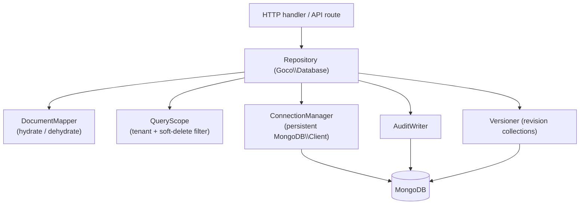
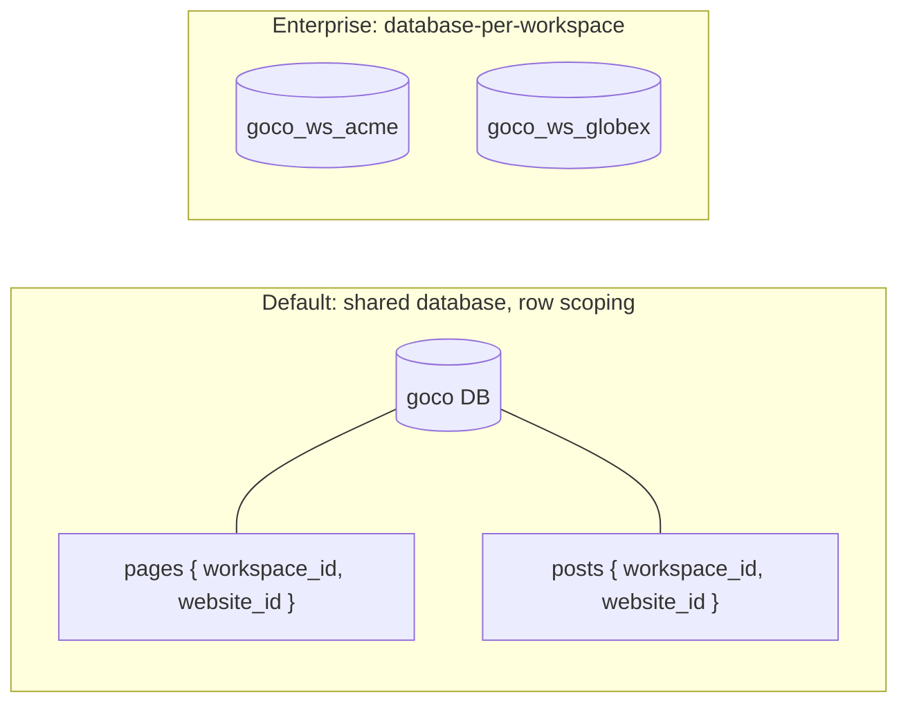

# MongoDB Data Layer

> The `Goco\Database` package (`packages/database`) — a lightweight, coroutine-safe document mapper and Repository layer over the native MongoDB PHP driver. No heavy ORM: documents in, documents out, with schema validators, transactions, soft deletes, versioning, audit logs, and multi-tenant scoping baked in.

---

## 1. Overview

GOCO CMS persists all durable state in **MongoDB**. Every deployment uses **one logical database** (default multi-tenant model) or, for enterprise isolation, **one database per workspace**. The data layer lives in `packages/database` under the `Goco\Database` namespace and is intentionally thin:

- **No Active Record, no lazy-loading proxies, no hidden N+1 magic.** You work with plain PHP arrays / typed `Document` value objects and explicit `Repository` methods.
- **Coroutine-first.** A single persistent `MongoDB\Client` per worker is shared across coroutines; per-request scoping is layered on top via `Goco\G` / `RequestContext`.
- **Convention-driven.** Every collection follows the same envelope (`_id`, timestamps, soft delete, version, audit fields) so cross-cutting features (soft delete, versioning, audit, tenancy) are handled by the base repository rather than re-implemented per collection.

> **Note** This document describes *how* the data layer works. For the authoritative catalogue of collections, fields, and indexes, see [data-model.md](./data-model.md). For full-text search providers beyond MongoDB's native text index, see [search.md](./search.md).



---

## 2. Connection & Pooling Under Coroutines

The MongoDB PHP extension (`ext-mongodb`) maintains its own internal connection pool (libmongoc) that is **coroutine-aware when hooked by OpenSwoole's runtime**. GOCO creates **one `MongoDB\Client` instance per OpenSwoole worker process**, constructed on `App::onWorkerStart`, and reuses it across every coroutine that the worker handles. Creating a client per request would be wasteful; creating one per coroutine would defeat pooling.

### 2.1 Persistent client per worker

```php
<?php
// packages/database/src/ConnectionManager.php  (excerpt)
namespace Goco\Database;

use MongoDB\Client;
use MongoDB\Database;

final class ConnectionManager
{
    private static ?Client $client = null;
    private static array $databases = [];

    public static function boot(array $config): void
    {
        // Called once from App::onWorkerStart — never inside a request coroutine.
        self::$client = new Client(
            uri: $config['uri'],                 // mongodb://mongodb:27017/?replicaSet=rs0
            uriOptions: [
                'maxPoolSize'        => (int) $config['pool']['max'],   // per worker
                'minPoolSize'        => (int) $config['pool']['min'],
                'maxIdleTimeMS'      => 60_000,
                'connectTimeoutMS'   => 5_000,
                'serverSelectionTimeoutMS' => 5_000,
                'retryWrites'        => true,
                'retryReads'         => true,
                'readPreference'     => $config['read_preference'] ?? 'primaryPreferred',
                'w'                  => 'majority',
                'journal'            => true,
            ],
            driverOptions: [
                'typeMap' => [
                    'root'     => 'array',
                    'document' => 'array',
                    'array'    => 'array',
                ],
            ],
        );
    }

    public static function client(): Client
    {
        return self::$client ?? throw new \RuntimeException(
            'ConnectionManager not booted. Call ConnectionManager::boot() in App::onWorkerStart.'
        );
    }

    public static function db(?string $name = null): Database
    {
        $name ??= TenantContext::databaseName();      // logical DB or per-workspace DB
        return self::$databases[$name] ??= self::client()->selectDatabase($name);
    }
}
```

### 2.2 Wiring into the ZealPHP worker lifecycle

```php
<?php
// app.php  (bootstrap excerpt)
require 'vendor/autoload.php';

use ZealPHP\App;
use Goco\Database\ConnectionManager;

App::superglobals(false);
$app = App::init('0.0.0.0', 8080);
$app->mode(App::MODE_COROUTINE);

App::onWorkerStart(function ($server, $workerId) {
    // One client per worker; shared by every coroutine this worker runs.
    ConnectionManager::boot(config('database'));
});

$app->run();
```

> **Warning** Never construct a `MongoDB\Client` inside a route handler. Doing so spawns a fresh libmongoc pool per request, exhausts file descriptors under load, and bypasses OpenSwoole's coroutine hook. Always go through `ConnectionManager::db()`.

### 2.3 Per-request scoping

The client is process-wide, but the **tenant context and session** are per-request. GOCO uses `Goco\G` (request-scoped storage backed by a coroutine-local `RequestContext`) to carry the resolved `workspace_id` / `website_id` and any active `MongoDB\Driver\Session` for that coroutine:

```php
<?php
// A middleware resolves the tenant from the host/router and stashes it per request.
Goco\G::set('tenant', new Goco\Database\TenantContext(
    workspaceId: $workspaceId,
    websiteId:   $websiteId,
));
// Repositories read Goco\G::get('tenant') to scope every query automatically.
```

Because `Goco\G` is coroutine-isolated (like `$_SESSION` under `ext-zealphp`), two concurrent requests handled by the same worker never leak tenant context into each other.

| Concern | Scope | Lives in |
| --- | --- | --- |
| `MongoDB\Client` + libmongoc pool | Per worker process | `ConnectionManager` (static) |
| `MongoDB\Database` handles | Per worker (memoized) | `ConnectionManager::$databases` |
| Tenant context (`workspace_id`, `website_id`) | Per request coroutine | `Goco\G` / `RequestContext` |
| `MongoDB\Driver\Session` (transactions) | Per request coroutine | `Goco\G` (transient) |

---

## 3. Document Mapper & Repository Pattern

The mapper (`Goco\Database\DocumentMapper`) converts BSON documents (as PHP arrays, per the `typeMap` above) into typed `Document` objects and back. It is a **mapper, not an ORM** — it does not track dirty state, hold identity maps, or auto-persist. Persistence is always an explicit repository call.

### 3.1 The document envelope

Every document carries a standard envelope. Tenant-scoped collections add `workspace_id` and `website_id`.

```php
<?php
// packages/database/src/Document.php  (excerpt)
namespace Goco\Database;

use MongoDB\BSON\ObjectId;
use MongoDB\BSON\UTCDateTime;

abstract class Document
{
    public ObjectId $_id;
    public UTCDateTime $created_at;
    public UTCDateTime $updated_at;
    public ?UTCDateTime $deleted_at = null;   // soft delete
    public int $version = 1;                   // optimistic + revisioning
    public ?ObjectId $created_by = null;
    public ?ObjectId $updated_by = null;

    // Tenant-scoped documents also declare:
    // public ObjectId $workspace_id;
    // public ObjectId $website_id;

    abstract public static function collection(): string;
}
```

### 3.2 The base Repository

```php
<?php
// packages/database/src/Repository.php  (excerpt)
namespace Goco\Database;

use MongoDB\Collection;
use MongoDB\BSON\ObjectId;
use MongoDB\BSON\UTCDateTime;

abstract class Repository
{
    /** @var class-string<Document> */
    protected string $documentClass;
    protected bool $tenantScoped = true;
    protected bool $softDeletes  = true;

    public function collection(): Collection
    {
        return ConnectionManager::db()->selectCollection(
            ($this->documentClass)::collection()
        );
    }

    /** Merge tenant + soft-delete filters into every read. */
    protected function scope(array $filter, bool $withTrashed = false): array
    {
        if ($this->tenantScoped) {
            $t = TenantContext::current();
            $filter['workspace_id'] = $t->workspaceId;
            $filter['website_id']   = $t->websiteId;
        }
        if ($this->softDeletes && !$withTrashed) {
            $filter['deleted_at'] = null;
        }
        return $filter;
    }

    public function find(ObjectId|string $id, bool $withTrashed = false): ?Document
    {
        $id  = $id instanceof ObjectId ? $id : new ObjectId($id);
        $doc = $this->collection()->findOne($this->scope(['_id' => $id], $withTrashed));
        return $doc ? DocumentMapper::hydrate($this->documentClass, $doc) : null;
    }

    /** @return Document[] */
    public function findBy(array $filter, array $options = []): array
    {
        $cursor = $this->collection()->find($this->scope($filter), $options);
        return array_map(
            fn ($d) => DocumentMapper::hydrate($this->documentClass, $d),
            $cursor->toArray()
        );
    }

    public function insert(array $data): ObjectId
    {
        $now  = new UTCDateTime();
        $data = array_merge($data, [
            'created_at' => $now,
            'updated_at' => $now,
            'deleted_at' => null,
            'version'    => 1,
            'created_by' => Auth::userId(),
            'updated_by' => Auth::userId(),
        ]);
        if ($this->tenantScoped) {
            $t = TenantContext::current();
            $data['workspace_id'] = $t->workspaceId;
            $data['website_id']   = $t->websiteId;
        }
        $result = $this->collection()->insertOne($data);
        Hook::dispatch(($this->documentClass)::collection() . '.created', $result->getInsertedId());
        return $result->getInsertedId();
    }

    /** Optimistic-concurrency update: bumps version, guards on expected version. */
    public function update(ObjectId $id, array $set, ?int $expectedVersion = null): bool
    {
        $filter = $this->scope(['_id' => $id]);
        if ($expectedVersion !== null) {
            $filter['version'] = $expectedVersion;
        }
        $result = $this->collection()->updateOne($filter, [
            '$set' => array_merge($set, [
                'updated_at' => new UTCDateTime(),
                'updated_by' => Auth::userId(),
            ]),
            '$inc' => ['version' => 1],
        ]);
        return $result->getModifiedCount() === 1;
    }

    public function softDelete(ObjectId $id): bool
    {
        return $this->collection()->updateOne(
            $this->scope(['_id' => $id]),
            ['$set' => [
                'deleted_at' => new UTCDateTime(),
                'updated_at' => new UTCDateTime(),
                'updated_by' => Auth::userId(),
            ]],
        )->getModifiedCount() === 1;
    }

    public function restore(ObjectId $id): bool
    {
        return $this->collection()->updateOne(
            $this->scope(['_id' => $id], withTrashed: true),
            ['$set' => ['deleted_at' => null, 'updated_at' => new UTCDateTime()]],
        )->getModifiedCount() === 1;
    }
}
```

### 3.3 A concrete repository

```php
<?php
// packages/database/src/Repositories/PageRepository.php
namespace Goco\Database\Repositories;

use Goco\Database\Repository;
use Goco\Database\Documents\Page;
use MongoDB\BSON\ObjectId;

final class PageRepository extends Repository
{
    protected string $documentClass = Page::class;

    /** @return Page[] */
    public function published(int $limit = 20): array
    {
        return $this->findBy(
            ['status' => 'published', 'published_at' => ['$lte' => new \MongoDB\BSON\UTCDateTime()]],
            ['sort' => ['published_at' => -1], 'limit' => $limit],
        );
    }

    public function bySlug(string $slug): ?Page
    {
        $doc = $this->collection()->findOne($this->scope(['slug' => $slug]));
        return $doc ? \Goco\Database\DocumentMapper::hydrate(Page::class, $doc) : null;
    }
}
```

> **Tip** Repositories are resolved through the [service container](./service-container.md) as singletons per worker. Inject them into route handlers and services rather than newing them up.

---

## 4. Collection Validators (JSON-Schema)

Every collection is created with a **`$jsonSchema` validator** so MongoDB rejects malformed writes at the server, independent of application code. Validators are declarative and versioned alongside migrations.

```javascript
// Mongo shell — validator for the `pages` collection
db.createCollection("pages", {
  validator: {
    $jsonSchema: {
      bsonType: "object",
      required: ["_id", "workspace_id", "website_id", "slug", "title",
                 "status", "created_at", "updated_at", "version"],
      additionalProperties: true,
      properties: {
        workspace_id: { bsonType: "objectId" },
        website_id:   { bsonType: "objectId" },
        slug:         { bsonType: "string", pattern: "^[a-z0-9]+(?:-[a-z0-9]+)*$" },
        title:        { bsonType: "string", minLength: 1, maxLength: 512 },
        status:       { enum: ["draft", "review", "scheduled", "published", "archived"] },
        layout_id:    { bsonType: ["objectId", "null"] },
        published_at: { bsonType: ["date", "null"] },
        deleted_at:   { bsonType: ["date", "null"] },
        version:      { bsonType: "int", minimum: 1 },
        created_at:   { bsonType: "date" },
        updated_at:   { bsonType: "date" }
      }
    }
  },
  validationLevel: "moderate",   // validate inserts + updates to valid docs
  validationAction: "error"      // reject on violation (use "warn" during rollout)
});
```

GOCO stores each collection's schema as a PHP array so migrations can create/`collMod` it and tests can assert against it:

```php
<?php
// packages/database/src/Schema/PagesSchema.php
return [
    'collection' => 'pages',
    'validationLevel'  => 'moderate',
    'validationAction' => 'error',
    'jsonSchema' => [
        'bsonType' => 'object',
        'required' => ['_id', 'workspace_id', 'website_id', 'slug', 'title',
                       'status', 'created_at', 'updated_at', 'version'],
        'properties' => [
            'slug'   => ['bsonType' => 'string', 'pattern' => '^[a-z0-9]+(?:-[a-z0-9]+)*$'],
            'status' => ['enum' => ['draft', 'review', 'scheduled', 'published', 'archived']],
            // ...
        ],
    ],
];
```

> **Note** Use `validationLevel: "moderate"` and `validationAction: "warn"` when introducing a validator to an existing collection, then tighten to `strict`/`error` after backfilling. Application-level validation (form/property schemas) still runs first for friendly error messages; the server validator is the last line of defense.

---

## 5. Aggregation Pipelines for Reporting

Read models, dashboards, and analytics use **aggregation pipelines** rather than pulling documents into PHP and looping. Pipelines run server-side, use indexes, and stream results.

```php
<?php
// Content report: published pages per author for the current website, last 30 days.
$pipeline = [
    ['$match' => [
        'workspace_id' => $tenant->workspaceId,
        'website_id'   => $tenant->websiteId,
        'status'       => 'published',
        'deleted_at'   => null,
        'published_at' => ['$gte' => new UTCDateTime((time() - 30 * 86400) * 1000)],
    ]],
    ['$group' => [
        '_id'         => '$created_by',
        'total'       => ['$sum' => 1],
        'last_publish'=> ['$max' => '$published_at'],
    ]],
    ['$lookup' => [
        'from'         => 'users',
        'localField'   => '_id',
        'foreignField' => '_id',
        'as'           => 'author',
    ]],
    ['$unwind' => '$author'],
    ['$project' => [
        'author_name' => '$author.display_name',
        'total'       => 1,
        'last_publish'=> 1,
    ]],
    ['$sort' => ['total' => -1]],
];

$rows = ConnectionManager::db()
    ->selectCollection('pages')
    ->aggregate($pipeline, ['allowDiskUse' => true])
    ->toArray();
```

Common reporting patterns:

| Goal | Key stages |
| --- | --- |
| Time-series (posts/day) | `$match` → `$group` on `$dateTrunc` → `$sort` |
| Faceted dashboard (counts by status + by author in one pass) | `$facet` |
| Cross-collection joins | `$lookup` (+ `$unwind` for 1:1) |
| Top-N with rollups | `$group` → `$sort` → `$limit` |
| Full-text scored search | `$search` (Atlas) or `$match` on `$text` |

> **Tip** Wrap heavyweight reporting aggregations in a Redis-cached read model (see [caching-and-queue.md](./caching-and-queue.md)) and refresh them from a queued job or an `App::tick()` timer rather than on every request.

---

## 6. Multi-Document Transactions

MongoDB supports **ACID multi-document transactions** on replica sets. GOCO uses them only where a cross-collection invariant must hold — e.g. publishing a page while writing its revision and an audit record, or deleting a workspace and cascading tenant markers.

```php
<?php
// packages/database/src/TransactionManager.php  (excerpt)
namespace Goco\Database;

use MongoDB\Driver\Session;

final class TransactionManager
{
    /**
     * Runs $work inside a transaction with automatic retry on
     * TransientTransactionError / UnknownTransactionCommitResult.
     */
    public static function run(callable $work): mixed
    {
        $client  = ConnectionManager::client();
        $session = $client->startSession();
        Goco\G::set('mongo.session', $session);   // repositories pick this up
        try {
            return $session->withTransaction(
                fn (Session $s) => $work($s),
                [
                    'readConcern'    => new \MongoDB\Driver\ReadConcern('snapshot'),
                    'writeConcern'   => new \MongoDB\Driver\WriteConcern('majority'),
                    'readPreference' => new \MongoDB\Driver\ReadPreference('primary'),
                ],
            );
        } finally {
            Goco\G::forget('mongo.session');
            $session->endSession();
        }
    }
}
```

Usage — publish a page atomically with its revision and audit log:

```php
<?php
TransactionManager::run(function ($session) use ($pageId, $tenant) {
    $db = ConnectionManager::db();

    $page = $db->selectCollection('pages')->findOneAndUpdate(
        ['_id' => $pageId, 'workspace_id' => $tenant->workspaceId],
        ['$set' => ['status' => 'published', 'published_at' => new UTCDateTime()],
         '$inc' => ['version' => 1]],
        ['session' => $session, 'returnDocument' => \MongoDB\Operation\FindOneAndUpdate::RETURN_DOCUMENT_AFTER],
    );

    $db->selectCollection('page_revisions')->insertOne([
        'page_id'    => $pageId,
        'version'    => $page['version'],
        'snapshot'   => $page,
        'reason'     => 'publish',
        'created_at' => new UTCDateTime(),
        'created_by' => Auth::userId(),
        'workspace_id' => $tenant->workspaceId,
        'website_id'   => $tenant->websiteId,
    ], ['session' => $session]);

    $db->selectCollection('audit_logs')->insertOne([
        'action'      => 'page.published',
        'resource'    => ['type' => 'page', 'id' => $pageId],
        'actor'       => Auth::userId(),
        'created_at'  => new UTCDateTime(),
        'workspace_id'=> $tenant->workspaceId,
        'website_id'  => $tenant->websiteId,
    ], ['session' => $session]);
});
```

> **Warning** Transactions require a replica set. The Docker `mongodb` service must be started with `--replSet rs0` and initiated (`rs.initiate()`); the single-node dev setup still forms a one-member replica set so transactions work locally. Keep transactions short — hold no external I/O (HTTP, mailer) inside `withTransaction`.

---

## 7. Indexing Strategy

Indexes are declared in migrations and documented per collection in [data-model.md](./data-model.md). GOCO uses five index shapes:

| Type | Purpose | Example |
| --- | --- | --- |
| **Single-field** | Point lookups, sort keys | `{ slug: 1 }` |
| **Compound** | Tenant scoping + filter/sort (order matters) | `{ workspace_id: 1, website_id: 1, status: 1, published_at: -1 }` |
| **Unique / partial** | Enforce uniqueness among live docs only | `{ website_id: 1, slug: 1 }` unique, partial on `deleted_at: null` |
| **Text** | Native full-text search | `{ title: "text", body: "text" }` |
| **TTL** | Auto-expire ephemeral docs | `{ expires_at: 1 }`, `expireAfterSeconds: 0` |

```javascript
// Tenant-first compound index — always lead with the scoping keys.
db.pages.createIndex(
  { workspace_id: 1, website_id: 1, status: 1, published_at: -1 },
  { name: "tenant_status_published" }
);

// Uniqueness among non-deleted docs only (partial index).
db.pages.createIndex(
  { website_id: 1, slug: 1 },
  { unique: true, partialFilterExpression: { deleted_at: null }, name: "uniq_slug_live" }
);

// TTL — expire idempotency keys / one-time tokens automatically.
db.jobs.createIndex({ expires_at: 1 }, { expireAfterSeconds: 0, name: "ttl_expires" });

// Text search across page content.
db.pages.createIndex(
  { title: "text", excerpt: "text", body: "text" },
  { weights: { title: 10, excerpt: 5, body: 1 }, default_language: "english", name: "text_content" }
);
```

Rules of thumb:

- **Lead every tenant-scoped index with `workspace_id, website_id`** so the tenant filter uses the index prefix (ESR: Equality, Sort, Range).
- **Partial indexes on `deleted_at: null`** keep uniqueness constraints from colliding with soft-deleted rows and shrink the index.
- Build indexes with `background`/rolling builds in production; MongoDB 4.2+ builds are non-blocking by default but still plan capacity.
- Verify plans with `explain('executionStats')` in tests; assert `IXSCAN`, not `COLLSCAN`, on hot paths.

---

## 8. Soft Deletes

Deletion is **logical by default**: `deleted_at` is stamped with a `UTCDateTime` and every read filter adds `deleted_at: null` (see `Repository::scope`). Benefits: trash/restore UX, referential safety, audit continuity.

- `softDelete()` / `restore()` toggle `deleted_at`.
- `findBy(..., withTrashed: true)` (via the `$withTrashed` flag) bypasses the filter for admin trash views.
- **Hard deletes** are reserved for GDPR erasure and TTL-driven cleanup, and always emit an `audit_logs` entry.
- Uniqueness is preserved via **partial indexes** (Section 7) so a new doc can reuse a soft-deleted doc's `slug`.

```php
<?php
$pages->softDelete($id);                        // sets deleted_at
$pages->restore($id);                           // clears deleted_at
$trashed = $pages->findBy([], ['limit' => 50], withTrashed: true); // trash view
```

---

## 9. Versioning & Revision Collections

GOCO combines two mechanisms:

1. **Optimistic concurrency** — every document has an integer `version`, incremented on each update. `Repository::update()` accepts an `$expectedVersion`; a mismatch means someone else wrote first, so the update returns `false` and the caller re-reads (last-writer-does-not-silently-win).
2. **Revision snapshots** — content collections mirror into a `_revisions` sibling (`page_revisions`, `post_revisions`). Each snapshot stores the full document plus `version`, `reason`, and actor, enabling diff, rollback, and scheduled/draft workflows.

```php
<?php
// packages/database/src/Versioner.php  (excerpt)
namespace Goco\Database;

final class Versioner
{
    public static function snapshot(string $collection, array $document, string $reason): void
    {
        ConnectionManager::db()
            ->selectCollection($collection . '_revisions')
            ->insertOne([
                (rtrim($collection, 's') . '_id') => $document['_id'],
                'version'      => $document['version'],
                'reason'       => $reason,           // draft | autosave | publish | rollback
                'snapshot'     => $document,
                'created_at'   => new \MongoDB\BSON\UTCDateTime(),
                'created_by'   => Auth::userId(),
                'workspace_id' => $document['workspace_id'] ?? null,
                'website_id'   => $document['website_id'] ?? null,
            ]);
    }

    public static function rollback(string $collection, \MongoDB\BSON\ObjectId $id, int $toVersion): void
    {
        TransactionManager::run(function ($session) use ($collection, $id, $toVersion) {
            $db  = ConnectionManager::db();
            $rev = $db->selectCollection($collection . '_revisions')
                      ->findOne(['{$col}_id' => $id, 'version' => $toVersion], ['session' => $session]);
            // ...restore snapshot into the live doc, bump version, snapshot the rollback...
        });
    }
}
```

> **Tip** Cap revision history per document (e.g. keep last N + all `publish` snapshots) via a queued pruning job. Store diffs, not just snapshots, for large bodies if storage becomes a concern.

---

## 10. Audit Logs

Every state-changing operation of consequence writes to the `audit_logs` collection: who did what, to which resource, when, and from where. Audit writes are **append-only** and, when part of an invariant, participate in the same transaction as the change they record (Section 6).

```php
<?php
// packages/database/src/AuditWriter.php  (excerpt)
AuditWriter::record(
    action:   'plugin.activated',              // action.verb[.tense]
    resource: ['type' => 'plugin', 'id' => $pluginId, 'slug' => 'seo-toolkit'],
    actor:    Auth::userId(),
    context:  ['ip' => Goco\G::get('client_ip'), 'user_agent' => Goco\G::get('user_agent')],
    changes:  ['before' => $before, 'after' => $after],
);
```

Audit document shape:

```json
{
  "_id": "ObjectId(...)",
  "action": "page.published",
  "resource": { "type": "page", "id": "ObjectId(...)", "slug": "about-us" },
  "actor": "ObjectId(...)",
  "context": { "ip": "203.0.113.7", "user_agent": "Mozilla/5.0 ..." },
  "changes": { "before": { "status": "draft" }, "after": { "status": "published" } },
  "workspace_id": "ObjectId(...)",
  "website_id": "ObjectId(...)",
  "created_at": "2026-07-18T09:14:22.031Z"
}
```

Audit logs pair with the [event & hook system](./event-hook-system.md): a global listener on `*.published`, `*.deleted`, `plugin.activated`, `user.login`, etc. records audits without each service re-implementing the write. Consider a TTL index or archival job for retention policy compliance.

---

## 11. Full-Text Search

The data layer ships a native option and integrates with pluggable providers. See [search.md](./search.md) for the full provider matrix and configuration.

| Option | When to use | How |
| --- | --- | --- |
| **MongoDB text index** | Small/medium sites, zero extra infra | `$text` query on a `text` index (Section 7) |
| **MongoDB Atlas Search** | Managed Atlas deployments, relevance tuning, autocomplete | `$search` aggregation stage (Lucene-backed) |
| **Meilisearch / OpenSearch** | Typo-tolerance, facets, instant-search at scale | External provider via `Goco\Search` interface; Mongo remains source of truth |

```php
<?php
// Native text search fallback (no external provider configured).
$results = ConnectionManager::db()->selectCollection('pages')->find(
    ['$text' => ['$search' => $query], 'deleted_at' => null,
     'workspace_id' => $tenant->workspaceId, 'website_id' => $tenant->websiteId],
    ['projection' => ['score' => ['$meta' => 'textScore'], 'title' => 1, 'slug' => 1],
     'sort'       => ['score' => ['$meta' => 'textScore']],
     'limit'      => 20],
)->toArray();
```

When an external provider is active, the source of truth stays in MongoDB; documents are projected into the search index by queued indexing jobs listening on `content.published` / `content.updated` hooks.

---

## 12. Migrations & Seeding

Schema (validators) and indexes are code, applied by the `goco` CLI. Migrations are ordered, idempotent, and tracked in a `migrations` collection so each runs once per database (and once per workspace DB in the enterprise model).

### 12.1 Migration files

```php
<?php
// packages/database/migrations/2026_02_01_000300_create_pages.php
namespace Goco\Database\Migrations;

use Goco\Database\Migration;
use Goco\Database\Blueprint;

return new class extends Migration {
    public function up(Blueprint $schema): void
    {
        $schema->createCollection('pages', jsonSchema: require __DIR__.'/../src/Schema/PagesSchema.php');

        $schema->index('pages', ['workspace_id' => 1, 'website_id' => 1, 'status' => 1, 'published_at' => -1],
            ['name' => 'tenant_status_published']);
        $schema->index('pages', ['website_id' => 1, 'slug' => 1],
            ['unique' => true, 'partialFilterExpression' => ['deleted_at' => null], 'name' => 'uniq_slug_live']);
        $schema->index('pages', ['title' => 'text', 'excerpt' => 'text', 'body' => 'text'],
            ['weights' => ['title' => 10, 'excerpt' => 5, 'body' => 1], 'name' => 'text_content']);
    }

    public function down(Blueprint $schema): void
    {
        $schema->dropCollection('pages');
    }
};
```

### 12.2 Running migrations & seeds

```bash
# Apply all pending migrations (creates collections, validators, indexes)
goco migrate

# Preview without writing
goco migrate --dry-run

# Roll back the last batch
goco migrate:rollback

# Enterprise: run migrations for every workspace database
goco migrate --all-workspaces

# Reset + re-seed a dev database
goco migrate:fresh --seed

# Seed reference/demo data (roles, default theme, sample workspace/website/pages)
goco db:seed
goco db:seed --class=DemoContentSeeder
```

Seeders are plain classes that use repositories, so tenant scoping, timestamps, and validators all apply exactly as they do at runtime:

```php
<?php
// packages/database/seeders/RolesSeeder.php
namespace Goco\Database\Seeders;

final class RolesSeeder extends \Goco\Database\Seeder
{
    public function run(): void
    {
        foreach (['owner', 'super-admin', 'website-admin', 'developer', 'designer',
                  'editor', 'author', 'seo-manager', 'marketing', 'moderator',
                  'support', 'viewer', 'guest'] as $slug) {
            $this->roles->upsert(['slug' => $slug], ['capabilities' => Capabilities::for($slug)]);
        }
    }
}
```

> **Note** Migrations run against the `mongodb` Docker service. In CI and on first boot, `goco migrate` runs as an init step before the `gococms` service accepts traffic (see [deployment/docker.md](../deployment/docker.md)). Never mutate validators or drop indexes by hand in production — always through a tracked migration.

---

## 13. Multi-Tenant Query Scoping

GOCO supports two isolation models; the data layer abstracts both behind `TenantContext`.



| Model | Isolation | Scoping mechanism | Trade-off |
| --- | --- | --- | --- |
| **Shared DB (default)** | Logical | Every tenant doc carries `workspace_id` + `website_id`; base repository injects both into all reads/writes | One backup, easy cross-tenant analytics; relies on discipline + indexes |
| **Database-per-workspace (enterprise)** | Physical | `TenantContext::databaseName()` resolves to `goco_ws_<slug>`; `ConnectionManager::db()` selects it | Hard isolation, per-tenant backup/restore; more databases to migrate & operate |

```php
<?php
// packages/database/src/TenantContext.php  (excerpt)
namespace Goco\Database;

final class TenantContext
{
    public function __construct(
        public readonly \MongoDB\BSON\ObjectId $workspaceId,
        public readonly \MongoDB\BSON\ObjectId $websiteId,
        public readonly ?string $workspaceSlug = null,
    ) {}

    public static function current(): self
    {
        return Goco\G::get('tenant') ?? throw new \RuntimeException('No tenant context resolved for this request.');
    }

    /** Shared model -> single logical DB. Enterprise -> per-workspace DB. */
    public static function databaseName(): string
    {
        if (config('database.per_workspace') && ($t = Goco\G::get('tenant'))?->workspaceSlug) {
            return 'goco_ws_' . $t->workspaceSlug;
        }
        return config('database.name', 'goco');
    }
}
```

Because `scope()` in the base repository is the *only* place tenant filters are applied, adding a new tenant-scoped collection needs no bespoke isolation logic — it inherits scoping for free. Cross-tenant operations (platform admin) use dedicated **unscoped** repositories (`$tenantScoped = false`) that require an explicit `owner`/`super-admin` capability, enforced by the [permission system](./permission-system.md).

> **Warning** A missing `workspace_id`/`website_id` on a tenant-scoped write is a security defect, not a convenience. The JSON-Schema validator marks both as `required`, so such writes are rejected server-side even if the application layer is bypassed.

---

## 14. Configuration

```env
# .env — database layer
DB_URI=mongodb://mongodb:27017/?replicaSet=rs0
DB_NAME=goco
DB_PER_WORKSPACE=false
DB_POOL_MIN=4
DB_POOL_MAX=64
DB_READ_PREFERENCE=primaryPreferred
DB_WRITE_CONCERN=majority
```

```php
<?php
// config/database.php
return [
    'uri'             => env('DB_URI', 'mongodb://mongodb:27017/?replicaSet=rs0'),
    'name'            => env('DB_NAME', 'goco'),
    'per_workspace'   => env('DB_PER_WORKSPACE', false),
    'read_preference' => env('DB_READ_PREFERENCE', 'primaryPreferred'),
    'pool'            => [
        'min' => (int) env('DB_POOL_MIN', 4),
        'max' => (int) env('DB_POOL_MAX', 64),
    ],
];
```

See [getting-started/configuration.md](../getting-started/configuration.md) and the [configuration reference](../reference/configuration-reference.md) for the complete key list.

---

## 15. Testing Strategy

- **Repository tests** run against a real MongoDB (dockerized ephemeral instance / `mongodb-memory-server` equivalent), never mocks — the driver's BSON behavior matters.
- Each test seeds a fresh tenant and asserts scoping: a document written under workspace A must be invisible to a repository resolved for workspace B.
- **Index assertions**: `explain('executionStats')` on hot queries must report `IXSCAN` and `totalDocsExamined` close to `nReturned`.
- **Validator tests**: assert that a deliberately malformed insert throws a `MongoDB\Driver\Exception\BulkWriteException` (document failed validation).
- **Transaction tests**: force a `TransientTransactionError` and confirm `withTransaction` retries and ultimately commits or fully rolls back.

See [community/testing-strategy.md](../community/testing-strategy.md) for the project-wide approach.

---

## 16. Performance Notes

- **Projection**: fetch only needed fields; never `SELECT *` the body of a page for a list view.
- **`$lookup` sparingly**: prefer maintaining denormalized read models refreshed by hooks/queues over per-request joins on hot paths.
- **Batching**: use `insertMany` / `bulkWrite` for import and migration workloads.
- **`allowDiskUse`** only for genuine reporting aggregations; keep interactive queries in-memory and index-covered.
- **Coroutine concurrency**: independent reads can run in parallel via `go()` + an `OpenSwoole\Coroutine\Channel`; the shared client and libmongoc pool make this safe. Cache hot read models in Redis (see [caching-and-queue.md](./caching-and-queue.md)).

---

## Related

- [Data Model (Collections & Indexes)](./data-model.md)
- [Search](./search.md)
- [Caching, Queue & Realtime (Redis)](./caching-and-queue.md)
- [Multi-Tenancy](./multi-tenancy.md)
- [Permission System (RBAC + ABAC)](./permission-system.md)
- [Event & Hook System](./event-hook-system.md)
- [Service Container & Dependency Injection](./service-container.md)
- [Architecture Overview](./overview.md)
- [ZealPHP Foundation](./zealphp-foundation.md)
- [Docker Architecture](../deployment/docker.md)
- [Configuration](../getting-started/configuration.md)
- [CLI Reference](../reference/cli-reference.md)
- [Documentation Index](../README.md)
