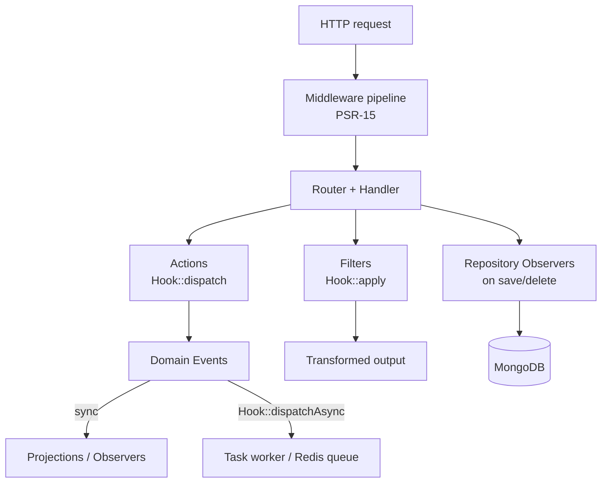
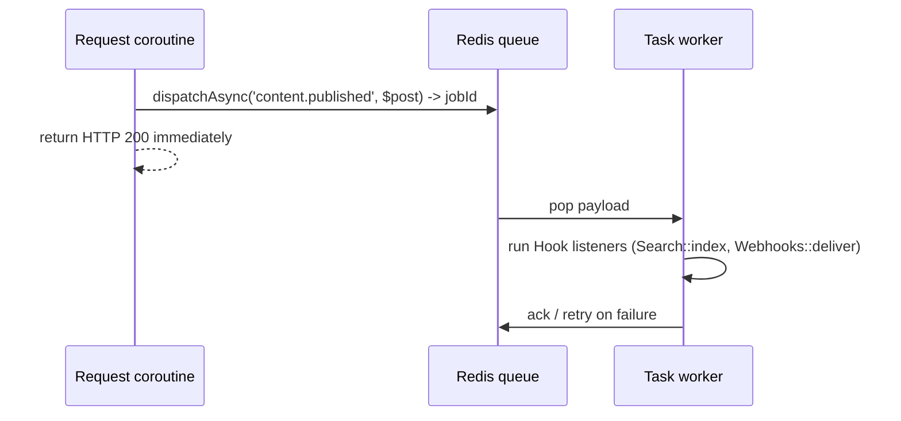

# Event & Hook System

> The extensibility backbone of GOCO CMS: a unified, priority-ordered hook layer that lets widgets, themes, and plugins observe side effects (Actions), transform values (Filters), react to domain Events, intercept requests (Middleware), and watch entity lifecycles (Observers) — without patching the core.

Stability: `stable`

The Event & Hook System is how GOCO CMS keeps a **lightweight core** while supporting an open ecosystem. Every meaningful moment in the runtime — a request arriving, a page rendering, content publishing, a user logging in — is announced through a well-named hook. Extensions **listen**, **transform**, or **react** at those points. This document defines the mental model, the exact `Goco\SDK\Hook` facade API, naming conventions, the core hook catalog, and the semantics that make hooks safe under OpenSwoole coroutines and asynchronous task workers.

---

## 1. The Five Extension Mechanisms

GOCO deliberately separates five distinct extensibility primitives. Choosing the right one keeps extensions predictable and performant.

| Mechanism | Question it answers | Returns a value? | Runs sync/async | Facade / Interface | Typical use |
|-----------|---------------------|------------------|-----------------|--------------------|-------------|
| **Action** | "Something happened — do you want to react?" | No (fire-and-forget) | Sync (or async via task worker) | `Hook::dispatch` / `Hook::listen` | Send email on publish, warm cache, write audit log |
| **Filter** | "Here is a value — do you want to change it?" | Yes (transformed value flows on) | Sync only (in the hot path) | `Hook::apply` / `Hook::filter` | Rewrite a page title, inject menu items, mutate query criteria |
| **Domain Event** | "A business fact occurred in an aggregate." | No | Sync dispatch, usually async handlers | `Goco\Events\DomainEvent` + `Hook::dispatchAsync` | `PagePublished`, `UserRegistered`; drives projections, integrations |
| **Middleware** | "Should I intercept/modify the HTTP request or response?" | Yes (a PSR-7 response) | Sync, per-request pipeline | `\ZealPHP\Middleware\MiddlewareInterface` | CORS, CSRF, rate limiting, auth gate, ETag |
| **Observer** | "Watch this collection/aggregate's lifecycle." | No | Sync at repository boundary | `Goco\Database\ObserverInterface` | Stamp `updated_by`, bump `version`, cascade soft-delete |

> **Note**
> Actions vs. Filters is the single most important distinction. **If your callback's job is to change a value that the core will then use, it is a Filter.** If your callback performs a side effect and the core does not read anything back from you, it is an Action. Never perform side effects inside a filter, and never mutate shared state that another filter depends on.

### How they relate



Middleware wraps the request. Inside a handler, the core **dispatches Actions** for reactions and **applies Filters** to shape data. High-level business facts are also published as **Domain Events**, which may be handled synchronously (projections) or offloaded via `Hook::dispatchAsync` to a **task worker** backed by Redis. Repository **Observers** enforce data-layer invariants at the MongoDB boundary.

---

## 2. The `Hook` Facade API

The public surface is `Goco\SDK\Hook`. It is intentionally small and stable. Every signature below is authoritative — use these exact shapes everywhere.

```php
<?php
namespace Goco\SDK;

final class Hook
{
    // ---- Actions (side effects) ----
    public static function listen(string $action, callable $cb, int $priority = 10): void;
    public static function on(string $action, callable $cb, int $priority = 10): void;      // alias of listen
    public static function dispatch(string $action, mixed ...$args): void;
    public static function do(string $action, mixed ...$args): void;                          // alias of dispatch
    public static function dispatchAsync(string $action, mixed ...$args): string;             // returns a job id

    // ---- Filters (transform a value) ----
    public static function filter(string $name, callable $cb, int $priority = 10): void;
    public static function apply(string $name, mixed $value, mixed ...$args): mixed;

    // ---- Introspection & removal ----
    public static function remove(string $hook, callable $cb, ?int $priority = null): bool;
    public static function removeAll(string $hook): void;
    public static function has(string $hook): bool;
    public static function listeners(string $hook): array;   // ordered [priority => callable[]]
    public static function dispatched(string $action): int;  // how many times fired this request
}
```

> **Note**
> `on`/`do` are ergonomic aliases (WordPress-familiar, Laravel-free). `listen`/`dispatch`/`filter`/`apply` are the canonical names used in the core. Pick one style per project and stay consistent; they are fully interchangeable.

### 2.1 Actions — listen and dispatch

An Action announces that something happened. Listeners run in priority order; their return values are ignored.

```php
use Goco\SDK\Hook;

// Register during plugin boot.
Hook::listen('user.login', function (array $user, string $ip): void {
    Hook::dispatch('audit.write', [
        'event'   => 'user.login',
        'user_id' => $user['_id'],
        'ip'      => $ip,
    ]);
}, priority: 20);

// The core fires it after a successful authentication.
Hook::dispatch('user.login', $user, $request->clientIp());
```

Lower `priority` runs earlier (default `10`). Two listeners at the same priority run in registration order (FIFO).

### 2.2 Filters — filter and apply

A Filter receives a value, optionally transforms it, and **must return a value of the same type**. The returned value is threaded into the next filter and finally back to the core.

```php
use Goco\SDK\Hook;

// Append the site name to every page title.
Hook::filter('page.title', function (string $title, array $page): string {
    return $title . ' — ' . config('site.name');
}, priority: 50);

// The renderer applies the filter and uses whatever comes back.
$title = Hook::apply('page.title', $page['title'], $page);
```

Extra arguments after the value (`$page` above) are **context only** — they are passed to every filter but are not threaded. Only the first argument (the value) is transformed and returned.

> **Warning**
> A filter that returns `null`, the wrong type, or nothing will break the chain. GOCO wraps each filter in a type guard: if a filter returns a type incompatible with the incoming value, the return is discarded, the original value is preserved, and a warning is logged (`hook.filter.type_mismatch`). Never rely on this recovery — it exists to contain buggy third-party filters.

### 2.3 Removing listeners

```php
$cb = fn (array $u) => notify($u);
Hook::listen('user.login', $cb, 30);

// Remove a specific callback (optionally at a specific priority):
Hook::remove('user.login', $cb, 30);

// Remove everything registered for a hook (use sparingly — plugin conflicts):
Hook::removeAll('page.title');
```

Removal requires the **same callable reference**. Closures are compared by identity, so keep a reference if you intend to remove one. For invokable classes and `[$obj, 'method']` arrays, identity is structural. Prefer named handlers over anonymous closures when a hook must be removable.

### 2.4 Asynchronous dispatch

`Hook::dispatchAsync` enqueues the action instead of running its listeners inline. It returns a **job id** and pushes the payload onto a Redis-backed queue drained by OpenSwoole **task workers** (see [Caching, Queue & Realtime](caching-and-queue.md)).

```php
// Fire-and-forget: the request returns immediately; handlers run out-of-band.
$jobId = Hook::dispatchAsync('content.published', $post);

// Listeners are the SAME ones registered with Hook::listen(). They simply
// execute in a task worker context instead of the request coroutine.
Hook::listen('content.published', function (array $post): void {
    Search::index('posts', $post);       // reindex — potentially slow
    Webhooks::deliver('content.published', $post);
});
```

Async handlers must be **serializable-argument-safe**: arguments are JSON-encoded onto the queue, so pass plain arrays/scalars/document ids, never live connections or closures-as-data. Failed async jobs follow the queue's retry/back-off and dead-letter policy.



---

## 3. Naming Conventions

Consistent names are what make a hundred plugins interoperate. GOCO enforces two grammars, checked by `goco lint:hooks` and the CI coding-standards gate (see [Coding Standards](../community/coding-standards.md)).

### 3.1 Actions — `subject.verb[.tense]`

The **subject** is a noun (domain concept); the **verb** describes what happened; an optional **tense** distinguishes *before* from *after*.

- Present participle for "about to happen" (cancelable/observe-before): `page.rendering`, `content.publishing`.
- Past tense for "already happened" (react-after): `page.rendered`, `content.published`, `plugin.activated`, `user.login`.
- `.before` / `.after` suffixes for fine-grained pairs around a single operation: `widget.render.before`, `widget.render.after`.

### 3.2 Filters — `subject.noun`

A filter names the **thing being transformed**, not an event: `page.title`, `widget.output`, `menu.items`, `query.criteria`, `response.headers`. Read it as "give me the *page title*, filtered."

### 3.3 Namespacing plugin hooks

Core hooks use bare subjects (`page.*`, `user.*`). **Plugin-defined** hooks MUST be prefixed with the plugin slug to avoid collisions:

```php
// In the "shop" plugin:
Hook::dispatch('shop.order.placed', $order);
$total = Hook::apply('shop.cart.total', $subtotal, $cart);
```

| Kind | Pattern | Good | Bad |
|------|---------|------|-----|
| Core action | `subject.verb[.tense]` | `content.published` | `publishContent`, `onPublish` |
| Core filter | `subject.noun` | `menu.items` | `filter_menu`, `getMenu` |
| Plugin action | `slug.subject.verb` | `shop.order.placed` | `order.placed` (unnamespaced) |
| Plugin filter | `slug.subject.noun` | `seo.meta.tags` | `meta.tags` (unnamespaced) |

---

## 4. Core Hook Catalog

The following hooks are part of the stable public contract. Removing or renaming any of these is a **breaking change** governed by the deprecation policy in [Upgrade Strategy](#16-upgrade-strategy).

### 4.1 Actions

| Action | Fired when | Arguments | Tense / stability |
|--------|-----------|-----------|-------------------|
| `core.boot` | Framework booted, services registered, before serving | `(App $app)` | after · `stable` |
| `request.received` | A request enters after middleware, before routing | `(Request $req)` | after · `stable` |
| `page.rendering` | Page resolved, before layout composition | `(array $page, Context $ctx)` | before · `stable` |
| `page.rendered` | Final HTML produced, before response flush | `(string $html, array $page, Context $ctx)` | after · `stable` |
| `content.publishing` | A page/post transitions toward `published` | `(array $doc, array $prev)` | before · `stable` |
| `content.published` | Content is now live (revision committed) | `(array $doc)` | after · `stable` |
| `widget.render.before` | Immediately before a widget renders | `(string $type, array $props, Context $ctx)` | before · `stable` |
| `widget.render.after` | Immediately after a widget renders | `(string $type, string $output, array $props)` | after · `stable` |
| `plugin.activated` | A plugin finished install + boot | `(string $slug, array $manifest)` | after · `stable` |
| `user.login` | Successful authentication | `(array $user, string $ip)` | after · `stable` |

### 4.2 Filters

| Filter | Value transformed | Signature | Stability |
|--------|-------------------|-----------|-----------|
| `page.title` | The `<title>` / H1 text | `(string $title, array $page): string` | `stable` |
| `widget.output` | Rendered widget HTML | `(string $html, string $type, array $props): string` | `stable` |
| `menu.items` | Resolved menu tree | `(array $items, string $menuSlug): array` | `stable` |
| `query.criteria` | MongoDB filter before a repository read | `(array $criteria, string $collection, Context $ctx): array` | `stable` |
| `response.headers` | Outgoing HTTP headers | `(array $headers, Request $req): array` | `stable` |

> **Tip**
> `query.criteria` is the primary lever for multi-tenancy and row-level security: the core injects `workspace_id`/`website_id` here, and a permission plugin can further constrain reads. See [Multi-Tenancy](multi-tenancy.md) and [Permission System](permission-system.md).

---

## 5. Ordering & Priority

Both actions and filters honor an integer `priority` (default `10`). **Lower runs first.** Same-priority callbacks run in registration (FIFO) order.

```php
Hook::filter('page.title', fn ($t) => trim($t),        5);   // runs 1st (normalize)
Hook::filter('page.title', fn ($t) => ucwords($t),    10);   // runs 2nd
Hook::filter('page.title', fn ($t) => $t.' | Blog',   90);   // runs last (branding)
```

Recommended priority bands (convention, not enforced):

| Band | Range | Purpose |
|------|-------|---------|
| Early | `0–20` | Normalization, sanitization, tenant scoping |
| Default | `10` | Ordinary feature logic |
| Late | `50–80` | Presentation, branding, enrichment |
| Last | `90–100` | Final overrides, caching, hard guarantees |

> **Note**
> Never depend on a *specific* numeric priority of another plugin — depend only on relative ordering (earlier/later). Use dependency metadata in the plugin manifest if you require another plugin's handler to have run first.

---

## 6. Idempotency, Error Isolation & Guarantees

### 6.1 Error isolation

Each listener/filter is invoked inside a guarded call. If a callback throws:

- **Actions:** the exception is caught, logged (`hook.listener.error` with hook name, plugin slug, stack), and dispatch **continues** to the next listener. One bad plugin cannot abort a publish or a login.
- **Filters:** the exception is caught, the **input value is preserved unchanged** for the next filter, and the error is logged. The chain never returns a partially-broken value.
- **Middleware & Observers:** these run in the request/data critical path and are **not** silently swallowed — an uncaught error surfaces as a 5xx (middleware) or aborts the transaction (observer), because correctness outranks isolation there.

Strict mode (`hooks.strict=true` in config, recommended for CI/tests) re-throws so bugs are caught early. See [Configuration](../getting-started/configuration.md).

### 6.2 Idempotency

Async and retryable handlers may run **more than once** (at-least-once delivery). Design handlers to be idempotent:

```php
Hook::listen('content.published', function (array $post): void {
    // Idempotent: upsert keyed by document id, not blind insert.
    Search::upsert('posts', $post['_id'], $post);
    Notifications::once("published:{$post['_id']}:{$post['version']}", fn () =>
        Mailer::send(/* ... */)
    );
});
```

Use the document `version` field and Redis dedupe keys to make effects safe under retry.

### 6.3 Re-entrancy & loop protection

Dispatching a hook from inside its own listener can loop. The dispatcher tracks the active hook stack per request coroutine and refuses to re-enter the same hook beyond a configurable depth (`hooks.max_depth`, default `32`), logging `hook.recursion.blocked`. Prefer emitting a *different*, more specific hook rather than re-firing the same one.

---

## 7. Concurrency & Coroutine Safety

GOCO runs on OpenSwoole. Hook registration and dispatch must be safe across coroutines and workers.

- **Registration** (`listen`/`filter`) happens during boot and plugin activation, on the main coroutine, into a per-worker registry. It is **not** meant to be mutated mid-request from concurrent coroutines.
- **Dispatch** is read-only against the registry, so many request coroutines can dispatch the same hook concurrently without locking.
- **Per-request context** flows via `\ZealPHP\G` / `RequestContext`; never stash request-scoped data in a static hook property — it will bleed across coroutines. Pass it as a hook argument instead.
- **Cross-worker signaling** uses `\ZealPHP\Store` pub/sub or Redis, not the hook registry (each worker has its own registry).

```php
use ZealPHP\App;

App::onWorkerStart(function ($server, $wid) {
    // Register hooks once per worker; runs when the worker spins up.
    require_once __DIR__ . '/hooks.php';

    // Periodic maintenance driven by a timer, not by request hooks.
    App::tick(60000, fn () => Hook::dispatch('cron.minute'));
});
```

---

## 8. Domain Events (higher-level)

Above raw hooks, GOCO models important business facts as immutable **Domain Events** (`Goco\Events\DomainEvent`). They are typed value objects emitted by aggregates and bridged onto the hook bus so both worlds interoperate.

```php
namespace Goco\Events;

final class PagePublished extends DomainEvent
{
    public function __construct(
        public readonly string $pageId,
        public readonly string $websiteId,
        public readonly int $version,
        public readonly \DateTimeImmutable $occurredAt,
    ) {}

    public function hook(): string { return 'content.published'; }
}
```

When an aggregate records a `PagePublished`, the event bus:

1. Persists it to the `audit_logs` collection (event sourcing / traceability).
2. Runs **synchronous** projection handlers (e.g., update sitemap counters, invalidate caches).
3. Offloads **slow** handlers via `Hook::dispatchAsync` (reindex, webhooks, email).

This gives you a typed, self-documenting API (`PagePublished`) *and* the loose coupling of the string-based hook catalog. See [Data Model](data-model.md) for `audit_logs` structure.

---

## 9. Middleware vs. Hooks

Middleware is the **HTTP boundary** extension point; hooks are the **application logic** extension point. Do not reimplement one with the other.

```php
use ZealPHP\App;

$app = App::init('0.0.0.0', 8080);

// HTTP concerns -> middleware (PSR-15).
$app->addMiddleware(new \ZealPHP\Middleware\CorsMiddleware());
$app->addMiddleware(new \ZealPHP\Middleware\CsrfMiddleware());
$app->addMiddleware(new \ZealPHP\Middleware\RateLimitMiddleware(limit: 120, window: 60));

// Application concerns -> hooks.
Hook::listen('request.received', function ($req) {
    Metrics::increment('requests', ['path' => $req->path()]);
});
```

| Use middleware when… | Use a hook when… |
|----------------------|------------------|
| You must inspect/modify raw HTTP (headers, body, status) | You react to a domain moment (published, logged in) |
| You need to short-circuit with a response (auth gate, 429) | You need to transform an application value (title, menu) |
| The concern is cross-cutting for every route | The concern is feature/plugin specific |

Custom middleware implements `MiddlewareInterface::process()`; see [ZealPHP Foundation](zealphp-foundation.md) and [Routing](../core/routing.md).

---

## 10. Observers (data-layer lifecycle)

Observers attach to a repository/collection and fire around persistence operations. They enforce the invariants every document carries (`updated_at`, `updated_by`, `version`, soft-delete) and run **inside** the MongoDB transaction, so a throwing observer rolls the write back.

```php
namespace Goco\Database;

final class StampingObserver implements ObserverInterface
{
    public function saving(Document $doc, Context $ctx): void
    {
        $doc->set('updated_at', now());
        $doc->set('updated_by', $ctx->userId());
        $doc->increment('version');
    }

    public function deleting(Document $doc, Context $ctx): void
    {
        // Soft delete, not physical removal.
        $doc->set('deleted_at', now());
    }
}

Repository::for('pages')->observe(new StampingObserver());
```

Observers differ from `content.publishing` action hooks: observers are guaranteed, transactional, and low-level (every save); hooks are higher-level and error-isolated. Use observers for **data invariants**, hooks for **business reactions**. See [MongoDB Data Layer](database-mongodb.md).

---

## 11. Worked Example: A Complete Plugin

A "reading time" plugin that touches all mechanisms cohesively.

```php
<?php
use Goco\SDK\{Plugin, Hook};

Plugin::register('reading-time', [
    'name'    => 'Reading Time',
    'version' => '1.0.0',
]);

Plugin::boot('reading-time', function () {

    // FILTER: enrich every post's rendered body with an estimate.
    Hook::filter('widget.output', function (string $html, string $type): string {
        if ($type !== 'post-body') {
            return $html;                       // untouched for other widgets
        }
        $words   = str_word_count(strip_tags($html));
        $minutes = max(1, (int) ceil($words / 200));
        return "<p class=\"reading-time\">{$minutes} min read</p>" . $html;
    }, priority: 40);

    // ACTION (async): precompute + cache on publish so reads are cheap.
    Hook::listen('content.published', function (array $post): void {
        $minutes = max(1, (int) ceil(str_word_count(strip_tags($post['body'])) / 200));
        Cache::put("reading-time:{$post['_id']}:{$post['version']}", $minutes, ttl: 86400);
        Hook::dispatch('reading-time.computed', $post['_id'], $minutes);   // namespaced plugin hook
    });
});
```

Publishing triggers the async-friendly action; rendering applies the sync filter; the plugin exposes its own namespaced hook (`reading-time.computed`) for others to build on. See the [Plugin SDK](../sdk/plugin-sdk.md) and [Plugin Guide](../guides/plugin-guide.md).

---

## 12. Performance

Hook dispatch is on the hot path, so the implementation is engineered for near-zero overhead when nobody is listening.

- **Empty-hook fast path:** `Hook::has()` is an O(1) map lookup; `dispatch`/`apply` return immediately if no listeners are registered — a bare hook costs a single array probe.
- **Precompiled ordering:** listener lists are sorted by priority once at registration (or lazily on first dispatch) and cached, not re-sorted per call.
- **Filters must stay pure and fast:** they run synchronously inside rendering. Do no I/O in a filter — cache in Redis at write time (via an action) and read from cache in the filter.
- **Offload heavy work:** anything touching the network, search index, or email belongs in `Hook::dispatchAsync`, not inline.
- **Coroutine yielding:** async handlers run in task workers; long CPU work should `co::sleep()`/yield to avoid starving the worker.

Benchmark budget (guidance): a request should spend `< 1 ms` total in hook dispatch overhead excluding listener bodies. `goco bench:hooks` reports per-hook dispatch counts and cumulative time; watch `Hook::dispatched('page.rendering')` counts to catch accidental repeated dispatch.

---

## 13. Testing Hooks

```php
use Goco\Testing\HookSpy;

it('appends site name to page titles', function () {
    Hook::filter('page.title', fn ($t) => "$t — GOCO");

    $out = Hook::apply('page.title', 'Home', ['_id' => 'p1']);

    expect($out)->toBe('Home — GOCO');
});

it('fires content.published exactly once on publish', function () {
    $spy = HookSpy::record('content.published');

    $this->publishPage('p1');

    expect($spy->count())->toBe(1)
        ->and($spy->firstArg()['_id'])->toBe('p1');
});
```

`HookSpy` records dispatches/applies without side effects; enable `hooks.strict=true` in the test config so listener exceptions fail the test instead of being swallowed. Full guidance in [Testing Strategy](../community/testing-strategy.md).

---

## 14. Debugging & Introspection

```bash
# List every registered listener/filter, ordered by priority, with source plugin.
goco hooks:list

# Trace dispatches for a single request (writes to /tmp/zealphp/hooks.log).
goco hooks:trace --hook page.rendered

# Lint hook names against the naming grammar.
goco lint:hooks
```

```php
// Programmatic introspection.
Hook::has('page.title');          // bool
Hook::listeners('page.title');    // [10 => [Closure, ...], 40 => [...]]
Hook::dispatched('user.login');   // int, this request
```

Runtime logs live under `/tmp/zealphp/`; hook errors carry the offending plugin slug so a misbehaving extension is easy to pinpoint.

---

## 15. Anti-Patterns

> **Warning**
> The following will get an extension rejected from the [Marketplace](../marketplace/overview.md) review.

- **Side effects in filters.** A `page.title` filter that writes to the DB or sends a request. Filters transform; actions react.
- **Unnamespaced plugin hooks.** `Hook::dispatch('order.placed')` from a plugin — always prefix with your slug.
- **Depending on absolute priorities.** Hard-coding `priority: 11` to "just beat" another plugin. Model dependencies explicitly.
- **Blocking work inline.** Reindexing or emailing inside a synchronous listener. Use `dispatchAsync`.
- **Static request state.** Storing per-request data on a static property — it bleeds across coroutines. Use `RequestContext`.
- **Non-idempotent async handlers.** Blind inserts in a handler that may be retried. Upsert by id + `version`.

---

## 16. Upgrade Strategy

Hook names are a public API governed by SemVer (pre-1.0: minor bumps may add hooks; breaking changes are documented in the [Changelog](../changelog.md)).

- **Adding** a hook is backward compatible.
- **Renaming/removing** requires a deprecation cycle: the old hook keeps firing alongside the new one for one minor version, emitting `hook.deprecated` with a pointer to the replacement.
- **Signature changes** append arguments (never reorder/remove positional args within a stable major); new context is passed as trailing arguments so existing callbacks keep working via reflection-based argument binding.

```php
// Deprecation shim the core installs automatically.
Hook::listen('post.published', function (...$args) {                  // old name
    trigger_deprecation('goco', '0.9', 'Use "content.published".');
    Hook::dispatch('content.published', ...$args);                    // new name
});
```

---

## 17. Related

- [Hook SDK](../sdk/hook-sdk.md) — full facade reference and recipes
- [Architecture Overview](overview.md) — where the hook bus sits
- [Request Lifecycle](request-lifecycle.md) — when core hooks fire during a request
- [ZealPHP Foundation](zealphp-foundation.md) — middleware, coroutines, workers
- [Caching, Queue & Realtime (Redis)](caching-and-queue.md) — task workers behind `dispatchAsync`
- [MongoDB Data Layer](database-mongodb.md) — repository observers
- [Multi-Tenancy](multi-tenancy.md) & [Permission System](permission-system.md) — `query.criteria` in practice
- [Plugin SDK](../sdk/plugin-sdk.md) · [Plugin Guide](../guides/plugin-guide.md) — building with hooks
- [Coding Standards](../community/coding-standards.md) · [Testing Strategy](../community/testing-strategy.md)
- [Documentation Index](../README.md)
