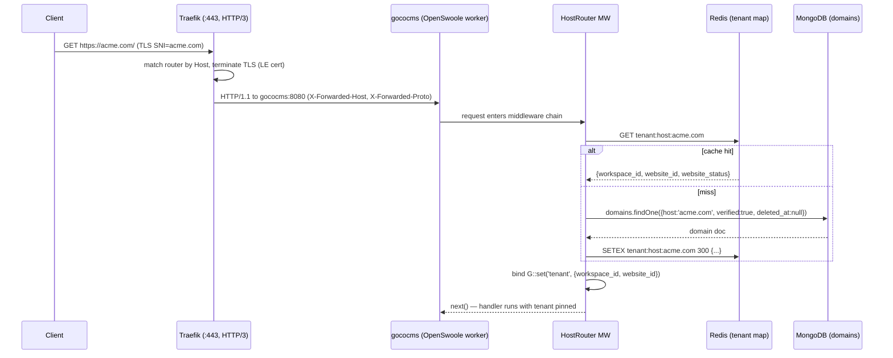
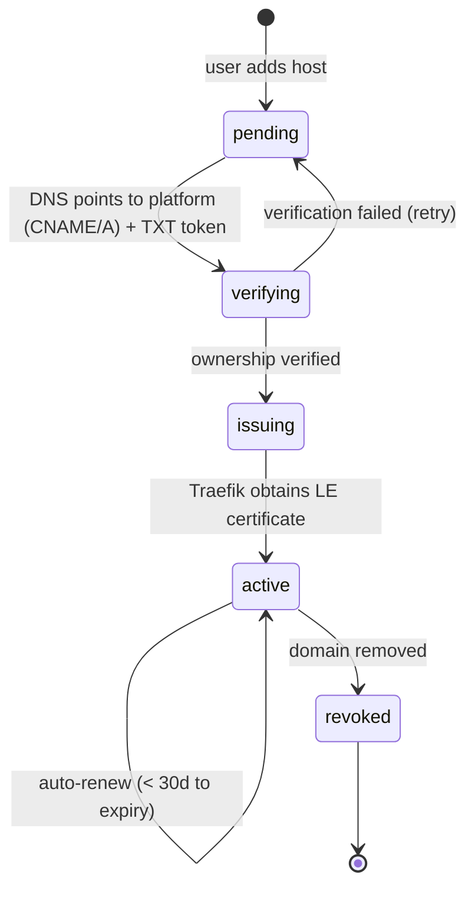
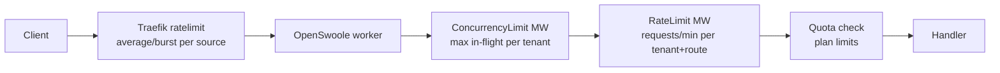
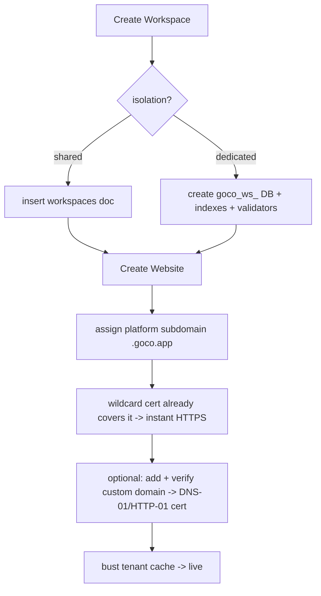

# Multi-Tenancy

> How GOCO CMS isolates thousands of Workspaces, Websites, and custom domains on a single ZealPHP/OpenSwoole runtime — resolving `Host` to a tenant, scoping every MongoDB query, and partitioning cache, storage, search, and quotas so no tenant can see, starve, or poison another.

Multi-tenancy is a first-class property of GOCO, not a bolt-on. A single deployment (one OpenSwoole master, N worker processes, one logical MongoDB database, one Redis cluster) serves many isolated tenants. This document defines the tenant model, how a request is mapped to a tenant, the two supported data-isolation strategies and their tradeoffs, custom domains with automatic wildcard TLS, per-tenant partitioning of every shared resource, noisy-neighbor controls, and the repository-layer guarantees that prevent cross-tenant leakage.

Stability: the shared-collection strategy is `stable`; database-per-workspace is `beta`.

---

## 1. Tenant Model

GOCO has a strict containment hierarchy. Two levels of it — **Workspace** and **Website** — are the tenancy boundaries; everything below is content structure.

```
Workspace  ─┬─ billing, quotas, member roster, plan            (tenancy boundary #1)
            └─ Website ─┬─ Domain(s), Theme, settings, content  (tenancy boundary #2)
                        └─ Theme → Layout → Section → Container → Row → Column → Widget
```

| Entity | Role in tenancy | Key fields |
| --- | --- | --- |
| **Workspace** | Top-level tenant / billing unit / isolation domain. Owns members, roles, plan, quotas. | `_id`, `slug`, `plan`, `quota`, `status` |
| **Website** | A publishable site inside a workspace. The unit a `Host` resolves to. | `_id`, `workspace_id`, `slug`, `primary_domain`, `status` |
| **Domain** | A hostname routed to exactly one website. Zero or many per website; exactly one `primary`. | `_id`, `workspace_id`, `website_id`, `host`, `type`, `tls_status`, `verified` |

> **Note** — Membership and roles are scoped **per (workspace, website)**. A user may be `website-admin` on one site and `viewer` on another within the same workspace. See [Permission System](permission-system.md).

The active tenant for a request is the pair **`(workspace_id, website_id)`**. This pair is resolved once at ingress, pinned into per-request state, and consulted by every downstream service, repository, cache key, storage path, and search index.

---

## 2. Tenant Resolution: Host → Website → Workspace

Resolution is a two-stage pipeline: **Traefik** decides which container and which certificate a TLS request lands on, then the GOCO **HostRouter middleware** maps the validated `Host` header to a tenant tuple and pins it for the lifetime of the request coroutine.



### 2.1 Traefik stage (edge)

Traefik is the sole reverse proxy (never Nginx/Apache). It matches an incoming request to a **router** by `Host(...)` rule, terminates TLS with the matching Let's Encrypt certificate, and forwards to the `gococms` service. A single catch-all router plus per-tenant routers coexist; see [Traefik Reverse Proxy](../deployment/traefik.md).

```yaml
# docker/compose.yml (excerpt) — gococms service labels
services:
  gococms:
    image: gococms/core:latest
    labels:
      - "traefik.enable=true"
      # Catch-all: every host GOCO knows about is proxied to the app.
      - "traefik.http.routers.goco.rule=HostRegexp(`{host:.+}`)"
      - "traefik.http.routers.goco.entrypoints=websecure"
      - "traefik.http.routers.goco.tls=true"
      - "traefik.http.routers.goco.tls.certresolver=letsencrypt"
      # Preserve original Host so HostRouter can resolve the tenant.
      - "traefik.http.services.goco.loadbalancer.server.port=8080"
      - "traefik.http.services.goco.loadbalancer.passhostheader=true"
      # Noisy-neighbor guard at the edge (see §7).
      - "traefik.http.middlewares.goco-ratelimit.ratelimit.average=100"
      - "traefik.http.middlewares.goco-ratelimit.ratelimit.burst=200"
      - "traefik.http.routers.goco.middlewares=goco-ratelimit@docker"
    healthcheck:
      test: ["CMD", "php", "app.php", "status"]
      interval: 15s
      timeout: 5s
      retries: 5
    restart: unless-stopped
```

> **Warning** — Always set `passhostheader=true`. If Traefik rewrites `Host`, the HostRouter cannot distinguish tenants and every request would resolve to the wrong (or no) website.

### 2.2 GOCO HostRouter stage (application)

`HostRouter` is a ZealPHP PSR-15 middleware registered early in the chain. It reads the effective host (`X-Forwarded-Host` when behind Traefik, else `Host`), looks it up in a Redis-backed tenant map, falls back to MongoDB on a miss, and pins the resolved tuple into per-request state via `\ZealPHP\G`.

```php
<?php
namespace Goco\Tenancy\Middleware;

use Goco\Tenancy\TenantResolver;
use Psr\Http\Message\ServerRequestInterface as Request;
use Psr\Http\Message\ResponseInterface as Response;
use Psr\Http\Server\{MiddlewareInterface, RequestHandlerInterface as Handler};

final class HostRouter implements MiddlewareInterface
{
    public function __construct(private TenantResolver $resolver) {}

    public function process(Request $request, Handler $handler): Response
    {
        $host = $this->effectiveHost($request);           // strips port, lowercases
        $tenant = $this->resolver->resolve($host);         // Redis -> Mongo fallback

        if ($tenant === null) {
            // Unknown host: serve the platform 404, never leak another tenant.
            return $this->resolver->unknownHostResponse($host);
        }
        if ($tenant->websiteStatus === 'suspended') {
            return $this->resolver->suspendedResponse($tenant);
        }

        // Pin for the lifetime of THIS request coroutine (isolated per coroutine).
        \ZealPHP\G::set('tenant', $tenant);
        \ZealPHP\G::set('workspace_id', $tenant->workspaceId);
        \ZealPHP\G::set('website_id', $tenant->websiteId);

        return $handler->handle($request);
    }

    private function effectiveHost(Request $request): string
    {
        $fwd = $request->getHeaderLine('X-Forwarded-Host');
        $host = $fwd !== '' ? $fwd : $request->getHeaderLine('Host');
        return strtolower(explode(':', $host, 2)[0]);
    }
}
```

```php
<?php
// Registration in app.php, after autoload/bootstrap.
require 'vendor/autoload.php';
use ZealPHP\App;

App::superglobals(false);
$app = App::init('0.0.0.0', 8080);
App::mode(App::MODE_COROUTINE);

$app->addMiddleware(new \Goco\Tenancy\Middleware\HostRouter(
    new \Goco\Tenancy\TenantResolver()
));
// ... other middleware (Csrf, RateLimit, ConcurrencyLimit) registered after.
$app->run();
```

The `TenantResolver` cache read/write:

```php
<?php
namespace Goco\Tenancy;

use Goco\Database\Repository\DomainRepository;

final class TenantResolver
{
    private const TTL = 300; // 5 min; invalidated on domain.verified / website.suspended

    public function __construct(
        private \Redis $redis = new \Redis(),
        private DomainRepository $domains = new DomainRepository(),
    ) {}

    public function resolve(string $host): ?Tenant
    {
        $key = "tenant:host:{$host}";
        if ($raw = $this->redis->get($key)) {
            return Tenant::fromArray(json_decode($raw, true));
        }
        // NOTE: this repository call is intentionally UN-scoped — it is the ONE
        // query allowed to cross tenants, precisely so it can discover the tenant.
        $domain = $this->domains->resolveHost($host);      // {host, verified:true, deleted_at:null}
        if ($domain === null) {
            $this->redis->setex($key, 30, 'null');         // negative cache, short TTL
            return null;
        }
        $tenant = Tenant::fromDomain($domain);
        $this->redis->setex($key, self::TTL, json_encode($tenant->toArray()));
        return $tenant;
    }
}
```

> **Tip** — Cache invalidation is event-driven. `Hook::listen('domain.verified', ...)`, `'domain.deleted'`, `'website.suspended'`, and `'website.deleted'` all `DEL tenant:host:*` for the affected host, so a newly verified custom domain resolves within one request.

---

## 3. Data Isolation Strategies

GOCO supports two isolation models. The default suits the vast majority of deployments; the enterprise model exists for hard compliance or heavy per-tenant load.

### 3.1 Default — shared collections discriminated by `workspace_id` / `website_id`

One logical MongoDB database per deployment. Tenant-scoped documents carry `workspace_id` and `website_id`; every read/write is filtered by them. Non-tenant collections (`workspaces`, `users`, global `sessions`) are naturally global or workspace-only.

```javascript
// pages document shape (mongo shell)
{
  _id: ObjectId("..."),
  workspace_id: ObjectId("..."),   // tenancy discriminator #1  (required, indexed)
  website_id:   ObjectId("..."),   // tenancy discriminator #2  (required, indexed)
  slug: "about",
  title: "About Us",
  status: "published",
  version: 7,
  created_at: ISODate("..."), updated_at: ISODate("..."), deleted_at: null,
  created_by: ObjectId("..."), updated_by: ObjectId("...")
}
```

Every tenant-scoped collection uses a **compound index led by the tenant keys** so scoped queries are index-covered and can never table-scan across tenants:

```javascript
// Documented indexes — created by scripts/indexes.js at deploy time.
db.pages.createIndex({ website_id: 1, slug: 1 },              { unique: true, partialFilterExpression: { deleted_at: null } });
db.pages.createIndex({ workspace_id: 1, website_id: 1, status: 1, updated_at: -1 });
db.posts.createIndex({ website_id: 1, slug: 1 },              { unique: true, partialFilterExpression: { deleted_at: null } });
db.media.createIndex({ workspace_id: 1, website_id: 1, created_at: -1 });
db.audit_logs.createIndex({ workspace_id: 1, created_at: -1 });
// JSON-Schema validator makes the discriminators non-optional.
db.runCommand({ collMod: "pages", validator: { $jsonSchema: {
  bsonType: "object", required: ["workspace_id", "website_id", "slug", "status"],
  properties: { workspace_id: { bsonType: "objectId" }, website_id: { bsonType: "objectId" } }
}}});
```

**Pros:** cheapest to operate (one connection pool, one backup, one migration run); trivial cross-tenant analytics for the platform operator; instant tenant provisioning (insert two documents). **Cons:** isolation is enforced in software (see §8); a very large tenant shares indexes with small ones; a schema migration touches all tenants at once.

### 3.2 Enterprise — database-per-workspace

Each workspace gets its own MongoDB database (`goco_ws_<workspace_id>`), selected by a connection router keyed on `workspace_id`. Website-level discrimination (`website_id`) still applies inside that database.

```php
<?php
namespace Goco\Database;

final class ConnectionRouter
{
    /** Resolve the physical DB for the pinned tenant. */
    public function databaseFor(string $workspaceId): \MongoDB\Database
    {
        $plan = Workspace::isolationPlan($workspaceId);   // 'shared' | 'dedicated'
        $name = $plan === 'dedicated'
            ? "goco_ws_{$workspaceId}"                     // enterprise: physical DB
            : "goco";                                      // default: shared logical DB
        return $this->client->selectDatabase($name);
    }
}
```

**Pros:** physical separation for compliance (data residency, per-tenant encryption keys, per-tenant backup/restore and point-in-time recovery); a heavy tenant can be sharded or moved to its own cluster; blast radius of a bad migration is one tenant. **Cons:** more connections and RAM (per-DB WiredTiger cache), slower provisioning, no cheap cross-tenant aggregation, more operational surface.

### 3.3 Choosing a strategy

| Concern | Shared collections (default) | Database-per-workspace (enterprise) |
| --- | --- | --- |
| Isolation enforcement | Software (repository scoping + indexes) | Physical (separate database) |
| Provisioning cost | Insert 2 docs (ms) | Create DB + indexes + validators |
| Per-tenant backup/PITR | Filtered export | Native `mongodump` per DB |
| Cross-tenant analytics | Single aggregation | Fan-out / warehouse |
| Migration blast radius | All tenants | One tenant |
| Best for | SaaS long tail, most sites | Regulated / very large / isolated SLAs |

> **Note** — The strategy is a per-workspace attribute (`workspaces.isolation = "shared" | "dedicated"`). Application code is identical; only `ConnectionRouter.databaseFor()` differs. A workspace can be migrated from shared to dedicated with an online copy job.

---

## 4. Custom Domains & Automatic Wildcard TLS

A website is reachable on: a platform subdomain (`acme.goco.app`, covered by a wildcard cert), and any number of verified **custom domains** (`www.acme.com`).

### 4.1 Domain lifecycle



1. **Add** — operator creates a `domains` document (`type: "custom"`, `verified: false`) and is shown a DNS TXT verification token plus the target (CNAME to `edge.goco.app` or A record).
2. **Verify** — a background job (`jobs` collection) resolves the TXT record; on success sets `verified: true` and dispatches `Hook::dispatch('domain.verified', $domain)`, which busts the Redis tenant cache.
3. **Certificate** — Traefik requests a Let's Encrypt certificate for the host. Because Traefik is the certresolver owner, no application code touches ACME.

### 4.2 Wildcard TLS via DNS-01 challenge

Platform subdomains use a **wildcard certificate** (`*.goco.app`), which Let's Encrypt only issues over the **DNS-01** challenge. Custom apex/single hosts use HTTP-01 or DNS-01. Traefik config:

```yaml
# docker/traefik/traefik.yml (static config)
certificatesResolvers:
  letsencrypt:
    acme:
      email: ops@goco.app
      storage: /letsencrypt/acme.json
      # DNS-01 for wildcards; provider credentials via env (see below).
      dnsChallenge:
        provider: cloudflare
        resolvers: ["1.1.1.1:53", "8.8.8.8:53"]

entryPoints:
  websecure:
    address: ":443"
    http3: {}          # HTTP/3 (QUIC) enabled
    http:
      tls:
        certResolver: letsencrypt
        domains:
          - main: "goco.app"
            sans: ["*.goco.app"]   # wildcard cert requested once, reused per subdomain
```

```env
# docker/.env — DNS provider credentials consumed by Traefik for DNS-01.
CF_DNS_API_TOKEN=__redacted__
TRAEFIK_ACME_EMAIL=ops@goco.app
GOCO_PLATFORM_DOMAIN=goco.app
```

> **Tip** — Wildcard means new tenant subdomains need **no** per-host certificate issuance — they are instantly HTTPS-ready. Only custom domains trigger a per-host ACME order, which the `domain.verified` hook kicks off by adding the Traefik router.

Per-custom-domain routers are attached dynamically. GOCO writes a Traefik dynamic-configuration fragment (file provider) when a domain is verified:

```yaml
# Generated at /etc/traefik/dynamic/tenant-<website_id>.yml on domain.verified
http:
  routers:
    site-acme:
      rule: "Host(`www.acme.com`) || Host(`acme.com`)"
      entryPoints: ["websecure"]
      service: "goco"
      tls:
        certResolver: letsencrypt
      middlewares: ["goco-ratelimit@docker", "security-headers@file"]
```

---

## 5. Per-Tenant Resource Partitioning

Every shared subsystem is namespaced by the tenant tuple so tenants never collide. A single helper produces the canonical prefix.

```php
<?php
namespace Goco\Tenancy;

final class TenantKey
{
    /** e.g. ws:64f..:site:70a..  — used as a prefix for every shared resource. */
    public static function prefix(?Tenant $t = null): string
    {
        $t ??= \ZealPHP\G::get('tenant');
        return "ws:{$t->workspaceId}:site:{$t->websiteId}";
    }
}
```

| Resource | Backend | Partitioning scheme |
| --- | --- | --- |
| **Cache** | Redis | Keys prefixed `ws:<wid>:site:<sid>:cache:<name>`; flush a tenant with a keyspace scan/`UNLINK`. |
| **Sessions** | Redis | `ws:<wid>:sess:<sid_token>`; a session is bound to one workspace. |
| **Rate limits** | Redis | Counter `ws:<wid>:site:<sid>:rl:<route>` per fixed/sliding window. |
| **Locks** | Redis | `ws:<wid>:lock:<name>` (SET NX PX); never a global lock name. |
| **Storage** | Local / MinIO / S3 | Object key prefix `<workspace_id>/<website_id>/media/...` inside one bucket. |
| **Search** | Meili / OpenSearch / Atlas | One index per website: `goco_<website_id>` (or a shared index filtered by `website_id`). |
| **Queue / jobs** | Redis + `jobs` collection | Every job payload carries `workspace_id`/`website_id`; workers re-pin tenant before execution. |

### 5.1 Cache keys

```php
<?php
use Goco\Cache\Cache;                 // thin Redis wrapper

// Automatically prefixed with TenantKey::prefix() — impossible to read another
// tenant's cached page fragment.
$html = Cache::remember("page:{$slug}", 300, fn() => Renderer::page($slug));
// Physical key: ws:64f..:site:70a..:cache:page:about
```

### 5.2 Storage prefixes

```php
<?php
namespace Goco\Storage;

final class MediaPath
{
    // <workspace_id>/<website_id>/media/2026/07/<uuid>.<ext>
    public static function for(string $filename): string
    {
        $t = \ZealPHP\G::get('tenant');
        $date = date('Y/m');
        return "{$t->workspaceId}/{$t->websiteId}/media/{$date}/" .
               \Ramsey\Uuid\Uuid::uuid7()->toString() . '.' . pathinfo($filename, PATHINFO_EXTENSION);
    }
}
```

The active storage driver (Local, MinIO, or S3) enforces the prefix at write time and refuses reads outside the pinned tenant's prefix. See [Storage & Media](storage.md).

### 5.3 Search indexes

```php
<?php
namespace Goco\Search;

interface SearchProvider {
    public function indexName(string $websiteId): string; // "goco_<website_id>"
    public function upsert(string $websiteId, array $doc): void;
    public function query(string $websiteId, string $q, array $filters = []): array;
}
```

One physical index per website (Meilisearch/OpenSearch) or one shared index with a mandatory `website_id` filter (Atlas Search) — the provider interface hides the choice. See [Search](search.md).

---

## 6. Per-Tenant Configuration & Quotas

Workspace-level `quota` and website-level `settings` live in MongoDB and are cached in Redis. Quotas are enforced at the point of resource creation and by middleware at ingress.

```javascript
// workspaces document (excerpt)
{
  _id: ObjectId("..."),
  slug: "acme",
  plan: "business",
  isolation: "shared",                 // or "dedicated"
  quota: {
    websites_max: 25,
    storage_bytes_max: 53687091200,    // 50 GiB
    bandwidth_bytes_month: 1099511627776,
    requests_per_minute: 600,          // feeds RateLimit MW
    concurrent_requests: 40,           // feeds ConcurrencyLimit MW
    search_docs_max: 500000,
    ai_tokens_month: 5000000
  },
  status: "active"                     // active | suspended | pending_deletion
}
```

Usage is tracked with atomic counters and rolled up nightly:

```php
<?php
use ZealPHP\Counter;

// Atomic per-tenant usage counter in shared memory / Redis backend.
$counter = new Counter(0);            // Store::defaultBackend(Store::BACKEND_REDIS) for cross-worker
$counter->increment();                // e.g. request or media-upload count
```

---

## 7. Noisy-Neighbor Controls

Isolation of *data* is not enough — one tenant must not exhaust CPU, connections, or bandwidth for others. GOCO applies limits at three layers.



### 7.1 Edge (Traefik)

`ratelimit` middleware caps request rate per source IP before traffic reaches the app (shown in §2.1). This absorbs volumetric abuse cheaply.

### 7.2 Application (ZealPHP middleware)

The built-in `ConcurrencyLimit` and `RateLimit` middleware are configured **per tenant** using the pinned tuple and the workspace quota.

```php
<?php
use ZealPHP\Middleware\{ConcurrencyLimit, RateLimit};

// Cap simultaneous in-flight requests per tenant (protects worker pool & Mongo pool).
$app->addMiddleware(new ConcurrencyLimit(
    keyResolver: fn($req) => 'conc:' . \ZealPHP\G::get('workspace_id'),
    limit: fn($req) => Workspace::quota()->concurrent_requests,   // e.g. 40
    onLimit: 429
));

// Sliding-window request cap per tenant, backed by Redis counters.
$app->addMiddleware(new RateLimit(
    keyResolver: fn($req) => 'rl:' . \ZealPHP\G::get('workspace_id'),
    window: 60,                                                    // seconds
    max: fn($req) => Workspace::quota()->requests_per_minute,      // e.g. 600
    store: RateLimit::STORE_REDIS,
    headers: true                                                  // emit X-RateLimit-* + Retry-After
));
```

Order matters: `HostRouter` runs first (it pins the tenant the limiters key on), then `ConcurrencyLimit`, then `RateLimit`, then `Csrf`, then the handler. A tenant hitting its ceiling receives `429` with `Retry-After` while other tenants are untouched.

### 7.3 Resource fairness

- **MongoDB connection pool** — a shared, bounded pool; `ConcurrencyLimit` prevents any tenant from monopolizing it. Enterprise (dedicated-DB) tenants get their own pool.
- **AI / long jobs** — routed through the Redis queue with per-workspace concurrency, so a batch import never blocks interactive traffic (see [Caching, Queue & Realtime](caching-and-queue.md)).
- **CPU-heavy renders** — cached per tenant (§5.1); `co::sleep()`-based streaming yields the coroutine so one slow response does not pin a worker.

---

## 8. Security: Cross-Tenant Leakage Prevention

The core guarantee: **every tenant-scoped query is filtered by the pinned tuple, enforced in the repository layer — not left to callers.** A developer literally cannot write an un-scoped query through the normal API.

### 8.1 Repository auto-scoping

`Goco\Database` repositories inject the pinned tenant into every filter. There is no public method that skips scoping.

```php
<?php
namespace Goco\Database\Repository;

abstract class TenantRepository extends Repository
{
    /** Merge the pinned tenant into EVERY filter. Called by find/update/delete. */
    protected function scope(array $filter): array
    {
        $t = \ZealPHP\G::get('tenant');
        if ($t === null) {
            // Fail closed: no tenant pinned => refuse, never run un-scoped.
            throw new \Goco\Tenancy\NoTenantContextException();
        }
        return array_merge($filter, [
            'workspace_id' => $t->workspaceId,
            'website_id'   => $t->websiteId,
            'deleted_at'   => null,
        ]);
    }

    public function find(array $filter): array   { return $this->collection->find($this->scope($filter))->toArray(); }
    public function findOne(array $filter): ?array { return $this->collection->findOne($this->scope($filter)); }
    public function update(array $filter, array $set): int
    {
        // scope() also protects writes: an update can only touch the pinned tenant.
        return $this->collection->updateMany($this->scope($filter),
            ['$set' => $set + ['updated_at' => new \MongoDB\BSON\UTCDateTime()]])->getModifiedCount();
    }
    public function insert(array $doc): string
    {
        $t = \ZealPHP\G::get('tenant') ?? throw new \Goco\Tenancy\NoTenantContextException();
        $doc += ['workspace_id' => $t->workspaceId, 'website_id' => $t->websiteId];
        return (string) $this->collection->insertOne($doc)->getInsertedId();
    }
}
```

```php
<?php
// Application code never passes workspace_id/website_id — it cannot forget them.
$page = (new PageRepository())->findOne(['slug' => 'about']);
// Executed filter: {slug:'about', workspace_id:.., website_id:.., deleted_at:null}
```

### 8.2 Defence in depth

| Layer | Control |
| --- | --- |
| Ingress | `HostRouter` pins tuple; unknown host → platform 404, never another tenant. |
| Query | `TenantRepository.scope()` fails **closed** if no tenant is pinned (`NoTenantContextException`). |
| Index | Tenant-led compound indexes + unique partial indexes keyed on `website_id`, so a duplicate slug in another site is legal but a scoped query is index-covered. |
| Schema | JSON-Schema validators mark `workspace_id`/`website_id` required — no document can be written without them. |
| Cache/Storage/Search | All keys/paths/indexes prefixed by tenant (§5); a cache/storage read cannot address another tenant. |
| Authorization | Capabilities checked per (workspace, website) after scoping — see [Permission System](permission-system.md) and [Security Model](../security/security-model.md). |
| Audit | Every mutation writes `audit_logs` with `workspace_id` + actor; cross-tenant anomalies are detectable. |
| The one exception | `TenantResolver.resolveHost()` is the sole un-scoped query. It is `private`, read-only, and touches only `domains` — audited and reviewed. |

> **Warning** — Coroutine safety is essential. Because OpenSwoole multiplexes requests, tenant state **must** live in `\ZealPHP\G` / `RequestContext` (per-coroutine isolated), never in a static/global variable. A tenant stored in a plain `static` field would bleed across concurrent requests. All GOCO tenancy code uses `G::set`/`G::get`.

### 8.3 Testing the boundary

Every repository ships a leakage test: seed two tenants, pin tenant A, assert a query for tenant B's document returns nothing; assert an insert with no pinned tenant throws. See [Testing Strategy](../community/testing-strategy.md).

```php
<?php
public function test_query_cannot_cross_tenant(): void
{
    $this->seedPage($this->tenantB, slug: 'secret');
    \ZealPHP\G::set('tenant', $this->tenantA);
    $this->assertNull((new PageRepository())->findOne(['slug' => 'secret']));
}

public function test_missing_tenant_fails_closed(): void
{
    \ZealPHP\G::set('tenant', null);
    $this->expectException(\Goco\Tenancy\NoTenantContextException::class);
    (new PageRepository())->findOne(['slug' => 'about']);
}
```

---

## 9. Cluster & High-Availability Notes

Multi-tenancy is orthogonal to scaling out — the same tenant model works on one node or many. Key points for a clustered deployment:

- **Stateless workers** — all shared tenant state (tenant map, sessions, locks, rate-limit counters) lives in Redis, so any `gococms` replica can serve any tenant. Scale `gococms` horizontally behind Traefik's load balancer.
- **Sticky-free routing** — because sessions are in Redis, Traefik needs no session affinity; requests for one tenant fan across all replicas.
- **Redis HA** — run Redis in Sentinel or Cluster mode; the tenant map, counters, and locks must survive a node loss. A lost tenant map only causes a cold rebuild from `domains` (a MongoDB read), not data loss.
- **MongoDB HA** — a replica set (primary + secondaries) for the shared DB; enterprise dedicated DBs may be sharded (shard key led by `workspace_id`) or placed on separate clusters for the largest tenants.
- **Traefik HA** — multiple Traefik instances share `acme.json` (or use a distributed cert store) so certificates issued by one are usable by all; wildcard certs make this cheap.
- **Per-tenant migration** — a workspace can be moved from the shared cluster to a dedicated cluster online (dual-write, backfill, cutover) without downtime for other tenants.
- **Graceful shutdown** — OpenSwoole drains in-flight coroutines on `restart`/`stop`; Traefik removes an unhealthy replica via healthcheck so no tenant sees a hard reset.

Capacity planning, autoscaling triggers, sharding, and read-replica routing are covered in depth in [Scaling Strategy](../deployment/scaling.md).

---

## 10. Provisioning & Deprovisioning a Tenant



Deprovisioning respects soft deletes and quotas: `workspaces.status = "pending_deletion"` → tenant cache invalidated → HostRouter serves `410`/redirect → grace period → background purge (media prefix, search index, Redis keys, MongoDB documents / dropped dedicated DB) with a final `audit_logs` record.

---

## 11. Configuration Summary

```env
# .env — tenancy-relevant settings (see Configuration Reference)
GOCO_PLATFORM_DOMAIN=goco.app          # base for <slug>.goco.app subdomains
GOCO_TENANT_CACHE_TTL=300              # seconds; Redis tenant-map TTL
GOCO_DEFAULT_ISOLATION=shared          # shared | dedicated for new workspaces
GOCO_TENANT_MAP_STORE=redis            # backend for host->tenant lookups
MONGODB_URI=mongodb://mongodb:27017/goco
REDIS_URL=redis://redis:6379/0
STORAGE_DRIVER=minio                   # local | minio | s3
SEARCH_PROVIDER=meilisearch            # mongodb | meilisearch | opensearch
```

See the full matrix in [Configuration Reference](../reference/configuration-reference.md).

---

## Related

- [Traefik Reverse Proxy](../deployment/traefik.md) — host routing, wildcard TLS, ACME DNS-01, per-tenant routers.
- [Scaling Strategy](../deployment/scaling.md) — clustering, sharding, autoscaling, read replicas.
- [MongoDB Data Layer](database-mongodb.md) — repositories, transactions, validators.
- [Data Model (Collections & Indexes)](data-model.md) — full collection definitions and index catalog.
- [Permission System (RBAC + ABAC)](permission-system.md) — per-(workspace, website) capabilities.
- [Caching, Queue & Realtime (Redis)](caching-and-queue.md) — per-tenant cache keys, queues, locks.
- [Storage & Media](storage.md) — per-tenant object prefixes across Local/MinIO/S3.
- [Search](search.md) — per-website search indexes and provider interface.
- [Security Model](../security/security-model.md) — auth, CSRF, cross-tenant leakage prevention.
- [Docker Architecture](../deployment/docker.md) — compose services and healthchecks.
- [Architecture Overview](overview.md) · [Documentation Index](../README.md)
