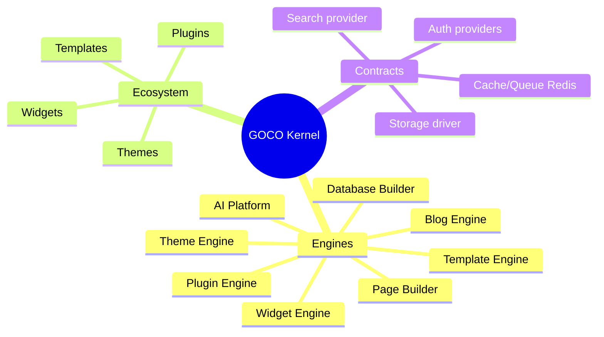
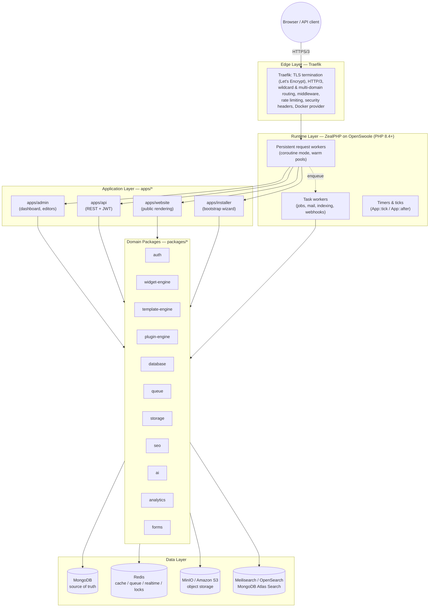
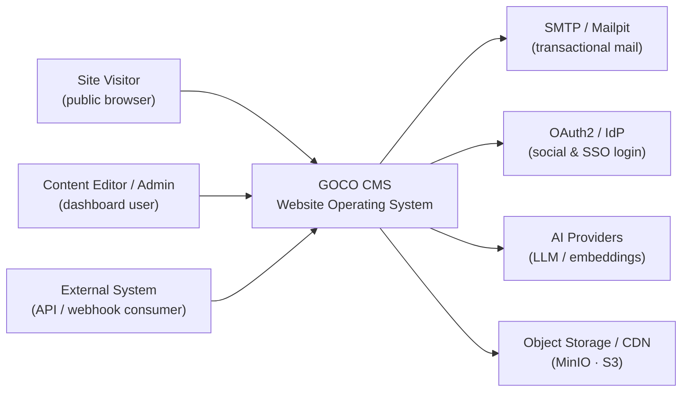
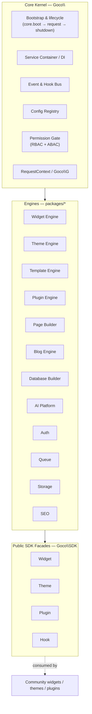
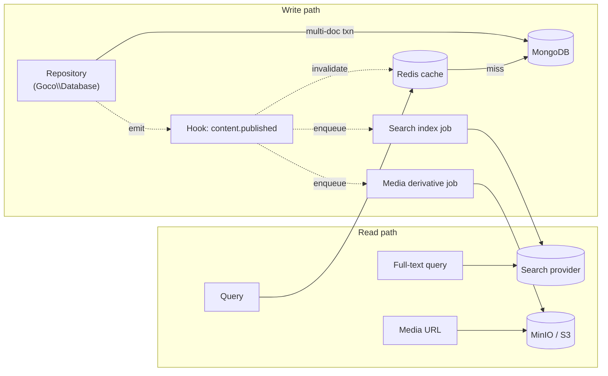
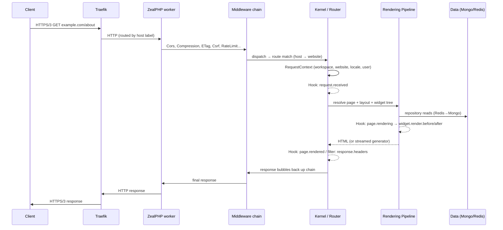

# Architecture Overview

> The master blueprint for GOCO CMS — a lightweight, coroutine-driven core wrapped by an ecosystem of widgets, themes, and plugins, running on ZealPHP + OpenSwoole with MongoDB and Redis.

This document is the canonical, top-down description of how GOCO CMS is built. It is the
equivalent of a project's `ARCHITECTURE.md`: read it before you write an extension, tune a
deployment, or contribute to core. Every subsystem summarized here has a dedicated deep-dive
document linked inline and again in [Related](#related).

GOCO is not "a PHP CMS with async bolted on." It is designed from the ground up for a
**persistent runtime**: workers boot once, hold warm connection pools, and serve thousands of
requests without re-bootstrapping the framework on every hit. That single fact — persistent
memory instead of request-per-process — shapes every layer below.

---

## 1. Architectural principles

The whole system obeys a small set of rules. When two designs compete, these break the tie
(see [Philosophy & Design Principles](../introduction/philosophy.md) for the full rationale).

| Principle | What it means in practice |
|-----------|---------------------------|
| **Lightweight core + ecosystem** | The kernel only orchestrates. Features are widgets, themes, and plugins loaded on top. |
| **Everything is replaceable** | Storage, search, cache, and auth sit behind driver/provider interfaces. Swap MinIO for S3, Meilisearch for OpenSearch, with config — not a rewrite. |
| **Persistent-runtime native** | Workers are long-lived. No global request state; per-coroutine isolation via `\ZealPHP\G` / `RequestContext`. |
| **Document-first data** | MongoDB is the source of truth. A lightweight document-mapper + Repository pattern, never a heavy ORM. |
| **Multi-tenant by default** | Every tenant-scoped document carries `workspace_id` + `website_id`. Isolation is a first-class concern, not an add-on. |
| **Extend via hooks, not forks** | Actions and filters ([Event & Hook System](event-hook-system.md)) let plugins change behavior without patching core. |
| **Docker-first operations** | Traefik at the edge, Compose service names as the contract, HTTP/3 and Let's Encrypt out of the box. |

---

## 2. The "Website Operating System" model

A traditional CMS ships a monolith and lets you theme it. GOCO inverts that. The core is a
**kernel** — a scheduler and a set of engines — and almost everything a user sees is a piece
of the ecosystem the kernel loads:

- **Widgets** are the atomic units of rendered output (a hero, a form, a product grid). They
  are registered through the [Widget SDK](../sdk/widget-sdk.md) and composed on a page.
- **Themes** provide layouts, regions, and asset bundles via the [Theme SDK](../sdk/theme-sdk.md).
- **Plugins** extend the platform itself — new routes, new capabilities, new hooks — through the
  [Plugin SDK](../sdk/plugin-sdk.md).

Just as an operating system boots a small kernel and then loads drivers and applications, GOCO
boots the `Goco\` kernel and then loads engines, then plugins, then themes, then widgets. The
kernel knows *how* to render a page; the ecosystem decides *what* the page is. This is why the
core stays small and stable while the platform's surface area grows entirely in userland.



---

## 3. Layered system diagram

GOCO is organized into five horizontal layers. Requests flow downward from the edge; data and
rendered responses flow back up.



> **Note**
> Traefik is the only component that terminates TLS. ZealPHP workers speak plain HTTP behind it
> on the Docker network. See [Traefik Reverse Proxy](../deployment/traefik.md) and
> [Docker Architecture](../deployment/docker.md).

---

## 4. C4 context and container view

### 4.1 System context (C4 Level 1)



GOCO serves three human/machine actors — visitors, editors/admins, and integrators — and
depends on a handful of external systems: an SMTP relay (Mailpit in dev), identity providers for
OAuth2/SSO, AI providers for the [AI Platform](../core/ai-platform.md), and object storage for
media.

### 4.2 Container view (C4 Level 2)

| Container | Technology | Responsibility |
|-----------|-----------|----------------|
| **Edge proxy** | Traefik | TLS, routing, per-tenant routers, middleware, HTTP/3 |
| **GOCO runtime** | ZealPHP / OpenSwoole (`gococms` service) | HTTP + WebSocket + SSE server, coroutine scheduler, task workers |
| **Website app** | `apps/website` | Renders public pages via the [Rendering Pipeline](rendering-pipeline.md) |
| **Admin app** | `apps/admin` | Dashboard, [Page Builder](../core/page-builder.md), settings |
| **API app** | `apps/api` | File-based + programmatic REST, JWT auth, webhooks |
| **Installer** | `apps/installer` | First-run wizard: DB init, admin user, workspace/website |
| **Primary DB** | MongoDB (`mongodb` service) | All persistent documents, indexes, transactions |
| **Cache/bus** | Redis (`redis` service) | Sessions, cache, queues, pub/sub, locks, rate limits |
| **Object store** | MinIO / S3 (`minio` service) | Media blobs and derivatives |
| **Search** | Meilisearch / OpenSearch (`meilisearch` service) | Full-text & faceted search |
| **Mail** | Mailpit (`mailpit` service) | Dev mail capture; prod uses real SMTP |
| **Auto-update** | Watchtower (optional) | Container image refresh |

Compose service names are a hard contract — internal DSNs reference `mongodb`, `redis`,
`minio`, etc. See [Docker Architecture](../deployment/docker.md) for the full topology.

---

## 5. Module map — the kernel and its engines

The `Goco\` core kernel is deliberately thin. It provides bootstrapping, a service container,
the event/hook bus, configuration, and the permission gate. Everything else is an **engine** —
a domain package that the kernel loads and that plugins can extend.



**Engine responsibilities**

- [Widget Engine](../core/widget-engine.md) — registers, resolves, and renders widget types; owns property schemas and previews.
- [Theme Engine](../core/theme-engine.md) — manifests, layouts, regions, and asset bundles.
- [Template Engine](../core/template-engine.md) — PHP template rendering, fragments, streaming views.
- [Plugin Engine](../core/plugin-engine.md) — plugin discovery, install/boot lifecycle, route & capability registration.
- [Page Builder](../core/page-builder.md) — the visual editor mapping the Layout → Section → Container → Row → Column → Widget tree.
- [Blog Engine](../core/blog-engine.md) — posts, revisions, taxonomies, feeds.
- [Database Builder](../core/database-builder.md) — dynamic user-defined collections and entries.
- [AI Platform](../core/ai-platform.md) — provider-agnostic generation, embeddings, and assistants.
- [Authentication](../core/authentication.md) — sessions, JWT, OAuth2, 2FA, passkeys.
- [Routing](../core/routing.md) — Flask-style routes, file-based REST, namespaced routes.

The SDK facades `Goco\SDK\{Widget, Theme, Plugin, Hook}` are the *only* supported surface for
the ecosystem. Their signatures are fixed contracts documented in the [SDK](../sdk/widget-sdk.md)
section; engines may evolve internally as long as these hold.

---

## 6. The runtime foundation (ZealPHP + OpenSwoole)

GOCO runs on [ZealPHP](https://github.com/sibidharan/zealphp), a Flask-style framework over
OpenSwoole 22.1+. A minimal boot looks like this:

```php
<?php
// app.php — the runtime entry file
require 'vendor/autoload.php';

use ZealPHP\App;

App::superglobals(false);            // per-coroutine isolation, no global bleed
App::mode(App::MODE_COROUTINE);      // modern default: fully coroutine-based

$app = App::init('0.0.0.0', 8080);

// GOCO's kernel registers engines, middleware, hooks, and routes here.
Goco\Kernel::boot($app);

$app->run();
```

Key runtime characteristics GOCO relies on:

- **Persistent workers** boot the kernel once and keep warm MongoDB/Redis pools. There is no
  per-request framework re-initialization.
- **Coroutine concurrency** — `go(callable)`, `\OpenSwoole\Coroutine\Channel`, and
  `co::sleep()` let a single worker interleave thousands of I/O-bound requests.
- **Task workers** absorb slow work (mail, media derivatives, search indexing, webhooks) enqueued
  via the [Queue & Redis](caching-and-queue.md) layer, keeping request workers responsive.
- **Cross-worker shared memory** — `\ZealPHP\Store` (an OpenSwoole `Table`) and `\ZealPHP\Counter`
  hold hot, shared state (feature flags, atomic counters) with an optional Redis backend.
- **Timers** — `App::onWorkerStart()` + `App::tick()/App::after()` drive scheduled maintenance
  (cache warmups, revision pruning, health probes).
- **Realtime** — first-class WebSocket (`$app->ws(...)`) and SSE (generator + `$response->sse()`)
  for live editing and notifications.

The lifecycle of a single request — middleware chain, routing, context creation, rendering, and
response emission — is detailed in [Request Lifecycle](request-lifecycle.md); the deeper runtime
integration lives in [ZealPHP Foundation](zealphp-foundation.md).

---

## 7. Cross-cutting concerns

These services are woven through every layer rather than owned by one engine.

### 7.1 Configuration

A layered config registry merges, in increasing precedence: packaged defaults → `.env`
environment → per-workspace `settings` documents → per-website overrides. Runtime-safe values are
cached in Redis and hot-reloadable. See [Configuration](../getting-started/configuration.md) and
the [Configuration Reference](../reference/configuration-reference.md).

### 7.2 Dependency injection

A PSR-11 container binds interfaces to implementations and resolves them by reflection. It is the
mechanism behind "everything is replaceable": the `StorageDriver`, `SearchProvider`, and
`CacheStore` bindings are chosen from config at boot. Full details in
[Service Container & DI](service-container.md).

### 7.3 Events and hooks

The extension backbone. Actions (`subject.verb[.tense]`, e.g. `page.rendered`,
`content.published`) and filters (`subject.noun`, e.g. `page.title`, `menu.items`) let plugins
observe and transform behavior without touching core, via `Hook::listen/dispatch/filter/apply`.
See [Event & Hook System](event-hook-system.md) and the [Hook SDK](../sdk/hook-sdk.md).

### 7.4 Permissions

Every privileged action passes the permission gate: hierarchical roles → `resource.action`
capabilities (RBAC), with an optional ABAC `PolicyEngine`, all scoped per `(workspace, website)`.
See [Permission System](permission-system.md) and the [Security Model](../security/security-model.md).

### 7.5 Logging and observability

Structured, per-coroutine-tagged logs (ZealPHP writes to `/tmp/zealphp/`), request tracing via
`RequestContext`, and an `audit_logs` collection recording who changed what. Health endpoints and
container healthchecks feed Traefik and orchestration.

### 7.6 Internationalization

Locale is resolved per request (domain, path, or user preference) into `RequestContext`.
Translatable strings and content variants are keyed by locale; the [Template Engine](../core/template-engine.md)
renders the resolved locale's assets and copy.

### 7.7 Caching

Redis-backed multi-tier caching (config, rendered fragments, query results, sessions) with
tenant-scoped keys and event-driven invalidation tied to hooks like `content.published`. See
[Caching, Queue & Realtime](caching-and-queue.md).

### 7.8 Frontend and interaction model

GOCO's admin and public surfaces are **server-rendered HTML enhanced with [htmx](https://htmx.org)** —
a hypermedia model rather than a client-side SPA. The [Rendering Pipeline](rendering-pipeline.md) emits
full pages on first load and re-renders only the changed region as an **`App::fragment()`** swap for
interactions (form posts, inline edits, pagination, filtering, the Page Builder canvas), while **SSE**
and **WebSocket** stream live updates (notifications, builder presence, AI token streams). Client
JavaScript stays deliberately thin — htmx wiring plus a few progressive enhancers such as WebAuthn — so
no SPA framework is required to run a GOCO site. The visual [Page Builder](../core/page-builder.md) ships
a richer editor client but still keeps the rendered truth on the server, swapping htmx out-of-band
fragments. External consumers can equally drive the [REST API](../reference/api-reference.md) from any
framework (React, mobile, integrations).

---

## 8. Data architecture

MongoDB is the single source of truth; Redis, object storage, and the search index are derived,
rebuildable projections around it.



- **MongoDB** — one logical DB per deployment. Collections are `snake_case` plural (`workspaces`,
  `websites`, `pages`, `page_revisions`, `posts`, `media`, `plugins`, `audit_logs`, `jobs`, …).
  Every document carries `_id`, `created_at`, `updated_at`, `deleted_at` (soft delete), `version`,
  `created_by`, `updated_by`; tenant docs add `workspace_id`, `website_id`. JSON-Schema validators
  enforce shape; aggregation pipelines power reporting; multi-document transactions guard
  cross-collection invariants. The access layer is a document-mapper + Repository pattern in
  `packages/database` — **not** a heavy ORM. See [MongoDB Data Layer](database-mongodb.md) and
  [Data Model](data-model.md).
- **Redis** — sessions, cache, queues, pub/sub, distributed locks, rate limiting.
- **Object storage** — media behind a driver interface (Local, MinIO, S3). See [Storage & Media](storage.md).
- **Search** — a swappable provider interface (MongoDB text/Atlas Search, Meilisearch,
  OpenSearch). See [Search](search.md).

Tenant isolation is enforced at the data layer: repositories automatically scope queries by the
active `workspace_id`/`website_id` from `RequestContext`, with an optional database-per-workspace
mode for enterprise. See [Multi-Tenancy](multi-tenancy.md).

---

## 9. Request flow summary

A public page request end-to-end:



Handlers return `int|array|string|Generator`; arrays auto-serialize to JSON, generators stream.
The blow-by-blow is in [Request Lifecycle](request-lifecycle.md); how the widget tree becomes HTML
is in [Rendering Pipeline](rendering-pipeline.md).

---

## 10. Deployment topology

GOCO is Docker-first. A production stack is a Compose (or orchestrated) set of the services in
§4.2, with Traefik owning the edge. Horizontal scale comes from adding `gococms` replicas behind
Traefik (stateless workers; state lives in Mongo/Redis/object-store), plus separately scaled task
workers for background load. See [Deployment Guide](../deployment/deployment-guide.md),
[Scaling Strategy](../deployment/scaling.md), and [Backup & Restore](../deployment/backup-restore.md).

```env
# Illustrative service wiring (DSNs use Compose service names)
MONGODB_URI=mongodb://mongodb:27017/goco
REDIS_URL=redis://redis:6379/0
STORAGE_DRIVER=minio
S3_ENDPOINT=http://minio:9000
SEARCH_PROVIDER=meilisearch
MEILISEARCH_HOST=http://meilisearch:7700
MAIL_DSN=smtp://mailpit:1025
```

---

## 11. How to read the rest of the architecture docs

- Start here, then read [ZealPHP Foundation](zealphp-foundation.md) and [Request Lifecycle](request-lifecycle.md)
  to understand the runtime.
- Read [Service Container & DI](service-container.md) and [Event & Hook System](event-hook-system.md)
  to understand how the platform is extended.
- Read [MongoDB Data Layer](database-mongodb.md), [Data Model](data-model.md), and
  [Multi-Tenancy](multi-tenancy.md) to understand persistence and isolation.
- Read [Permission System](permission-system.md), [Caching, Queue & Realtime](caching-and-queue.md),
  [Storage & Media](storage.md), [Search](search.md), and [Rendering Pipeline](rendering-pipeline.md)
  for the cross-cutting subsystems.

> **Tip**
> If you are building an extension rather than modifying core, you can treat this document as a
> map and jump straight to the [SDK](../sdk/widget-sdk.md) and [Guides](../guides/widget-guide.md).

---

## Related

- [Architecture: ZealPHP Foundation](zealphp-foundation.md)
- [Architecture: Request Lifecycle](request-lifecycle.md)
- [Architecture: Service Container & DI](service-container.md)
- [Architecture: Event & Hook System](event-hook-system.md)
- [Architecture: MongoDB Data Layer](database-mongodb.md)
- [Architecture: Data Model](data-model.md)
- [Architecture: Permission System](permission-system.md)
- [Architecture: Rendering Pipeline](rendering-pipeline.md)
- [Architecture: Multi-Tenancy](multi-tenancy.md)
- [Architecture: Caching, Queue & Realtime](caching-and-queue.md)
- [Architecture: Storage & Media](storage.md)
- [Architecture: Search](search.md)
- [Introduction: Overview](../introduction/overview.md)
- [Introduction: Philosophy & Design Principles](../introduction/philosophy.md)
- [Deployment: Docker Architecture](../deployment/docker.md)
- [Deployment: Traefik Reverse Proxy](../deployment/traefik.md)
- [Security Model](../security/security-model.md)
- [Documentation Home](../README.md)
