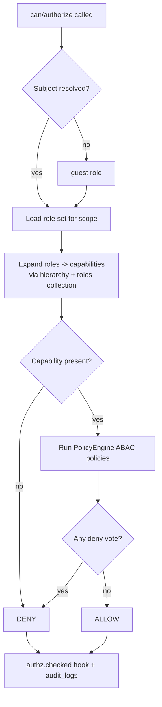
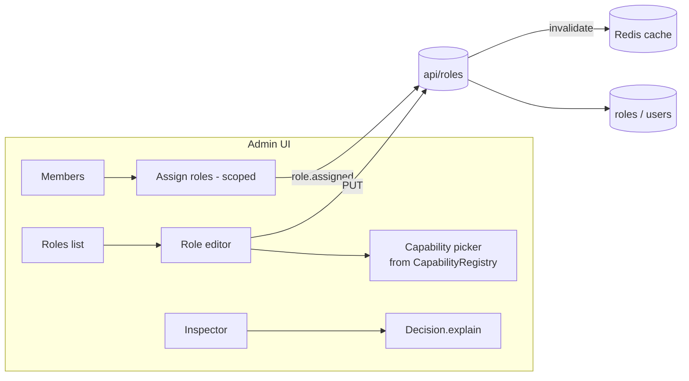
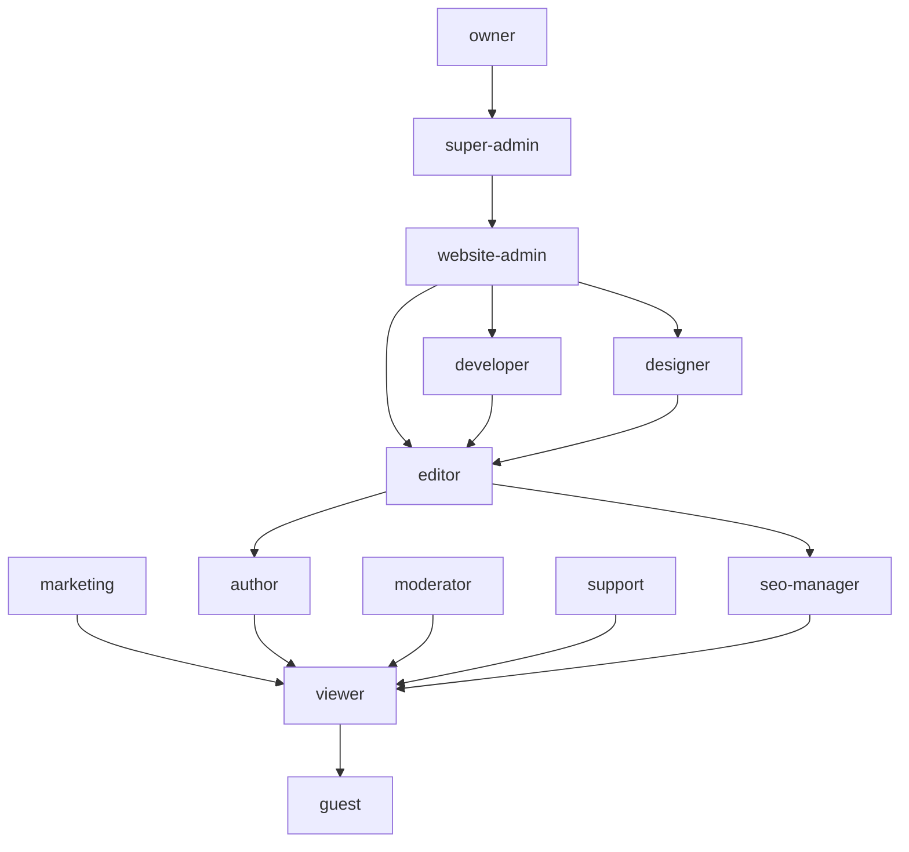

# Permission System (RBAC + ABAC)

> GOCO CMS authorizes every action through a deny-by-default engine that combines role-based access control (RBAC), attribute-based policies (ABAC), and strict `(workspace, website)` scoping.

**Stability:** `stable`

The Permission System is the authorization core of GOCO CMS. It answers a single question everywhere in the platform — *"Is this subject allowed to perform this action on this resource, in this scope?"* — and it answers it the same way from an admin controller, a file-based REST endpoint, a widget renderer, a plugin, or a queued job. Authentication (proving *who* you are) is covered separately in [Authentication](../core/authentication.md); this document covers *what you may do* once identified.

---

## 1. Purpose

Authorization in a multi-tenant "Website Operating System" is not a single gate — it is a fabric woven through the request lifecycle. GOCO CMS needs a model that is:

- **Multi-tenant safe** — a subject's grants in one `(workspace, website)` never leak into another. See [Multi-Tenancy](multi-tenancy.md).
- **Coarse and fine at once** — role assignment for humans, capability strings for code, and attribute conditions for edge cases (ownership, time windows, IP, publication state).
- **Extensible** — plugins register new capabilities and policies at boot without patching core. See [Plugin Engine](../core/plugin-engine.md).
- **Deny by default** — absence of a grant is a denial, never an accident.
- **Fast** — every request performs many checks; the hot path must be memory-resolved and Redis-cached.

The result is a layered engine: **RBAC** maps roles to capabilities, **ABAC** (`PolicyEngine`) layers conditions on top, and a **Scope** object pins every decision to a tenant. The public surface is two calls: `can()` (boolean) and `authorize()` (throwing).

---

## 2. Functional Specification

The permission subsystem lives in [`packages/auth`](../getting-started/project-structure.md) under the `Goco\Auth` namespace and exposes a facade `Goco\SDK\Plugin::permissions()` for registration plus a request-scoped `Gate` service resolved from the [service container](service-container.md).

At a functional level the system MUST:

1. Resolve a **subject** (authenticated user, API client, or `guest`) to its effective role set within a given scope.
2. Expand roles into an **effective capability set** using the role hierarchy and the `roles` collection mapping.
3. Evaluate a requested `resource.action` capability against that set.
4. Run any registered **ABAC policies** for that capability, passing subject, resource, and scope attributes; a single `deny` vote is final.
5. Cache the resolved capability set per `(subject, workspace, website)` in Redis with event-driven invalidation.
6. Emit hooks (`authz.checking`, `authz.checked`) and apply the `capabilities.effective` filter so plugins can observe and adjust decisions.
7. Provide a management UI and CLI for assigning roles, creating custom roles, and inspecting the effective matrix.

### Decision flow



> **Note** RBAC decides *whether the capability exists*; ABAC decides *whether it applies to this specific resource right now*. A capability is necessary but not sufficient.

---

## 3. Business Requirements

| ID | Requirement | Rationale |
|----|-------------|-----------|
| BR-1 | Every write path MUST pass an explicit `authorize()` before mutation. | No implicit trust; audited. |
| BR-2 | Denials are the default for unknown capabilities and unassigned subjects. | Fail closed. |
| BR-3 | Grants are scoped to `(workspace_id, website_id)`; a null website means workspace-wide. | Tenant isolation. |
| BR-4 | Owners and super-admins bypass capability checks but NOT tenant scope or immutable-record policies. | Recoverability without cross-tenant leakage. |
| BR-5 | Plugins register capabilities and policies declaratively; core code is never edited. | Ecosystem extensibility. |
| BR-6 | Every allow/deny on a sensitive capability is written to `audit_logs`. | Compliance & forensics. |
| BR-7 | Role/capability changes invalidate cached grants within one request cycle. | Correctness after re-grant/revoke. |
| BR-8 | The system is usable offline of any external IdP; RBAC is self-contained in MongoDB. | Self-hosted first. |

---

## 4. User Stories

- *As an **owner**,* I can assign any role to any member of my workspace and create custom roles, so my team maps to my org chart.
- *As a **website-admin**,* I can grant `editor` to a contributor on one website without exposing the other websites in the workspace.
- *As an **author**,* I can edit and delete **my own** drafts but not another author's, and I cannot publish — publishing requires `pages.publish`.
- *As a **developer** building a plugin,* I can register `crm.leads.export` as a capability and a policy that only allows export during business hours, so governance travels with my code.
- *As a **seo-manager**,* I have `seo.manage` and read access to pages/posts but cannot alter themes, plugins, or users.
- *As a **security reviewer**,* I can open the effective matrix for any subject and see exactly which capabilities resolve and why (which role or policy granted them).
- *As a **guest** (unauthenticated visitor),* I can only read published, public content; every management capability resolves to deny.

---

## 5. Data Model (MongoDB Collections & Indexes)

Authorization reads from `roles` (definitions), `users` (assignments), and writes to `audit_logs`. All follow the standard envelope (`_id, created_at, updated_at, deleted_at, version, created_by, updated_by`) and tenant fields where applicable. See the full [Data Model](data-model.md) and [MongoDB Data Layer](database-mongodb.md).

### `roles` collection

```json
{
  "_id": "ObjectId(...)",
  "workspace_id": "ObjectId(...)",
  "website_id": null,
  "slug": "editor",
  "name": "Editor",
  "description": "Creates, edits and publishes content across the website.",
  "rank": 60,
  "inherits": ["author"],
  "capabilities": [
    "pages.create", "pages.read", "pages.update", "pages.publish",
    "posts.create", "posts.read", "posts.update", "posts.publish",
    "media.create", "media.read", "media.update",
    "collections.manage"
  ],
  "is_system": false,
  "is_default": false,
  "policies": ["business_hours_publish"],
  "version": 3,
  "created_at": "ISODate(...)",
  "updated_at": "ISODate(...)",
  "created_by": "ObjectId(...)",
  "deleted_at": null
}
```

- `level` — numeric weight for the hierarchy (higher = broader). Used for "can a role manage another role?" comparisons.
- `inherits` — slugs whose capability sets are unioned in (transitive).
- `is_system` — system roles are seeded, versioned by GOCO, and cannot be deleted (only their per-tenant overrides can).
- `capabilities` — explicit grants added on top of inherited ones.
- `policies` — ABAC policy IDs attached to this role.

### Role assignment on `users`

Assignments are stored on the user document as a scoped array so a single user can be `owner` in one workspace and `viewer` in another:

```json
{
  "_id": "ObjectId(...)",
  "email": "dana@example.com",
  "assignments": [
    { "workspace_id": "ObjectId(w1)", "website_id": null,          "roles": ["super-admin"] },
    { "workspace_id": "ObjectId(w1)", "website_id": "ObjectId(s1)", "roles": ["editor", "seo-manager"] },
    { "workspace_id": "ObjectId(w2)", "website_id": "ObjectId(s9)", "roles": ["viewer"] }
  ]
}
```

### Indexes

```javascript
// Role lookup by tenant + slug (partial: exclude soft-deleted)
db.roles.createIndex(
  { workspace_id: 1, website_id: 1, slug: 1 },
  { unique: true, partialFilterExpression: { deleted_at: null } }
);
db.roles.createIndex({ workspace_id: 1, level: -1 });

// Resolve a user's assignments quickly
db.users.createIndex({ "assignments.workspace_id": 1, "assignments.website_id": 1 });

// Audit querying
db.audit_logs.createIndex({ workspace_id: 1, website_id: 1, created_at: -1 });
db.audit_logs.createIndex({ actor_id: 1, action: 1, created_at: -1 });
```

A JSON-Schema validator on `roles` enforces `slug` pattern (`^[a-z][a-z0-9-]*$`), `level` range `0–100`, and that `capabilities[*]` match `^[a-z][a-z0-9-]*\.[a-z][a-z0-9-*]*$`.

---

## 6. Folder Structure

```text
packages/auth/
├── composer.json                 # gococms/auth
├── src/
│   ├── Gate.php                  # can()/authorize() facade, request-scoped
│   ├── Subject.php               # user | api-client | guest wrapper
│   ├── Scope.php                 # (workspace_id, website_id) value object
│   ├── Capability.php            # resource.action parsing + wildcard match
│   ├── Role.php                  # role entity + hierarchy expansion
│   ├── RoleRepository.php        # Mongo-backed, Redis-cached
│   ├── CapabilityRegistry.php    # all known capabilities (core + plugin)
│   ├── Rbac/
│   │   ├── RbacResolver.php      # roles -> effective capability set
│   │   └── SystemRoles.php       # seeded system role definitions
│   ├── Abac/
│   │   ├── PolicyEngine.php      # evaluates conditions
│   │   ├── Policy.php            # id, capabilities, condition callable
│   │   ├── PolicyContext.php     # subject + resource + scope + env
│   │   └── conditions/           # Ownership, TenantScope, TimeWindow, IpRange...
│   ├── Middleware/
│   │   └── AuthorizeMiddleware.php
│   └── Facades/
│       └── Permissions.php        # Goco\SDK\Plugin::permissions() backing
└── tests/
```

---

## 7. API Design

### The `Gate` — `can()` / `authorize()`

The primary developer surface. `Gate` is resolved per request from the container, already bound to the current subject and scope (populated by `AuthorizeMiddleware` from the session/JWT and the resolved tenant).

```php
use Goco\Auth\Gate;

/** @var Gate $gate resolved from the service container */

// Boolean check — never throws.
if ($gate->can('pages.update', $page)) {
    // render an "Edit" button
}

// Guard — throws Goco\Auth\Exception\ForbiddenException (HTTP 403) on deny.
$gate->authorize('pages.publish', $page);
$page->publish();

// Explicit subject / scope (jobs, CLI, cross-tenant admin tools).
$gate->for($subject)
     ->in(new Scope($workspaceId, $websiteId))
     ->authorize('media.delete', $asset);

// Bulk / any-of / all-of.
$gate->canAny(['posts.update', 'posts.publish'], $post);
$gate->canAll(['pages.read', 'pages.update'], $page);
```

Signatures:

```php
final class Gate
{
    public function can(string $capability, mixed $resource = null): bool;
    public function cannot(string $capability, mixed $resource = null): bool;
    public function canAny(array $capabilities, mixed $resource = null): bool;
    public function canAll(array $capabilities, mixed $resource = null): bool;

    /** @throws ForbiddenException on deny */
    public function authorize(string $capability, mixed $resource = null): void;

    public function for(Subject $subject): static;   // returns a scoped clone
    public function in(Scope $scope): static;         // returns a scoped clone

    /** @return string[] effective capabilities for the current subject+scope */
    public function capabilities(): array;

    /** why did this resolve as it did? for the debug/inspector UI */
    public function explain(string $capability, mixed $resource = null): Decision;
}
```

### In file-based REST endpoints

ZealPHP file-based routes and `$app->route(...)` handlers pull `Gate` from the request context. See [Routing](../core/routing.md).

```php
// apps/api/api/pages/publish.php  ->  POST /api/pages/publish
use ZealPHP\G;

return function ($request, $response) {
    $gate = G::get('gate');
    $page = Pages::find($request->post('id'));

    $gate->authorize('pages.publish', $page); // 403 if denied

    $page->publish();
    return ['status' => 'published', 'id' => (string) $page->id];
};
```

### As middleware

Attach a required capability declaratively to a route group:

```php
use ZealPHP\App;
use Goco\Auth\Middleware\AuthorizeMiddleware;

$app->addMiddleware(new AuthorizeMiddleware()); // resolves subject + scope globally

// Route-level requirement:
$app->nsRoute('admin', '/plugins', function ($request, $response) {
    return App::render('/admin/plugins.php', []);
})->requires('plugins.manage');
```

---

## 8. Services

| Service | Responsibility |
|---------|----------------|
| `Gate` | Public `can()/authorize()`; orchestrates RBAC then ABAC. Request-scoped. |
| `RbacResolver` | Expands a subject's roles into an effective capability set within a scope. |
| `RoleRepository` | CRUD over `roles`, hierarchy walking, Redis caching + invalidation. |
| `CapabilityRegistry` | Authoritative list of all registered `resource.action` strings (core + plugin), used for validation and the admin UI picker. |
| `PolicyEngine` | Registers and evaluates ABAC policies; short-circuits on first deny. |
| `SubjectResolver` | Builds a `Subject` from session/JWT/API key; falls back to `guest`. |

### Effective-capability resolution (RBAC)

```php
namespace Goco\Auth\Rbac;

final class RbacResolver
{
    public function resolve(Subject $subject, Scope $scope): CapabilitySet
    {
        $cacheKey = "authz:caps:{$subject->id}:{$scope->workspaceId}:{$scope->websiteId}";

        return $this->redis->remember($cacheKey, 300, function () use ($subject, $scope) {
            $roles = $this->roles->forSubject($subject, $scope); // ['editor','seo-manager']
            $caps  = [];

            foreach ($this->expandHierarchy($roles, $scope) as $role) {
                foreach ($role->capabilities as $cap) {
                    $caps[$cap] = true;
                }
            }

            // Owner / super-admin get the wildcard within their scope.
            if ($this->hasSystemRole($roles, ['owner', 'super-admin'])) {
                $caps['*'] = true;
            }

            $set = new CapabilitySet(array_keys($caps));

            // Plugins may add/remove capabilities for edge cases.
            return Hook::apply('capabilities.effective', $set, $subject, $scope);
        });
    }
}
```

`CapabilitySet::has()` supports wildcards: a set containing `pages.*` matches `pages.update`; a set containing `*` matches anything (owner/super-admin).

---

## 9. Events

The engine dispatches actions and applies filters via the [Hook SDK](../sdk/hook-sdk.md). See also the [Event & Hook System](event-hook-system.md).

| Type | Name | When | Payload |
|------|------|------|---------|
| action | `authz.checking` | before a decision is finalized | subject, capability, resource, scope |
| action | `authz.checked` | after every decision | `Decision` (allow/deny + reason) |
| action | `authz.denied` | only on deny of a sensitive capability | subject, capability, resource |
| action | `role.assigned` | a role is granted to a subject | subject, role, scope, actor |
| action | `role.revoked` | a role is removed | subject, role, scope, actor |
| filter | `capabilities.effective` | resolved set, before caching | `CapabilitySet` |
| filter | `authz.decision` | final allow/deny, last word | `Decision` |
| filter | `role.assignable` | which roles a given actor may assign | `string[]` role slugs |

```php
use Goco\SDK\Hook;

// Mirror every denial of a sensitive capability into the audit log.
Hook::on('authz.denied', function (Subject $s, string $cap, mixed $resource) {
    AuditLog::write('authz.denied', actor: $s, meta: ['capability' => $cap]);
});
```

---

## 10. Hooks

Two integration surfaces cover almost all customization:

**Adjust the effective set** — grant a temporary capability during an incident, or strip one under a feature flag:

```php
Hook::filter('capabilities.effective', function ($set, $subject, $scope) {
    if (FeatureFlag::off('ai.enabled', $scope)) {
        $set = $set->without('ai.manage');
    }
    return $set;
}, priority: 20);
```

**Override the final decision** — the last word, used sparingly (e.g. break-glass or an external policy service):

```php
Hook::filter('authz.decision', function (Decision $d) {
    if (MaintenanceMode::active() && $d->capability !== 'settings.manage') {
        return $d->deny('read-only maintenance window');
    }
    return $d;
}, priority: 100);
```

> **Warning** `authz.decision` can turn an allow into a deny and vice-versa. A filter that unconditionally returns `allow()` defeats the entire model. Only use it to *deny* except in audited break-glass flows, and always leave a reason string.

---

## 11. UI Architecture

Role management lives in the [admin app](../getting-started/project-structure.md) under **Settings → Team & Roles**, rendered with the [Template Engine](../core/template-engine.md) and progressively enhanced via `App::fragment()` htmx regions.

Screens:

- **Members** — table of subjects with their per-website role chips; inline role assignment via a scope-aware picker (`role.assignable` filter limits options to roles the current actor may grant).
- **Roles** — list of system and custom roles; a role editor with a grouped capability picker fed by `CapabilityRegistry` (grouped by resource: Pages, Posts, Media, Themes, Widgets, Plugins, Users, Domains, AI, API, Collections, Settings, plus a "Plugins" group per registering plugin).
- **Custom Role Builder** — clone a system role, toggle capabilities, attach policies, set `level` (bounded below the actor's own level).
- **Effective Matrix / Inspector** — pick a subject + website, see the resolved capabilities and, per capability, the `Decision.explain()` chain (which role granted it, which policy could deny it).



Every mutation from these screens is itself authorized: assigning roles requires `users.manage`; editing roles requires `users.manage` **and** the target role's `level` must be strictly below the actor's highest role level (you cannot mint a role more powerful than yourself).

---

## 12. Security Model

This section is the heart of the document. See the platform-wide [Security Model](../security/security-model.md) for the broader picture (Argon2id hashing, CSRF, 2FA, passkeys).

### Roles and their hierarchy

Thirteen system roles ship by default. `level` orders them; `inherits` unions capabilities upward.

| Role | `level` | Inherits | Intent |
|------|:------:|----------|--------|
| `owner` | 100 | super-admin | Billing + full control of a workspace; cannot be removed by others. Wildcard within workspace scope. |
| `super-admin` | 95 | website-admin | Full technical control across all websites in the workspace. Wildcard within workspace scope. |
| `website-admin` | 80 | developer, designer, editor | Full control of a single website. |
| `developer` | 70 | editor | Plugins, APIs, integrations, code-level config. |
| `designer` | 65 | editor | Themes, widgets, layouts, page builder. |
| `editor` | 60 | author, seo-manager | Create/edit/publish all content. |
| `seo-manager` | 55 | viewer | SEO metadata, redirects, sitemaps; read content. |
| `marketing` | 50 | viewer | Forms, analytics, campaigns; read content. |
| `author` | 45 | viewer | Create/edit/delete **own** content; cannot publish. |
| `moderator` | 40 | viewer | Comments and form submissions moderation. |
| `support` | 30 | viewer | Read-mostly operational access for helpdesk. |
| `viewer` | 20 | guest | Read published + draft content in admin. |
| `guest` | 0 | — | Unauthenticated; read published public content only. |



### Capabilities as `resource.action` strings

Capabilities are lowercase `resource.action`. Wildcards (`pages.*`, `*`) are allowed in **grants** but a **check** is always a concrete string. Core resources: `pages, posts, media, themes, widgets, plugins, users, domains, ai, api, collections, settings`. Common actions: `create, read, update, delete, publish, manage`. `manage` implies the full CRUD set for that resource (`themes.manage` ⊇ `themes.create/read/update/delete`).

### Default Role × Capability matrix

Legend: **A** = all (`.manage` / full CRUD incl. publish), **C** create, **R** read, **U** update, **D** delete, **P** publish, **Ø** = own only, blank = denied.

| Capability \ Role | owner | super-admin | website-admin | developer | designer | editor | seo-manager | marketing | author | moderator | support | viewer | guest |
|---|:-:|:-:|:-:|:-:|:-:|:-:|:-:|:-:|:-:|:-:|:-:|:-:|:-:|
| `pages.*` | A | A | A | CRUP | CRUP | CRUP | R | R | CRUD Ø | R | R | R | R¹ |
| `posts.*` | A | A | A | CRUP | CRUP | CRUP | R | R | CRUD Ø | R | R | R | R¹ |
| `media.*` | A | A | A | CRU | CRUD | CRU | R | CRU | CRU Ø | R | R | R | |
| `collections.manage` | ✓ | ✓ | ✓ | ✓ | | ✓ | | | | | | R | |
| `themes.manage` | ✓ | ✓ | ✓ | | ✓ | | | | | | | | |
| `widgets.manage` | ✓ | ✓ | ✓ | | ✓ | | | | | | | | |
| `plugins.manage` | ✓ | ✓ | ✓ | ✓ | | | | | | | | | |
| `api.manage` | ✓ | ✓ | ✓ | ✓ | | | | | | | | | |
| `ai.manage` | ✓ | ✓ | ✓ | ✓ | | | | ✓ | | | | | |
| `seo.manage` | ✓ | ✓ | ✓ | | | ✓ | ✓ | | | | | | |
| `users.manage` | ✓ | ✓ | ✓ | | | | | | | | | | |
| `domains.manage` | ✓ | ✓ | ✓ | | | | | | | | | | |
| `comments.moderate` | ✓ | ✓ | ✓ | | | ✓ | | | | ✓ | | | |
| `forms.manage` | ✓ | ✓ | ✓ | ✓ | | | | ✓ | | | | | |
| `analytics.read` | ✓ | ✓ | ✓ | ✓ | | ✓ | ✓ | ✓ | | | ✓ | | |
| `settings.manage` | ✓ | ✓ | ✓ | | | | | | | | | | |

¹ `guest` reads only content that is **published** and **public** — enforced by the `PublishedPublic` ABAC condition, not by the capability alone.

> **Note** `owner` and `super-admin` hold the `*` wildcard *within their workspace scope*. They still cannot act on another workspace, and they cannot bypass immutable-record policies (e.g. deleting a legal-hold audit log).

### ABAC — the `PolicyEngine`

RBAC says the capability exists; policies decide if it applies to *this* resource *now*. A policy binds to one or more capabilities and returns `allow`, `deny`, or `abstain`. **Any deny wins; all-abstain means "RBAC's allow stands."**

```php
namespace Goco\Auth\Abac;

Permissions::policy('ownership', function (PolicyContext $ctx) {
    // Authors may only mutate their own unpublished content.
    if (! $ctx->subject->hasRole('author') || $ctx->subject->hasCapability('*')) {
        return Policy::ABSTAIN;
    }
    $isOwner = (string) $ctx->resource->created_by === (string) $ctx->subject->id;
    $isDraft = $ctx->resource->status !== 'published';

    return ($isOwner && $isDraft) ? Policy::ALLOW : Policy::DENY;
}, capabilities: ['pages.update', 'pages.delete', 'posts.update', 'posts.delete']);

// Tenant scope is a mandatory, always-on policy — resources must match the active scope.
Permissions::policy('tenant_scope', function (PolicyContext $ctx) {
    if ($ctx->resource === null) {
        return Policy::ABSTAIN; // no resource -> capability-only check
    }
    $sameWorkspace = (string) $ctx->resource->workspace_id === (string) $ctx->scope->workspaceId;
    $sameWebsite   = $ctx->scope->websiteId === null
                  || (string) $ctx->resource->website_id === (string) $ctx->scope->websiteId;

    return ($sameWorkspace && $sameWebsite) ? Policy::ABSTAIN : Policy::DENY;
}, capabilities: ['*']);
```

`PolicyContext` exposes:

```php
final class PolicyContext
{
    public Subject $subject;   // roles, capabilities, id, attributes
    public mixed $resource;    // the document being acted on (nullable)
    public Scope $scope;       // workspace_id, website_id
    public array $env;         // ip, time, request headers, method
    public string $capability; // the concrete resource.action being checked
}
```

Shipped conditions: `Ownership`, `TenantScope`, `TimeWindow`, `IpRange`, `PublishedPublic`, `TwoFactorRequired` (e.g. `users.manage` may require a fresh 2FA challenge).

### Scoping per `(workspace, website)`

Every decision carries a `Scope`. A null `website_id` means workspace-wide (e.g. an `owner`); a concrete `website_id` narrows the grant. The `RbacResolver` reads only the assignment array entries matching the active scope, and the always-on `tenant_scope` policy blocks any resource whose tenant fields disagree — even for wildcards. This is the primary defense against cross-tenant data access. See [Multi-Tenancy](multi-tenancy.md).

### Deny by default

- Unknown capability strings resolve to deny (and, in non-production, log a warning that the capability is unregistered).
- A subject with no matching assignment resolves to the `guest` role.
- `authorize()` throws `ForbiddenException` (HTTP 403) unless an explicit allow survives both RBAC and ABAC.
- The `authz.decision` filter can only be *trusted to deny*; core never treats a filter-produced allow as a substitute for a real grant on sensitive capabilities.

---

## 13. Performance Strategy

Authorization runs dozens of times per request, so the resolver is engineered for near-zero marginal cost. See [Caching, Queue & Realtime (Redis)](caching-and-queue.md).

- **Two-tier cache.** The effective `CapabilitySet` per `(subject, workspace, website)` is cached in Redis (TTL 300s) and memoized in-process via `\ZealPHP\G` for the request's lifetime — so the second check in a request is a hash lookup.
- **Cross-worker invalidation.** `role.assigned` / `role.revoked` / role edits publish on `Store::publish('authz.invalidate', ...)`; `App::subscribe` in each OpenSwoole worker clears the relevant Redis keys and process memo. Changes take effect within the same request cycle (BR-7).
- **Bitset expansion.** The role hierarchy is expanded once per role edit and stored denormalized on each role's `capabilities`, so resolution is a union of pre-computed arrays, not a graph walk at request time.
- **Policy short-circuit.** `PolicyEngine` evaluates the cheapest, always-on policies (`tenant_scope`) first and returns on the first deny.
- **Batch checks.** List views call `capabilities()` once and filter in memory instead of calling `can()` per row.
- **No N+1 role reads.** `RoleRepository::forSubject()` loads all matching roles for a scope in one query using the `assignments` index.

---

## 14. Testing Strategy

Covered by unit, contract, and integration suites in `packages/auth/tests` and cross-cutting suites in `/tests`. See [Testing Strategy](../community/testing-strategy.md).

- **Matrix tests** — a data-provider generates one assertion per `(role, capability)` cell of the default matrix; the table above is the source of truth and drift fails CI.
- **ABAC unit tests** — ownership (own draft allow, others' draft deny, own published deny), tenant scope (cross-workspace deny, cross-website deny, workspace-wide allow), time/IP windows.
- **Deny-by-default tests** — unknown capability → deny; unassigned subject → guest; empty scope → deny.
- **Cache correctness** — grant → check → revoke → check-again asserts invalidation within the cycle.
- **Fuzz** — randomized capability strings must never resolve allow without a matching grant.
- **Integration** — a full request through `AuthorizeMiddleware` against `apps/api` endpoints, asserting 200/403.

```php
public function test_author_cannot_edit_others_draft(): void
{
    $gate = $this->gateFor($this->author, $this->scope);
    $othersDraft = $this->page(createdBy: $this->otherUser->id, status: 'draft');

    $this->assertFalse($gate->can('pages.update', $othersDraft));
    $this->expectException(ForbiddenException::class);
    $gate->authorize('pages.update', $othersDraft);
}
```

---

## 15. Extension Points

### Plugins register new capabilities

Capabilities and policies are declared in the plugin manifest / boot and merged into `CapabilityRegistry` at `plugin.activated`. Core is never edited. See [Plugin SDK](../sdk/plugin-sdk.md) and [Plugin Engine](../core/plugin-engine.md).

```php
use Goco\SDK\Plugin;

Plugin::register('acme-crm', [
    'name' => 'Acme CRM',
    // Namespaced capabilities appear in the role editor under an "Acme CRM" group.
    'permissions' => [
        'crm.leads.read',
        'crm.leads.create',
        'crm.leads.update',
        'crm.leads.delete',
        'crm.leads.export',
    ],
]);

Plugin::boot('acme-crm');

// Register capabilities imperatively too:
Plugin::permissions([
    'crm.leads.export' => 'Export leads to CSV',
]);

// Attach an ABAC policy scoped to the plugin's capability.
Permissions::policy('crm_business_hours', function (PolicyContext $ctx) {
    $hour = (int) date('G', $ctx->env['time']);
    return ($hour >= 8 && $hour < 20) ? Policy::ABSTAIN : Policy::DENY;
}, capabilities: ['crm.leads.export']);
```

Newly registered capabilities are **denied for every existing role** until an owner grants them — extension never silently widens access.

### Other extension seams

- **Custom roles** — created per tenant via UI/CLI, stored in `roles` with `is_system: false`.
- **`capabilities.effective` filter** — programmatic grant/revoke for feature flags, trials, incidents.
- **`authz.decision` filter** — integrate an external policy service (OPA, etc.) as a final deny gate.
- **Custom conditions** — implement `ConditionInterface` and register via `Permissions::condition()`.

```bash
# CLI role management (see the CLI reference)
goco role:create reviewer --level 50 --inherit viewer \
  --grant pages.read --grant comments.moderate --website s1
goco role:assign dana@example.com editor --workspace w1 --website s1
goco permission:matrix --website s1        # print the effective matrix
goco permission:check dana@example.com pages.publish --website s1
```

See the full [CLI Reference](../reference/cli-reference.md).

---

## 16. Upgrade Strategy

- **System roles are versioned and idempotently re-seeded** on each release migration. Tenant customizations live in separate override documents (or `is_system: false` clones) so upgrades never clobber local edits.
- **New core capabilities** added in a release are, by default, granted only to roles that already hold the resource's `.manage` capability; the migration notes list every addition. No role silently gains a genuinely new power.
- **Deprecations** — a removed capability is aliased to its replacement for one minor cycle and flagged `deprecated` in `CapabilityRegistry`; checks against the old string log a warning.
- **Schema evolution** — `roles` validator changes ship as reversible migrations under `scripts/`; the `version` field on each document supports staged rollout.
- **Backward compatibility** — the `can()/authorize()` signatures are `stable` and covered by contract tests; behavioral changes go through the [governance](../community/governance.md) RFC process. Follows SemVer.

---

## 17. Future Roadmap

- **Delegated administration** — time-boxed, self-expiring grants ("grant `plugins.manage` for 24h") with automatic revocation via Redis TTL + a queued job.
- **Just-in-time elevation (break-glass)** — audited, 2FA-gated temporary wildcard for incident response, fully logged to `audit_logs`.
- **Policy-as-data** — store ABAC conditions as portable JSON rules editable in the UI, in addition to code-defined policies.
- **External policy engine adapter** — first-class OPA / Cedar integration behind the `authz.decision` filter.
- **Attribute-driven roles** — auto-assign roles from user attributes / SSO group claims (OAuth2/SCIM).
- **Field-level & row-level policies** — extend ABAC below the document to individual fields (e.g. hide PII columns from `support`).

See the platform [Roadmap](../roadmap.md).

---

## Related

- [Authentication](../core/authentication.md)
- [Security Model](../security/security-model.md)
- [Multi-Tenancy](multi-tenancy.md)
- [Data Model (Collections & Indexes)](data-model.md)
- [MongoDB Data Layer](database-mongodb.md)
- [Event & Hook System](event-hook-system.md)
- [Service Container & Dependency Injection](service-container.md)
- [Caching, Queue & Realtime (Redis)](caching-and-queue.md)
- [Plugin Engine](../core/plugin-engine.md)
- [Plugin SDK](../sdk/plugin-sdk.md)
- [Hook SDK](../sdk/hook-sdk.md)
- [CLI Reference](../reference/cli-reference.md)
- [Testing Strategy](../community/testing-strategy.md)
- [Governance](../community/governance.md)
- [Documentation Index](../README.md)
