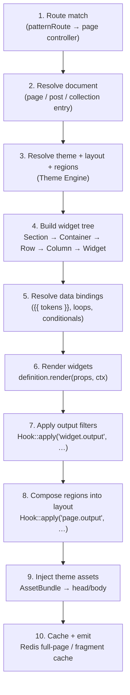
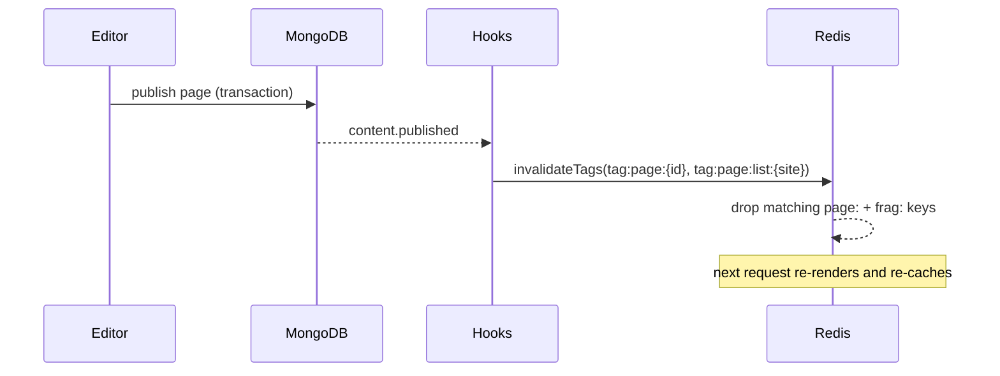

# Rendering Pipeline

> How a route becomes HTML in GOCO CMS — resolve the page document, build the widget tree from the theme's layout and regions, render each widget, apply output filters, inject assets, resolve data bindings, and serve it through Redis-backed fragment and full-page caches with streaming, htmx, and static-export variants.

This is the canonical trace of the read path. When a visitor hits a public URL, the request
travels through Traefik into a warm ZealPHP worker, through the router, and into the rendering
pipeline described here. The pipeline is **pure and deterministic**: given the same page
document, theme, resolved data, and context, it produces byte-identical HTML — which is exactly
what makes fragment and full-page caching safe.

The pipeline lives in `packages/template-engine` (`Goco\Template`) and orchestrates the
[Widget Engine](../core/widget-engine.md) and [Theme Engine](../core/theme-engine.md). Caching,
invalidation, and streaming primitives come from
[Caching, Queue & Realtime (Redis)](caching-and-queue.md).

---

## 1. The ten stages at a glance

Every public HTML response walks the same numbered stages. Each stage is a pure function of its
inputs plus the [request context](service-container.md); each has a cache boundary and hook
points around it.



Stages 5–7 run **per widget**; the rest run once per page. Stages 2, 6, and 10 are the ones that
touch external systems (MongoDB, driver interfaces, Redis) — everything else is CPU-bound
in-worker work over already-fetched documents.

---

## 2. Stage 1 — Route to page controller

The public website app (`apps/website`) registers a low-priority catch-all pattern route that
matches any path not already claimed by a plugin or the API. ZealPHP resolves more specific
routes first, so plugin routes and `api/*` file routes win before the catch-all runs.

```php
use ZealPHP\App;
use Goco\Template\PageController;

$app = App::init('0.0.0.0', 8080);
$app->mode(App::MODE_COROUTINE);

// Public pages: everything that reaches here is a content URL.
$app->patternRoute('/{path:.*}', function ($path, $request, $response) {
    return (new PageController())->handle($path, $request, $response);
}, priority: -100);
```

The `PageController` derives the render request — the requested path, the resolved
`workspace_id` + `website_id` (from the `HostRouter` middleware that mapped the `Host` header to
a `domains` document), the preview flag, the current user, and the `Accept`/`HX-Request`
headers that select the response variant. That bundle becomes the immutable `RenderRequest`.

> **Note** The host-to-tenant mapping happens once, in middleware, before the pipeline starts.
> See [Multi-Tenancy](multi-tenancy.md). Every stage below reads `workspace_id`/`website_id`
> from the context; nothing in the pipeline re-derives the tenant.

---

## 3. Stage 2 — Resolve the content document

The controller asks the appropriate repository (`Goco\Database`) for the document that backs the
URL. The resolution order is: exact page slug, then blog post permalink, then a
`collections`/`collection_entries` dynamic route, then a `redirects` lookup, and finally a 404
page (which is itself a rendered page document).

```php
final class PageController
{
    public function resolve(RenderRequest $req): ContentResolution
    {
        $scope = ['workspace_id' => $req->workspaceId, 'website_id' => $req->websiteId];

        if ($page = $this->pages->findPublished($scope + ['slug' => $req->path])) {
            return ContentResolution::page($page);
        }
        if ($post = $this->posts->findByPermalink($scope, $req->path)) {
            return ContentResolution::post($post);
        }
        if ($entry = $this->collections->matchRoute($scope, $req->path)) {
            return ContentResolution::entry($entry->collection, $entry->document);
        }
        if ($redirect = $this->redirects->match($scope, $req->path)) {
            return ContentResolution::redirect($redirect->target, $redirect->status);
        }
        return ContentResolution::notFound();
    }
}
```

Only **published** documents are returned on the public path (`status = 'published'`,
`deleted_at = null`, `published_at <= now`). When `req.preview` is true and the user holds
`pages.read`, unpublished revisions from `page_revisions` are served instead — and caching is
disabled for that response. The document, once resolved, is the root data source for stage 5's
`{{ post.* }}` / `{{ page.* }}` bindings.

The `page.rendering` action fires immediately after resolution so plugins can observe or short-
circuit:

```php
Hook::dispatch('page.rendering', $resolution, $req);
```

---

## 4. Stage 3 — Resolve theme, layout, and regions

A page document names a `layout` (or inherits the website's default). The Theme Engine turns the
active theme slug into a concrete layout template and its declared regions.

```php
$themeSlug = $req->website['theme'];               // e.g. "aurora"
$layoutId  = $resolution->document['layout'] ?? 'default';

$layouts = Theme::layouts($themeSlug);             // ['default', 'landing', 'full-width', …]
$regions = Theme::regions($layoutId);              // ['header', 'main', 'sidebar', 'footer']
$assets  = Theme::assets($themeSlug);              // AssetBundle (deferred until stage 9)
```

A **layout** is a PHP template (`themes/<slug>/layouts/<id>.php`) that echoes named region
placeholders. A **region** is a slot the layout exposes; the page's stored widget tree is keyed
by region so each region's widgets render into its placeholder. Regions the theme declares but
the page does not populate fall back to theme defaults (e.g. a shared global header widget tree
stored on the website document).

See the [Theme Engine](../core/theme-engine.md) for the manifest format and
`Theme::register()` signature, and the [Theme SDK](../sdk/theme-sdk.md) for authoring themes.

---

## 5. Stage 4 — Build the widget tree

GOCO's website hierarchy is
**Workspace → Website → Theme → Layout → Section → Container → Row → Column → Widget**. Stages
1–3 have resolved everything down to *Layout*. Stage 4 materializes the *Section → Widget*
subtree that the page stored, per region.

The tree is persisted on the page document (and referenced from the `widgets`/`layouts`
collections for reuse) as nested nodes. It is normalized into typed node objects:

```php
final class WidgetTree
{
    /** @return Node[] keyed by region */
    public function build(array $document, array $regions): array
    {
        $tree = [];
        foreach ($regions as $region) {
            $nodes = $document['regions'][$region] ?? [];
            $tree[$region] = array_map(
                fn (array $raw) => Node::fromArray($raw), // recursively builds children
                $nodes
            );
        }
        return $tree;
    }
}
```

Node types mirror the hierarchy. Structural nodes (`section`, `container`, `row`, `column`)
carry layout props — width, gutters, breakpoints, background — and children. Leaf nodes
(`widget`) carry a `type` (the registered widget type), a `props` map, and optional binding and
visibility metadata:

```json
{
  "type": "section",
  "props": { "background": "surface", "padding": "xl" },
  "children": [{
    "type": "container",
    "props": { "maxWidth": "lg" },
    "children": [{
      "type": "row",
      "children": [{
        "type": "column",
        "props": { "span": { "base": 12, "md": 6 } },
        "children": [{
          "type": "widget",
          "widget": "hero",
          "props": { "heading": "{{ page.title }}", "cta": "Read more" },
          "visibility": { "when": "user.isGuest" }
        }]
      }]
    }]
  }]
}
```

The `layout.building` filter lets plugins rewrite the tree before rendering (inject an announcement
bar, wrap the tree in an A/B experiment variant, strip nodes a plan doesn't allow):

```php
$tree = Hook::apply('layout.tree', $tree, $resolution, $req);
```

---

## 6. Stage 5 — Resolve dynamic data bindings

Before a widget renders, its props are passed through the **binding resolver**, which replaces
`{{ token }}` expressions with values drawn from the render context. Binding runs depth-first so
a loop's iteration scope is available to its descendants.

### 6.1 The binding context

The resolver builds a scoped variable bag from the render context:

| Root object | Populated from | Example tokens |
|-------------|----------------|----------------|
| `page` | resolved page document | `{{ page.title }}`, `{{ page.slug }}`, `{{ page.meta.description }}` |
| `post` | resolved blog post | `{{ post.title }}`, `{{ post.excerpt }}`, `{{ post.author.name }}`, `{{ post.published_at }}` |
| `product` / `entry` | dynamic collection entry | `{{ product.price }}`, `{{ product.sku }}`, `{{ entry.fields.color }}` |
| `user` | authenticated user (or guest) | `{{ user.name }}`, `{{ user.email }}`, `{{ user.isGuest }}` |
| `workspace` | current workspace | `{{ workspace.name }}`, `{{ workspace.plan }}` |
| `website` | current website | `{{ website.name }}`, `{{ website.locale }}` |
| `site` | merged settings snapshot | `{{ site.title }}`, `{{ site.tagline }}` |
| `params` | route + query params | `{{ params.category }}`, `{{ params.q }}` |
| built-ins | runtime | `{{ current_date }}`, `{{ current_year }}`, `{{ request.path }}` |

### 6.2 Token catalog

```text
{{ post.title }}              → scalar field
{{ product.price | money }}   → filter pipe (formatting)
{{ user.name }}               → nested path
{{ current_date }}            → built-in, formatted per website.locale
{{ workspace.name }}          → tenant field
{{ page.meta.og_image ?? site.default_image }}   → null-coalesce fallback
```

Filters after a pipe (`| money`, `| date:'Y-m-d'`, `| upper`, `| truncate:120`, `| raw`) are
registered functions. All output is **HTML-escaped by default**; only the explicit `| raw`
filter (or a widget that returns pre-sanitized markup) bypasses escaping. This is the primary
defense against stored XSS in bound content — see [Security Model](../security/security-model.md).

### 6.3 Loops and collection bindings

Structural or widget nodes can carry a `loop` binding that repeats the node once per item in a
resolved dataset. The dataset is a query against a collection, resolved lazily and cached as a
fragment (stage 10):

```json
{
  "type": "widget",
  "widget": "product-card",
  "loop": {
    "source": "collection:products",
    "as": "product",
    "where": { "status": "active" },
    "sort": { "featured": -1, "price": 1 },
    "limit": 12
  },
  "props": { "title": "{{ product.name }}", "price": "{{ product.price | money }}" }
}
```

The loop's `where` clause is passed through the `query.criteria` filter so plugins can enforce
tenant scoping and visibility rules before the query hits MongoDB:

```php
$criteria = Hook::apply('query.criteria', $loop['where'], $collection, $ctx);
$items    = $this->collections->query($collection, $criteria, $loop['sort'], $loop['limit']);
```

### 6.4 Conditionals and visibility rules

Any node may declare a `visibility` rule. If it evaluates false, the node (and its subtree) is
omitted entirely — it is never rendered, so no cost and no leaked markup. Rules are a small,
sandboxed expression language over the binding context (no arbitrary PHP):

```json
{ "visibility": { "when": "user.isGuest && current_date < '2026-12-31'" } }
{ "visibility": { "when": "user.hasCapability('pages.update')" } }
{ "visibility": { "when": "params.category == 'sale'" } }
```

The evaluator supports `&&`, `||`, `!`, comparison operators, membership, and a whitelist of
context helpers (`user.hasCapability`, `user.hasRole`, `feature.enabled`). Anything else is a
resolution error surfaced in the editor, never at request time.

---

## 7. Stage 6 — Render each widget

A resolved leaf node calls its registered widget definition's `render`. The Widget Engine looks
the type up in its registry and invokes `Widget::render()`:

```php
use Goco\SDK\Widget;

$html = Widget::render($node->widget, $node->resolvedProps, $ctx);
```

Internally each widget's `definition.render(props, ctx)` receives the **already-bound, already-
escaped** props plus the [Context](service-container.md) (tenant, user, request, and a scoped
service locator). The render bracket fires action hooks so plugins can wrap, time, or annotate
output:

```php
Hook::dispatch('widget.render.before', $node->widget, $props, $ctx);
$output = $definition->render($props, $ctx);        // returns string (HTML)
Hook::dispatch('widget.render.after', $node->widget, $output, $ctx);
```

Structural nodes render by composing their children's HTML into their own wrapper markup
(grid/flex classes derived from column spans and breakpoints). Rendering is a post-order
traversal: leaves first, then their column, row, container, and section wrappers.

Because workers are persistent, widget definitions are registered **once at worker start**, not
per request. See [Widget Engine](../core/widget-engine.md) for the registry, `PropertySchema`,
and preview rendering (`Widget::preview()`), and the [Widget SDK](../sdk/widget-sdk.md) for
authoring.

> **Warning** A widget's `render` runs inside a coroutine. Never block the worker with native
> blocking I/O (e.g. `curl`, `sleep()`, PDO). Use coroutine-aware clients and `co::sleep()` so
> the scheduler can serve other requests while yours awaits I/O.

---

## 8. Stage 7 — Apply output filters

Every widget's rendered string passes through the `widget.output` filter chain. This is the
supported extension point for transforming markup without touching the widget: lazy-loading
images, rewriting internal links, wrapping in editor handles during preview, inlining critical
CSS, or adding structured-data attributes.

```php
$output = Hook::apply('widget.output', $output, [
    'type'  => $node->widget,
    'props' => $props,
    'ctx'   => $ctx,
]);
```

Filters run in priority order (lower first). A well-behaved filter returns a string of the same
or transformed markup; it must not perform blocking I/O in the hot path. Example — a plugin that
appends structured data to `product-card` output:

```php
Hook::filter('widget.output', function (string $html, array $meta) {
    if ($meta['type'] !== 'product-card') {
        return $html;
    }
    $ld = json_encode([
        '@context' => 'https://schema.org',
        '@type'    => 'Product',
        'name'     => $meta['props']['title'],
        'offers'   => ['@type' => 'Offer', 'price' => $meta['props']['rawPrice']],
    ], JSON_UNESCAPED_SLASHES);
    return $html . "<script type=\"application/ld+json\">{$ld}</script>";
}, priority: 20);
```

---

## 9. Stage 8 — Compose regions into the layout

Each region's widget HTML is concatenated and injected into its placeholder in the layout
template. The layout is rendered with ZealPHP's view engine:

```php
$regionHtml = [];
foreach ($regions as $region) {
    $html = implode('', array_map(fn (Node $n) => $this->renderNode($n, $ctx), $tree[$region]));
    $regionHtml[$region] = Hook::apply('region.output', $html, $region, $ctx);
}

$body = App::renderToString("/themes/{$themeSlug}/layouts/{$layoutId}.php", [
    'regions' => $regionHtml,
    'page'    => $resolution->document,
    'ctx'     => $ctx,
]);

$body = Hook::apply('page.output', $body, $resolution, $ctx);
```

The theme layout echoes regions by name — the layout owns the document skeleton, the pipeline
owns the region contents:

```php
<!-- themes/aurora/layouts/default.php -->
<main class="site">
  <header><?= $regions['header'] ?? '' ?></header>
  <div class="wrap">
    <article><?= $regions['main'] ?? '' ?></article>
    <aside><?= $regions['sidebar'] ?? '' ?></aside>
  </div>
  <footer><?= $regions['footer'] ?? '' ?></footer>
</main>
```

---

## 10. Stage 9 — Inject theme assets

The `AssetBundle` resolved in stage 3 is now flushed into the document. The bundle knows the
theme's CSS/JS, plus any assets that widgets *declared* during rendering (a widget can register a
dependency, and the bundle deduplicates so a stylesheet used by twelve widgets ships once).

```php
$doc = Hook::apply('page.title', $resolution->document['title'], $ctx);  // filter the <title>

$head = $assets->head();     // <link rel="stylesheet">, preloads, critical CSS, meta
$foot = $assets->body();     // deferred <script>, htmx, module imports

$assets->addWidgetDependencies($usedWidgetTypes);   // collected during stage 6

$document = $shell->wrap([
    'title' => $doc,
    'head'  => $head,
    'body'  => $body,
    'foot'  => $foot,
    'lang'  => $ctx->website['locale'],
]);
```

Asset resolution honors the theme manifest's declared bundles and any `response.headers` filter
that sets `Content-Security-Policy`, cache headers, or `Link: <…>; rel=preload`. See the
[Theme Engine](../core/theme-engine.md) for `AssetBundle` composition and cache-busting hashes.

---

## 11. Stage 10 — Caching and emission (Redis)

GOCO caches at two granularities, both in Redis (via the driver in
[Caching, Queue & Realtime](caching-and-queue.md)):

| Layer | Key shape | Scope | Lifetime |
|-------|-----------|-------|----------|
| **Fragment cache** | `frag:{website_id}:{widget_type}:{hash(props+bindings)}` | one rendered widget / loop item | until an invalidating event or TTL |
| **Full-page cache** | `page:{website_id}:{path}:{variant}` | complete HTML shell | until an invalidating event or TTL |

`variant` folds the response shape into the key so htmx, full-page, and locale variants never
collide: `{locale}:{device}:{auth?guest:user}:{shape}`. Pages that depend on the current user
(anything rendering `{{ user.* }}` for an authenticated visitor) are marked **uncacheable at the
full-page layer** and rely on fragment caching for the static parts only.

### 11.1 Read-through

```php
public function emit(RenderRequest $req, callable $render): string
{
    if (!$req->cacheable()) {
        return $render();                              // preview, logged-in, POST, etc.
    }
    $key = $this->pageKey($req);
    return $this->redis->remember($key, ttl: 300, tags: $this->tags($req), cb: $render);
}
```

`remember()` stores the value under the key *and* registers the key in tag sets
(`tag:page:{id}`, `tag:widget:{type}`, `tag:collection:{name}`) so invalidation can find every
key touched by a change.

### 11.2 Event-based invalidation

Content mutations dispatch actions; a cache subscriber flushes the matching tags. Nothing polls
TTLs for correctness — TTL is only a backstop.

```php
Hook::listen('content.published', function ($doc) {
    Cache::invalidateTags([
        "tag:page:{$doc['_id']}",
        "tag:page:list:{$doc['website_id']}",     // archives/menus that list this page
    ]);
});

Hook::listen('widget.saved', fn ($w) => Cache::invalidateTags(["tag:widget:{$w['type']}"]));
Hook::listen('theme.activated', fn ($t) => Cache::invalidateWebsite($t['website_id']));
Hook::listen('collection.entry.saved', fn ($e) =>
    Cache::invalidateTags(["tag:collection:{$e['collection']}"]));
```

Because invalidation is tag-driven and dispatched from the same hook system the pipeline uses,
plugins that create new cacheable surfaces just tag their fragments and register a listener — no
core changes.



---

## 12. Response shapes: full page, streaming, htmx, SSE

The same pipeline drives four response shapes. The `PageController` selects one from the request.

### 12.1 Full page (buffered)

The default: run all ten stages, return the composed string. ZealPHP maps the returned string to
a `200 text/html` response.

### 12.2 Streaming SSR (generators)

For long pages, the pipeline yields the shell head, then each region as it finishes, so the
browser paints above-the-fold content before the whole tree renders. ZealPHP streams a generator
directly:

```php
$app->route('/{path:.*}', function ($path, $request, $response) {
    return App::renderStream(function () use ($path, $request) {
        $ctx = RenderContext::fromRequest($request);
        yield $shell->openHead($ctx);
        foreach ($ctx->regions as $region) {
            yield $this->renderRegion($region, $ctx);   // flushes each region
            co::sleep(0);                                 // cooperative yield point
        }
        yield $shell->closeBody($ctx);
    });
});
```

`renderStream()` returns a `Generator`; ZealPHP flushes each yielded chunk with chunked transfer
encoding. `co::sleep(0)` hands control back to the scheduler between regions so one slow page
never starves other coroutines.

### 12.3 htmx fragments (`App::fragment`)

When the request carries `HX-Request`, the controller renders only the targeted region or widget
subtree and returns it as a fragment — no shell, no assets already on the page:

```php
$app->route('/fragment/widget/{id}', function ($id, $request, $response) {
    $node = $this->tree->find($id);
    return App::fragment(fn () => Widget::render($node->widget, $node->resolvedProps, $ctx));
});
```

`App::fragment()` returns just the region's HTML with the right headers for htmx swap targets,
reusing stages 5–8 for that subtree only. Fragment responses are cached at the fragment layer
(11) keyed by the same `variant` discipline.

### 12.4 Server-Sent Events (SSE)

Live regions (a build log, a comment feed, a price ticker) render an initial fragment, then push
updates over SSE. The generator yields events; `$response->sse()` frames them:

```php
$app->route('/live/comments/{postId}', function ($postId, $request, $response) {
    $response->sse();
    return (function () use ($postId) {
        foreach (Cache::subscribe("comments:{$postId}") as $event) {
            yield "event: comment\n";
            yield 'data: ' . Widget::render('comment', $event->payload) . "\n\n";
        }
    })();
});
```

The pub/sub source is Redis (`Store::publish` / `App::subscribe`), so any worker that persists a
comment fans it out to every subscribed coroutine across the cluster. See
[Caching, Queue & Realtime](caching-and-queue.md) for the pub/sub backend.

---

## 13. Static export (`goco build`)

The pipeline can run **offline** to pre-render a website into flat files for CDN or object-store
hosting (Local / MinIO / S3). `goco build` walks every published, cacheable URL and drives the
same ten stages — with the full-page cache warmed rather than served — writing HTML to disk.

```bash
# Render the whole website to storage/export/
goco build --website acme --out storage/export

# Only rebuild what changed since the last export
goco build --website acme --incremental

# Push the export to the configured object-storage driver
goco build --website acme --publish s3
```

```php
final class StaticExporter
{
    public function export(string $websiteId, string $out): void
    {
        foreach ($this->urls->enumeratePublished($websiteId) as $url) {
            $req  = RenderRequest::forExport($websiteId, $url);
            $html = (new PageController())->render($req);      // stages 1–9, cache bypassed to disk
            $this->storage->put("{$out}{$url}/index.html", $html);
        }
        Hook::dispatch('site.exported', $websiteId, $out);
    }
}
```

Export uses the identical `render()` entry point as live traffic, which is why "it looks right in
preview" guarantees "it looks right in the export." Dynamic bindings that depend on request state
(`{{ user.* }}`, live SSE regions) are rendered in their guest/empty form and hydrated client-
side. Loop and collection bindings are resolved at build time against the published dataset.

See the [CLI Reference](../reference/cli-reference.md) for all `goco build` flags and the
[Storage & Media](storage.md) driver interface used by `--publish`.

---

## 14. Preview, drafts, and cache safety

| Condition | Cacheable? | Source document |
|-----------|-----------|-----------------|
| Anonymous visitor, published page | Full-page + fragment | `pages` (published) |
| Editor preview (`?preview=1`) | No | `page_revisions` (latest draft) |
| Authenticated, personalized region | Fragment only | `pages` + `user` |
| `POST` / form submission | No | live |
| Static export | Written to disk, not Redis | `pages` (published) |

The single rule: **if the output depends on who is asking, it is not full-page cacheable.** The
`RenderRequest::cacheable()` predicate encodes this, and preview always sets it false so editors
never see a stale page. See [Page Builder](../core/page-builder.md) for how the editor drives
preview rendering.

---

## 15. Error paths and fallbacks

- **Widget render throwing** — caught per widget; in production the node renders an empty string
  and dispatches `widget.render.failed`; in dev it renders an inline error card. One broken
  widget never blanks the page.
- **Unknown widget type** — renders nothing on the public path, logs, and surfaces a placeholder
  in the editor.
- **Binding resolution error** — a missing token renders empty (or its `??` fallback); a
  malformed expression is a build-time/editor error, not a runtime crash.
- **Document not found** — the 404 page (a normal page document) renders with a `404` status;
  the response is cacheable like any page.
- **Theme/layout missing** — falls back to the website default layout, then a minimal built-in
  shell, so a bad theme deploy degrades instead of 500-ing.

---

## 16. Performance strategy

- **Warm workers, registered once** — widgets, themes, and hook listeners register at
  `App::onWorkerStart`; the request path never re-bootstraps.
- **Two-tier cache** — full-page cache serves the common case in a single Redis GET; fragment
  cache keeps personalized pages fast by caching everything except the personalized slice.
- **Tag-based invalidation** — surgical flushes on `content.published` etc.; no cache stampede,
  no blanket clears.
- **Coroutine concurrency** — I/O-bound stages (document fetch, loop queries, asset hashing) run
  on OpenSwoole coroutines; `co::sleep(0)` yield points keep streaming pages cooperative.
- **Streaming first paint** — `renderStream` flushes the head and above-the-fold region before
  the full tree finishes.
- **Static export** — for content-heavy, low-personalization sites, `goco build` removes the
  render cost from the request path entirely.

> **Tip** Profile with `goco cache:stats` (hit ratio per tag) and the `page.rendered` hook, which
> carries render duration per stage. Chase fragment-cache hit ratio before adding workers.

---

## 17. Related

- [Widget Engine](../core/widget-engine.md) — registry, `PropertySchema`, and widget rendering
- [Theme Engine](../core/theme-engine.md) — layouts, regions, and `AssetBundle`
- [Template Engine](../core/template-engine.md) — the view layer the pipeline renders through
- [Caching, Queue & Realtime (Redis)](caching-and-queue.md) — cache driver, tags, pub/sub
- [Event & Hook System](event-hook-system.md) — the actions and filters used at every stage
- [Multi-Tenancy](multi-tenancy.md) — how tenant scope reaches the pipeline
- [Page Builder (Visual Editor)](../core/page-builder.md) — how the widget tree is authored and previewed
- [Storage & Media](storage.md) — object-storage drivers used by static export
- [Widget SDK](../sdk/widget-sdk.md) · [Theme SDK](../sdk/theme-sdk.md) · [Hook SDK](../sdk/hook-sdk.md)
- [CLI Reference](../reference/cli-reference.md) — `goco build` flags
- [Architecture Overview](overview.md) · [Docs Index](../README.md)
