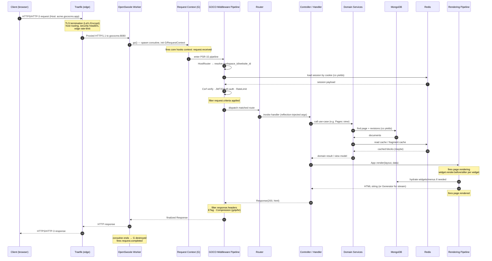

# Request Lifecycle

> How a single HTTP request travels through GOCO CMS — from the client's TLS handshake at Traefik, through the OpenSwoole worker and the GOCO middleware pipeline, into the router, domain services, MongoDB/Redis, the rendering pipeline, and back out — including every hook that fires along the way, coroutine-per-request isolation, error handling, and the streaming/SSE variant.

`stable`

GOCO CMS runs on [ZealPHP](zealphp-foundation.md) atop **OpenSwoole 22.1+** and **PHP 8.4+**. Unlike a classic PHP-FPM stack, the application server is **long-lived**: workers boot once, load the framework and GOCO core into memory, and then serve thousands of requests without re-bootstrapping. Every request is handled inside its own **coroutine**, giving you request isolation without the per-request cold-start cost.

This document traces one request end to end. Read it alongside the [Architecture Overview](overview.md), the [Rendering Pipeline](rendering-pipeline.md), the [Event & Hook System](event-hook-system.md), and [Multi-Tenancy](multi-tenancy.md).

---

## Contents

- [High-Level Flow](#high-level-flow)
- [Sequence Diagram](#sequence-diagram)
- [Stage 1 — Client to Traefik](#stage-1--client-to-traefik)
- [Stage 2 — Traefik to OpenSwoole Worker](#stage-2--traefik-to-openswoole-worker)
- [Stage 3 — Coroutine Spawn & Request Context](#stage-3--coroutine-spawn--request-context)
- [Stage 4 — The GOCO Middleware Pipeline](#stage-4--the-goco-middleware-pipeline)
- [Stage 5 — Routing & Reflection Injection](#stage-5--routing--reflection-injection)
- [Stage 6 — Controller, Domain Services & Data Layer](#stage-6--controller-domain-services--data-layer)
- [Stage 7 — Rendering](#stage-7--rendering)
- [Stage 8 — Response & Egress Middleware](#stage-8--response--egress-middleware)
- [Hooks & Events Reference](#hooks--events-reference)
- [Coroutine-Per-Request Isolation](#coroutine-per-request-isolation)
- [Error & Exception Handling](#error--exception-handling)
- [Streaming & SSE Variant](#streaming--sse-variant)
- [WebSocket Variant](#websocket-variant)
- [Performance Notes](#performance-notes)
- [Related](#related)

---

## High-Level Flow

A request passes through nine concentric layers. The outer two (Traefik, OpenSwoole) are infrastructure; the inner seven are GOCO application code:

| # | Layer | Responsibility | Where it lives |
|---|-------|----------------|----------------|
| 1 | **Traefik** | TLS termination, HTTP/3, host routing, edge middleware, rate limiting | `docker/`, container labels |
| 2 | **OpenSwoole HTTP server** | Accept the connection, pick a worker, spawn a coroutine | ZealPHP `App::run()` |
| 3 | **Request context (`G`)** | Per-coroutine state, `$_SERVER`/`$_GET`/`$_SESSION` isolation | `ZealPHP\G` / `RequestContext` |
| 4 | **GOCO middleware pipeline** | Tenant resolution, session, CSRF, auth, rate limit | `packages/*`, PSR-15 middleware |
| 5 | **Router** | Match path, inject params by name (reflection) | ZealPHP `App::route()` |
| 6 | **Controller / handler** | Translate HTTP into a domain use-case | `apps/*/src`, `apps/*/api` |
| 7 | **Domain services** | Business logic, invariants, transactions | `packages/*` (`Goco\`) |
| 8 | **Data layer** | MongoDB repositories, Redis cache/session | `packages/database`, `packages/queue` |
| 9 | **Rendering pipeline** | Layout → Section → widget composition → HTML | `packages/template-engine`, `packages/widget-engine` |

> **Note** Layers 3–9 all execute **inside a single coroutine** on **one** OpenSwoole worker. There is no process fork per request; concurrency comes from coroutine scheduling, and every blocking I/O call (MongoDB, Redis, HTTP) yields the coroutine so the worker can serve another request meanwhile.

---

## Sequence Diagram



---

## Stage 1 — Client to Traefik

Every public request first reaches **Traefik**, the Docker-first reverse proxy. Traefik is the only container exposed on ports 80/443; the `gococms` app container is never directly reachable from outside the Docker network.

Traefik handles, at the edge:

- **TLS termination** — automatic certificates via Let's Encrypt (ACME), including wildcard and multi-domain certs for tenant custom domains.
- **HTTP/3 (QUIC)** and HTTP/2, with HTTP→HTTPS redirect.
- **Host-based routing** — a router rule per tenant/domain selects the `gococms` service.
- **Edge middleware** — security headers (HSTS, X-Frame-Options, referrer policy), compression, and a coarse edge **rate limit** that protects the app from floods before a worker is ever touched.

Routing is configured with Docker labels on the `gococms` service (the Docker provider reads them dynamically — no restart needed to add a domain):

```yaml
# docker-compose.yml (excerpt)
services:
  gococms:
    image: gococms/core:latest
    labels:
      - "traefik.enable=true"
      - "traefik.http.routers.goco.rule=HostRegexp(`{host:.+}`)"
      - "traefik.http.routers.goco.entrypoints=websecure"
      - "traefik.http.routers.goco.tls.certresolver=le"
      - "traefik.http.services.goco.loadbalancer.server.port=8080"
      - "traefik.http.middlewares.goco-sec.headers.stsSeconds=31536000"
      - "traefik.http.middlewares.goco-rl.ratelimit.average=100"
      - "traefik.http.routers.goco.middlewares=goco-sec@docker,goco-rl@docker"
    healthcheck:
      test: ["CMD", "php", "app.php", "status"]
      interval: 10s
      timeout: 3s
      retries: 5
```

Traefik forwards the request to `gococms:8080` over plain HTTP inside the trusted Docker network, adding `X-Forwarded-For`, `X-Forwarded-Proto`, and `X-Forwarded-Host` so the app can reconstruct the client's true origin.

> **Tip** Wildcard routing (`HostRegexp`) lets GOCO accept *any* host and resolve the tenant at the application layer via `HostRouter`. This is what makes tenant onboarding a database write rather than a proxy reconfiguration. See [Traefik Reverse Proxy](../deployment/traefik.md).

---

## Stage 2 — Traefik to OpenSwoole Worker

Inside the container, ZealPHP has already booted the OpenSwoole HTTP server **once** at container start:

```php
// app.php — the runtime entry file
require 'vendor/autoload.php';

use ZealPHP\App;

App::superglobals(false);          // per-coroutine superglobal isolation
$app = App::init('0.0.0.0', 8080); // bind inside the container
App::mode(App::MODE_COROUTINE);    // modern coroutine mode (default)

// GOCO core wires middleware, routes, hooks during boot (fires core.boot)
require 'core/bootstrap.php';

$app->run();                       // blocks; workers now serve requests
```

`App::run()` starts a pool of OpenSwoole **worker processes** (sized to CPU cores by default). The master/manager processes accept the TCP connection from Traefik and hand the parsed HTTP request to an available worker. Because the framework, autoloader, compiled routes, and GOCO core are all resident in worker memory, there is **no per-request bootstrap** — the worker goes straight to spawning a coroutine.

The one-time `core.boot` hook (fired during `require core/bootstrap.php`) is where plugins register routes, hooks, widgets, and themes. It never fires again for the life of the worker.

---

## Stage 3 — Coroutine Spawn & Request Context

For each incoming request the worker spawns a coroutine (`go()`), and ZealPHP initializes a fresh **request context** — `ZealPHP\G` (backed by `RequestContext`). Because `App::superglobals(false)` was set, `$_SERVER`, `$_GET`, `$_POST`, `$_COOKIE`, and `$_SESSION` are transparently swapped to **per-coroutine** storage by `ext-zealphp`. Two requests running concurrently on the same worker never see each other's superglobals.

At this boundary GOCO fires the **`request.received`** action so observers (analytics, tracing, audit) can hook the very start of the lifecycle:

```php
Hook::dispatch('request.received', $request);
```

`G` carries request-scoped state for the whole coroutine: the resolved tenant, the authenticated user, the CSRF token, timing marks, and a per-request memoization cache. Anything you write to `G` is guaranteed private to this request and is torn down when the coroutine ends.

```php
use ZealPHP\G;

$g = G::context();
$g->set('request_id', bin2hex(random_bytes(8)));
$g->set('started_at', microtime(true));
```

---

## Stage 4 — The GOCO Middleware Pipeline

Middleware in ZealPHP is **PSR-15**. GOCO registers a fixed ingress order during boot; each middleware may short-circuit (return a response) or pass control on. Custom middleware implements `MiddlewareInterface::process()`.

```php
// core/bootstrap.php (excerpt) — registration order is significant
$app->addMiddleware(new \ZealPHP\Middleware\HostRouter());   // 1 tenant resolution
$app->addMiddleware(new \Goco\Http\Middleware\SessionMiddleware()); // 2 Redis session
$app->addMiddleware(new \ZealPHP\Middleware\Csrf());         // 3 CSRF
$app->addMiddleware(new \Goco\Http\Middleware\AuthMiddleware());    // 4 auth/JWT/OAuth
$app->addMiddleware(new \ZealPHP\Middleware\RateLimit());    // 5 per-tenant rate limit
$app->addMiddleware(new \ZealPHP\Middleware\Compression());  // 6 egress (runs on the way out)
$app->addMiddleware(new \ZealPHP\Middleware\ETag());         // 7 egress
```

### 4.1 Tenant resolution — `HostRouter`

The `HostRouter` middleware reads the effective `Host` (honoring `X-Forwarded-Host`) and resolves it to a tenant. It looks up the `domains` collection (cached in Redis) to map the hostname → `workspace_id` + `website_id`, then stamps both onto `G`. Every subsequent MongoDB query in the request is automatically scoped by these IDs (see [Multi-Tenancy](multi-tenancy.md)).

```php
$domain = $this->domains->resolve($request->host());     // Redis-cached
if ($domain === null) {
    return Response::notFound('unknown_host');           // 404 before any auth
}
G::context()->set('workspace_id', $domain->workspaceId);
G::context()->set('website_id',   $domain->websiteId);
Hook::dispatch('tenant.resolved', $domain);
```

### 4.2 Session load — Redis

`SessionMiddleware` calls `session_start()` (per-coroutine isolated) and hydrates the session from **Redis**, keyed by the signed session cookie. The read yields the coroutine while Redis responds, so the worker stays busy with other requests. Session writes are flushed on the way out.

### 4.3 CSRF — `Csrf`

For unsafe methods (`POST`/`PUT`/`PATCH`/`DELETE`) the `Csrf` middleware validates the double-submit token against the session value. GET requests receive/refresh the token. API routes authenticated by JWT are exempt (stateless, no cookie).

### 4.4 Authentication — `AuthMiddleware`

Auth is source-aware:

- **Browser/session** — the user id in the Redis session hydrates the `Goco\Auth\Identity` and its RBAC roles/capabilities into `G`.
- **API** — a `Bearer` **JWT** (or OAuth2 access token) is verified; claims populate the identity. 2FA/Passkey state is reflected in the token/session.

Capability checks themselves happen later in the domain services via the [Permission System](permission-system.md); this stage only establishes *who* the caller is.

### 4.5 Rate limiting — `RateLimit`

A fine-grained, per-identity/per-tenant limit backed by Redis counters (atomic `INCR` + TTL). This complements Traefik's coarse edge limit with app-aware quotas (e.g. per-API-key, per-endpoint). Exceeding it returns `429` with `Retry-After`.

Between middleware and dispatch, GOCO applies the **`request.criteria`** filter, letting plugins mutate the effective query/context (locale, preview mode, A/B bucket) before routing.

---

## Stage 5 — Routing & Reflection Injection

With context established, ZealPHP's router matches the path against the compiled route table. GOCO uses three complementary route sources:

1. **Explicit routes** — `App::route()`, `nsRoute()`, `nsPathRoute()`, `patternRoute()` registered at boot.
2. **File-based REST** — dropping `apps/api/api/pages/list.php` automatically serves `GET /api/pages/list` (return an `array`/`Generator` → auto-JSON).
3. **Catch-all page route** — a low-priority route that feeds unmatched paths into the CMS page resolver (slug → `pages` document → rendering).

Routing is **Flask-style** with **reflection-based dependency injection by parameter name**. The router inspects the handler's signature and supplies matching values — path params, plus framework services like `$request` and `$response`:

```php
$app->route('/blog/{slug}', function (string $slug, $request, $response) {
    // $slug comes from the URL; $request/$response injected by name
    return \Goco\Blog\Posts::viewBySlug($slug);   // array → JSON, or a view model
});
```

Handlers may return `int` (status), `array` (JSON), `string` (raw body), or `Generator` (streamed chunks) — ZealPHP maps the return type to the HTTP response automatically.

---

## Stage 6 — Controller, Domain Services & Data Layer

The handler is deliberately thin: it validates input and delegates to a **domain service** in `packages/*` under the `Goco\` namespace. Services own the business logic, enforce invariants, and are the only layer that touches the data stores.

```php
namespace Goco\Blog;

use Goco\Database\Repository;
use Goco\Cache\Cache;
use Goco\SDK\Hook;

final class Posts
{
    public static function viewBySlug(string $slug): array
    {
        $ctx   = \Goco\Context::current();          // workspace_id + website_id from G
        $posts = Repository::for('posts');          // tenant-scoped repository

        // Redis-cached read; the closure runs only on cache miss (co yields on I/O)
        return Cache::remember("post:{$ctx->websiteId}:{$slug}", 300, function () use ($posts, $slug) {
            $post = $posts->findOne(['slug' => $slug, 'status' => 'published']);
            if ($post === null) {
                throw new \Goco\Http\NotFoundException("post:{$slug}");
            }
            $post = Hook::apply('page.title', $post);  // filter example
            return $post->toArray();
        });
    }
}
```

**Data-layer characteristics** (see [MongoDB Data Layer](database-mongodb.md) and [Data Model](data-model.md)):

- **MongoDB** is the primary store, accessed through a lightweight document-mapper + **Repository** pattern in `packages/database` (`Goco\Database`) — *not* a heavy ORM. Repositories automatically inject `workspace_id`/`website_id` and the `deleted_at IS null` soft-delete filter into every query.
- **Redis** provides caching, fragment caching, locks, and rate-limit counters.
- Cross-collection invariants (e.g. publishing a page + writing a `page_revisions` doc + an `audit_logs` entry) run inside a **multi-document transaction**.
- Every blocking MongoDB/Redis call **yields the coroutine**; the OpenSwoole worker interleaves other requests while the driver awaits I/O.

Writes that change published content fire content lifecycle hooks — `content.publishing` (before, cancellable/filterable) and `content.published` (after) — which downstream consumers use to invalidate caches, reindex search, and enqueue jobs.

---

## Stage 7 — Rendering

For HTML responses, the handler hands its view model to the **rendering pipeline** (`packages/template-engine` + `packages/widget-engine`). ZealPHP exposes `App::render()`, `App::renderToString()`, `App::renderStream()`, `App::include()`, and `App::fragment()` (for htmx regions).

The pipeline walks the website hierarchy — **Layout → Section → Container → Row → Column → Widget** — composing HTML top-down. Firing order:

```php
Hook::dispatch('page.rendering', $page, $ctx);        // before composition

foreach ($layout->widgets() as $w) {
    Hook::dispatch('widget.render.before', $w);
    $html = Widget::render($w->type, $w->props, $ctx); // Goco\SDK\Widget facade
    $html = Hook::apply('widget.output', $html, $w);   // filter each widget's output
    Hook::dispatch('widget.render.after', $w, $html);
    // ...append to buffer...
}

$body = Hook::apply('menu.items', $body);             // menu/nav filters
Hook::dispatch('page.rendered', $page, $body);         // after composition
```

The renderer returns either a complete HTML **string** or, for large/streamed pages, a **Generator** (see the [Streaming variant](#streaming--sse-variant)). Widget and fragment output can be individually cached in Redis so unchanged regions skip re-rendering. Full details in the [Rendering Pipeline](rendering-pipeline.md).

---

## Stage 8 — Response & Egress Middleware

The handler's return value becomes a `Response`. On the way out, the PSR-15 pipeline runs its egress-phase middleware in reverse registration order, and GOCO applies the **`response.headers`** filter so plugins can add/adjust headers (cache-control, CSP nonces, tenant headers):

```php
$headers = Hook::apply('response.headers', $response->headers(), $request);
$response->withHeaders($headers);
```

Egress middleware then:

- **`ETag`** — computes/validates the entity tag; returns `304 Not Modified` when the client's `If-None-Match` matches, skipping the body entirely.
- **`Compression`** — negotiates `gzip`/`br` from `Accept-Encoding` and compresses the body (skipped for already-compressed media and for streamed responses where it would break flushing).
- **`Range`** — honors byte-range requests for media/downloads.

OpenSwoole writes the response back to Traefik, which re-applies TLS/HTTP-3 and delivers it to the client. As the coroutine unwinds, `G`/`RequestContext` is destroyed and GOCO fires **`request.completed`** (timing, access log, metrics). Session and any deferred writes are flushed here.

---

## Hooks & Events Reference

Hooks follow GOCO's naming convention — **actions** are `subject.verb[.tense]`, **filters** are `subject.noun`. Actions notify; filters transform a value and return it. (See the [Hook SDK](../sdk/hook-sdk.md) and [Event & Hook System](event-hook-system.md).)

| Stage | Hook | Kind | Fired when | Typical use |
|-------|------|------|------------|-------------|
| Boot (once) | `core.boot` | action | Worker boots, before serving | Register routes, hooks, widgets, themes |
| 3 | `request.received` | action | Coroutine spawned, `G` init | Tracing start, request id, analytics |
| 4.1 | `tenant.resolved` | action | HostRouter maps host → tenant | Load tenant settings, feature flags |
| 4 | `user.login` | action | Successful authentication | Audit log, last-seen, notifications |
| 4→5 | `request.criteria` | filter | Before dispatch | Locale/preview/A-B mutation of context |
| 6 | `content.publishing` | action | Before a publish write commits | Validation, guard, cache warm |
| 6 | `content.published` | action | After publish commit | Cache purge, search reindex, jobs |
| 6 | `query.criteria` | filter | Before a repository query runs | Inject scopes/constraints |
| 7 | `page.rendering` | action | Before page composition | Inject assets, set render context |
| 7 | `widget.render.before` | action | Before each widget renders | Per-widget instrumentation/guard |
| 7 | `widget.output` | filter | Around each widget's HTML | Shortcodes, sanitization, wrappers |
| 7 | `widget.render.after` | action | After each widget renders | Metrics, lazy-hydrate markers |
| 7 | `page.title` / `menu.items` | filter | During composition | SEO title, dynamic navigation |
| 7 | `page.rendered` | action | After composition | Post-process, minify, embed nonce |
| 8 | `response.headers` | filter | Before flush | Cache-control, CSP, custom headers |
| 8 | `request.completed` | action | Coroutine unwinds | Access log, timing, cleanup |

> **Note** Plugin-defined hooks are namespaced by the plugin slug (e.g. `acme-forms.submission.received`) to prevent collisions with core hooks. Use `Hook::dispatchAsync()` to fan a hook out into a background coroutine when observers must not block the response.

---

## Coroutine-Per-Request Isolation

The single most important mental-model shift from PHP-FPM:

- **One process, many requests.** A worker stays alive; requests are coroutines multiplexed onto it. Global mutable state persists between requests — so GOCO keeps request state in `G`, never in static/global variables you mutate per request.
- **Superglobals are per-coroutine.** With `App::superglobals(false)`, `$_SERVER`/`$_GET`/`$_POST`/`$_SESSION` are transparently isolated by `ext-zealphp`. No cross-talk between concurrent requests.
- **Blocking I/O yields.** MongoDB, Redis, and outbound HTTP calls suspend the coroutine (they don't block the worker), which is why one worker can serve high concurrency.
- **Cross-worker shared state** uses `\ZealPHP\Store` (an `OpenSwoole\Table`, optionally `Store::defaultBackend(Store::BACKEND_REDIS)`) and `\ZealPHP\Counter` (atomic) — never a plain PHP array, which would be per-worker and lost on restart.

```php
// WRONG in a coroutine server — leaks across requests on the same worker
static $currentUser;              // shared by every coroutine on this worker!

// RIGHT — request-scoped
G::context()->set('user', $identity);
$user = G::context()->get('user');
```

> **Warning** Never store per-request data in `static`/`global` variables or singletons that hold request state. That state is shared by every concurrent coroutine on the worker and will bleed between users. Keep request state in `G`; keep cross-worker state in `Store`/`Counter`/Redis.

---

## Error & Exception Handling

Exceptions bubble up through the domain service and handler; ZealPHP catches anything uncaught at the coroutine boundary so one failed request can never crash the worker.

GOCO maps domain exceptions to HTTP responses through a central handler:

| Exception | HTTP | Body (HTML) | Body (API/JSON) |
|-----------|------|-------------|-----------------|
| `Goco\Http\NotFoundException` | 404 | Themed 404 page | `{ "error": "not_found" }` |
| `Goco\Auth\UnauthenticatedException` | 401 | Login redirect / prompt | `{ "error": "unauthenticated" }` |
| `Goco\Auth\ForbiddenException` | 403 | Themed 403 page | `{ "error": "forbidden" }` |
| `Goco\Validation\ValidationException` | 422 | Form re-render with errors | `{ "error": "validation", "fields": … }` |
| `Goco\RateLimit\LimitExceeded` | 429 | Retry page | `{ "error": "rate_limited" }` (`Retry-After`) |
| Uncaught `\Throwable` | 500 | Themed error page (no stack in prod) | `{ "error": "internal" }` |

```php
try {
    $result = $handler(...$args);
} catch (\Goco\Http\HttpException $e) {
    Hook::dispatch('request.failed', $e);            // observers: alerting
    return ResponseMapper::fromException($e);        // status + themed/JSON body
} catch (\Throwable $e) {
    Log::error($e, ['request_id' => G::context()->get('request_id')]);
    Hook::dispatch('request.failed', $e);
    return ResponseMapper::internalError($e);        // 500; stack only in dev
}
```

Behavior notes:

- The response format (HTML vs JSON) is chosen from the route type and `Accept` header.
- Whether a stack trace is exposed is controlled by the `APP_DEBUG`/`APP_ENV` environment (never in production).
- All errors fire `request.failed`, feeding alerting/observability; `request.completed` still fires on unwind so timing/metrics are recorded even for failures.
- Because the coroutine is isolated, a failure aborts only that request — concurrent coroutines on the same worker are unaffected.

---

## Streaming & SSE Variant

For large pages, exports, and live feeds, a handler returns a **Generator** instead of a string. ZealPHP streams each `yield`ed chunk to the client immediately, keeping worker memory flat regardless of payload size.

### Chunked streaming (generator)

```php
$app->route('/reports/export', function ($request, $response): \Generator {
    yield "id,title,views\n";
    foreach (\Goco\Analytics\Reports::stream() as $row) {   // repository generator
        yield "{$row['id']},{$row['title']},{$row['views']}\n";
        \OpenSwoole\Coroutine\System::sleep(0);             // cooperative yield point
    }
});
```

Rendered pages can stream the same way via `App::renderStream()`, which emits layout/section HTML as a generator so the browser starts painting the header before the body is fully composed.

### Server-Sent Events (SSE)

SSE combines a generator with `$response->sse()`. The connection stays open on its coroutine; `co::sleep()` (`\OpenSwoole\Coroutine\sleep()`) paces events without blocking the worker:

```php
$app->route('/events/notifications', function ($request, $response): \Generator {
    $response->sse();                                        // set text/event-stream headers
    $chan = \Goco\Realtime\Notifications::subscribe();       // OpenSwoole Channel
    while (true) {
        $event = $chan->pop();                               // yields until a message arrives
        yield "event: notification\n";
        yield "data: " . json_encode($event) . "\n\n";
        co::sleep(0.1);
    }
});
```

> **Warning** The egress `Compression` and `ETag` middleware are bypassed for streamed/SSE responses — buffering or hashing the body would defeat incremental delivery. Ensure Traefik does not buffer these responses; GOCO sets `X-Accel-Buffering: no` and appropriate cache headers via the `response.headers` filter.

Realtime fan-out uses `\ZealPHP\Store::publish` + `App::subscribe` (or Redis pub/sub via `Store::defaultBackend(Store::BACKEND_REDIS)`) so an event produced on one worker reaches SSE/WebSocket clients connected to any worker. See [Caching, Queue & Realtime](caching-and-queue.md).

---

## WebSocket Variant

WebSocket upgrades bypass the HTTP request pipeline and are handled by dedicated callbacks registered at boot:

```php
$app->ws('/ws/site',
    onOpen:    fn($server, $req)          => \Goco\Realtime\Presence::join($req->fd),
    onMessage: fn($server, $frame)        => $server->push($frame->fd, Handler::route($frame->data)),
    onClose:   fn($server, $fd)           => \Goco\Realtime\Presence::leave($fd),
);
```

Each connection lives on its own coroutine for its full duration. Broadcasts use the same cross-worker `Store::publish`/`App::subscribe` mechanism as SSE, so a message pushed from an HTTP request or a background job reaches every subscribed socket regardless of which worker owns it.

---

## Performance Notes

- **No per-request bootstrap** — framework, routes, and GOCO core are resident in worker memory; a request goes straight from accept → coroutine → dispatch.
- **I/O concurrency for free** — coroutine yields on MongoDB/Redis/HTTP mean one worker handles many in-flight requests; scale workers to cores, then scale containers behind Traefik.
- **Cache aggressively at three tiers** — domain/object cache (Redis), fragment/widget cache (Redis), and HTTP cache (`ETag` + `Cache-Control`); most hits never reach MongoDB.
- **Keep hooks cheap** — hooks run inline in the request path; offload heavy work with `Hook::dispatchAsync()` or the job queue (`jobs` collection + Redis).
- **Stream large payloads** — return generators so memory stays flat and time-to-first-byte drops.
- **Warm indexes** — every documented MongoDB index in [Data Model](data-model.md) exists to keep request-path queries covered; verify with `explain()` under load.

See [Scaling Strategy](../deployment/scaling.md) for horizontal scaling, worker sizing, and sticky-vs-stateless session guidance.

---

## Related

- [Architecture Overview](overview.md)
- [ZealPHP Foundation](zealphp-foundation.md)
- [Service Container & Dependency Injection](service-container.md)
- [Event & Hook System](event-hook-system.md)
- [Rendering Pipeline](rendering-pipeline.md)
- [Multi-Tenancy](multi-tenancy.md)
- [MongoDB Data Layer](database-mongodb.md)
- [Data Model (Collections & Indexes)](data-model.md)
- [Permission System (RBAC + ABAC)](permission-system.md)
- [Caching, Queue & Realtime (Redis)](caching-and-queue.md)
- [Routing](../core/routing.md)
- [Authentication](../core/authentication.md)
- [Hook SDK](../sdk/hook-sdk.md)
- [Traefik Reverse Proxy](../deployment/traefik.md)
- [Docker Architecture](../deployment/docker.md)
- [Scaling Strategy](../deployment/scaling.md)
- [Documentation Index](../README.md)
