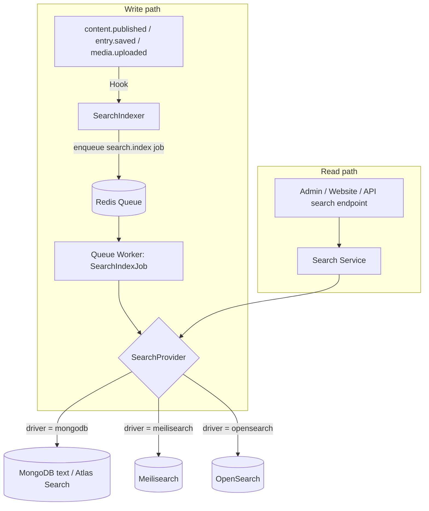

# Search

> Pluggable full-text and faceted search for GOCO CMS: one `SearchProvider` interface, three swappable backends (MongoDB, Meilisearch, OpenSearch), per-tenant indexes, and queue-driven reindexing — change providers via config with zero application-code changes.

**Stability:** `beta`

GOCO CMS treats search as a **provider-driven capability**, exactly like [storage](storage.md). Application code — the [Blog Engine](../core/blog-engine.md), [Database Builder](../core/database-builder.md), the [admin app](../getting-started/project-structure.md), the [Widget Engine](../core/widget-engine.md) — talks only to the `Search` service and the `SearchProvider` interface. The concrete backend is selected by configuration. Swap MongoDB for Meilisearch for OpenSearch by editing one environment variable and running a reindex job; no handler, service, or widget changes.

This document specifies the interface, the three shipped providers, the index schema, per-tenant isolation, queue-driven reindexing, and the query model (filters, facets, ranking, highlighting).

---

## 1. Design goals

| Goal | How it is met |
| --- | --- |
| **Backend-agnostic app code** | All callers depend on `Goco\Search\SearchProvider`, never a concrete driver. |
| **Swap without redeploy** | Provider chosen by `SEARCH_DRIVER` env var; a `search:reindex` job repopulates the new backend. |
| **Multi-tenant isolation** | Every indexed document is namespaced by `workspace_id` + `website_id`; each tenant gets an isolated logical index. |
| **Consistent query model** | One `SearchQuery` value object (text, filters, facets, sort, pagination, highlight) normalized across backends. |
| **Eventual consistency, no write-path coupling** | Indexing happens off the request path via the [Redis queue](caching-and-queue.md); a page save never blocks on the search backend. |
| **Graceful degradation** | If the search backend is unreachable, reads fall back to the [MongoDB](database-mongodb.md) provider (always available); writes buffer in the queue. |

---

## 2. Architecture overview



- **`Search` service** (`Goco\Search\Search`) — the facade used by application code. Resolves the active provider from the [service container](service-container.md).
- **`SearchProvider`** — the driver contract each backend implements.
- **`SearchIndexer`** — listens to content [events/hooks](event-hook-system.md) and enqueues index/delete jobs.
- **`SearchIndexJob` / `SearchReindexJob`** — queue jobs (see [Caching, Queue & Realtime](caching-and-queue.md)) that call the provider.
- **`IndexableRegistry`** — maps collections (`pages`, `posts`, `collection_entries`, `media`) to the transformer that produces the flat search document.

---

## 3. The `SearchProvider` interface

Every backend implements the same contract. This is the *only* surface application code and jobs depend on.

```php
<?php

namespace Goco\Search;

interface SearchProvider
{
    /** Index (create or replace) a single document. Idempotent by $doc->id. */
    public function index(SearchDocument $doc): void;

    /** Bulk index/replace many documents in one round trip. */
    public function bulkIndex(iterable $docs): BulkResult;

    /** Execute a query and return ranked hits, facets, and total. */
    public function search(SearchQuery $query): SearchResult;

    /** Remove a single document by index name + id. */
    public function delete(string $index, string $id): void;

    /** Remove all documents matching a filter (e.g. an entire website). */
    public function deleteBy(string $index, array $filter): int;

    /** Drop and rebuild an index from scratch, applying settings/schema. */
    public function reindex(string $index, iterable $docs, IndexSettings $settings): void;

    /** Create/ensure an index exists with the given settings (idempotent). */
    public function ensureIndex(string $index, IndexSettings $settings): void;

    /** Liveness/readiness probe for health checks and failover. */
    public function healthy(): bool;

    /** Capabilities so callers can degrade gracefully (typo-tolerance, geo, vectors). */
    public function capabilities(): ProviderCapabilities;
}
```

### 3.1 Value objects

```php
<?php

namespace Goco\Search;

/** A flat, backend-neutral document ready to be indexed. */
final class SearchDocument
{
    public function __construct(
        public readonly string $index,        // resolved per-tenant index name
        public readonly string $id,           // "{collection}:{_id}"
        public readonly array  $fields,       // searchable + stored fields
        public readonly array  $facets = [],  // filterable/facetable attributes
        public readonly ?array $geo = null,   // ['lat'=>..,'lng'=>..] optional
    ) {}
}

final class SearchQuery
{
    public function __construct(
        public readonly string $index,
        public readonly string $text = '',
        public readonly array  $filters = [],   // ['type' => 'post', 'status' => 'published']
        public readonly array  $facets = [],    // attributes to compute counts for
        public readonly array  $sort = [],      // [['field'=>'published_at','dir'=>'desc']]
        public readonly int    $page = 1,
        public readonly int    $perPage = 20,
        public readonly bool   $highlight = true,
        public readonly ?array $geoWithin = null,
    ) {}
}

final class SearchResult
{
    public function __construct(
        public readonly array $hits,        // [['id'=>..,'score'=>..,'fields'=>..,'_formatted'=>..], ...]
        public readonly int   $total,
        public readonly array $facets,      // ['type' => ['post'=>42,'page'=>7], ...]
        public readonly int   $tookMs,
        public readonly int   $page,
        public readonly int   $perPage,
    ) {}
}
```

> **Note**
> `SearchDocument->id` is deterministic (`"{collection}:{_id}"`) so re-indexing the same source document overwrites rather than duplicates. This makes `index()` idempotent across all backends.

---

## 4. What gets indexed

Only a curated projection of each source collection is indexed — never the raw MongoDB document. The `IndexableRegistry` registers one transformer per source collection.

| Source collection | Index (logical) | Searchable fields | Facet / filter fields | Notes |
| --- | --- | --- | --- | --- |
| `pages` | `content` | `title`, `body_text`, `excerpt`, `slug` | `type=page`, `status`, `locale`, `author_id`, `updated_at` | `body_text` is the rendered layout stripped to plain text. |
| `posts` | `content` | `title`, `body_text`, `excerpt`, `tags`, `categories` | `type=post`, `status`, `locale`, `author_id`, `category`, `tag`, `published_at` | Draft/scheduled posts excluded from public index (see 4.2). |
| `collection_entries` | `content` | dynamic per [Database Builder](../core/database-builder.md) schema (fields flagged `searchable`) | fields flagged `filterable` / `facetable` | Schema-driven; each dynamic collection contributes its own facet set. |
| `media` | `media` | `filename`, `title`, `alt`, `caption`, `description`, `ocr_text` | `type=media`, `mime`, `folder`, `uploaded_by` | Metadata only; see [Storage & Media](storage.md). Binary is never indexed; optional OCR/EXIF text is. |

### 4.1 The transformer

```php
<?php

namespace Goco\Search\Transformers;

use Goco\Search\SearchDocument;

final class PostTransformer implements Indexable
{
    public function supports(string $collection): bool
    {
        return $collection === 'posts';
    }

    public function toDocument(array $doc, IndexNamer $namer): SearchDocument
    {
        return new SearchDocument(
            index: $namer->for('content', $doc['workspace_id'], $doc['website_id']),
            id: "posts:{$doc['_id']}",
            fields: [
                'title'        => $doc['title'],
                'excerpt'      => $doc['excerpt'] ?? '',
                'body_text'    => strip_tags($doc['rendered_html'] ?? ''),
                'slug'         => $doc['slug'],
                'tags'         => $doc['tags'] ?? [],
                'categories'   => $doc['categories'] ?? [],
                'published_at' => $doc['published_at']?->toDateTime()->getTimestamp(),
            ],
            facets: [
                'type'      => 'post',
                'status'    => $doc['status'],
                'locale'    => $doc['locale'] ?? 'en',
                'author_id' => (string) $doc['created_by'],
                'category'  => $doc['categories'] ?? [],
                'tag'       => $doc['tags'] ?? [],
                // tenant scoping — always present on every document
                'workspace_id' => (string) $doc['workspace_id'],
                'website_id'   => (string) $doc['website_id'],
            ],
        );
    }
}
```

### 4.2 Visibility rules

Only **publicly visible** content lands in the public read path. The transformer sets `status`, and the read-side `Search` service injects a mandatory `status = published` and `deleted_at = null` filter for anonymous/website queries. Admin searches (with `pages.read` / `posts.read` [capabilities](permission-system.md)) may pass `status: ['draft','published','scheduled']` explicitly. Soft-deleted documents (`deleted_at != null`) are removed from the index by the delete job, never merely filtered.

---

## 5. Index schema & settings

`IndexSettings` is the backend-neutral description of an index. Each provider translates it into its native form (MongoDB indexes, Meilisearch settings, OpenSearch mappings).

```php
$settings = new IndexSettings(
    searchable:   ['title', 'excerpt', 'body_text', 'tags', 'categories', 'filename', 'alt'],
    filterable:   ['type', 'status', 'locale', 'author_id', 'category', 'tag', 'mime', 'folder',
                   'workspace_id', 'website_id'],
    facetable:    ['type', 'category', 'tag', 'locale', 'mime'],
    sortable:     ['published_at', 'updated_at', 'title'],
    ranking:      ['words', 'typo', 'proximity', 'attribute', 'exactness', 'published_at:desc'],
    typoTolerance: true,
    stopWords:    ['the', 'a', 'an', 'of', 'and'],
    synonyms:     ['ai' => ['artificial intelligence'], 'cms' => ['content management system']],
    highlightPre: '<mark>',
    highlightPost:'</mark>',
);
```

| Field | Meaning | MongoDB | Meilisearch | OpenSearch |
| --- | --- | --- | --- | --- |
| `searchable` | Full-text matchable | Compound `text` index / Atlas Search `text` path | `searchableAttributes` | `type: text` mapping |
| `filterable` | Exact/range filter | Standard indexes | `filterableAttributes` | `type: keyword`/`date` |
| `facetable` | Faceted counts | `$facet` aggregation | `filterableAttributes` (facets) | `terms` aggregation |
| `sortable` | Ordered results | Index on field | `sortableAttributes` | `type: keyword`/`date` |
| `ranking` | Relevance rules | `textScore` + sort | `rankingRules` | `function_score` |
| `typoTolerance` | Fuzzy match | n/a (regex fallback) | native | `fuzziness: AUTO` |
| `synonyms` | Query expansion | app-side expansion | native | `synonym` analyzer |

---

## 6. Per-tenant indexes

GOCO CMS is multi-tenant (see [Multi-Tenancy](multi-tenancy.md)). Search isolation is enforced at two levels:

1. **Index namespacing** — the `IndexNamer` derives a physical index name from the logical name plus tenant scope.
2. **Mandatory filter** — every `SearchQuery` is rewritten to include `workspace_id` and `website_id` filters, so even a shared physical index cannot leak across tenants.

```php
<?php

namespace Goco\Search;

final class IndexNamer
{
    public function __construct(private string $strategy, private string $prefix) {}

    public function for(string $logical, string $workspaceId, string $websiteId): string
    {
        return match ($this->strategy) {
            // Enterprise: one physical index per website — hard isolation.
            'per_website'   => "{$this->prefix}_{$logical}_{$workspaceId}_{$websiteId}",
            // Default: one physical index per workspace — websites separated by filter.
            'per_workspace' => "{$this->prefix}_{$logical}_{$workspaceId}",
            // Shared physical index — tenants separated purely by mandatory filter.
            'shared'        => "{$this->prefix}_{$logical}",
        };
    }
}
```

| Strategy | Isolation | Cost | When |
| --- | --- | --- | --- |
| `shared` | Filter-only | Lowest | Dev, small deployments |
| `per_workspace` | Physical per workspace (default) | Moderate | Standard SaaS |
| `per_website` | Physical per website | Highest | Enterprise, strict tenancy / database-per-workspace |

Configured by `SEARCH_INDEX_STRATEGY`. This mirrors the [database-per-workspace](multi-tenancy.md) option in the data layer.

---

## 7. The three providers

### 7.1 MongoDB provider (`mongodb`) — always available, zero extra infra

Uses the primary [MongoDB](database-mongodb.md) database, so it needs no extra container. Two modes:

- **`text` mode** — MongoDB compound `text` indexes with `$text` / `$meta: "textScore"`. Good baseline; language-aware stemming; no typo tolerance.
- **`atlas` mode** — MongoDB **Atlas Search** (`$search` aggregation stage) for fuzzy matching, highlighting, faceting, and autocomplete on Atlas-hosted clusters.

```php
<?php

namespace Goco\Search\Providers;

use Goco\Search\{SearchProvider, SearchQuery, SearchResult};
use MongoDB\Client;

final class MongoDbSearchProvider implements SearchProvider
{
    public function __construct(private Client $client, private string $db, private string $mode) {}

    public function ensureIndex(string $index, IndexSettings $s): void
    {
        $coll = $this->client->selectCollection($this->db, "_search_{$index}");
        // Compound text index over searchable fields (text mode).
        $weights = ['title' => 10, 'excerpt' => 5, 'body_text' => 1];
        $keys = array_fill_keys($s->searchable, 'text');
        $coll->createIndex($keys, ['weights' => $weights, 'name' => 'goco_text']);
        foreach ($s->filterable as $f) {
            $coll->createIndex([$f => 1]);
        }
    }

    public function search(SearchQuery $q): SearchResult
    {
        $coll = $this->client->selectCollection($this->db, "_search_{$q->index}");

        if ($this->mode === 'atlas') {
            return $this->atlasSearch($coll, $q);   // $search + $facet stages
        }

        $filter = ['$text' => ['$search' => $q->text]] + $this->toMongoFilter($q->filters);
        $cursor = $coll->find($filter, [
            'projection' => ['score' => ['$meta' => 'textScore']] + array_fill_keys(/*stored*/[], 1),
            'sort'       => ['score' => ['$meta' => 'textScore']],
            'skip'       => ($q->page - 1) * $q->perPage,
            'limit'      => $q->perPage,
        ]);
        // ... map cursor -> hits, run a $facet pipeline for counts ...
    }
    // index(), bulkIndex(), delete(), deleteBy(), reindex(), healthy(), capabilities() ...
}
```

> **Note**
> The MongoDB provider stores search documents in dedicated `_search_{index}` collections rather than querying source collections directly. This keeps the flat search projection independent of the source schema and lets `text`/`atlas` share the same shape. It is also the mandatory **fallback provider** when the configured backend is unhealthy.

**Capabilities:** typo-tolerance only in `atlas` mode; highlighting only in `atlas` mode; faceting via aggregation in both.

### 7.2 Meilisearch provider (`meilisearch`) — typo-tolerant, instant

The recommended default for most deployments: sub-50 ms responses, built-in typo tolerance, instant-search / as-you-type, native faceting and highlighting. Ships as a Docker service.

```php
<?php

namespace Goco\Search\Providers;

final class MeilisearchProvider implements SearchProvider
{
    public function __construct(private \Meilisearch\Client $client) {}

    public function ensureIndex(string $index, IndexSettings $s): void
    {
        $ix = $this->client->index($index);
        $ix->updateSettings([
            'searchableAttributes' => $s->searchable,
            'filterableAttributes' => $s->filterable,
            'sortableAttributes'   => $s->sortable,
            'rankingRules'         => $s->ranking,
            'stopWords'            => $s->stopWords,
            'synonyms'             => $s->synonyms,
            'typoTolerance'        => ['enabled' => $s->typoTolerance],
        ]);
    }

    public function search(SearchQuery $q): SearchResult
    {
        $res = $this->client->index($q->index)->search($q->text, [
            'filter'                => $this->toMeiliFilter($q->filters),
            'facets'                => $q->facets,
            'sort'                  => $this->toMeiliSort($q->sort),
            'page'                  => $q->page,
            'hitsPerPage'           => $q->perPage,
            'attributesToHighlight' => $q->highlight ? ['*'] : [],
            'highlightPreTag'       => '<mark>',
            'highlightPostTag'      => '</mark>',
        ]);

        return new SearchResult(
            hits:    $res->getHits(),
            total:   $res->getTotalHits(),
            facets:  $res->getFacetDistribution() ?? [],
            tookMs:  $res->getProcessingTimeMs(),
            page:    $q->page,
            perPage: $q->perPage,
        );
    }

    public function bulkIndex(iterable $docs): BulkResult
    {
        $byIndex = [];
        foreach ($docs as $d) {
            $byIndex[$d->index][] = ['id' => $this->safeId($d->id)] + $d->fields + $d->facets;
        }
        foreach ($byIndex as $index => $rows) {
            $this->client->index($index)->addDocuments($rows, 'id');
        }
        return new BulkResult(/* task uids for tracking */);
    }
    // ...
}
```

> **Tip**
> Meilisearch ids may only contain `[A-Za-z0-9_-]`. `safeId()` replaces the `:` in `"posts:663f..."` with `_`. The reverse map is stored in `fields['_source_id']` for round-tripping to MongoDB.

**Capabilities:** typo-tolerance, instant search, faceting, highlighting, synonyms — all native.

### 7.3 OpenSearch provider (`opensearch`) — advanced / enterprise

For large corpora, advanced relevance tuning, geo, vectors/kNN, cross-cluster search, and analytics. Uses the OpenSearch REST API with native mappings, `bool`/`function_score` queries, and `terms` aggregations for facets.

```php
<?php

namespace Goco\Search\Providers;

final class OpenSearchProvider implements SearchProvider
{
    public function __construct(private \OpenSearch\Client $client) {}

    public function search(SearchQuery $q): SearchResult
    {
        $body = [
            'from' => ($q->page - 1) * $q->perPage,
            'size' => $q->perPage,
            'query' => [
                'bool' => [
                    'must'   => [['multi_match' => [
                        'query'     => $q->text,
                        'fields'    => ['title^10', 'excerpt^5', 'body_text'],
                        'fuzziness' => 'AUTO',
                    ]]],
                    'filter' => $this->toEsFilters($q->filters),
                ],
            ],
            'highlight' => ['fields' => ['*' => new \stdClass()],
                            'pre_tags' => ['<mark>'], 'post_tags' => ['</mark>']],
            'aggs' => $this->toEsAggs($q->facets),
            'sort' => $this->toEsSort($q->sort),
        ];
        $res = $this->client->search(['index' => $q->index, 'body' => $body]);
        // ... map hits, aggregations -> facets ...
    }
    // ...
}
```

**Capabilities:** typo-tolerance (`fuzziness`), highlighting, faceting, synonyms, geo, kNN vector search (pairs with the [AI Platform](../core/ai-platform.md) for semantic search).

### 7.4 Capability matrix

| Feature | MongoDB `text` | MongoDB `atlas` | Meilisearch | OpenSearch |
| --- | --- | --- | --- | --- |
| Extra container required | No | No (Atlas) | Yes | Yes |
| Typo tolerance | No | Yes | Yes | Yes |
| Instant / as-you-type | No | Partial | Yes | Partial |
| Faceting | Aggregation | Yes | Yes | Yes |
| Highlighting | No | Yes | Yes | Yes |
| Synonyms | App-side | Yes | Yes | Yes |
| Geo search | 2dsphere | Yes | Yes | Yes |
| Vector / semantic | No | Yes | Beta | Yes (kNN) |
| Best for | Dev / minimal infra | Atlas users | Most sites (default) | Enterprise / scale |

---

## 8. Indexing pipeline (events → queue → provider)

Indexing is **never** on the request path. Content mutations fire [hooks](event-hook-system.md); the `SearchIndexer` enqueues jobs onto the [Redis queue](caching-and-queue.md).

```php
<?php
// packages/search/src/SearchIndexer.php
use Goco\SDK\Hook;
use Goco\Queue\Queue;

final class SearchIndexer
{
    public function boot(): void
    {
        Hook::listen('content.published', fn($doc) => $this->enqueue('index', $doc));
        Hook::listen('page.updated',      fn($doc) => $this->enqueue('index', $doc));
        Hook::listen('post.updated',      fn($doc) => $this->enqueue('index', $doc));
        Hook::listen('entry.saved',       fn($doc) => $this->enqueue('index', $doc));
        Hook::listen('media.uploaded',    fn($doc) => $this->enqueue('index', $doc));

        Hook::listen('content.unpublished', fn($doc) => $this->enqueue('delete', $doc));
        Hook::listen('content.deleted',     fn($doc) => $this->enqueue('delete', $doc));
    }

    private function enqueue(string $op, array $doc): void
    {
        Queue::push(new SearchIndexJob($op, $doc['_id'], $doc['_collection'],
            $doc['workspace_id'], $doc['website_id']));
    }
}
```

The job re-loads the document, transforms it, and calls the provider — so it always indexes the latest state, even if several updates coalesce.

```php
<?php
final class SearchIndexJob implements Job
{
    public function handle(SearchProvider $provider, Repository $repo,
                           IndexableRegistry $registry, IndexNamer $namer): void
    {
        if ($this->op === 'delete') {
            $index = $namer->for($this->logicalFor($this->collection), $this->wsId, $this->siteId);
            $provider->delete($index, "{$this->collection}:{$this->id}");
            return;
        }
        $doc = $repo->collection($this->collection)->find($this->id);
        if ($doc === null || $doc['deleted_at'] !== null) {
            return; // vanished/soft-deleted -> nothing to index
        }
        $searchDoc = $registry->transformerFor($this->collection)->toDocument($doc, $namer);
        $provider->index($searchDoc);
    }
}
```

### 8.1 Reindex jobs

Full reindexing (after schema change, provider swap, or corruption) runs as a chunked, resumable job so large tenants don't overwhelm the backend.

```php
<?php
final class SearchReindexJob implements Job
{
    public function handle(SearchProvider $provider, Repository $repo,
                           IndexableRegistry $registry, IndexNamer $namer): void
    {
        $settings = $registry->settingsFor($this->logical);
        $index = $namer->for($this->logical, $this->wsId, $this->siteId);
        $provider->ensureIndex($index, $settings);

        foreach ($this->collectionsFor($this->logical) as $collection) {
            $transformer = $registry->transformerFor($collection);
            foreach ($repo->collection($collection)
                          ->where(['workspace_id' => $this->wsId, 'website_id' => $this->siteId,
                                   'deleted_at' => null])
                          ->cursorBatched(500) as $batch) {
                $provider->bulkIndex(array_map(
                    fn($d) => $transformer->toDocument($d, $namer), $batch));
            }
        }
    }
}
```

Trigger via the [CLI](../reference/cli-reference.md):

```bash
# Reindex one website
php goco search:reindex --workspace=acme --website=blog

# Reindex everything (e.g. after switching providers)
php goco search:reindex --all

# Swap provider, then reindex, in one command
php goco search:switch meilisearch --reindex
```

> **Warning**
> `search:reindex --all` on a large deployment can generate significant load. Jobs run on a dedicated `search` queue (see [Caching, Queue & Realtime](caching-and-queue.md)) with its own concurrency limit so reindexing never starves the default queue.

---

## 9. Query model — filters, facets, ranking, highlighting

A single normalized query flows through the read path. The website search endpoint is a [file-based REST route](../core/routing.md):

```php
<?php
// apps/website/api/search.php  ->  GET /api/search
use Goco\Search\{Search, SearchQuery};
use Goco\Http\RequestContext;

$ctx = RequestContext::current();

$result = Search::query(new SearchQuery(
    index:   'content',
    text:    $_GET['q'] ?? '',
    filters: array_filter([
        'type'   => $_GET['type']   ?? null,   // page|post|entry
        'locale' => $_GET['locale'] ?? null,
    ]),
    facets:  ['type', 'category', 'tag'],
    sort:    [['field' => 'published_at', 'dir' => 'desc']],
    page:    (int) ($_GET['page'] ?? 1),
    perPage: 20,
    highlight: true,
));

return [                       // array return -> auto-JSON in ZealPHP
    'total'  => $result->total,
    'tookMs' => $result->tookMs,
    'facets' => $result->facets,
    'hits'   => $result->hits,
];
```

The `Search` service automatically:

1. **Injects tenant scope** — adds `workspace_id`/`website_id` from `RequestContext` to `filters` and resolves the physical index via `IndexNamer`.
2. **Enforces visibility** — forces `status = published`, `deleted_at = null` for anonymous callers; relaxed only when the caller holds the matching read [capability](permission-system.md).
3. **Normalizes** the query for the active provider.

### 9.1 Faceting

`facets: ['type','category','tag']` returns counts per value so the UI can render facet filters:

```json
{
  "facets": {
    "type":     { "post": 128, "page": 14, "entry": 42 },
    "category": { "engineering": 40, "product": 33, "news": 21 },
    "tag":      { "zealphp": 18, "mongodb": 15, "search": 12 }
  }
}
```

### 9.2 Ranking

Default ranking order: **words → typo → proximity → attribute weight → exactness → recency** (`published_at:desc`). Field weights favor `title` (×10) and `excerpt` (×5) over `body_text` (×1). Tune per index via `IndexSettings->ranking` — the neutral rule list is translated to each backend's native mechanism (Meilisearch `rankingRules`, OpenSearch `function_score`, MongoDB text `weights` + sort).

### 9.3 Highlighting

When `highlight: true`, hits include a `_formatted` block with matched terms wrapped in `<mark>…</mark>` (configurable pre/post tags). The MongoDB `text` provider is the only backend without native highlighting; it applies a safe app-side highlighter as a fallback.

---

## 10. Configuration — swapping providers with zero app-code change

All selection is by environment variable / config. No caller changes when you switch.

```env
# .env
SEARCH_DRIVER=meilisearch          # mongodb | meilisearch | opensearch
SEARCH_INDEX_STRATEGY=per_workspace # shared | per_workspace | per_website
SEARCH_INDEX_PREFIX=goco
SEARCH_FALLBACK=mongodb            # provider used when SEARCH_DRIVER is unhealthy

# MongoDB provider
SEARCH_MONGODB_MODE=text           # text | atlas

# Meilisearch provider
MEILISEARCH_HOST=http://meilisearch:7700
MEILISEARCH_KEY=change-me-master-key

# OpenSearch provider
OPENSEARCH_HOSTS=https://opensearch:9200
OPENSEARCH_USER=admin
OPENSEARCH_PASSWORD=change-me
```

```php
<?php
// packages/search/config/search.php
return [
    'driver'   => env('SEARCH_DRIVER', 'mongodb'),
    'fallback' => env('SEARCH_FALLBACK', 'mongodb'),
    'strategy' => env('SEARCH_INDEX_STRATEGY', 'per_workspace'),
    'prefix'   => env('SEARCH_INDEX_PREFIX', 'goco'),

    'providers' => [
        'mongodb'     => ['mode' => env('SEARCH_MONGODB_MODE', 'text')],
        'meilisearch' => ['host' => env('MEILISEARCH_HOST'), 'key' => env('MEILISEARCH_KEY')],
        'opensearch'  => ['hosts' => env('OPENSEARCH_HOSTS'),
                          'user' => env('OPENSEARCH_USER'), 'pass' => env('OPENSEARCH_PASSWORD')],
    ],
];
```

The provider is bound in the [service container](service-container.md):

```php
<?php
$container->singleton(SearchProvider::class, function ($c) {
    $cfg = $c->get('config')->get('search');
    $primary = SearchProviderFactory::make($cfg['driver'], $cfg['providers']);
    // Wrap in a failover decorator that falls back to MongoDB when unhealthy.
    return new FailoverSearchProvider($primary,
        SearchProviderFactory::make($cfg['fallback'], $cfg['providers']));
});
```

**Migration playbook** (e.g. Meilisearch → OpenSearch):

```bash
# 1. Bring up the new backend (see docker section) and set env
SEARCH_DRIVER=opensearch php goco search:switch opensearch
# 2. Rebuild indexes on the new backend
php goco search:reindex --all
# 3. Verify, then decommission the old service.
```

No application code, widget, or endpoint changes at any step.

---

## 11. Docker services

The `meilisearch` service ships in the default `docker-compose.yml` alongside `gococms`, `mongodb`, `redis`, `traefik`, `minio`, and `mailpit` (see [Docker Architecture](../deployment/docker.md)).

```yaml
# docker-compose.yml (search excerpt)
services:
  meilisearch:
    image: getmeili/meilisearch:v1.10
    environment:
      MEILI_MASTER_KEY: ${MEILISEARCH_KEY}
      MEILI_ENV: production
      MEILI_NO_ANALYTICS: "true"
    volumes:
      - meili_data:/meili_data
    restart: unless-stopped
    healthcheck:
      test: ["CMD", "curl", "-f", "http://localhost:7700/health"]
      interval: 10s
      timeout: 5s
      retries: 5
    networks: [goco]

  # Optional: swap in for enterprise deployments (profile: opensearch)
  opensearch:
    image: opensearchproject/opensearch:2.16.0
    profiles: ["opensearch"]
    environment:
      discovery.type: single-node
      OPENSEARCH_INITIAL_ADMIN_PASSWORD: ${OPENSEARCH_PASSWORD}
    volumes:
      - opensearch_data:/usr/share/opensearch/data
    restart: unless-stopped
    healthcheck:
      test: ["CMD-SHELL", "curl -sk https://localhost:9200 -u admin:$$OPENSEARCH_PASSWORD || exit 1"]
      interval: 15s
      timeout: 5s
      retries: 5
    networks: [goco]

volumes:
  meili_data:
  opensearch_data:
```

> **Note**
> Meilisearch and OpenSearch are internal services on the `goco` Docker network — they are **not** exposed through [Traefik](../deployment/traefik.md). Only the `gococms` app reaches them; the public surface is the `/api/search` route.

The MongoDB provider needs **no** additional service — it reuses the existing `mongodb` container, which is why it is the default and the failover backend.

---

## 12. Security

- **Tenant isolation is mandatory, not optional.** The `Search` service rewrites every query with `workspace_id`/`website_id` from `RequestContext`; a caller cannot query outside its tenant even with a hand-crafted `SearchQuery`. See [Multi-Tenancy](multi-tenancy.md) and [Permission System](permission-system.md).
- **Visibility filters are server-enforced.** Anonymous callers can never retrieve draft/unpublished/soft-deleted documents regardless of request parameters.
- **Backend credentials never reach the client.** All search flows through `/api/search`; the Meilisearch master key / OpenSearch credentials stay server-side. If you use Meilisearch's front-end instant-search, mint a **tenant-scoped, read-only tenant token** with a locked `workspace_id`/`website_id` filter — never expose the master key.
- **Query input is treated as untrusted** — text is passed as a query parameter (never string-concatenated into a filter DSL); filters are whitelisted against `IndexSettings->filterable`.
- **Rate limiting** on `/api/search` via the ZealPHP `RateLimit` middleware (Redis-backed) to prevent enumeration/abuse — see [Routing](../core/routing.md).

---

## 13. Performance strategy

| Concern | Approach |
| --- | --- |
| Write-path latency | Indexing is fully async via the [Redis queue](caching-and-queue.md); content saves never wait on search. |
| Read latency | Meilisearch p50 < 50 ms; results of common queries cached in Redis with a short TTL keyed by `(index, normalized-query)`. |
| Reindex load | Chunked (`bulkIndex` batches of 500), on a dedicated `search` queue with a `ConcurrencyLimit`. |
| Coalescing | Multiple rapid edits to one document collapse to a single index job (job dedupe by `{op}:{collection}:{id}`). |
| Facet cost | Facets computed by the backend natively (Meilisearch/OpenSearch) or a single `$facet` aggregation (MongoDB). |
| Provider health | `FailoverSearchProvider` short-circuits to the MongoDB fallback when the primary `healthy()` probe fails, so search stays up during a backend outage. |

Cache invalidation on index/delete is event-driven through the same [hooks](event-hook-system.md) that trigger indexing.

---

## 14. Testing strategy

- **Contract tests** run the *same* suite against all three providers (a `SearchProviderContractTest`) to guarantee identical `SearchResult` semantics — filters, facets, pagination, highlighting.
- **Fakes** — an in-memory `ArraySearchProvider` for fast unit tests of callers without any backend.
- **Integration** — Testcontainers spin up real Meilisearch/OpenSearch/MongoDB in CI (see [Testing Strategy](../community/testing-strategy.md)).
- **Tenancy assertions** — property tests confirm no query ever returns documents from a foreign `workspace_id`/`website_id`.
- **Reindex idempotency** — reindexing twice yields identical document counts and ids (no duplicates).

```php
public function test_search_isolates_tenants(): void
{
    $this->indexPost(workspace: 'a', website: 's1', title: 'Secret roadmap');
    $result = Search::query(new SearchQuery(
        index: 'content', text: 'roadmap',
        filters: ['workspace_id' => 'b', 'website_id' => 's2'],
    ));
    $this->assertSame(0, $result->total); // never leaks across tenants
}
```

---

## 15. Extension points

- **Custom providers** — implement `SearchProvider`, register it with `SearchProviderFactory::extend('typesense', fn($cfg) => new TypesenseProvider(...))`. `SEARCH_DRIVER=typesense` then works with zero app-code change.
- **Custom indexables** — a [plugin](../core/plugin-engine.md) registers a transformer via `IndexableRegistry::register(new MyThingTransformer())` to make its data searchable; the [Database Builder](../core/database-builder.md) does exactly this for dynamic collections.
- **Query filters** — the `query.criteria` [filter hook](event-hook-system.md) lets plugins mutate a `SearchQuery` before execution (e.g. inject a boost or an extra facet).
- **Result filters** — the `search.results` filter hook lets plugins re-rank, enrich, or annotate hits (e.g. blend in [AI Platform](../core/ai-platform.md) semantic scores).
- **Semantic / vector search** — pair the OpenSearch kNN or Atlas Vector Search capabilities with embeddings from the AI Platform for hybrid lexical + semantic ranking.

---

## 16. Upgrade strategy

- The `SearchProvider` interface is versioned; new optional methods are added behind `ProviderCapabilities` so older custom providers keep working (`beta` → `stable` will freeze the contract).
- Index schema changes (`IndexSettings`) are versioned per index. On boot, the app compares the stored schema hash; a mismatch schedules a background `search:reindex` for affected tenants — no downtime, old index served until the new one is ready (blue/green index swap on Meilisearch/OpenSearch).
- Provider swaps are non-destructive: build the new backend, reindex, cut over, then remove the old container.

---

## 17. Future roadmap

| Item | Status |
| --- | --- |
| Hybrid semantic + lexical search (embeddings) | `experimental` |
| Typesense provider | planned |
| Federated cross-website search (workspace-wide) | planned |
| Query suggestions / autocomplete widget | `beta` |
| Personalized ranking (per-user signals) | planned |
| Search analytics dashboard (top queries, no-result queries) | planned |

See the overall [Roadmap](../roadmap.md) for sequencing.

---

## Related

- [Storage & Media](storage.md) — media metadata source for the `media` index
- [MongoDB Data Layer](database-mongodb.md) — default & fallback search backend
- [Data Model (Collections & Indexes)](data-model.md) — source collections that get indexed
- [Caching, Queue & Realtime (Redis)](caching-and-queue.md) — the queue that drives indexing
- [Multi-Tenancy](multi-tenancy.md) — per-tenant index isolation
- [Permission System (RBAC + ABAC)](permission-system.md) — capability-gated admin search
- [Event & Hook System](event-hook-system.md) — indexing triggers and query/result filters
- [Service Container & DI](service-container.md) — provider binding
- [Database Builder (Dynamic Collections)](../core/database-builder.md) — schema-driven indexables
- [AI Platform](../core/ai-platform.md) — semantic/vector search
- [Routing](../core/routing.md) — the `/api/search` endpoint
- [Docker Architecture](../deployment/docker.md) — the `meilisearch` service
- [Traefik Reverse Proxy](../deployment/traefik.md) — why search backends stay internal
- [CLI Reference](../reference/cli-reference.md) — `search:reindex`, `search:switch`
- [Testing Strategy](../community/testing-strategy.md) — provider contract tests
- [Documentation Index](../README.md)
