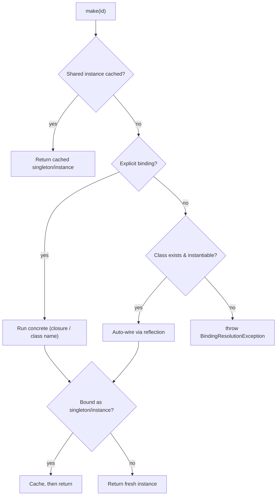

# Service Container & Dependency Injection

> The `Goco\Container` is GOCO CMS's PSR-11 dependency-injection engine — it wires every service, driver, and facade in the system, and its lifecycle rules are what make a long-running OpenSwoole worker safe.

`stable`

GOCO CMS runs as a **persistent OpenSwoole process** under [ZealPHP](./zealphp-foundation.md), not a fresh PHP-FPM boot per request. That single fact reshapes how dependency injection must work: objects you resolve today may still be alive next week, shared across thousands of coroutine-multiplexed requests. The container is therefore designed around one discipline — **immutable, stateless singletons for wiring; explicit request scope for anything that varies per request.**

This document explains bindings, singletons, factories, contextual binding, auto-wiring, interface→implementation resolution (how swappable [storage](./storage.md) and [search](./search.md) drivers are chosen), service providers, facade resolution, plugin service registration, testing by swapping bindings, and — most importantly — the long-running-process and coroutine-safety rules you must follow.

---

## 1. Purpose

The container solves four problems at once:

1. **Wiring** — construct a graph of services (repositories, engines, drivers) from their declared dependencies without hand-written `new` chains.
2. **Substitution** — bind an interface to a concrete driver so `Local`/`MinIO`/`S3` storage or `MongoDB`/`Meilisearch`/`OpenSearch` search are chosen by configuration, not by code edits.
3. **Lifetime management** — decide whether a service is built once (singleton) or every time (factory), and guarantee singletons are process-safe.
4. **Extensibility** — let every [package](../getting-started/project-structure.md) and every [plugin](../core/plugin-engine.md) contribute services through a uniform `ServiceProvider` contract.

> **Note**
> `Goco\Container` implements `Psr\Container\ContainerInterface` (`get()`, `has()`). Anything expecting a PSR-11 container — including third-party libraries — can consume it directly.

---

## 2. Functional Specification

### 2.1 Binding kinds

| Kind | Method | Resolved | Lifetime | Typical use |
| --- | --- | --- | --- | --- |
| **Bind (transient)** | `bind($abstract, $concrete)` | Every `make()` call builds a new instance | Per resolution | Value objects, per-operation helpers |
| **Singleton** | `singleton($abstract, $concrete)` | First `make()` builds; subsequent calls return the cached instance | Process (worker) lifetime | Engines, repositories, driver managers |
| **Instance** | `instance($abstract, $object)` | Pre-built object stored as-is | Process lifetime | Config objects, adapters built at boot |
| **Factory** | `factory($abstract, $closure)` | Closure invoked on each `make()`, receives the container | Per resolution | When construction needs runtime arguments |
| **Contextual** | `when($consumer)->needs($abstract)->give($concrete)` | Concrete chosen by *who* is asking | Follows target binding | Two implementations of one interface |
| **Alias** | `alias($alias, $abstract)` | Redirects one id to another | — | Short ids, facade accessors |

### 2.2 Resolution algorithm



### 2.3 Public API surface

```php
namespace Goco;

interface Container extends \Psr\Container\ContainerInterface
{
    // PSR-11
    public function get(string $id): mixed;
    public function has(string $id): bool;

    // Bindings
    public function bind(string $abstract, \Closure|string|null $concrete = null): void;
    public function singleton(string $abstract, \Closure|string|null $concrete = null): void;
    public function instance(string $abstract, object $instance): object;
    public function factory(string $abstract, \Closure $factory): void;
    public function alias(string $alias, string $abstract): void;

    // Resolution
    public function make(string $abstract, array $parameters = []): mixed;
    public function call(callable|array $callable, array $parameters = []): mixed;

    // Contextual
    public function when(string|array $concrete): ContextualBindingBuilder;

    // Introspection / testing
    public function bound(string $abstract): bool;
    public function forget(string $abstract): void;      // drop a binding + cached instance
    public function extend(string $abstract, \Closure $decorator): void;
    public function tag(array|string $abstracts, string $tag): void;
    public function tagged(string $tag): iterable;
}
```

---

## 3. Business Requirements

| ID | Requirement | Rationale |
| --- | --- | --- |
| BR-1 | Drivers (storage, search, cache, mail) MUST be selected by configuration, never by code changes | The "Website Operating System" promise of swappable infrastructure |
| BR-2 | The container MUST be safe across an OpenSwoole worker's entire lifetime | Long-running process; a leak or shared mutable state corrupts unrelated requests |
| BR-3 | Every package MUST register its services through a discoverable `ServiceProvider` | Monorepo of ~12 packages needs uniform, boot-ordered wiring |
| BR-4 | Plugins MUST register services without patching core | Marketplace extensibility |
| BR-5 | Tests MUST be able to replace any binding with a fake in isolation | Deterministic unit tests without real Mongo/Redis |
| BR-6 | Facades (`Goco\SDK\*`) MUST resolve their backing service from the container | One canonical instance, testable, swappable |
| BR-7 | Resolution MUST be O(1) after first build for singletons | Per-request latency budget |

---

## 4. User Stories

- **As a core developer**, I bind `StorageManager` once and inject it anywhere, so I never construct it by hand.
- **As a driver author**, I bind `Goco\Storage\Contracts\Filesystem` to my `S3Adapter` and the whole system uses S3 with zero call-site changes.
- **As a plugin author**, I register a `NewsletterService` in my provider's `register()` and use it from my routes and hooks.
- **As a test author**, I call `$container->instance(Clock::class, new FrozenClock('2026-07-18'))` so time-dependent code is deterministic.
- **As an SRE**, I trust that a singleton holding a Mongo client pools connections per worker rather than reconnecting per request.
- **As an SDK consumer**, I call `Widget::render(...)` and never think about how the underlying `WidgetEngine` was built.

---

## 5. Data Model (MongoDB collections & indexes)

The container itself holds **no persistent state** — it is a runtime object graph, not a stored entity. It does, however, read one collection at boot to decide which drivers and providers to activate.

Relevant `settings` documents (see the full [Data Model](./data-model.md)):

```javascript
// db.settings — driver + provider selection consumed by ServiceProviders at boot
{
  _id: ObjectId("..."),
  workspace_id: ObjectId("..."),   // null => global default
  website_id: null,
  scope: "infrastructure",
  keys: {
    "storage.default": "s3",           // -> binds Filesystem::class to S3Adapter
    "search.default": "meilisearch",   // -> binds SearchProvider::class to MeiliProvider
    "cache.default": "redis",
    "mail.default": "smtp"
  },
  version: 7,
  created_at: ISODate(), updated_at: ISODate(),
  created_by: ObjectId(), updated_by: ObjectId(),
  deleted_at: null
}
```

```javascript
// Indexes
db.settings.createIndex({ workspace_id: 1, website_id: 1, scope: 1 }, { unique: true, name: "settings_scope_unique" });
db.plugins.createIndex({ workspace_id: 1, slug: 1 }, { unique: true, name: "plugins_slug_unique" });
db.plugins.createIndex({ "activations.workspace_id": 1, "activations.enabled": 1 }, { name: "plugins_activations" });   // per-workspace active plugins -> providers to register
```

> **Note**
> Driver selection is read **once per worker at boot**, not per request. Changing `storage.default` at runtime publishes an invalidation event over Redis (see [Caching, Queue & Realtime](./caching-and-queue.md)); workers re-resolve the affected binding on the next boot cycle or on an explicit `container.rebind` signal.

---

## 6. Folder Structure

The container lives in `core/`; providers live beside the code they wire, one per package.

```text
core/
  src/
    Container/
      Container.php                 # Goco\Container implementation
      ContextualBindingBuilder.php
      BindingResolutionException.php
      ProviderRepository.php        # discovers + boots providers
      ServiceProvider.php           # abstract base: register()/boot()
    Support/
      Facade.php                    # Goco\Support\Facade base
    Bootstrap/
      RegisterProviders.php
      BootProviders.php
packages/
  storage/
    src/
      StorageServiceProvider.php    # binds Filesystem -> configured adapter
      Contracts/Filesystem.php
      Adapters/{LocalAdapter,MinioAdapter,S3Adapter}.php
  search/
    src/
      SearchServiceProvider.php
      Contracts/SearchProvider.php
      Providers/{MongoTextProvider,MeiliProvider,OpenSearchProvider}.php
  database/
    src/DatabaseServiceProvider.php
  widget-engine/
    src/WidgetEngineServiceProvider.php
  # ... one provider per package: auth, template-engine, plugin-engine,
  #     queue, seo, ai, analytics, forms
app.php                             # ZealPHP runtime entry — creates $app + container
config/providers.php                # ordered list of core providers
```

---

## 7. API Design

### 7.1 Simple binding and resolution

```php
use Goco\Container;

$c = Container::getInstance();

// Transient: a new Slugger every time
$c->bind(Slugger::class);

// Singleton: one PageRepository for the worker's life
$c->singleton(PageRepository::class);

$repo = $c->make(PageRepository::class);   // built + cached
$same = $c->make(PageRepository::class);   // same object
// $repo === $same  => true
```

### 7.2 Closures that consume the container

```php
$c->singleton(\MongoDB\Client::class, function (Container $c) {
    $cfg = $c->make(Config::class);
    return new \MongoDB\Client($cfg->get('mongo.uri'), $cfg->get('mongo.options'));
});
```

### 7.3 Interface → implementation (driver/provider selection)

This is the mechanism behind every swappable subsystem:

```php
use Goco\Storage\Contracts\Filesystem;
use Goco\Storage\Adapters\{LocalAdapter, MinioAdapter, S3Adapter};

$driver = $config->get('storage.default');   // "local" | "minio" | "s3"

$c->singleton(Filesystem::class, fn (Container $c) => match ($driver) {
    's3'    => new S3Adapter($c->make(S3ClientFactory::class)->make()),
    'minio' => new MinioAdapter($c->make(MinioClient::class)),
    default => new LocalAdapter($c->make(Config::class)->get('storage.local.root')),
});

// Everywhere else, code depends only on the interface:
public function __construct(private Filesystem $files) {}
```

The same pattern drives [Search](./search.md) (`SearchProvider` → Mongo/Meili/OpenSearch), cache, and mail transports.

### 7.4 Factory with runtime arguments

```php
$c->factory(SignedUrl::class, fn (Container $c, array $args) =>
    new SignedUrl($c->make(Filesystem::class), $args['path'], $args['ttl'] ?? 3600)
);

$url = $c->make(SignedUrl::class, ['path' => 'media/2026/report.pdf', 'ttl' => 600]);
```

### 7.5 Contextual binding

When one interface has two implementations chosen by consumer:

```php
$c->when(ThumbnailQueue::class)
  ->needs(Filesystem::class)
  ->give(LocalAdapter::class);          // thumbnails stay on fast local disk

$c->when(MediaLibrary::class)
  ->needs(Filesystem::class)
  ->give(S3Adapter::class);             // originals go to S3
```

### 7.6 Method injection with `call()`

`call()` resolves a callable's parameters from the container by type — used by the [router](../core/routing.md) and hook dispatcher:

```php
$result = $c->call([$controller, 'store'], ['request' => $request]);
// PageRepository, AuditLog, etc. injected by type; 'request' passed explicitly
```

---

## 8. Services (Auto-Wiring)

### 8.1 Reflection-based auto-wiring

If an id is a concrete, instantiable class with no explicit binding, the container reads its constructor via reflection and recursively resolves each type-hinted parameter:

```php
final class PublishPage
{
    public function __construct(
        private PageRepository $pages,        // auto-resolved (singleton)
        private RevisionStore $revisions,     // auto-resolved
        private Goco\SDK\Hook $hooks,          // resolved via facade accessor
        private Clock $clock,                  // auto-resolved
    ) {}
}

// No binding needed — the container builds the whole graph:
$action = $c->make(PublishPage::class);
```

Rules the resolver applies to each constructor parameter:

1. **Class/interface type-hint** → recursively `make()` it (interfaces must be bound, or resolution throws).
2. **Has a default value** → use the default when unresolvable.
3. **Nullable** → inject `null` when unresolvable.
4. **Union type** → resolve the first bound/instantiable member; else default/null.
5. **Untyped, no default** → `BindingResolutionException` (be explicit).

> **Tip**
> Prefer constructor injection over pulling from the container inside a method. Constructor injection makes the dependency graph explicit, auto-wirable, and trivially fakeable in tests.

### 8.2 Decorating a resolved service

```php
$c->extend(SearchProvider::class, fn ($provider, Container $c) =>
    new LoggingSearchProvider($provider, $c->make(LoggerInterface::class))
);
```

### 8.3 Tagging

```php
$c->tag([JsonExporter::class, CsvExporter::class, XmlExporter::class], 'exporters');

foreach ($c->tagged('exporters') as $exporter) {
    $registry->add($exporter);
}
```

---

## 9. Events

The container emits [hook](./event-hook-system.md) actions around resolution and provider lifecycle so plugins can observe/instrument wiring:

| Action | When | Args |
| --- | --- | --- |
| `container.binding` | A binding is registered | `abstract`, `shared` |
| `container.resolving` | Before an object is built | `abstract`, `parameters` |
| `container.resolved` | After an object is built/cached | `abstract`, `instance` |
| `provider.registering` | Before a provider's `register()` | `provider` |
| `provider.booted` | After a provider's `boot()` | `provider` |
| `core.boot` | All providers booted; container ready | — |

```php
use Goco\SDK\Hook;

Hook::listen('container.resolved', function (string $abstract, object $instance) {
    // e.g. attach a metrics timer, or assert no request-scoped leaks in dev
}, priority: 50);
```

---

## 10. Hooks

Two **filters** let packages and plugins influence wiring without editing core:

| Filter | Purpose | Value | Return |
| --- | --- | --- | --- |
| `container.providers` | Add/remove/reorder providers before boot | ordered `string[]` of provider classes | modified list |
| `container.concrete` | Override which concrete an abstract resolves to | resolved concrete | replacement concrete |

```php
use Goco\SDK\Hook;

// Force an in-memory search provider during a data migration
Hook::filter('container.concrete', function ($concrete, string $abstract) {
    if ($abstract === Goco\Search\Contracts\SearchProvider::class && getenv('MIGRATING')) {
        return Goco\Search\Providers\NullProvider::class;
    }
    return $concrete;
});
```

> **Warning**
> `container.concrete` runs on the hot path. Keep callbacks branch-cheap and side-effect free — it is invoked for every unbound-abstract resolution.

---

## 11. UI Architecture

The container has no end-user UI. Its operational surface is developer- and operator-facing:

- **Admin → System → Providers** ([admin app](../getting-started/project-structure.md)) lists registered providers, their boot order, and load time (read-only diagnostics).
- **`goco` CLI** exposes introspection:

```bash
goco container:bindings          # list every binding: id, kind, concrete
goco container:resolve Goco\\Storage\\Contracts\\Filesystem   # show the concrete + dependency tree
goco container:providers         # ordered provider list with register/boot timings
```

See the [CLI Reference](../reference/cli-reference.md) for full output formats.

---

## 12. Security Model

- **No user input reaches `make()`.** Abstract ids are class-strings from trusted code. Never resolve a container id built from request data — that would enable arbitrary class instantiation. The [router](../core/routing.md) and [permission system](./permission-system.md) map requests to *fixed* handler classes, then the container injects into them.
- **Plugin isolation.** A plugin's provider may bind new ids but SHOULD NOT silently rebind core singletons. Rebinds of core ids emit `container.binding` and are logged to `audit_logs`; the [plugin engine](../core/plugin-engine.md) can run providers in strict mode that rejects core rebinds.
- **Secret handling.** Credentials (Mongo URI, S3 keys, JWT secret) are injected via a `Config` object sourced from [environment](../getting-started/configuration.md) — never hard-coded in providers, never logged by `container.resolved` listeners.
- **Capability-scoped services.** Services that enforce authorization (e.g. `PolicyEngine`) are singletons but take the acting principal from request scope (`Goco\G`), never from a field set at construction. See §13.2.

---

## 13. Performance Strategy

### 13.1 Build once, reuse for the worker's life

Under OpenSwoole the worker process persists. A singleton `MongoDB\Client` or Redis pool is built **once per worker at boot**, giving connection pooling across every request the worker handles — no per-request reconnect, no per-request reflection cost.

```php
// Bootstrap in app.php (ZealPHP entry)
require 'vendor/autoload.php';

use ZealPHP\App;
use Goco\Container;
use Goco\Bootstrap\{RegisterProviders, BootProviders};

App::superglobals(false);
$app = App::init('0.0.0.0', 8080);

App::onWorkerStart(function ($server, $workerId) {
    $c = Container::getInstance();
    (new RegisterProviders)($c);   // all register() — cheap, no side effects
    (new BootProviders)($c);       // all boot() — build pooled clients, warm caches
});

$app->run();
```

### 13.2 Reflection is cached

The first `make()` of a class reflects its constructor; the resolved parameter plan is memoized on the class-string, so subsequent transient builds skip reflection. Combined with singletons, steady-state resolution is a hash-map lookup.

### 13.3 Lazy singletons

Bindings register instantly (a closure reference); the object is built on first `make()`. Rarely used services (e.g. an export driver) cost nothing until touched.

---

## 14. Long-Running Process & Coroutine Safety

> **Warning**
> This is the single most important section. In classic PHP-FPM every request starts with an empty container, so "singleton" means "singleton per request." **In GOCO CMS a singleton lives for the whole worker and is shared by every concurrent coroutine.** Violating the rules below causes cross-request data bleed — one visitor seeing another's data — which is a correctness *and* security bug.

### 14.1 Rule 1 — Singletons must be stateless (no per-request state)

A singleton may hold *configuration* and *collaborators* (immutable after boot). It must **never** hold the current user, current request, current tenant, or any mutable per-request field.

```php
// WRONG — leaks across requests and coroutines
final class BadContentService
{
    private User $currentUser;                 // set per request => shared by everyone
    public function setUser(User $u): void { $this->currentUser = $u; }
    public function authorId(): string { return (string) $this->currentUser->id; }
}
$c->singleton(BadContentService::class);       // catastrophic under OpenSwoole
```

```php
// RIGHT — request identity comes from request scope, passed in explicitly
use Goco\G;                                    // per-request context (see below)

final class ContentService
{
    public function __construct(private PageRepository $pages) {}   // immutable deps only

    public function publish(string $pageId): void
    {
        $actor = G::user();                    // resolved from the current coroutine's context
        $this->pages->publish($pageId, actorId: $actor->id);
    }
}
$c->singleton(ContentService::class);          // safe: no mutable fields
```

### 14.2 Rule 2 — Request scope lives in `Goco\G` / `RequestContext`, not the container

ZealPHP provides coroutine-isolated per-request state via `ZealPHP\G` / `RequestContext`; GOCO wraps it as `Goco\G`. Each coroutine (each request) gets its own isolated bag — this is the correct home for request-varying data.

```php
use Goco\G;

// Set at the start of the request (by core middleware), read anywhere downstream:
G::set('user', $authenticatedUser);
G::set('workspace_id', $workspaceId);
G::set('website_id', $websiteId);
G::set('request_id', $requestId);

// Read it wherever needed — always the calling coroutine's own value:
$user = G::user();
$tenant = G::get('workspace_id');
```

| Belongs in a **singleton** (container) | Belongs in **request scope** (`Goco\G`) |
| --- | --- |
| Mongo/Redis clients, connection pools | Current authenticated user |
| Repositories, engines, drivers | Current `workspace_id` / `website_id` |
| Compiled config, route table | Request id, correlation id, locale |
| Immutable value services (Slugger) | CSRF token, per-request cache keys |

### 14.3 Rule 3 — Do not accumulate memory in singletons

A field that grows per request (a cache array, a log buffer, a "seen ids" set) will grow unbounded for the worker's entire life — a slow leak that eventually OOMs the worker.

```php
// WRONG — grows forever, one entry per request
private array $renderedPages = [];
public function remember(string $id, string $html): void { $this->renderedPages[$id] = $html; }
```

Use a **bounded, shared** structure instead:

- **Cross-worker shared state** → `ZealPHP\Store` (OpenSwoole `Table`) or Redis, both bounded/evicting. See [Caching, Queue & Realtime](./caching-and-queue.md).
- **Atomic counters** → `ZealPHP\Counter` (`new Counter(0)->increment()`), not a growing `int` field mutated without synchronization.
- **Per-request memoization** → store on `Goco\G`; it is discarded when the request ends.

```php
use ZealPHP\Store;

// A bounded, cross-worker render cache — NOT a private array
Store::make('page_render', size: 4096, cols: [['html', Store::STRING, 65536]]);
Store::set('page_render', $pageId, ['html' => $html]);   // fixed-size table, evicts
```

### 14.4 Rule 4 — Coroutine safety of resolution and shared services

- **Resolution races.** If two coroutines `make()` the same lazy singleton simultaneously during boot warm-up, both could build it. GOCO builds singletons eagerly in `onWorkerStart` (before request coroutines exist) to avoid this. For any lazily-built singleton that touches I/O, guard construction with an `\OpenSwoole\Coroutine\Channel` or `Coroutine\Lock` so only one coroutine builds it.
- **Shared mutable objects.** A singleton shared across coroutines must not mutate internal state during a request without synchronization. Prefer immutability. If you must mutate (e.g. a pool), use OpenSwoole-native concurrency primitives (`Channel`, `Store`, `Counter`), never plain PHP arrays as ad-hoc shared caches.
- **No blocking in constructors.** Provider `boot()` and singleton closures run inside the worker; use coroutine-aware clients so a slow connect yields rather than blocking the worker.

```php
use OpenSwoole\Coroutine\Channel;

// Single-flight construction of an expensive lazy singleton
$c->singleton(ReportEngine::class, function (Container $c) {
    static $ch;
    $ch ??= new Channel(1);
    if ($ch->isEmpty() && $ch->stats()['queue_num'] === 0) {
        $engine = new ReportEngine($c->make(\MongoDB\Client::class));
        $ch->push($engine);
    }
    $engine = $ch->pop();
    $ch->push($engine);   // put it back for the next waiter
    return $engine;
});
```

> **Tip**
> The simplest coroutine-safe singleton is an **immutable** one built at boot. Reach for channels/locks only when a service genuinely must be lazy *and* touches I/O during construction.

---

## 15. Extension Points

### 15.1 Service Providers

A `ServiceProvider` has two phases. **`register()`** only binds — it must not resolve other services or perform I/O, because not all providers are registered yet. **`boot()`** runs after every provider registered, so it may resolve, wire listeners, and touch I/O.

```php
namespace Goco\Storage;

use Goco\Container;
use Goco\ServiceProvider;
use Goco\Storage\Contracts\Filesystem;
use Goco\Storage\Adapters\{LocalAdapter, MinioAdapter, S3Adapter};

final class StorageServiceProvider extends ServiceProvider
{
    // Phase 1: bind only. No resolving, no I/O.
    public function register(Container $c): void
    {
        $c->singleton(Filesystem::class, function (Container $c) {
            $cfg = $c->make(Config::class);
            return match ($cfg->get('storage.default')) {
                's3'    => new S3Adapter($c->make(S3ClientFactory::class)->make()),
                'minio' => new MinioAdapter($c->make(MinioClient::class)),
                default => new LocalAdapter($cfg->get('storage.local.root')),
            };
        });

        $c->alias('storage', Filesystem::class);
    }

    // Phase 2: everything registered; safe to resolve + wire events.
    public function boot(Container $c): void
    {
        $c->make(Filesystem::class)->ensureBucket();   // I/O is fine here
    }

    // Optional: helps the CLI/optimizer know what this provider offers.
    public function provides(): array
    {
        return [Filesystem::class, 'storage'];
    }
}
```

### 15.2 Provider discovery

Providers are collected from three sources, then ordered and de-duplicated:

1. **Core list** — `config/providers.php` (explicit, ordered).
2. **Package composer manifests** — each `gococms/*` package declares its provider under `extra.goco.providers`; Composer's package-discovery step aggregates them.
3. **Active plugins** — the [plugin engine](../core/plugin-engine.md) reads `db.plugins` where `activations.enabled` is `true` for the current workspace and appends each plugin's provider.

```json
// packages/search/composer.json
{
  "name": "gococms/search",
  "extra": {
    "goco": {
      "providers": ["Goco\\Search\\SearchServiceProvider"]
    }
  }
}
```

The final list passes through the `container.providers` filter (§10) so anything can reorder or remove a provider before boot.

### 15.3 How plugins register services

A plugin's provider is a normal `ServiceProvider`; it binds plugin-owned services and wires them to routes and hooks via the [Plugin SDK](../sdk/plugin-sdk.md):

```php
namespace Acme\Newsletter;

use Goco\Container;
use Goco\ServiceProvider;
use Goco\SDK\{Plugin, Hook};

final class NewsletterServiceProvider extends ServiceProvider
{
    public function register(Container $c): void
    {
        $c->singleton(NewsletterService::class);                 // immutable deps only
        $c->bind(SubscribeRequest::class);                       // transient per call
    }

    public function boot(Container $c): void
    {
        Plugin::routes(function ($registrar) use ($c) {
            $registrar->post('/newsletter/subscribe', function ($request) use ($c) {
                // request-scoped data via Goco\G, service via container
                return $c->make(NewsletterService::class)->subscribe($request);
            });
        });

        Hook::listen('user.registered', fn ($user) =>
            $c->make(NewsletterService::class)->welcome($user->email)
        );
    }
}
```

### 15.4 How facades resolve from the container

The `Goco\SDK\*` facades (`Widget`, `Theme`, `Plugin`, `Hook`) are thin static proxies. Each declares a container id via `accessor()`; every static call resolves that id **once**, caches it, and forwards the call. There is exactly one backing instance per worker.

```php
namespace Goco\SDK;

use Goco\Support\Facade;

final class Widget extends Facade
{
    protected static function accessor(): string
    {
        return \Goco\Widget\WidgetEngine::class;   // resolved from the container
    }
}

// Goco\Support\Facade (simplified)
abstract class Facade
{
    private static array $resolved = [];
    abstract protected static function accessor(): string;

    public static function __callStatic(string $method, array $args): mixed
    {
        $id = static::accessor();
        $instance = self::$resolved[$id]
            ??= \Goco\Container::getInstance()->make($id);
        return $instance->{$method}(...$args);
    }

    // Test seam: swap the backing instance
    public static function swap(object $fake): void
    {
        self::$resolved[static::accessor()] = $fake;
    }
}
```

So `Widget::render('hero', $props)` is exactly `container->make(WidgetEngine::class)->render('hero', $props)` — with the canonical, container-managed engine. Facade signatures are fixed by the [SDK](../sdk/widget-sdk.md):

```php
Widget::register(string $type, array|callable $definition): void;
Widget::render(string $type, array $props, ?Context $ctx = null): string;
```

---

## 16. Upgrade Strategy

- **Additive API.** New binding kinds or resolution features are added without breaking existing `bind`/`singleton`/`make` semantics; changes follow [SemVer](../roadmap.md) and are recorded in the [Changelog](../changelog.md).
- **Provider contract stability.** The `register()`/`boot()` two-phase contract is stable. If a third phase is ever introduced (e.g. `terminate()` for graceful shutdown), it will be an optional method with a default no-op so existing providers keep working.
- **Deprecations.** A binding or facade accessor slated for removal is marked `deprecated`, emits a `container.resolving` warning in dev, and survives at least one minor cycle before removal.
- **Config-driven migrations.** Because drivers are chosen by `settings`, migrating (e.g. Local → S3, MongoDB text → Meilisearch) is a config change plus a data move — no code edits — and can be staged per workspace.

---

## 17. Future Roadmap

| Item | Status | Notes |
| --- | --- | --- |
| Compiled container (cached, reflection-free graph for prod) | `experimental` | `goco container:compile` emits an optimized map booted at `onWorkerStart` |
| `provider:terminate` phase for graceful shutdown | `beta` | Flush pools/buffers on worker stop signal |
| Scoped container per tenant (enterprise database-per-workspace) | `experimental` | Child container overriding the Mongo `Client` binding per workspace |
| Attribute-driven binding (`#[Singleton]`, `#[Bind(Interface::class)]`) | `experimental` | Discover bindings from class attributes at compile time |
| Leak detector in dev mode | `beta` | Snapshots singleton memory across N requests; flags growth |

---

## Related

- [ZealPHP Foundation](./zealphp-foundation.md) — the runtime the container boots inside
- [Request Lifecycle](./request-lifecycle.md) — where request scope (`Goco\G`) is populated
- [Event & Hook System](./event-hook-system.md) — the hooks and filters the container emits
- [MongoDB Data Layer](./database-mongodb.md) — repositories the container wires
- [Data Model (Collections & Indexes)](./data-model.md) — the `settings`/`plugins` collections read at boot
- [Storage & Media](./storage.md) — interface→driver binding in practice
- [Search](./search.md) — swappable search providers via the container
- [Caching, Queue & Realtime (Redis)](./caching-and-queue.md) — `Store`, `Counter`, bounded shared state
- [Permission System (RBAC + ABAC)](./permission-system.md) — request-scoped authorization services
- [Plugin Engine](../core/plugin-engine.md) — how active plugins contribute providers
- [Routing](../core/routing.md) — `call()` method injection into handlers
- [Plugin SDK](../sdk/plugin-sdk.md) · [Widget SDK](../sdk/widget-sdk.md) · [Hook SDK](../sdk/hook-sdk.md) — facades that resolve from the container
- [Configuration](../getting-started/configuration.md) · [Project Structure](../getting-started/project-structure.md)
- [CLI Reference](../reference/cli-reference.md) — `goco container:*` commands
- [Documentation Index](../README.md)
