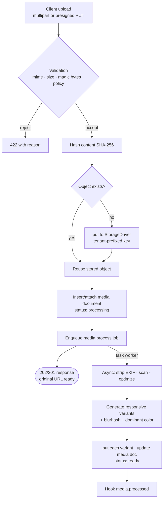

# Storage & Media

> How GOCO CMS abstracts object storage behind a single `Goco\Storage` driver interface — Local, MinIO, and Amazon S3 — and how the media pipeline turns an upload into validated, deduplicated, variant-optimized, CDN-served assets tracked in the `media` collection.

Storage in GOCO CMS is **pluggable and stateless from the application's point of view**. Widgets, themes, plugins, and core modules never write to a filesystem path directly; they talk to a `StorageDriver` through the `Goco\Storage` facade. Swapping from a laptop's local disk to a self-hosted MinIO cluster to Amazon S3 is a configuration change, not a code change. On top of that driver sits the **media pipeline**: a validated, asynchronous, coroutine-friendly flow that ingests uploads, generates responsive image variants on task workers, and persists a rich document to the `media` collection.

`stable` — the `StorageDriver` contract and the `media` document shape are stable pre-1.0. Individual drivers and image codecs may carry their own tags noted inline.

---

## 1. Design goals

| Goal | How GOCO meets it |
| --- | --- |
| **Driver independence** | One `StorageDriver` interface; app code depends only on it. |
| **Non-blocking I/O** | All driver methods run inside OpenSwoole coroutines; network drivers use coroutine-aware HTTP/S3 clients so a slow PUT never freezes a worker. |
| **Multi-tenant isolation** | Every object key is prefixed with `workspace_id/website_id`; drivers cannot read across tenant prefixes. |
| **Deduplication** | Content-addressed keys derived from a SHA-256 hash collapse identical uploads to one stored object. |
| **Async heavy work** | Thumbnail/variant generation, EXIF stripping, and virus scanning run on Redis-backed task workers, never inline with the upload request. |
| **Cheap public delivery** | Public assets are served by a CDN / Traefik-fronted URL, not by streaming bytes through PHP workers. |
| **Private-by-default** | Sensitive assets are private objects reachable only through short-lived signed URLs. |

> **Note**
> The document that *describes* an asset lives in MongoDB (the `media` collection — see [Data Model](data-model.md)); the *bytes* live in the object store. GOCO never stores binary blobs in MongoDB.

---

## 2. The `StorageDriver` interface

Every driver implements `Goco\Storage\StorageDriver`. The `Goco\Storage` facade selects the configured default driver and proxies these methods; `Storage::disk('name')` returns a specific configured disk.

```php
<?php

namespace Goco\Storage;

interface StorageDriver
{
    /**
     * Store contents at $key. $contents may be a string, a stream resource,
     * or an SplFileInfo. Returns the canonical stored key.
     * $options: ['visibility' => 'public'|'private', 'content_type' => ..., 'metadata' => [...]]
     */
    public function put(string $key, mixed $contents, array $options = []): string;

    /** Fetch the full object body as a string. Throws ObjectNotFoundException if absent. */
    public function get(string $key): string;

    /** Open a coroutine-safe read stream (PSR-7 StreamInterface) without buffering the whole object. */
    public function stream(string $key): \Psr\Http\Message\StreamInterface;

    /** Delete an object. Idempotent: deleting a missing key returns true. */
    public function delete(string $key): bool;

    /** Cheap existence check (HEAD on remote drivers). */
    public function exists(string $key): bool;

    /** Permanent, publicly reachable URL. Only meaningful for public-visibility objects / CDN-backed disks. */
    public function url(string $key): string;

    /** Time-limited signed URL for a private object. $ttl defaults to the disk's configured signed TTL. */
    public function temporaryUrl(string $key, int $ttl = 900, array $options = []): string;

    /** Server-side copy where supported; falls back to stream-through copy otherwise. */
    public function copy(string $from, string $to, array $options = []): bool;

    /** Object metadata: size, content-type, etag, last-modified, custom headers. */
    public function meta(string $key): ObjectMeta;

    /** Presigned upload target for direct browser->store uploads (multipart for large files). */
    public function presignPut(string $key, int $ttl = 900, array $conditions = []): PresignedUpload;
}
```

Contract rules every driver obeys:

- **Keys are opaque, forward-slash-delimited, tenant-prefixed strings** — never absolute filesystem paths. The facade prepends the tenant prefix; drivers must not interpret it.
- **All methods are coroutine-safe** and must yield on I/O. Blocking calls are forbidden inside OpenSwoole workers (see [ZealPHP Foundation](zealphp-foundation.md)).
- **`delete` and `put` are idempotent**; re-`put`ting the same content-addressed key is a no-op that returns the existing key.
- **`url` throws** if the disk/object is private; callers must use `temporaryUrl` for private objects.

---

## 3. Drivers

GOCO ships three first-party drivers behind the interface. They share the same key layout and pipeline; they differ only in where bytes land and how URLs are minted.

### 3.1 Local (`stable`)

Writes to a directory on the container's mounted volume. `url()` returns a path served by GOCO's static route (or by Traefik as a file server). Best for **single-node development and small self-hosted sites** where object bytes stay on one machine.

```env
STORAGE_DRIVER=local
STORAGE_LOCAL_ROOT=/var/www/storage/media
STORAGE_LOCAL_PUBLIC_BASE=https://cdn.example.com
STORAGE_SIGNED_URL_TTL=900
```

> **Warning**
> The Local driver is **not shared across replicas**. The moment you scale the `gococms` service to more than one node, uploads written on node A are invisible to node B. Use MinIO or S3 for any multi-node deployment (see [Scaling Strategy](../deployment/scaling.md)).

### 3.2 MinIO (`stable`)

S3-compatible object storage you self-host — the recommended production default for teams that want to own their data. Runs as the `minio` Docker service. Uses the coroutine-aware S3 client under the hood, so all methods (including `presignPut`, `temporaryUrl`, multipart uploads) work identically to Amazon S3.

```env
STORAGE_DRIVER=minio
STORAGE_S3_ENDPOINT=http://minio:9000
STORAGE_S3_REGION=us-east-1
STORAGE_S3_BUCKET=goco-media
STORAGE_S3_KEY=goco
STORAGE_S3_SECRET=change-me-please
STORAGE_S3_USE_PATH_STYLE=true        # MinIO requires path-style addressing
STORAGE_S3_PUBLIC_BASE=https://cdn.example.com
STORAGE_SIGNED_URL_TTL=900
```

### 3.3 Amazon S3 (`stable`)

Managed AWS object storage. Best for **cloud deployments that want zero storage ops and CloudFront-fronted global delivery**. Supports IAM roles (no static keys), SSE encryption, storage classes, and transfer acceleration.

```env
STORAGE_DRIVER=s3
STORAGE_S3_REGION=us-east-1
STORAGE_S3_BUCKET=goco-media-prod
# Omit key/secret to use the instance/task IAM role
STORAGE_S3_KEY=
STORAGE_S3_SECRET=
STORAGE_S3_USE_PATH_STYLE=false       # AWS uses virtual-hosted style
STORAGE_S3_SSE=aws:kms
STORAGE_S3_STORAGE_CLASS=INTELLIGENT_TIERING
STORAGE_S3_PUBLIC_BASE=https://d123.cloudfront.net
STORAGE_SIGNED_URL_TTL=900
```

### 3.4 Choosing a driver

| Scenario | Driver |
| --- | --- |
| Local dev, single container, `goco dev` | Local |
| Self-hosted production, own the data, on-prem/VPS | MinIO |
| Multi-region cloud, managed ops, CDN at edge | Amazon S3 (+ CloudFront) |
| Multi-node behind Traefik, no cloud lock-in | MinIO (clustered) |
| Compliance requiring data residency | MinIO in-region or S3 region-pinned |

You may register **multiple disks** (e.g. a public `media` disk and a private `documents` disk) and select per operation with `Storage::disk('documents')`.

---

## 4. Object key layout & per-tenant prefixes

Every key is deterministically composed so that tenancy, deduplication, and CDN cache keys all fall out of the path.

```
{workspace_id}/{website_id}/{yyyy}/{mm}/{sha256_prefix}/{sha256}.{ext}
└──────────────── tenant prefix ──────────────┘ └── content-addressed ──┘

# Derived variants live beside the original under a /v/ namespace:
{workspace_id}/{website_id}/{yyyy}/{mm}/{sha256_prefix}/{sha256}/v/{variant}.{ext}
```

- **Tenant prefix** (`workspace_id/website_id`) enforces isolation. The facade injects it from the active [request context](request-lifecycle.md); a driver call can never escape the current tenant's prefix. This mirrors the `workspace_id` + `website_id` scoping used across the [data model](data-model.md) and [multi-tenancy](multi-tenancy.md).
- **Content addressing** (`sha256`) deduplicates: two identical uploads (even across pages) share one stored object; the `media` document count increases but stored bytes do not.
- **Date shard** (`yyyy/mm`) keeps prefixes shallow and makes lifecycle rules / cold-storage transitions easy to express.

> **Tip**
> Because keys are content-addressed and immutable, public variants can be served with `Cache-Control: public, max-age=31536000, immutable`. A new upload produces a new hash and therefore a new URL — cache busting is automatic.

---

## 5. The media pipeline

An upload flows through six stages. Only stages 1–4 run inside the request; variant generation (stage 5) is handed to Redis-backed task workers so the user gets a fast response.



### 5.1 Stage 1 — Ingest

Two upload paths are supported:

1. **Proxied multipart** — the browser POSTs to `POST /api/media`, GOCO streams the parts to the driver. Simple; bytes transit a worker. Fine up to a configurable cap (default 25 MB).
2. **Direct presigned PUT** — GOCO issues `presignPut()`, the browser uploads straight to MinIO/S3 (multipart for large files), then calls `POST /api/media/finalize` with the key. Bytes never touch a PHP worker — the right choice for large files and high throughput.

### 5.2 Stage 2 — Validation & security

Validation runs before a single byte is stored. It is layered:

- **Declared vs. actual MIME** — the browser-supplied `Content-Type` is ignored for trust; GOCO sniffs **magic bytes** and rejects mismatches.
- **Allow-list, not deny-list** — only configured MIME types per disk are accepted (images, video, PDF, docs, etc.). Executables, PHP, HTML-with-scripts, and SVGs with embedded scripts are rejected by default.
- **Size limits** — per-disk and per-MIME max sizes; enforced on both proxied and presigned paths (presigned via POST-policy conditions).
- **Image bomb / dimension guard** — decompressed pixel dimensions are capped to prevent decompression-bomb DoS.
- **SVG sanitization** — SVGs are parsed and scripts/foreign objects stripped, or rejected outright per policy.
- **Malware scanning** — optional ClamAV integration runs on the task worker; a positive result quarantines the object and marks the media doc `status: quarantined`.

The `media.validating` filter lets plugins add custom rules (e.g. reject based on EXIF GPS, enforce color profiles). See [Hooks](#8-hooks).

### 5.3 Stage 3 — Store

The validated body is hashed and `put()` to the driver under its content-addressed, tenant-prefixed key. If the key already exists (`exists()` returns true), the byte write is skipped and the existing object is reused.

### 5.4 Stage 4 — Persist media document

A document is inserted into (or attached to) the `media` collection with `status: "processing"`, the original key, size, MIME, dimensions, checksum, and tenant scope. The original public/signed URL is available immediately — the response returns here.

### 5.5 Stage 5 — Async processing (task workers)

A `media.process` job is pushed onto the Redis queue (see [Caching, Queue & Realtime](caching-and-queue.md)). A task worker picks it up and, inside a coroutine:

- strips EXIF (optionally preserving orientation + copyright), rotating pixels to match orientation;
- optionally runs malware scan;
- generates **responsive variants** (see §7): resized derivatives in modern codecs;
- computes a **blurhash** placeholder and **dominant color** for LQIP/skeletons;
- `put()`s each variant, then updates the `media` document to `status: "ready"` with the full `variants` array;
- dispatches the `media.processed` action hook.

Jobs are idempotent and retried with backoff; a permanently failed job sets `status: "failed"` and records the error.

### 5.6 Stage 6 — Delivery

- **Public assets** resolve through `url()` → `STORAGE_*_PUBLIC_BASE` (a CDN or Traefik file route), served with long-lived immutable cache headers. PHP workers are not in the byte path.
- **Private assets** are served only via `temporaryUrl()` short-lived signed links, minted per request after a capability check.

---

## 6. Signed & temporary URLs

Private objects (documents, gated downloads, unpublished media) are never public. Access is granted with a time-boxed signed URL.

```php
use Goco\Storage\Storage;

// Private disk, 10-minute link, forced download filename:
$url = Storage::disk('documents')->temporaryUrl(
    key: $media->storage_key,
    ttl: 600,
    options: [
        'response_content_disposition' => 'attachment; filename="invoice.pdf"',
        'response_content_type'         => 'application/pdf',
    ],
);
```

- On **MinIO/S3** these are native presigned GET URLs — the signature and expiry are enforced by the object store; GOCO is out of the loop entirely.
- On **Local**, GOCO mints an HMAC-signed URL (`?exp=…&sig=…`) verified by a signature middleware before the static route serves the file.
- Signed URLs should be **minted per request**, never cached or logged. TTLs default to `STORAGE_SIGNED_URL_TTL` (900 s) and should be short.

> **Warning**
> A signed URL grants access to whoever holds it until it expires. Keep TTLs short, always mint them *after* an RBAC/ABAC check (see [Permission System](permission-system.md)), and never embed them in cacheable HTML.

---

## 7. Image optimization & responsive variants

GOCO treats the uploaded original as the immutable source of truth and generates a fixed, configurable set of derivatives. Defaults:

| Variant | Longest edge | Purpose |
| --- | --- | --- |
| `thumb` | 160 px | Media library grid, admin previews |
| `sm` | 480 px | Mobile inline images |
| `md` | 768 px | Tablet / content column |
| `lg` | 1280 px | Desktop content |
| `xl` | 1920 px | Full-bleed / hero |
| `og` | 1200×630 (cropped) | Social share cards |

Each size is emitted in modern codecs (**AVIF** and **WebP**) plus a compatibility JPEG/PNG, quality-tuned per format. The widget engine consumes the `variants` array to emit responsive markup:

```html
<picture>
  <source type="image/avif"
          srcset="…/v/sm.avif 480w, …/v/md.avif 768w, …/v/lg.avif 1280w"
          sizes="(max-width: 768px) 100vw, 768px">
  <source type="image/webp"
          srcset="…/v/sm.webp 480w, …/v/md.webp 768w, …/v/lg.webp 1280w">
  
</picture>
```

- **Never upscale** — a variant larger than the source is skipped; the source is used directly.
- **`blurhash`** and **`dominant_color`** stored on the media doc drive LQIP placeholders and prevent layout shift (intrinsic `width`/`height` are always emitted).
- The variant matrix is configurable per website via `settings`; regenerating variants (e.g. after adding AVIF) is a `goco media:regenerate` batch job that re-enqueues `media.process` for existing docs.

---

## 8. Data model — the `media` collection

The `media` collection (full field-by-field definition in [Data Model](data-model.md)) records one document per logical asset. Shape:

```json
{
  "_id": "ObjectId(...)",
  "workspace_id": "ws_01H…",
  "website_id": "web_01H…",
  "disk": "media",
  "storage_key": "ws_01H…/web_01H…/2026/07/ab/abcd…ef.jpg",
  "filename": "hero-summer.jpg",
  "mime_type": "image/jpeg",
  "size": 842133,
  "checksum": "sha256:abcd…ef",
  "width": 4032,
  "height": 3024,
  "alt": "Sunset over the bay",
  "title": "Summer hero",
  "folder": "campaigns/summer",
  "visibility": "public",
  "status": "ready",
  "blurhash": "L6PZfSjE.AyE_3t7t7R**0o#DgR4",
  "dominant_color": "#3a5b8c",
  "variants": [
    { "name": "md", "format": "avif", "key": "…/v/md.avif", "width": 768, "height": 576, "size": 41022 },
    { "name": "md", "format": "webp", "key": "…/v/md.webp", "width": 768, "height": 576, "size": 52310 }
  ],
  "metadata": { "camera": "…", "gps_stripped": true },
  "created_at": "…", "updated_at": "…", "deleted_at": null,
  "version": 3, "created_by": "usr_…", "updated_by": "usr_…"
}
```

Indexes (documented alongside the collection in [Data Model](data-model.md)):

```javascript
// Mongo shell
db.media.createIndex({ workspace_id: 1, website_id: 1, created_at: -1 })
db.media.createIndex({ workspace_id: 1, website_id: 1, folder: 1 })
db.media.createIndex({ workspace_id: 1, website_id: 1, checksum: 1 })   // dedup lookup
db.media.createIndex({ workspace_id: 1, website_id: 1, status: 1 })
db.media.createIndex({ filename: "text", alt: "text", title: "text" }) // library search
db.media.createIndex({ deleted_at: 1 })                                 // soft-delete sweeps
```

> **Note**
> Deleting a media document is a **soft delete** (`deleted_at` set). A scheduled `media:gc` job later reference-counts by `checksum` and only calls `driver->delete()` when no live document references the stored object — deduplication means bytes must outlive any single reference.

---

## 9. Docker: the `minio` service

The recommended production storage backend runs as a Docker service alongside `gococms`, `mongodb`, `redis`, and `traefik`. See [Docker Architecture](../deployment/docker.md) for the full compose file.

```yaml
services:
  minio:
    image: minio/minio:latest
    command: server /data --console-address ":9001"
    environment:
      MINIO_ROOT_USER: ${STORAGE_S3_KEY}
      MINIO_ROOT_PASSWORD: ${STORAGE_S3_SECRET}
    volumes:
      - minio-data:/data
    healthcheck:
      test: ["CMD", "mc", "ready", "local"]
      interval: 15s
      timeout: 5s
      retries: 5
    restart: unless-stopped
    labels:
      - "traefik.enable=true"
      # Public asset delivery (path-style bucket) via CDN hostname:
      - "traefik.http.routers.minio-cdn.rule=Host(`cdn.example.com`)"
      - "traefik.http.routers.minio-cdn.entrypoints=websecure"
      - "traefik.http.routers.minio-cdn.tls.certresolver=letsencrypt"
      - "traefik.http.services.minio-cdn.loadbalancer.server.port=9000"
      # MinIO admin console on its own subdomain:
      - "traefik.http.routers.minio-console.rule=Host(`minio.example.com`)"
      - "traefik.http.routers.minio-console.service=minio-console"
      - "traefik.http.services.minio-console.loadbalancer.server.port=9001"

  # One-shot init: create bucket + set public read policy on the /public prefix.
  minio-init:
    image: minio/mc:latest
    depends_on:
      minio:
        condition: service_healthy
    entrypoint: >
      /bin/sh -c "
      mc alias set local http://minio:9000 $${STORAGE_S3_KEY} $${STORAGE_S3_SECRET};
      mc mb --ignore-existing local/goco-media;
      mc anonymous set download local/goco-media;
      exit 0;
      "

volumes:
  minio-data:
```

> **Tip**
> Traefik fronts MinIO for public delivery so that assets are served over HTTPS/HTTP-3 from your own `cdn.` hostname with Let's Encrypt certificates — the `gococms` PHP workers stay out of the byte path. See [Traefik Reverse Proxy](../deployment/traefik.md).

---

## 10. Application usage examples

Storing an upload from a ZealPHP file-based API endpoint (`apps/api/api/media/index.php` → `POST /api/media`):

```php
<?php
use Goco\Storage\Storage;
use Goco\Media\MediaService;

/** POST /api/media — proxied multipart ingest. */
return function ($request, $response) {
    $file = $request->files('file');                 // ZealPHP upload handle

    // MediaService runs validation → hash → put → media doc → enqueue media.process.
    $media = MediaService::ingest($file, disk: 'media', options: [
        'folder'     => $request->post('folder', 'uploads'),
        'visibility' => 'public',
    ]);

    return [
        'id'     => (string) $media->id,
        'url'    => Storage::disk('media')->url($media->storage_key),
        'status' => $media->status,                   // "processing" until variants ready
    ];
};
```

Direct streaming download of a private object without buffering it in memory:

```php
use Goco\Storage\Storage;

$app->route('/download/{id}', function ($id, $request, $response) {
    $media = MediaRepository::findOrFail($id);
    Gate::authorize('media.read', $media);            // RBAC/ABAC check first

    $stream = Storage::disk('documents')->stream($media->storage_key);
    $response->header('Content-Type', $media->mime_type);
    $response->header('Content-Disposition', "attachment; filename=\"{$media->filename}\"");
    return $response->sendStream($stream);            // coroutine-friendly, chunked
});
```

Writing a custom driver — implement the interface and register it:

```php
use Goco\Storage\Storage;

Storage::extend('gcs', fn(array $config) => new GcsDriver($config));
// then: STORAGE_DRIVER=gcs with driver-specific env consumed by GcsDriver.
```

---

## 11. Reliability, failover & performance

- **Retries with backoff** — network driver operations retry idempotently on transient errors (5xx, timeouts); the content-addressed key makes a retried `put` safe.
- **Read failover** — a disk may declare read replicas / mirror endpoints; on primary read failure the driver falls back to a mirror before erroring.
- **Circuit breaking** — repeated driver failures open a per-disk circuit (tracked in [Redis](caching-and-queue.md)), failing fast and surfacing a clear error instead of stalling workers.
- **Coroutine concurrency** — variant generation for one asset fans out across coroutines (one per size/format), bounded by a `ConcurrencyLimit` so a burst of uploads cannot exhaust CPU.
- **Metadata caching** — `meta()`/`exists()` results are cached briefly in Redis to avoid repeated HEADs during a single render.
- **CDN offload** — the single biggest performance lever: public assets are immutable and CDN-cached, so origin traffic is near zero after warm-up.
- **Backups** — object stores are backed up independently of MongoDB; see [Backup & Restore](../deployment/backup-restore.md) for coordinating media-store and database snapshots.

---

## 12. Security model

- **Private by default** — a disk's `visibility` defaults to `private`; public exposure is explicit per object.
- **Authorization before signing** — a `temporaryUrl` is only minted after a capability check via the [Permission System](permission-system.md).
- **Tenant containment** — the facade-injected prefix means a compromised handler still cannot address another tenant's keys.
- **Upload hardening** — magic-byte sniffing, MIME allow-lists, size/dimension caps, SVG sanitization, and optional malware scanning (see §5.2).
- **No secrets in URLs beyond signatures** — signed URLs carry only expiry + signature; TTLs are short.
- **Encryption** — S3/MinIO server-side encryption (SSE-KMS/SSE-S3) configured per disk; TLS in transit terminated at [Traefik](../deployment/traefik.md).
- **Audit** — media create/update/delete write to `audit_logs`. Full model in [Security Model](../security/security-model.md).

---

## 13. Extension points

- **Custom drivers** via `Storage::extend()` (Google Cloud Storage, Azure Blob, Backblaze B2).
- **Validation rules** via the `media.validating` filter.
- **Variant matrices** overridden per website in `settings`, or extended by plugins that add formats/sizes.
- **Post-process hooks** — plugins listen on `media.processed` to push assets to an external DAM, extract text for search indexing (see [Search](search.md)), or run AI captioning via the [AI Platform](../core/ai-platform.md).
- **Storage events** feed the [Event & Hook System](event-hook-system.md).

Relevant hooks:

| Hook | Type | Fires |
| --- | --- | --- |
| `media.validating` | filter | Before store; may reject or mutate the candidate. |
| `media.stored` | action | After bytes land in the driver. |
| `media.processed` | action | After variants + metadata are ready. |
| `media.deleting` | action | Before soft-delete. |
| `media.url` | filter | Rewrite/decorate a generated URL (e.g. CDN signing). |

---

## Related

- [Data Model (Collections & Indexes)](data-model.md)
- [MongoDB Data Layer](database-mongodb.md)
- [Caching, Queue & Realtime (Redis)](caching-and-queue.md)
- [Multi-Tenancy](multi-tenancy.md)
- [Request Lifecycle](request-lifecycle.md)
- [ZealPHP Foundation](zealphp-foundation.md)
- [Rendering Pipeline](rendering-pipeline.md)
- [Permission System (RBAC + ABAC)](permission-system.md)
- [Search](search.md)
- [Event & Hook System](event-hook-system.md)
- [Widget Engine](../core/widget-engine.md)
- [AI Platform](../core/ai-platform.md)
- [Docker Architecture](../deployment/docker.md)
- [Traefik Reverse Proxy](../deployment/traefik.md)
- [Backup & Restore](../deployment/backup-restore.md)
- [Scaling Strategy](../deployment/scaling.md)
- [Security Model](../security/security-model.md)
- [Configuration Reference](../reference/configuration-reference.md)
- [Documentation Index](../README.md)
