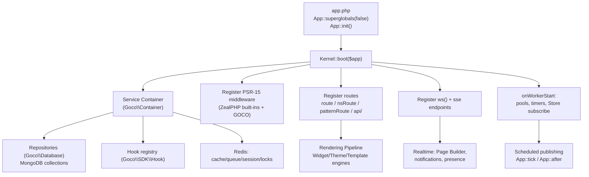

# ZealPHP Foundation

> How GOCO CMS builds its kernel, routing, realtime, and coroutine runtime on top of [ZealPHP](https://github.com/sibidharan/zealphp) and [OpenSwoole](https://openswoole.com) — a persistent-worker PHP model that replaces the PHP-FPM request-per-process world.

GOCO CMS is not "a PHP app behind Nginx." Its beating heart is **ZealPHP**, a Flask-style application framework running on **OpenSwoole 22.1+** and **PHP 8.4+**. Every HTTP request, WebSocket frame, server-sent event, background timer, and scheduled publish inside GOCO is served by long-lived OpenSwoole workers that stay resident in memory between requests. This page explains the runtime model GOCO inherits, the exact ZealPHP APIs GOCO wraps, and the coroutine-safety rules every widget, theme, plugin, and core module must obey.

`stable` — the foundation runtime contract is stable pre-1.0; individual convenience helpers may be `beta`.

---

## Why a persistent-worker runtime

Classic PHP (PHP-FPM/mod_php) is **shared-nothing per request**: a worker forks or reuses a process, bootstraps the entire framework, autoloads classes, opens database connections, serves one request, then tears everything down. State never survives the request boundary. That model is simple and crash-isolated, but it pays a full bootstrap tax on every request and cannot hold a socket open.

ZealPHP on OpenSwoole is **persistent-worker**: `App::init()` starts an OpenSwoole HTTP server with a fixed pool of worker processes. Each worker boots GOCO's kernel **once**, then serves thousands of requests as lightweight **coroutines** multiplexed onto that single process. Connections to MongoDB and Redis are pooled and reused. A worker can hold a WebSocket open for hours and push to it from a timer.

| Concern | PHP-FPM (Nginx + mod_php) | ZealPHP on OpenSwoole (GOCO) |
| --- | --- | --- |
| Process lifetime | One request, then reset | Long-lived worker, thousands of requests |
| Bootstrap cost | Every request | Once per worker at `onWorkerStart` |
| Concurrency unit | OS process | Coroutine (M coroutines : 1 worker) |
| DB/Redis connections | Reopened or pooled externally | Pooled in-process, reused across requests |
| Long-lived sockets | Impossible | WebSocket, SSE, long-poll native |
| Background work | Cron + external queue only | In-process timers `App::tick`/`App::after` + coroutines |
| In-memory shared state | None (shared-nothing) | `ZealPHP\Store` / `Counter` across workers |
| Global mutable state | Safe (dies each request) | **Dangerous** — leaks across requests |
| Blocking I/O | Fine (one req per process) | **Forbidden** — stalls the whole worker |

> **Warning**
> The two headline hazards of the persistent model are (1) **blocking calls** that freeze an entire worker and all its coroutines, and (2) **shared mutable globals** that leak state between unrelated requests and tenants. GOCO's coroutine-safety rules below exist to eliminate both. See [Request Lifecycle](request-lifecycle.md) for how a single request flows through the worker.

---

## Bootstrap: from `app.php` to a running server

The runtime entry file for a GOCO deployment is `app.php`. It disables PHP's classic superglobal population (GOCO reads request state through the injected `$request`/`RequestContext` instead), initializes the app, mounts GOCO's kernel and middleware, then runs the OpenSwoole server.

```php
<?php
// app.php — GOCO runtime entry point
require 'vendor/autoload.php';

use ZealPHP\App;
use Goco\Kernel;

// Per-coroutine request state instead of process-global superglobals.
App::superglobals(false);

// Modern coroutine HTTP server on 0.0.0.0:8080 (Traefik terminates TLS in front).
App::mode(App::MODE_COROUTINE);
$app = App::init('0.0.0.0', 8080);

// GOCO boots its service container, repositories, hook registry, and routes here.
Kernel::boot($app);

$app->run();
```

Run it with the ZealPHP process CLI:

```bash
php app.php            # foreground (dev)
php app.php start -d   # start detached (daemonized worker pool)
php app.php status     # show worker/pid status
php app.php logs       # tail /tmp/zealphp/ logs
php app.php restart    # graceful reload
php app.php stop       # graceful shutdown
```

> **Note**
> `php app.php` is the **runtime** process. The **developer** CLI is a separate binary, `goco` (scaffolding, migrations, lifecycle helpers) — see [CLI SDK](../sdk/cli.md) and [CLI Reference](../reference/cli-reference.md). Do not confuse the two.

In production, GOCO ships `app.php` inside the `gococms` Docker service and never exposes port 8080 directly — [Traefik](../deployment/traefik.md) fronts it with auto-HTTPS, HTTP/3, and per-tenant routers. See [Docker Architecture](../deployment/docker.md).

---

## Execution modes

ZealPHP exposes four execution modes via `App::mode()`. GOCO defaults to `MODE_COROUTINE`.

| Mode | Constant | When GOCO uses it |
| --- | --- | --- |
| Coroutine (modern) | `App::MODE_COROUTINE` | **Default.** Handlers run inside coroutines; non-blocking I/O; maximum concurrency. |
| Legacy CGI | `App::MODE_LEGACY_CGI` | Compatibility shim for legacy PHP code that assumes classic request semantics. |
| Coroutine + legacy | `App::MODE_COROUTINE_LEGACY` | Coroutine scheduling while tolerating some legacy superglobal usage during migration. |
| Mixed | `App::MODE_MIXED` | Selectively route certain endpoints through legacy handling while the rest stay coroutine-native. |

```php
App::mode(App::MODE_COROUTINE);        // GOCO default
// Migration escape hatches:
App::mode(App::MODE_COROUTINE_LEGACY); // tolerate some legacy patterns
App::mode(App::MODE_MIXED);            // per-endpoint legacy fallback
```

> **Tip**
> New GOCO code — every widget, theme, plugin, and core service — must be written for `MODE_COROUTINE`. The legacy modes exist only to migrate ported PHP; treat them as temporary.

---

## Routing: reflection-injected handlers

ZealPHP routing is Flask-style with **reflection-based parameter injection**: the framework matches the handler's parameter *names* against route placeholders and framework-provided objects (`$request`, `$response`), so you declare only what you need in any order.

```php
// Path parameter {name} is injected by name; $request/$response are framework-provided.
$app->route('/hello/{name}', function ($name, $request, $response) {
    return ['hello' => $name];   // array -> auto JSON response
});
```

Handlers may return `int` (status), `string` (body), `array` (auto-JSON), or a `Generator` (streamed) — ZealPHP converts the return value into the HTTP response automatically. GOCO relies on the array-to-JSON path for its entire REST API layer.

ZealPHP provides several route registrars, all used across GOCO:

- `$app->route(path, handler)` — direct path routing.
- `$app->nsRoute(namespace, path, handler)` — namespaced routes (GOCO groups admin/api/website surfaces this way).
- `$app->nsPathRoute(...)` — namespaced path-prefixed routes.
- `$app->patternRoute(pattern, handler)` — regex/pattern routing for advanced matching (redirects, catch-all page rendering).

GOCO's public URL rendering (the `website` app) uses a catch-all pattern route that resolves a request path to a `pages`/`posts` document, runs the [Rendering Pipeline](rendering-pipeline.md), and returns HTML. See [Routing](../core/routing.md) for GOCO's routing layer in full.

### File-based REST (`api/`)

ZealPHP auto-mounts PHP files under `api/` as REST endpoints: dropping `api/foo/bar.php` exposes `GET /api/foo/bar`. The file returns an `array` or `Generator` and ZealPHP serializes it to JSON.

```php
<?php
// apps/api/api/health/live.php  ->  GET /api/health/live
return [
    'status'  => 'ok',
    'service' => 'gococms',
    'ts'      => time(),
];
```

GOCO uses file-based REST for lightweight, self-documenting endpoints (health checks, webhooks, simple reads) and reserves programmatic `$app->route()`/`nsRoute()` registration for versioned, middleware-heavy API surfaces. See [API Reference](../reference/api-reference.md).

---

## Middleware (PSR-15)

ZealPHP middleware is **PSR-15**. Register global middleware with `$app->addMiddleware()`; each implements `MiddlewareInterface::process()`. Built-ins shipped by ZealPHP include: `Cors`, `ETag`, `Compression`, `Range`, `BasicAuth`, `IpAccess`, `RateLimit`, `ConcurrencyLimit`, `MimeType`, `BodyRewrite`, `HostRouter`, `Csrf`, and `Redirect`.

```php
use ZealPHP\Middleware\{CorsMiddleware, CsrfMiddleware, CompressionMiddleware, ETagMiddleware};

$app->addMiddleware(new CorsMiddleware());
$app->addMiddleware(new CsrfMiddleware());          // GOCO CSRF protection for form/admin POSTs
$app->addMiddleware(new CompressionMiddleware());   // gzip/br response bodies
$app->addMiddleware(new ETagMiddleware());          // conditional GET / cache validation
```

GOCO layers its own middleware on top of the built-ins by implementing `MiddlewareInterface`:

```php
namespace Goco\Http\Middleware;

use Psr\Http\Server\MiddlewareInterface;
use Psr\Http\Server\RequestHandlerInterface;
use Psr\Http\Message\{ServerRequestInterface, ResponseInterface};

/** Resolves the tenant (workspace_id + website_id) from Host/domain and pins it into request state. */
final class TenantResolverMiddleware implements MiddlewareInterface
{
    public function process(ServerRequestInterface $request, RequestHandlerInterface $handler): ResponseInterface
    {
        $host   = $request->getHeaderLine('Host');
        $tenant = \Goco\Tenancy\Resolver::fromHost($host); // MongoDB `domains` lookup, cached in Redis

        // Pin tenant into per-request context — NEVER a static/global.
        \ZealPHP\G::set('tenant', $tenant);

        return $handler->handle($request->withAttribute('tenant', $tenant));
    }
}
```

GOCO's own middleware stack, in order, typically resolves tenant -> authenticates session/JWT -> enforces RBAC/ABAC -> applies rate limits. `Csrf`, `Cors`, and `RateLimit` are drawn from ZealPHP built-ins; tenant, auth, and permission checks are GOCO middleware. See [Permission System](permission-system.md), [Multi-Tenancy](multi-tenancy.md), and [Authentication](../core/authentication.md).

> **Note**
> TLS termination, HTTP/3, Let's Encrypt certificates, and edge rate limiting live in [Traefik](../deployment/traefik.md), not middleware. Application middleware handles what must run *inside* the tenant/auth context.

---

## Views, streaming, and htmx fragments

ZealPHP renders PHP templates through the `App` facade and can stream output as a generator:

- `App::render('/tpl.php', $data)` — render a template to the response.
- `App::renderToString('/tpl.php', $data)` — render to a string (used by the [Rendering Pipeline](rendering-pipeline.md) to compose widgets into a page).
- `App::renderStream('/tpl.php', $data)` — stream a template as a `Generator`, flushing chunks progressively.
- `App::include('/partial.php', $data)` — include a partial.
- `App::fragment('/region.php', $data)` — render an htmx-targetable region.

GOCO's [Template Engine](../core/template-engine.md) and [Widget Engine](../core/widget-engine.md) sit on these primitives: a page layout streams region-by-region, each region asks the Widget Engine to render its widgets, and htmx-driven admin panels swap individual `App::fragment()` regions without a full reload.

### Server-Sent Events (SSE)

SSE is a generator plus `$response->sse()`. GOCO uses SSE for admin live-tail (audit logs, job progress, AI streaming completions).

```php
$app->route('/admin/jobs/{id}/stream', function ($id, $request, $response) {
    $response->sse(); // set text/event-stream headers, keep the connection open

    return (function () use ($id) {
        while (($job = \Goco\Queue\Jobs::find($id)) && ! $job->isTerminal()) {
            yield "event: progress\ndata: " . json_encode($job->snapshot()) . "\n\n";
            \OpenSwoole\Coroutine::sleep(1.0); // non-blocking; yields the worker to other coroutines
        }
        yield "event: done\ndata: {}\n\n";
    })();
});
```

---

## WebSockets

ZealPHP registers WebSocket endpoints with `$app->ws()`, taking `onOpen`, `onMessage`, and `onClose` callbacks.

```php
$app->ws(
    '/ws/echo',
    onMessage: fn ($server, $frame) => $server->push($frame->fd, $frame->data),
    onOpen:    fn ($server, $request) => \Goco\Realtime\Presence::join($request),
    onClose:   fn ($server, $fd) => \Goco\Realtime\Presence::leave($fd),
);
```

GOCO drives its collaborative [Page Builder](../core/page-builder.md) (multi-editor cursors, live block updates) and admin notifications over `$app->ws()`. Presence and broadcast state are held in shared memory (see below) so that a push originating in one worker reaches subscribers connected to another. Full realtime patterns: [Caching, Queue & Realtime (Redis)](caching-and-queue.md).

---

## Coroutines

Concurrency inside a worker is expressed with coroutines. GOCO uses `go()` to spawn, `OpenSwoole\Coroutine\Channel` to communicate, and `co::sleep()` / `OpenSwoole\Coroutine\sleep()` to yield without blocking.

```php
use OpenSwoole\Coroutine as co;
use OpenSwoole\Coroutine\Channel;

// Fan out independent, non-blocking work and gather results.
$chan = new Channel(3);

foreach (['seo', 'social', 'sitemap'] as $task) {
    go(function () use ($task, $chan, $page) {
        $chan->push([$task => \Goco\Seo\Analyzer::run($task, $page)]);
    });
}

$results = [];
for ($i = 0; $i < 3; $i++) {
    $results += $chan->pop(); // blocks THIS coroutine only, not the worker
}
```

`co::sleep()` is the non-blocking replacement for `sleep()` — it parks the current coroutine and lets the worker serve others. **Never** call PHP's blocking `sleep()`, `usleep()`, or a synchronous cURL/socket that isn't OpenSwoole-aware.

---

## Shared memory: `Store` and `Counter`

Because workers are separate processes, GOCO needs cross-worker shared state for anything that must be globally consistent (rate limits, presence, feature flags, pub/sub). ZealPHP provides two primitives backed by `OpenSwoole\Table`:

- **`ZealPHP\Store`** — a typed shared table: `Store::make(name, size, cols)`, `Store::set/get`, `Store::publish` + `App::subscribe` for pub/sub, and `Store::defaultBackend(Store::BACKEND_REDIS)` to promote state from single-node shared memory to a **Redis** backend that spans the whole cluster.
- **`ZealPHP\Counter`** — an atomic counter: `new Counter(0)`, `->increment()`, `->get()`.

```php
use ZealPHP\Store;
use ZealPHP\Counter;

// Cross-worker presence table; Redis backend so it spans every gococms container.
Store::defaultBackend(Store::BACKEND_REDIS);
Store::make('presence', size: 65536, cols: [
    'website_id' => ['type' => Store::STRING, 'size' => 32],
    'user_id'    => ['type' => Store::STRING, 'size' => 32],
    'cursor'     => ['type' => Store::STRING, 'size' => 128],
]);

Store::set('presence', $fd, ['website_id' => $wid, 'user_id' => $uid, 'cursor' => $json]);

// Atomic per-tenant request counter for a sliding-window rate limit.
$hits = new Counter(0);
if ($hits->increment() > $limit) {
    return [ 'error' => 'rate_limited' ];
}
```

### Pub/sub across workers

A WebSocket push generated in worker A must reach a socket held open in worker B. GOCO broadcasts with `Store::publish` and each worker listens with `App::subscribe`:

```php
// Worker that saved a page-builder block change:
Store::publish('page.block.updated', json_encode(['page' => $pid, 'block' => $block]));

// Every worker subscribes at boot and re-pushes to its own connected fds:
App::onWorkerStart(function ($server, $wid) {
    App::subscribe('page.block.updated', function ($payload) use ($server) {
        \Goco\Realtime\Broadcast::toSubscribers($server, json_decode($payload, true));
    });
});
```

> **Warning**
> Rate limits, presence, and any state that must be correct across the whole deployment MUST use `Store` with `BACKEND_REDIS` (or Redis directly). A plain PHP `static` property is per-worker and will undercount by the number of workers. See [Caching, Queue & Realtime](caching-and-queue.md).

---

## Timers and scheduled work

Persistent workers can run in-process timers — no external cron needed for most GOCO scheduling. Register timers inside `App::onWorkerStart` so each worker installs them once:

- `App::tick(ms, cb)` — repeating interval timer.
- `App::after(ms, cb)` — one-shot delayed timer.

```php
App::onWorkerStart(function ($server, $wid) {
    // Run scheduled publishing on ONE worker only to avoid duplicate execution.
    if ($wid !== 0) {
        return;
    }

    // Every 60s: publish any content whose publish_at has arrived.
    App::tick(60_000, function () {
        go(function () {
            foreach (\Goco\Content\Scheduler::due() as $doc) {
                \Goco\Content\Publisher::publish($doc); // flips status, fires content.published
            }
        });
    });

    // One-shot warmup 5s after boot.
    App::after(5_000, fn () => \Goco\Cache\Warmup::run());
});
```

Scheduled publishing, revision pruning, sitemap regeneration, and cache warmup all ride on these timers. GOCO gates cluster-wide schedules with a Redis lock (via [Redis](caching-and-queue.md)) so that scaling to N containers does not run a job N times.

> **Tip**
> `onWorkerStart` is the correct place for **all** once-per-worker setup: opening pooled MongoDB/Redis connections, priming caches, installing timers, and subscribing to pub/sub channels. Do this work once per worker, never per request.

---

## Per-request state: `ZealPHP\G` / `RequestContext`

With `App::superglobals(false)`, GOCO does not read `$_GET`/`$_POST`/`$_SERVER` as process globals. Request-scoped state (the resolved tenant, authenticated user, request id, locale) lives in **`ZealPHP\G`** / **`RequestContext`**, which is isolated per coroutine. This is the *only* correct place to keep "current request" data.

```php
use ZealPHP\G;

// Set during middleware:
G::set('tenant', $tenant);
G::set('user',   $user);

// Read anywhere downstream in the same request/coroutine:
$tenant = G::get('tenant');
$user   = G::get('user');
```

Sessions still work: `session_start()` and `$_SESSION[...]` are overridden by the `ext-zealphp` extension to provide **per-coroutine isolation**, and GOCO persists session data in [Redis](caching-and-queue.md). Two concurrent requests never see each other's `$_SESSION`.

---

## How GOCO wraps `App` into a kernel + service container

GOCO does not scatter `$app->route()` calls across the codebase. It centralizes bootstrap in a **Kernel** that owns a **service container** and drives GOCO's [Event & Hook System](event-hook-system.md). `Kernel::boot($app)` runs once per worker at `onWorkerStart`.



```php
namespace Goco;

use ZealPHP\App;

final class Kernel
{
    public static function boot(App $app): void
    {
        $c = Container::make();

        // 1. Bind singletons resolved ONCE per worker (pooled connections, registries).
        $c->singleton(\Goco\Database\Connection::class, fn () => Connection::fromEnv());
        $c->singleton(\Goco\Cache\Redis::class,        fn () => Redis::fromEnv());
        $c->singleton(\Goco\SDK\Hook::class,           fn () => new HookRegistry());

        // 2. Global middleware (ZealPHP built-ins + GOCO stack).
        $app->addMiddleware(new \ZealPHP\Middleware\CsrfMiddleware());
        $app->addMiddleware(new Http\Middleware\TenantResolverMiddleware());
        $app->addMiddleware(new Http\Middleware\AuthMiddleware());
        $app->addMiddleware(new Http\Middleware\PermissionMiddleware());

        // 3. Routes for each app surface (admin, api, website).
        Http\Routes::register($app, $c);

        // 4. Realtime endpoints.
        Realtime\Sockets::register($app, $c);

        // 5. Per-worker setup: pools, timers, pub/sub subscriptions.
        App::onWorkerStart(function ($server, $wid) use ($c) {
            $c->get(\Goco\Database\Connection::class)->warm();
            Content\Scheduler::install($wid); // App::tick for scheduled publishing on wid 0
        });

        Hook::dispatch('core.boot', $app); // plugins/themes hook their setup here
    }
}
```

Widgets, themes, and plugins never touch `$app` directly. They register through the SDK facades — `Widget::register()`, `Theme::register()`, `Plugin::register()`, `Hook::listen()` — and the Kernel wires those registrations into the ZealPHP `App` on their behalf. See [Widget SDK](../sdk/widget-sdk.md), [Theme SDK](../sdk/theme-sdk.md), [Plugin SDK](../sdk/plugin-sdk.md), and [Hook SDK](../sdk/hook-sdk.md). The container itself is documented in [Service Container & Dependency Injection](service-container.md).

---

## Coroutine-safety rules (mandatory)

Because workers are persistent and requests are coroutines, every line of GOCO code — core, widget, theme, or plugin — must follow these rules. Violating them causes cross-request state leaks, tenant data bleed, or a frozen worker.

1. **No blocking calls.** Never `sleep()`, `usleep()`, `file_get_contents()` on a remote URL, or a synchronous DB/HTTP client that is not OpenSwoole-aware. Use `co::sleep()`, coroutine-enabled MongoDB/Redis clients, and OpenSwoole HTTP clients. One blocking call freezes the entire worker and every coroutine on it.
2. **No shared mutable globals.** No `static` mutable state, no module-level mutable arrays, no singletons that cache per-request data. A `static $currentUser` set by request A is visible to request B. Put request state in `ZealPHP\G`/`RequestContext`; put cross-worker state in `ZealPHP\Store`/Redis.
3. **Resolve tenant per request, store it in `G`.** Never cache `workspace_id`/`website_id` in a static or a container singleton. Tenant is request scope. See [Multi-Tenancy](multi-tenancy.md).
4. **Singletons hold only stateless or connection-pool objects.** A bound singleton may be a Redis pool or a stateless service; it must **not** hold request- or tenant-specific data.
5. **Cross-worker consistency uses `Store`(Redis backend) or Redis directly.** Rate limits, presence, counters, and pub/sub must not rely on per-worker memory.
6. **Do the heavy setup in `onWorkerStart`, not per request.** Connection pools, timers, and subscriptions are per-worker, once.
7. **Long or blocking-ish work goes to a coroutine (`go()`) or the queue.** Do not stall a request handler on multi-second work; offload to a background coroutine or the [job queue](caching-and-queue.md).

> **Warning**
> The single most common porting bug from PHP-FPM code is a `static` cache that "worked fine" because each request died. On ZealPHP it becomes a data-leak: the second request inherits the first request's user, tenant, or query. Audit every `static` when porting.

```php
// WRONG — leaks across requests and tenants on a persistent worker.
final class BadCurrentUser
{
    private static ?User $user = null;                 // shared across ALL requests
    public static function set(User $u): void { self::$user = $u; }
    public static function get(): ?User { return self::$user; }
}

// RIGHT — per-coroutine request scope.
use ZealPHP\G;
G::set('user', $user);
$user = G::get('user');
```

---

## Where the rest of the stack plugs in

The ZealPHP foundation is deliberately thin. GOCO adds:

- **Data layer** — a lightweight document-mapper + Repository pattern over [MongoDB](database-mongodb.md), connections pooled at `onWorkerStart`.
- **Redis** — cache, queue, realtime pub/sub, distributed locks, rate limits, and sessions ([Caching, Queue & Realtime](caching-and-queue.md)).
- **Rendering** — Widget/Theme/Template engines composed through `App::render*` ([Rendering Pipeline](rendering-pipeline.md)).
- **Edge** — [Traefik](../deployment/traefik.md) for TLS/HTTP-3/routing in front of the `gococms` [Docker](../deployment/docker.md) service.

For the big picture of how these pieces assemble, see the [Architecture Overview](overview.md).

---

## Related

- [Architecture Overview](overview.md)
- [Request Lifecycle](request-lifecycle.md)
- [Service Container & Dependency Injection](service-container.md)
- [Event & Hook System](event-hook-system.md)
- [MongoDB Data Layer](database-mongodb.md)
- [Caching, Queue & Realtime (Redis)](caching-and-queue.md)
- [Multi-Tenancy](multi-tenancy.md)
- [Rendering Pipeline](rendering-pipeline.md)
- [Routing](../core/routing.md)
- [Template Engine](../core/template-engine.md)
- [Widget Engine](../core/widget-engine.md)
- [Page Builder (Visual Editor)](../core/page-builder.md)
- [Authentication](../core/authentication.md)
- [Permission System (RBAC + ABAC)](permission-system.md)
- [CLI SDK](../sdk/cli.md)
- [CLI Reference](../reference/cli-reference.md)
- [API Reference](../reference/api-reference.md)
- [Docker Architecture](../deployment/docker.md)
- [Traefik Reverse Proxy](../deployment/traefik.md)
- [Documentation Index](../README.md)
