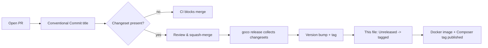

# Changelog

> All notable changes to **GOCO CMS** — "The Open Source Website Operating System" — are recorded here, newest first.

This project keeps a changelog in the [Keep a Changelog 1.1.0](https://keepachangelog.com/en/1.1.0/) format and adheres to [Semantic Versioning 2.0.0](https://semver.org/spec/v2.0.0.html). GOCO CMS is **pre-1.0 and under active development**: while the major version is `0`, minor releases (`0.x.0`) may contain breaking changes and patch releases (`0.x.y`) are reserved for backward-compatible fixes. Public stability guarantees begin at `1.0.0`.

## About this file

Every human-readable entry in this file is derived from **changesets** committed alongside code, and every commit follows [Conventional Commits](https://www.conventionalcommits.org/). The mapping is deliberate and mechanical:

| Conventional Commit type | Changelog subhead | SemVer impact (pre-1.0) |
| ------------------------ | ----------------- | ----------------------- |
| `feat:` | **Added** | minor (`0.x.0`) |
| `fix:` | **Fixed** | patch (`0.x.y`) |
| `perf:`, `refactor:` (behavioural) | **Changed** | patch or minor |
| `feat!:` / `BREAKING CHANGE:` footer | **Changed** / **Removed** | minor (pre-1.0), major (post-1.0) |
| `deprecate:` (scope) | **Deprecated** | minor |
| `revert:` | **Removed** | patch |
| security advisory | **Security** | patch |
| `docs:`, `test:`, `chore:`, `ci:`, `build:`, `style:` | not shown here | none |

The six standard subheads — **Added**, **Changed**, **Deprecated**, **Removed**, **Fixed**, **Security** — appear under each release in that fixed order, and empty subheads are omitted from tagged releases.

> **Note**
> This changelog tracks the `gococms/core` metapackage and the monorepo release train as a whole. Individually versioned Composer packages (`gococms/cli`, `gococms/widget-engine`, and the rest of `packages/*`) publish their own `CHANGELOG.md` files, but every release listed here pins a coherent, tested set of package versions.

## How entries are added

GOCO uses a **changeset-per-PR** workflow. A pull request that changes runtime behaviour is not mergeable until it carries a changeset — a small Markdown fragment under `.changeset/` that records the affected packages, the bump level, and the human-readable summary:

```markdown
---
"gococms/core": minor
"gococms/widget-engine": minor
---

feat(widgets): add server-rendered `Widget::preview()` with sandboxed props

Adds `Widget::preview(string $type, array $props = []): string` so the Page
Builder can render an isolated preview without persisting a draft revision.
```

The lifecycle:



```bash
# Author a changeset interactively while working on a branch
goco changeset add

# Preview the version bumps the pending changesets imply
goco changeset status

# Consume changesets, bump versions, tag, and rewrite the [Unreleased] section
goco release --tag
```

At release time the tooling drains `.changeset/`, folds every fragment into the correct subhead, promotes the `[Unreleased]` section to a dated version heading, and opens a fresh empty `[Unreleased]`. Contributors therefore never hand-edit released sections. See [Contributing](community/contributing.md) and [Coding Standards](community/coding-standards.md) for the full commit and PR conventions.

> **Tip**
> Documentation-only, test-only, and chore commits deliberately produce **no** changelog entry. If your change is user-visible but you are unsure of the bump level, choose `patch` and let a maintainer raise it during review — under-bumping is safer than shipping a silent breaking change.

---

## [Unreleased]

Changes merged to `main` that have not yet been cut into a tagged release. Items here are seeded from foundational work in progress and may still shift before they are versioned.

### Added

- **Coroutine request pipeline** on ZealPHP (`App::MODE_COROUTINE`) wiring `App::init()` -> middleware chain -> Flask-style router -> rendering pipeline, with per-coroutine `$_SESSION` isolation via `ext-zealphp`.
- **Hook & event bus** (`Goco\SDK\Hook`) implementing `listen`/`dispatch` actions and `filter`/`apply` filters with priority ordering and `dispatchAsync()` for coroutine fan-out.
- **Widget SDK** facade (`Goco\SDK\Widget`) with `register`, `render`, `properties`, and sandboxed `preview`, plus the first-party widget catalog scaffold under `widgets/`.
- **Theme & Template engines** — `Goco\SDK\Theme` manifest registration, layout/region resolution, and `App::render()`/`App::renderStream()`-backed template rendering with streaming fragments (`App::fragment()`) for htmx regions.
- **MongoDB data layer** (`Goco\Database`): lightweight document-mapper + Repository pattern, JSON-Schema validators, documented indexes, soft deletes (`deleted_at`), optimistic `version` field, and multi-document transactions for cross-collection invariants.
- **Redis-backed infrastructure**: sessions, cache, queue (`jobs` collection drain workers), distributed locks, rate limiting, and pub/sub bridged through `\ZealPHP\Store::defaultBackend(Store::BACKEND_REDIS)`.
- **RBAC + ABAC permission system** with the hierarchical role set (`owner` -> `guest`) and `resource.action` capabilities, scoped per `(workspace_id, website_id)`.
- **Authentication core**: Argon2id password hashing, Redis sessions, JWT for API, OAuth2, TOTP 2FA, and WebAuthn passkeys, with CSRF enforced by ZealPHP's `Csrf` middleware.
- **Storage driver interface** (`Local`, `MinIO`, `Amazon S3`) and **search provider interface** (`MongoDB text/Atlas Search`, `Meilisearch`, `OpenSearch`), both swappable via configuration.
- **`goco` developer CLI** scaffold: lifecycle commands and generators for widgets, themes, plugins, and collections.
- **Docker-first topology**: `docker-compose` services `gococms`, `mongodb`, `redis`, `traefik`, `minio`, `meilisearch`, `mailpit`, and optional `watchtower`, each with healthchecks, restart policies, and graceful shutdown.
- **Traefik integration**: automatic HTTPS via Let's Encrypt, wildcard/multi-domain routing, HTTP/3, Docker provider, and per-tenant routers driven by container labels.

### Changed

- Default runtime mode set to `App::MODE_COROUTINE`; `MODE_LEGACY_CGI` retained for incremental migration of blocking code paths.
- Multi-tenant isolation standardised on the `workspace_id + website_id` shared-database model as the default, with database-per-workspace reserved as an enterprise deployment option.

### Deprecated

- _Nothing yet._ Deprecations will be announced here at least one minor release before removal, with a migration note and a replacement API.

### Removed

- _Nothing yet._

### Fixed

- Graceful shutdown now drains in-flight coroutines before OpenSwoole worker exit, preventing truncated streamed responses under `docker compose down`.
- Corrected `updated_at`/`version` bumping so concurrent repository writes fail closed on optimistic-lock conflict instead of silently overwriting.

### Security

- CSRF protection enabled by default for all state-changing routes via the ZealPHP `Csrf` middleware.
- Security headers (HSTS, `X-Content-Type-Options`, `Referrer-Policy`, and a baseline CSP) applied at the Traefik edge and reinforced through the `response.headers` filter.

---

## [0.1.0] - 2026-07-18

Initial public pre-release. `0.1.0` establishes the **core scaffold** of the Website Operating System — a lightweight ZealPHP/OpenSwoole core, the SDK facades third-party code will build on, and the Docker topology that runs it all — so that widget, theme, and plugin authors have a stable surface to target while the platform matures toward `1.0`.

### Added

- **Runtime foundation** — ZealPHP on OpenSwoole 22.1+ / PHP 8.4+, bootstrapped via `App::init('0.0.0.0', 8080)` with the four execution modes (`MODE_COROUTINE`, `MODE_LEGACY_CGI`, `MODE_COROUTINE_LEGACY`, `MODE_MIXED`) selectable through `App::mode()`.
- **Routing** — Flask-style `$app->route()` with reflection-based parameter injection, plus `nsRoute()`, `nsPathRoute()`, `patternRoute()`, and file-based REST (`api/foo/bar.php` -> `GET /api/foo/bar`, auto-JSON). Handlers may return `int|array|string|Generator`.
- **PSR-15 middleware stack** — `Cors`, `ETag`, `Compression`, `Range`, `BasicAuth`, `IpAccess`, `RateLimit`, `ConcurrencyLimit`, `MimeType`, `BodyRewrite`, `HostRouter`, `Csrf`, and `Redirect`, registered through `$app->addMiddleware()`.
- **SDK facades** under `Goco\SDK` — `Widget`, `Theme`, `Plugin`, and `Hook` — with their canonical signatures frozen for extension authors.
- **Website hierarchy** modelled end to end: Workspace -> Website -> Theme -> Layout -> Section -> Container -> Row -> Column -> Widget.
- **MongoDB schema baseline** — the full collection set (`workspaces`, `websites`, `domains`, `users`, `roles`, `sessions`, `pages`, `page_revisions`, `posts`, `taxonomies`, `terms`, `widgets`, `layouts`, `menus`, `media`, `collections`, `plugins`, `themes`, `settings`, `forms`, `redirects`, `audit_logs`, `jobs`, `notifications`, and the rest), each with `_id`, `created_at`, `updated_at`, `deleted_at`, `version`, `created_by`, `updated_by` and tenant scoping where applicable.
- **Monorepo layout** — `apps/{admin,api,website,installer}`, `core/`, `packages/*`, `cli/`, `plugins/`, `themes/`, `widgets/`, `templates/`, `docker/`, `docs/`, `tests/`, `scripts/`, and `examples/`, with `app.php` as the runtime entry.
- **WebSocket & SSE primitives** — `$app->ws()` handlers and generator-based `$response->sse()` streaming, built on `go()`, `\OpenSwoole\Coroutine\Channel`, and `co::sleep()`.
- **Cross-worker shared state** — `\ZealPHP\Store` (OpenSwoole\Table) and atomic `\ZealPHP\Counter`, with `App::onWorkerStart()`, `App::tick()`, and `App::after()` timers.
- **Docker & Traefik bring-up** — a one-command `docker compose up` topology with Mailpit for local mail and Watchtower as an optional auto-updater.
- **Documentation set** — this docs tree, indexed from the [README](README.md), covering architecture, core modules, SDKs, guides, deployment, and community process.

### Security

- Argon2id selected as the default password hash; JWT signing keys and session secrets sourced from environment configuration only, never committed.
- Baseline Traefik security-header middleware and default-on CSRF ship enabled out of the box.

[Unreleased]: https://github.com/gococms/gococms/compare/v0.1.0...HEAD
[0.1.0]: https://github.com/gococms/gococms/releases/tag/v0.1.0

---

## Related

- [Documentation Index](README.md)
- [Roadmap](roadmap.md)
- [Glossary](glossary.md)
- [Contributing](community/contributing.md)
- [Coding Standards](community/coding-standards.md)
- [Governance](community/governance.md)
- [CLI Reference](reference/cli-reference.md)
- [Deployment Guide](deployment/deployment-guide.md)
