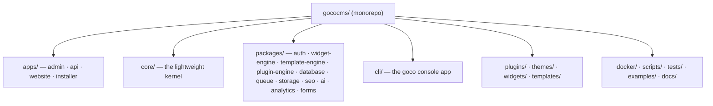

# Contributing

> How to contribute to GOCO CMS — the Open Source Website Operating System: ways to help, dev environment setup, the monorepo workflow, the PR and review process, and how to write documentation.

Thank you for helping build GOCO CMS. GOCO is MIT-licensed, pre-1.0, and under active
development, which means there is a lot to do and every contribution moves the project
forward — from a one-character typo fix to a new storage driver.

This guide is the canonical process for **all** contributions: code, documentation,
widgets, themes, plugins, triage, translations, and testing. Before you start, please read
and agree to the **[Code of Conduct](code-of-conduct.md)** — it applies to every space the
project uses (issues, pull requests, discussions, chat, and events).

> **Note**
> New to the codebase? Look for the [`good first issue`](#issue-labels--good-first-issues)
> label and start there. Small, well-scoped PRs are reviewed fastest.

---

## Ways to contribute

You do not need to write PHP to make a real difference. Pick whatever fits your skills and
the time you have.

| Contribution | What it looks like | Where it lands |
| --- | --- | --- |
| **Code** | Fix a bug, add a feature, improve a package | `core/`, `packages/*`, `apps/*` |
| **Documentation** | Improve, correct, or extend the docs | `docs/` (see [Contributing documentation](#contributing-documentation)) |
| **Widgets** | Build and publish a widget | `widgets/`, see the [Widget Guide](../guides/widget-guide.md) |
| **Themes** | Build and publish a theme | `themes/`, see the [Theme Guide](../guides/theme-guide.md) |
| **Plugins** | Build and publish a plugin | `plugins/`, see the [Plugin Guide](../guides/plugin-guide.md) |
| **Triage** | Reproduce bugs, label issues, confirm fixes | GitHub Issues |
| **Translations** | Localize admin/UI strings and docs | `apps/admin/`, locale bundles |
| **Testing** | Write or improve tests, report flakiness | `tests/`, package `tests/` |
| **Design & UX** | Improve the Page Builder and admin experience | `apps/admin/` |
| **Answering questions** | Help others in Discussions and chat | Community channels — see [Support](support.md) |

> **Tip**
> Publishing a widget, theme, or plugin to the [Plugin Marketplace](../marketplace/overview.md)
> counts as a contribution too — the ecosystem is a first-class part of the "Website
> Operating System." You do not have to modify the core to make GOCO better.

---

## Before you start

1. **Search first.** Check [existing issues](https://github.com/gococms/gococms/issues) and
   PRs. Someone may already be working on it.
2. **Open an issue for anything non-trivial.** For bug fixes and docs typos, a PR is fine.
   For new features, breaking changes, or new packages, open a proposal issue first so the
   design can be agreed before you write code. This respects the project
   [Governance](governance.md) and saves you rework.
3. **One logical change per PR.** Do not mix a refactor, a feature, and a formatting sweep.
4. **Agree to the [Code of Conduct](code-of-conduct.md)** and the
   [DCO sign-off](#developer-certificate-of-origin-dco).

---

## Development environment setup

GOCO is **Docker-first**. The supported development environment is the `docker compose`
dev stack, which brings up the full platform — the ZealPHP runtime plus every backing
service — so you never have to install MongoDB, Redis, or MinIO on your host.

### Requirements

| Tool | Minimum | Notes |
| --- | --- | --- |
| Docker Engine | 24+ | With the Compose v2 plugin (`docker compose`) |
| Git | 2.30+ | |
| `make` | any | Convenience wrappers around compose + `goco` |
| PHP | **8.4+** | Only for running the `goco` CLI / tooling on the host (optional) |
| Composer | 2.6+ | Optional host-side dependency management |
| Node.js | 20+ | Only if you touch admin/Page Builder front-end assets |

You do **not** need OpenSwoole, PHP extensions, or any database installed on your host —
they run inside the `gococms` container. The runtime is [ZealPHP](https://github.com/sibidharan/zealphp)
on **OpenSwoole 22.1+ / PHP 8.4+**.

### Fork, clone, and boot

```bash
# 1. Fork on GitHub, then clone your fork
git clone git@github.com:<you>/gococms.git
cd gococms

# 2. Keep a link to upstream so you can sync later
git remote add upstream git@github.com:gococms/gococms.git

# 3. Copy the example environment
cp .env.example .env

# 4. Bring up the dev stack (gococms, mongodb, redis, traefik, minio, meilisearch, mailpit)
docker compose -f docker/compose.dev.yml up -d

# 5. Install PHP dependencies and run the installer
docker compose exec gococms composer install
docker compose exec gococms php goco install
```

The dev stack exposes:

| Service | Purpose | Local URL |
| --- | --- | --- |
| `gococms` | ZealPHP runtime (OpenSwoole) | via Traefik on `http://goco.localhost` |
| `traefik` | Reverse proxy, dynamic routing, dashboard | `http://traefik.localhost:8080` |
| `mongodb` | Primary database | `mongodb://localhost:27017` |
| `redis` | Cache / queue / realtime / sessions / locks | `redis://localhost:6379` |
| `minio` | S3-compatible object storage | `http://minio.localhost` |
| `meilisearch` | Search provider | `http://meili.localhost` |
| `mailpit` | Dev mail catcher | `http://mail.localhost` |

> **Note**
> Traefik provides HTTP/3 and automatic HTTPS via Let's Encrypt in production; in dev it
> routes the `*.localhost` hostnames over plain HTTP. See
> [Deployment → Traefik](../deployment/traefik.md) for the full topology.

### Running the app and reading logs

The runtime entry file is `app.php`, driven by the ZealPHP process CLI. Inside the
`gococms` container:

```bash
php app.php start -d     # start the server detached
php app.php status       # check worker status
php app.php restart      # reload after code changes
php app.php logs         # tail logs (also under /tmp/zealphp/)
php app.php stop         # stop the server
```

> **Warning**
> ZealPHP runs on a persistent, coroutine-based runtime — workers stay alive between
> requests. Unlike request-per-process PHP, changes to bootstrapped code require a
> `php app.php restart` (or the dev auto-reloader) to take effect. Never keep mutable
> global state across requests; use `\ZealPHP\G` / `RequestContext` for per-request state
> and `\ZealPHP\Store` for shared cross-worker state.

### Common tasks

```bash
docker compose exec gococms composer test        # run the full test suite
docker compose exec gococms composer lint        # coding-standards check
docker compose exec gococms composer lint:fix    # auto-fix style
docker compose exec gococms composer stan        # static analysis (PHPStan)
docker compose exec gococms php goco make:widget  # scaffold a widget (generators)
```

---

## Monorepo workflow

GOCO is a **monorepo**. Knowing where code lives is half the battle — read
[Getting Started → Project Structure](../getting-started/project-structure.md) for the full
tour. The short version:



### Where does my change go?

| If you are changing… | Edit here | Namespace / package |
| --- | --- | --- |
| A widget's rendering or the widget API | `packages/widget-engine` | `Goco\` · `gococms/widget-engine` |
| Theme/layout/region resolution | `packages/template-engine` | `gococms/template-engine` |
| Plugin lifecycle (install/boot/routes) | `packages/plugin-engine` | `gococms/plugin-engine` |
| The document mapper / repositories | `packages/database` | `Goco\Database` · `gococms/database` |
| Auth, RBAC/ABAC, sessions, JWT, 2FA, passkeys | `packages/auth` | `gococms/auth` |
| Queue / realtime / Redis-backed jobs | `packages/queue` | `gococms/queue` |
| Object storage drivers (Local/MinIO/S3) | `packages/storage` | `gococms/storage` |
| Search providers (Mongo/Meili/OpenSearch) | `packages/*` search provider | swappable provider interface |
| Admin UI / Page Builder | `apps/admin` | app-local `src/` |
| Public site rendering | `apps/website` | app-local `src/` |
| The REST/file-based API surface | `apps/api` | app-local `api/`, `src/` |
| The `goco` command-line tool | `cli/` | `gococms/cli` |
| Public SDK facades | `core/` | `Goco\SDK\{Widget,Theme,Plugin,Hook}` |

Each **app** follows the same internal layout: `public/`, `api/` (file-based REST routes),
`src/`, `template/`, and `storage/`. Each **package** ships its own `src/`, `tests/`, and
`composer.json` and is PSR-4 autoloaded under the `Goco\` root namespace.

> **Tip**
> Keep changes inside a single package where possible. If your change spans a package
> boundary (e.g. the widget engine and the database layer), call it out in the PR
> description so reviewers know to check both public contracts.

---

## Branching and pull request process

GOCO follows **[Semantic Versioning](https://semver.org/)** and **[Conventional
Commits](https://www.conventionalcommits.org/)**. Automation derives the changelog and the
next version number from your commit messages, so getting them right matters.

### Branch naming

Branch off an up-to-date `main`:

```bash
git checkout main
git pull upstream main
git checkout -b feat/widget-engine-lazy-render
```

Use a Conventional-Commit-style prefix that matches the work:

| Prefix | Use for |
| --- | --- |
| `feat/` | A new user-facing capability |
| `fix/` | A bug fix |
| `docs/` | Documentation only |
| `refactor/` | Internal change, no behavior change |
| `test/` | Adding or fixing tests |
| `chore/` | Build, tooling, dependencies |
| `perf/` | Performance improvement |

### Conventional Commits

Every commit message must follow the format `type(scope): summary`:

```text
feat(widget-engine): add server-side lazy rendering for below-fold widgets
fix(auth): reject expired TOTP codes within the replay window
docs(architecture): clarify coroutine isolation of $_SESSION
perf(database): add compound index for tenant-scoped page lookups
```

- **type** — one of `feat`, `fix`, `docs`, `style`, `refactor`, `perf`, `test`, `build`,
  `ci`, `chore`, `revert`.
- **scope** — the package or area, e.g. `widget-engine`, `auth`, `database`, `cli`,
  `page-builder`, `admin`.
- **Breaking changes** — add a `!` after the type/scope (`feat(auth)!: ...`) **and** a
  `BREAKING CHANGE:` footer explaining the migration. Pre-1.0, breaking changes are
  allowed but must be explicit and documented.

### Opening the PR

1. Push your branch to your fork and open a PR against `gococms:main`.
2. Fill in the PR template: **what**, **why**, **how tested**, and any **breaking changes**.
3. Link the issue it resolves (`Closes #123`).
4. Keep the PR focused; rebase (do not merge `main` in) to keep history linear:
   ```bash
   git fetch upstream
   git rebase upstream/main
   ```
5. Ensure the **[DCO sign-off](#developer-certificate-of-origin-dco)** is present on every
   commit.

### Required checks

A PR can only merge when **all** of the following pass:

- ✅ **All tests pass** — see [Testing Strategy](testing-strategy.md).
- ✅ **New code is covered by tests.** Bug fixes must include a regression test; features
  need unit tests and, where they cross HTTP or coroutine boundaries, integration tests.
- ✅ **Coding standards pass** — `composer lint` and `composer stan` are green. See
  [Coding Standards](coding-standards.md).
- ✅ **CI is green.** The GitHub Actions pipeline runs lint, static analysis, and the test
  matrix (PHP 8.4+, OpenSwoole 22.1+, MongoDB, Redis) inside containers.
- ✅ **Docs updated.** Behavior changes require corresponding documentation updates.
- ✅ **Conventional Commit messages** and a **DCO sign-off** on every commit.

> **Warning**
> Do not disable, skip, or `@ignore` a failing test to make CI green. If a test is wrong,
> fix the test in the same PR and explain why in the description.

---

## The review process

1. **Automated checks run first.** Fix any red CI before requesting human review — reviewers
   will wait for a green build.
2. **A maintainer of the affected package reviews.** Ownership follows the
   [`CODEOWNERS`](https://github.com/gococms/gococms/blob/main/CODEOWNERS) file; the
   relevant package maintainer(s) are auto-requested.
3. **At least one maintainer approval** is required to merge. Changes to core public
   contracts (the `Goco\SDK\*` facades, the hook naming scheme, the MongoDB data model, or
   any package's public API) require **two** approvals.
4. **Address feedback by pushing new commits** (do not force-push away review context until
   the review converges); a final rebase/squash happens before merge.
5. **Merge strategy:** squash-and-merge by default, preserving a Conventional Commit subject
   so the changelog automation can pick it up.

Reviewers evaluate: correctness, test coverage, adherence to coding standards, public API
stability, security implications (see [Security Model](../security/security-model.md)),
performance on the persistent runtime (no per-request global leaks, coroutine safety), and
documentation.

> **Note**
> Maintainers are volunteers. If your PR has had no response in ~5 business days, a polite
> nudge on the PR is welcome. Escalation paths are defined in [Governance](governance.md).

---

## Developer Certificate of Origin (DCO)

GOCO uses the [Developer Certificate of Origin](https://developercertificate.org/) instead
of a CLA. By signing off, you certify that you wrote the contribution (or have the right to
submit it) under the project's **MIT** license.

Add a `Signed-off-by` trailer to every commit — Git does this automatically with `-s`:

```bash
git commit -s -m "fix(storage): stream large uploads to MinIO without buffering"
```

This appends:

```text
Signed-off-by: Your Name <you@example.com>
```

The name and email must match your Git identity and be real (no anonymous contributions).
A CI check enforces the sign-off; if you forget it, amend or rebase:

```bash
git commit --amend -s          # last commit
git rebase --signoff main      # a whole branch
```

---

## Issue labels & good first issues

We use labels to make triage and discovery easy. The most important ones:

| Label | Meaning |
| --- | --- |
| `good first issue` | Small, well-scoped, mentor-friendly — a great starting point |
| `help wanted` | Maintainers would welcome a contributor picking this up |
| `bug` | Confirmed defect |
| `enhancement` | New feature or improvement |
| `docs` | Documentation work |
| `triage` | Needs reproduction / confirmation before it's actionable |
| `discussion` / `rfc` | Design not yet settled — comment before coding |
| `breaking-change` | Requires a `BREAKING CHANGE:` footer and migration notes |
| `security` | Handle privately — see below |
| `area/*` | Which package/app it touches (e.g. `area/widget-engine`, `area/admin`) |
| `priority/*` | Relative urgency |

**Triage contributors** are hugely valued: reproducing a bug, adding a minimal repro,
confirming a fix, or applying the right `area/*` label all shorten the path to a merged fix.

> **Warning**
> **Never** report a security vulnerability in a public issue or PR. Follow the coordinated
> disclosure process in the [Security Model](../security/security-model.md) and email the
> maintainers privately.

---

## Contributing documentation

Documentation is a first-class contribution. The docs live under `docs/` (this folder), are
plain Markdown, and are indexed by [`README.md`](../README.md). You do not need the full dev
stack to edit docs — a text editor and a Markdown preview are enough.

### How to edit docs

```bash
git checkout -b docs/clarify-hook-naming
# edit files under docs/…
git commit -s -m "docs(architecture): clarify action vs filter hook naming"
```

- Every file opens with an **H1 title** and a **one-line summary blockquote** (`> …`), and
  closes with a **`## Related`** section of relative links.
- **Cross-link with relative paths** from the current file's location. From a file in
  `community/`, the index is [`../README.md`](../README.md); a sibling is
  `code-of-conduct.md`; a file in another folder is e.g.
  [`../architecture/event-hook-system.md`](../architecture/event-hook-system.md).
- Use **fenced code blocks with correct language tags**: `php`, `bash`, `json`, `yaml`,
  `env`, `javascript` (for Mongo shell), and `mermaid` for diagrams.
- Add **stability tags** where relevant: `stable`, `beta`, `experimental`, `deprecated`.
- Use the standard **callouts**: `> **Note**`, `> **Warning**`, `> **Tip**`.
- Ground all runtime code in the **real ZealPHP / GOCO APIs** — the `Goco\SDK\*` facades,
  the hook naming scheme, and the MongoDB data model. Never invent framework-isms from
  other stacks.

### The module documentation standard (17 sections)

Docs for a **core module** (files under `core/`, e.g.
[`core/widget-engine.md`](../core/widget-engine.md)) follow a fixed 17-section structure so
every module reads the same way:

1. Purpose
2. Functional Specification
3. Business Requirements
4. User Stories
5. Data Model (MongoDB collections & indexes)
6. Folder Structure
7. API Design
8. Services
9. Events
10. Hooks
11. UI Architecture
12. Security Model
13. Performance Strategy
14. Testing Strategy
15. Extension Points
16. Upgrade Strategy
17. Future Roadmap

Weave in Docker, Traefik, and environment notes wherever they are relevant. Conceptual and
guide pages (like this one) do not need all 17 sections, but should still open with the H1 +
summary blockquote and close with `## Related`.

### Style

- Write for developers: precise, concrete, and specific. No placeholders, "TODO", "coming
  soon", or filler.
- Prefer **code, tables, and diagrams** over long prose.
- Use consistent terminology from the [Glossary](../glossary.md). Respect the canonical
  **Workspace → Website → Theme → Layout → Section → Container → Row → Column → Widget**
  hierarchy.
- Keep line length reasonable and let Markdown reflow; do not hard-wrap tables.

### Preview

Preview Markdown in your editor, or serve the docs the same way the site build does:

```bash
docker compose exec gococms php goco docs:serve   # local docs preview
```

Check that every relative link resolves and every code block has a language tag before you
open the PR. Docs PRs use the same [review process](#the-review-process) and the same
`docs(scope): …` Conventional Commit format.

---

## Releases and signing

Release cadence, versioning decisions, maintainer responsibilities, and how the signed
release artifacts are produced are owned by the project maintainers under the
[Governance](governance.md) model. Contributors do not cut releases; your merged,
Conventional-Commit-tagged PR is what the changelog and the next
[SemVer](https://semver.org/) release are built from. See the [Changelog](../changelog.md)
and [Roadmap](../roadmap.md) for what has shipped and what is planned.

---

## Related

- [Code of Conduct](code-of-conduct.md)
- [Coding Standards](coding-standards.md)
- [Testing Strategy](testing-strategy.md)
- [Governance](governance.md)
- [Support](support.md)
- [Getting Started → Project Structure](../getting-started/project-structure.md)
- [Getting Started → Installation](../getting-started/installation.md)
- [Widget Guide](../guides/widget-guide.md) · [Theme Guide](../guides/theme-guide.md) · [Plugin Guide](../guides/plugin-guide.md)
- [Plugin Marketplace](../marketplace/overview.md)
- [Security Model](../security/security-model.md)
- [Documentation index](../README.md)
