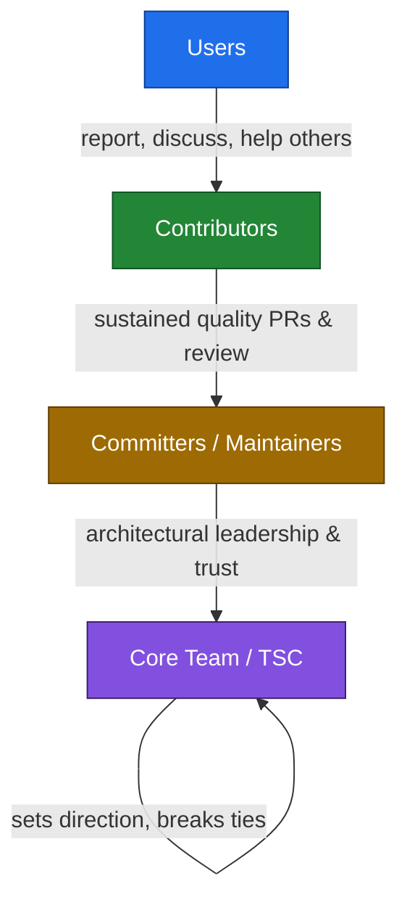
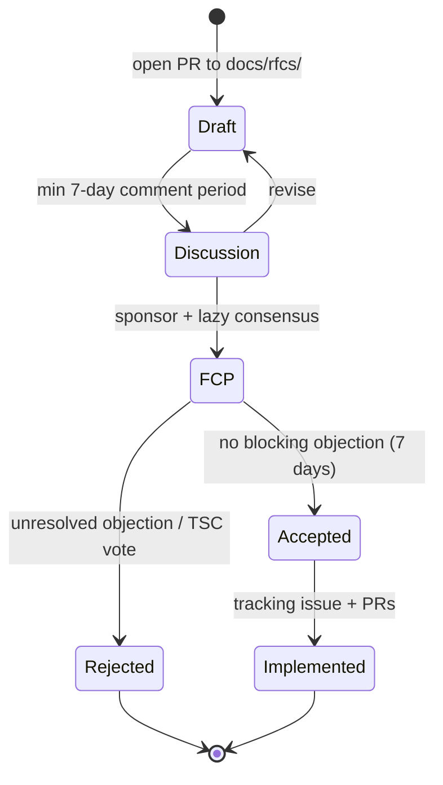
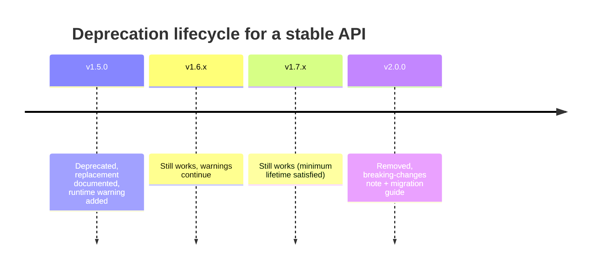

# Governance

> How GOCO CMS is led, how decisions are made, how APIs are stabilized and deprecated, and how anyone can rise from user to maintainer.

GOCO CMS — "The Open Source Website Operating System" — is an MIT-licensed, community-driven project in active pre-1.0 development. This document is the authoritative description of the project's leadership structure, decision-making process, release and versioning policy, and backward-compatibility promise. It is a living document: it is itself changed through the process it describes.

Governance here is deliberately lightweight and meritocratic. Influence is earned through sustained, high-quality contribution — not appointed, purchased, or inherited. The goal is a project that stays fast to move, safe to depend on, and open to newcomers.

---

## Mission & values

**Mission.** Give everyone a lightweight, extensible core — a "Website Operating System" — around which a healthy ecosystem of widgets, themes, and plugins can grow, so that building and operating websites is open, portable, and free of lock-in.

**Values.** Every decision, review, and release is weighed against these, in roughly this priority order:

| Value | What it means in practice |
| --- | --- |
| **Users first** | A change that helps a maintainer but hurts operators or end users loses. Stable APIs are a promise, not a convenience. |
| **Open by default** | Design discussion, RFCs, roadmaps, and decisions happen in public. Private channels are for security embargoes and conduct matters only. |
| **Meritocracy** | Trust and commit rights follow demonstrated, sustained contribution and good judgment — code, review, docs, triage, or community work all count. |
| **Small core, rich ecosystem** | The core stays minimal and boring; ambition lives in widgets, themes, and plugins. We say "no" to core features that belong in a plugin. |
| **Backward compatibility** | Depending on GOCO must be safe. `stable` APIs change only through the deprecation policy below. |
| **Technical excellence** | Correctness, security, performance, and tests are not optional. See [Coding Standards](coding-standards.md) and [Testing Strategy](testing-strategy.md). |
| **Kindness** | Disagreement is fine; contempt is not. The [Code of Conduct](code-of-conduct.md) applies to everyone equally, including maintainers. |

---

## Roles & responsibilities

GOCO uses a four-tier meritocratic ladder. Each rung is a superset of the one below it. Advancement is by nomination and recognition of contribution — never by tenure alone and never by request.



### Users

Anyone who runs GOCO CMS. Users have no obligations, but they are the reason the project exists.

- **May:** open issues, request features, ask and answer questions in the forums and chat, write blog posts and tutorials, publish widgets/themes/plugins to the [Marketplace](../marketplace/overview.md).
- **Path forward:** a user becomes a Contributor the moment their first pull request, documentation fix, reproducible bug report, or triage action lands.

### Contributors

Anyone who has contributed to any GOCO repository — code, docs, tests, translations, triage, design, or accepted RFCs. This is the broadest working tier.

- **Responsibilities:** follow the [Contributing guide](contributing.md), [Coding Standards](coding-standards.md), and [Code of Conduct](code-of-conduct.md); sign off commits under the Developer Certificate of Origin (DCO); keep PRs focused and tested.
- **May:** submit PRs, review others' PRs (non-binding), participate in RFC discussion, vote informally (advisory) in lazy-consensus threads.
- **Recognition:** all contributors are listed in `CONTRIBUTORS.md` and credited in [release notes](../changelog.md).
- **Path forward:** see [Adding maintainers](#adding-maintainers).

### Committers / Maintainers

Contributors who have been granted **write access** to one or more repositories or `core/` subsystems. Maintainers are the day-to-day stewards of the codebase.

- **Responsibilities:**
  - Review and merge PRs within their area of ownership (see [Code ownership](#code-ownership)).
  - Uphold the [Backward compatibility](#backward-compatibility) promise and the 17-section [module documentation standard](../architecture/overview.md) for anything they merge.
  - Triage issues, shepherd RFCs, mentor Contributors.
  - Keep their subsystem's tests green in CI and its docs current.
- **Rights:** binding vote in lazy-consensus and formal votes; may approve and merge; may cut release candidates for their package.
- **Standing rule:** a maintainer never merges their own non-trivial change without a second maintainer's approval. Trivial changes (typos, comment fixes, dependency bumps that pass CI) may be self-merged.

### Core Team / Technical Steering Committee (TSC)

A small group (target 5–9 members, always an odd number to break ties) of maintainers responsible for the health and direction of the whole project. The TSC is the final decision-making body.

- **Responsibilities:**
  - Own cross-cutting architecture (the ZealPHP/OpenSwoole runtime foundation, the MongoDB data layer, the SDK contract, security posture).
  - Approve or reject significant RFCs and set the [Roadmap](../roadmap.md).
  - Manage releases, the deprecation schedule, and the [Backward compatibility](#backward-compatibility) promise.
  - Add and remove maintainers; hold the final vote on Code of Conduct escalations.
  - Steward the trademark, finances, and external relationships.
- **Composition rule:** no single employer or organization may hold more than **one-third** of TSC seats (rounded down). This keeps the project vendor-neutral.
- **Term:** TSC members serve 12-month terms and may be re-affirmed. A member inactive for 90 consecutive days moves to emeritus.

> **Note**
> Titles describe responsibility, not rank. A TSC member reviewing a first-time contributor's PR follows the same review rules and the same Code of Conduct as everyone else.

---

## Decision-making

GOCO optimizes for momentum. Most decisions are made quietly by the people doing the work; only significant or contested changes escalate.

### Lazy consensus (the default)

Almost everything runs on **lazy consensus**: a proposal is assumed accepted unless someone objects. Silence is agreement.

- A PR that follows the standards, has green CI, and receives at least one binding approval from a maintainer of the affected area may be merged after a **minimum 24-hour** window (72 hours for changes touching a `stable` public API or a `core/` subsystem), giving others time to object.
- Any maintainer may **block** a change by leaving an explicit objection ("request changes" with a rationale). A block must be substantive and actionable, not merely a preference.
- Blocks are resolved by discussion. If discussion stalls, the change escalates to an RFC or a vote.

### RFC process (for significant changes)

Anything with broad or lasting impact goes through a written **Request For Comments** before code is merged. "Significant" includes:

- New or changed **`stable` SDK facades** (`Widget`, `Theme`, `Plugin`, `Hook`) or their signatures.
- New core subsystems, new first-class hooks, or changes to hook naming conventions.
- Changes to the MongoDB data model (collections, canonical indexes, tenancy strategy).
- Anything affecting security, the permission model, or the runtime foundation.
- Removing or deprecating a `stable` API.

RFC lifecycle:



1. **Draft.** Open a PR adding `docs/rfcs/NNNN-short-title.md` from the RFC template (motivation, design, alternatives, drawbacks, migration, security impact).
2. **Sponsor.** An RFC needs a maintainer sponsor to proceed. Unsponsored RFCs may sit in Draft indefinitely.
3. **Discussion.** Minimum **7 days** of open comment. The author revises in response.
4. **Final Comment Period (FCP).** When the sponsor judges consensus is near, they call a 7-day FCP with a proposed disposition (accept/reject). If no blocking objection survives the FCP, the RFC merges as **Accepted**.
5. **Implementation.** An accepted RFC gets a tracking issue; implementation lands as normal PRs referencing the RFC.

### Voting (the fallback)

Voting is a last resort when consensus cannot be reached.

- **Who votes:** maintainers of the affected area for scoped decisions; the full TSC for project-wide decisions.
- **Mechanism:** votes are cast in the open (on the PR/RFC or a TSC meeting minute) as **+1 / 0 / -1** with rationale. A **-1** must include a concrete reason and, ideally, an alternative.
- **Threshold:** simple majority of cast votes carries, except: changing this governance document, removing a TSC member, or removing a `stable` API early requires a **two-thirds** supermajority of the full TSC.
- **Quorum:** a TSC vote requires at least half of sitting members to participate.
- **Tie-break:** because the TSC is kept at an odd number, ties are rare; if one occurs (abstentions/absences), the vote fails and the status quo holds.

All non-embargoed decisions and TSC meeting minutes are published in the project repository.

---

## Versioning

> Anchor: this section is linked project-wide as the canonical statement of GOCO's versioning policy.

GOCO CMS follows **[Semantic Versioning 2.0.0](https://semver.org/)** (`MAJOR.MINOR.PATCH`) and uses **[Conventional Commits](https://www.conventionalcommits.org/)** to drive changelog generation and version bumps.

| Segment | Bumped when | Example |
| --- | --- | --- |
| **MAJOR** | A backward-incompatible change to a `stable` API. | `1.0.0` → `2.0.0` |
| **MINOR** | New backward-compatible functionality; a `stable` addition. | `1.4.0` → `1.5.0` |
| **PATCH** | Backward-compatible bug or security fix only. | `1.5.2` → `1.5.3` |

**Pre-1.0 caveat.** GOCO is currently pre-1.0. Under SemVer, the `0.y.z` series makes no compatibility guarantee across `MINOR` bumps; during this phase we still try hard to minimize churn and always document breaking changes in the [Changelog](../changelog.md), but `stable` guarantees begin at `1.0.0`.

**Commit → version mapping (Conventional Commits):**

| Commit type | Effect |
| --- | --- |
| `fix:` | PATCH |
| `feat:` | MINOR |
| `feat!:` / `fix!:` / `BREAKING CHANGE:` footer | MAJOR (post-1.0) |
| `docs:`, `test:`, `chore:`, `refactor:`, `ci:` | no release on their own |

**Monorepo versioning.** Composer packages (`gococms/core`, `gococms/cli`, `gococms/widget-engine`, …) are versioned and tagged independently but validated together in CI. A GOCO "release" is a tested, mutually-compatible set of package versions captured in a release manifest; the umbrella product version tracks `gococms/core`.

**Release cadence.**

- **Patch releases:** as needed, on merge of fixes — typically weekly while a MINOR line is active; immediately for security fixes.
- **Minor releases:** on a roughly **6–8 week** train. Features that miss the train wait for the next one rather than delaying it ("the train leaves on time").
- **Major releases:** infrequent and deliberate, only when accumulated deprecations justify a break; announced at least one MINOR cycle in advance.

**Long-Term Support (LTS).** Beginning at `1.0.0`, every **even-numbered MAJOR** line (2.x, 4.x, …) is designated LTS:

- **Standard lines** receive fixes until the next MINOR ships plus a 30-day overlap.
- **LTS lines** receive security and critical bug fixes for **18 months** from the `.0` release and no longer accept new features.
- LTS status, dates, and the supported-version matrix are published and maintained in the [Roadmap](../roadmap.md) and [Changelog](../changelog.md).

---

## Backward compatibility

> Anchor: this section is linked project-wide as the canonical statement of GOCO's backward-compatibility (BC) promise.

Depending on GOCO must be safe. The BC promise defines exactly what will not break under you within a MAJOR line.

### What the promise covers

The BC promise covers **only APIs marked `stable`.** An API is `stable` when it is documented, tagged `stable`, and reachable through a supported surface:

- The **SDK facades** with their documented signatures: `Widget::register/render/properties/preview`, `Theme::register/layouts/regions/assets`, `Plugin::register/install/boot/routes/permissions`, `Hook::listen/dispatch/filter/apply` (and their aliases). See the [Hook SDK](../sdk/hook-sdk.md), [Widget SDK](../sdk/widget-sdk.md), [Theme SDK](../sdk/theme-sdk.md), and [Plugin SDK](../sdk/plugin-sdk.md).
- Documented **hook names and their payload contracts** (e.g. `page.rendering`, `widget.output`) — see the [Event & Hook System](../architecture/event-hook-system.md).
- The **public REST/JSON API** and documented response shapes — see the [API Reference](../reference/api-reference.md).
- Documented **configuration keys and environment variables** — see the [Configuration Reference](../reference/configuration-reference.md).
- The **`goco` CLI** command and flag surface documented in the [CLI Reference](../reference/cli-reference.md).
- Documented **MongoDB collection names and canonical indexes** — see the [Data Model](../architecture/data-model.md).

### What the promise does NOT cover

The following may change in any release, including PATCH, and code that relies on them is unsupported:

- Anything tagged **`experimental`** or **`beta`**. `experimental` APIs may change or vanish without a deprecation cycle; `beta` APIs are on track to stabilize but their signatures may still shift.
- Internal classes, protected/private members, and anything under a `@internal` annotation or in an `Internal\` namespace.
- Undocumented behavior, exact wording of log/exception messages, and precise HTML markup emitted by built-in widgets/themes (structure, not byte-for-byte output, is what's contracted).
- Behavior explicitly documented as implementation detail (e.g. cache key formats, job serialization internals).
- Anything under `0.y.z` before the `1.0.0` line, per [Versioning](#versioning).

### Stability tags

Every public API carries a stability tag in its documentation:

| Tag | Guarantee |
| --- | --- |
| `stable` | Covered by the BC promise. Removed only via the deprecation policy below. |
| `beta` | Nearly stable; may still change with a MINOR bump and a changelog note. |
| `experimental` | May change or be removed at any time, without deprecation. Opt-in; use in production at your own risk. |
| `deprecated` | Still works, scheduled for removal; a supported replacement exists. |

### Deprecation policy

A `stable` API is never removed abruptly. It goes through a documented deprecation cycle with a guaranteed minimum lifetime:

1. **Announce.** The API is tagged `deprecated` in its docs and in the [Changelog](../changelog.md) of the release that deprecates it. The entry names the replacement and a migration path.
2. **Warn.** From that release on, using the API emits a runtime deprecation notice (logged via the framework's deprecation channel; visible in `/tmp/zealphp/` logs and surfaced by `goco doctor`). The API keeps working unchanged.
3. **Wait.** The API remains functional for a **minimum of one full MINOR line and until the next MAJOR release, whichever is longer** — never removed in a PATCH, never removed in the same MINOR line it was deprecated in.
4. **Remove.** Removal happens only in a MAJOR release, listed prominently in that release's breaking-changes section with the migration guide.



> **Warning**
> Emergency exception: an API that is actively dangerous (a security hole or data-corruption bug that cannot be fixed compatibly) may be changed or removed faster than this policy. Doing so requires a **two-thirds TSC vote**, a security advisory, and a documented migration. This is the only path that shortens the deprecation window for a `stable` API.

> **Tip**
> Depend only on `stable` surfaces, run CI against the latest PATCH of your MINOR line, and treat deprecation warnings as build failures. That keeps upgrades to MINOR releases boring — which is the point.

---

## Release process

Releases are cut by any TSC member or a maintainer designated as release manager for the cycle. The process is automated where possible and gated by CI.

```bash
# 1. Ensure main is green: full test matrix + static analysis + BC check.
goco ci verify --suite full

# 2. Generate the changelog from Conventional Commits since the last tag.
goco release changelog --since v1.4.3

# 3. Cut a release candidate; tags packages and builds the release manifest.
goco release cut --rc 1.5.0-rc.1

# 4. RC bake period (min 72h): community tests the RC against real deployments.
#    Fixes land on the release branch and roll into rc.2, etc.

# 5. Promote to final once the RC is clean.
goco release promote 1.5.0

# 6. Publish: push git tags, Composer/Packagist, and Docker images.
goco release publish 1.5.0
```

Release checklist (enforced by `goco release`):

- All CI green on the release branch, including the **automated BC check** (a compatibility linter that fails the build if a `stable` signature changed without a MAJOR bump).
- [Changelog](../changelog.md) updated and human-reviewed; breaking changes and deprecations called out.
- Security advisories, if any, coordinated and embargoed until publish (see [Security Model](../security/security-model.md)).
- Docker images built for the [compose stack](../deployment/docker.md) and published; the `gococms` image is tagged with the exact version and the moving MINOR tag.
- Upgrade notes verified against the [Deployment Guide](../deployment/deployment-guide.md).
- Post-publish: the [Roadmap](../roadmap.md) support matrix is updated (LTS/EOL dates).

Hotfix releases (PATCH for a critical or security bug) skip the RC bake period but still require green CI, a second maintainer's approval, and a changelog entry.

---

## Adding maintainers

Maintainership is earned and granted by nomination — not applied for.

**Criteria.** A candidate has, over a sustained period (typically 3+ months), demonstrated:

- A track record of merged, high-quality PRs in the area they'll own.
- Sound, constructive code review of others' work.
- Adherence to the [Coding Standards](coding-standards.md), [Testing Strategy](testing-strategy.md), and BC promise.
- Good judgment and collaborative conduct under the [Code of Conduct](code-of-conduct.md).

**Process.**

1. An existing maintainer or TSC member nominates the candidate on the private maintainers channel with links to representative work.
2. Maintainers of the affected area discuss; the nomination runs as a **lazy-consensus vote over 7 days**.
3. With no blocking objection, the TSC ratifies and the candidate is offered write access, added to the relevant `CODEOWNERS` entries, and announced publicly.
4. New maintainers are onboarded with the release and security processes and paired with a mentor for their first cycle.

**Promotion to the TSC.** When a TSC seat opens (term end, resignation, growth), the sitting TSC nominates from among active maintainers and elects by simple majority, respecting the one-third-per-employer cap.

## Removing maintainers

Access is a responsibility, and it can be relinquished or removed.

- **Voluntary / emeritus.** A maintainer may step down at any time and is moved to **emeritus** status — permanently credited, write access removed. Emeritus maintainers are welcome back through a lightweight re-affirmation, not a full re-nomination.
- **Inactivity.** A maintainer inactive for **6 months** (no merges, reviews, or triage) is moved to emeritus by the TSC, with prior notice. This is administrative, not punitive.
- **For cause.** Serious or repeated Code of Conduct violations, actions that endanger users (e.g. bypassing review to merge unsafe changes to `stable` APIs), or loss of trust may lead to removal by a **two-thirds TSC vote**. The affected person is heard before the vote where safety and conduct rules allow.

Removal revokes write access and `CODEOWNERS` entries and rotates any shared credentials the person held.

---

## Code ownership

Ownership is expressed in machine-readable `CODEOWNERS` files at the repo and directory level, and mirrors the [monorepo structure](../getting-started/project-structure.md).

- Each top-level area — `core/`, each `packages/*` (auth, widget-engine, template-engine, plugin-engine, database, queue, storage, seo, ai, analytics, forms), each `apps/*` (admin, api, website, installer), `cli/`, `docker/`, and `docs/` — has one or more designated maintainers listed as owners.
- A PR touching an owned path **requires approval from at least one owner** of that path before merge (enforced by branch protection).
- Cross-cutting changes (touching the runtime foundation, the SDK contract, the data model, or security) require **TSC review** in addition to path owners.
- Ownership is documented, not exclusive: any maintainer may review and comment anywhere; owners are the accountable approvers, not gatekeepers of discussion.

```
# CODEOWNERS (excerpt)
/core/                      @gococms/tsc
/packages/database/         @gococms/data-team
/packages/widget-engine/    @gococms/sdk-team
/packages/auth/             @gococms/security-team @gococms/tsc
/apps/admin/                @gococms/frontend-team
/docker/                    @gococms/infra-team
/docs/                      @gococms/docs-team
```

---

## Funding, sponsorship & trademark

**Funding.** GOCO accepts sponsorship and donations to fund maintenance, infrastructure (CI, package registries, the [Marketplace](../marketplace/overview.md)), security audits, and community events. Funding is administered transparently through a neutral fiscal host; income and expenditure are reported publicly to the community at least annually.

**Sponsor influence.** Money buys visibility and gratitude — not decisions. Sponsors receive acknowledgment and, at higher tiers, roadmap briefings, but **no sponsor gets a vote, a guaranteed feature, or a TSC seat**. Roadmap and technical decisions follow the process in this document regardless of who funds the project. The one-third-per-employer TSC cap exists precisely to keep funding and control separate.

**Marketplace commerce.** The Plugin/Theme [Marketplace](../marketplace/overview.md) may host paid extensions; commercial terms for third-party authors are governed by the Marketplace agreement, independent of core governance. Nothing in the Marketplace grants influence over the core project.

**Trademark.** The "GOCO CMS" name and logo are project trademarks, held in trust by the fiscal host on behalf of the community and stewarded by the TSC. The **MIT license covers the code, not the marks.** You may:

- State that your product "works with", "is built on", or "is for GOCO CMS" (nominative, accurate use).
- Redistribute unmodified GOCO under its name.

You may **not**, without written permission:

- Use the name or logo in a way that implies official endorsement or affiliation.
- Ship a modified or forked distribution under the "GOCO" name (rename your fork).
- Use the marks in a company name, product name, or domain that could cause confusion.

Trademark questions and permission requests go to the TSC.

---

## Conflict resolution

Disagreement is a normal part of a healthy project. GOCO resolves it with the least force necessary.

1. **Talk it out.** Most conflicts resolve through direct, respectful discussion on the issue, PR, or RFC. Assume good faith; argue the technical merits, not the person.
2. **Seek a third opinion.** If two contributors are stuck, ask an uninvolved maintainer of the area to weigh in. Fresh perspective breaks most deadlocks.
3. **Escalate to a vote.** A technical dispute that discussion cannot settle escalates to the maintainers of the affected area, and if still unresolved, to the TSC, decided by the [voting](#voting-the-fallback) rules above. The TSC's decision is final for technical matters.
4. **Code of Conduct matters.** Interpersonal conflict, harassment, or conduct concerns follow the **[Code of Conduct](code-of-conduct.md)** reporting and enforcement process — a separate, confidential track handled by the CoC committee, not the technical dispute process. Serious cases may be escalated to the TSC for sanctions up to removal.

> **Note**
> Technical disputes and conduct disputes are handled by different processes for a reason: a bad idea and a bad actor are different problems. Never use a conduct process to win a technical argument, or a technical process to excuse harmful behavior.

Where a contributor believes a decision was made improperly (process not followed), they may request that the TSC review the process itself; the TSC will respond publicly with its findings.

---

## Amending this document

This governance document is changed through its own process: open a PR, run it as an **RFC**, and — because governance changes are significant — require a **two-thirds TSC supermajority** to adopt. Amendments are announced in the [Changelog](../changelog.md) and take effect on merge.

---

## Related

- [Contributing](contributing.md)
- [Code of Conduct](code-of-conduct.md)
- [Coding Standards](coding-standards.md)
- [Testing Strategy](testing-strategy.md)
- [Support](support.md)
- [Roadmap](../roadmap.md)
- [Changelog](../changelog.md)
- [Security Model](../security/security-model.md)
- [Marketplace](../marketplace/overview.md)
- [Event & Hook System](../architecture/event-hook-system.md)
- [API Reference](../reference/api-reference.md)
- [CLI Reference](../reference/cli-reference.md)
- [Configuration Reference](../reference/configuration-reference.md)
- [Documentation Index](../README.md)
