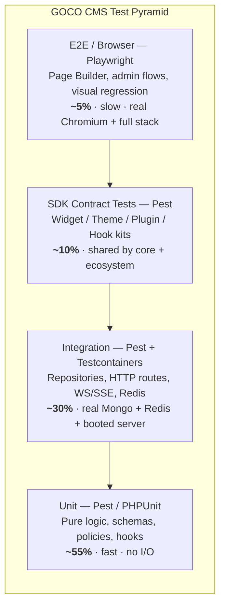
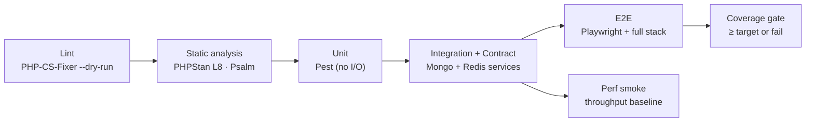

# Testing Strategy

> How GOCO CMS is tested — a coroutine-aware test pyramid spanning unit, integration, end-to-end, contract, performance, and accessibility layers, wired into CI with strict lint, static-analysis, and coverage gates.

GOCO CMS is **The Open Source Website Operating System**: a lightweight ZealPHP/OpenSwoole core surrounded by an ecosystem of widgets, themes, and plugins. Testing a system like this is not the same as testing a request-per-process PHP app. Our code runs inside long-lived OpenSwoole workers, executes in coroutines, holds shared memory across workers, and talks to MongoDB and Redis on every request. Our tests must reflect that reality — a passing test suite has to prove the software behaves correctly *under the runtime it ships on*, not under a synthetic CGI shim.

This document defines the testing philosophy, the tooling, the harness for coroutine-aware and HTTP-level tests, fixtures and factories for MongoDB documents, SDK contract tests for third-party extension authors, and the CI matrix that enforces all of it. It is written for two audiences: **core contributors** shipping changes to `core/` and `packages/`, and **extension authors** shipping widgets, themes, and plugins who need their code to survive a GOCO upgrade.

> **Note**
> This is the *strategy* document — the "why" and the "shape". For the mechanical rules on naming, formatting, and the pre-commit gates that every test file must satisfy, see [Coding Standards](coding-standards.md). For how a change moves from a branch to `main`, see [Contributing](contributing.md).

---

## Testing Philosophy

Five principles govern every test in the monorepo.

1. **Test the runtime you ship.** Route, WebSocket, SSE, and coroutine behavior is validated against a real OpenSwoole server booted by the same `App::init()` path that production uses — not a mocked kernel. A green suite is a statement about ZealPHP-on-OpenSwoole, not about PHP-in-abstract.
2. **Real dependencies over mocks for data.** MongoDB and Redis are cheap to run in a container. We test against real instances (ephemeral, per-run) rather than mocking the driver, because our bugs live in aggregation pipelines, index behavior, transactions, and Lua scripts — none of which a mock reproduces. Mocks are reserved for *external* services (payment gateways, third-party AI providers, SMTP).
3. **Isolation is non-negotiable.** Every test starts from a known-empty, tenant-scoped data state and must not leak into the next. Coroutine and shared-memory state (`\ZealPHP\Store`, `\ZealPHP\Counter`) is reset between tests. Flaky, order-dependent tests are treated as broken tests.
4. **The pyramid, not the ice-cream cone.** Many fast unit tests, fewer integration tests, a thin layer of end-to-end browser tests. E2E exists to catch wiring failures the lower layers structurally cannot see (the visual Page Builder), not to re-test business logic.
5. **Contracts are law.** The SDK facades (`Widget`, `Theme`, `Plugin`, `Hook`) are the public boundary of the platform. Every facade has a contract test kit that both core and third parties run. A change that breaks a contract test is a breaking change and is versioned as one under SemVer.

> **Tip**
> When you are unsure at which layer to write a test, ask: *"What is the cheapest layer that can actually observe the bug I am preventing?"* Write it there, and only there.

---

## The Test Pyramid



| Layer | Framework | What it covers | Dependencies | Target share | Wall-clock budget |
|-------|-----------|----------------|--------------|--------------|-------------------|
| **Unit** | Pest 3 (on PHPUnit 11) | Pure functions, value objects, `PropertySchema` validation, `PolicyEngine` decisions, hook priority ordering, formatters | None (no I/O) | ~55% | < 2 min full suite |
| **Integration** | Pest + Testcontainers-PHP | Repositories against real MongoDB, Redis cache/queue/locks, HTTP routes against a booted server, WebSocket/SSE, middleware chains | MongoDB, Redis, OpenSwoole server | ~30% | < 8 min |
| **Contract** | Pest test kits (`gococms/testing`) | SDK facade behavior — the promises `Widget`/`Theme`/`Plugin`/`Hook` make to extension authors | Booted server + Mongo/Redis | ~10% | < 3 min |
| **E2E** | Playwright (TypeScript) | Page Builder drag-and-drop, admin CRUD, auth flows (2FA, passkeys), theme switching, visual regression | Full Docker stack via Traefik | ~5% | < 12 min |

The `packages/*` libraries lean heavily unit + integration. The `apps/{admin,website}` UIs are the primary consumers of E2E. Every `core/` module is expected to carry all four layers where applicable, and each core-module doc's **§14 Testing Strategy** section points back here for the shared harness.

---

## Tooling & Conventions

- **Test runner:** [Pest 3](https://pestphp.com) as the primary DSL, layered on **PHPUnit 11**. Pure PHPUnit `TestCase` classes are permitted for authors who prefer them; both run in the same suite via the shared `phpunit.xml`.
- **Assertions & doubles:** Pest expectations; Mockery for the rare external-service double.
- **Fixtures/factories:** `gococms/testing` (dev-only Composer package) provides Mongo document factories, the coroutine harness, the HTTP client, and the SDK test kits.
- **Static analysis:** PHPStan (level max, plus the strict-rules extension) and Psalm run as gates — see [Coding Standards](coding-standards.md).
- **Style:** PHP-CS-Fixer / PHP_CodeSniffer against PSR-12 + the GOCO ruleset.
- **Coverage:** `pcov` (fast, line coverage) in CI; Xdebug locally when branch coverage or a debugger is needed.
- **JS/TS (admin & builder):** Vitest for unit, Playwright for E2E, axe-core for accessibility.

Directory layout — tests mirror the monorepo, with a top-level `tests/` for cross-cutting suites:

```
tests/
  Unit/            # cross-package pure-logic tests
  Integration/     # repositories, routes, WS/SSE against real services
  Contract/        # SDK facade contract kits run against core
  E2E/             # Playwright specs (TypeScript) for apps/{admin,website}
  Performance/     # k6 / wrk load profiles + baselines
  Support/         # base test cases, traits, bootstrap
  Fixtures/        # seed JSON, JSON-Schema samples, media blobs
packages/<pkg>/tests/   # package-local Unit + Integration
core/<module>/tests/    # module-local tests
```

Naming: test files end in `Test.php` (PHPUnit) or use Pest's `*.php` describe/it files under a `tests/` dir. One behavior per test; describe blocks group by unit-of-behavior, not by class.

---

## Testing Under OpenSwoole & Coroutines

This is the part that makes GOCO testing different. PHPUnit was designed for the classic "boot PHP, run one script, tear down" model. OpenSwoole flips that: the runtime is a persistent event loop, code runs inside coroutines, `$_SESSION`/`$_GET`/`$_SERVER` are per-coroutine (via ext-zealphp), and shared state lives in `\OpenSwoole\Table` across workers. A naive test process that touches coroutine primitives outside an event loop will fatal.

### The coroutine harness

`gococms/testing` ships a `CoroutineTestCase` (and a Pest `uses()` binding) that wraps each test body in an OpenSwoole coroutine runtime so that `go()`, `co::sleep()`, channels, and coroutine-scoped superglobals behave exactly as in production.

```php
<?php

use Goco\Testing\CoroutineTestCase;
use OpenSwoole\Coroutine\Channel;

uses(CoroutineTestCase::class);

it('fans out work across coroutines and collects results in order', function () {
    $chan = new Channel(3);

    foreach (['a', 'b', 'c'] as $i => $key) {
        go(function () use ($chan, $key, $i) {
            \co::sleep(0.01 * (3 - $i)); // finish out of start order
            $chan->push([$key => strtoupper($key)]);
        });
    }

    $collected = [];
    for ($n = 0; $n < 3; $n++) {
        $collected += $chan->pop(1.0);
    }

    expect($collected)->toEqual(['a' => 'A', 'b' => 'B', 'c' => 'C']);
});
```

Under the hood the harness runs each `it()` inside `\OpenSwoole\Coroutine\run(...)`, enables the runtime hook for coroutine-scoped superglobals, and — critically — **resets shared state after every test**:

```php
<?php

namespace Goco\Testing;

use OpenSwoole\Runtime;
use PHPUnit\Framework\TestCase;
use ZealPHP\Store;

abstract class CoroutineTestCase extends TestCase
{
    protected function runTest(): mixed
    {
        $result = null;
        \OpenSwoole\Coroutine\run(function () use (&$result) {
            Runtime::enableCoroutine(Runtime::HOOK_ALL);
            $result = parent::runTest();
        });

        return $result;
    }

    protected function tearDown(): void
    {
        Store::flushAll();           // clear \ZealPHP\Store tables
        \Goco\Testing\CounterRegistry::reset(); // reset \ZealPHP\Counter atomics
        $_SESSION = [];
        parent::tearDown();
    }
}
```

> **Warning**
> Never call `\co::sleep()`, `go()`, a `Channel`, or `\ZealPHP\Store::publish()` from a plain `TestCase`. Outside a running coroutine event loop these either fatal or silently no-op, producing false greens. Extend `CoroutineTestCase` (or `uses()` it in Pest) for anything that touches the coroutine runtime, shared memory, timers (`App::tick`/`App::after`), or per-coroutine superglobals.

### Testing shared memory & atomics

```php
<?php

use Goco\Testing\CoroutineTestCase;
use ZealPHP\Counter;
use ZealPHP\Store;

uses(CoroutineTestCase::class);

it('increments an atomic counter safely across coroutines', function () {
    $counter = new Counter(0);
    $chan = new \OpenSwoole\Coroutine\Channel(100);

    for ($i = 0; $i < 100; $i++) {
        go(function () use ($counter, $chan) {
            $counter->increment();
            $chan->push(true);
        });
    }
    for ($i = 0; $i < 100; $i++) { $chan->pop(1.0); }

    expect($counter->get())->toBe(100);
});

it('publishes rate-limit state through the shared store', function () {
    Store::make('ratelimit_test', 128, ['hits' => ['int', 8]]);
    Store::set('ratelimit_test', 'tenant:acme', ['hits' => 1]);

    expect(Store::get('ratelimit_test', 'tenant:acme')['hits'])->toBe(1);
});
```

---

## HTTP, Route, WebSocket & SSE Tests

Route handlers, middleware, file-based REST endpoints (`api/foo/bar.php`), WebSocket handlers, and SSE generators can only be trusted when driven through a **real booted server**. The harness starts a GOCO app on an ephemeral port inside a coroutine, issues real HTTP/WS requests over the loopback, and shuts it down on teardown.

### Booting the server for tests

```php
<?php

namespace Goco\Testing;

use ZealPHP\App;

final class TestServer
{
    public static function boot(int $port = 0): self
    {
        App::superglobals(false);
        App::mode(App::MODE_COROUTINE);
        $app = App::init('127.0.0.1', $port ?: self::freePort());
        // Load the same route table + middleware production uses:
        require dirname(__DIR__, 2) . '/apps/website/public/app.php';
        // ... registers routes, middleware, hooks via the normal bootstrap
        $app->startDetached();     // runs $app->run() in a child process
        return new self($app);
    }
}
```

For most suites we run the server as a **detached background process** (mirroring the `goco`/`php app.php start -d` lifecycle, logs under `/tmp/zealphp/`) and hit it with a coroutine HTTP client. A `HttpTestCase` exposes a fluent client:

```php
<?php

use Goco\Testing\HttpTestCase;

uses(HttpTestCase::class);

it('renders a page as JSON and applies the response.headers filter', function () {
    $this->seedPage(['slug' => 'about', 'title' => 'About Us', 'status' => 'published']);

    $res = $this->get('/api/pages/about', headers: ['Accept' => 'application/json']);

    $res->assertStatus(200)
        ->assertJsonPath('title', 'About Us')
        ->assertHeader('X-Goco-Cache', 'MISS')
        ->assertHeader('Content-Type', 'application/json');
});

it('rejects a write without a valid CSRF token', function () {
    $res = $this->post('/api/pages', ['title' => 'Hi'], tenant: 'acme');
    $res->assertStatus(419); // Csrf middleware
});

it('streams a generator route in chunks (SSE)', function () {
    $events = $this->sse('/api/jobs/42/progress', maxEvents: 3);

    expect($events)->toHaveCount(3)
        ->and($events[2]['data']['percent'])->toBe(100);
});
```

### WebSocket tests

```php
<?php

use Goco\Testing\WebSocketTestCase;

uses(WebSocketTestCase::class);

it('echoes frames on the demo socket', function () {
    $ws = $this->connect('/ws/echo');
    $ws->send('ping');

    expect($ws->receive(1.0))->toBe('ping');
    $ws->close();
});

it('pushes a widget.rendered event to subscribed builder clients', function () {
    $ws = $this->connect('/ws/builder', headers: $this->authHeaders('designer'));
    $this->dispatchHook('widget.render.after', ['widget' => 'hero', 'id' => 'w1']);

    $msg = $ws->receiveJson(2.0);
    expect($msg['event'])->toBe('widget.rendered')
        ->and($msg['id'])->toBe('w1');
});
```

### Middleware tests

Each built-in middleware (`Cors`, `ETag`, `Compression`, `Range`, `BasicAuth`, `IpAccess`, `RateLimit`, `ConcurrencyLimit`, `Csrf`, `HostRouter`, `Redirect`) has an integration test asserting its effect on a real request. `HostRouter` tests double as multi-tenancy routing tests — see [Multi-Tenancy](../architecture/multi-tenancy.md) — asserting that `acme.example.com` and `blog.example.com` resolve to the correct `workspace_id` + `website_id`.

---

## Integration Tests: MongoDB & Redis via Containers

Integration tests run against **real MongoDB and Redis**, provisioned per run with [Testcontainers-PHP](https://github.com/testcontainers/testcontainers-php) locally and via GitHub Actions `services:` in CI. This exercises the real driver, aggregation pipelines, JSON-Schema validators, transactions, indexes, full-text search, and Redis Lua scripts — the surfaces that carry our actual risk. See [MongoDB Data Layer](../architecture/database-mongodb.md) and [Caching, Queue & Realtime](../architecture/caching-and-queue.md).

```php
<?php

use Goco\Testing\IntegrationTestCase;
use Goco\Database\Repository;

uses(IntegrationTestCase::class); // boots Mongo + Redis containers, injects clients

it('soft-deletes a page and excludes it from default queries', function () {
    $pages = Repository::for('pages')->scope($this->tenant());
    $id = $pages->insert(['slug' => 'gone', 'title' => 'Gone', 'status' => 'published']);

    $pages->softDelete($id);

    expect($pages->find($id))->toBeNull()                 // default excludes deleted_at
        ->and($pages->withTrashed()->find($id))->not->toBeNull();
});

it('enforces the pages JSON-Schema validator on insert', function () {
    $pages = Repository::for('pages')->scope($this->tenant());

    expect(fn () => $pages->insert(['slug' => 123])) // slug must be string
        ->toThrow(\Goco\Database\Exception\SchemaViolation::class);
});

it('keeps a cross-collection invariant inside a transaction', function () {
    // publishing a page must also write an audit_logs entry atomically
    $service = $this->container->get(\Goco\Content\PageService::class); // resolve via the service container
    $service->publish($this->pageId(), actor: $this->user('editor'));

    expect(Repository::for('audit_logs')->count(['action' => 'page.published']))->toBe(1);
});
```

Testcontainers bootstrap (conceptual):

```php
<?php

namespace Goco\Testing;

use Testcontainers\Container\GenericContainer;

trait ProvisionsServices
{
    protected function startServices(): void
    {
        $this->mongo = (new GenericContainer('mongo:7'))
            ->withExposedPorts(27017)
            ->withCommand(['--replSet', 'rs0']) // replica set → transactions
            ->start();

        $this->redis = (new GenericContainer('redis:7-alpine'))
            ->withExposedPorts(6379)
            ->start();

        Mongo::initReplicaSet($this->mongo);   // one-time rs.initiate()
        Schema::applyValidators($this->mongo);  // install JSON-Schema on all collections
        Schema::applyIndexes($this->mongo);     // documented indexes from packages/database
    }
}
```

> **Note**
> Transactions require a MongoDB **replica set**, so the test container is started with `--replSet rs0` and initiated once. A standalone `mongod` will pass most tests but silently skip transaction semantics — CI always uses the replica-set configuration to match production.

---

## Fixtures, Factories & Test Isolation

### Document factories

Every core collection has a factory in `gococms/testing`. Factories produce schema-valid documents with the mandatory envelope fields — `_id`, `created_at`, `updated_at`, `deleted_at`, `version`, `created_by`, `updated_by`, plus `workspace_id`/`website_id` on tenant-scoped docs — and let you override any field. See [Data Model](../architecture/data-model.md) for the full collection list.

```php
<?php

use function Goco\Testing\factory;

// A single published page, tenant-scoped, with sensible defaults:
$page = factory('pages')->published()->make(['slug' => 'pricing']);

// Ten posts by one author, persisted:
$posts = factory('posts')->count(10)->for($author)->create();

// A widget document with a nested property tree:
$widget = factory('widgets')->ofType('hero')->withProps([
    'heading' => 'Welcome', 'cta' => ['label' => 'Start', 'href' => '/signup'],
])->create();

// Related graph: workspace → website → theme → layout → page
$scene = factory()->scenario('single-site-blog')->create();
```

Factories are defined declaratively and always emit valid documents so integration tests exercise the *validators*, not the factory's bugs:

```php
<?php

namespace Goco\Testing\Factories;

return factory('pages', fn (Faker $f, Tenant $t) => [
    'workspace_id' => $t->workspaceId,
    'website_id'   => $t->websiteId,
    'slug'         => $f->unique()->slug(2),
    'title'        => $f->sentence(3),
    'status'       => 'draft',
    'layout'       => 'default',
    'sections'     => [],
    'version'      => 1,
    'created_by'   => $t->actorId,
])->state('published', fn () => ['status' => 'published', 'published_at' => new \DateTimeImmutable()]);
```

### Per-test isolation & tenant scoping

Isolation strategy, fastest first:

1. **Unit tests** touch no I/O — isolation is free.
2. **Integration tests** run each test against a **fresh, uniquely-named database** derived from the test id (`goco_test_{hash}`), dropped on teardown. This is faster and safer than truncating shared collections and gives perfect parallel isolation.
3. **Tenant scoping** is asserted explicitly: the `IntegrationTestCase` seeds *two* tenants (`acme`, `globex`) and every repository test verifies that a query scoped to one never returns the other's documents. Multi-tenant leakage is the single highest-severity bug class in a Website Operating System, so a scoped-query cross-tenant assertion is mandatory in every repository suite.

```php
<?php

it('never leaks documents across tenants', function () {
    $acme   = Repository::for('pages')->scope($this->tenant('acme'));
    $globex = Repository::for('pages')->scope($this->tenant('globex'));

    $acme->insert(['slug' => 'secret', 'title' => 'ACME secret']);

    expect($globex->all())->toBeEmpty()
        ->and($globex->find(['slug' => 'secret']))->toBeNull();
});
```

Redis is namespaced per test run (`test:{hash}:*`) and flushed on teardown so cache, queue, lock, and session keys never bleed between tests.

---

## SDK Contract Tests (Widget / Theme / Plugin / Hook Kits)

The SDK facades are the platform's public API. To keep them honest we ship **contract test kits** in `gococms/testing` that assert the *promised behavior* of each facade. Core runs them against its own built-ins; **extension authors run the same kits against their widgets, themes, and plugins** to certify compatibility. A green kit is the entry criterion for the [Plugin Marketplace](../marketplace/overview.md).

### Widget contract kit

Verifies `Widget::register`, `render`, `properties`, and `preview` — see [Widget SDK](../sdk/widget-sdk.md).

```php
<?php

use Goco\Testing\Contracts\WidgetContract;

// Point the kit at your widget type and it runs the full contract:
WidgetContract::for('acme/testimonial')
    ->registersWithoutError()
    ->propertiesReturnSchema()            // Widget::properties() → PropertySchema
    ->rendersWithValidProps([
        'quote'  => 'Great product',
        'author' => 'A. User',
    ])
    ->rendersEmptyStateWithMissingProps() // never throws on absent optional props
    ->escapesUntrustedProps()             // XSS: props are output-encoded
    ->previewMatchesRender()              // preview() ≈ render() shape
    ->isDeterministic()                   // same props → same output
    ->assert();
```

Under the hood each of these is a Pest test; the kit is a fluent builder over them. Contract assertions the widget kit enforces:

| Assertion | Guarantee |
|-----------|-----------|
| `registersWithoutError` | `Widget::register($type, $def)` accepts the definition |
| `propertiesReturnSchema` | `Widget::properties($type)` returns a valid `PropertySchema` |
| `rendersWithValidProps` | `Widget::render()` returns HTML string, no exception |
| `escapesUntrustedProps` | props containing `<script>` are encoded, not emitted raw |
| `rendersEmptyStateWithMissingProps` | optional props may be absent |
| `isDeterministic` | identical props + context → identical output |

### Theme contract kit

Verifies `Theme::register`, `layouts`, `regions`, `assets` — see [Theme SDK](../sdk/theme-sdk.md).

```php
<?php

use Goco\Testing\Contracts\ThemeContract;

ThemeContract::for('acme/aurora')
    ->manifestIsValid()                 // required manifest keys present
    ->declaresAtLeastOneLayout()        // Theme::layouts() non-empty
    ->everyLayoutDeclaresRegions()      // Theme::regions() per layout
    ->assetBundleResolves()             // Theme::assets() → AssetBundle, files exist
    ->regionsAreRenderable()
    ->assert();
```

### Plugin contract kit

Verifies the plugin lifecycle — `register` → `install` → `boot`, plus `routes`, `permissions` — see [Plugin SDK](../sdk/plugin-sdk.md).

```php
<?php

use Goco\Testing\Contracts\PluginContract;

PluginContract::for('acme/crm')
    ->installsCleanly()                 // Plugin::install() idempotent
    ->bootsWithoutSideEffectsOnFail()   // failed boot leaves no partial state
    ->declaredPermissionsAreValidCaps() // caps match resource.action grammar
    ->routesRegisterUnderNamespace()    // Plugin::routes() namespaced by slug
    ->hooksAreNamespaced()              // custom hooks prefixed with plugin slug
    ->uninstallsCleanly()               // reversible install
    ->assert();
```

### Hook contract kit

Verifies action/filter semantics and priority ordering — see [Hook SDK](../sdk/hook-sdk.md).

```php
<?php

use Goco\Hook;

it('applies filters in priority order and passes the value through', function () {
    Hook::filter('page.title', fn ($t) => $t . ' A', priority: 20);
    Hook::filter('page.title', fn ($t) => $t . ' B', priority: 10);

    expect(Hook::apply('page.title', 'Home'))->toBe('Home B A');
});

it('dispatches an action to all listeners', function () {
    $seen = [];
    Hook::listen('content.published', function ($doc) use (&$seen) { $seen[] = $doc['_id']; });

    Hook::dispatch('content.published', ['_id' => 'abc']);

    expect($seen)->toBe(['abc']);
});
```

> **Tip**
> Extension authors: wire the relevant contract kit into your package's `composer test` script. When you bump your dependency on `gococms/core`, re-run the kit — a red kit tells you *exactly* which platform promise changed before your users find out in production.

---

## CI: GitHub Actions

CI runs on every pull request and on `main`. The pipeline is fail-fast on the cheap gates (lint, static analysis) and only then spends time on the container-backed suites.

### Gate order



### Matrix workflow

```yaml
name: ci
on:
  pull_request:
  push:
    branches: [main]

jobs:
  static:
    runs-on: ubuntu-latest
    steps:
      - uses: actions/checkout@v4
      - uses: shivammathur/setup-php@v2
        with:
          php-version: '8.4'
          extensions: openswoole, mongodb, redis, pcov
          tools: composer
      - run: composer install --no-interaction --prefer-dist
      - run: vendor/bin/php-cs-fixer fix --dry-run --diff
      - run: vendor/bin/phpstan analyse --level=max
      - run: vendor/bin/psalm --no-progress

  test:
    needs: static
    runs-on: ubuntu-latest
    strategy:
      fail-fast: false
      matrix:
        php: ['8.4', '8.5']
        include:
          - php: '8.4'
            coverage: true   # collect coverage once
    services:
      mongodb:
        image: mongo:7
        ports: ['27017:27017']
        options: >-
          --health-cmd "mongosh --eval 'db.runCommand({ping:1})'"
          --health-interval 10s --health-timeout 5s --health-retries 5
      redis:
        image: redis:7-alpine
        ports: ['6379:6379']
        options: >-
          --health-cmd "redis-cli ping"
          --health-interval 10s --health-timeout 5s --health-retries 5
    env:
      MONGODB_URI: mongodb://localhost:27017
      GOCO_REDIS_URL: redis://localhost:6379
    steps:
      - uses: actions/checkout@v4
      - uses: shivammathur/setup-php@v2
        with:
          php-version: ${{ matrix.php }}
          extensions: openswoole, mongodb, redis, pcov
      - run: composer install --no-interaction --prefer-dist
      - name: Initiate Mongo replica set (transactions)
        run: mongosh --eval 'rs.initiate()'
      - name: Unit + Integration + Contract
        run: vendor/bin/pest --testsuite=Unit,Integration,Contract
             ${{ matrix.coverage && '--coverage --min=85' || '' }}
      - if: matrix.coverage
        uses: actions/upload-artifact@v4
        with: { name: coverage, path: coverage.xml }

  e2e:
    needs: test
    runs-on: ubuntu-latest
    steps:
      - uses: actions/checkout@v4
      - name: Boot full stack
        run: docker compose -f docker/compose.test.yml up -d --wait
      - name: Playwright
        run: |
          npm ci --prefix apps/admin
          npx --prefix apps/admin playwright install --with-deps chromium
          npm run --prefix apps/admin test:e2e
      - if: always()
        run: docker compose -f docker/compose.test.yml down -v
```

Notes on the matrix:

- **PHP 8.4 (baseline) and 8.5 (forward-looking).** GOCO requires PHP 8.4+; 8.5 runs in `fail-fast: false` mode so a not-yet-released-toolchain hiccup does not block a PR but is still visible.
- **OpenSwoole 22.1+** is installed as a PHP extension in every job — the runtime is not optional to test.
- **Mongo + Redis as `services:`** in the `test` job; the **full Docker stack** (including Traefik) only in the E2E job, mirroring [Docker Architecture](../deployment/docker.md).
- **Coverage collected once** (on 8.4 with `pcov`) to keep the matrix fast.

### Coverage targets

| Scope | Line coverage floor | Rationale |
|-------|---------------------|-----------|
| `core/` and `packages/` (business logic) | **90%** | The platform's promises live here |
| Overall repository (`--min`) | **85%** | Guards against regression at merge |
| `apps/*` UI controllers | 75% | E2E carries the rest |
| Generated/scaffold code | excluded | No behavior of its own |

Coverage is a *floor gate*, not a target to game — a PR that adds a line of core logic without a test that reaches it fails CI. We measure coverage but review for *meaningful* assertions.

---

## Performance & Load Testing

Because GOCO runs on a persistent OpenSwoole event loop, its performance characteristics are its selling point — and a regression is a real defect. Two tiers:

1. **Perf smoke (every PR):** a short [k6](https://k6.io)/`wrk` run against a booted app on a fixed profile, asserting throughput and p95 latency stay within a tolerance band of a committed baseline. Fails the PR on a > 15% regression.
2. **Full load (nightly / release):** ramped concurrency against the full Docker stack behind Traefik (HTTP/3), producing the throughput and latency profile published in [Scaling Strategy](../deployment/scaling.md).

```javascript
// tests/Performance/page-render.k6.js
import http from 'k6/http';
import { check } from 'k6';

export const options = {
  scenarios: {
    baseline: { executor: 'constant-vus', vus: 200, duration: '30s' },
  },
  thresholds: {
    http_req_duration: ['p(95)<80'],  // p95 under 80ms for a cached page
    http_req_failed: ['rate<0.001'],  // < 0.1% errors
  },
};

export default function () {
  const res = http.get(`${__ENV.BASE_URL}/`);
  check(res, { 'status 200': (r) => r.status === 200 });
}
```

We track a **ZealPHP profile baseline** — requests/sec and p95 for a canonical page render, a widget-heavy Page Builder render, and a MongoDB-backed API list endpoint — committed as JSON under `tests/Performance/baselines/`. The perf-smoke job diffs live numbers against that file. Coroutine concurrency, connection-pool sizing, and worker counts are the levers we regression-test.

> **Warning**
> A perf regression is frequently a *correctness* smell in disguise — an N+1 across MongoDB, a lock held too long in Redis, or a coroutine that blocks the event loop with a synchronous call. Investigate a red perf gate as a potential bug, not merely a tuning issue.

---

## Accessibility Testing (WCAG)

The admin UI, the Page Builder, and the **default themes** must meet **WCAG 2.2 AA**. Accessibility is tested at two layers:

- **Automated (CI):** [axe-core](https://github.com/dequelabs/axe-core) runs inside the Playwright E2E suite on every key screen (login, dashboard, Page Builder canvas, published page). Any serious/critical axe violation fails the E2E job.
- **Manual (release checklist):** keyboard-only navigation of the Page Builder, screen-reader smoke test (VoiceOver + NVDA), and color-contrast audit of shipped themes.

```javascript
// tests/E2E/a11y.spec.ts
import { test, expect } from '@playwright/test';
import AxeBuilder from '@axe-core/playwright';

test('page builder canvas has no critical a11y violations', async ({ page }) => {
  await page.goto('/admin/pages/new');
  const results = await new AxeBuilder({ page })
    .withTags(['wcag2a', 'wcag2aa', 'wcag22aa'])
    .analyze();

  const serious = results.violations.filter(v =>
    ['serious', 'critical'].includes(v.impact ?? ''));
  expect(serious).toEqual([]);
});
```

Widgets and themes submitted to the marketplace are run through the same axe pass as part of certification; the [Widget Guide](../guides/widget-guide.md) and [Theme Guide](../guides/theme-guide.md) document the accessible-markup requirements authors must meet.

---

## End-to-End (Browser) Tests

E2E is deliberately thin and reserved for flows the lower layers structurally cannot observe — chiefly the **visual Page Builder** (drag-and-drop of the Workspace → Website → Theme → Layout → Section → Container → Row → Column → Widget hierarchy) and full auth flows. Playwright drives a real Chromium against the full Docker stack behind Traefik, exactly as a user's browser would.

```javascript
// tests/E2E/page-builder.spec.ts
import { test, expect } from '@playwright/test';

test('designer drags a hero widget onto a section and it persists', async ({ page }) => {
  await page.goto('/admin/login');
  await page.getByLabel('Email').fill('designer@acme.test');
  await page.getByLabel('Password').fill('correct horse battery staple');
  await page.getByRole('button', { name: 'Sign in' }).click();

  await page.goto('/admin/pages/home/edit');
  await page.getByTestId('widget-palette-hero')
    .dragTo(page.getByTestId('section-0-column-0'));

  await page.getByRole('button', { name: 'Publish' }).click();
  await expect(page.getByText('Published')).toBeVisible();

  // Verify on the public site (renders through website app + Traefik):
  const site = await page.context().newPage();
  await site.goto('https://acme.example.test/');
  await expect(site.getByTestId('widget-hero')).toBeVisible();
});
```

Visual regression: key screens are captured with `toHaveScreenshot()` and diffed against committed baselines, catching unintended theme/CSS drift.

---

## Test Data, Email & External Services

- **Email:** the app points at **Mailpit** in the test stack; email tests assert against Mailpit's REST API (message received, correct recipient, rendered body) rather than a mocked mailer. See [Docker Architecture](../deployment/docker.md).
- **External AI providers** (see [AI Platform](../core/ai-platform.md)) are stubbed behind the provider interface with recorded fixtures — we never hit a paid API in CI; we do run a nightly *contract* check against the live provider on a separate, non-blocking workflow.
- **Object storage** integration tests run against a **MinIO** container through the storage driver interface, so the Local/MinIO/S3 abstraction is exercised for real. See [Storage & Media](../architecture/storage.md).
- **Search** tests run against the active provider container (MongoDB text, Meilisearch) to validate the swappable [Search](../architecture/search.md) interface.

---

## Local Developer Workflow

```bash
# Fast inner loop — unit only, no containers, sub-2-minutes:
composer test:unit

# Full local run — spins up Mongo + Redis + MinIO via testcontainers:
composer test

# A single package:
vendor/bin/pest packages/widget-engine

# Coverage (Xdebug locally):
XDEBUG_MODE=coverage vendor/bin/pest --coverage --min=90

# Static analysis + style, exactly as CI runs them:
composer lint         # php-cs-fixer --dry-run
composer analyse      # phpstan + psalm

# E2E against a local stack:
docker compose -f docker/compose.test.yml up -d --wait
npm run --prefix apps/admin test:e2e

# SDK contract kit for an extension you are writing:
vendor/bin/pest --testsuite=Contract
```

Pre-commit hooks (see [Coding Standards](coding-standards.md)) run `lint` + `analyse` + `test:unit` on staged changes so red never reaches CI. Every bug fix must ship with a **regression test that fails before the fix and passes after** — this is enforced in review, not by tooling, and it is the single most valuable testing habit in the project.

---

## Definition of Done (Testing)

A change is not "done" until:

- [ ] New/changed behavior has tests at the **cheapest observing layer**.
- [ ] Bug fixes include a **failing-then-passing** regression test.
- [ ] Public SDK changes update the relevant **contract kit** and pass it.
- [ ] Multi-tenant code paths assert **no cross-tenant leakage**.
- [ ] Coroutine/shared-memory code uses the **coroutine harness** and resets state.
- [ ] `lint`, `analyse`, and the full suite are **green in CI on PHP 8.4**.
- [ ] Coverage floors are met (**90% core/packages**, **85% overall**).
- [ ] UI changes pass the **axe (WCAG 2.2 AA)** E2E gate.
- [ ] Performance-sensitive changes clear the **perf-smoke** baseline.

---

## Related

- [Coding Standards](coding-standards.md)
- [Contributing](contributing.md)
- [Governance](governance.md)
- [Support](support.md)
- [Event & Hook System](../architecture/event-hook-system.md)
- [MongoDB Data Layer](../architecture/database-mongodb.md)
- [Data Model (Collections & Indexes)](../architecture/data-model.md)
- [Multi-Tenancy](../architecture/multi-tenancy.md)
- [Caching, Queue & Realtime (Redis)](../architecture/caching-and-queue.md)
- [ZealPHP Foundation](../architecture/zealphp-foundation.md)
- [Widget SDK](../sdk/widget-sdk.md) · [Theme SDK](../sdk/theme-sdk.md) · [Plugin SDK](../sdk/plugin-sdk.md) · [Hook SDK](../sdk/hook-sdk.md)
- [Docker Architecture](../deployment/docker.md) · [Traefik Reverse Proxy](../deployment/traefik.md) · [Scaling Strategy](../deployment/scaling.md)
- [Documentation Index](../README.md)
