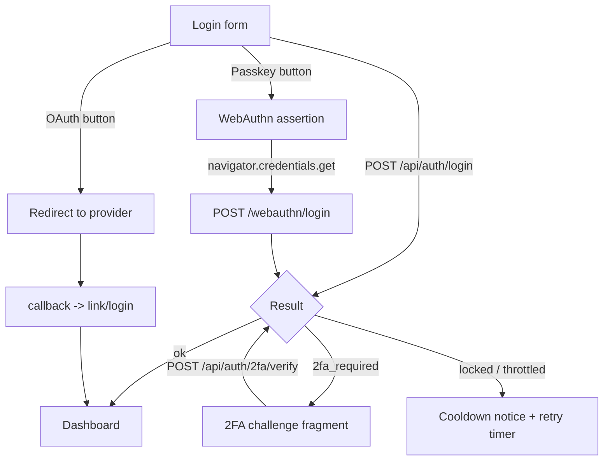

# Authentication

> GOCO CMS authentication — Redis-backed, per-coroutine sessions; Argon2id passwords; JWT for the API; OAuth2 social login; TOTP 2FA; WebAuthn passkeys; CSRF, login throttling, account lockout, email verification, password reset, and device/session management — all built on the ZealPHP runtime and swappable through a driver interface.

**Stability:** `stable` (core) · `beta` (passkeys, OAuth2 provider matrix)
**Package:** `gococms/core` → `packages/auth` (`Goco\Auth`)
**Depends on:** [MongoDB Data Layer](../architecture/database-mongodb.md) · [Caching, Queue & Realtime (Redis)](../architecture/caching-and-queue.md) · [Permission System](../architecture/permission-system.md) · [Routing](./routing.md)

Authentication is the front door of the Website Operating System. It answers one question — *who is making this request?* — and hands the answer to the [Permission System](../architecture/permission-system.md), which answers the next: *what may they do?* This document specifies the auth module end-to-end against the 17-section core-module standard.

---

## 1. Purpose

The Authentication module establishes and maintains **verified identity** for every actor that touches GOCO CMS — human users through the admin and website apps, machine clients through the API, and third-party integrations through OAuth2 and API tokens.

It exists to:

- Prove identity through multiple, composable **factors** (password, TOTP, WebAuthn, OAuth2) rather than one hard-wired scheme.
- Issue and validate **credentials** appropriate to the channel: server-rendered sessions for browsers, short-lived JWTs for the API.
- Store credential material safely (Argon2id, per-user secrets, hashed tokens) and never in plaintext.
- Resist the common attacks — credential stuffing, brute force, session fixation, CSRF, token replay — with defense in depth.
- Remain **multi-tenant**: identity is always resolved inside a `(workspace_id, website_id)` scope, never globally.
- Be **extensible**: new identity providers plug in through a driver interface without patching the core.

> **Note** Authentication is strictly *authN* — proving who you are. Everything about *what you can do* (roles, capabilities, RBAC/ABAC) lives in the [Permission System](../architecture/permission-system.md). Keep the two mentally separate; the auth module produces a trusted `Principal`, and the permission system consumes it.

---

## 2. Functional Specification

The module provides the following capabilities. Each maps to a service in [§8](#8-services) and endpoints in [§7](#7-api-design).

| # | Capability | Summary |
|---|------------|---------|
| F1 | **Registration** | Create a user, hash the password with Argon2id, send an email-verification token. |
| F2 | **Email verification** | Consume a single-use, time-boxed token; mark `email_verified_at`. |
| F3 | **Password login** | Verify Argon2id hash, enforce throttling and lockout, start a session. |
| F4 | **Session management** | Redis-backed, per-coroutine-isolated `$_SESSION`; rolling expiry; regeneration on privilege change. |
| F5 | **Logout** | Destroy the current session; optional "log out all devices". |
| F6 | **JWT issuance/validation** | Sign short-lived access tokens + rotating refresh tokens for the API. |
| F7 | **OAuth2 social login** | Google, GitHub, Microsoft, GitLab, Facebook, Apple; PKCE; account linking. |
| F8 | **2FA (TOTP)** | RFC 6238 authenticator apps; enrollment with QR; recovery codes. |
| F9 | **Passkeys (WebAuthn)** | FIDO2 registration and assertion; passwordless and step-up. |
| F10 | **CSRF protection** | Double-submit token via ZealPHP `Csrf` middleware for all state-changing form/JSON requests. |
| F11 | **Login throttling** | Redis sliding-window rate limit keyed by IP + identifier. |
| F12 | **Account lockout** | Progressive lock after N failed attempts; auto-unlock or admin unlock. |
| F13 | **Password reset** | Request → hashed token email → reset with re-authentication of active sessions. |
| F14 | **Device / session listing** | Enumerate active sessions with device metadata; revoke individually or all. |
| F15 | **Provider extensibility** | Register custom auth drivers implementing `AuthProviderInterface`. |

**Non-goals:** authorization decisions (Permission System), user-profile CRUD beyond credentials (handled by the admin app over the `users` collection), and transport encryption (terminated at [Traefik](../deployment/traefik.md) with automatic HTTPS).

---

## 3. Business Requirements

| ID | Requirement | Rationale | Priority |
|----|-------------|-----------|----------|
| BR-1 | No credential is ever stored or logged in plaintext. | Breach containment; compliance. | MUST |
| BR-2 | Passwords hashed with Argon2id using tuned memory/time cost. | Modern, GPU-resistant KDF. | MUST |
| BR-3 | Sessions expire and roll; server can revoke any session instantly. | Limit blast radius of stolen cookies. | MUST |
| BR-4 | Brute-force and credential-stuffing are throttled and locked out. | Automated-attack resistance. | MUST |
| BR-5 | 2FA available to all users; enforceable per role/workspace policy. | High-value account protection. | MUST |
| BR-6 | Passkeys supported as a first-class, passwordless factor. | Phishing-resistant auth. | SHOULD |
| BR-7 | API uses short-lived JWTs with refresh rotation and revocation. | Stateless scale + revocability. | MUST |
| BR-8 | All auth events are audited immutably. | Forensics, compliance. | MUST |
| BR-9 | Identity is tenant-scoped; a user in workspace A is invisible in B unless explicitly a member. | Multi-tenant isolation. | MUST |
| BR-10 | New identity providers add without core changes. | Ecosystem extensibility. | SHOULD |
| BR-11 | Auth flows degrade safely if Redis is briefly unavailable. | Availability. | SHOULD |

---

## 4. User Stories

- **As a visitor**, I can register with email + password and receive a verification email, so my account is provably mine.
- **As a returning user**, I can log in and stay logged in across page loads without re-entering my password, so the site feels seamless.
- **As a security-conscious user**, I can enable an authenticator-app TOTP or a passkey, so a stolen password alone cannot compromise me.
- **As a user on a shared computer**, I can see all my active sessions with device and location, and revoke the ones I do not recognize.
- **As a user who forgot my password**, I can request a reset link that expires quickly and invalidates my other sessions when used.
- **As an API developer**, I can exchange credentials for a short-lived access token and silently refresh it, so my integration never ships a long-lived secret.
- **As a website admin**, I can require 2FA for all `editor`-and-above roles in my workspace, so privileged accounts are hardened.
- **As a plugin author**, I can register a custom SSO provider (e.g. corporate SAML-over-OIDC) through the driver interface, so my customers use their existing identity.
- **As an owner**, I can review an immutable audit trail of every login, failure, and password change across my workspace.

---

## 5. Data Model (MongoDB Collections & Indexes)

Auth touches five collections. All docs carry the standard envelope (`_id`, `created_at`, `updated_at`, `deleted_at`, `version`, `created_by`, `updated_by`); tenant-scoped docs add `workspace_id`, `website_id`. See the [Data Model](../architecture/data-model.md) for the global conventions and the [MongoDB Data Layer](../architecture/database-mongodb.md) for the repository pattern.

### 5.1 `users`

```javascript
{
  _id: ObjectId,
  workspace_id: ObjectId,          // tenant scope
  email: "ada@example.com",         // normalized lowercase
  email_verified_at: ISODate,       // null until verified
  username: "ada",
  display_name: "Ada Lovelace",
  status: "active",                 // pending | active | locked | suspended | disabled
  credentials: {
    password: {
      hash: "$argon2id$v=19$m=65536,t=4,p=1$...",  // Argon2id, never plaintext
      algo: "argon2id",
      updated_at: ISODate,
      must_change: false
    },
    totp: {
      enabled: true,
      secret_enc: "<AES-256-GCM ciphertext>",       // encrypted at rest with app key
      confirmed_at: ISODate,
      recovery_codes: [                              // one-time, hashed
        { hash: "sha256:...", used_at: null }
      ]
    },
    webauthn: [
      {
        credential_id: "base64url...",
        public_key: "<COSE key>",
        sign_count: 42,
        transports: ["internal", "hybrid"],
        aaguid: "...",
        label: "iPhone Face ID",
        created_at: ISODate,
        last_used_at: ISODate
      }
    ]
  },
  oauth_identities: [
    { provider: "google", subject: "1174...", email: "ada@gmail.com", linked_at: ISODate }
  ],
  security: {
    failed_login_count: 0,
    locked_until: null,             // ISODate while locked
    last_login_at: ISODate,
    last_login_ip: "203.0.113.7",
    password_changed_at: ISODate,
    force_2fa: false
  },
  roles: [ { website_id: ObjectId, role: "editor" } ],  // consumed by Permission System
  created_at: ISODate, updated_at: ISODate, deleted_at: null,
  version: 3, created_by: ObjectId, updated_by: ObjectId
}
```

Indexes:

```javascript
db.users.createIndex({ workspace_id: 1, email: 1 }, { unique: true, partialFilterExpression: { deleted_at: null } })
db.users.createIndex({ workspace_id: 1, username: 1 }, { unique: true, partialFilterExpression: { deleted_at: null, username: { $type: "string" } } })
db.users.createIndex({ "oauth_identities.provider": 1, "oauth_identities.subject": 1 }, { unique: true, sparse: true })
db.users.createIndex({ "credentials.webauthn.credential_id": 1 }, { sparse: true })
db.users.createIndex({ status: 1, "security.locked_until": 1 })
```

A JSON-Schema validator enforces `email` format, `status` enum, and the presence of `credentials`. See the validator snippet in [§12](#12-security-model).

### 5.2 `sessions`

Session **records** are the source of truth for device management and audit. The live, hot session state lives in Redis (see [§13](#13-performance-strategy)); this collection is the durable, queryable mirror written on create/revoke.

```javascript
{
  _id: ObjectId,
  session_id: "sess_9f3c...",       // opaque, matches Redis key suffix
  user_id: ObjectId,
  workspace_id: ObjectId,
  website_id: ObjectId,
  device: {
    user_agent: "Mozilla/5.0 ...",
    platform: "macOS",
    browser: "Safari 18",
    ip: "203.0.113.7",
    approx_location: "Berlin, DE"    // from GeoIP, coarse
  },
  auth_level: "aal2",               // aal1 = password only, aal2 = + 2FA/passkey
  amr: ["pwd", "totp"],             // auth methods reference
  created_at: ISODate,
  last_seen_at: ISODate,
  expires_at: ISODate,
  revoked_at: null,
  revoke_reason: null               // logout | password_reset | admin | expired | all_devices
}
```

Indexes:

```javascript
db.sessions.createIndex({ session_id: 1 }, { unique: true })
db.sessions.createIndex({ user_id: 1, revoked_at: 1, last_seen_at: -1 })
db.sessions.createIndex({ expires_at: 1 }, { expireAfterSeconds: 0 })  // TTL sweep of expired mirrors
```

### 5.3 `auth_tokens`

> **Note** — `auth_tokens` is an **Authentication-module-owned collection** that extends the core [Data Model](../architecture/data-model.md) catalog (which documents module-owned collections). It is not part of the core enumerated set.

Single-use, hashed tokens for email verification, password reset, and refresh-token families.

```javascript
{
  _id: ObjectId,
  type: "password_reset",           // email_verify | password_reset | refresh | oauth_state
  user_id: ObjectId,
  token_hash: "sha256:...",         // only the hash is stored; raw token goes in the email/cookie
  family_id: "rt_fam_1a2b",         // refresh-token rotation family (null for others)
  meta: { ip: "203.0.113.7", ua: "..." },
  consumed_at: null,
  expires_at: ISODate,
  created_at: ISODate
}
```

```javascript
db.auth_tokens.createIndex({ type: 1, token_hash: 1 }, { unique: true })
db.auth_tokens.createIndex({ user_id: 1, type: 1, consumed_at: 1 })
db.auth_tokens.createIndex({ family_id: 1 })
db.auth_tokens.createIndex({ expires_at: 1 }, { expireAfterSeconds: 0 })  // TTL cleanup
```

### 5.4 `roles` / `audit_logs`

The `roles` collection is owned by the [Permission System](../architecture/permission-system.md); auth only reads it to attach role labels to a principal. Every auth event writes an immutable entry to `audit_logs` (append-only; see [§9](#9-events) and [§12](#12-security-model)).

---

## 6. Folder Structure

```text
packages/auth/                       # Goco\Auth
├── composer.json                    # gococms/auth
├── src/
│   ├── AuthManager.php              # facade entry: attempt(), user(), logout()
│   ├── Principal.php                # immutable authenticated identity value object
│   ├── Context.php                  # (workspace_id, website_id, request) resolution
│   ├── Session/
│   │   ├── RedisSessionStore.php    # per-coroutine, Redis-backed session state
│   │   ├── SessionManager.php       # create / rotate / revoke / list
│   │   └── SessionRecord.php
│   ├── Password/
│   │   ├── Argon2idHasher.php       # PASSWORD_ARGON2ID wrapper + needsRehash()
│   │   └── PasswordPolicy.php       # length, breach-list check, history
│   ├── Jwt/
│   │   ├── JwtIssuer.php            # sign access + refresh
│   │   ├── JwtVerifier.php          # verify, jti revocation check
│   │   └── RefreshRotator.php       # refresh-family rotation + reuse detection
│   ├── Providers/                   # driver interface + built-ins
│   │   ├── AuthProviderInterface.php
│   │   ├── PasswordProvider.php
│   │   ├── TotpProvider.php
│   │   ├── WebauthnProvider.php
│   │   └── OAuth2/
│   │       ├── OAuth2Provider.php   # generic OIDC/OAuth2 base
│   │       ├── GoogleProvider.php
│   │       ├── GithubProvider.php
│   │       └── MicrosoftProvider.php
│   ├── Throttle/
│   │   ├── LoginThrottle.php        # Redis sliding window
│   │   └── LockoutPolicy.php        # progressive account lock
│   ├── Verification/
│   │   ├── EmailVerifier.php
│   │   └── PasswordReset.php
│   ├── Middleware/
│   │   ├── AuthenticateMiddleware.php   # resolves Principal onto RequestContext
│   │   └── RequireAuthMiddleware.php    # 401 if no principal
│   └── Events/AuthEvents.php        # event name constants
├── config/auth.php                  # tunables (costs, TTLs, providers)
└── tests/                           # unit + integration (see §14)
```

Inside an app (e.g. `apps/admin/`), auth-facing routes live under `api/auth/*.php` (file-based REST) and login views under `template/auth/`.

---

## 7. API Design

Auth exposes both **file-based REST endpoints** (drop-in `api/auth/*.php`) and **route handlers** registered on the ZealPHP `App`. Handlers return `array` (auto-JSON), `string` (HTML view), or `int` (status). All state-changing routes pass through the `Csrf` middleware (browser) or accept a JWT (API).

### 7.1 Endpoint matrix

| Method | Path | Auth | Purpose |
|--------|------|------|---------|
| `POST` | `/api/auth/register` | public | Create account, send verify email. |
| `POST` | `/api/auth/verify-email` | public (token) | Consume email-verification token. |
| `POST` | `/api/auth/login` | public | Password login; may return `2fa_required`. |
| `POST` | `/api/auth/2fa/verify` | pending-2fa | Submit TOTP or recovery code. |
| `POST` | `/api/auth/logout` | session/JWT | Destroy current session. |
| `POST` | `/api/auth/logout-all` | session/JWT | Revoke all of the user's sessions. |
| `POST` | `/api/auth/password/forgot` | public | Send reset token. |
| `POST` | `/api/auth/password/reset` | public (token) | Set new password; revoke sessions. |
| `POST` | `/api/auth/token` | public | OAuth2-style: issue JWT access + refresh. |
| `POST` | `/api/auth/token/refresh` | refresh cookie | Rotate refresh, issue new access. |
| `GET`  | `/api/auth/oauth/{provider}` | public | Begin OAuth2 (PKCE) redirect. |
| `GET`  | `/api/auth/oauth/{provider}/callback` | public | Complete OAuth2, link/login. |
| `GET`  | `/api/auth/sessions` | session/JWT | List active devices/sessions. |
| `DELETE` | `/api/auth/sessions/{id}` | session/JWT | Revoke one session. |
| `POST` | `/api/auth/totp/enroll` | session (aal1) | Begin TOTP enrollment (QR + secret). |
| `POST` | `/api/auth/totp/confirm` | session (aal1) | Confirm enrollment with first code. |
| `POST` | `/api/auth/webauthn/register/options` | session | Get WebAuthn creation options. |
| `POST` | `/api/auth/webauthn/register` | session | Store new passkey credential. |
| `POST` | `/api/auth/webauthn/login/options` | public | Get WebAuthn assertion options. |
| `POST` | `/api/auth/webauthn/login` | public | Verify assertion, start session. |

### 7.2 Bootstrapping the auth routes (ZealPHP)

```php
<?php
require 'vendor/autoload.php';

use ZealPHP\App;
use ZealPHP\Middleware\CorsMiddleware;
use ZealPHP\Middleware\Csrf as CsrfMiddleware;
use Goco\Auth\AuthManager;
use Goco\Auth\Middleware\AuthenticateMiddleware;

App::superglobals(false);
$app = App::init('0.0.0.0', 8080);
App::mode(App::MODE_COROUTINE);

// Global middleware: CSRF for browsers, then resolve any existing principal.
$app->addMiddleware(new CorsMiddleware());
$app->addMiddleware(new CsrfMiddleware(exclude: ['#^/api/auth/token#', '#^/api/.*bearer#']));
$app->addMiddleware(new AuthenticateMiddleware()); // populates RequestContext principal

$app->route('/api/auth/login', function ($request, $response) {
    $creds = $request->json();                     // ['identifier' => ..., 'password' => ...]
    $result = AuthManager::attempt($creds, $request);

    return match ($result->status) {
        'ok'            => ['ok' => true, 'user' => $result->principal->public()],
        '2fa_required'  => $response->status(200)->json(['ok' => false, 'next' => '2fa', 'challenge' => $result->challengeId]),
        'locked'        => $response->status(423)->json(['ok' => false, 'error' => 'account_locked', 'retry_after' => $result->retryAfter]),
        'throttled'     => $response->status(429)->json(['ok' => false, 'error' => 'too_many_attempts', 'retry_after' => $result->retryAfter]),
        default         => $response->status(401)->json(['ok' => false, 'error' => 'invalid_credentials']),
    };
}, methods: ['POST']);
```

### 7.3 File-based REST example

`apps/admin/api/auth/sessions.php` — automatically served at `GET /api/auth/sessions`:

```php
<?php
use Goco\Auth\AuthManager;
use Goco\Auth\Session\SessionManager;

$principal = AuthManager::user();          // resolved by AuthenticateMiddleware
if (!$principal) { return 401; }

return SessionManager::listFor($principal->userId); // array -> auto-JSON
```

### 7.4 Response envelope

Successful auth responses set an `HttpOnly`, `Secure`, `SameSite=Lax` session cookie (browser) or return tokens (API):

```json
{
  "ok": true,
  "user": { "id": "665...", "email": "ada@example.com", "display_name": "Ada Lovelace", "auth_level": "aal2" },
  "access_token": "eyJhbGciOiJFUzI1NiIsInR5cCI6IkpXVCJ9...",
  "expires_in": 900,
  "token_type": "Bearer"
}
```

---

## 8. Services

The public surface is the `AuthManager` facade; behind it are focused services, each unit-testable and swappable.

| Service | Responsibility | Key methods |
|---------|----------------|-------------|
| `AuthManager` | Orchestrates a login attempt across providers, throttle, lockout, session start. | `attempt()`, `user()`, `logout()`, `logoutAll()` |
| `SessionManager` | Create/rotate/revoke sessions; back live state with Redis, mirror to Mongo. | `start()`, `rotate()`, `revoke()`, `listFor()` |
| `RedisSessionStore` | Per-coroutine session read/write in Redis with rolling TTL. | `read()`, `write()`, `destroy()` |
| `Argon2idHasher` | Hash/verify passwords; detect params needing rehash. | `hash()`, `verify()`, `needsRehash()` |
| `JwtIssuer` / `JwtVerifier` | Sign/verify ES256 access + refresh JWTs; `jti` revocation. | `issue()`, `verify()` |
| `RefreshRotator` | Rotate refresh families; detect reuse (theft) and revoke family. | `rotate()`, `detectReuse()` |
| `TotpProvider` | Enroll, confirm, and verify RFC 6238 codes; recovery codes. | `enroll()`, `confirm()`, `verify()` |
| `WebauthnProvider` | FIDO2 registration and assertion verification. | `creationOptions()`, `register()`, `assert()` |
| `OAuth2Provider` | Generic OIDC dance: authorize URL, PKCE, token exchange, userinfo. | `redirect()`, `callback()` |
| `LoginThrottle` | Redis sliding-window limiter keyed by IP + identifier. | `hit()`, `remaining()`, `clear()` |
| `LockoutPolicy` | Progressive account lock on repeated failure. | `recordFailure()`, `recordSuccess()`, `isLocked()` |
| `EmailVerifier` / `PasswordReset` | Issue and consume single-use hashed tokens; dispatch mail. | `issue()`, `consume()` |

### 8.1 A login attempt, end to end

```php
public function attempt(array $creds, Request $request): AuthResult
{
    $ctx        = Context::fromRequest($request);          // (workspace_id, website_id)
    $identifier = mb_strtolower(trim($creds['identifier']));

    // 1. Throttle by IP + identifier BEFORE touching the DB (cheap, Redis-only).
    if ($this->throttle->exceeded($request->ip(), $identifier)) {
        Hook::dispatch(AuthEvents::LOGIN_FAILED, ['reason' => 'throttled', 'identifier' => $identifier]);
        return AuthResult::throttled($this->throttle->retryAfter($request->ip(), $identifier));
    }

    $user = $this->users->findActiveByIdentifier($ctx->workspaceId, $identifier);

    // 2. Constant-time path even when the user does not exist (avoid enumeration).
    if ($user === null) {
        $this->hasher->fakeVerify();                       // burn equivalent time
        $this->throttle->hit($request->ip(), $identifier);
        Hook::dispatch(AuthEvents::LOGIN_FAILED, ['reason' => 'unknown_user', 'identifier' => $identifier]);
        return AuthResult::invalid();
    }

    // 3. Lockout gate.
    if ($this->lockout->isLocked($user)) {
        return AuthResult::locked($this->lockout->retryAfter($user));
    }

    // 4. Verify password (Argon2id).
    if (!$this->hasher->verify($creds['password'], $user->passwordHash())) {
        $this->throttle->hit($request->ip(), $identifier);
        $this->lockout->recordFailure($user);
        Hook::dispatch(AuthEvents::LOGIN_FAILED, ['reason' => 'bad_password', 'user_id' => $user->id]);
        return AuthResult::invalid();
    }

    // 5. Opportunistic rehash if cost params changed.
    if ($this->hasher->needsRehash($user->passwordHash())) {
        $this->users->updatePasswordHash($user->id, $this->hasher->hash($creds['password']));
    }

    $this->throttle->clear($request->ip(), $identifier);
    $this->lockout->recordSuccess($user);

    // 6. Second factor required?
    if ($this->requiresSecondFactor($user, $ctx)) {
        return AuthResult::twoFactorRequired($this->challenges->begin($user, $request));
    }

    // 7. Start session (aal1) and announce.
    $session = $this->sessions->start($user, $request, amr: ['pwd']);
    Hook::dispatch(AuthEvents::LOGIN, ['user_id' => $user->id, 'session_id' => $session->id]);

    return AuthResult::ok(Principal::fromUser($user, $session));
}
```

---

## 9. Events

Auth uses the [Event & Hook System](../architecture/event-hook-system.md). Actions follow `subject.verb[.tense]`; every action also writes an `audit_logs` entry through a global listener.

| Event (action) | When | Payload |
|----------------|------|---------|
| `user.registered` | Account created (pre-verification). | `user_id`, `email`, `workspace_id` |
| `user.email.verified` | Verification token consumed. | `user_id` |
| `user.login` | Session started successfully. | `user_id`, `session_id`, `amr`, `ip` |
| `user.login.failed` | Any failed attempt. | `reason`, `identifier`/`user_id`, `ip` |
| `user.logout` | Session destroyed. | `user_id`, `session_id`, `reason` |
| `user.2fa.enabled` / `user.2fa.disabled` | TOTP/passkey factor change. | `user_id`, `method` |
| `user.password.changed` | Password updated (reset or self-service). | `user_id`, `source` |
| `user.password.reset.requested` | Reset token issued. | `user_id`, `ip` |
| `user.account.locked` / `user.account.unlocked` | Lockout state change. | `user_id`, `until`, `reason` |
| `user.session.revoked` | A session revoked (single or all-devices). | `user_id`, `session_id`, `reason` |
| `auth.provider.linked` / `auth.provider.unlinked` | OAuth2 identity linked. | `user_id`, `provider` |

Emit and listen:

```php
use Goco\SDK\Hook;
use Goco\Auth\Events\AuthEvents;

// Emit (inside a service)
Hook::dispatch(AuthEvents::LOGIN, ['user_id' => $user->id, 'session_id' => $session->id]);

// Listen (in a plugin) — send a "new sign-in" email from an unrecognized device
Hook::listen('user.login', function (array $e) {
    if (SessionManager::isNewDevice($e['user_id'], $e['session_id'])) {
        Mailer::queue('new-device-signin', $e['user_id']);
    }
}, priority: 20);
```

> **Note** Sensitive events (`user.login.failed`, `user.password.changed`) are dispatched **async** via `Hook::dispatchAsync()` so audit persistence and notification mail never block the auth response path.

---

## 10. Hooks

Filters (`subject.noun`) let plugins reshape auth behavior without forking core. Registered through `Goco\SDK\Hook::filter()` / `Hook::apply()`.

| Filter | Value | Use |
|--------|-------|-----|
| `auth.providers` | ordered list of provider IDs | Add/reorder/remove login providers. |
| `auth.password.policy` | `PasswordPolicy` | Tighten min length, add breach-list, history depth. |
| `auth.session.ttl` | int seconds | Per-role or per-workspace session lifetime. |
| `auth.jwt.claims` | claims array | Inject custom claims into access tokens. |
| `auth.login.identifier` | normalized string | Accept username/phone as login identifier. |
| `auth.2fa.required` | bool | Force step-up for a given user/context. |
| `auth.throttle.limits` | `[window, max]` | Adjust rate-limit thresholds per route. |
| `auth.oauth.scopes` | scope array | Request extra OAuth2 scopes per provider. |
| `auth.redirect.after_login` | URL string | Route users to a custom landing page. |

```php
// Enforce 2FA for every editor-or-above across a workspace.
Hook::filter('auth.2fa.required', function (bool $required, $user, $ctx) {
    $privileged = ['owner','super-admin','website-admin','developer','editor'];
    foreach ($user->roles as $r) {
        if (in_array($r['role'], $privileged, true)) return true;
    }
    return $required;
}, priority: 10);

// Add a corporate SSO provider to the login screen.
Hook::filter('auth.providers', fn(array $p) => [...$p, 'acme-sso']);
```

Action hooks (`Hook::listen`) mirror the events in [§9](#9-events); the `.before`/`.after` convention applies to `session.start.before`, `session.start.after`, `password.verify.before`.

---

## 11. UI Architecture

Auth views are ZealPHP templates (`App::render`) enhanced with htmx fragments (`App::fragment`) for progressive, no-full-reload flows. The admin and website apps share a `packages/auth`-provided view set that themes can override.



- **Login screen** — password + a passkey button (`navigator.credentials.get`) + one button per enabled OAuth2 provider (rendered from the `auth.providers` filter).
- **2FA challenge** — swapped in as an htmx fragment; a TOTP input plus a "use a recovery code" toggle. Never navigates away, preserving the pending challenge.
- **Enrollment** — TOTP shows a QR (otpauth URI) rendered server-side; passkey enrollment calls `navigator.credentials.create` with options from `/webauthn/register/options`.
- **Session manager** — a table of active devices (browser, platform, IP, location, last seen) with per-row "Revoke" and a "Sign out everywhere" action.
- **CSRF** — every form embeds the token from the ZealPHP `Csrf` middleware (`<input type="hidden" name="_csrf" value="{{ csrf_token() }}">`); JSON clients send it in the `X-CSRF-Token` header.

Client JavaScript is deliberately thin: only the WebAuthn `navigator.credentials.*` calls and the htmx wiring. No SPA framework is required.

---

## 12. Security Model

Defense in depth across storage, transport, sessions, and tokens. See the cross-cutting [Security Model](../security/security-model.md) for platform-wide posture.

### 12.1 Credential storage

- **Passwords:** `password_hash($pw, PASSWORD_ARGON2ID, ['memory_cost' => 65536, 'time_cost' => 4, 'threads' => 1])`. Tunables live in `config/auth.php`; `needsRehash()` transparently upgrades on next login.
- **TOTP secrets & recovery codes:** secrets stored AES-256-GCM-encrypted with the app key (`APP_KEY`); recovery codes stored only as SHA-256 hashes, single-use.
- **Reset / verification tokens:** a 256-bit random token is emailed; only its SHA-256 hash is persisted in `auth_tokens`. Tokens are single-use and TTL-bounded.
- **WebAuthn:** public-key only; the private key never leaves the authenticator. `sign_count` is checked to detect cloned credentials.

### 12.2 Sessions

- Cookies are `HttpOnly; Secure; SameSite=Lax`; the value is an opaque, high-entropy `session_id` — no data rides in the cookie.
- **Session fixation** is prevented by rotating the `session_id` on every privilege change (login, 2FA completion, password change).
- Rolling TTL with an absolute cap; idle sessions expire in Redis, and the Mongo mirror is TTL-swept.
- Any session is revocable instantly (single, or all-devices on password reset).

### 12.3 JWT

- **ES256** (asymmetric) — the API verifies with the public key without holding the signing key.
- Access tokens are short-lived (default 15 min); refresh tokens rotate in a **family**. Presenting a consumed refresh token trips **reuse detection** and revokes the whole family (theft response).
- A `jti` deny-list in Redis allows immediate access-token revocation despite statelessness.

### 12.4 Brute force, enumeration, CSRF

- **Throttling:** Redis sliding window keyed by both client IP and login identifier; thresholds via `auth.throttle.limits`. Returns `429` with `Retry-After`.
- **Lockout:** progressive — after N failures the account locks for an exponentially growing window; `423 Locked` with retry hint; owner/admin can unlock.
- **Enumeration resistance:** identical responses and timing whether or not the account exists (`fakeVerify()` burns matching time); "forgot password" always returns success regardless of email existence.
- **CSRF:** ZealPHP `Csrf` middleware (double-submit token) guards all cookie-authenticated state-changing requests; bearer-token API routes are exempt (no ambient cookie authority).

### 12.5 Audit & validators

Every event in [§9](#9-events) appends to the immutable `audit_logs` collection (actor, action, target, IP, UA, result). The `users` validator rejects malformed docs at the database boundary:

```javascript
db.runCommand({ collMod: "users", validator: { $jsonSchema: {
  bsonType: "object",
  required: ["workspace_id", "email", "status", "credentials"],
  properties: {
    email:  { bsonType: "string", pattern: "^[^@\\s]+@[^@\\s]+\\.[^@\\s]+$" },
    status: { enum: ["pending","active","locked","suspended","disabled"] }
  }
}}, validationLevel: "strict" })
```

> **Warning** Never log request bodies on auth routes — they contain passwords and TOTP codes. The audit listener records *metadata only* (user id, IP, UA, result), never secrets.

---

## 13. Performance Strategy

GOCO runs on long-lived OpenSwoole workers, which reshapes auth performance versus classic PHP-FPM.

- **Sessions in Redis, per-coroutine isolated.** With `App::superglobals(false)`, ext-zealphp overrides `$_SESSION` so each coroutine gets an isolated view; the backing store is Redis via `RedisSessionStore`. Reads/writes are O(1) network hops from a **pooled** connection — no file locking, no per-request disk I/O. See [Caching, Queue & Realtime](../architecture/caching-and-queue.md).
- **Cheap checks first.** A login attempt hits the Redis throttle counter *before* any Mongo query, so floods are shed at the cheapest layer.
- **Argon2id is intentionally expensive** (~50–100 ms). To keep this off the request-critical path from starving workers, hashing runs inside a coroutine so the scheduler can serve other requests while one blocks; cost params are tuned in `config/auth.php` to your hardware.
- **Connection pooling.** Redis and Mongo clients are pooled at worker start (`App::onWorkerStart`); no reconnect per request.
- **JWT verification is CPU-only** (ES256, no DB), with a Redis `jti` deny-list checked only when revocation is in play.
- **Session write coalescing.** `last_seen_at` updates are throttled (e.g. at most once per 60 s per session) to avoid a Mongo write on every request; the hot value lives in Redis.
- **Warm data in shared memory.** Rarely-changing policy (throttle limits, provider list) is cached in `\ZealPHP\Store` (OpenSwoole\Table) across workers and refreshed on `settings` change via `Store::publish` / `App::subscribe`.

Target budgets: password login < 150 ms p95 (dominated by Argon2id); session resolution on an authenticated request < 3 ms p95; JWT verify < 1 ms.

---

## 14. Testing Strategy

See [Testing Strategy](../community/testing-strategy.md) for the platform harness. Auth-specific coverage:

| Layer | Focus | Tooling |
|-------|-------|---------|
| **Unit** | Argon2id verify/rehash, TOTP window (±1 step), JWT sign/verify, refresh rotation & reuse detection, throttle window math, token hashing. | PHPUnit, frozen clock. |
| **Integration** | Full login (ok / bad password / unknown user / locked / throttled / 2fa_required), password reset, email verify, session revoke. | Ephemeral Mongo + Redis via `docker/`. |
| **Contract** | Every `AuthProviderInterface` implementation passes the shared provider test suite. | PHPUnit trait `ProviderContractTest`. |
| **Security** | Enumeration timing equality, session-fixation rotation, CSRF rejection, JWT `alg=none` rejection, refresh-reuse family revocation. | Custom assertions. |
| **E2E** | Browser login, TOTP challenge, passkey register+login (virtual authenticator), OAuth2 callback (mock provider). | Playwright + WebAuthn virtual authenticator. |
| **Load** | Login and JWT-verify throughput under coroutine concurrency; throttle correctness under burst. | k6 against a compose stack. |

```php
public function test_reused_refresh_token_revokes_family(): void
{
    [$access, $refresh] = $this->issuer->issue($this->user);
    $rotated = $this->rotator->rotate($refresh);          // legitimate rotation
    $this->expectException(RefreshReuseException::class);
    $this->rotator->rotate($refresh);                     // reuse of the old token -> family revoked
    $this->assertTrue($this->rotator->familyRevoked($rotated->familyId));
}
```

Mail flows are asserted against **Mailpit** in the dev/CI compose stack (verification and reset emails are captured and parsed).

---

## 15. Extension Points

Authentication is a driver-based subsystem. The core ships providers; anyone can add more.

### 15.1 The provider interface

```php
namespace Goco\Auth\Providers;

use Goco\Auth\{Context, Principal};
use ZealPHP\Http\Request;

interface AuthProviderInterface
{
    /** Stable id, e.g. "password", "google", "acme-sso". */
    public function id(): string;

    /** Attempt to authenticate; return a Principal or null (no match). */
    public function authenticate(array $input, Context $ctx, Request $request): ?Principal;

    /** Assurance level this provider yields: "aal1" | "aal2". */
    public function assuranceLevel(): string;

    /** Optional interactive redirect (OAuth2); null for direct providers. */
    public function beginRedirect(Context $ctx, Request $request): ?string;
}
```

### 15.2 Registering a custom provider from a plugin

```php
use Goco\SDK\{Plugin, Hook};
use Acme\Sso\AcmeSsoProvider;

Plugin::register('acme-sso', [
    'name'    => 'ACME Corporate SSO',
    'version' => '1.0.0',
]);

Plugin::boot('acme-sso');

Hook::listen('core.boot', function () {
    Goco\Auth\AuthManager::extend(new AcmeSsoProvider(
        clientId:     config('acme.client_id'),
        discoveryUrl: config('acme.oidc_discovery'),
    ));
});

// Surface it on the login screen.
Hook::filter('auth.providers', fn(array $p) => [...$p, 'acme-sso']);
```

Other extension surfaces:

- **Password policy** — swap `PasswordPolicy` via `auth.password.policy` (e.g. HaveIBeenPwned range check).
- **Session store** — implement `SessionStoreInterface` for an alternative backend (default Redis).
- **JWT claims/signer** — inject claims via `auth.jwt.claims`; provide a custom signer for HSM-backed keys.
- **Second factors** — implement `AuthProviderInterface` at `aal2` to add WebAuthn-alternatives (e.g. hardware OTP).

---

## 16. Upgrade Strategy

GOCO follows [Semantic Versioning](../roadmap.md) and Conventional Commits; auth is pre-1.0 but its facade is treated as stable.

- **Password params** upgrade transparently: raising `memory_cost`/`time_cost` in `config/auth.php` triggers `needsRehash()` on next successful login — no migration, no forced reset.
- **Schema changes** to `users`/`sessions` ship as idempotent, versioned migrations in `scripts/` and run at deploy; JSON-Schema validators are relaxed → backfilled → tightened across a two-release window.
- **JWT signing-key rotation** is dual-key: the verifier accepts both `kid`s during an overlap window; refresh tokens re-issue under the new key.
- **Session format** carries a `version` field; a bumped format keeps reading old sessions until they expire naturally (no mass logout).
- **Deprecations** (e.g. retiring a weak OAuth2 provider) are announced one minor version ahead, emit `deprecated` warnings in logs, and are removed only on a minor bump pre-1.0 (major post-1.0).
- **Breaking changes** to `AuthProviderInterface` are gated behind a compatibility shim for one release so downstream providers migrate without a hard break.

Rollout is zero-downtime under Docker: workers drain gracefully (ZealPHP `restart`), and Traefik keeps routing to healthy replicas during a rolling deploy. See [Deployment Guide](../deployment/deployment-guide.md).

---

## 17. Future Roadmap

| Item | Target | Notes |
|------|--------|-------|
| **Passwordless-first UX** | beta → stable | Promote passkeys to the default factor with password as fallback. |
| **SAML 2.0 bridge** | planned | Enterprise SSO via a SAML-over-OIDC adapter provider. |
| **SCIM 2.0 provisioning** | planned | Automated user lifecycle from IdPs (Okta, Entra ID). |
| **Risk-based / adaptive auth** | exploratory | Step-up 2FA driven by device, geo-velocity, and IP reputation signals. |
| **Verifiable credentials / DID** | exploratory | Decentralized identity for portable, self-sovereign login. |
| **Passkey device sync UX** | planned | Cross-device hybrid passkey flows and management UI polish. |
| **AI anomaly detection** | exploratory | Feed auth events to the [AI Platform](./ai-platform.md) to flag credential-stuffing patterns in real time. |
| **Delegated/service identities** | planned | First-class machine identities with scoped, rotating credentials for integrations. |

---

## Related

- [Permission System (RBAC + ABAC)](../architecture/permission-system.md) — what an authenticated principal is allowed to do.
- [Routing](./routing.md) — how auth routes and middleware attach to the ZealPHP `App`.
- [Caching, Queue & Realtime (Redis)](../architecture/caching-and-queue.md) — session store, throttle, and `jti` deny-list backend.
- [MongoDB Data Layer](../architecture/database-mongodb.md) — repository pattern for `users`, `sessions`, `auth_tokens`.
- [Data Model (Collections & Indexes)](../architecture/data-model.md) — global document envelope and index conventions.
- [Event & Hook System](../architecture/event-hook-system.md) — the dispatch/filter machinery auth builds on.
- [Security Model](../security/security-model.md) — platform-wide security posture.
- [ZealPHP Foundation](../architecture/zealphp-foundation.md) — coroutine model, middleware, superglobal isolation.
- [Multi-Tenancy](../architecture/multi-tenancy.md) — how `(workspace_id, website_id)` scopes identity.
- [Traefik Reverse Proxy](../deployment/traefik.md) — HTTPS termination and security headers in front of auth.
- [Hook SDK](../sdk/hook-sdk.md) · [Plugin SDK](../sdk/plugin-sdk.md) — registering listeners, filters, and custom providers.
- [Configuration](../getting-started/configuration.md) — where `config/auth.php` and secrets are resolved.
- [Documentation Home](../README.md)
