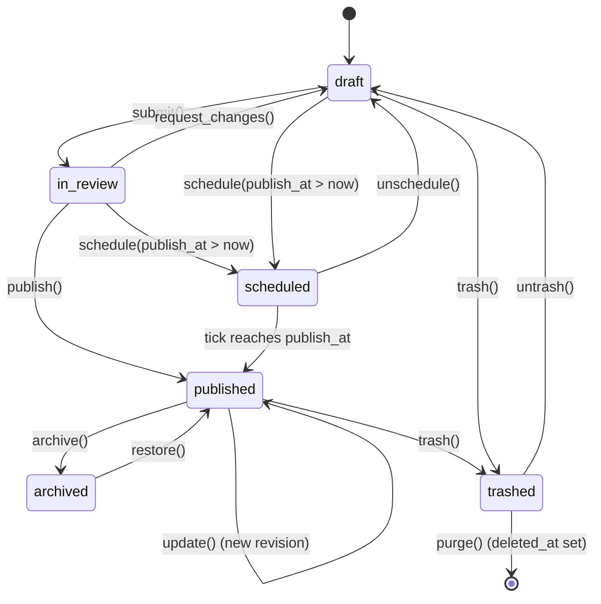
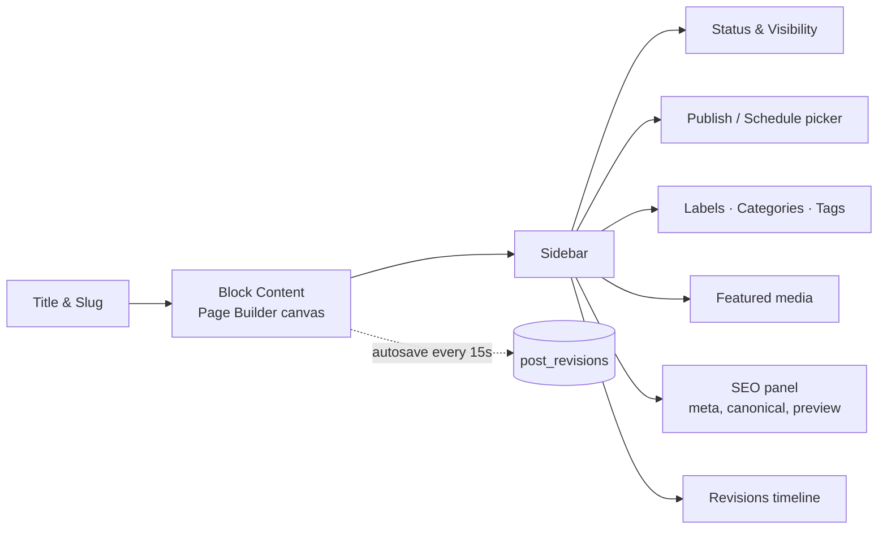

# Blog Engine

> The Blog Engine turns GOCO CMS into a full-featured publishing platform — Blogger-class posts, static pages, labels, threaded comments, feeds, scheduled publishing, import/export, and first-class SEO — built on ZealPHP coroutines, MongoDB, and Redis.

**Stability:** `beta` · **Package:** `gococms/core` (module `Goco\Blog`) · **Namespace:** `Goco\Blog`

The Blog Engine is the content-authoring heart of GOCO CMS. It re-imagines the classic Blogger feature set — posts, static pages, labels, comments, RSS/Atom feeds, scheduled publishing, reading lists, and one-click import/export — and extends it with modern primitives: MongoDB-backed revisions, Redis-coordinated schedulers, per-coroutine rendering, and deep integration with the [SEO](../architecture/search.md) and [multi-tenancy](../architecture/multi-tenancy.md) layers.

---

## 1. Purpose

The Blog Engine provides the domain logic and storage model for **time-ordered editorial content** and its supporting cast. Where the [Page Builder](./page-builder.md) governs the visual composition of a single page and the [Widget Engine](./widget-engine.md) governs reusable UI fragments, the Blog Engine owns the *content lifecycle*: draft → review → schedule → publish → syndicate → archive.

Concretely it is responsible for:

- **Posts** — dated, authored, taxonomy-tagged articles with full revision history.
- **Static Pages** — untimed hierarchical content (About, Contact, Legal) that share the same rendering pipeline but never appear in chronological feeds.
- **Labels & Taxonomies** — Blogger-style flat labels plus hierarchical categories and free-form tags, all expressed through `taxonomies`, `terms`, and `term_relationships`.
- **Comments** — threaded discussion with moderation queues, spam control, and rate limiting.
- **Feeds** — RSS 2.0 and Atom 1.0 syndication, per-label and per-author feeds, WebSub (PubSubHubbub) pings.
- **Scheduled publishing** — future-dated posts released by a distributed, lock-guarded timer.
- **Reading lists** — user-followed blogs and a merged "following" feed.
- **Statistics** — pageview and engagement counters surfaced through the analytics hook bus.
- **Import / Export** — round-trip with Blogger XML (Atom export), WordPress WXR, and Markdown front-matter bundles.

> **Note**
> The Blog Engine is *tenant-scoped*. Every post, page, taxonomy, and comment carries `workspace_id` and `website_id`; a single MongoDB deployment serves many blogs across many custom domains. See [Multi-Tenancy](../architecture/multi-tenancy.md).

---

## 2. Functional Specification

### 2.1 Content types

| Type | Collection | Timed | Hierarchical | Feeds | Comments | Revisions |
|------|-----------|:----:|:----:|:----:|:----:|:----:|
| Post | `posts` | Yes | No | Yes | Yes | `post_revisions` |
| Page | `pages` | No | Yes (`parent_id`) | No | Optional | `page_revisions` |

Posts and pages share a common editor, rendering path, and SEO surface; they differ in listing semantics (posts are chronological; pages are structural) and in feed eligibility.

### 2.2 Post lifecycle (state machine)



Legal transitions are enforced in `PostService::transition()` and guarded by capabilities (`posts.publish` gates `publish`/`schedule`, `posts.update` gates edits). Every transition emits an event (see §9).

### 2.3 Labels, categories, and tags

The engine ships three built-in taxonomies seeded per website:

- `label` — flat, Blogger-compatible, unlimited per post.
- `category` — hierarchical (`parent` term references), typically one primary per post.
- `tag` — flat, free-form, folksonomy-style.

Additional taxonomies can be registered by plugins via `Taxonomy::register()` (thin wrapper over the [Database Builder](./database-builder.md)). Terms are shared per website; `term_relationships` joins content to terms with an `order` field for manual sorting.

### 2.4 Comments

- Threaded to a configurable depth (`comments.max_depth`, default 5) via `parent_id` + materialized `path` array.
- Statuses: `pending`, `approved`, `spam`, `trash`.
- Moderation modes: `open`, `moderated` (first comment held), `hold_all`, `closed`, `members_only`.
- Spam control: honeypot field, time-to-submit heuristic, Redis rate limit, Akismet-compatible provider interface, and a Bayesian local classifier fallback.
- Notifications to post author and subscribed thread participants via the [queue](../architecture/caching-and-queue.md).

### 2.5 Feeds

- `/{blog}/feed` and `/{blog}/feed/atom` — site-wide RSS/Atom.
- `/{blog}/label/{slug}/feed` — per-label.
- `/{blog}/author/{handle}/feed` — per-author.
- `/{blog}/comments/feed` — recent comments.
- Feeds are capped at `feeds.items` (default 25), cached in Redis, and revalidated via the ETag middleware. On publish, a WebSub ping notifies subscribed hubs.

### 2.6 Scheduled publishing

Future-dated posts sit in `scheduled` state. A cluster-wide timer (`App::tick`) runs every 30s on exactly one worker (guarded by a Redis lock) and promotes any post whose `publish_at <= now()`. Promotion enqueues a durable job so heavy post-publish work (feed rebuild, WebSub, cache purge, search index) survives worker restarts. See §8.4.

### 2.7 Reading list / following

Authenticated users follow blogs (`follows` sub-documents on the user, or a lightweight `follows` collection). The merged **following feed** aggregates the latest posts from followed blogs via a MongoDB aggregation with a per-user Redis cache.

### 2.8 Statistics

Every rendered post emits `post.viewed` and increments an atomic counter (`\ZealPHP\Counter`) flushed to MongoDB in batches. Aggregated views, unique reads, and engagement are exposed to the [Analytics](../architecture/search.md) module through the `analytics.event` hook.

### 2.9 Import / Export

| Format | Import | Export | Notes |
|--------|:----:|:----:|-------|
| Blogger XML (Atom export) | Yes | Yes | Preserves labels, comments, published/updated dates |
| WordPress WXR | Yes | Yes | Maps categories→`category`, tags→`tag`, post_meta→`meta` |
| Markdown + front-matter | Yes | Yes | YAML front-matter; media rewritten to storage URLs |

Imports run as chunked coroutine jobs with a resumable cursor; exports stream via `App::renderStream()` so multi-gigabyte archives never buffer in memory.

### 2.10 Custom domains & SEO

Each website may bind one or more custom domains (`domains` collection); Traefik routes them to the shared `gococms` service (see [Traefik](../deployment/traefik.md)). Canonical URLs, `<meta>` tags, Open Graph, JSON-LD `Article`/`BlogPosting`, and sitemap entries are produced through the SEO integration in §8.6.

---

## 3. Business Requirements

| # | Requirement | Priority | Rationale |
|---|-------------|----------|-----------|
| BR-1 | Authors can create, edit, and publish posts without touching code | Must | Core value proposition |
| BR-2 | Publishing is transactional — a post never appears half-indexed | Must | Data integrity across `posts` + search + feeds |
| BR-3 | Every edit is recoverable via revision history | Must | Editorial safety, audit compliance |
| BR-4 | Comments are spam-resistant and moderatable | Must | Community trust |
| BR-5 | Content is discoverable — feeds, sitemaps, canonical SEO | Must | Organic growth |
| BR-6 | Posts can be scheduled and reliably auto-publish in a cluster | Must | Editorial planning |
| BR-7 | Full data portability in and out (no lock-in) | Must | MIT / open-source ethos |
| BR-8 | Multiple blogs run isolated on one deployment | Must | Multi-tenant SaaS + self-host parity |
| BR-9 | Feeds and listings serve sub-50ms cached | Should | Reader experience, cost |
| BR-10 | Third parties can extend post types, taxonomies, and moderation | Should | Ecosystem / "Website OS" thesis |

---

## 4. User Stories

- **As an author**, I want to save drafts and see a live preview so I can iterate before publishing.
- **As an author**, I want to schedule a post for next Monday 09:00 so it goes live while I'm away.
- **As an editor**, I want a review queue so I approve author submissions before they publish.
- **As a reader**, I want an RSS feed of a specific label so I only follow topics I care about.
- **As a reader**, I want to post a threaded reply and be notified when someone answers me.
- **As a moderator**, I want a bulk spam view so I clear the queue in seconds.
- **As a website-admin**, I want to import my old Blogger/WordPress export and keep permalinks and comments.
- **As an SEO-manager**, I want canonical tags and JSON-LD emitted automatically so posts rank.
- **As a developer**, I want to register a custom taxonomy and a moderation rule via the SDK without forking core.
- **As an owner**, I want each blog on its own custom domain, isolated from other tenants.

---

## 5. Data Model (MongoDB Collections & Indexes)

All collections carry the standard envelope: `_id`, `created_at`, `updated_at`, `deleted_at` (soft delete), `version`, `created_by`, `updated_by`. Tenant-scoped collections add `workspace_id`, `website_id`. See [Data Model](../architecture/data-model.md) for global conventions.

### 5.1 `posts`

```json
{
  "_id": "ObjectId",
  "workspace_id": "ObjectId",
  "website_id": "ObjectId",
  "type": "post",
  "title": "Shipping GOCO 0.7",
  "slug": "shipping-goco-0-7",
  "excerpt": "What changed in the 0.7 cycle...",
  "content": { "format": "blocks", "blocks": [ /* Page Builder tree */ ] },
  "content_html": "<p>...</p>",
  "status": "scheduled",
  "visibility": "public",
  "publish_at": "ISODate(2026-07-21T09:00:00Z)",
  "published_at": null,
  "author_id": "ObjectId",
  "coauthors": ["ObjectId"],
  "featured_media_id": "ObjectId",
  "terms": { "label": ["release","engineering"], "category": ["news"], "tag": ["openswoole"] },
  "comment_policy": "moderated",
  "comment_count": 0,
  "meta": { "reading_time": 6 },
  "seo": {
    "meta_title": "Shipping GOCO 0.7 — GOCO CMS",
    "meta_description": "...",
    "canonical": null,
    "og_image_id": "ObjectId",
    "robots": "index,follow"
  },
  "stats": { "views": 0, "unique": 0 },
  "version": 4
}
```

Validated by a JSON-Schema validator (`status` enum, `type` enum, required `title`/`slug`).

Indexes:

```javascript
db.posts.createIndex({ website_id: 1, status: 1, published_at: -1 })          // listing feed
db.posts.createIndex({ website_id: 1, slug: 1 }, { unique: true, partialFilterExpression: { deleted_at: null } })
db.posts.createIndex({ website_id: 1, "terms.label": 1, published_at: -1 })    // label archives
db.posts.createIndex({ website_id: 1, author_id: 1, published_at: -1 })        // author archives
db.posts.createIndex({ status: 1, publish_at: 1 })                             // scheduler scan (global)
db.posts.createIndex({ title: "text", excerpt: "text", content_html: "text" }, { name: "post_fulltext" })
```

### 5.2 `post_revisions`

```json
{
  "_id": "ObjectId",
  "post_id": "ObjectId",
  "website_id": "ObjectId",
  "version": 3,
  "title": "...",
  "content": { "...": "snapshot" },
  "diff_summary": "+412 / -87 chars",
  "author_id": "ObjectId",
  "created_at": "ISODate(...)"
}
```

```javascript
db.post_revisions.createIndex({ post_id: 1, version: -1 })
db.post_revisions.createIndex({ website_id: 1, created_at: -1 })
```

Revisions are append-only immutable snapshots; the live `posts` doc always holds the current `version`. Pages use the identical shape in `page_revisions`.

### 5.3 `taxonomies`

```json
{ "_id": "ObjectId", "website_id": "ObjectId", "name": "label", "label": "Labels",
  "hierarchical": false, "public": true, "meta_box": "cloud" }
```

```javascript
db.taxonomies.createIndex({ website_id: 1, name: 1 }, { unique: true })
```

### 5.4 `terms`

```json
{ "_id": "ObjectId", "website_id": "ObjectId", "taxonomy": "category",
  "name": "News", "slug": "news", "parent": null, "count": 42, "description": "" }
```

```javascript
db.terms.createIndex({ website_id: 1, taxonomy: 1, slug: 1 }, { unique: true })
db.terms.createIndex({ website_id: 1, taxonomy: 1, parent: 1 })
```

### 5.5 `term_relationships`

```json
{ "_id": "ObjectId", "website_id": "ObjectId", "object_id": "ObjectId",
  "object_type": "post", "term_id": "ObjectId", "taxonomy": "label", "order": 0 }
```

```javascript
db.term_relationships.createIndex({ term_id: 1, object_type: 1 })
db.term_relationships.createIndex({ object_id: 1, taxonomy: 1 })
```

> **Note**
> The engine denormalizes labels/tags into `posts.terms` for read-path speed *and* maintains `term_relationships` as the normalized source of truth. Both are updated inside the same MongoDB transaction, keeping the `terms.count` accurate.

### 5.6 `comments`

```json
{
  "_id": "ObjectId",
  "workspace_id": "ObjectId",
  "website_id": "ObjectId",
  "post_id": "ObjectId",
  "parent_id": "ObjectId",
  "path": ["ObjectId(root)", "ObjectId(parent)"],
  "depth": 2,
  "author": { "user_id": "ObjectId", "name": "Ada", "email": "ada@example.com", "url": "", "ip_hash": "sha256..." },
  "content": "Great write-up!",
  "content_html": "<p>Great write-up!</p>",
  "status": "pending",
  "spam_score": 0.12,
  "user_agent": "Mozilla/5.0...",
  "likes": 0,
  "version": 1
}
```

```javascript
db.comments.createIndex({ post_id: 1, status: 1, created_at: 1 })   // thread render
db.comments.createIndex({ website_id: 1, status: 1, created_at: -1 }) // moderation queue
db.comments.createIndex({ "author.ip_hash": 1, created_at: -1 })     // rate-limit / spam
db.comments.createIndex({ path: 1 })                                 // subtree ops
```

---

## 6. Folder Structure

The engine lives in `packages/blog-engine` and is wired into the `apps/website`, `apps/admin`, and `apps/api` apps. (Repository conventions: see [Project Structure](../getting-started/project-structure.md).)

```
packages/blog-engine/
├── src/
│   ├── Post/
│   │   ├── PostService.php
│   │   ├── PostRepository.php
│   │   ├── RevisionService.php
│   │   └── PostStatus.php
│   ├── Page/
│   │   └── PageService.php
│   ├── Taxonomy/
│   │   ├── TaxonomyRegistry.php
│   │   ├── TermRepository.php
│   │   └── TermRelationshipService.php
│   ├── Comment/
│   │   ├── CommentService.php
│   │   ├── ModerationPipeline.php
│   │   └── Spam/
│   │       ├── SpamProviderInterface.php
│   │       ├── AkismetProvider.php
│   │       ├── BayesianProvider.php
│   │       └── HoneypotGuard.php
│   ├── Feed/
│   │   ├── FeedBuilder.php
│   │   ├── RssRenderer.php
│   │   ├── AtomRenderer.php
│   │   └── WebSubClient.php
│   ├── Schedule/
│   │   ├── Scheduler.php          # App::tick + Redis lock
│   │   └── PublishJob.php
│   ├── Reading/
│   │   └── FollowingService.php
│   ├── Stats/
│   │   └── ViewCounter.php
│   ├── Transfer/
│   │   ├── Import/{BloggerImporter,WxrImporter,MarkdownImporter}.php
│   │   └── Export/{BloggerExporter,WxrExporter,MarkdownExporter}.php
│   └── Seo/
│       └── PostSeoProvider.php
├── config/blog.php
├── resources/schema/{posts,comments,terms}.json   # JSON-Schema validators
└── tests/
apps/website/
├── api/blog/                       # file-based REST (auto GET routes)
│   ├── posts/index.php             # GET /api/blog/posts
│   └── posts/{slug}.php
└── template/blog/{list,single,archive,feed-rss,feed-atom}.php
apps/admin/src/Blog/                # editor + moderation UI controllers
```

---

## 7. API Design

Two surfaces: **file-based REST** (drop a `.php` under `api/`, auto-mapped to `GET`) for read paths, and **explicit `$app->route()`** registrations for mutating verbs. Handlers return `array` (auto-JSON), `string`, `int`, or a `Generator` (streaming). See [Routing](./routing.md) and the [API Reference](../reference/api-reference.md).

### 7.1 Public read routes

| Method | Path | Handler | Notes |
|--------|------|---------|-------|
| GET | `/api/blog/posts` | `posts/index.php` | Paginated, filter by `label`, `author`, `q` |
| GET | `/api/blog/posts/{slug}` | `posts/{slug}.php` | Single post + resolved terms |
| GET | `/api/blog/comments/{postId}` | route | Threaded tree |
| GET | `/{blog}/feed` · `/feed/atom` | route + `sse`-less generator | Cached RSS/Atom |
| GET | `/api/blog/labels` | `labels/index.php` | Label cloud with counts |

### 7.2 Mutating routes (registered in the plugin/app bootstrap)

```php
use ZealPHP\App;
use Goco\Blog\Post\PostService;
use Goco\Blog\Comment\CommentService;

$app->route('/api/blog/posts', function ($request, $response, PostService $posts) {
    // POST create — capability check happens in the service
    $dto = $request->json();
    $post = $posts->create($dto, actor: $request->user());
    $response->status(201);
    return $post->toArray();
}, methods: ['POST']);

$app->route('/api/blog/posts/{id}/publish', function ($id, $request, PostService $posts) {
    return $posts->transition($id, to: 'published', actor: $request->user())->toArray();
}, methods: ['POST']);

$app->route('/api/blog/posts/{id}/schedule', function ($id, $request, PostService $posts) {
    $when = new \DateTimeImmutable($request->input('publish_at'));
    return $posts->schedule($id, $when, actor: $request->user())->toArray();
}, methods: ['POST']);

$app->route('/api/blog/comments', function ($request, $response, CommentService $comments) {
    $result = $comments->submit($request->json(), $request);   // runs moderation pipeline
    $response->status($result->status === 'approved' ? 201 : 202);
    return $result->toArray();
}, methods: ['POST']);
```

> **Tip**
> Mutating routes are protected by the `Csrf` and `RateLimit` middleware. Register them once in the app bootstrap:
> ```php
> $app->addMiddleware(new \ZealPHP\Middleware\Csrf());
> $app->addMiddleware(new \ZealPHP\Middleware\RateLimit(key: 'blog.write', max: 60, per: 60));
> ```

### 7.3 Feed handler (Generator streaming + Redis cache)

```php
$app->route('/{blog}/feed', function ($blog, $request, $response, \Goco\Blog\Feed\FeedBuilder $feeds) {
    $response->header('Content-Type', 'application/rss+xml; charset=utf-8');
    // FeedBuilder::stream() yields cached chunks; ETag middleware handles 304s
    return $feeds->stream($blog, format: 'rss', request: $request);
});
```

---

## 8. Services

Services are plain PHP classes resolved by the [Service Container](../architecture/service-container.md) and injected by parameter name into route handlers.

### 8.1 `PostService`

Owns creation, updates, revisions, and state transitions. Publishing wraps a MongoDB **multi-document transaction** so the post, term counts, and relationship rows commit atomically.

```php
namespace Goco\Blog\Post;

use Goco\SDK\Hook;
use Goco\Database\Repository;

final class PostService
{
    public function __construct(
        private PostRepository $posts,
        private RevisionService $revisions,
        private \Goco\Blog\Taxonomy\TermRelationshipService $terms,
        private \Goco\Auth\Authorizer $auth,
    ) {}

    public function transition(string $id, string $to, object $actor): Post
    {
        $post = $this->posts->findOrFail($id);
        $this->auth->require($actor, $to === 'published' ? 'posts.publish' : 'posts.update', $post);

        // Filter lets plugins veto/mutate the target state.
        $to = Hook::apply('post.status', $to, $post, $actor);

        Hook::dispatch('content.publishing', $post);           // pre, cancellable
        $this->posts->transaction(function () use ($post, $to) {
            $this->posts->setStatus($post, $to);
            if ($to === 'published') {
                $post->published_at ??= now();
                $this->terms->syncCounts($post);
            }
        });
        Hook::dispatch('content.published', $post);            // post

        return $post;
    }
}
```

### 8.2 `RevisionService`

Snapshots the pre-edit document into `post_revisions` on every update, prunes beyond `revisions.keep` (default 30), and computes a `diff_summary`. Restore copies a revision back into the live doc as a new version.

### 8.3 `CommentService` + `ModerationPipeline`

`submit()` runs an ordered pipeline of guards, each returning `pass | hold | reject`:

1. `HoneypotGuard` — hidden field must be empty; sub-2s submissions rejected.
2. `RateLimitGuard` — Redis token bucket keyed on `ip_hash` + `post_id`.
3. `SpamProviderInterface` — Akismet (network) or Bayesian (local) scores `0.0–1.0`.
4. `PolicyGuard` — applies the post's `comment_policy`.

The resolved status (`approved`/`pending`/`spam`) is persisted; `comment.posted` fires on any successful save.

### 8.4 `Scheduler` (distributed timer)

```php
namespace Goco\Blog\Schedule;

use ZealPHP\App;
use Goco\Cache\Lock;         // Redis SET NX PX
use Goco\Queue\Queue;

final class Scheduler
{
    public static function boot(App $app, Lock $lock, Queue $queue): void
    {
        App::onWorkerStart(function ($server, $wid) use ($lock, $queue) {
            App::tick(30_000, function () use ($lock, $queue) {
                // Only one worker across the whole cluster wins the lease.
                if (!$lock->acquire('blog:scheduler', ttl: 25_000)) {
                    return;
                }
                try {
                    $due = \Goco\Blog\Post\PostRepository::dueForPublish(now());
                    foreach ($due as $postId) {
                        $queue->push(new PublishJob($postId));   // durable, idempotent
                    }
                } finally {
                    $lock->release('blog:scheduler');
                }
            });
        });
    }
}
```

`PublishJob::handle()` re-checks `status === 'scheduled' && publish_at <= now`, then calls `PostService::transition($id, 'published')`. Idempotent by design — a redelivered job is a no-op.

> **Warning**
> Never publish directly inside the `App::tick` callback. The tick runs on one worker; heavy work (feed rebuild, search indexing, WebSub) must go through the [queue](../architecture/caching-and-queue.md) so it is durable and horizontally scalable.

### 8.5 `FeedBuilder`, `FollowingService`, `ViewCounter`

- `FeedBuilder` — assembles capped item lists, renders via `RssRenderer`/`AtomRenderer`, caches the serialized body in Redis (`feed:{website}:{scope}`), and invalidates on `content.published`.
- `FollowingService` — aggregation `$match → $sort → $limit` across followed `website_id`s, per-user cached 60s.
- `ViewCounter` — `\ZealPHP\Counter` per post, flushed to `posts.stats.views` on `App::tick(10_000)` and mirrored to analytics.

### 8.6 `PostSeoProvider`

Emits canonical URL, `<title>`/`<meta>`, Open Graph, Twitter cards, and JSON-LD `BlogPosting`; registers each post/label/author archive into the sitemap generator. Hooks into `page.title` and `response.headers` filters. See [Search](../architecture/search.md).

---

## 9. Events

Actions follow `subject.verb[.tense]`; filters follow `subject.noun`. Fired through [Hook SDK](../sdk/hook-sdk.md).

| Event | Type | When | Payload |
|-------|------|------|---------|
| `content.publishing` | action (pre, cancellable) | Before a post/page goes live | `Post` |
| `content.published` | action | After successful publish commit | `Post` |
| `content.unpublished` | action | Post reverted to draft/archived | `Post` |
| `post.scheduled` | action | Post enters `scheduled` | `Post`, `DateTimeImmutable` |
| `post.viewed` | action (async) | Public render | `Post`, `Request` |
| `comment.posted` | action | Comment saved (any status) | `Comment` |
| `comment.approved` | action | Moderator approves | `Comment` |
| `comment.marked_spam` | action | Spam classification/moderation | `Comment` |
| `import.completed` | action | Import job finishes | `ImportReport` |

Async fan-out (notifications, WebSub, index) uses `Hook::dispatchAsync()` so the request returns immediately while `go()` coroutines finish the work.

---

## 10. Hooks

### 10.1 Action hooks (listen with `Hook::listen`)

```php
use Goco\SDK\Hook;

// Ping search + purge cache after publish.
Hook::listen('content.published', function ($post) {
    go(fn () => \Goco\Search\Indexer::upsert('posts', $post));
    \Goco\Cache\Cache::tags(["feed:{$post->website_id}", "post:{$post->_id}"])->flush();
}, priority: 20);

// Notify the author when a comment lands.
Hook::listen('comment.posted', function ($comment) {
    if ($comment->status === 'approved') {
        \Goco\Queue\Queue::push(new \Goco\Blog\Notify\NewCommentJob($comment));
    }
});
```

### 10.2 Filter hooks (register with `Hook::filter`, resolve with `Hook::apply`)

| Filter | Value | Purpose |
|--------|-------|---------|
| `post.content` | `string $html` | Transform rendered body (shortcodes, oEmbed) |
| `post.status` | `string $to` | Veto/rewrite a state transition |
| `menu.items` | `array` | Inject archive links into nav |
| `query.criteria` | `array` | Constrain post queries (e.g. hide members-only) |
| `comment.content` | `string` | Sanitize/format comment HTML |
| `feed.items` | `array` | Filter what appears in feeds |
| `response.headers` | `array` | Add cache/SEO headers |

```php
Hook::filter('post.content', function (string $html, $post) {
    return \Goco\Blog\Shortcode\Parser::expand($html, $post);
}, priority: 10);
```

Plugin-owned hooks are namespaced by slug (e.g. `acme-newsletter:subscriber.added`). See [Plugin Engine](./plugin-engine.md).

---

## 11. UI Architecture

Admin UI lives in `apps/admin`; public rendering in `apps/website`. Templates render through `App::render()` / `App::renderStream()`; interactive regions use `App::fragment()` (htmx) so the editor stays snappy without a heavy SPA.

### 11.1 Post editor



- **Autosave** posts a draft revision every 15s and on blur; a coroutine debounces writes.
- **Schedule picker** binds `publish_at`; choosing a future time sets status `scheduled`.
- **Revisions timeline** offers side-by-side diff and one-click restore.
- **Live preview** renders through the same public template via `App::renderToString()`.

### 11.2 Comment moderation

A single queue view groups by status with bulk actions (approve / spam / trash / reply). Server-Sent Events (`$response->sse()`) push new pending comments into the queue live. Each row shows the `spam_score`, author reputation, and a same-thread context expander.

### 11.3 Public rendering

`template/blog/single.php` composes header → featured media → body (`post.content` filter applied) → term links → threaded comments → related posts. List and archive templates stream paginated cards via `App::renderStream()`.

---

## 12. Security Model

Capabilities are `resource.action` strings evaluated per `(workspace, website)` by the RBAC engine plus optional ABAC policies. See [Permission System](../architecture/permission-system.md) and [Security Model](../security/security-model.md).

| Action | Required capability |
|--------|---------------------|
| Create/edit own draft | `posts.create` / `posts.update` |
| Edit others' posts | `posts.update` (+ ABAC `owner_or_editor`) |
| Publish / schedule | `posts.publish` |
| Delete / purge | `posts.delete` |
| Moderate comments | `posts.update` on the target post, or `moderator` role |
| Manage taxonomies | `collections.manage` |

**Comment hardening**

- HTML is sanitized through an allowlist (`comment.content` filter → HTML Purifier-style cleaner); no scripts, no event handlers, links `rel="nofollow ugc"`.
- Author IP is stored only as a salted SHA-256 hash (`ip_hash`) for rate-limiting and spam correlation — GDPR-minimizing.
- CSRF tokens on all comment/post forms via the ZealPHP `Csrf` middleware.
- Honeypot + minimum time-on-page + Redis rate limit + spam provider score gate every submission.
- Rendered post/comment output is escaped at the template boundary; the block renderer emits sanitized HTML.

**Data isolation**: every query is scoped by `website_id`; the repository refuses cross-tenant reads. Optional database-per-workspace for enterprise (see [Multi-Tenancy](../architecture/multi-tenancy.md)).

---

## 13. Performance Strategy

- **List & feed caching** — serialized RSS/Atom and JSON listing pages cached in Redis with tag-based invalidation on `content.published` / `comment.approved`. Cold build → warm serve in <5ms.
- **HTTP validation** — `ETag` and `Compression` middleware serve `304 Not Modified` and gzip/br for feeds and archives.
- **Denormalized reads** — `posts.terms`, `posts.comment_count`, and `posts.content_html` avoid joins on the hot render path; consistency maintained inside publish transactions.
- **Coroutine fan-out** — post-publish side effects run in `go()` coroutines / the queue, keeping the write request p99 low.
- **Counter batching** — view counts accumulate in `\ZealPHP\Counter` (OpenSwoole Table, lock-free) and flush every 10s, avoiding per-view DB writes.
- **Indexed scheduler scan** — the `{status:1, publish_at:1}` index makes the 30s due-post scan an index-only range query.
- **Streaming exports** — `App::renderStream()` keeps memory flat regardless of archive size.

| Path | Target (p95) |
|------|--------------|
| Cached feed | < 15 ms |
| Cached post render | < 40 ms |
| Comment submit (local spam) | < 120 ms |
| Publish transaction | < 200 ms |

---

## 14. Testing Strategy

Aligned with the project-wide [Testing Strategy](../community/testing-strategy.md); runs against ephemeral MongoDB + Redis containers.

- **Unit** — `PostStatus` transition legality, `ModerationPipeline` guard ordering, feed XML well-formedness, revision diffing, slug uniqueness.
- **Integration** — publish transaction rolls back on failure (term counts unchanged); scheduler promotes exactly-once under two concurrent workers (lock contention); import round-trips Blogger XML → posts → export byte-comparable.
- **Contract** — REST responses validated against the OpenAPI schema; feeds validated against RSS 2.0 / Atom 1.0 schemas.
- **Security** — XSS payloads in comments are neutralized; CSRF-less submits are rejected; cross-tenant reads denied.
- **Load** — feed and listing endpoints benchmarked under coroutine concurrency; scheduler scan measured at 100k scheduled posts.

```bash
goco test packages/blog-engine
goco test --filter=Blog\\Scheduler --coverage
```

---

## 15. Extension Points

- **Custom post types** — register alternate `type` values with their own capabilities and templates via `PostType::register()`.
- **Custom taxonomies** — `Taxonomy::register('series', ['hierarchical' => true])`.
- **Spam providers** — implement `SpamProviderInterface` and bind it in the container.
- **Feed formats** — add a renderer (e.g. JSON Feed) and route it through `FeedBuilder`.
- **Importers/exporters** — implement `ImporterInterface` / `ExporterInterface` for a new format.
- **Moderation rules** — add pipeline guards through the `comment.pipeline` filter.
- **Content transforms** — hook `post.content` for shortcodes, embeds, syntax highlighting.

```php
use Goco\SDK\Plugin;
use Goco\Blog\Comment\Spam\SpamProviderInterface;

Plugin::register('acme-antispam', [
    'name' => 'Acme AntiSpam',
    'provides' => [ SpamProviderInterface::class => \Acme\AntiSpam\Provider::class ],
]);
```

See [Plugin SDK](../sdk/plugin-sdk.md) and the [Plugin Guide](../guides/plugin-guide.md).

---

## 16. Upgrade Strategy

- **Schema migrations** — versioned migrations in `packages/blog-engine/migrations` run via `goco migrate`. New indexes are built in the background (`{ background: true }` equivalent) to avoid write stalls.
- **Content schema** — `posts.content.format` is versioned; a lazy upcaster converts legacy `html` blocks to `blocks` on first edit, so upgrades never require a full-table rewrite.
- **Deprecations** — removed hooks/capabilities emit a `deprecated` log for one minor cycle before removal (Semantic Versioning; Conventional Commits gate the changelog).
- **Feeds** — feed URL shapes are frozen; new formats are additive.
- **Zero-downtime** — rolling worker restarts (`restart` via the ZealPHP CLI / Docker healthchecks) drain coroutines gracefully; the scheduler lock ensures no double-publish during the rollover.

See [Deployment Guide](../deployment/deployment-guide.md) and [Configuration](../getting-started/configuration.md).

---

## 17. Future Roadmap

- **Co-authoring & real-time editing** — CRDT-backed collaborative block editor over WebSocket (`$app->ws`).
- **AI assists** — draft-from-outline, title/meta suggestions, and comment triage via the [AI Platform](./ai-platform.md).
- **Newsletter delivery** — native post-to-email with subscriber lists and double opt-in.
- **JSON Feed & ActivityPub** — federate posts to the fediverse.
- **Editorial calendar** — kanban planning UI over `scheduled` posts.
- **Advanced analytics** — retention, scroll-depth, and referrer breakdowns surfaced from the counter pipeline.

See the project [Roadmap](../roadmap.md).

---

## Related

- [Page Builder (Visual Editor)](./page-builder.md)
- [Widget Engine](./widget-engine.md)
- [Plugin Engine](./plugin-engine.md)
- [Template Engine](./template-engine.md)
- [Routing](./routing.md)
- [Database Builder (Dynamic Collections)](./database-builder.md)
- [Data Model (Collections & Indexes)](../architecture/data-model.md)
- [MongoDB Data Layer](../architecture/database-mongodb.md)
- [Caching, Queue & Realtime (Redis)](../architecture/caching-and-queue.md)
- [Multi-Tenancy](../architecture/multi-tenancy.md)
- [Search](../architecture/search.md)
- [Permission System (RBAC + ABAC)](../architecture/permission-system.md)
- [Hook SDK](../sdk/hook-sdk.md)
- [Plugin SDK](../sdk/plugin-sdk.md)
- [Traefik Reverse Proxy](../deployment/traefik.md)
- [Testing Strategy](../community/testing-strategy.md)
- [Documentation Index](../README.md)
