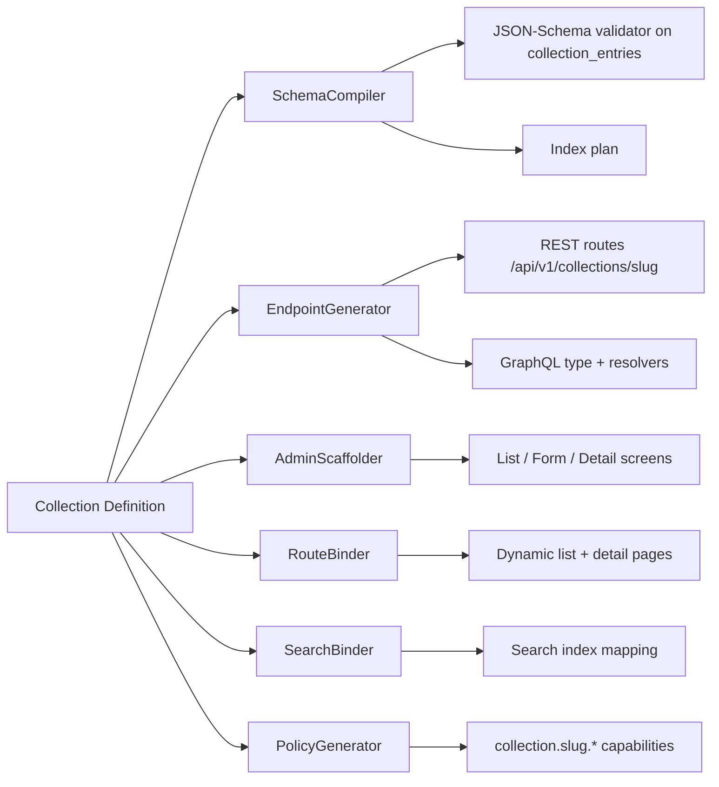
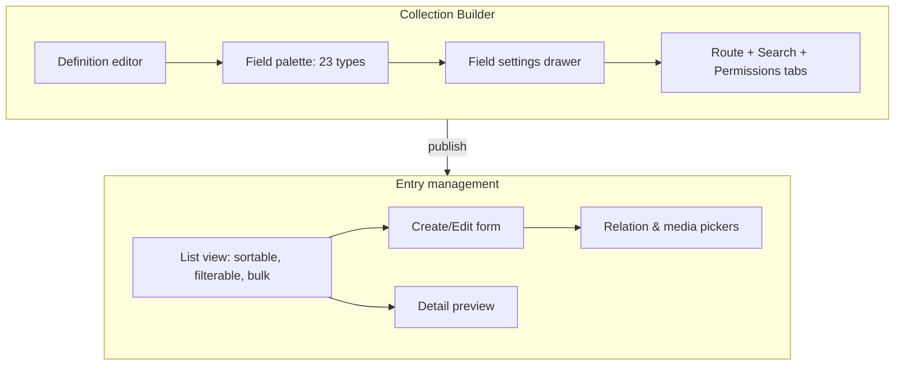

# Database Builder (Dynamic Collections)

> Visually define custom Collections (Products, Courses, Employees, Events, FAQ, and anything else) and GOCO auto-generates JSON-Schema validation, CRUD, REST + GraphQL APIs, admin UI, dynamic pages, permissions, and search indexing — no code required.

**Stability:** `beta` · **Package:** `gococms/database-builder` · **Namespace:** `Goco\DatabaseBuilder` · **Depends on:** `packages/database` (`Goco\Database`), `packages/widget-engine`, `packages/search`, `packages/seo`

The Database Builder is GOCO's flagship no-code data feature. A non-technical user models a domain concept once — a Collection with typed fields — and the platform materializes a fully governed data application around it: schema, storage, validation, endpoints, editor screens, front-end pages, access control, and search. It is the Website Operating System's answer to "content types" in traditional CMSs, generalized into arbitrary structured data.

---

## 1. Purpose

The Database Builder lets a workspace author define **Dynamic Collections** at runtime through the admin UI (or `goco` CLI, or API) and have GOCO synthesize everything needed to store, validate, edit, expose, render, and search that data.

A **Collection** is a reusable data type (e.g. `products`, `courses`, `employees`, `events`, `testimonials`, `faq`, `gallery`, `services`, `jobs`, `students`). Each Collection is described by an ordered set of typed **Fields**. Each concrete record is a **Collection Entry**.

From a single Collection **definition**, the module auto-generates:

| Generated artifact | Backed by |
| --- | --- |
| MongoDB JSON-Schema validator | `Goco\Database` (`packages/database`) |
| CRUD service + Repository | `Goco\DatabaseBuilder\EntryRepository` |
| REST API (`/api/v1/collections/{slug}`) | ZealPHP file-based + programmatic routes |
| GraphQL API (types, queries, mutations) | `Goco\DatabaseBuilder\GraphQL` |
| Admin UI (list, create, edit, delete, filter) | `apps/admin` schema-driven forms |
| Dynamic front-end pages (list + detail) | Rendering pipeline + Dynamic Collection widget |
| Per-Collection capabilities + RBAC/ABAC | `Goco\Auth` PolicyEngine |
| Search indexing (text/Atlas/Meilisearch/OpenSearch) | `Goco\Search` |

> **Note** The Database Builder does **not** introduce a second data engine. It is a metadata-driven consumer of the existing `Goco\Database` document-mapper + Repository pattern. Definitions are just documents; entries are just documents. This keeps the "lightweight core" promise of the OS.

**In scope:** visual/CLI/API modeling, field types, validation generation, CRUD/REST/GraphQL generation, dynamic routing and rendering, relations/references, versioning, soft deletes, search binding, per-collection permissions.

**Out of scope (delegated):** the visual page/section layout of dynamic pages (see [Page Builder](page-builder.md)), blog-specific editorial workflow (see [Blog Engine](blog-engine.md)), and raw storage internals (see [MongoDB Data Layer](../architecture/database-mongodb.md)).

---

## 2. Functional Specification

### 2.1 Collection definition

A Collection definition captures identity, presentation, behavior, and fields.

```json
{
  "slug": "products",
  "singular": "Product",
  "plural": "Products",
  "icon": "shopping-bag",
  "description": "Catalog of purchasable items",
  "storage": "shared",
  "primary_display_field": "name",
  "route": {
    "enabled": true,
    "list_path": "/shop",
    "detail_path": "/shop/{slug}",
    "list_template": "collection/list.php",
    "detail_template": "collection/detail.php"
  },
  "versioning": true,
  "soft_delete": true,
  "search": { "enabled": true, "provider": "default", "fields": ["name", "description", "tags"] },
  "capabilities_prefix": "collection.products",
  "fields": [
    { "key": "name", "type": "text", "label": "Name", "required": true, "unique": true, "index": true },
    { "key": "slug", "type": "text", "label": "Slug", "required": true, "unique": true, "slugify_from": "name" },
    { "key": "price", "type": "decimal", "label": "Price", "required": true, "min": 0, "scale": 2 },
    { "key": "in_stock", "type": "boolean", "label": "In stock", "default": true },
    { "key": "gallery", "type": "image", "label": "Gallery", "multiple": true, "max_items": 12 },
    { "key": "category", "type": "relation", "label": "Category", "target": "categories", "cardinality": "many-to-one" },
    { "key": "tags", "type": "tags", "label": "Tags" },
    { "key": "description", "type": "rich_text", "label": "Description" }
  ]
}
```

### 2.2 Field types

The Database Builder ships the following field types. Each maps to a JSON-Schema fragment, a storage shape, an admin input control, and (optionally) a search-indexable projection.

| Type | JSON-Schema | Stored as | Admin control | Notes |
| --- | --- | --- | --- | --- |
| `text` | `string` (`maxLength`) | string | single-line input | `unique`, `slugify_from`, `pattern` |
| `number` | `integer` | int | number input | `min`/`max`/`step` (whole numbers) |
| `decimal` | `number` | `Decimal128` | number input | `scale`, `min`/`max`; monetary-safe |
| `boolean` | `boolean` | bool | toggle | `default` |
| `date` | `string` `format:date` | `Date` (midnight UTC) | date picker | `min`/`max` |
| `time` | `string` `pattern HH:mm[:ss]` | string | time picker | 24h |
| `datetime` | `string` `format:date-time` | `Date` (BSON) | datetime picker | timezone-aware input, UTC storage |
| `rich_text` | `object` | `{ html, blocks }` | WYSIWYG | sanitized HTML + block JSON |
| `markdown` | `string` | string | markdown editor | rendered on read |
| `json` | `object`/`array` | document | code editor | free-form, validated if `schema` given |
| `image` | `string`/`array` | media `_id` ref(s) | media picker | `multiple`, `max_items`; resolves to `media` |
| `video` | `string`/`array` | media `_id` ref(s) | media picker | streams via Storage driver |
| `audio` | `string`/`array` | media `_id` ref(s) | media picker | |
| `file` | `string`/`array` | media `_id` ref(s) | file upload | any MIME |
| `email` | `string` `format:email` | string | email input | lowercase-normalized |
| `phone` | `string` `pattern` | string | phone input | E.164 normalization option |
| `url` | `string` `format:uri` | string | url input | scheme allowlist |
| `password` | `string` | Argon2id hash | password input | write-only; never returned in API |
| `tags` | `array<string>` | array | tag input | freeform labels, `taxonomy` optional |
| `color` | `string` `pattern #hex` | string | color picker | hex, optional alpha |
| `relation` | `string`/`array` (ObjectId) | ObjectId ref(s) into `collection_entries` | relation picker | `target`, `cardinality`, cascade rules |
| `reference` | `object` | `{ collection, entry_id }` | polymorphic picker | cross-collection polymorphic pointer |
| `multi_select` | `array<string>` (enum) | array | multi-select | `options[]` (closed set) |

> **Tip** `relation` links to a **known** target Collection (typed). `reference` is **polymorphic** — the target Collection is chosen per entry. Use `relation` for "a Product belongs to a Category"; use `reference` for "a Testimonial can point to a Product *or* a Course."

Every field supports common attributes: `key`, `type`, `label`, `help`, `required`, `default`, `unique`, `index`, `hidden`, `readonly`, `localized`, `group` (fieldset), and `conditional` (show-if rules).

### 2.3 Generation pipeline



Publishing a definition runs the pipeline inside a MongoDB transaction: the definition is upserted, the `collection_entries` validator is applied via `collMod`, the index plan is reconciled, capabilities are registered, and routes/GraphQL schema are hot-reloaded via `App::onWorkerStart` broadcast (see §9).

---

## 3. Business Requirements

| ID | Requirement | Priority |
| --- | --- | --- |
| BR-1 | Non-technical users define Collections and fields visually without deploying code | Must |
| BR-2 | Every Collection is validated at the database layer (no invalid entries can be written) | Must |
| BR-3 | Each Collection is instantly available over REST and GraphQL | Must |
| BR-4 | Each Collection can render public list and detail pages with SEO metadata | Must |
| BR-5 | Access is governed per Collection and per action, scoped to workspace + website | Must |
| BR-6 | Entries are soft-deleted and versioned; changes are auditable | Must |
| BR-7 | Definitions are portable (export/import) across workspaces and environments | Should |
| BR-8 | Field changes migrate existing entries safely (additive by default, guided for breaking) | Should |
| BR-9 | Collections integrate with the Widget Engine so designers can bind data to layouts | Must |
| BR-10 | Search over Collections is provider-agnostic and configurable per field | Should |
| BR-11 | Multi-tenant isolation: entries never leak across workspace/website boundaries | Must |

---

## 4. User Stories

- **As a store owner**, I create a `products` Collection with price, gallery, and category so my catalog is live at `/shop` without hiring a developer.
- **As a training company**, I model `courses` with a `relation` to `instructors` so each course page lists its teacher.
- **As an HR manager**, I keep an `employees` Collection with a write-only `password` field for a private staff portal, knowing the hash is never exposed by the API.
- **As a developer**, I query `/api/v1/collections/events?filter[start_at][$gte]=2026-07-01&sort=-start_at` from a React front-end.
- **As a designer**, I drop a Dynamic Collection widget onto a page and bind it to `testimonials`, choosing the card layout and sort order.
- **As a marketer**, I need each `jobs` detail page to emit Open Graph + JSON-LD automatically so postings share well.
- **As a workspace owner**, I grant the `editor` role `collection.products.update` but withhold `collection.products.delete`.
- **As a platform admin**, I export the `faq` definition from staging and import it into production identically.

---

## 5. Data Model (MongoDB Collections & Indexes)

The Database Builder uses two shared collections plus the pre-existing `media` and `search`-provider indexes.

### 5.1 `collections` (definitions)

Stores the metadata for each Dynamic Collection. Tenant-scoped.

```json
{
  "_id": "ObjectId",
  "workspace_id": "ObjectId",
  "website_id": "ObjectId",
  "slug": "products",
  "singular": "Product",
  "plural": "Products",
  "icon": "shopping-bag",
  "description": "Catalog of purchasable items",
  "storage": "shared",
  "primary_display_field": "name",
  "route": { "enabled": true, "list_path": "/shop", "detail_path": "/shop/{slug}" },
  "versioning": true,
  "soft_delete": true,
  "search": { "enabled": true, "provider": "default", "fields": ["name", "description", "tags"] },
  "capabilities_prefix": "collection.products",
  "fields": [ /* field definitions, ordered */ ],
  "index_plan": [ { "keys": { "fields.slug": 1 }, "unique": true } ],
  "schema_version": 4,
  "status": "published",
  "created_at": "ISODate", "updated_at": "ISODate", "deleted_at": null,
  "version": 4, "created_by": "ObjectId", "updated_by": "ObjectId"
}
```

**Indexes on `collections`:**

```javascript
db.collections.createIndex({ workspace_id: 1, website_id: 1, slug: 1 }, { unique: true, name: "uniq_tenant_slug" })
db.collections.createIndex({ workspace_id: 1, website_id: 1, status: 1 }, { name: "tenant_status" })
db.collections.createIndex({ "route.list_path": 1, website_id: 1 }, { name: "route_lookup" })
```

### 5.2 `collection_entries` (records)

All entries of all Dynamic Collections live in a single shared physical collection, discriminated by `collection_id` (and denormalized `collection_slug`). This is the **default `shared` storage strategy**.

```json
{
  "_id": "ObjectId",
  "workspace_id": "ObjectId",
  "website_id": "ObjectId",
  "collection_id": "ObjectId",
  "collection_slug": "products",
  "data": {
    "name": "Aeron Chair",
    "slug": "aeron-chair",
    "price": { "$numberDecimal": "1395.00" },
    "in_stock": true,
    "gallery": ["ObjectId(media)", "ObjectId(media)"],
    "category": "ObjectId(entry)",
    "tags": ["office", "ergonomic"],
    "description": { "html": "<p>...</p>", "blocks": [] }
  },
  "status": "published",
  "slug": "aeron-chair",
  "search_blob": "aeron chair office ergonomic ...",
  "created_at": "ISODate", "updated_at": "ISODate", "deleted_at": null,
  "version": 3, "created_by": "ObjectId", "updated_by": "ObjectId"
}
```

**Why shared storage (`collection_entries` with `collection_id`) is the default:**

- **One validator, many shapes.** A JSON-Schema validator on `collection_entries` uses a conditional (`if/then` on `collection_slug`, or per-Collection sub-schema selection in the service layer) so each Collection enforces its own field rules while sharing physical storage.
- **No DDL churn.** Creating/deleting Collections never runs `createCollection`/`dropCollection` at scale, avoiding catalog bloat and lock contention across thousands of tenants.
- **Cheap cross-collection queries** for global search, dashboards, and audit.
- **Operationally simple** backups, indexes, and sharding.

> **Note** Definitions may opt into the `dedicated` storage strategy (`"storage": "dedicated"`) — GOCO then materializes a physical `entries_{workspace}_{slug}` collection with a native `$jsonSchema` validator. This is offered for very large, high-throughput Collections (millions of entries) or the enterprise database-per-workspace model. The Repository API is identical; only the physical target changes. `shared` remains the recommended default.

**Indexes on `collection_entries`:**

```javascript
// Tenant + collection scoping — the hot path for every list query
db.collection_entries.createIndex(
  { workspace_id: 1, website_id: 1, collection_id: 1, deleted_at: 1, status: 1 },
  { name: "tenant_collection_live" })

// Per-collection detail lookup by slug
db.collection_entries.createIndex(
  { collection_id: 1, slug: 1, deleted_at: 1 },
  { name: "collection_slug", unique: true, partialFilterExpression: { deleted_at: null } })

// Dynamic per-field indexes are generated from the definition index_plan, e.g.
db.collection_entries.createIndex(
  { collection_id: 1, "data.price": 1 }, { name: "products_price" })
db.collection_entries.createIndex(
  { collection_id: 1, "data.category": 1 }, { name: "products_category_relation" })

// Full-text fallback (MongoDB text provider)
db.collection_entries.createIndex(
  { search_blob: "text" }, { name: "entries_text", default_language: "english" })
```

Unique field constraints are enforced with **partial, filtered** indexes scoped to `collection_id` and non-deleted docs so uniqueness holds within a Collection without colliding across Collections.

### 5.3 Versioning

When `versioning: true`, each write appends a snapshot to a `collection_entry_revisions` document stream (mirrors `page_revisions`/`post_revisions`). The live document holds `version`; prior states are reconstructable and restorable.

---

## 6. Folder Structure

```text
packages/database-builder/
├── composer.json                # gococms/database-builder
├── src/
│   ├── DatabaseBuilder.php       # facade / bootstrap, Hook + route registration
│   ├── Definition/
│   │   ├── CollectionDefinition.php
│   │   ├── FieldDefinition.php
│   │   ├── FieldType.php         # enum of the 23 field types
│   │   └── DefinitionValidator.php
│   ├── Schema/
│   │   ├── SchemaCompiler.php     # definition -> JSON-Schema
│   │   ├── IndexPlanner.php       # definition -> index plan
│   │   └── Migrator.php           # additive + guided breaking migrations
│   ├── Entry/
│   │   ├── EntryRepository.php    # CRUD over collection_entries
│   │   ├── EntryValidator.php
│   │   ├── EntrySerializer.php    # media resolution, password stripping
│   │   └── RelationResolver.php   # relation / reference expansion
│   ├── Api/
│   │   ├── RestController.php
│   │   ├── QueryParser.php        # filter[]/sort/page -> Mongo query
│   │   └── GraphQL/
│   │       ├── SchemaBuilder.php
│   │       └── Resolvers.php
│   ├── Routing/
│   │   └── DynamicRouteBinder.php # list/detail page routes
│   ├── Rendering/
│   │   └── CollectionRenderer.php
│   ├── Search/
│   │   └── SearchBinder.php
│   └── Security/
│       └── PolicyGenerator.php
├── templates/
│   └── collection/{list.php,detail.php}
└── tests/
    ├── Unit/ ...
    └── Integration/ ...

apps/admin/src/DatabaseBuilder/     # schema-driven admin screens
apps/api/api/v1/collections/        # ZealPHP file-based REST entry points
```

---

## 7. API Design

### 7.1 REST surface

All endpoints are tenant-scoped by the resolved `(workspace_id, website_id)` from the request host/context and gated by per-Collection capabilities.

| Method | Path | Capability | Description |
| --- | --- | --- | --- |
| `GET` | `/api/v1/collections` | `collections.manage` or read on any | List Collection definitions |
| `POST` | `/api/v1/collections` | `collections.manage` | Create a definition |
| `GET` | `/api/v1/collections/{slug}` | `collection.{slug}.read` | Get one definition |
| `PATCH` | `/api/v1/collections/{slug}` | `collections.manage` | Update a definition (triggers migration) |
| `DELETE` | `/api/v1/collections/{slug}` | `collections.manage` | Soft-delete a definition |
| `GET` | `/api/v1/collections/{slug}/entries` | `collection.{slug}.read` | List entries (filter/sort/paginate) |
| `POST` | `/api/v1/collections/{slug}/entries` | `collection.{slug}.create` | Create an entry |
| `GET` | `/api/v1/collections/{slug}/entries/{id}` | `collection.{slug}.read` | Read one entry |
| `PATCH` | `/api/v1/collections/{slug}/entries/{id}` | `collection.{slug}.update` | Update an entry |
| `DELETE` | `/api/v1/collections/{slug}/entries/{id}` | `collection.{slug}.delete` | Soft-delete an entry |
| `POST` | `/api/v1/collections/{slug}/entries/{id}/restore` | `collection.{slug}.update` | Restore soft-deleted |
| `POST` | `/api/v1/collections/{slug}/entries/{id}/publish` | `collection.{slug}.publish` | Publish |
| `GET` | `/api/v1/collections/{slug}/entries/{id}/revisions` | `collection.{slug}.read` | List revisions |

**Query grammar** (`GET .../entries`):

```text
filter[price][$gte]=100&filter[in_stock]=true&filter[tags][$in]=office,ergonomic
sort=-created_at,name
page[number]=2&page[size]=20
include=category,gallery          # expand relations/media
fields=name,price,slug            # sparse projection
```

`QueryParser` maps the operator subset `$eq $ne $gt $gte $lt $lte $in $nin $regex $exists` onto a validated Mongo filter, always AND-ed with the tenant + `collection_id` + `deleted_at: null` guard. Unknown fields are rejected (no query injection).

**File-based route** — the generic dispatcher lives at `apps/api/api/v1/collections/[slug]/entries.php` and returns arrays (auto-JSON) via ZealPHP:

```php
<?php // apps/api/api/v1/collections/entries.php  -> GET /api/v1/collections/{slug}/entries
use Goco\DatabaseBuilder\Api\RestController;

return function (string $slug, $request, $response) {
    return RestController::forSlug($slug)->index($request, $response);
};
```

Programmatic registration for the full CRUD verb set uses `nsPathRoute`:

```php
$app->nsPathRoute('api', '/v1/collections/{slug}/entries/{id}', function ($slug, $id, $request, $response) {
    return RestController::forSlug($slug)->dispatch($request, $response, $id);
});
```

### 7.2 GraphQL surface

`SchemaBuilder` emits one object type, input types, queries, and mutations per Collection.

```graphql
type Product implements Entry {
  id: ID!
  name: String!
  slug: String!
  price: Decimal!
  inStock: Boolean!
  gallery: [Media!]!
  category: Category          # relation, lazily resolved
  tags: [String!]!
  createdAt: DateTime!
}

type Query {
  product(id: ID, slug: String): Product
  products(filter: ProductFilter, sort: [ProductSort!], page: PageInput): ProductConnection!
}

type Mutation {
  createProduct(input: ProductInput!): Product!
  updateProduct(id: ID!, input: ProductPatch!): Product!
  deleteProduct(id: ID!): DeleteResult!
}
```

Resolvers reuse `EntryRepository`, so REST and GraphQL share validation, permissions, relation resolution, and password stripping.

### 7.3 Response shape (REST)

```json
{
  "data": {
    "id": "665f...",
    "collection": "products",
    "attributes": { "name": "Aeron Chair", "price": "1395.00", "in_stock": true, "slug": "aeron-chair" },
    "relationships": { "category": { "id": "661a...", "collection": "categories" } },
    "meta": { "version": 3, "created_at": "2026-07-18T09:12:00Z" }
  }
}
```

`password`-typed fields are always omitted from every response, both REST and GraphQL.

---

## 8. Services

| Service | Responsibility |
| --- | --- |
| `CollectionService` | Create/update/delete definitions; orchestrates the generation pipeline inside a transaction |
| `SchemaCompiler` | Compiles field definitions into a JSON-Schema validator fragment per Collection |
| `IndexPlanner` | Derives the index plan (`unique`, `index`, relation, text) and reconciles it against MongoDB |
| `EntryRepository` | Typed CRUD over `collection_entries`; enforces tenant + collection scope; append revisions |
| `EntryValidator` | Runs field-level + JSON-Schema validation before persistence; normalizes values (email lowercase, phone E.164, decimal scale, password Argon2id) |
| `RelationResolver` | Resolves `relation`/`reference`, enforces cascade rules, prevents cross-tenant links |
| `EntrySerializer` | Resolves media refs, strips write-only fields, shapes REST/GraphQL output |
| `QueryParser` | Translates REST query grammar into a safe Mongo filter/sort/projection |
| `Migrator` | Applies additive changes automatically; runs guided migrations for breaking field changes |
| `SearchBinder` | Projects `search.fields` into `search_blob` and pushes to the configured search provider |
| `PolicyGenerator` | Registers `collection.{slug}.{action}` capabilities and default role grants |
| `CollectionRenderer` | Renders list/detail pages via the template + rendering pipeline |

`CollectionService.publish()` (transactional):

```php
$db->transaction(function ($session) use ($def) {
    $this->collections->upsert($def, $session);                    // 1. persist definition
    $validator = $this->schemaCompiler->compile($def);             // 2. build JSON-Schema
    $this->db->applyValidator('collection_entries', $validator);   // 3. collMod
    $this->indexPlanner->reconcile($def, $session);                // 4. indexes
    $this->policyGenerator->sync($def);                            // 5. capabilities
    Hook::dispatch('collection.published', $def);                  // 6. hot-reload routes/GraphQL
});
```

---

## 9. Events

The module emits lifecycle **actions** (see [Event & Hook System](../architecture/event-hook-system.md) for naming: `subject.verb[.tense]`).

| Event | When | Args |
| --- | --- | --- |
| `collection.creating` | before a definition is persisted | `CollectionDefinition` |
| `collection.created` | after a definition is created | `CollectionDefinition` |
| `collection.publishing` / `collection.published` | around the generation pipeline | `CollectionDefinition` |
| `collection.updating` / `collection.updated` | around a definition change | `CollectionDefinition, $diff` |
| `collection.deleting` / `collection.deleted` | around soft-delete | `slug` |
| `collection.migrating` / `collection.migrated` | around a field migration | `slug, $migrationPlan` |
| `collection.entry.creating` / `.created` | around entry create | `slug, $entry` |
| `collection.entry.updating` / `.updated` | around entry update | `slug, $entry, $before` |
| `collection.entry.deleting` / `.deleted` | around entry soft-delete | `slug, $entryId` |
| `collection.entry.publishing` / `.published` | around entry publish | `slug, $entry` |
| `collection.entry.indexed` | after search indexing | `slug, $entryId` |

Route/GraphQL hot-reload is coordinated across OpenSwoole workers: `collection.published` publishes to a `\ZealPHP\Store` channel; each worker's `App::onWorkerStart` subscriber rebuilds its dynamic route + GraphQL schema table so no restart is needed.

```php
App::onWorkerStart(function ($server, $wid) {
    App::subscribe('collection.reload', function ($slug) {
        Goco\DatabaseBuilder\DatabaseBuilder::reload($slug);
    });
});
```

---

## 10. Hooks

**Filters** (`subject.noun`) let plugins/themes reshape data and behavior:

| Filter | Purpose | Value |
| --- | --- | --- |
| `collection.fields` | Add/modify field definitions before compile | `array $fields` |
| `collection.schema` | Adjust the compiled JSON-Schema | `array $schema` |
| `collection.index.plan` | Add custom indexes | `array $plan` |
| `collection.entry.input` | Transform incoming data pre-validation | `array $data` |
| `collection.entry.output` | Transform outgoing serialized entry | `array $attributes` |
| `collection.query.criteria` | Inject scope into every list query | `array $criteria` |
| `collection.search.blob` | Customize the search projection | `string $blob` |
| `collection.route.detail` | Rewrite detail URL generation | `string $url` |

**Registering a field type extension** (a plugin adding a `geo` field type):

```php
use Goco\SDK\Hook;

Hook::filter('collection.field.types', function (array $types) {
    $types['geo'] = new \Acme\Geo\GeoFieldType(); // implements FieldTypeContract
    return $types;
});

Hook::filter('collection.entry.output', function (array $attrs, string $slug) {
    if ($slug === 'stores' && isset($attrs['location'])) {
        $attrs['location_label'] = geocode_label($attrs['location']);
    }
    return $attrs;
}, 20);
```

Field types are extensible via the `FieldTypeContract` (schema fragment, storage codec, admin control descriptor, search projection), so the 23 built-ins are a floor, not a ceiling.

---

## 11. UI Architecture

The admin experience is **schema-driven**: `apps/admin` reads a Collection definition and renders screens generically — there is no hand-written form per Collection.



- **Builder** — drag fields from the palette, configure each field's settings, set route/search/permission tabs. Live JSON-Schema and API preview panes.
- **List view** — columns derived from fields (with `hidden`/`primary_display_field` honored), server-side filter/sort/pagination via the REST query grammar, bulk publish/delete.
- **Entry form** — controls chosen by field type; conditional fields (`show-if`), relation/media pickers, markdown/rich-text editors, validation surfaced from the same JSON-Schema used server-side.
- **Front-end binding** — the **Dynamic Collection widget** (from the [Widget Engine](widget-engine.md)) binds a Collection to a layout region. Designers pick the Collection, a display mode (grid/list/carousel/table), sort, filter, page size, and a card template. See §15 and the [Widget SDK](../sdk/widget-sdk.md).

```php
// Binding a Collection to a page region via the Widget SDK
use Goco\SDK\Widget;

echo Widget::render('dynamic-collection', [
    'collection' => 'testimonials',
    'mode'       => 'carousel',
    'sort'       => '-created_at',
    'limit'      => 6,
    'filter'     => ['status' => 'published'],
    'template'   => 'card/quote.php',
], $ctx);
```

Dynamic pages are produced by `CollectionRenderer` through the standard [Rendering Pipeline](../architecture/rendering-pipeline.md); list and detail templates receive the resolved entries and emit SEO metadata (title, meta description, Open Graph, JSON-LD) via the SEO package.

---

## 12. Security Model

Backed by [Authentication](authentication.md), the [Permission System](../architecture/permission-system.md), and the [Security Model](../security/security-model.md).

- **Per-Collection capabilities.** `PolicyGenerator` registers `collection.{slug}.{create|read|update|delete|publish}` for every Collection. RBAC maps roles → these capabilities; the optional ABAC `PolicyEngine` refines by attribute (e.g. `data.owner == user.id`). All checks are scoped to `(workspace_id, website_id)`.
- **Default grants.** `owner`/`super-admin`/`website-admin` get full access; `editor` gets create/read/update/publish; `author` create/read/update on own entries; `viewer` read on `published`. `collections.manage` is required to create/alter definitions (schema is privileged).
- **Database-enforced validation.** The generated `$jsonSchema` validator on `collection_entries` means invalid documents are rejected by MongoDB itself — the API layer cannot be bypassed into writing malformed data.
- **Input hardening.** `rich_text`/`markdown` are sanitized (allowlist HTML); `url`/`email`/`phone` are format-validated and normalized; `json` fields validated against an optional sub-schema; `password` fields are hashed with **Argon2id** and are write-only (never serialized).
- **Query safety.** `QueryParser` accepts only an operator allowlist and known fields; every query is AND-ed with tenant + `collection_id` + `deleted_at: null`, preventing NoSQL injection and cross-tenant reads.
- **Relations never cross tenants.** `RelationResolver` verifies target entries share the same `(workspace_id, website_id)`.
- **Auditing.** Every definition and entry mutation writes to `audit_logs` with actor, before/after diff, and request id; revisions are retained when `versioning: true`.
- **API auth.** REST/GraphQL use JWT bearer (see Authentication); admin uses Redis-backed sessions with CSRF via ZealPHP's `Csrf` middleware. Rate limiting via ZealPHP `RateLimit` middleware / Traefik.

---

## 13. Performance Strategy

- **Compound tenant index first.** `{ workspace_id, website_id, collection_id, deleted_at, status }` serves the dominant list query; sorts append the sort field to a derived index from the `index_plan`.
- **Per-field indexes from the definition.** Fields marked `index: true`, `unique: true`, or used as `relation` produce targeted `{ collection_id: 1, "data.<key>": 1 }` indexes so shared storage stays selective.
- **Projection + pagination by default.** List endpoints cap `page[size]` (default 20, max 100) and support sparse `fields` to reduce payload; keyset pagination available for large Collections.
- **Denormalized `slug` and `search_blob`** avoid recomputation on the hot read/search paths.
- **Redis caching.** Compiled definitions, JSON-Schemas, generated route/GraphQL tables, and hot list results are cached in Redis (see [Caching, Queue & Realtime](../architecture/caching-and-queue.md)); cache keys are keyed by `schema_version` so a definition change invalidates cleanly.
- **Async indexing.** Search indexing and revision snapshotting run on the Redis-backed queue (`jobs`), off the request path; coordinated with OpenSwoole coroutines (`go()`).
- **Hot reload, no restart.** Definition changes propagate to workers via `\ZealPHP\Store` pub/sub — no process restart, no downtime.
- **`dedicated` storage escape hatch** for Collections that outgrow shared storage (millions of entries / very high write throughput).

---

## 14. Testing Strategy

Aligned with the [Testing Strategy](../community/testing-strategy.md).

- **Unit** — `SchemaCompiler` (every field type → correct JSON-Schema), `IndexPlanner`, `QueryParser` (operator allowlist, injection rejection), `EntryValidator` (normalization: email/phone/decimal/password), `RelationResolver` (cross-tenant rejection).
- **Integration** — against ephemeral MongoDB + Redis (Docker): create a definition, assert the validator rejects malformed entries, exercise CRUD, assert unique partial indexes, assert soft-delete/restore and revisions.
- **Contract** — REST and GraphQL produce equivalent results for the same operations; `password` never appears in any response; pagination/filter/sort grammar conformance.
- **Migration** — additive field add is transparent; breaking change (e.g. `text`→`number`) triggers a guided migration plan and dry-run report.
- **Security** — a role without `collection.{slug}.delete` is denied; cross-tenant read/relation attempts fail; sanitizer strips script from `rich_text`.
- **E2E** — build a `products` Collection in the admin, publish, create an entry, verify `/shop` list + detail render with SEO tags.

```bash
# Run the module test suite
./vendor/bin/pest packages/database-builder --group=integration
goco test packages/database-builder
```

---

## 15. Extension Points

- **Custom field types** via `FieldTypeContract` + `collection.field.types` filter (schema fragment, storage codec, admin control, search projection).
- **Field/schema/index filters** (`collection.fields`, `collection.schema`, `collection.index.plan`) to programmatically shape Collections from a plugin.
- **Entry lifecycle hooks** (`collection.entry.creating/updated/...`) for side effects (webhooks, notifications, derived fields).
- **Query scoping** via `collection.query.criteria` for row-level security policies.
- **Dynamic Collection widget templates** — ship custom list/detail/card templates in a theme (see [Theme SDK](../sdk/theme-sdk.md)) and select them per binding.
- **Search provider swap** — implement the search provider interface (MongoDB/Meilisearch/OpenSearch) and bind per Collection via `search.provider`.
- **CLI generators** — `goco make:collection`, `goco collection:export`, `goco collection:import`, `goco collection:migrate` (see [CLI Reference](../reference/cli-reference.md)).

```bash
goco make:collection courses --field="title:text!" --field="price:decimal" --field="instructor:relation=instructors"
goco collection:export products --out=products.collection.json
goco collection:import products.collection.json --workspace=acme
```

---

## 16. Upgrade Strategy

- **Definitions are versioned** (`schema_version`). Each publish bumps the version; caches and search mappings key off it, so upgrades invalidate deterministically.
- **Additive is safe by default.** Adding an optional field, a new field type, or a new index migrates automatically with zero downtime (existing entries simply lack the new key; defaults apply on read/write).
- **Breaking changes are guided.** Removing/renaming a field, tightening `required`, or changing a field's type produces a `Migrator` plan with a **dry-run report** (affected entry count, coercion strategy, backfill). Renames preserve data via a mapping; type changes run a backfill job on the queue.
- **Portability.** `collection:export`/`import` moves definitions between environments; importing reconciles indexes and validators idempotently.
- **Storage strategy migration.** Switching `shared` → `dedicated` runs a background copy job, dual-writes during cutover, then flips reads — no API contract change.
- **Backward compatibility.** REST/GraphQL contracts follow Semantic Versioning; deprecated fields are marked `deprecated` and returned for one minor cycle before removal. See [Backup & Restore](../deployment/backup-restore.md) before any breaking migration.

---

## 17. Future Roadmap

| Item | Target | Notes |
| --- | --- | --- |
| Computed/formula fields | 0.x | derived values evaluated on write |
| Field-level localization (i18n) | 0.x | per-locale values on `localized` fields |
| Workflow states + approvals | 0.x | draft→review→published pipelines per Collection |
| Bidirectional relations & back-references | 0.x | auto-maintained inverse links |
| Import from CSV/Airtable/Notion | 0.x | mapping wizard into a new Collection |
| AI-assisted modeling | 0.x | describe a domain in natural language → suggested Collection (see [AI Platform](ai-platform.md)) |
| Aggregation-powered dashboards | 0.x | pivot/report views over entries |
| Row-level ABAC policy templates | 0.x | shareable per-Collection access policies |
| GraphQL subscriptions | 0.x | realtime entry changes over WebSocket |

---

## Related

- [MongoDB Data Layer](../architecture/database-mongodb.md)
- [Data Model (Collections & Indexes)](../architecture/data-model.md)
- [Rendering Pipeline](../architecture/rendering-pipeline.md)
- [Event & Hook System](../architecture/event-hook-system.md)
- [Permission System (RBAC + ABAC)](../architecture/permission-system.md)
- [Multi-Tenancy](../architecture/multi-tenancy.md)
- [Search](../architecture/search.md)
- [Caching, Queue & Realtime](../architecture/caching-and-queue.md)
- [Widget Engine](widget-engine.md)
- [Page Builder (Visual Editor)](page-builder.md)
- [Blog Engine](blog-engine.md)
- [AI Platform](ai-platform.md)
- [Authentication](authentication.md)
- [Widget SDK](../sdk/widget-sdk.md)
- [Theme SDK](../sdk/theme-sdk.md)
- [Hook SDK](../sdk/hook-sdk.md)
- [API Reference](../reference/api-reference.md)
- [CLI Reference](../reference/cli-reference.md)
- [Security Model](../security/security-model.md)
- [Testing Strategy](../community/testing-strategy.md)
- [Documentation Index](../README.md)
