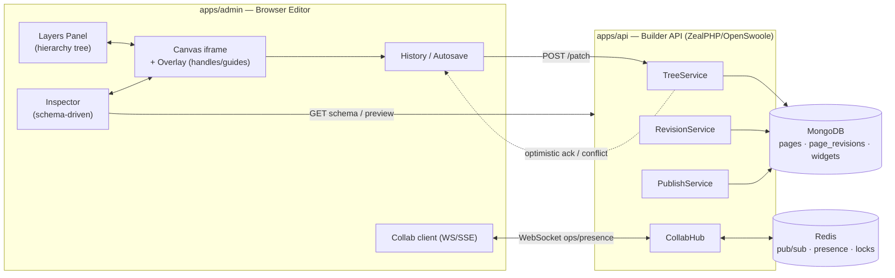

# Page Builder (Visual Editor)

> The GOCO CMS visual editor: a browser-based, drag-and-drop canvas — inspired by Blogger layout, Webflow, Framer, Elementor, and Figma — that composes pages from schema-bound widgets, edits them across responsive breakpoints, and persists every change to Mongo with autosave, revisions, and realtime collaboration.

**Stability:** `beta` · **Package:** `apps/admin` (editor) + `apps/api` (Builder API) · **Depends on:** `packages/widget-engine`, `packages/template-engine`, `packages/database`

---

## 1. Purpose

The Page Builder is the human-facing composition surface of GOCO CMS. Where the [Widget Engine](widget-engine.md) defines *what* a widget is and the [Template Engine](template-engine.md) defines *how* markup is produced, the Page Builder defines *how a human arranges those widgets into a page* — visually, without writing code.

It exists to satisfy three constituencies simultaneously:

- **Editors & authors** who need a WYSIWYG canvas with live preview, drag-and-drop, and safe publishing.
- **Designers** who need pixel-level control across responsive breakpoints, a layers panel, and Figma-grade keyboard ergonomics.
- **Developers** who register widgets whose [property schemas](../sdk/widget-sdk.md) automatically drive the inspector — no bespoke editor UI per widget.

The builder never invents its own document format. It reads and writes the exact `pages`, `page_revisions`, and `widgets` documents described in the [Data Model](../architecture/data-model.md), so a page composed in the builder is byte-for-byte the page rendered by the [Rendering Pipeline](../architecture/rendering-pipeline.md) at request time.

> **Note**
> The Page Builder is a *client of* the core, not a privileged subsystem. Everything it does is expressible through the Builder API and the SDK facades. A headless integration (e.g. a design tool, a migration script, or an AI agent from the [AI Platform](ai-platform.md)) can produce identical documents without ever opening the browser editor.

---

## 2. Functional Specification

### 2.1 Canvas & live preview

The canvas is an isolated iframe that renders the *real* page through the Rendering Pipeline in a special `edit` render mode. What the editor sees is what a visitor sees, plus editor chrome (selection outlines, drop indicators, resize handles) painted in an overlay layer positioned above — never inside — the rendered document. This guarantees the preview cannot drift from production output.

| Capability | Behaviour |
| --- | --- |
| Live preview | Canvas re-renders affected fragments as props change; full reloads are avoided (see §13). |
| Device frames | Desktop / tablet / mobile frames with adjustable custom widths. |
| Zoom & pan | 10%–400% zoom, space-drag pan, fit-to-screen. |
| Rulers & guides | Optional pixel rulers, snap-to-guide, snap-to-widget-edge. |
| Outline mode | Toggle to render wireframe boxes (Blogger-style layout view) for structural editing. |

### 2.2 Layers panel

A collapsible tree mirroring the [website hierarchy](../architecture/overview.md) at the page scope: `Layout → Section → Container → Row → Column → Widget`. The panel supports select, multi-select (Cmd/Ctrl + click, Shift + range), reorder via drag, rename, lock, hide, duplicate, and delete. Selection is bidirectional — selecting a node highlights it on canvas and vice versa.

### 2.3 Inspector / property panel

The inspector is generated, not hand-built. When a widget is selected the editor calls `Widget::properties($type)` and renders controls from the returned `PropertySchema`. Field types (`text`, `richtext`, `number`, `color`, `select`, `toggle`, `media`, `link`, `collection-ref`, `group`, `repeater`) map to typed controls. Values are grouped into **Content**, **Style**, and **Advanced** tabs, and every style field is **breakpoint-aware** (§2.5).

### 2.4 Drag, drop & resize

- **Drag from the widget palette** onto a valid drop target; the drop engine validates parent/child rules from the widget definition (`allowedChildren`, `allowedParents`).
- **Drag existing nodes** within the layers tree or on canvas to re-parent or reorder.
- **Resize** columns (12-column grid), spacers, and free-form widgets via handles; column resize rewrites `span` per breakpoint.
- Live **drop indicators** show the exact insertion point; invalid targets are visually rejected.

### 2.5 Responsive breakpoint editing

Breakpoints are `base` (mobile-first), `sm`, `md`, `lg`, `xl`. Editing at a breakpoint writes an override only for that breakpoint; unset breakpoints inherit from the next-smaller. The inspector shows an inheritance dot (solid = set here, hollow = inherited) per field, matching the mental model of Webflow/Framer.

### 2.6 History: undo / redo / autosave

- **Undo/redo** operate on a bounded in-memory command stack (default 100 steps) of reversible operations.
- **Autosave** debounces (default 2s idle, 15s max) and POSTs a patch to the Builder API, which appends a `page_revisions` document and updates the working draft.
- **Named revisions** can be created explicitly; any revision can be previewed and restored.

### 2.7 Multi-select & bulk actions

Multi-select enables group move, align, distribute, style-apply-to-all (only shared schema fields), group into a container, and bulk delete. A mixed selection shows only fields common to all selected widget types.

### 2.8 Keyboard shortcuts

| Action | Shortcut |
| --- | --- |
| Undo / Redo | `Cmd/Ctrl+Z` / `Cmd/Ctrl+Shift+Z` |
| Copy / Paste / Duplicate | `Cmd/Ctrl+C` / `V` / `D` |
| Delete | `Delete` / `Backspace` |
| Multi-select add | `Cmd/Ctrl+Click` |
| Group / Ungroup | `Cmd/Ctrl+G` / `Cmd/Ctrl+Shift+G` |
| Save revision | `Cmd/Ctrl+S` |
| Toggle preview (hide chrome) | `Cmd/Ctrl+P` |
| Nudge / large nudge | Arrow keys / `Shift+Arrow` |
| Zoom fit / 100% | `Shift+1` / `Shift+0` |

### 2.9 Context menu & context actions

Right-click on a node opens a context menu whose entries are contributed by both core and plugins (via `filter builder.context_menu`). Core entries: Cut, Copy, Paste inside/before/after, Duplicate, Wrap in container, Convert to global widget, Move to layer, Lock, Hide, Delete.

### 2.10 Draft / publish / schedule

A page carries a `status` of `draft`, `scheduled`, or `published`. Publishing snapshots the current draft into the live layout and fires `content.published`. Scheduling stores `published_at` in the future; a queue worker (see [Caching, Queue & Realtime](../architecture/caching-and-queue.md)) promotes it at the due time.

---

## 3. Business Requirements

| # | Requirement | Rationale |
| --- | --- | --- |
| BR-1 | Non-technical users can build production pages without code. | Core value proposition of a "Website Operating System". |
| BR-2 | The editor output equals the rendered output, always. | Trust; eliminates preview drift. |
| BR-3 | Every change is recoverable. | Autosave + `page_revisions` protect against data loss. |
| BR-4 | Multiple people can edit safely at once. | Agencies and teams need concurrent editing with presence. |
| BR-5 | Widget authors get an editor UI for free. | Schema-driven inspector removes per-widget UI cost. |
| BR-6 | Publishing is gated by capability and never ships unsafe HTML. | Security + governance. |
| BR-7 | Responsive design is first-class, not an afterthought. | Parity with Webflow/Framer expectations. |
| BR-8 | The builder is tenant-isolated. | Multi-tenant SaaS operation (see [Multi-Tenancy](../architecture/multi-tenancy.md)). |

---

## 4. User Stories

- **As an editor**, I drag a "Hero" widget onto the canvas, type a headline inline, and see it update live, so I can publish a landing page in minutes.
- **As a designer**, I switch to the tablet breakpoint and reduce the hero heading size, so the layout looks right on every device without touching desktop.
- **As a developer**, I register a `pricing-table` widget with a property schema, and its editor controls appear automatically, so I never build a settings panel.
- **As a content lead**, I schedule a campaign page for next Monday 09:00, so it goes live without anyone being online.
- **As a team of two**, we edit the same page and see each other's cursors and selections, so we don't overwrite each other's work.
- **As an admin**, I restrict the `author` role to editing but not publishing, so drafts require review.
- **As anyone**, I press `Cmd+Z` after a bad drag and instantly restore the previous state.

---

## 5. Data Model (MongoDB collections & indexes)

The builder reads and writes three collections. Full field-level schemas live in the [Data Model](../architecture/data-model.md) and [MongoDB Data Layer](../architecture/database-mongodb.md); the shapes below are the builder-relevant projection.

### 5.1 `pages`

```json
{
  "_id": "ObjectId",
  "workspace_id": "ObjectId",
  "website_id": "ObjectId",
  "slug": "landing/spring-sale",
  "title": "Spring Sale",
  "status": "draft | scheduled | published",
  "layout_id": "ObjectId",
  "tree": {
    "id": "root",
    "type": "section",
    "props": {},
    "children": [
      {
        "id": "c_a1",
        "type": "container",
        "props": { "maxWidth": { "base": "100%", "lg": "1200px" } },
        "children": [
          { "id": "w_hero", "type": "hero", "props": { "headline": { "base": "Spring Sale" } } }
        ]
      }
    ]
  },
  "seo": { "title": "…", "description": "…" },
  "published_at": "ISODate | null",
  "draft_revision_id": "ObjectId",
  "published_revision_id": "ObjectId | null",
  "lock": { "user_id": "ObjectId", "expires_at": "ISODate" } ,
  "created_at": "ISODate", "updated_at": "ISODate", "deleted_at": null,
  "version": 42, "created_by": "ObjectId", "updated_by": "ObjectId"
}
```

The `tree` embeds the composition. Leaf `type` values reference widget types; heavy or reusable widgets may instead reference a document in `widgets` via `{ "type": "ref", "widget_id": "…" }` (global/synced widgets).

### 5.2 `page_revisions`

Append-only history. Each autosave or manual save writes one document.

```json
{
  "_id": "ObjectId",
  "workspace_id": "ObjectId", "website_id": "ObjectId",
  "page_id": "ObjectId",
  "tree": { "…snapshot or patch…" },
  "patch": [ { "op": "replace", "path": "/children/0/props/headline/base", "value": "Spring Sale!" } ],
  "kind": "autosave | manual | publish | restore",
  "label": "Before hero rewrite",
  "author": "ObjectId",
  "created_at": "ISODate"
}
```

> **Tip**
> Revisions store an RFC-6902 JSON-Patch `patch` for autosaves (small, cheap) and a full `tree` snapshot for `manual`/`publish` kinds, so any point can be reconstructed by replaying patches forward from the nearest snapshot.

### 5.3 `widgets`

Reusable/global widget instances edited in the builder and referenced by many pages.

```json
{
  "_id": "ObjectId",
  "workspace_id": "ObjectId", "website_id": "ObjectId",
  "type": "cta-banner",
  "name": "Global Footer CTA",
  "scope": "global | local",
  "props": { "text": { "base": "Get started" } },
  "created_at": "ISODate", "updated_at": "ISODate", "deleted_at": null,
  "version": 7, "created_by": "ObjectId", "updated_by": "ObjectId"
}
```

### 5.4 Indexes

```javascript
// pages
db.pages.createIndex({ workspace_id: 1, website_id: 1, slug: 1 }, { unique: true, partialFilterExpression: { deleted_at: null } })
db.pages.createIndex({ workspace_id: 1, website_id: 1, status: 1, published_at: 1 })
db.pages.createIndex({ "lock.expires_at": 1 }, { expireAfterSeconds: 0 })   // TTL: auto-clear stale edit locks
db.pages.createIndex({ website_id: 1, updated_at: -1 })

// page_revisions
db.page_revisions.createIndex({ page_id: 1, created_at: -1 })
db.page_revisions.createIndex({ workspace_id: 1, website_id: 1, author: 1, created_at: -1 })
db.page_revisions.createIndex({ created_at: 1 }, { expireAfterSeconds: 7776000, partialFilterExpression: { kind: "autosave" } }) // prune autosaves after 90d

// widgets
db.widgets.createIndex({ workspace_id: 1, website_id: 1, scope: 1, type: 1 })
```

A JSON-Schema validator on `pages` enforces `status` enum, presence of `workspace_id`/`website_id`, and that `tree.type == "section"` at root.

---

## 6. Folder Structure

The builder is split across the admin app (browser editor) and the api app (Builder API), sharing document contracts from `packages/`.

```text
apps/admin/
  public/
    builder/                # editor SPA entry (served by ZealPHP static route)
  src/
    Builder/
      Canvas/               # iframe host, overlay renderer, drop engine
      Layers/               # tree panel
      Inspector/            # schema-driven property controls
      History/              # command stack, undo/redo, autosave scheduler
      Collab/               # presence, cursors, WS client, conflict resolver
      Shortcuts/            # keymap
      ContextMenu/          # right-click menu + filter contributions
  template/
    builder.php             # App::render shell for the editor
apps/api/
  api/
    builder/
      pages/
        [id]/
          tree.php          # GET/PUT working tree
          patch.php         # POST JSON-Patch (autosave)
          publish.php       # POST publish/schedule
          revisions.php     # GET list, POST restore
          lock.php          # POST acquire/refresh/release edit lock
      widgets/
        preview.php         # POST -> Widget::preview() fragment
        render.php          # POST -> Widget::render() fragment
  src/
    Builder/
      TreeService.php
      RevisionService.php
      PublishService.php
      CollabHub.php         # WS handlers + Redis pub/sub bridge
core/                        # Goco\ facades, Hook dispatcher
packages/
  widget-engine/            # Widget:: facade, PropertySchema
  template-engine/          # fragment rendering
  database/                 # Goco\Database repositories
```

---

## 7. API Design

The Builder API lives in `apps/api` and uses ZealPHP file-based REST (`api/foo/bar.php → GET /api/foo/bar`) plus explicit routes for verbs. All endpoints are tenant-scoped from the authenticated session/JWT and gated by capability (§12).

### 7.1 REST endpoints

| Method | Path | Capability | Purpose |
| --- | --- | --- | --- |
| `GET` | `/api/builder/pages/{id}/tree` | `pages.read` | Load working draft tree + presence snapshot. |
| `PUT` | `/api/builder/pages/{id}/tree` | `pages.update` | Replace full tree (rare; conflict-checked). |
| `POST` | `/api/builder/pages/{id}/patch` | `pages.update` | Apply a JSON-Patch; append autosave revision. |
| `POST` | `/api/builder/pages/{id}/publish` | `pages.publish` | Publish now or schedule (`published_at`). |
| `GET` | `/api/builder/pages/{id}/revisions` | `pages.read` | List revisions (paged). |
| `POST` | `/api/builder/pages/{id}/revisions/restore` | `pages.update` | Restore a revision into the draft. |
| `POST` | `/api/builder/pages/{id}/lock` | `pages.update` | Acquire / refresh / release edit lock. |
| `POST` | `/api/builder/widgets/preview` | `widgets.manage` | Render a widget preview fragment. |
| `GET` | `/api/builder/widgets/schema/{type}` | `widgets.manage` | Return the `PropertySchema` for the inspector. |

### 7.2 Route registration (ZealPHP)

```php
<?php
// apps/api/src/Builder/routes.php
use ZealPHP\App;
use Goco\Builder\TreeService;
use Goco\Builder\PublishService;

$app = App::instance();

$app->nsRoute('builder', '/pages/{id}/patch', function ($id, $request, $response) {
    $ctx   = \Goco\G::context();                       // tenant + user from RequestContext
    $ctx->authorize('pages.update', $id);              // throws 403 on failure
    $patch = $request->json();                          // RFC-6902 array
    $result = TreeService::applyPatch($ctx, $id, $patch, $request->header('If-Match'));
    if ($result->conflict) {
        $response->status(409);
        return ['error' => 'conflict', 'server_version' => $result->version, 'ops' => $result->rebased];
    }
    return ['version' => $result->version, 'revision_id' => (string) $result->revisionId];
}, methods: ['POST']);
```

### 7.3 Patch request / response

```json
// POST /api/builder/pages/652f.../patch    (If-Match: 41)
{
  "base_version": 41,
  "ops": [
    { "op": "replace", "path": "/children/0/children/0/props/headline/base", "value": "Spring Sale!" },
    { "op": "add", "path": "/children/0/children/1", "value": { "id": "w_cta", "type": "cta-banner", "props": {} } }
  ]
}
```

```json
// 200 OK
{ "version": 42, "revision_id": "652f...", "applied": 2 }
// 409 Conflict (see §12.4 for rebasing)
{ "error": "conflict", "server_version": 43, "ops": [ /* server ops since base_version, for client rebase */ ] }
```

### 7.4 Realtime channels

| Transport | Endpoint | Payload |
| --- | --- | --- |
| WebSocket | `ws://…/ws/builder/{page_id}` | presence join/leave, cursor, selection, live ops |
| SSE (fallback) | `GET /api/builder/pages/{id}/stream` | one-way op + presence stream |

---

## 8. Services

| Service | Responsibility |
| --- | --- |
| `TreeService` | Load/replace tree, apply & validate JSON-Patch, enforce parent/child rules, bump `version`, delegate to `RevisionService`. |
| `RevisionService` | Append `page_revisions`, snapshot/patch strategy, list, prune, reconstruct at revision, restore. |
| `PublishService` | Draft→published transition, schedule via queue, cache invalidation, `content.published` dispatch. |
| `CollabHub` | WebSocket lifecycle, Redis pub/sub fan-out across workers, presence table, op broadcast. |
| `LockService` | Advisory edit locks with TTL, refresh, takeover on expiry. |
| `SanitizerService` | Server-side HTML/richtext sanitization on every write (§12.3). |
| `PreviewService` | Render widget/fragment previews through the Template Engine in `edit` mode. |

### 8.1 Realtime fan-out with Redis + ZealPHP Store

OpenSwoole runs multiple workers; a WebSocket connection lives on one worker, but collaborators on a page may be spread across workers. GOCO bridges them with Redis pub/sub and keeps hot presence state in a cross-worker `ZealPHP\Store` (OpenSwoole\Table) so cursor updates never touch Mongo.

```php
<?php
namespace Goco\Builder;

use ZealPHP\App;
use ZealPHP\Store;

class CollabHub
{
    public static function boot(): void
    {
        // Cross-worker presence table (fixed-size, lock-free)
        Store::make('builder_presence', 4096, [
            ['page_id', Store::STRING, 32],
            ['user_id', Store::STRING, 32],
            ['cursor',  Store::STRING, 64],
        ]);
        Store::defaultBackend(Store::BACKEND_REDIS); // durable pub/sub across nodes

        // Every worker subscribes to the ops channel and re-pushes to its local fds.
        App::onWorkerStart(function ($server, $wid) {
            App::subscribe('builder.ops', function (string $chan, array $msg) use ($server) {
                foreach (self::localSubscribers($msg['page_id']) as $fd) {
                    if ($fd !== ($msg['origin_fd'] ?? null)) {
                        $server->push($fd, json_encode($msg['frame']));
                    }
                }
            });
        });
    }

    public static function onMessage($server, $frame): void
    {
        $msg = json_decode($frame->data, true);
        // Persist authoritative ops via TreeService (validated + versioned)...
        // ...then publish to all workers/nodes for real-time echo:
        Store::publish('builder.ops', [
            'page_id'   => $msg['page_id'],
            'origin_fd' => $frame->fd,
            'frame'     => $msg,
        ]);
    }
}
```

Wired at bootstrap:

```php
$app->ws('/ws/builder/{page_id}',
    onOpen:    fn($server, $req)        => Goco\Builder\CollabHub::join($server, $req),
    onMessage: fn($server, $frame)      => Goco\Builder\CollabHub::onMessage($server, $frame),
    onClose:   fn($server, $fd)         => Goco\Builder\CollabHub::leave($server, $fd),
);
```

---

## 9. Events

Events flow through the [Event & Hook System](../architecture/event-hook-system.md). Actions use `subject.verb[.tense]`.

| Event | When | Args |
| --- | --- | --- |
| `page.editing.started` | An editor opens a page in the builder | `$pageId`, `$userId` |
| `page.saved` | A draft patch is persisted | `$pageId`, `$revisionId`, `$version` |
| `page.revisions.created` | A revision document is written | `$revision` |
| `content.publishing` | Just before publish (mutable, can veto) | `$page`, `$ctx` |
| `content.published` | After a page goes live | `$page`, `$revisionId` |
| `page.scheduled` | A page is scheduled for the future | `$pageId`, `$publishedAt` |
| `page.editing.ended` | Editor closes / lock released | `$pageId`, `$userId` |
| `builder.presence.changed` | Collaborator joins/leaves/moves | `$pageId`, `$presence` |

```php
Hook::dispatch('page.saved', $pageId, $revisionId, $version);
Hook::dispatch('content.published', $page, $revisionId);
```

---

## 10. Hooks

Actions (`Hook::listen` / `Hook::dispatch`) and filters (`Hook::filter` / `Hook::apply`). Plugin-contributed hooks are namespaced by plugin slug (see the [Plugin SDK](../sdk/plugin-sdk.md) and [Hook SDK](../sdk/hook-sdk.md)).

### 10.1 Action hooks

```php
use Goco\SDK\Hook;

// Invalidate a CDN edge cache when a page publishes.
Hook::listen('content.published', function ($page, $revisionId) {
    Goco\Cache::purgeTag("page:{$page['_id']}");
}, priority: 20);

// Audit who started editing.
Hook::listen('page.editing.started', fn($pageId, $userId) =>
    Goco\Audit::record('page.edit.open', $pageId, $userId));
```

### 10.2 Filter hooks

| Filter | Purpose | Value shape |
| --- | --- | --- |
| `builder.palette.widgets` | Add/remove/reorder widgets in the palette | `array` of widget types |
| `builder.context_menu` | Contribute right-click entries | `array` of menu items |
| `builder.inspector.fields` | Inject/modify inspector controls per widget | `PropertySchema` fields |
| `page.tree.saving` | Transform the tree before persistence | page `tree` |
| `widget.output` | Post-process a widget's rendered HTML | HTML string |
| `page.title` | Filter the computed page title | string |

```php
// Add a "Design tokens" tab to every widget's inspector.
Hook::filter('builder.inspector.fields', function (array $fields, string $type) {
    $fields['advanced'][] = ['key' => 'tokenPreset', 'type' => 'select', 'options' => Goco\Theme::tokens()];
    return $fields;
});

// Contribute a context-menu action from a plugin (namespaced slug: acme-seo).
Hook::filter('builder.context_menu', function (array $items, array $node) {
    $items[] = ['id' => 'acme-seo.analyze', 'label' => 'Analyze SEO', 'when' => $node['type'] === 'section'];
    return $items;
});
```

---

## 11. UI Architecture

The editor is a single-page app served from `apps/admin/public/builder` behind a `builder.php` ZealPHP shell (`App::render('/builder.php', $bootstrap)`). It is deliberately three-pane, Figma/Elementor-style.



**Rendering strategy inside the canvas.** The canvas iframe renders through the Template Engine. On a prop change the editor does *not* rebuild the DOM in JS; it requests a re-rendered fragment for the affected subtree and swaps it in via htmx-style out-of-band replacement, keeping the visual truth on the server (§13). Selection outlines, resize handles, drop indicators, and remote collaborator cursors live in a separate absolutely-positioned overlay so they never pollute the rendered markup.

**Presence UI.** Each collaborator is assigned a stable color; their live selection is outlined and their cursor label floats in the overlay, driven by `builder.presence.changed` frames.

---

## 12. Security Model

The builder inherits the [Permission System](../architecture/permission-system.md) and [Security Model](../security/security-model.md). Nothing is trusted from the browser.

### 12.1 Authorization per capability

Every Builder API call resolves the actor's capabilities for the `(workspace, website)` scope via RBAC (+ optional ABAC PolicyEngine) and enforces:

| Operation | Required capability |
| --- | --- |
| Open / read tree | `pages.read` |
| Edit / patch / restore | `pages.update` |
| Publish / schedule | `pages.publish` |
| Manage global widgets | `widgets.manage` |
| Delete page | `pages.delete` |

```php
$ctx->authorize('pages.publish', $pageId); // throws 403 if the role lacks the capability
```

An `author` may hold `pages.update` but not `pages.publish`, so their work stays in `draft` until an `editor`/`website-admin` publishes.

### 12.2 Authentication & CSRF

Editor sessions are Redis-backed; the Builder API also accepts JWT for programmatic clients. State-changing routes pass through ZealPHP's `Csrf` middleware; WebSocket upgrades validate the session and the tenant scope of `{page_id}`. See [Authentication](authentication.md).

```php
$app->addMiddleware(new \ZealPHP\Middleware\Csrf());
$app->addMiddleware(new \ZealPHP\Middleware\RateLimit(limit: 240, window: 60)); // per-user patch flood guard
```

### 12.3 Content sanitization

All richtext/HTML props are sanitized **server-side** on every write by `SanitizerService` (allowlist of tags/attrs/URL schemes; strips `<script>`, inline event handlers, `javascript:` URIs). Client sanitization is a UX nicety only; the server is authoritative. Widget `render()` output is additionally passed through `Hook::apply('widget.output', $html)` where security plugins may further tighten output.

### 12.4 Concurrency, locks & conflict handling

- **Optimistic updates:** the client applies an op locally, then POSTs it with `base_version`. On ack it reconciles; on `409` it receives the server ops since `base_version`, **rebases** its pending ops (JSON-Patch path adjustment), and retries.
- **Advisory locks:** `LockService` writes `pages.lock` with a TTL (Mongo TTL index auto-clears; §5.4). A soft lock warns rather than blocks, enabling real collaboration while preventing accidental clobbering.
- **Tenant isolation:** `workspace_id + website_id` filters are injected by the repository layer on every query; a page id from another tenant is a 404, never a leak.

> **Warning**
> Never accept a full `tree` PUT without an `If-Match`/`base_version` check. A stale full-tree write silently discards concurrent edits. Prefer patch endpoints; reserve PUT for explicit "overwrite" recovery flows.

---

## 13. Performance Strategy

The builder is engineered so that a keystroke costs a fragment, not a page.

| Technique | Detail |
| --- | --- |
| Partial / fragment re-render | Prop changes re-render only the affected subtree via `App::fragment()` and swap it via htmx OOB, not a full reload. |
| Streaming previews | Large previews stream as a `Generator` through `App::renderStream()` with `co::sleep()` yields. |
| SSE fallback | When WebSocket is unavailable, ops/presence arrive over SSE (`$response->sse()`). |
| Coroutine concurrency | Each request runs in an OpenSwoole coroutine (`MODE_COROUTINE`); Mongo/Redis I/O is non-blocking. |
| Presence off the DB | Cursors/selection live in `ZealPHP\Store` (OpenSwoole\Table) + Redis pub/sub — zero Mongo writes for movement. |
| Debounced autosave | Patches batch (2s idle / 15s max) to bound revision write rate. |
| Snapshot + patch revisions | Autosaves store small JSON-Patches; periodic snapshots bound replay cost. |
| Atomic counters | `ZealPHP\Counter` tracks live collaborator counts without locks. |
| Cache invalidation on publish | `content.published` purges page/fragment caches by tag (Redis). |

```php
// Fragment endpoint: re-render one widget subtree for the canvas.
$app->route('/api/builder/pages/{id}/fragment/{node}', function ($id, $node, $request) {
    return App::fragment("widget:{$node}", TreeService::renderNode($id, $node)); // htmx OOB region
});
```

---

## 14. Testing Strategy

Aligned with the project [Testing Strategy](../community/testing-strategy.md).

| Layer | Tooling | Coverage |
| --- | --- | --- |
| Unit | PHPUnit | `TreeService` patch application, parent/child validation, `RevisionService` snapshot/patch replay, `SanitizerService` allowlist, JSON-Patch rebase logic. |
| Integration | PHPUnit + ephemeral Mongo/Redis containers | Endpoint auth (capability matrix), optimistic concurrency `409` + rebase, lock TTL expiry, publish/schedule transitions, tenant isolation. |
| Realtime | OpenSwoole coroutine test harness | Multi-client WS fan-out via Redis, presence join/leave, cross-worker delivery, SSE fallback. |
| E2E | Playwright against a Docker Compose stack | Drag-drop, resize, breakpoint edits, undo/redo, autosave recovery, two-browser collaboration, keyboard shortcuts, context menu. |
| Visual regression | Playwright snapshots | Canvas parity between `edit` render and production render. |
| Security | Static + fuzz | XSS payloads through richtext, capability bypass attempts, CSRF/WS-origin checks. |

```bash
# Run the builder suite in the compose test profile
goco test packages/... apps/api --group builder
docker compose -f docker/compose.test.yml run --rm gococms php app.php test
```

---

## 15. Extension Points

- **Register widgets** whose property schema drives the inspector automatically — see the [Widget SDK](../sdk/widget-sdk.md) and [Widget Guide](../guides/widget-guide.md).

```php
use Goco\SDK\Widget;

Widget::register('pricing-table', [
    'label'          => 'Pricing Table',
    'allowedParents' => ['column', 'container'],
    'properties'     => [
        'content' => [
            ['key' => 'currency', 'type' => 'select', 'options' => ['USD', 'EUR', 'INR']],
            ['key' => 'plans',    'type' => 'repeater', 'of' => [
                ['key' => 'name',  'type' => 'text'],
                ['key' => 'price', 'type' => 'number'],
            ]],
        ],
        'style' => [
            ['key' => 'accent', 'type' => 'color', 'responsive' => true],
        ],
    ],
]);
```

- **Contribute palette entries, inspector fields, and context-menu actions** via the filters in §10.
- **React to lifecycle** with `page.saved` / `content.published` actions (cache purge, indexing for [Search](../architecture/search.md), notifications).
- **Custom field controls:** a plugin may register a new inspector control type resolved by the schema-driven renderer.
- **AI assistance:** the [AI Platform](ai-platform.md) can generate or restructure a `tree` and submit it through the same patch API — no special path.
- **Custom middleware:** add editor-specific PSR-15 middleware (e.g. audit, IP allowlist) via `MiddlewareInterface::process()`.

---

## 16. Upgrade Strategy

- **Semantic Versioning.** The page `tree` schema carries an implicit shape version derived from the document `version` and a top-level `schema` marker; migrations live in `scripts/` and run via `goco migrate`.
- **Backward-compatible reads.** The renderer tolerates unknown props (ignored) and missing breakpoints (inherited), so newer pages open in older readers degrade gracefully rather than erroring.
- **Revision-safe migrations.** Tree migrations transform on read and write a `manual` revision, so the pre-migration state is always recoverable from `page_revisions`.
- **Widget deprecation.** Deprecated widget types render a stable fallback and surface a `deprecated` badge in the layers panel; the [CLI](../reference/cli-reference.md) `goco widgets:audit` reports usage before removal.
- **Zero-downtime rollout.** Docker + Traefik allow rolling the `gococms` service; the Builder API remains contract-stable within a minor version. See the [Deployment Guide](../deployment/deployment-guide.md).

---

## 17. Future Roadmap

| Item | Stability target | Notes |
| --- | --- | --- |
| CRDT-based conflict-free co-editing | `experimental` | Replace op-rebasing with a CRDT for the tree to remove all `409`s. |
| Component variants & interaction states | `beta` | Hover/focus/pressed styling per widget, Framer-style. |
| Animations & scroll interactions | `experimental` | Timeline editor bound to widget props. |
| Design tokens & theme sync | `beta` | Live binding of inspector fields to [Theme Engine](theme-engine.md) tokens. |
| Figma import | `experimental` | Map frames/auto-layout to sections/containers. |
| AI layout copilot | `experimental` | Natural-language edits routed through the patch API (AI Platform). |
| Comment & review threads on nodes | `beta` | Pinned annotations for editorial workflows. |
| Offline draft mode | `experimental` | Local op queue with deferred sync/rebase. |

---

## Related

- [Widget Engine](widget-engine.md)
- [Theme Engine](theme-engine.md)
- [Template Engine](template-engine.md)
- [Plugin Engine](plugin-engine.md)
- [Blog Engine](blog-engine.md)
- [AI Platform](ai-platform.md)
- [Widget SDK](../sdk/widget-sdk.md)
- [Hook SDK](../sdk/hook-sdk.md)
- [Plugin SDK](../sdk/plugin-sdk.md)
- [Rendering Pipeline](../architecture/rendering-pipeline.md)
- [Event & Hook System](../architecture/event-hook-system.md)
- [Data Model](../architecture/data-model.md)
- [MongoDB Data Layer](../architecture/database-mongodb.md)
- [Caching, Queue & Realtime](../architecture/caching-and-queue.md)
- [Multi-Tenancy](../architecture/multi-tenancy.md)
- [Permission System](../architecture/permission-system.md)
- [Security Model](../security/security-model.md)
- [Testing Strategy](../community/testing-strategy.md)
- [Deployment Guide](../deployment/deployment-guide.md)
- [Documentation Index](../README.md)
