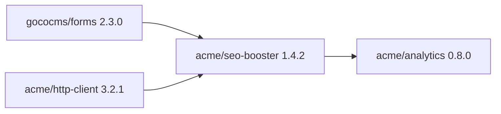
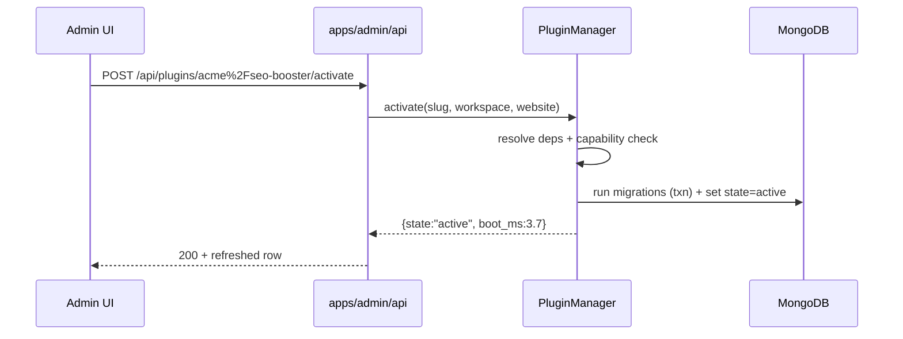

# Plugin Engine

> The Plugin Engine is GOCO CMS's extensibility runtime: it discovers, resolves, installs, boots, and sandboxes plugins that add routes, widgets, hooks, CLI commands, capabilities, settings, admin pages, MongoDB collections, and scheduled jobs — all without touching the core.

**Stability:** `beta` · **Package:** `gococms/plugin-engine` (`packages/plugin-engine`) · **Namespace:** `Goco\Plugin` · **SDK Facade:** `Goco\SDK\Plugin`

---

## 1. Purpose

In a "Website Operating System," the core stays lightweight and the ecosystem does the heavy lifting. The **Plugin Engine** is the subsystem responsible for the third pillar of that ecosystem (alongside [widgets](widget-engine.md) and [themes](theme-engine.md)): **plugins** — installable, versioned, self-contained units of behavior that extend the platform at runtime.

A plugin can:

- Register HTTP/API [routes](routing.md) and file-based REST endpoints.
- Register [widgets](widget-engine.md) and their property schemas.
- Listen to and filter [hooks](../architecture/event-hook-system.md).
- Add `goco` [CLI](../sdk/cli.md) commands.
- Declare and enforce RBAC [capabilities](../architecture/permission-system.md).
- Expose typed settings and an admin dashboard page.
- Own MongoDB collections and run schema migrations.
- Schedule background [jobs](../architecture/caching-and-queue.md).

The engine guarantees that all of this happens **safely, in dependency order, idempotently, and reversibly** — a plugin that is deactivated leaves no dangling routes, timers, or hook listeners, and a plugin that is uninstalled cleanly reverts its migrations.

> **Note**
> A plugin is a **behavioral** extension. If you only need reusable rendering, ship a [widget](widget-engine.md); if you only need presentation, ship a [theme](theme-engine.md). Reach for a plugin when you need to persist data, own routes, run jobs, or gate capabilities.

---

## 2. Functional Specification

### 2.1 Responsibilities

| Concern | Description |
| --- | --- |
| **Discovery** | Scan `plugins/` and Composer-installed `gococms/*` packages for `plugin.json` manifests. |
| **Resolution** | Build a dependency graph, validate `requires` compatibility ranges, produce a boot order. |
| **Lifecycle** | Move each plugin through `discovered → installed → active → inactive → uninstalled`. |
| **Registration** | Bind the plugin's routes, widgets, hooks, CLI commands, capabilities, settings, admin pages, collections, and jobs into the runtime. |
| **Migration** | Run forward migrations on install/activate and rollback migrations on uninstall. |
| **Isolation** | Namespace hooks, capabilities, settings, and collections per plugin slug; enforce capability gating. |
| **Update** | Detect newer versions, run intervening migrations, hot-reload service providers. |

### 2.2 Non-Goals

- The engine does **not** compile or transpile plugin code. PHP autoloading is handled by Composer PSR-4 or a manifest-declared classmap.
- It does **not** provide a general-purpose OS-level sandbox. Isolation is logical (namespacing + capability gating), not a process/VM boundary. See [§12 Security Model](#12-security-model).
- It does **not** manage theme layouts or widget rendering directly — it delegates to the [Theme Engine](theme-engine.md) and [Widget Engine](widget-engine.md).

### 2.3 Runtime Context

The engine runs inside the **ZealPHP / OpenSwoole** application (see [ZealPHP Foundation](../architecture/zealphp-foundation.md)). Plugins are discovered once at worker start, and their **service providers** register long-lived bindings into the process. Because OpenSwoole is a persistent, multi-worker runtime, plugin registration is **per-worker** and must be **stateless across requests** — per-request state belongs in `\ZealPHP\G` / `RequestContext`, never in provider properties.

---

## 3. Business Requirements

| # | Requirement | Rationale |
| --- | --- | --- |
| BR-1 | Install/activate/deactivate/uninstall must be **idempotent and reversible**. | Operators must recover from partial failures without corrupting state. |
| BR-2 | A plugin must declare exact **compatibility ranges** for `goco` and `php`. | Prevents activating a plugin against an unsupported core. |
| BR-3 | Dependencies must resolve **transitively and deterministically**. | Reproducible boots across environments. |
| BR-4 | Every capability, setting, hook, and collection is **namespaced by slug**. | Prevents cross-plugin collisions in a multi-tenant deployment. |
| BR-5 | Plugin state (installed/active) is **scoped per (workspace, website)**. | A plugin may be active for one tenant and inactive for another. |
| BR-6 | Boot cost must be **bounded and observable**; heavy plugins load lazily. | Persistent-runtime cold-start budget is finite. |
| BR-7 | All lifecycle transitions emit **audit events**. | Compliance and operator visibility. |
| BR-8 | Uninstall must offer **data retention choice** (purge vs. keep collections). | GDPR / operator policy. |

---

## 4. User Stories

- **As a developer**, I run `goco make:plugin acme/seo-booster` and get a scaffolded plugin with a manifest, service provider, and test skeleton, so I can start coding in seconds.
- **As a website-admin**, I browse the [Marketplace](../marketplace/overview.md), install a plugin for my current website only, and activate it without affecting other tenants.
- **As an operator**, I run `goco plugin:list` and see each plugin's version, state, dependencies, and health, so I can audit what is running.
- **As a plugin author**, I declare a dependency on `gococms/forms ^2.1` and trust the engine to refuse activation if that dependency is missing or incompatible.
- **As a security engineer**, I confirm that a plugin cannot invoke a capability it did not declare, because the engine gates every guarded action against the plugin's granted capability set.
- **As an editor**, I open a plugin's admin dashboard page and change its settings, which persist per website and take effect without a redeploy.
- **As an SRE**, I uninstall a plugin and choose to retain its collections, so historical data survives while the code is removed.

---

## 5. Data Model (MongoDB Collections & Indexes)

The engine owns two collections: `plugins` (registry + state) and `plugin_settings` (per-tenant configuration). Both follow the [canonical document contract](../architecture/data-model.md) (`_id`, `created_at`, `updated_at`, `deleted_at`, `version`, `created_by`, `updated_by`; tenant docs add `workspace_id`, `website_id`).

### 5.1 `plugins`

Tracks each plugin's installed manifest snapshot and per-tenant activation state.

```json
{
  "_id": "ObjectId",
  "workspace_id": "ObjectId",
  "website_id": "ObjectId | null",
  "slug": "acme/seo-booster",
  "name": "SEO Booster",
  "installed_version": "1.4.2",
  "state": "active",
  "manifest": { "requires": { "goco": "^0.9", "php": "^8.4" }, "dependencies": {}, "capabilities": ["seo.manage"] },
  "source": { "type": "marketplace", "package": "acme/seo-booster", "checksum": "sha256:..." },
  "applied_migrations": ["2026_01_10_000001_create_seo_reports", "2026_02_02_000002_add_index"],
  "boot_order": 42,
  "activated_at": "ISODate",
  "activated_by": "ObjectId",
  "health": { "status": "healthy", "last_boot_ms": 3.7, "last_error": null },
  "created_at": "ISODate", "updated_at": "ISODate", "deleted_at": null,
  "version": 6, "created_by": "ObjectId", "updated_by": "ObjectId"
}
```

**Indexes:**

```javascript
db.plugins.createIndex({ workspace_id: 1, website_id: 1, slug: 1 }, { unique: true, name: "uniq_tenant_slug" })
db.plugins.createIndex({ workspace_id: 1, state: 1 }, { name: "by_state" })
db.plugins.createIndex({ slug: 1, installed_version: 1 }, { name: "by_version" })
db.plugins.createIndex({ deleted_at: 1 }, { name: "soft_delete", sparse: true })
```

A `website_id` of `null` denotes a **workspace-wide** plugin (active for every website in the workspace). The unique index treats `null` as a distinct key, so a plugin can be workspace-wide *and* have per-website overrides without collision.

### 5.2 `plugin_settings`

Typed, per-tenant settings for a plugin, validated against the plugin's declared setting schema.

```json
{
  "_id": "ObjectId",
  "workspace_id": "ObjectId",
  "website_id": "ObjectId",
  "slug": "acme/seo-booster",
  "values": { "default_meta_robots": "index,follow", "sitemap_ping": true },
  "schema_version": 3,
  "created_at": "ISODate", "updated_at": "ISODate", "deleted_at": null,
  "version": 4, "created_by": "ObjectId", "updated_by": "ObjectId"
}
```

**Indexes:**

```javascript
db.plugin_settings.createIndex({ workspace_id: 1, website_id: 1, slug: 1 }, { unique: true, name: "uniq_tenant_plugin" })
```

### 5.3 JSON-Schema Validator (excerpt)

```javascript
db.runCommand({
  collMod: "plugins",
  validator: { $jsonSchema: {
    bsonType: "object",
    required: ["slug", "installed_version", "state", "workspace_id"],
    properties: {
      slug: { bsonType: "string", pattern: "^[a-z0-9-]+/[a-z0-9-]+$" },
      installed_version: { bsonType: "string", pattern: "^\\d+\\.\\d+\\.\\d+" },
      state: { enum: ["discovered", "installed", "active", "inactive", "failed"] }
    }
  }},
  validationLevel: "moderate"
})
```

> **Note**
> Plugin-owned collections (e.g. `seo_reports`) are created by the plugin's **migrations**, not by the engine. The engine records only *which* migrations ran, in `plugins.applied_migrations`.

---

## 6. Folder Structure

### 6.1 Engine package

```text
packages/plugin-engine/
├── src/
│   ├── PluginEngine.php            # Facade backend + orchestrator
│   ├── PluginManager.php           # Lifecycle state machine
│   ├── Discovery/
│   │   ├── Scanner.php             # Walks plugins/ and Composer metadata
│   │   └── ManifestLoader.php      # Parses + validates plugin.json
│   ├── Resolver/
│   │   ├── DependencyGraph.php     # Topological sort
│   │   └── VersionConstraint.php   # semver range matching
│   ├── ServiceProvider.php         # Abstract base provider
│   ├── Registrar/                  # Route/Widget/Hook/Cli/Capability/Job registrars
│   ├── Migration/
│   │   ├── Migrator.php            # up()/down() runner
│   │   └── Migration.php           # abstract migration
│   ├── Sandbox/
│   │   ├── CapabilityGate.php      # enforces declared capabilities
│   │   └── ScopedContainer.php     # per-plugin DI scope
│   └── Support/PluginContext.php
├── tests/
└── composer.json                   # name: gococms/plugin-engine
```

### 6.2 A plugin package (authored via `goco make:plugin`)

```text
plugins/acme-seo-booster/
├── plugin.json                     # manifest (see §7)
├── composer.json                   # optional; PSR-4 autoload
├── src/
│   ├── SeoBoosterProvider.php      # extends Goco\Plugin\ServiceProvider
│   ├── Http/SitemapController.php
│   ├── Widgets/MetaWidget.php
│   ├── Cli/RebuildSitemapCommand.php
│   └── Jobs/PingSearchEngines.php
├── migrations/
│   └── 2026_01_10_000001_create_seo_reports.php
├── settings/schema.php             # PropertySchema for admin page
├── admin/dashboard.php             # ZealPHP view for the admin page
├── routes/api.php                  # file-based REST endpoints
├── resources/lang/en.json
└── tests/
```

---

## 7. API Design

### 7.1 `plugin.json` manifest schema

The manifest is the single source of truth for identity, compatibility, and what the plugin registers. It is validated on discovery.

```json
{
  "name": "SEO Booster",
  "slug": "acme/seo-booster",
  "version": "1.4.2",
  "description": "Automatic meta tags, sitemaps, and search-engine pings.",
  "license": "MIT",
  "author": { "name": "Acme Labs", "url": "https://acme.dev" },
  "requires": {
    "goco": "^0.9",
    "php": "^8.4"
  },
  "dependencies": {
    "gococms/forms": "^2.1",
    "acme/http-client": "^3.0 <3.4.0"
  },
  "provider": "Acme\\SeoBooster\\SeoBoosterProvider",
  "autoload": {
    "psr-4": { "Acme\\SeoBooster\\": "src/" }
  },
  "capabilities": ["seo.manage", "seo.reports.read"],
  "settings": "settings/schema.php",
  "admin": {
    "page": "admin/dashboard.php",
    "title": "SEO Booster",
    "icon": "search",
    "capability": "seo.manage"
  },
  "collections": ["seo_reports"],
  "migrations": "migrations/",
  "jobs": [
    { "handler": "Acme\\SeoBooster\\Jobs\\PingSearchEngines", "schedule": "0 */6 * * *" }
  ],
  "stability": "beta"
}
```

**Field reference:**

| Field | Type | Required | Notes |
| --- | --- | --- | --- |
| `name` | string | yes | Human-readable display name. |
| `slug` | string | yes | `vendor/name`, lowercase, unique; the namespace root for hooks/caps/settings. |
| `version` | string | yes | SemVer; must match `plugins.installed_version` on activation. |
| `requires.goco` | semver range | yes | Core compatibility; activation refused if unmet. |
| `requires.php` | semver range | yes | Runtime compatibility. |
| `dependencies` | map<slug, range> | no | Other plugins/packages; resolved transitively. |
| `provider` | FQCN | yes | Extends `Goco\Plugin\ServiceProvider`. |
| `autoload.psr-4` | map | conditional | Required if no `composer.json` provides autoloading. |
| `capabilities` | string[] | no | `resource.action` strings the plugin declares and may enforce. |
| `settings` | path | no | Returns a `PropertySchema` for validation + admin form. |
| `admin` | object | no | Registers a dashboard page; `capability` gates access. |
| `collections` | string[] | no | Declared Mongo collections (documentation + purge scope). |
| `migrations` | path | no | Directory of ordered migration files. |
| `jobs` | array | no | Scheduled handlers with cron expressions. |
| `stability` | enum | no | `stable`/`beta`/`experimental`/`deprecated`. |

### 7.2 SDK facade — `Goco\SDK\Plugin`

Use these **exact** signatures. Full guide: [Plugin SDK](../sdk/plugin-sdk.md).

```php
use Goco\SDK\Plugin;

Plugin::register(string $slug, array $manifest): void;   // register manifest at boot
Plugin::install(string $slug): void;                     // run forward migrations, mark installed
Plugin::boot(string $slug): void;                        // invoke provider boot(), wire registrations
Plugin::routes(callable $registrar): void;               // register HTTP/API routes
Plugin::permissions(array $caps): void;                  // declare capabilities
```

### 7.3 Service provider contract

Every plugin ships one provider. `register()` binds services (cheap, no I/O); `boot()` wires runtime registrations (routes, hooks, widgets, jobs).

```php
namespace Acme\SeoBooster;

use Goco\Plugin\ServiceProvider;
use Goco\Plugin\PluginContext;
use Goco\SDK\{Plugin, Widget, Hook};

final class SeoBoosterProvider extends ServiceProvider
{
    /** Cheap bindings only — runs on every worker at discovery. No DB, no network. */
    public function register(PluginContext $ctx): void
    {
        $ctx->bind(SitemapBuilder::class, fn () => new SitemapBuilder($ctx->settings()));
    }

    /** Runtime wiring — runs when the plugin is active for the current tenant. */
    public function boot(PluginContext $ctx): void
    {
        Plugin::routes(function ($app) {
            $app->route('/sitemap.xml', [Http\SitemapController::class, 'index']);
        });

        Widget::register('acme/meta-tags', Widgets\MetaWidget::class);

        Hook::filter('page.title', [$this, 'appendBrand'], priority: 20);
        Hook::listen('content.published', [$this, 'queuePing']);
    }

    /** Optional lifecycle callbacks. */
    public function activate(PluginContext $ctx): void { /* seed defaults */ }
    public function deactivate(PluginContext $ctx): void { /* release resources */ }
    public function uninstall(PluginContext $ctx, bool $purgeData): void { /* rollback if $purgeData */ }
}
```

---

## 8. Services

| Service | Responsibility |
| --- | --- |
| `PluginManager` | The lifecycle state machine; the only writer of `plugins.state`. |
| `Discovery\Scanner` | Enumerates candidate plugins from `plugins/` and Composer's installed-package metadata. |
| `Discovery\ManifestLoader` | Parses and JSON-Schema-validates each `plugin.json`. |
| `Resolver\DependencyGraph` | Topologically sorts plugins; detects cycles; produces `boot_order`. |
| `Resolver\VersionConstraint` | Evaluates SemVer ranges (`^`, `~`, `>=`, `<`, hyphen, `||`) against installed versions. |
| `Migration\Migrator` | Runs `up()`/`down()` inside a Mongo transaction; records into `applied_migrations`. |
| `Registrar\*` | Bind routes, widgets, hooks, CLI commands, capabilities, and jobs. |
| `Sandbox\CapabilityGate` | Verifies a guarded action is covered by the plugin's declared + granted capabilities. |
| `Sandbox\ScopedContainer` | A per-plugin DI child scope so bindings never leak across plugins. |

### 8.1 Dependency resolution & version compatibility

Given the discovered manifest set, the resolver:

1. Validates each `requires.goco` and `requires.php` against the running versions; a miss marks the plugin `failed` with a clear reason and excludes it from the graph.
2. Adds an edge `A → B` for every entry in `A.dependencies`, resolving `B`'s installed version against the declared range.
3. Runs a topological sort; a cycle raises `CircularDependencyException` naming the cycle.
4. Emits `boot_order` (ascending) persisted onto each `plugins` doc.



Range examples: `^0.9` matches `0.9.x` and `0.10.x` (pre-1.0 caret is minor-locked per SemVer §4), `~2.1` matches `2.1.x`, `^3.0 <3.4.0` intersects both constraints, `1.2 || >=2.0` unions them.

---

## 9. Events

Lifecycle transitions emit hooks (see [Event & Hook System](../architecture/event-hook-system.md)) and write to `audit_logs`.

| Event | When | Payload |
| --- | --- | --- |
| `plugin.discovering` / `plugin.discovered` | Manifest scan | `slug`, `manifest` |
| `plugin.installing` / `plugin.installed` | Migrations applied | `slug`, `version`, `migrations` |
| `plugin.activating` / `plugin.activated` | Provider booted for tenant | `slug`, `workspace_id`, `website_id` |
| `plugin.deactivating` / `plugin.deactivated` | Registrations torn down | `slug`, `workspace_id`, `website_id` |
| `plugin.uninstalling` / `plugin.uninstalled` | Rollback complete | `slug`, `purged` (bool) |
| `plugin.updating` / `plugin.updated` | Version bump applied | `slug`, `from`, `to` |
| `plugin.failed` | Any lifecycle error | `slug`, `phase`, `error` |

```php
use Goco\SDK\Hook;

Hook::listen('plugin.activated', function (string $slug, string $workspaceId, ?string $websiteId) {
    // warm caches, register domain routes, etc.
}, priority: 10);
```

Use `Hook::dispatchAsync('plugin.installed', ...)` for non-blocking side effects (e.g. notifications) so lifecycle latency stays bounded.

---

## 10. Hooks

The engine both **dispatches** its own lifecycle events (§9) and provides **filters** that let other code shape plugin behavior. Plugin-authored hooks are namespaced by slug (`acme/seo-booster:report.generated`).

**Actions dispatched by the engine:** all `plugin.*` events in §9, plus `plugin.migrating` / `plugin.migrated`.

**Filters applied by the engine:**

| Filter | Value | Purpose |
| --- | --- | --- |
| `plugin.manifest` | manifest array | Mutate/augment a manifest before validation. |
| `plugin.boot_order` | int[] of slugs | Override the computed boot order. |
| `plugin.capabilities` | string[] | Restrict/expand a plugin's grantable capabilities. |
| `plugin.settings.schema` | `PropertySchema` | Adjust a plugin's settings schema. |

```php
Hook::filter('plugin.capabilities', function (array $caps, string $slug) {
    // Deny a risky capability for untrusted vendors.
    return $slug === 'untrusted/foo' ? array_diff($caps, ['users.manage']) : $caps;
}, priority: 5);
```

---

## 11. UI Architecture

Plugins surface in two admin areas of the [admin app](../getting-started/project-structure.md):

- **Plugin Manager** (`apps/admin`) — a list/detail view backed by `plugins`, showing state, version, dependencies, health, and Install/Activate/Deactivate/Uninstall actions. Every action is capability-gated (`plugins.manage`) and scoped to the current (workspace, website).
- **Plugin dashboard pages** — each plugin's declared `admin.page` renders as a ZealPHP view via `App::render()`, mounted under `/admin/plugins/{slug}`. Access is gated by the manifest's `admin.capability`.



Settings forms are generated from the plugin's `settings/schema.php` `PropertySchema` — the same schema drives runtime validation and the admin form, so they never drift.

---

## 12. Security Model

> **Warning**
> Plugins execute **in-process** with full PHP privileges. GOCO's isolation is **logical**, not a hard sandbox. Only install plugins from trusted sources or the vetted [Marketplace](../marketplace/overview.md).

Layered controls (see [Security Model](../security/security-model.md) and [Permission System](../architecture/permission-system.md)):

1. **Manifest validation** — malformed/unsafe manifests are rejected at discovery; `slug`, `version`, and `requires` patterns are enforced by JSON-Schema.
2. **Capability gating** — the `CapabilityGate` allows a plugin to invoke a guarded action only if that capability appears in the plugin's declared `capabilities` **and** the acting user's [RBAC](../architecture/permission-system.md) grants it for the (workspace, website) scope. Undeclared capabilities throw `CapabilityDeniedException`.
3. **Scoped DI container** — each plugin resolves through a `ScopedContainer` child scope; it cannot rebind or read another plugin's private bindings.
4. **Namespaced surfaces** — hooks, settings keys, and collection ownership are prefixed by slug, preventing cross-plugin tampering and collisions in multi-tenant DBs.
5. **Signature & checksum** — Marketplace packages carry a `sha256` checksum recorded in `plugins.source.checksum`; a mismatch blocks install.
6. **Install-time review** — `plugins.manage` capability is required to install/activate; all transitions land in `audit_logs` with actor and scope.
7. **Trust tiers** — the `plugin.capabilities` filter lets operators strip dangerous capabilities (`users.manage`, `plugins.manage`) from lower-trust vendors.

Tenant isolation is enforced by the [multi-tenancy](../architecture/multi-tenancy.md) layer: a plugin's queries are automatically constrained to the active `workspace_id`/`website_id` via the repository scope in [`Goco\Database`](../architecture/database-mongodb.md).

---

## 13. Performance Strategy

The persistent OpenSwoole runtime makes boot cost a one-time-per-worker expense, but it must stay bounded.

- **Two-phase providers.** `register()` must be I/O-free (bindings only); `boot()` does the wiring. This keeps discovery — which runs for *all* plugins — cheap.
- **Lazy activation.** Only plugins whose `plugins.state = active` for the current tenant are booted. Route/widget/job registration for inactive plugins is skipped entirely.
- **Lazy service resolution.** Providers bind **closures**, not instances; a service is constructed on first use, so an unused feature costs nothing.
- **Compiled manifest cache.** The discovery result (validated manifests + boot order) is cached in [Redis](../architecture/caching-and-queue.md) and invalidated on any lifecycle transition, so workers skip re-scanning the filesystem.
- **Boot budget & telemetry.** Each plugin's `boot()` is timed; `last_boot_ms` is recorded on the health sub-doc. A plugin exceeding the configured budget is flagged in the Plugin Manager.
- **Shared cross-worker state.** Plugins needing shared counters/state use `\ZealPHP\Store` / `\ZealPHP\Counter` rather than per-request rebuilds; expensive read models are precomputed by scheduled [jobs](../architecture/caching-and-queue.md).
- **Async side effects.** Lifecycle notifications use `Hook::dispatchAsync` and the Redis queue so activation latency is not held hostage to email/webhooks.

---

## 14. Testing Strategy

See the project-wide [Testing Strategy](../community/testing-strategy.md). For the engine and for plugin authors:

| Layer | What | Tooling |
| --- | --- | --- |
| **Manifest** | `plugin.json` validates against the schema; ranges parse. | Schema unit tests |
| **Resolver** | Topological ordering, cycle detection, range intersection. | Property/unit tests |
| **Lifecycle** | install→activate→deactivate→uninstall is idempotent and reversible; migrations roll back cleanly. | Integration tests on an ephemeral Mongo container |
| **Registration** | Routes/widgets/hooks/jobs appear only while active; disappear on deactivate. | Runtime harness |
| **Capability gate** | Undeclared capability is denied; declared+granted is allowed. | Security tests |
| **Tenant scope** | A plugin active for website A is inert for website B. | Multi-tenant integration tests |

The `goco` CLI provides a plugin test harness that boots a plugin in isolation:

```bash
goco plugin:test plugins/acme-seo-booster --coverage
```

```php
// tests/ActivationTest.php
public function test_activation_registers_sitemap_route(): void
{
    $tenant = $this->tenant();                       // ephemeral workspace+website
    Plugin::install('acme/seo-booster');
    Plugin::boot('acme/seo-booster');

    $this->assertRouteRegistered('GET', '/sitemap.xml');
    $this->assertCollectionExists('seo_reports');

    $this->manager->deactivate('acme/seo-booster', $tenant);
    $this->assertRouteNotRegistered('GET', '/sitemap.xml');
}
```

---

## 15. Extension Points

The engine is itself extensible via the [Plugin SDK](../sdk/plugin-sdk.md) and hooks:

- **Custom discovery sources** — implement `Discovery\SourceInterface` to load plugins from a private registry or object store.
- **Custom manifest transforms** — the `plugin.manifest` filter (§10) lets you inject defaults or enforce org policy.
- **Custom lifecycle side effects** — listen to any `plugin.*` action to warm caches, sync CDNs, or notify.
- **Boot-order override** — the `plugin.boot_order` filter for advanced scheduling.
- **Custom registrars** — register additional `Registrar\*` implementations so plugins can declare new resource types (e.g. GraphQL schema fragments).
- **CLI generators** — `goco make:plugin`, `goco make:migration`, and `goco make:provider` scaffold conforming code; see the [CLI Reference](../reference/cli-reference.md).

```php
// A minimal plugin registered entirely from a manifest callable.
Plugin::register('acme/redirects', [
    'name' => 'Redirects',
    'version' => '1.0.0',
    'requires' => ['goco' => '^0.9', 'php' => '^8.4'],
    'boot' => function ($ctx) {
        Plugin::routes(fn ($app) =>
            $app->route('/{path:.*}', [\Acme\Redirects\Handler::class, 'maybeRedirect'])
        );
    },
]);
```

---

## 16. Upgrade Strategy

- **Version detection.** On discovery, if a plugin's manifest `version` exceeds `plugins.installed_version`, the plugin is marked `update-available`.
- **Migration replay.** `goco plugin:update acme/seo-booster` runs only migrations not present in `applied_migrations`, inside a Mongo transaction, and updates `installed_version`. A failed migration rolls back the transaction and leaves state unchanged.
- **Compatibility re-check.** The new manifest's `requires.goco`/`requires.php` and `dependencies` are re-validated before any migration runs; incompatibility aborts the update.
- **Hot reload.** After a successful update, the plugin's service provider is re-registered on the next worker cycle (or immediately via `goco plugin:reload`), so no full redeploy is required for pure-code changes.
- **Rollback.** `goco plugin:rollback acme/seo-booster --to 1.3.0` runs `down()` for migrations newer than the target and restores the prior manifest snapshot.
- **Deprecation.** A manifest may mark itself `deprecated`; the Plugin Manager surfaces a warning and, optionally, a `replacement` slug.
- **Engine SemVer.** The `requires.goco` range is the contract: within a minor series, plugin-facing APIs are additive-only. Breaking changes bump the core minor (pre-1.0) and are listed in the [Changelog](../changelog.md).

---

## 17. Future Roadmap

Aligned with the [project roadmap](../roadmap.md):

- **`experimental`** — WASM-backed plugin sandbox for untrusted third-party code (true isolation boundary).
- **`experimental`** — Signed plugin bundles with vendor key pinning and a supply-chain attestation trail.
- **`beta`** — Cross-website plugin configuration inheritance (workspace defaults → per-website overrides UI).
- **`beta`** — Hot dependency upgrades with automatic compatibility probing across the dependency graph.
- **`planned`** — A plugin dev-loop with file-watch reload and per-plugin structured log streaming from `/tmp/zealphp/`.
- **`planned`** — First-class GraphQL and gRPC registrars alongside REST.
- **`planned`** — Marketplace-driven staged rollouts (canary a plugin update to a subset of tenants).

---

## Related

- [Plugin SDK](../sdk/plugin-sdk.md) — author-facing facade and helpers.
- [Plugin Guide](../guides/plugin-guide.md) — step-by-step tutorial.
- [Widget Engine](widget-engine.md) · [Theme Engine](theme-engine.md) · [Template Engine](template-engine.md)
- [Event & Hook System](../architecture/event-hook-system.md) · [Hook SDK](../sdk/hook-sdk.md)
- [Permission System (RBAC + ABAC)](../architecture/permission-system.md) · [Security Model](../security/security-model.md)
- [MongoDB Data Layer](../architecture/database-mongodb.md) · [Data Model](../architecture/data-model.md)
- [Multi-Tenancy](../architecture/multi-tenancy.md) · [Caching, Queue & Realtime](../architecture/caching-and-queue.md)
- [Plugin Marketplace](../marketplace/overview.md) · [CLI Reference](../reference/cli-reference.md)
- [Documentation Index](../README.md)
