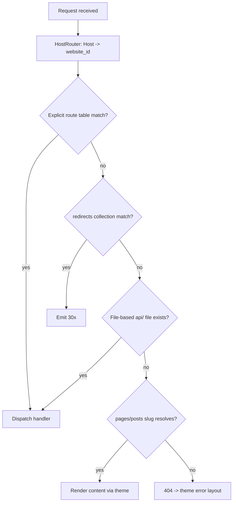

# Routing

> The GOCO routing layer maps incoming HTTP/WebSocket requests to handlers across the admin, API, and website surfaces — combining ZealPHP's Flask-style declarative routes, file-based REST endpoints, tenant host resolution, and MongoDB-backed pretty URLs, slugs, and redirects.

**Stability:** `stable` (core route kernel) · `beta` (file-based REST auto-discovery, pattern routes) · `experimental` (edge-cached slug resolution)

Routing is the front door of the Website Operating System. Every request — an editor opening the Page Builder, a plugin exposing a webhook, a visitor hitting a marketing page on a custom domain — enters through the same kernel, is resolved against a route table plus the Mongo `pages`/`posts`/`redirects` collections, and is dispatched to a coroutine handler. This document specifies that kernel against the real ZealPHP API and the GOCO SDK facades.

---

## 1. Purpose

The routing module answers one question on every request: **"Which website, which handler, with which parameters?"** It provides:

- A thin GOCO layer over ZealPHP's `App::route()` / `nsRoute()` / `patternRoute()` primitives, adding named routes, URL generation, route groups, and per-group middleware.
- Three logical route surfaces — `apps/admin`, `apps/api`, `apps/website` — each with distinct conventions, middleware defaults, and security posture.
- File-based REST auto-discovery: dropping `api/foo/bar.php` into an app publishes `GET /api/foo/bar`.
- **Tenant-aware routing**: mapping an inbound `Host` header to a `websites` document (via the `domains` collection) before any content route runs.
- **Pretty URLs**: resolving human-readable slugs for pages and posts out of MongoDB, honoring hierarchical page paths (`/company/team/history`).
- A **redirects** subsystem (301/302/307/308, wildcard and regex) resolved from the `redirects` collection.
- Deterministic 404 and error routing that renders the active theme's error layouts.

> **Note** GOCO never replaces ZealPHP's router — it composes with it. If you know ZealPHP routing, you already know 80% of GOCO routing.

---

## 2. Functional Specification

### 2.1 Route surfaces

| Surface | App dir | Base path convention | Default middleware stack | Auth model |
| --- | --- | --- | --- | --- |
| Admin | `apps/admin` | `/admin/*` (host `admin.<domain>` optional) | Csrf, RateLimit, Compression, ETag, session guard | Session (Redis) + RBAC |
| API | `apps/api` | `/api/*`, `/v1/*` | Cors, RateLimit, ConcurrencyLimit, MimeType(JSON) | JWT / OAuth2 / API key |
| Website | `apps/website` | `/*` (public, tenant-scoped) | HostRouter, Compression, ETag, Range, Redirect | Anonymous + optional session |

### 2.2 Registration styles

1. **Declarative** — `$app->route('/hello/{name}', $handler)` in an app's `src/routes.php`.
2. **Namespaced** — `$app->nsRoute('admin', '/pages/{id}', $handler)` groups routes under a URL + logical namespace.
3. **Pattern** — `$app->patternRoute('/blog/{year:\d{4}}/{slug}', $handler)` with inline regex constraints.
4. **File-based REST** — a PHP file under `api/` returns an `array`/`Generator`, auto-serialized to JSON.
5. **SDK plugin routes** — `Plugin::routes(fn($r) => $r->route(...))` registered inside a plugin manifest boot.
6. **Content routes** — not authored by hand; synthesized from `pages`/`posts` slugs by the resolver.

### 2.3 Handler contract

A handler returns `int|array|string|Generator`:

- `array` → JSON response (`Content-Type: application/json`).
- `string` → HTML/text body (theme templates return strings via `App::renderToString()`).
- `int` → treated as an HTTP status with an empty/standard body.
- `Generator` → streamed chunked response (SSE, large exports, server-rendered fragments).

Parameters are injected **by name via reflection**: a param named `$name` receives the `{name}` path segment; `$request` and `$response` receive the ZealPHP request/response objects; GOCO additionally injects `$ctx` (a `Goco\Http\Context`) and `$website` (the resolved tenant) when the handler declares them.

### 2.4 Resolution order

For any inbound request the kernel evaluates candidates in this fixed order (first match wins):



---

## 3. Business Requirements

| # | Requirement | Rationale |
| --- | --- | --- |
| BR-1 | A single deployment must serve unlimited tenants on distinct domains without per-tenant code. | Multi-tenant WebOS; see [multi-tenancy](../architecture/multi-tenancy.md). |
| BR-2 | Editors change a page slug and the URL updates instantly; the old URL 301-redirects. | SEO preservation; no broken links. |
| BR-3 | Plugins register routes without touching core files. | Ecosystem extensibility; see [Plugin SDK](../sdk/plugin-sdk.md). |
| BR-4 | API routes must be independently rate-limited and versioned. | Public API stability; see [API Reference](../reference/api-reference.md). |
| BR-5 | Route resolution must add < 2 ms p99 overhead at 10k routes. | Coroutine throughput under OpenSwoole. |
| BR-6 | 404 and 5xx must render the tenant's branded error layout, not a generic page. | White-label requirement. |
| BR-7 | Redirect rules (bulk-imported from a legacy CMS) must support wildcard and regex. | Migration parity. |

---

## 4. User Stories

- **As a developer**, I register `$app->route('/webhooks/stripe', $handler)` in my plugin so Stripe can POST events, and it is auto-namespaced under my plugin slug.
- **As an editor**, I rename a page from `/about` to `/about-us` and GOCO automatically writes a 301 into the `redirects` collection so bookmarks keep working.
- **As an API consumer**, I call `GET /v1/posts?limit=20` and receive JSON, rate-limited per token, with an `ETag` for conditional GET.
- **As a website-admin**, I add the custom domain `shop.acme.com`, and the HostRouter maps it to my website with zero redeploy.
- **As an SEO manager**, I bulk-import 4,000 redirect rules from a CSV and verify none produce redirect loops.
- **As a designer**, I customize the 404 layout for one website without affecting other tenants.

---

## 5. Data Model (MongoDB collections & indexes)

Routing reads from `domains`, `pages`, `posts`, and `redirects`. Every document carries the standard envelope (`_id, created_at, updated_at, deleted_at, version, created_by, updated_by`) and tenant scope (`workspace_id, website_id`). See [Data Model](../architecture/data-model.md).

### 5.1 `redirects`

```javascript
db.createCollection("redirects", {
  validator: { $jsonSchema: {
    bsonType: "object",
    required: ["_id","workspace_id","website_id","match_type","source","target","status","enabled","created_at","updated_at","version"],
    properties: {
      workspace_id: { bsonType: "objectId" },
      website_id:   { bsonType: "objectId" },
      match_type:   { enum: ["exact","prefix","wildcard","regex"] },
      source:       { bsonType: "string", description: "path or pattern, no host" },
      source_regex: { bsonType: ["string","null"], description: "compiled PCRE when match_type=regex" },
      target:       { bsonType: "string", description: "path or absolute URL; may contain $1..$n captures" },
      status:       { enum: [301,302,307,308] },
      enabled:      { bsonType: "bool" },
      preserve_query: { bsonType: "bool" },
      hits:         { bsonType: "long", description: "resolution counter" },
      last_hit_at:  { bsonType: ["date","null"] },
      note:         { bsonType: ["string","null"] }
    }
  }}
});

// Fast exact/prefix lookups scoped to a tenant, excluding soft-deleted rows.
db.redirects.createIndex(
  { website_id: 1, match_type: 1, source: 1 },
  { partialFilterExpression: { deleted_at: null, enabled: true } }
);
db.redirects.createIndex({ website_id: 1, enabled: 1 });
```

### 5.2 Slug fields on `pages` / `posts`

Content routing relies on slug and path fields already present on content docs:

```javascript
// pages: hierarchical path materialized for O(1) lookup
db.pages.createIndex(
  { website_id: 1, path: 1 },
  { unique: true, partialFilterExpression: { deleted_at: null } }
);
db.pages.createIndex({ website_id: 1, parent_id: 1, slug: 1 });

// posts: flat slug, optionally date-prefixed
db.posts.createIndex(
  { website_id: 1, slug: 1 },
  { unique: true, partialFilterExpression: { deleted_at: null } }
);
```

Representative documents:

```json
{
  "_id": "66f0…",
  "workspace_id": "6600…",
  "website_id": "6611…",
  "title": "Our Team",
  "slug": "team",
  "parent_id": "66ef…",
  "path": "/company/team",
  "status": "published",
  "version": 4
}
```

```json
{
  "match_type": "wildcard",
  "source": "/old-blog/*",
  "target": "/blog/$1",
  "status": 301,
  "enabled": true,
  "preserve_query": true,
  "hits": 812
}
```

### 5.3 `domains` (host resolution)

```javascript
db.domains.createIndex({ hostname: 1 }, { unique: true });
db.domains.createIndex({ website_id: 1, is_primary: 1 });
```

A `domains` doc binds a `hostname` (e.g. `shop.acme.com`) to a `website_id`, plus TLS status and an optional `redirect_to` for domain-level canonicalization (`www` → apex).

---

## 6. Folder Structure

```text
packages/
  routing/                     # Goco\Routing — the kernel layer over ZealPHP
    src/
      RouteKernel.php          # binds ZealPHP App, orders resolution
      RouteRegistry.php        # named routes + URL generation
      RouteGroup.php           # group() + per-group middleware
      HostRouter.php           # Host -> website_id (wraps ZealPHP HostRouter middleware)
      ContentResolver.php      # slug/path -> pages|posts doc
      RedirectResolver.php     # redirects collection matcher
      ErrorRouter.php          # 404/5xx -> theme error layouts
      UrlGenerator.php         # route(name, params) + content_url(page)
    tests/
apps/
  admin/
    src/routes.php             # $app->nsRoute('admin', ...)
    api/                       # file-based admin JSON endpoints
  api/
    src/routes.php             # $app->nsRoute('api', ...) + versioned groups
    api/                       # file-based public REST (api/foo/bar.php)
  website/
    src/routes.php             # public + content fallthrough
    template/errors/           # 404.php, 500.php, maintenance.php
app.php                        # runtime entry: App::init(), $app->run()
```

---

## 7. API Design

### 7.1 Runtime bootstrap

`app.php` initializes ZealPHP, installs the GOCO kernel, then runs. The kernel is what wires host resolution, content fallthrough, and error routing into the ZealPHP `App`.

```php
<?php
require 'vendor/autoload.php';

use ZealPHP\App;
use Goco\Routing\RouteKernel;

App::superglobals(false);
App::mode(App::MODE_COROUTINE);          // modern coroutine default

$app = App::init('0.0.0.0', 8080);

// Install GOCO routing: HostRouter middleware, content + redirect + error resolvers.
RouteKernel::install($app);

// Application route tables (per surface).
require __DIR__ . '/apps/website/src/routes.php';
require __DIR__ . '/apps/admin/src/routes.php';
require __DIR__ . '/apps/api/src/routes.php';

$app->run();
```

### 7.2 Declarative routes with reflection injection

```php
// apps/website/src/routes.php
use ZealPHP\App;

$app = App::instance();

// {name} injected by reflection; $request/$response by type; $website by GOCO.
$app->route('/hello/{name}', function ($name, $request, $response, $website) {
    return ['hello' => $name, 'website' => $website->slug]; // array -> JSON
});

// Constrained pattern route.
$app->patternRoute('/blog/{year:\d{4}}/{slug}', function ($year, $slug) {
    return \Goco\Blog\Post::renderBySlug($slug, (int) $year); // string -> HTML
}, methods: ['GET']);
```

### 7.3 Namespaced routes and groups

```php
// apps/api/src/routes.php — versioned, grouped, per-group middleware
use ZealPHP\App;
use ZealPHP\Middleware\{RateLimitMiddleware, CorsMiddleware};
use Goco\Routing\RouteGroup;

$app = App::instance();

RouteGroup::create($app, [
    'namespace'  => 'api.v1',
    'prefix'     => '/v1',
    'middleware' => [
        new CorsMiddleware(),
        new RateLimitMiddleware(limit: 600, window: 60), // 600 req/min/token
    ],
], function (RouteGroup $r) {
    $r->route('/posts',        [\Goco\Api\PostController::class, 'index'],  methods: ['GET'], name: 'api.posts.index');
    $r->route('/posts/{id}',   [\Goco\Api\PostController::class, 'show'],   methods: ['GET'], name: 'api.posts.show');
    $r->route('/posts',        [\Goco\Api\PostController::class, 'store'],  methods: ['POST'], name: 'api.posts.store');
});
```

Under the hood `RouteGroup` delegates to ZealPHP's `nsRoute()` / `nsPathRoute()`, prepending the prefix and pushing the group middleware onto each route's PSR-15 chain.

### 7.4 File-based REST

Any PHP file under an app's `api/` directory becomes an endpoint at the mirrored path. The file returns an `array` or `Generator`:

```php
// apps/api/api/health/db.php  ->  GET /api/health/db
<?php
use Goco\Database\Connection;

return [
    'ok'    => Connection::ping(),
    'rt_ms' => Connection::lastPingMs(),
];
```

```php
// apps/api/api/posts/export.php  ->  GET /api/posts/export  (streamed NDJSON)
<?php
use OpenSwoole\Coroutine as co;

return (function () {
    foreach (\Goco\Blog\Post::cursor(['status' => 'published']) as $post) {
        yield json_encode($post) . "\n";
        co::sleep(0.001); // yield the coroutine between chunks
    }
})();
```

### 7.5 Named routes & URL generation

```php
use Goco\Routing\UrlGenerator;

// From a named route + params.
$href = UrlGenerator::route('api.posts.show', ['id' => $post->id]);      // /v1/posts/66f0…

// From a content document (uses the resolved path/slug + tenant primary domain).
$url  = UrlGenerator::content($page);                                    // https://acme.com/company/team
$abs  = UrlGenerator::content($post, absolute: true);                    // absolute across a custom domain
```

### 7.6 WebSocket & SSE routes

```php
// Realtime editor presence (admin surface)
$app->ws('/ws/presence/{page}',
    onOpen:    fn($server, $req) => \Goco\Admin\Presence::join($server, $req),
    onMessage: fn($server, $frame) => $server->push($frame->fd, \Goco\Admin\Presence::tick($frame)),
    onClose:   fn($server, $fd) => \Goco\Admin\Presence::leave($fd),
);

// SSE build/log stream — generator + $response->sse()
$app->route('/admin/jobs/{id}/stream', function ($id, $response) {
    return $response->sse((function () use ($id) {
        foreach (\Goco\Queue\Job::watch($id) as $event) {
            yield ['event' => $event->type, 'data' => $event->payload];
        }
    })());
});
```

### 7.7 Plugin routes via the SDK

```php
// packages/my-plugin/src/plugin.php
use Goco\SDK\Plugin;

Plugin::register('acme-shop', [
    'name'    => 'Acme Shop',
    'version' => '1.2.0',
]);

Plugin::routes(function ($r) {
    // Auto-namespaced under the plugin slug: acme-shop.*
    $r->route('/webhooks/stripe', [\Acme\Shop\Webhooks::class, 'stripe'], methods: ['POST'], name: 'stripe');
    $r->route('/shop/cart',       [\Acme\Shop\CartController::class, 'show'], methods: ['GET'], name: 'cart');
});
```

Resolved names are prefixed: `plugin.acme-shop.stripe`. See [Plugin Engine](plugin-engine.md) and [Plugin SDK](../sdk/plugin-sdk.md).

---

## 8. Services

| Service | Class | Responsibility |
| --- | --- | --- |
| Route kernel | `Goco\Routing\RouteKernel` | Installs middleware + resolvers into ZealPHP `App`; orders resolution (§2.4). |
| Registry | `Goco\Routing\RouteRegistry` | Stores named routes; the source of truth for URL generation. |
| Host router | `Goco\Routing\HostRouter` | Resolves `Host` → `website_id` using the `domains` collection; caches in Redis. |
| Content resolver | `Goco\Routing\ContentResolver` | Maps `path`/`slug` → `pages`/`posts` doc; handles hierarchical paths. |
| Redirect resolver | `Goco\Routing\RedirectResolver` | Matches the `redirects` collection (exact/prefix/wildcard/regex); loop-guards. |
| URL generator | `Goco\Routing\UrlGenerator` | `route()`, `content()`, absolute vs relative, per-tenant host. |
| Error router | `Goco\Routing\ErrorRouter` | Renders theme error layouts for 404/403/500/503. |

### 8.1 HostRouter resolution (with Redis cache)

```php
namespace Goco\Routing;

use Goco\Database\Repository;
use Goco\Cache\Redis;

final class HostRouter
{
    public function resolve(string $host): Website
    {
        $host = strtolower(rtrim($host, '.'));

        return Redis::remember("route:host:{$host}", 300, function () use ($host) {
            $domain = Repository::of('domains')->firstWhere(['hostname' => $host, 'deleted_at' => null])
                ?? throw new UnknownHostException($host);

            // Domain-level canonicalization (e.g. www -> apex) short-circuits here.
            if ($domain->redirect_to) {
                throw new DomainRedirect($domain->redirect_to, 301);
            }
            return Repository::of('websites')->find($domain->website_id);
        });
    }
}
```

### 8.2 Content resolution (hierarchical pages)

```php
public function resolve(Website $site, string $path): ?ContentMatch
{
    $path = '/' . trim($path, '/');

    // 1. Exact page path (materialized in pages.path, unique per website).
    $page = Repository::of('pages')->firstWhere([
        'website_id' => $site->id, 'path' => $path,
        'status' => 'published', 'deleted_at' => null,
    ]);
    if ($page) return ContentMatch::page($page);

    // 2. Blog post by slug (optionally under a blog base path).
    if (str_starts_with($path, $site->blog_base . '/')) {
        $slug = substr($path, strlen($site->blog_base) + 1);
        $post = Repository::of('posts')->firstWhere([
            'website_id' => $site->id, 'slug' => $slug,
            'status' => 'published', 'deleted_at' => null,
        ]);
        if ($post) return ContentMatch::post($post);
    }
    return null; // fall through to 404
}
```

---

## 9. Events

Routing emits lifecycle events through the [Event & Hook System](../architecture/event-hook-system.md). Actions use `subject.verb[.tense]`; filters use `subject.noun`.

| Event | Type | Fired when | Args |
| --- | --- | --- | --- |
| `request.received` | action | A request enters the kernel, before host resolution. | `$request` |
| `route.matched` | action | An explicit/content route is selected. | `$route, $params, $request` |
| `route.not_found` | action | No route/content/redirect matched. | `$request` |
| `redirect.resolved` | action | A `redirects` row matched. | `$redirect, $request` |
| `content.resolving` | action | Before Mongo slug/path lookup. | `$website, $path` |
| `content.resolved` | action | A page/post doc was found. | `$match, $request` |
| `response.sending` | action | Just before the response flushes. | `$response, $request` |

```php
use Goco\SDK\Hook;

Hook::listen('route.matched', function ($route, $params, $request) {
    \Goco\Analytics\Traffic::note($route->name, $request);
}, priority: 20);

Hook::listen('redirect.resolved', function ($redirect) {
    \Goco\Database\Repository::of('redirects')->increment($redirect->id, 'hits');
});
```

---

## 10. Hooks

Filters let plugins reshape routing decisions without patching core.

| Filter | Value shape | Purpose |
| --- | --- | --- |
| `query.criteria` | `array` | Amend the Mongo query used for content resolution (e.g. add a preview flag). |
| `response.headers` | `array<string,string>` | Add/override headers (security, cache, `Link` preload). |
| `route.params` | `array` | Rewrite injected params before dispatch. |
| `menu.items` | `array` | Consumed by nav widgets to build hrefs from named routes. |

```php
use Goco\SDK\Hook;

// Serve draft content to editors when ?preview=1 is present.
Hook::filter('query.criteria', function (array $criteria, $request) {
    if ($request->get['preview'] ?? false) {
        unset($criteria['status']); // allow non-published
    }
    return $criteria;
});

// Attach security headers globally (also enforceable at Traefik — see §12).
Hook::filter('response.headers', function (array $headers) {
    $headers['X-Content-Type-Options'] = 'nosniff';
    $headers['Referrer-Policy'] = 'strict-origin-when-cross-origin';
    return $headers;
});
```

See the [Hook SDK](../sdk/hook-sdk.md) for the full facade.

---

## 11. UI Architecture

Routing surfaces in three UIs:

- **Redirects manager** (`apps/admin`, `/admin/settings/redirects`): a table over the `redirects` collection with inline add, CSV import/export, live loop-detection, and a per-row `hits` counter. Requires the `settings.manage` capability.
- **Page/Post slug editor** (Page Builder & Blog Engine): editing a slug shows the resolved `path` preview and, on save, offers to auto-create a 301 from the old path. See [Page Builder](page-builder.md) and [Blog Engine](blog-engine.md).
- **Domains panel** (`/admin/settings/domains`): binds hostnames to the website, shows Traefik/Let's Encrypt TLS status, and sets the primary/canonical host.

Admin routes are server-rendered with `App::render()` and hydrated as htmx regions via `App::fragment()`, so a redirect can be added without a full page reload.

---

## 12. Security Model

| Concern | Control |
| --- | --- |
| CSRF | `Csrf` middleware on all state-changing admin routes; tokens minted per session (Redis). |
| Auth | Admin = session guard (RBAC); API = JWT/OAuth2/API key; see [Authentication](authentication.md). |
| Authorization | Route → required capability map; the kernel checks `resource.action` before dispatch. See [Permission System](../architecture/permission-system.md). |
| Rate limiting | `RateLimit` (per token/IP) at the app layer **and** Traefik middleware at the edge. |
| Open redirect prevention | Redirect targets are validated: relative paths, or absolute URLs on an allow-listed host set. |
| Redirect loops | `RedirectResolver` caps hops (default 3) and rejects rules whose target re-matches the source. |
| Host spoofing | HostRouter resolves against the `domains` allow-list; unknown hosts → 404, never a default tenant. |
| Tenant isolation | Every content/redirect query is forced to include the resolved `website_id`; cross-tenant leakage is impossible by construction. See [Multi-Tenancy](../architecture/multi-tenancy.md). |
| Method safety | File-based `api/` endpoints default to `GET`; mutating verbs must be declared explicitly. |

Route-level capability guard:

```php
$r->route('/pages/{id}', [PageController::class, 'update'], methods: ['PUT'],
    name: 'admin.pages.update',
    can: 'pages.update' // enforced by kernel before injection
);
```

Edge headers and TLS are terminated by Traefik (HTTP/3, Let's Encrypt). See [Traefik Reverse Proxy](../deployment/traefik.md).

---

## 13. Performance Strategy

- **Compiled route table**: named/explicit routes compile into a static dispatch map at worker start (`App::onWorkerStart`), so matching is O(1) hash + a small regex bucket for pattern routes.
- **Coroutine dispatch**: handlers run in OpenSwoole coroutines; blocking Mongo/Redis calls yield, keeping worker throughput high under load.
- **Host + slug caching**: `route:host:*` and `route:slug:*` keys cache resolutions in Redis (TTL 300s), invalidated on `content.published` / domain change. See [Caching, Queue & Realtime](../architecture/caching-and-queue.md).
- **ETag + Range**: `ETag` and `Range` middleware enable conditional and partial responses; unchanged pages return `304`.
- **Indexed lookups**: unique partial indexes on `pages.path` and `posts.slug` make content resolution a single covered query.
- **Redirect fast path**: exact/prefix redirects use the `{website_id, match_type, source}` index; regex rules are compiled once per worker and cached.
- **Budget**: < 2 ms p99 routing overhead at 10k routes (BR-5), verified in the routing benchmark suite.

```php
use ZealPHP\App;

App::onWorkerStart(function ($server, $wid) {
    \Goco\Routing\RouteRegistry::compile();        // freeze dispatch map
    App::tick(300000, fn() => \Goco\Routing\RedirectResolver::refreshRegexCache());
});
```

---

## 14. Testing Strategy

| Layer | Tooling | What it covers |
| --- | --- | --- |
| Unit | PHPUnit | `UrlGenerator`, `RedirectResolver` matching (exact/prefix/wildcard/regex), loop guard, host normalization. |
| Integration | PHPUnit + Testcontainers (Mongo, Redis) | Content resolution against seeded `pages`/`posts`; tenant isolation assertions. |
| Route table | Snapshot tests | Registered route names, methods, and capability maps do not silently change. |
| HTTP contract | Coroutine HTTP client hitting a booted `App` | Status codes, `Location` headers on 30x, 404 rendering the theme error layout. |
| Security | Fuzz + property tests | Open-redirect rejection; unknown-host → 404; CSRF enforcement on mutating admin routes. |
| Performance | Benchmark harness | p99 overhead at 1k/10k routes; redirect resolution throughput. |

```php
public function test_slug_rename_creates_301(): void
{
    $page = $this->seedPage(['path' => '/about']);
    $this->put("/admin/pages/{$page->id}", ['slug' => 'about-us']);

    $redirect = Repository::of('redirects')->firstWhere(['source' => '/about']);
    $this->assertSame(301, $redirect->status);
    $this->assertSame('/about-us', $redirect->target);

    $res = $this->get('/about');
    $res->assertStatus(301)->assertHeader('Location', '/about-us');
}
```

See [Testing Strategy](../community/testing-strategy.md).

---

## 15. Extension Points

- **`Plugin::routes()`** — register routes namespaced by plugin slug; the primary extension surface.
- **File-based `api/`** — drop-in JSON endpoints, no registration code.
- **Filters** — `query.criteria`, `response.headers`, `route.params`, `route.matched` action for cross-cutting concerns.
- **Custom middleware** — implement `ZealPHP\Middleware\MiddlewareInterface::process()` and attach per-route, per-group, or globally.
- **Custom resolvers** — register an additional resolver in the fallthrough chain (e.g. a headless-commerce product resolver) via `RouteKernel::pushResolver()`.
- **Pattern constraints** — `patternRoute()` accepts arbitrary PCRE for bespoke URL schemes.

```php
use ZealPHP\Middleware\MiddlewareInterface;
use Psr\Http\Message\{ServerRequestInterface, ResponseInterface};
use Psr\Http\Server\RequestHandlerInterface;

final class MaintenanceGuard implements MiddlewareInterface
{
    public function process(ServerRequestInterface $req, RequestHandlerInterface $next): ResponseInterface
    {
        if (\Goco\Settings::flag('maintenance') && !$req->getAttribute('is_admin')) {
            return \Goco\Routing\ErrorRouter::render(503);
        }
        return $next->handle($req);
    }
}
```

---

## 16. Upgrade Strategy

- **Route naming is a public contract.** Renaming a named route is a breaking change; deprecate with an alias (`RouteRegistry::alias('old.name','new.name')`) for one minor cycle, then remove per SemVer.
- **Redirect schema** changes ship with a migration in `packages/routing/migrations`; the `match_type` enum is additive-only.
- **File-based API paths** map 1:1 to filesystem paths — moving a file changes the URL, so treat `api/` moves as breaking and add a `redirects` row.
- **Resolver order** (§2.4) is stable across minors; new resolvers append to the chain rather than reordering it.
- Deprecations surface in `goco doctor` output and the [Changelog](../changelog.md); follow [Conventional Commits](../community/coding-standards.md).

---

## 17. Future Roadmap

- `beta` → `stable` for file-based REST auto-discovery with per-file middleware headers.
- Edge slug cache pushed to Traefik/CDN via signed cache tags for sub-millisecond public routing.
- Locale-aware routing (`/{locale}/...`) with fallback chains for i18n.
- Regex-redirect visual builder with live preview and automatic loop detection in the admin UI.
- A `RemoteRoute` resolver for federating routes across a workspace's multiple deployments.
- Programmable "route policies" via the ABAC PolicyEngine (time-boxed campaign URLs, geo-gated routes).

See the project-wide [Roadmap](../roadmap.md).

---

## Related

- [Routing (ZealPHP Foundation)](../architecture/zealphp-foundation.md)
- [Request Lifecycle](../architecture/request-lifecycle.md)
- [Event & Hook System](../architecture/event-hook-system.md)
- [Multi-Tenancy](../architecture/multi-tenancy.md)
- [Data Model (Collections & Indexes)](../architecture/data-model.md)
- [Permission System (RBAC + ABAC)](../architecture/permission-system.md)
- [Caching, Queue & Realtime](../architecture/caching-and-queue.md)
- [Authentication](authentication.md)
- [Plugin Engine](plugin-engine.md)
- [Page Builder](page-builder.md)
- [Blog Engine](blog-engine.md)
- [Plugin SDK](../sdk/plugin-sdk.md)
- [Hook SDK](../sdk/hook-sdk.md)
- [API Reference](../reference/api-reference.md)
- [Traefik Reverse Proxy](../deployment/traefik.md)
- [Testing Strategy](../community/testing-strategy.md)
- [Documentation Index](../README.md)
