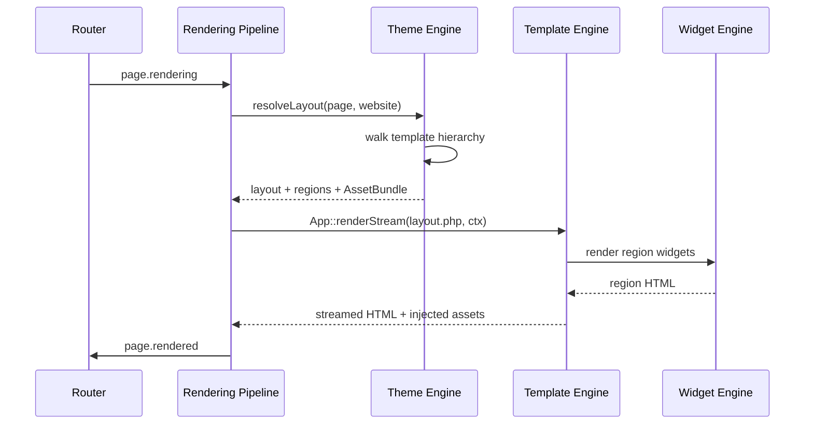
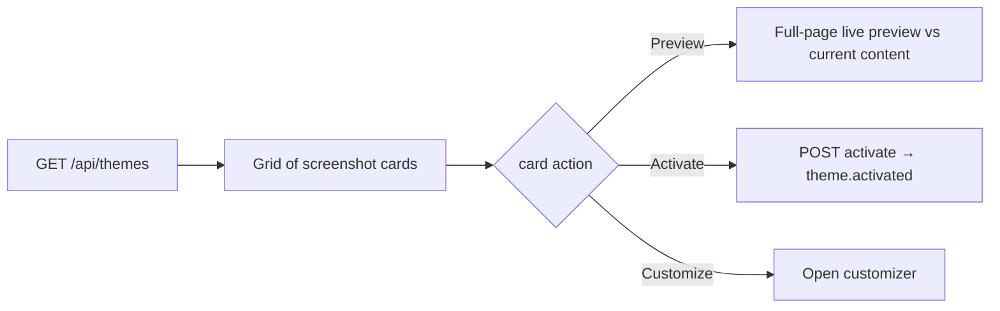

# Theme Engine

> The Theme Engine turns a MongoDB-backed manifest into the visual identity of a website — declaring layouts, regions, assets, and customizable settings — while staying strictly CSS-framework-agnostic and per-website switchable.

`stable`

The Theme Engine is the core module in GOCO CMS that answers a single question for every request: *what does this website look like?* It loads a **theme** (a versioned package of layouts, regions, asset bundles, and customizer settings), resolves which **layout** a given page should use, injects the correct **AssetBundle**, and exposes settings to the visual editor. It is the presentation counterpart to the [Template Engine](./template-engine.md): a **theme** is the packaged, distributable, per-website visual system; a **template** is a single renderable view file the theme (or a layout) points at. Keep that distinction in mind throughout this document — [see §Theme vs Template](#theme-vs-template-a-hard-boundary).

The engine lives in `packages/template-engine` (shared rendering primitives) and `core/` (activation lifecycle), and is surfaced to developers through the [`Theme` facade](../sdk/theme-sdk.md).

---

## 1. Purpose

A GOCO CMS deployment is multi-tenant: one core, many workspaces, many websites. Each website must be able to choose, switch, and customize its appearance independently, without a redeploy and without touching PHP. The Theme Engine exists to:

- **Package appearance as data.** A theme is a `theme.json` manifest plus asset and template files, registered through `Theme::register()` and persisted in the `themes` collection.
- **Decouple structure from framework.** GOCO ships no opinion about Tailwind, Bootstrap, Bulma, vanilla CSS, or a design-token system. The engine treats CSS/JS purely as declared, versioned, dependency-ordered assets.
- **Resolve layouts deterministically.** Given a page, the engine walks a documented **template hierarchy** to pick exactly one layout, then maps that layout's **regions** to widget trees.
- **Surface customization safely.** Theme-declared settings (colors, fonts, spacing, logos, toggles) reach the [Page Builder](./page-builder.md) customizer as a typed schema, are stored per-website, and are injected as CSS custom properties or template variables — never as arbitrary executable code.
- **Support inheritance.** Child themes override individual layouts, assets, or settings of a parent without forking it.
- **Switch per website at runtime.** Activation is a transactional, hook-emitting operation scoped to `(workspace_id, website_id)`.

> **Note** The Theme Engine owns *selection, activation, assets, and settings*. It delegates the actual byte-level rendering of a template file to the [Template Engine](./template-engine.md) and the population of regions to the [Widget Engine](./widget-engine.md).

---

## 2. Functional Specification

### 2.1 What a theme is

A theme is a directory under `themes/<slug>/` (in-repo, marketplace-installed, or symlinked during development) with this canonical shape:

```
themes/aurora/
  theme.json              # manifest (required)
  layouts/
    default.php           # a layout template
    full-width.php
    landing.php
    blog-archive.php
    blog-single.php
  partials/
    header.php
    footer.php
  assets/
    css/aurora.css
    js/aurora.js
    fonts/…
  customizer/
    schema.json           # optional: extracted settings schema
  screenshot.png          # theme picker thumbnail (1200×900)
  preview/                # optional live-preview fixtures
  README.md
```

### 2.2 Lifecycle

```mermaid
stateDiagram-v2
    [*] --> Discovered: scan themes/ + marketplace
    Discovered --> Registered: Theme::register(slug, manifest)
    Registered --> Installed: assets compiled, doc upserted
    Installed --> Active: Theme::activate(slug) per website
    Active --> Customized: settings saved per website
    Active --> Inactive: another theme activated
    Inactive --> Active: re-activated
    Installed --> Uninstalled: no website references it
    Uninstalled --> [*]
```

- **Discovery** — On worker start the engine scans `themes/` and the installed-plugin/marketplace registry, reading each `theme.json`.
- **Registration** — `Theme::register($slug, $manifest)` validates the manifest against the JSON-Schema, resolves parent inheritance, and caches the merged definition.
- **Installation** — Assets are compiled/fingerprinted into `storage/themes/<slug>/<version>/`, and a document is upserted into the global `themes` collection. Idempotent by `(slug, version)`.
- **Activation** — `Theme::activate($slug)` (thin wrapper over settings) writes the active slug to the website's `settings` and emits `theme.activated`. This is per `(workspace_id, website_id)`.
- **Customization** — Editors change customizer settings; values persist per website and bust the compiled-CSS cache for that website only.

### 2.3 Rendering flow (where the engine sits)



The engine never returns HTML itself; it returns a resolved **RenderPlan** (layout path, region→widget map, merged settings, AssetBundle) that the [Rendering Pipeline](../architecture/rendering-pipeline.md) hands to the Template Engine.

---

## 3. Business Requirements

| ID | Requirement | Rationale |
|----|-------------|-----------|
| BR-1 | A website MUST be switchable to any installed theme without downtime or redeploy. | Non-technical owners rebrand freely. |
| BR-2 | Theme selection and customizer values MUST be isolated per `(workspace, website)`. | Multi-tenancy correctness. |
| BR-3 | The engine MUST NOT mandate any CSS framework. | "Website Operating System" neutrality. |
| BR-4 | Child themes MUST override a parent without copying it. | Upgrade-safe customization. |
| BR-5 | Assets MUST be content-fingerprinted and cacheable with far-future headers. | Performance & CDN friendliness. |
| BR-6 | Customizer changes MUST be previewable before publish. | Safe editing. |
| BR-7 | Themes MUST be packageable and distributable via the [Marketplace](../marketplace/overview.md). | Ecosystem growth. |
| BR-8 | Theme assets MUST be served from an isolated, non-executable path. | Security. |
| BR-9 | Activation and customization MUST be RBAC-gated by `themes.manage`. | Access control. |
| BR-10 | Every activation and customization MUST be auditable. | Compliance. |

---

## 4. User Stories

- **As a website owner**, I open the theme picker, preview "Aurora" against my live content, and activate it in one click, so my brand changes instantly.
- **As a designer**, I adjust primary color, heading font, and container width in the customizer and see a live preview before publishing, so I can iterate visually.
- **As a developer**, I ship a child theme "Aurora-Corp" that overrides only `layouts/landing.php` and adds one CSS file, so upstream Aurora updates keep flowing.
- **As a theme author**, I run `goco theme:package aurora` to produce a signed, versioned archive for the marketplace, so others can install it.
- **As a super-admin**, I audit which websites use which theme version across the workspace, so I can plan an upgrade.
- **As an editor**, I switch a single page to the `full-width` layout without changing the site theme, so a landing page breaks out of the default frame.
- **As a security reviewer**, I confirm theme assets are served from a read-only, PHP-disabled storage path, so an uploaded theme cannot execute code by accident.

---

## 5. Data Model (MongoDB Collections & Indexes)

The engine touches two collections: the **global** `themes` catalog and **per-website theme state** stored inside `settings`.

### 5.1 `themes` collection

Global (not tenant-scoped) — a catalog of installed theme packages available to all workspaces, subject to marketplace visibility rules.

```javascript
// themes
{
  _id: ObjectId,
  slug: "aurora",                 // unique package identifier
  name: "Aurora",
  package_version: "2.3.1",       // SemVer of the installed package
  parent: null,                   // slug of parent theme, or null
  author: { name: "GOCO Labs", url: "https://gococms.dev", email: "…" },
  license: "MIT",
  description: "A neutral, content-first theme.",
  screenshot: "themes/aurora/2.3.1/screenshot.png",
  manifest: { /* full validated theme.json, see §7.1 */ },
  layouts: [                      // denormalized for fast picker/queries
    { id: "default",     name: "Default",     regions: ["header","main","sidebar","footer"] },
    { id: "full-width",  name: "Full Width",  regions: ["header","main","footer"] },
    { id: "landing",     name: "Landing",     regions: ["hero","main","footer"] },
    { id: "blog-single", name: "Blog Single", regions: ["header","main","sidebar","footer"] }
  ],
  customizer: { /* PropertySchema of settings, see §7.3 */ },
  assets: {
    css: [ { handle: "aurora", src: "assets/css/aurora.css", deps: [], version: "2.3.1" } ],
    js:  [ { handle: "aurora", src: "assets/js/aurora.js", deps: ["core-runtime"], defer: true, version: "2.3.1" } ]
  },
  compiled: {                     // fingerprints of the base (un-customized) build
    css_hash: "sha256-…",
    manifest_path: "storage/themes/aurora/2.3.1/asset-manifest.json"
  },
  source: "marketplace",          // marketplace | bundled | local | git
  status: "installed",            // installed | disabled | quarantined
  // standard envelope
  created_at: ISODate, updated_at: ISODate, deleted_at: null,
  version: 4, created_by: ObjectId, updated_by: ObjectId
}
```

> **Note** `package_version` is the package's SemVer; `version` is the document-revision counter from the standard GOCO envelope. They are intentionally distinct.

**Indexes**

```javascript
db.themes.createIndex({ slug: 1, version: 1 }, { unique: true });
db.themes.createIndex({ slug: 1 }, { unique: true, partialFilterExpression: { deleted_at: null } });
db.themes.createIndex({ parent: 1 });
db.themes.createIndex({ status: 1, source: 1 });
db.themes.createIndex({ name: "text", description: "text" }); // picker search
```

JSON-Schema validator (excerpt) applied to the collection:

```javascript
db.createCollection("themes", {
  validator: { $jsonSchema: {
    bsonType: "object",
    required: ["slug", "name", "version", "manifest", "created_at", "updated_at"],
    properties: {
      slug:    { bsonType: "string", pattern: "^[a-z0-9][a-z0-9-]{1,62}$" },
      version: { bsonType: "string", pattern: "^\\d+\\.\\d+\\.\\d+" },
      parent:  { bsonType: ["string", "null"] },
      status:  { enum: ["installed", "disabled", "quarantined"] }
    }
  } }
});
```

### 5.2 Per-website theme state (in `settings`)

The active theme and its customizer values are **tenant-scoped** and live in the `settings` collection, keyed by namespace `theme`. This keeps activation atomic with other site settings and inside the tenant boundary (`workspace_id` + `website_id`).

```javascript
// settings  (namespace: "theme")
{
  _id: ObjectId,
  workspace_id: ObjectId,
  website_id: ObjectId,
  namespace: "theme",
  active_slug: "aurora",
  active_version: "2.3.1",        // pinned; upgrades are explicit
  child_slug: "aurora-corp",      // optional active child theme
  values: {                       // customizer settings keyed by control id
    "color.primary": "#0B6BCB",
    "color.surface": "#FFFFFF",
    "font.heading": "Inter",
    "font.body": "Inter",
    "layout.container_max": 1200,
    "header.sticky": true,
    "logo.media_id": ObjectId
  },
  draft_values: { /* unpublished customizer preview state */ },
  compiled: {                     // per-website compiled/fingerprinted CSS
    css_hash: "sha256-…",
    href: "/_assets/themes/aurora/w-<website_id>/style.<hash>.css",
    built_at: ISODate
  },
  created_at: ISODate, updated_at: ISODate, deleted_at: null,
  version: 12, created_by: ObjectId, updated_by: ObjectId
}
```

**Indexes**

```javascript
db.settings.createIndex(
  { workspace_id: 1, website_id: 1, namespace: 1 },
  { unique: true, partialFilterExpression: { deleted_at: null } }
);
```

Per-page layout overrides live on the page document itself (`pages.layout`), read during hierarchy resolution — see [Data Model](../architecture/data-model.md).

---

## 6. Folder Structure

Engine code (in the monorepo):

```
packages/template-engine/
  src/
    Theme/
      ThemeManager.php          # discovery, register, activate, install
      ThemeRepository.php       # Goco\Database repository over `themes`
      ManifestValidator.php     # theme.json JSON-Schema validation
      InheritanceResolver.php   # parent → child manifest merge
      LayoutResolver.php        # template hierarchy walk
      RegionMapper.php          # region → widget-tree binding
      AssetBundle.php           # dependency graph, ordering, fingerprint
      AssetCompiler.php         # per-website CSS custom-property injection
      Customizer/
        SchemaExtractor.php     # manifest.settings → PropertySchema
        SettingsStore.php       # read/write per-website values
        PreviewSession.php      # draft_values live preview
      Packager.php              # goco theme:package
  tests/
core/
  Theme/
    ThemeActivationService.php  # transactional activation + audit + hooks
```

A theme package (authored/distributed) — see §2.1.

Served assets are compiled into the isolated storage path (see [Storage & Media](../architecture/storage.md)):

```
storage/themes/<slug>/<version>/            # base build (fingerprinted)
storage/themes/<slug>/w-<website_id>/        # per-website customized build
```

---

## 7. API Design

### 7.1 `theme.json` manifest schema

The manifest is the contract. Everything else derives from it.

```json
{
  "$schema": "https://gococms.dev/schemas/theme.json",
  "slug": "aurora",
  "name": "Aurora",
  "version": "2.3.1",
  "gocoVersion": ">=0.9.0",
  "parent": null,
  "author": { "name": "GOCO Labs", "url": "https://gococms.dev" },
  "license": "MIT",
  "description": "A neutral, content-first theme.",
  "framework": "agnostic",
  "layouts": [
    {
      "id": "default",
      "name": "Default",
      "template": "layouts/default.php",
      "regions": ["header", "main", "sidebar", "footer"],
      "supports": ["page", "post"]
    },
    {
      "id": "landing",
      "name": "Landing",
      "template": "layouts/landing.php",
      "regions": ["hero", "main", "footer"],
      "supports": ["page"]
    },
    {
      "id": "blog-single",
      "name": "Blog Single",
      "template": "layouts/blog-single.php",
      "regions": ["header", "main", "sidebar", "footer"],
      "supports": ["post"]
    }
  ],
  "regions": {
    "header":  { "name": "Header",  "sticky": true },
    "main":    { "name": "Main",    "required": true },
    "sidebar": { "name": "Sidebar", "collapsible": true },
    "footer":  { "name": "Footer" },
    "hero":    { "name": "Hero" }
  },
  "assets": {
    "css": [
      { "handle": "aurora", "src": "assets/css/aurora.css", "deps": [], "media": "all" }
    ],
    "js": [
      { "handle": "aurora", "src": "assets/js/aurora.js", "deps": ["core-runtime"], "defer": true }
    ],
    "fonts": [
      { "handle": "inter", "src": "assets/fonts/inter.woff2", "preload": true }
    ]
  },
  "settings": [
    { "id": "color.primary", "type": "color", "label": "Primary Color", "default": "#0B6BCB", "cssVar": "--color-primary" },
    { "id": "font.heading",  "type": "font",  "label": "Heading Font",  "default": "Inter",   "cssVar": "--font-heading" },
    { "id": "layout.container_max", "type": "number", "label": "Container Width", "default": 1200, "min": 960, "max": 1600, "unit": "px", "cssVar": "--container-max" },
    { "id": "header.sticky", "type": "boolean", "label": "Sticky Header", "default": true },
    { "id": "logo.media_id", "type": "media", "label": "Logo" }
  ],
  "customizerSections": [
    { "id": "brand",   "label": "Brand",   "controls": ["color.primary", "logo.media_id"] },
    { "id": "type",    "label": "Typography", "controls": ["font.heading", "font.body"] },
    { "id": "layout",  "label": "Layout",  "controls": ["layout.container_max", "header.sticky"] }
  ]
}
```

Registered via the [Theme SDK](../sdk/theme-sdk.md):

```php
use Goco\SDK\Theme;

Theme::register('aurora', json_decode(
    file_get_contents(__DIR__ . '/theme.json'), true
));
```

### 7.2 `Theme` facade (canonical signatures)

```php
Theme::register(string $slug, array $manifest): void;
Theme::layouts(string $slug): array;          // [{id,name,regions,...}]
Theme::regions(string $layout): array;         // region defs for a layout id
Theme::assets(string $slug): AssetBundle;      // dependency-ordered bundle
```

Activation, customization, and preview are performed through `ThemeActivationService` / `SettingsStore`, but always via `themes.manage`-gated admin endpoints — never anonymously.

### 7.3 HTTP / file-based API (ZealPHP)

The admin app exposes theme operations as file-based REST endpoints (`apps/admin/api/…`), auto-JSON per the [ZealPHP foundation](../architecture/zealphp-foundation.md):

| Method & Path | Capability | Purpose |
|---------------|-----------|---------|
| `GET /api/themes` | `themes.manage` | List installed themes (picker). |
| `GET /api/themes/{slug}` | `themes.manage` | Manifest + layouts + customizer schema. |
| `POST /api/themes/{slug}/activate` | `themes.manage` | Activate for current website. |
| `GET /api/themes/active` | `themes.read` | Current website's active theme + values. |
| `PUT /api/themes/active/settings` | `themes.manage` | Persist customizer `values`. |
| `POST /api/themes/active/preview` | `themes.manage` | Open a draft preview session. |
| `GET /api/themes/{slug}/preview` | `themes.manage` | Render a preview fixture via the internal preview service. |
| `POST /api/themes/import` | `themes.manage` | Install a packaged theme archive. |

Handlers return arrays (auto-JSON). Example `apps/admin/api/themes/active.php`:

```php
<?php
use Goco\SDK\Theme;
use Goco\Auth\Gate;
use Goco\Database\Context;

Gate::require('themes.read');
$website = Context::website();

$state = \Goco\Theme\SettingsStore::for($website)->read();

return [
    'slug'     => $state->activeSlug,
    'version'  => $state->activeVersion,
    'layouts'  => Theme::layouts($state->activeSlug),
    'settings' => \Goco\Theme\Customizer::schema($state->activeSlug), // PropertySchema (internal service)
    'values'   => $state->values,
];
```

### 7.4 Template hierarchy (how a page picks a layout)

`LayoutResolver` picks exactly one layout by walking, most-specific first, until a layout that the active theme (or its child) provides matches. First hit wins.

```mermaid
flowchart TD
    A[Request → page/post doc] --> B{page.layout set explicitly?}
    B -- yes --> Z[Use page.layout if theme provides it]
    B -- no --> C{content type?}
    C -- post --> D[blog-single → single-{post_type} → default]
    C -- page --> E{is front page?}
    E -- yes --> F[front-page → home → default]
    E -- no --> G[page-{slug} → page-{template} → page → default]
    C -- archive/taxonomy --> H[blog-archive → archive-{taxonomy} → archive → default]
    Z --> R[Resolved layout]
    D --> R
    F --> R
    G --> R
    H --> R
    R --> S{child theme overrides layout template?}
    S -- yes --> T[child layouts/*.php]
    S -- no --> U[parent layouts/*.php]
```

Resolution order, formally:

1. **Explicit override** — `pages.layout` / `posts.layout` field, if the active theme supports it.
2. **Slug-specific** — `page-{slug}.php`.
3. **Named template** — `page-{template}.php` (author-chosen from the theme's `supports`).
4. **Type default** — `page.php`, `single-{post_type}.php`, `archive-{taxonomy}.php`.
5. **Layout fallback chain** — `blog-single` → `single` → `default`; front page adds `front-page` → `home`.
6. **`default`** — every theme MUST declare a `default` layout; it is the terminal fallback.

At each candidate, child-theme templates are consulted before parent templates ([inheritance](#7-5-inheritance-child-themes)).

### 7.5 Inheritance & child themes

`InheritanceResolver` deep-merges the child manifest over the parent, then merges template/asset lookups by path.

```json
{
  "slug": "aurora-corp",
  "name": "Aurora Corporate",
  "version": "1.0.0",
  "parent": "aurora",
  "layouts": [
    { "id": "landing", "name": "Landing", "template": "layouts/landing.php", "regions": ["hero", "main", "footer"] }
  ],
  "assets": { "css": [ { "handle": "aurora-corp", "src": "assets/css/brand.css", "deps": ["aurora"] } ] },
  "settings": [ { "id": "color.primary", "type": "color", "default": "#101828", "cssVar": "--color-primary" } ]
}
```

Merge rules:

- **Layouts / templates** — child `id` replaces parent `id`; template file resolution checks `themes/aurora-corp/layouts/x.php`, then `themes/aurora/layouts/x.php`.
- **Regions** — union; child region defs override parent by key.
- **Assets** — concatenated; parent assets load first unless `deps` reorder them. A child asset with `deps:["aurora"]` guarantees ordering.
- **Settings** — child overrides parent `default`/constraints by `id`; new settings are added.

Only one inheritance level is supported (a child's `parent` MUST be a non-child theme) to keep resolution O(1) and predictable.

---

## 8. Services

| Service | Responsibility |
|---------|----------------|
| `ThemeManager` | Discovery, `register`, `install`, catalog upsert. |
| `ThemeActivationService` | Transactional activation per website; emits hooks; writes `audit_logs`. |
| `LayoutResolver` | Template-hierarchy walk → resolved layout. |
| `RegionMapper` | Bind resolved layout regions to widget trees from `widgets`/`layouts`. |
| `AssetBundle` / `AssetCompiler` | Dependency ordering, fingerprinting, per-website CSS-var injection, cache busting. |
| `InheritanceResolver` | Parent↔child manifest and file merge. |
| `Customizer\SchemaExtractor` | `manifest.settings` → `PropertySchema` for the editor. |
| `Customizer\SettingsStore` | Read/write per-website `values` and `draft_values`. |
| `Customizer\PreviewSession` | Redis-backed draft preview token. |
| `Packager` | `goco theme:package` archive + signature. |

Activation is transactional across the `settings` write and the audit record:

```php
final class ThemeActivationService
{
    public function activate(Website $site, string $slug): void
    {
        Gate::require('themes.manage');
        $theme = $this->themes->findInstalled($slug)
            ?? throw new ThemeNotInstalled($slug);

        $this->db->transaction(function () use ($site, $theme) {
            $previous = $this->settings->for($site)->activeSlug;

            $this->settings->for($site)->activate($theme->slug, $theme->version);
            $this->assets->compileForWebsite($site, $theme);   // per-website CSS
            $this->cache->forget("theme:plan:{$site->id}");     // Redis

            $this->audit->record('theme.activated', [
                'website_id' => $site->id,
                'from' => $previous, 'to' => $theme->slug,
            ]);

            Hook::dispatch('theme.activated', $theme->slug, $site, $previous);
        });
    }
}
```

Caching, preview sessions, and cache invalidation flags run on [Redis](../architecture/caching-and-queue.md); cross-collection consistency uses MongoDB [multi-document transactions](../architecture/database-mongodb.md).

---

## 9. Events

Emitted through the [Event & Hook System](../architecture/event-hook-system.md) using the canonical `subject.verb[.tense]` naming.

| Action event | When | Payload |
|--------------|------|---------|
| `theme.registering` / `theme.registered` | Around `Theme::register()` | slug, manifest |
| `theme.installing` / `theme.installed` | Around asset compile + catalog upsert | slug, version |
| `theme.activated` | After a website switches theme | slug, website, previousSlug |
| `theme.deactivated` | On the outgoing theme | slug, website |
| `theme.customized` | Customizer values saved | website, changedKeys |
| `theme.preview.opened` / `theme.preview.closed` | Draft preview lifecycle | website, token |
| `theme.assets.compiled` | Per-website CSS rebuilt | website, cssHash |
| `theme.uninstalled` | Package removed | slug, version |

```php
use Goco\SDK\Hook;

Hook::listen('theme.activated', function (string $slug, $website, ?string $previous) {
    // warm caches, notify integrations, invalidate CDN
}, priority: 20);
```

Async fan-out (CDN purge, marketplace telemetry) uses `Hook::dispatchAsync()`.

---

## 10. Hooks

**Actions** (side effects): `theme.registered`, `theme.installed`, `theme.activated`, `theme.deactivated`, `theme.customized`, `theme.assets.compiled`, `theme.uninstalled`.

**Filters** (transform a value):

| Filter | Purpose | Signature |
|--------|---------|-----------|
| `theme.assets` | Add/remove/reorder assets before injection. | `apply(AssetBundle $bundle, Website $site): AssetBundle` |
| `theme.manifest` | Mutate a manifest at registration (e.g. inject a plugin layout). | `apply(array $manifest, string $slug): array` |
| `theme.layout` | Override the resolved layout for a request. | `apply(string $layoutId, Context $ctx): string` |
| `theme.regions` | Adjust the region set of a layout. | `apply(array $regions, string $layoutId): array` |
| `theme.settings.schema` | Add customizer controls (plugins). | `apply(PropertySchema $schema, string $slug): PropertySchema` |
| `theme.settings.values` | Filter effective values before injection. | `apply(array $values, Website $site): array` |
| `theme.css.vars` | Transform the generated CSS custom-property map. | `apply(array $vars, Website $site): array` |

```php
use Goco\SDK\Hook;

// A plugin injects an analytics stylesheet into every theme.
Hook::filter('theme.assets', function (AssetBundle $bundle, $site) {
    return $bundle->addCss('plugin-analytics', 'plugins/analytics/badge.css', deps: []);
}, priority: 50);

// A plugin adds a customizer control.
Hook::filter('theme.settings.schema', function (PropertySchema $schema, string $slug) {
    return $schema->add('color.accent', type: 'color', label: 'Accent', default: '#7C3AED', cssVar: '--color-accent');
});
```

Plugin-owned hooks are namespaced by the plugin slug, e.g. `analytics.theme.badge.rendered`. See the [Hook SDK](../sdk/hook-sdk.md).

---

## 11. UI Architecture

Two admin surfaces, both in `apps/admin`, both gated by `themes.manage`.

### 11.1 Theme picker



- Card grid rendered from the `themes` catalog: screenshot, name, version, author, "Active" badge, parent/child relationship.
- **Preview** opens an isolated draft render of the current site's real content under the candidate theme, without activating it (via a `PreviewSession` token).
- **Activate** is one click, scoped to the current website only.

### 11.2 Customizer

A right-rail control panel next to a live iframe preview, powered by the [Page Builder](./page-builder.md) shell:

- Controls are generated from the `PropertySchema` (derived from the theme manifest by the internal `Goco\Theme\Customizer` service), grouped by `customizerSections`.
- Each edit updates `draft_values` and live-injects updated CSS custom properties into the preview iframe (no full reload).
- **Publish** persists `values`, triggers `AssetCompiler`, emits `theme.customized`.
- **Reset** reverts a control to its manifest `default`.

Control types map to typed inputs: `color` → color picker, `font` → font selector, `number` → slider with `min/max/unit`, `boolean` → toggle, `media` → [media](../architecture/storage.md) picker, `select` → dropdown.

Editor regions and per-page layout selection are surfaced through the [Page Builder](./page-builder.md); widget placement into regions is the [Widget Engine](./widget-engine.md).

---

## 12. Security Model

Aligned with the [Security Model](../security/security-model.md) and [Permission System](../architecture/permission-system.md).

- **Capability gating** — Every activation/customization/import endpoint calls `Gate::require('themes.manage')`; read endpoints require `themes.read`. Roles `owner`, `super-admin`, `website-admin`, `developer`, `designer` typically hold `themes.manage`.
- **Tenant isolation** — Active theme and values are keyed by `(workspace_id, website_id)`; a request context can never read or write another website's theme state.
- **Asset isolation** — Theme assets are served from the storage driver's read-only path (`/_assets/themes/…`) via [Traefik](../deployment/traefik.md), a location where PHP execution is disabled. Uploaded/imported theme archives never land in an executable web root. Compiled CSS/JS are static files with `Content-Type` locked by the ZealPHP `MimeType` middleware.
- **Manifest validation** — `theme.json` is validated against JSON-Schema on registration; unknown top-level executable directives are rejected. Themes declare assets and templates, not arbitrary shell/eval.
- **Template sandboxing** — Layout templates run through the [Template Engine](./template-engine.md), which auto-escapes output and forbids raw filesystem/DB access from templates except through the provided context.
- **Customizer value safety** — All customizer values are validated against their control type and sanitized before being written into CSS custom properties (e.g. color values must match a strict pattern), preventing CSS/HTML injection.
- **Import scanning** — Marketplace/imported packages are signature-verified and static-scanned; failing packages enter `status: "quarantined"` and cannot be activated. See [Marketplace](../marketplace/overview.md).
- **CSRF & sessions** — Admin mutations require the ZealPHP `Csrf` middleware token; sessions are Redis-backed (see [Authentication](./authentication.md)).
- **Audit** — All activations/customizations are written to `audit_logs` with actor, website, and diff.

---

## 13. Performance Strategy

- **Compiled, fingerprinted assets** — Base assets compile once per `(slug, version)`; per-website customized CSS compiles once per settings change into `style.<hash>.css`. Fingerprinting enables far-future `Cache-Control: public, max-age=31536000, immutable` via Traefik.
- **CSS custom properties over recompiles** — Customizer values inject as CSS variables, so most brand changes require no rebuild at all — only a variable map in the `<head>`. A full rebuild happens only when structural settings change.
- **Redis-cached RenderPlan** — The resolved `(layout, regions, AssetBundle, values)` plan is cached in Redis keyed by `theme:plan:{website_id}:{content_key}` and invalidated on `theme.activated` / `theme.customized`.
- **Streaming render** — Layouts render via `App::renderStream()` (Generators) so the shell and above-the-fold region flush before slower regions resolve — see the [Rendering Pipeline](../architecture/rendering-pipeline.md).
- **Asset dependency graph** — `AssetBundle` topologically sorts by `deps` once and memoizes, avoiding per-request ordering.
- **HTTP/3 + preload** — Font/critical assets flagged `preload` emit `Link: rel=preload` headers; Traefik serves over HTTP/3.
- **Coroutine-safe caches** — Cross-worker theme catalog cache uses `\ZealPHP\Store` (OpenSwoole\Table) with `Store::defaultBackend(Store::BACKEND_REDIS)` for multi-node consistency.

Targets: layout resolution < 1 ms (cached plan), first byte of shell < 30 ms on warm cache.

---

## 14. Testing Strategy

Aligned with the [Testing Strategy](../community/testing-strategy.md).

| Level | What is tested | Example |
|-------|----------------|---------|
| Unit | `LayoutResolver` hierarchy order; `InheritanceResolver` merge; `AssetBundle` topological sort; customizer value sanitization. | Given `page.layout=landing`, resolver returns `landing`. |
| Unit | `ManifestValidator` accepts valid / rejects malformed `theme.json`. | Missing `default` layout fails. |
| Integration | Activation transaction writes `settings` + `audit_logs`; emits `theme.activated`. | Rollback on failure leaves prior theme active. |
| Integration | Per-website settings isolation across two websites in one workspace. | Website A's primary color never leaks to B. |
| Integration | `theme.assets` filter reorders/injects correctly. | Plugin CSS appears after theme CSS. |
| E2E | Picker → preview → activate → customize → publish flow. | Live preview reflects color change without reload. |
| Security | Asset path is non-executable; malicious archive is quarantined; CSS-var injection is sanitized. | `color.primary="#fff;}body{…"` rejected. |
| Performance | Cached RenderPlan resolution < 1 ms; asset cache headers present. | Load test 5k rps warm. |

```bash
goco test --suite=theme-engine
vendor/bin/phpunit --testsuite theme-engine
```

Fixtures live under `packages/template-engine/tests/fixtures/themes/` (a `parent` theme + `child` theme + malformed manifest).

---

## 15. Extension Points

Everything is extended through the [Theme SDK](../sdk/theme-sdk.md) and [Hook SDK](../sdk/hook-sdk.md):

- **Author a theme** — provide `theme.json` + `layouts/` and call `Theme::register()`. See the [Theme Guide](../guides/theme-guide.md).
- **Author a child theme** — set `parent` and override only what changes.
- **Inject assets** — `theme.assets` filter.
- **Add customizer controls** — `theme.settings.schema` filter (great for plugins).
- **Add/override layouts from a plugin** — `theme.manifest` filter or `Plugin` registering additional templates.
- **Change layout selection** — `theme.layout` filter for bespoke routing rules.
- **Transform CSS variables** — `theme.css.vars` filter (e.g. dark-mode derivation).
- **React to switches** — `theme.activated` action (cache warmers, integrations).

```php
use Goco\SDK\Theme;

Theme::register('aurora', $manifest);
$bundle = Theme::assets('aurora');            // AssetBundle
$regions = Theme::regions('landing');          // region defs
```

---

## 16. Upgrade Strategy

- **Pinned versions** — Each website stores `active_version`; installing a new package version never auto-changes a live site.
- **SemVer contract** — MAJOR = breaking layout/region/setting removals; MINOR = additive layouts/settings; PATCH = fixes/assets. Migrations documented in the theme's `CHANGELOG.md` per [Changelog](../changelog.md) conventions.
- **Settings migration** — A theme MAY ship a `migrations/<version>.php` that maps old customizer keys to new ones; run on explicit upgrade.
- **Explicit upgrade command** — `goco theme:upgrade aurora --website=<id> --to=2.4.0` recompiles assets, runs setting migrations inside a transaction, and records an audit entry. Rollback restores the previous `active_version` and `values` snapshot.
- **Child-theme safety** — Because child themes override by path, parent upgrades flow through without touching child overrides (BR-4).
- **Deprecations** — Removed layouts/settings are marked `deprecated` for one MINOR cycle and warned in the customizer before removal.

Pre-1.0, manifest schema changes are announced in the [Roadmap](../roadmap.md) and [Changelog](../changelog.md).

---

## 17. Future Roadmap

- **Design tokens & theme variants** — First-class token layer with light/dark/high-contrast variants derived from one settings set.
- **Visual theme builder** — Author layouts and regions in the browser, export to a `theme.json` package.
- **AI theming** — Generate a starter theme + palette from a brand brief via the [AI Platform](./ai-platform.md).
- **Global styles inheritance across workspace** — Workspace-level brand defaults that cascade into every website's customizer.
- **Partial-hydration islands** — Ship theme JS as hydration islands to cut client payload.
- **Marketplace theme previews with real fixtures** — One-click sandboxed preview before install.
- **Multi-level inheritance** — Evaluate safe grandparent chains if demand warrants.

---

## Theme vs Template: a hard boundary

| Concern | **Theme** (this doc) | **Template** ([Template Engine](./template-engine.md)) |
|---------|----------------------|----------------------|
| Unit | A distributable package (`theme.json` + files) | A single renderable view file (`layouts/x.php`, partial) |
| Scope | Selected & customized **per website** | Rendered **per request** |
| Persisted in | `themes` catalog + per-website `settings` | Not persisted; resolved from disk/theme |
| Owns | Layouts list, regions, assets, customizer settings, inheritance | Escaping, streaming, `App::render`/`renderStream`, fragments |
| Facade | `Goco\SDK\Theme` | Template Engine primitives (`App::render`, `App::fragment`) |

In short: **a theme decides *which* template renders and *with what* assets and settings; the template engine decides *how* that file becomes HTML.**

---

## Related

- [Template Engine](./template-engine.md) — how layout files become streamed HTML.
- [Widget Engine](./widget-engine.md) — populating theme regions with widgets.
- [Page Builder (Visual Editor)](./page-builder.md) — the picker + customizer host.
- [Theme SDK](../sdk/theme-sdk.md) — `Theme` facade reference.
- [Hook SDK](../sdk/hook-sdk.md) — theme actions & filters.
- [Theme Guide](../guides/theme-guide.md) — build a theme end to end.
- [Rendering Pipeline](../architecture/rendering-pipeline.md) — where the engine plugs in.
- [Storage & Media](../architecture/storage.md) — isolated asset serving.
- [Caching, Queue & Realtime](../architecture/caching-and-queue.md) — RenderPlan & preview caches.
- [Data Model](../architecture/data-model.md) — `themes`, `settings`, `pages.layout`.
- [Permission System](../architecture/permission-system.md) — `themes.manage`.
- [Security Model](../security/security-model.md) — asset isolation & imports.
- [Marketplace](../marketplace/overview.md) — distributing themes.
- [Documentation Index](../README.md)
