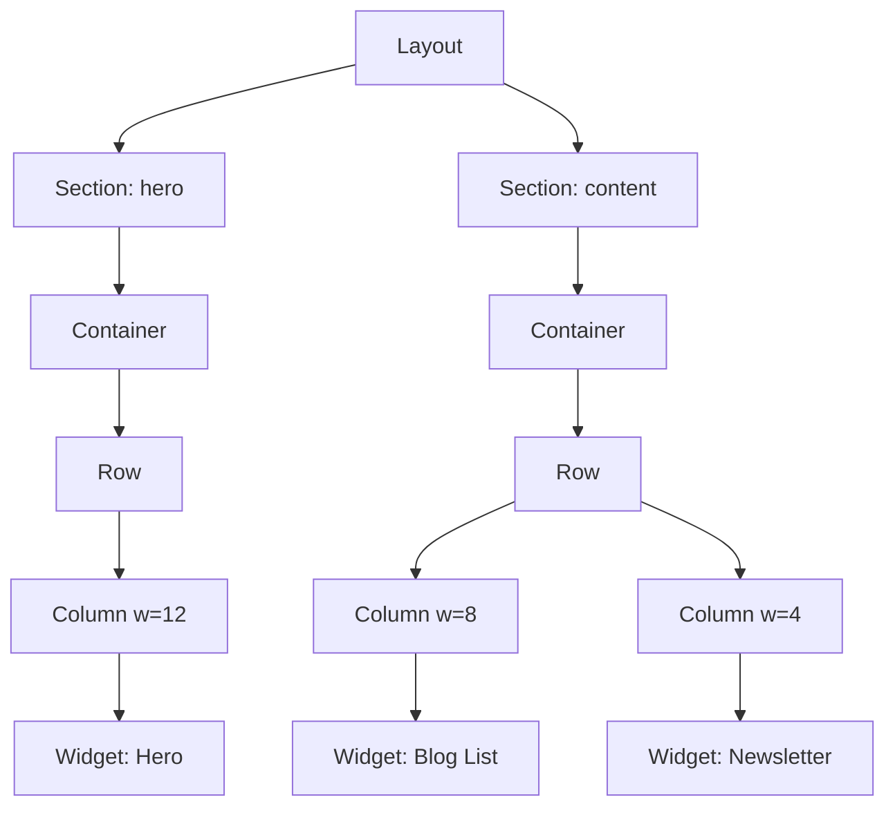
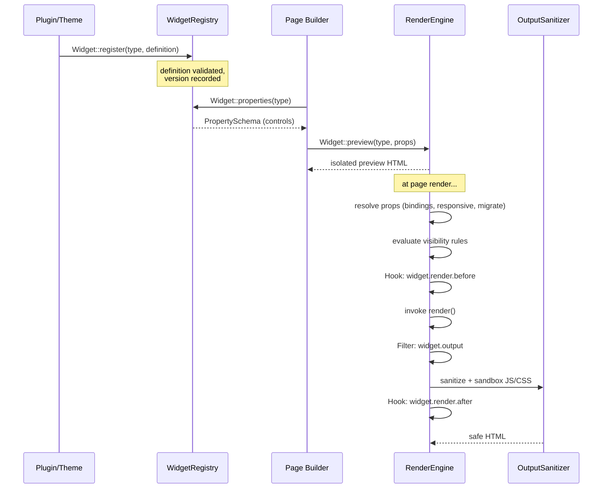
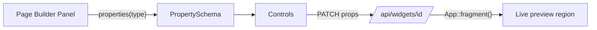

# Widget Engine

> The foundational rendering module of GOCO CMS: it turns declarative **widget definitions** into concrete, tenant-scoped **widget instances** and composes them through the website tree (Section → Container → Row → Column → Widget) into sanitized, cache-aware HTML.

**Stability:** `beta` · **Package:** `packages/widget-engine` (`Goco\Widget`) · **Public facade:** `Goco\SDK\Widget`

The Widget Engine is the beating heart of GOCO's "Website Operating System" model. Everything a visitor sees on a rendered page — a hero banner, a navbar, a dynamic collection list, an embedded contact form — is a widget. This document specifies the engine end to end, following the GOCO 17-section core-module standard.

---

## 1. Purpose

The Widget Engine exists to provide a **single, unified rendering primitive** for all visual and interactive content in GOCO CMS. Instead of scattering rendering logic across themes, templates, and plugins, GOCO funnels everything through one contract:

- A **widget definition** describes a *type* of component once — its property schema, defaults, render logic, preview, and capabilities.
- A **widget instance** is a placed, configured occurrence of a definition inside a page's layout tree, persisted in MongoDB and scoped to a `(workspace_id, website_id)`.

The engine's responsibilities:

1. **Registration** — accept widget definitions from core, plugins, and themes via `Goco\SDK\Widget::register()`.
2. **Property schema** — expose a typed, validated schema per widget type used by the Page Builder to render controls.
3. **Rendering** — resolve an instance's props (including dynamic data bindings, responsive values, and visibility rules) and emit sanitized HTML.
4. **Preview** — produce an isolated render for the visual editor and the widget picker.
5. **Composition** — walk the widget tree and assemble the full page output while honoring caching, hooks, and filters.
6. **Governance** — sanitize output, sandbox custom JS/CSS, enforce capabilities, and migrate props across widget versions.

> **Note**
> The Widget Engine renders; it does not *store the layout*. The layout tree (which widget goes where) lives in the `layouts` and `pages` collections, edited via the [Page Builder](page-builder.md). The engine consumes that tree.

---

## 2. Functional Specification

### 2.1 Definition vs. Instance

| Concept | Definition | Instance |
| --- | --- | --- |
| What it is | The blueprint for a widget *type* (`hero`, `button`, `blog_list`) | A concrete placed occurrence with real prop values |
| Where it lives | Code (PHP class or array/callable passed to `Widget::register`) | MongoDB `widgets` collection + embedded in `layouts`/`pages` |
| Cardinality | One per type per deployment | Many per website |
| Carries | Property schema, defaults, render fn, preview fn, capabilities, version | `_id`, `type`, resolved `props`, tree position, responsive overrides, visibility rules |
| Mutated by | Developers / plugin authors | Editors via the Page Builder |

### 2.2 The Widget Tree

GOCO's website hierarchy is: **Workspace → Website → Theme → Layout → Section → Container → Row → Column → Widget.** The Widget Engine owns the last five nodes. `Section`, `Container`, `Row`, and `Column` are themselves widgets (structural widgets), so the tree is uniformly a tree of widget instances.



The engine renders **depth-first**: a parent renders its own wrapper markup, then renders each child and injects the concatenated child output into its slot.

### 2.3 Lifecycle



Lifecycle stages in order: **register → property schema → resolve → render → output filter → sanitize → cache**.

### 2.4 Universal Widget Capabilities

Every widget — built-in or third-party — automatically supports these capabilities without extra code, because they are handled by the engine wrapper, not the widget's `render` function:

| Capability | Description |
| --- | --- |
| **Responsive controls** | Any prop may carry per-breakpoint overrides (`desktop`, `tablet`, `mobile`). The engine resolves the effective value against the active breakpoint. |
| **Dynamic data binding** | A prop value may be a binding expression (`{{ page.title }}`, `{{ collection.entry.field }}`) resolved from the render `Context` instead of a literal. |
| **Visibility rules / conditions** | Per-instance boolean rules (device, auth state, role, date window, A/B bucket, custom expression) decide whether the widget renders at all. |
| **Animations** | Declarative entrance/scroll animations emitted as data attributes consumed by the front-end runtime (`data-anim`, `data-anim-delay`). |
| **Custom CSS/JS classes** | Editor-supplied `cssClass`, `cssId`, plus optional scoped custom CSS and sandboxed custom JS. |
| **Accessibility** | ARIA role/label props, heading-level control, focus order, reduced-motion honoring; the engine emits landmark roles for structural widgets. |
| **Versioning + prop migration** | Each definition declares a `version`; instances store the version they were saved with; the engine runs registered `migrations` to upgrade props on read. |
| **Editor metadata** | Drag/drop, resize (column span), duplicate, copy/paste, lock, and hide flags — stored on the instance and honored by the Page Builder. |
| **Live editing / preview** | `Widget::preview()` and `App::fragment()` render a single widget in isolation for inline editing and htmx region updates. |

---

## 3. Business Requirements

| ID | Requirement | Rationale |
| --- | --- | --- |
| BR-1 | A non-developer editor can add, configure, and reorder widgets visually without code. | Core CMS value proposition. |
| BR-2 | Developers can ship a new widget type as a plugin without patching core. | Ecosystem / "Website OS" extensibility. |
| BR-3 | Widget output must be XSS-safe by default, even with untrusted editor input. | Security & multi-tenant safety. |
| BR-4 | Rendering a page of ~50 widgets must complete within a low-millisecond budget under cache warm. | Performance at scale. |
| BR-5 | Upgrading a widget's schema must not break existing pages using the old prop shape. | Zero-downtime upgrades, pre-1.0 velocity. |
| BR-6 | Widgets must render identically in preview (editor) and production (visitor). | Editor trust / WYSIWYG. |
| BR-7 | Every widget must be responsive and accessible by default. | Reach & compliance. |
| BR-8 | Widget instances must be tenant-isolated by `(workspace_id, website_id)`. | Multi-tenancy correctness. |

---

## 4. User Stories

- **As an editor**, I drag a *Hero* widget into the header section, type a headline, and pick a background image, so that my landing page has a banner — without touching code.
- **As an editor**, I set a *Pricing* widget to be hidden on mobile and visible only to logged-out visitors, so that the layout stays clean and targeted.
- **As a designer**, I bind a *Heading* widget's text to `{{ page.title }}`, so that the heading always mirrors the page title.
- **As a plugin developer**, I call `Widget::register('countdown', $definition)` in my plugin's `boot`, so that a Countdown widget appears in the picker for all websites where my plugin is active.
- **As a plugin developer**, I add a `filter('widget.output')` to append a schema.org microdata block to every *Card* widget, so that SEO improves site-wide.
- **As a website admin**, I upgrade a plugin that bumps the *Slider* widget from v1 to v2; existing sliders keep working because the engine runs the v1→v2 migration transparently.
- **As a security-minded operator**, I know editor-supplied custom JS runs in a sandboxed context and cannot exfiltrate session cookies.

---

## 5. Data Model (MongoDB Collections & Indexes)

Widget instances live in the tenant-scoped `widgets` collection. Structural placement is embedded in `layouts` / `pages`, but every widget also has a canonical document here for reuse (global/library widgets) and querying.

### 5.1 `widgets` document shape

```json
{
  "_id": "6a1f9c2e8b7d4e0012a3f5c1",
  "workspace_id": "ws_01H...",
  "website_id": "web_01H...",
  "type": "hero",
  "definition_version": 3,
  "name": "Homepage Hero",
  "global": false,
  "parent_id": "6a1f9c2e8b7d4e0012a3f5b0",
  "tree_path": "section:hero/container/row/column:0",
  "order": 0,
  "props": {
    "headline": "Build websites like an OS",
    "subheadline": "{{ website.tagline }}",
    "background": { "kind": "media", "media_id": "med_01H..." },
    "cta": { "label": "Get Started", "href": "/install" }
  },
  "responsive": {
    "tablet": { "headline_size": 40 },
    "mobile": { "headline_size": 28, "align": "center" }
  },
  "visibility": {
    "op": "and",
    "rules": [
      { "kind": "device", "in": ["desktop", "tablet"] },
      { "kind": "auth", "state": "guest" }
    ]
  },
  "animation": { "type": "fade-up", "delay": 100, "duration": 600 },
  "style": {
    "cssId": "home-hero",
    "cssClass": ["dark", "full-bleed"],
    "customCss": ".goco-w-home-hero{min-height:80vh}",
    "customJs": null
  },
  "a11y": { "role": "banner", "ariaLabel": "Introduction" },
  "editor": { "locked": false, "hidden": false, "resizable": true, "duplicable": true },
  "created_at": "2026-07-01T10:00:00Z",
  "updated_at": "2026-07-15T08:22:11Z",
  "deleted_at": null,
  "version": 4,
  "created_by": "usr_01H...",
  "updated_by": "usr_01H..."
}
```

Every document carries the GOCO standard fields (`_id`, `created_at`, `updated_at`, `deleted_at`, `version`, `created_by`, `updated_by`) plus tenant keys (`workspace_id`, `website_id`). See [Data Model](../architecture/data-model.md).

### 5.2 JSON-Schema validator (excerpt)

```javascript
db.createCollection("widgets", {
  validator: { $jsonSchema: {
    bsonType: "object",
    required: ["workspace_id", "website_id", "type", "definition_version", "props", "created_at"],
    properties: {
      type:               { bsonType: "string" },
      definition_version: { bsonType: "int", minimum: 1 },
      global:             { bsonType: "bool" },
      props:              { bsonType: "object" },
      responsive:         { bsonType: "object" },
      visibility:         { bsonType: "object" },
      deleted_at:         { bsonType: ["date", "null"] }
    }
  }},
  validationLevel: "moderate"
});
```

### 5.3 Indexes

```javascript
db.widgets.createIndex({ workspace_id: 1, website_id: 1, type: 1 });          // pick/list by type
db.widgets.createIndex({ workspace_id: 1, website_id: 1, parent_id: 1, order: 1 }); // tree walk
db.widgets.createIndex({ workspace_id: 1, website_id: 1, global: 1 });        // reusable library
db.widgets.createIndex({ workspace_id: 1, website_id: 1, deleted_at: 1 });    // soft-delete filter
db.widgets.createIndex({ updated_at: -1 });                                   // recent-edits feed
```

> **Note**
> Structural widgets embedded inside `layouts` avoid a separate query per node; the engine hydrates the whole tree in one read. The standalone `widgets` collection is authoritative for **global** (reusable) widgets referenced by `_id` from multiple pages.

---

## 6. Folder Structure

```text
packages/widget-engine/
├── composer.json                 # gococms/widget-engine
├── src/
│   ├── WidgetEngine.php           # facade backend bound in the container
│   ├── Registry/
│   │   ├── WidgetRegistry.php      # type -> Definition map
│   │   └── Definition.php          # normalized definition value object
│   ├── Schema/
│   │   ├── PropertySchema.php       # typed control schema
│   │   └── Control.php              # text|number|color|media|select|toggle|repeater|binding
│   ├── Render/
│   │   ├── RenderEngine.php         # tree walk + orchestration
│   │   ├── Context.php              # per-render binding context
│   │   ├── PropResolver.php         # responsive + binding + defaults
│   │   ├── VisibilityEvaluator.php  # rule evaluation
│   │   └── TreeWalker.php           # depth-first composition
│   ├── Migration/
│   │   ├── MigrationRunner.php      # prop version migration
│   │   └── Migration.php
│   ├── Security/
│   │   ├── OutputSanitizer.php      # HTML Purifier-style allowlist
│   │   └── ScriptSandbox.php        # custom JS isolation policy
│   ├── Cache/
│   │   └── FragmentCache.php        # Redis-backed render cache
│   └── Widgets/                     # ~35 built-in definitions
│       ├── Structural/ (Section, Container, Grid, Row, Column, Sidebar)
│       ├── Content/    (Heading, Paragraph, Image, Button, ...)
│       ├── Dynamic/    (BlogList, DynamicCollection, Search, Pagination, Comments)
│       └── Interactive/(Slider, Tabs, Accordion, ContactForm, ...)
├── template/                       # ZealPHP .php view partials per widget
│   └── widgets/hero.php ...
└── tests/
    ├── Unit/
    └── Feature/
```

The public entry points developers touch are the SDK facades (`Goco\SDK\Widget`, `Goco\SDK\Hook`), documented in the [Widget SDK](../sdk/widget-sdk.md) and [Hook SDK](../sdk/hook-sdk.md).

---

## 7. API Design

The engine surfaces both an **internal PHP API** (the `Widget` facade) and an **HTTP API** for the Page Builder and headless consumers.

### 7.1 PHP facade — exact signatures

```php
use Goco\SDK\Widget;
use Goco\Widget\Render\Context;
use Goco\Widget\Schema\PropertySchema;

Widget::register(string $type, array|callable $definition): void;
Widget::render(string $type, array $props, ?Context $ctx = null): string;
Widget::properties(string $type): PropertySchema;
Widget::preview(string $type, array $props = []): string;
```

### 7.2 Registering a widget (array form)

```php
use Goco\SDK\Widget;

Widget::register('countdown', [
    'label'     => 'Countdown',
    'icon'      => 'clock',
    'category'  => 'interactive',
    'version'   => 2,
    'schema'    => [
        'target'   => ['control' => 'datetime', 'label' => 'Target date', 'required' => true],
        'expired'  => ['control' => 'text', 'label' => 'Expired text', 'default' => 'Time is up'],
        'align'    => ['control' => 'select', 'options' => ['left','center','right'], 'default' => 'center'],
    ],
    'defaults'  => ['align' => 'center'],
    'migrations' => [
        // v1 stored a unix int in `deadline`; v2 uses ISO `target`
        2 => fn(array $p) => ['target' => date(DATE_ATOM, $p['deadline'] ?? time())] + $p,
    ],
    'render'    => function (array $props, Context $ctx): string {
        return App::renderToString('/widgets/countdown.php', $props);
    },
    'preview'   => fn(array $props) => Widget::render('countdown', $props),
]);
```

### 7.3 Registering a widget (callable / class form)

```php
Widget::register('countdown', fn() => new \Acme\Countdown\CountdownWidget());
```

Where `CountdownWidget` implements the SDK `WidgetInterface` (`schema()`, `render()`, `preview()`, `version()`, `migrations()`). See the [Widget SDK](../sdk/widget-sdk.md) and the step-by-step [Widget Guide](../guides/widget-guide.md).

### 7.4 HTTP API (file-based REST, ZealPHP)

GOCO exposes the engine over ZealPHP's file-based REST (`apps/admin/api/...`). All routes require a session/JWT and the relevant capability; responses are auto-JSON.

| Method & path | Capability | Purpose |
| --- | --- | --- |
| `GET /api/widgets/types` | `widgets.manage` | List registered widget types + metadata for the picker |
| `GET /api/widgets/types/{type}/schema` | `widgets.manage` | Fetch `PropertySchema` for editor controls |
| `POST /api/widgets/preview` | `widgets.manage` | Render a preview from `{ type, props }` |
| `GET /api/widgets/{id}` | `widgets.manage` | Read one widget instance |
| `POST /api/widgets` | `widgets.manage` | Create an instance |
| `PATCH /api/widgets/{id}` | `widgets.manage` | Update props/responsive/visibility |
| `POST /api/widgets/{id}/duplicate` | `widgets.manage` | Duplicate (copy/paste metadata) |
| `DELETE /api/widgets/{id}` | `widgets.manage` | Soft-delete |

Example handler (`apps/admin/api/widgets/preview.php`):

```php
<?php
use Goco\SDK\Widget;

return function ($request, $response) {
    $body = json_decode($request->rawContent(), true) ?? [];
    $type = $body['type'] ?? '';
    if (!$type) { $response->status(422); return ['error' => 'type required']; }
    return ['html' => Widget::preview($type, $body['props'] ?? [])];
};
```

See the full [API Reference](../reference/api-reference.md) and [Routing](routing.md).

---

## 8. Services

The engine is a set of container-bound services (see [Service Container](../architecture/service-container.md)). Constructor injection; no globals except ZealPHP per-request `\ZealPHP\G`.

| Service | Responsibility |
| --- | --- |
| `WidgetRegistry` | Holds `type → Definition`; validated at registration; queried by the picker. |
| `RenderEngine` | Orchestrates a single widget render: resolve → visibility → hooks → render → filter → sanitize → cache. |
| `TreeWalker` | Depth-first composition of a widget tree into a full page fragment. |
| `PropResolver` | Merges defaults, applies responsive overrides for the active breakpoint, resolves `{{ bindings }}` against `Context`. |
| `VisibilityEvaluator` | Evaluates visibility rule groups (device/auth/role/date/expression) to a boolean. |
| `MigrationRunner` | Upgrades stored props from `definition_version` to current via registered migrations. |
| `OutputSanitizer` | Allowlist HTML sanitization of rendered output. |
| `ScriptSandbox` | Wraps editor custom JS in an isolated, CSP-compatible execution policy. |
| `FragmentCache` | Redis-backed per-widget render cache keyed by content hash. |

### 8.1 Render orchestration (simplified)

```php
final class RenderEngine
{
    public function renderInstance(array $instance, Context $ctx): string
    {
        $type = $instance['type'];
        $def  = $this->registry->get($type);

        $props = $this->migrations->run($def, $instance);           // version migration
        $props = $this->propResolver->resolve($def, $instance, $props, $ctx); // responsive + bindings

        if (!$this->visibility->passes($instance['visibility'] ?? null, $ctx)) {
            return '';                                              // conditionally hidden
        }

        return $this->cache->remember($def, $props, $ctx, function () use ($type, $props, $def, $ctx) {
            Hook::dispatch('widget.render.before', $type, $props, $ctx);
            $html = $def->render($props, $ctx);
            $html = Hook::apply('widget.output', $html, $type, $props, $ctx);
            $html = $this->sanitizer->clean($html, $def->sanitizePolicy());
            Hook::dispatch('widget.render.after', $type, $html, $ctx);
            return $this->wrap($html, $props);                      // outer div, classes, anim attrs
        });
    }
}
```

---

## 9. Events

The engine dispatches lifecycle **actions** (fire-and-forget) via `Hook::dispatch()` (alias `do`). Naming follows `subject.verb[.tense]`. See the [Event & Hook System](../architecture/event-hook-system.md).

| Event | When | Args |
| --- | --- | --- |
| `widget.registered` | A definition is added to the registry | `$type, $definition` |
| `widget.render.before` | Immediately before a widget's `render()` runs | `$type, $props, $ctx` |
| `widget.render.after` | After output filtering and sanitization | `$type, $html, $ctx` |
| `widget.migrated` | Props migrated across versions | `$type, $from, $to, $props` |
| `widget.hidden` | A visibility rule suppressed a widget | `$type, $reason, $ctx` |
| `widget.cache.hit` / `widget.cache.miss` | Fragment cache lookup result | `$type, $key` |

Asynchronous variants (`Hook::dispatchAsync`) run listeners in a coroutine (`go()`), useful for analytics without blocking render.

---

## 10. Hooks

Filters (`subject.noun`) let extensions transform values in the pipeline via `Hook::filter()` (register) and `Hook::apply()` (invoke).

| Filter | Transforms | Signature of value |
| --- | --- | --- |
| `widget.output` | Final HTML of a single widget | `string $html` |
| `widget.props` | Resolved props before render | `array $props` |
| `widget.schema` | Property schema shown in the editor | `array $schema` |
| `widget.classes` | Wrapper CSS classes | `array $classes` |
| `widget.visibility.result` | Boolean visibility outcome | `bool $visible` |
| `widget.cache.key` | Fragment cache key components | `array $parts` |
| `widget.tree` | The hydrated tree before walking | `array $tree` |

Example — inject microdata into every Card:

```php
use Goco\SDK\Hook;

Hook::filter('widget.output', function (string $html, string $type): string {
    if ($type !== 'card') return $html;
    return $html . '<meta itemprop="isAccessibleForFree" content="true">';
}, priority: 20);
```

Plugin hooks are namespaced by plugin slug (e.g. `acme-seo.widget.output`). See the [Hook SDK](../sdk/hook-sdk.md).

---

## 11. UI Architecture

The engine has two rendered faces: the **visitor front-end** and the **Page Builder editor**.

- **Front-end runtime** — a tiny (~6KB gzip) vanilla-JS bundle reads `data-anim`, initializes interactive widgets (slider, tabs, accordion), and honors `prefers-reduced-motion`. Structural widgets (`Section`, `Row`, `Column`, `Grid`) emit CSS-grid/flex wrappers; no JS required for layout.
- **Editor** — the [Page Builder](page-builder.md) requests `Widget::properties(type)` to render a control panel per widget. Controls map 1:1 to `PropertySchema` control kinds (`text`, `number`, `color`, `media`, `select`, `toggle`, `repeater`, `binding`, `datetime`, `spacing`, `typography`). Live preview uses `App::fragment()` (htmx region) so editing a prop re-renders only that widget over the wire.



Wrapper markup emitted by the engine:

```html
<div class="goco-w goco-w-hero dark full-bleed"
     id="home-hero"
     data-widget-id="6a1f9c2e..."
     data-anim="fade-up" data-anim-delay="100"
     role="banner" aria-label="Introduction">
  <!-- widget render() output, sanitized -->
</div>
```

---

## 12. Security Model

Widget input is **editor-supplied and therefore untrusted**, even from privileged users, because a compromised editor session must not yield stored XSS across a multi-tenant deployment.

- **Output sanitization** — `OutputSanitizer` runs an allowlist sanitizer (elements, attributes, URL schemes) on every widget's HTML *after* the `widget.output` filter. Dangerous vectors (`<script>` outside sandbox, `on*` handlers, `javascript:` URLs, `<iframe>` without allowlisted host) are stripped. The `HTML Embed` widget uses a stricter policy and requires the `widgets.manage` capability plus a per-website "allow raw HTML" setting.
- **Custom JS sandboxing** — editor-provided custom JS never runs inline. `ScriptSandbox` serializes it into a nonce'd, CSP-compatible module executed inside an isolated scope with no access to `document.cookie`, `localStorage`, or the session; network egress is constrained by the site CSP. Sites may disable custom JS entirely via `settings`.
- **Binding safety** — `{{ bindings }}` resolve only against an explicit, allowlisted `Context` graph (page, website, collection entry, user public fields). Arbitrary property/method traversal is blocked; no PHP is evaluated from bindings.
- **Capabilities** — mutating instances requires `widgets.manage`; managing global/library widgets and the picker registry requires the same. Structural operations respect the RBAC/ABAC layer scoped per `(workspace, website)`. See the [Permission System](../architecture/permission-system.md) and [Security Model](../security/security-model.md).
- **Tenant isolation** — all reads/writes are constrained to the request's `(workspace_id, website_id)`; global widgets are never shared across websites. See [Multi-Tenancy](../architecture/multi-tenancy.md).
- **CSRF** — Page Builder mutations pass through the ZealPHP `Csrf` middleware.

> **Warning**
> Never register a widget whose `render()` echoes raw props without going through templating. The sanitizer is a safety net, not a license to concatenate untrusted strings. Prefer `App::renderToString()` with escaped output.

---

## 13. Performance Strategy

The engine targets a low-millisecond full-page render for ~50 widgets under warm cache.

- **Fragment cache (Redis)** — `FragmentCache::remember()` keys each widget render on a hash of `(type, definition_version, resolved-props, breakpoint, locale, relevant-context)`. Cache-safe widgets (static content) are cached; widgets with per-request bindings (auth state, current user) declare `cacheable => false` or a shorter TTL and cache key partials via the `widget.cache.key` filter. Keys are tagged for invalidation on `content.published` and widget update. See [Caching, Queue & Realtime](../architecture/caching-and-queue.md).
- **Single tree hydration** — the whole layout tree loads in one MongoDB read (embedded structural widgets); global widgets referenced by `_id` are batched with a single `$in` query. No N+1 per node.
- **Coroutine parallelism** — independent dynamic widgets (e.g. a `Blog List` DB query alongside a `Map` geocode) resolve their data concurrently via `go()` and an `\OpenSwoole\Coroutine\Channel`, so I/O overlaps instead of serializing.
- **Streaming render** — long pages can stream: `TreeWalker` yields a `Generator` of section fragments consumed by `App::renderStream()`, so the browser paints above-the-fold before the whole tree finishes.
- **Compiled schemas** — `PropertySchema` objects are memoized per worker; registration cost is paid once at `App::onWorkerStart`.
- **Prewarm** — a background `App::tick` job can prewarm the fragment cache for top pages after a publish.

Because GOCO runs on OpenSwoole (persistent workers), the registry and compiled schemas stay resident in memory across requests — there is no per-request bootstrap of widget definitions.

---

## 14. Testing Strategy

Aligned with the project [Testing Strategy](../community/testing-strategy.md).

| Layer | What is tested | Tooling |
| --- | --- | --- |
| **Unit** | `PropResolver` (responsive + bindings), `VisibilityEvaluator`, `MigrationRunner`, `OutputSanitizer` allowlist, cache key generation | PHPUnit |
| **Contract** | Every built-in widget: `schema()` valid, `render()` returns string, `preview()` matches render, sanitized output is stable | PHPUnit data providers over the registry |
| **Feature** | HTTP API (`/api/widgets/*`) create/preview/duplicate/delete with auth + capability checks | ZealPHP test client |
| **Security** | XSS payload corpus against `OutputSanitizer`; custom-JS sandbox escape attempts | PHPUnit + payload fixtures |
| **Snapshot** | Golden HTML per widget/breakpoint to catch unintended output drift | Snapshot assertions |
| **Migration** | Old-version prop fixtures upgrade cleanly to current schema | PHPUnit |
| **Performance** | Render budget for a 50-widget page, warm vs. cold cache | Benchmark harness |

```php
public function test_hero_preview_matches_render(): void
{
    $props = ['headline' => 'Hi', 'align' => 'center'];
    $this->assertSame(
        Widget::render('hero', $props),
        Widget::preview('hero', $props)
    );
}

public function test_output_strips_inline_handlers(): void
{
    Widget::register('evil', ['version' => 1,
        'schema' => [], 'render' => fn() => '<a href="#" onclick="steal()">x</a>']);
    $this->assertStringNotContainsString('onclick', Widget::render('evil', []));
}
```

---

## 15. Extension Points

The engine is designed to be extended entirely from user land — no core patches.

1. **Register a new widget type** — `Widget::register($type, $definition)` from a plugin's `boot`. See the [Widget SDK](../sdk/widget-sdk.md) and [Widget Guide](../guides/widget-guide.md).
2. **Add controls** — custom `PropertySchema` control kinds via `Hook::filter('widget.schema', ...)`.
3. **Transform output** — `Hook::filter('widget.output', ...)` (SEO microdata, lazy-loading, i18n).
4. **Add binding sources** — extend the `Context` graph so `{{ myplugin.thing }}` resolves.
5. **Custom visibility rules** — register a rule kind consumed by `VisibilityEvaluator` (e.g. geo, subscription tier).
6. **Custom cache policy** — `Hook::filter('widget.cache.key', ...)` to vary caching per your dimension.
7. **Structural widgets** — themes may register layout primitives beyond the defaults.

Example plugin boot:

```php
use Goco\SDK\{Plugin, Widget, Hook};

Plugin::register('acme-widgets', [
    'name' => 'Acme Widgets', 'version' => '1.0.0',
]);

Plugin::boot('acme-widgets'); // invoked by the engine; inside:

Widget::register('countdown', require __DIR__ . '/widgets/countdown.php');
Hook::filter('widget.output', require __DIR__ . '/filters/microdata.php');
```

See the [Plugin Engine](plugin-engine.md) and [Plugin SDK](../sdk/plugin-sdk.md).

---

## 16. Upgrade Strategy

- **Definition versioning** — each definition declares an integer `version`. Instances persist the `definition_version` they were saved with.
- **Prop migration on read** — `MigrationRunner` applies each registered `migrations[n]` in order from the stored version to the current version *at render time* and, when saved through the editor, persists the upgraded shape. Migrations are pure functions `(array $props) => array $props` and must be idempotent.
- **Deprecation** — a widget type may be tagged `deprecated`; the picker hides it for new placements but existing instances continue to render. A removal follows Semantic Versioning: deprecate in a minor, remove no earlier than the next major.
- **Backward-compatible schema changes** — adding an optional control with a default is non-breaking. Renaming or removing a control requires a migration bumping `version`.
- **Engine upgrades** — new hooks/filters are additive; the render pipeline order is stable and part of the public contract. Breaking pipeline changes ship only in a major release with a documented migration in the [Changelog](../changelog.md).

> **Tip**
> Test migrations with real fixtures captured from production `widgets` documents before releasing a version bump.

---

## 17. Future Roadmap

| Milestone | Item |
| --- | --- |
| Near-term | Promote engine from `beta` to `stable`; finalize `PropertySchema` control contract. |
| Near-term | Global "component" widgets (design-system tokens shared across websites in a workspace). |
| Mid-term | AI-assisted widget generation via the [AI Platform](ai-platform.md) — describe a section, get a widget tree. |
| Mid-term | Server-driven partial hydration: island architecture for interactive widgets to cut front-end JS further. |
| Mid-term | Visual A/B testing baked into visibility rules with analytics feedback. |
| Long-term | Third-party widget marketplace distribution + signed widget packages (see [Plugin Marketplace](../marketplace/overview.md)). |
| Long-term | Real-time collaborative editing of the widget tree over ZealPHP WebSockets. |

See the project [Roadmap](../roadmap.md).

---

## Built-in Widgets

GOCO ships ~35 first-party widgets across four categories. All support the universal capabilities in §2.4.

### Structural

| Widget | Type | Purpose |
| --- | --- | --- |
| Section | `section` | Full-width top-level band that groups page content and carries background/spacing. |
| Container | `container` | Constrains inner content to a max-width; the boxed wrapper inside a Section. |
| Grid | `grid` | CSS-grid layout with configurable columns and gaps for card-like arrangements. |
| Row | `row` | Horizontal flex track that holds Columns. |
| Column | `column` | Resizable cell (1–12 span) that holds widgets; the drag/resize unit. |
| Sidebar | `sidebar` | Reusable widget area (aside) shared across pages, e.g. blog rails. |

### Content

| Widget | Type | Purpose |
| --- | --- | --- |
| Hero | `hero` | Prominent banner with headline, subheadline, background, and CTA. |
| Navbar | `navbar` | Site navigation bar bound to a menu with responsive collapse. |
| Footer | `footer` | Site footer with columns, links, and legal/branding. |
| Heading | `heading` | Semantic heading (h1–h6) with typography and binding support. |
| Paragraph | `paragraph` | Rich-text block with sanitized inline formatting. |
| Button | `button` | Call-to-action link/button with variants and icon. |
| Image | `image` | Responsive image from media library with alt text and lazy-load. |
| Gallery | `gallery` | Grid/masonry image collection with lightbox. |
| Video | `video` | Embedded or self-hosted video with poster and lazy-load. |
| Card | `card` | Composable content card (media + title + body + action). |
| Breadcrumb | `breadcrumb` | Hierarchical page trail with schema.org markup. |
| HTML Embed | `html_embed` | Raw HTML/embed block under a strict sanitize policy and capability gate. |

### Interactive

| Widget | Type | Purpose |
| --- | --- | --- |
| Pricing | `pricing` | Pricing tiers/table with feature lists and highlighted plan. |
| FAQ | `faq` | Question/answer list, optionally collapsible, with FAQ schema. |
| Accordion | `accordion` | Stacked expandable panels. |
| Tabs | `tabs` | Tabbed panels for grouped content. |
| Slider | `slider` | Carousel of slides/images with autoplay and controls. |
| Timeline | `timeline` | Chronological event list with connectors. |
| Team | `team` | Grid of team-member profiles. |
| Testimonials | `testimonials` | Quotes/reviews carousel or grid. |
| Map | `map` | Interactive/static map with markers from coordinates or address. |
| Contact Form | `contact_form` | Form bound to the Forms engine; submits to `form_submissions`. |
| Newsletter | `newsletter` | Email capture bound to a list/provider. |

### Dynamic

| Widget | Type | Purpose |
| --- | --- | --- |
| Search | `search` | Query box bound to the search provider (Mongo/Meilisearch/OpenSearch). |
| Pagination | `pagination` | Page navigation control for listing widgets. |
| Blog List | `blog_list` | Paginated post feed from the [Blog Engine](blog-engine.md) with filters. |
| Dynamic Collection | `dynamic_collection` | Renders entries from a custom collection built with the [Database Builder](database-builder.md). |
| Comments | `comments` | Threaded comments bound to the `comments` collection. |
| AI Widget | `ai_widget` | AI-generated/assisted content region powered by the [AI Platform](ai-platform.md). |

> **Note**
> Structural widgets (`section`, `container`, `grid`, `row`, `column`, `sidebar`) are the same primitive as content widgets — they simply render layout wrappers and accept children. This uniformity is what makes the whole page a single widget tree.

---

## Configuration

Relevant environment/config keys (full list in the [Configuration Reference](../reference/configuration-reference.md)):

```env
# Widget engine
GOCO_WIDGET_CACHE_ENABLED=true
GOCO_WIDGET_CACHE_TTL=3600
GOCO_WIDGET_CUSTOM_JS_ENABLED=false      # per-deployment default; sites can opt in
GOCO_WIDGET_HTML_EMBED_ENABLED=false     # gates the HTML Embed widget
GOCO_WIDGET_STREAM_THRESHOLD=40          # widgets before streaming render kicks in
```

The fragment cache uses the shared Redis service (`redis` in Docker Compose); custom JS/CSS respect the site Content-Security-Policy emitted via Traefik security-header middleware. See [Docker Architecture](../deployment/docker.md), [Traefik](../deployment/traefik.md), and [Configuration](../getting-started/configuration.md).

---

## Related

- [Widget SDK](../sdk/widget-sdk.md) — the developer contract for authoring widgets
- [Widget Guide](../guides/widget-guide.md) — step-by-step tutorial
- [Page Builder](page-builder.md) — the visual editor that places widgets
- [Theme Engine](theme-engine.md) — layouts and regions that host widgets
- [Template Engine](template-engine.md) — the ZealPHP view layer widgets render into
- [Plugin Engine](plugin-engine.md) — how third-party widgets are distributed
- [Hook SDK](../sdk/hook-sdk.md) — events and filters used across the pipeline
- [Rendering Pipeline](../architecture/rendering-pipeline.md) — how widget output becomes a page
- [Event & Hook System](../architecture/event-hook-system.md) — the dispatch/filter internals
- [Data Model](../architecture/data-model.md) — collections and indexes
- [Caching, Queue & Realtime](../architecture/caching-and-queue.md) — the Redis fragment cache
- [Security Model](../security/security-model.md) — sanitization and sandboxing in context
- [Documentation Index](../README.md)
