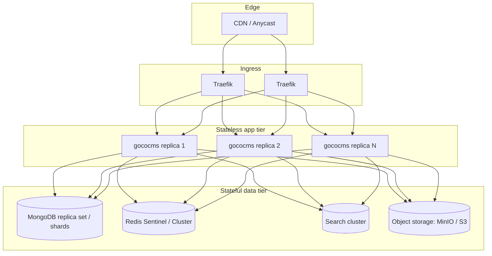
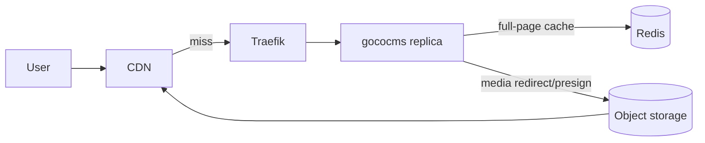
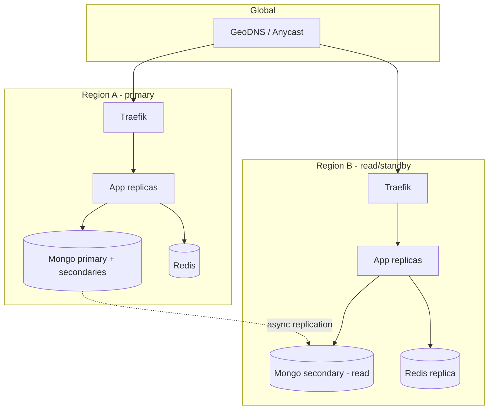

# Scaling Strategy

> How GOCO CMS grows from a single Docker host to a multi-region cluster — vertical tuning of the OpenSwoole worker model, horizontal stateless replicas behind Traefik, and a fully clustered data tier (MongoDB, Redis, search, object storage).

GOCO CMS is designed to be **scaled, not rewritten**. Because the runtime is [ZealPHP](../architecture/zealphp-foundation.md) on OpenSwoole 22.1+ with **persistent, long-lived workers** (no per-request bootstrap, no PHP-FPM cold start), a single node already delivers high throughput. Scaling is therefore a deliberate, staged progression: tune one node until it is CPU-bound, then add stateless replicas, then cluster the stateful backends. Every stage below preserves the same architectural invariant — **the application tier holds no durable state** — so replicas remain interchangeable.

This document assumes you have already read the [Deployment Guide](deployment-guide.md), understand [Multi-Tenancy](../architecture/multi-tenancy.md), and are familiar with the Redis-backed [Caching, Queue & Realtime](../architecture/caching-and-queue.md) layer.

---

## 1. Scaling Model Overview

GOCO scales along four independent axes. You can advance any axis without touching the others.

| Axis | Question it answers | Primary lever | Stage introduced |
| --- | --- | --- | --- |
| **Vertical (app)** | Am I using this node fully? | OpenSwoole HTTP/task workers, pools, memory | Single-node |
| **Horizontal (app)** | Do I need more nodes? | Stateless `gococms` replicas behind Traefik | Cluster |
| **Data tier** | Is the DB/cache/search the bottleneck? | MongoDB replica set + sharding, Redis Sentinel/Cluster, distributed MinIO, clustered search | Cluster/HA |
| **Edge** | Can I serve without hitting origin? | CDN + Traefik cache + full-page cache | Any stage |



> **Note** The golden rule: **never scale the app tier and the data tier with the same change.** Adding replicas multiplies connection pressure on MongoDB and Redis — size the data tier first.

---

## 2. Per-Node Baseline: The ZealPHP Throughput Profile

Traditional PHP (Apache/Nginx + PHP-FPM) pays a full framework bootstrap on **every request** — autoload, config parse, service wiring, connection open. ZealPHP does none of that at request time. `App::init()` bootstraps once; workers stay resident and handle requests inside **coroutines** (`App::MODE_COROUTINE`), so a single worker services thousands of concurrent, I/O-bound requests without blocking.

Practical baseline for capacity planning (a well-tuned node, cached content, coroutine mode):

| Node profile | vCPU / RAM | HTTP workers | Sustained req/s (cached) | Sustained req/s (dynamic w/ Mongo) |
| --- | --- | --- | --- | --- |
| Small | 2 / 4 GB | 2 | ~8,000–12,000 | ~1,500–3,000 |
| Medium | 4 / 8 GB | 4 | ~18,000–28,000 | ~3,500–6,000 |
| Large | 8 / 16 GB | 8 | ~40,000–60,000 | ~7,000–12,000 |

> **Note** These are order-of-magnitude planning figures for right-sizing, not benchmarks — actual numbers depend on payload size, index quality, and cache hit ratio. Always load-test your own workload (see [§13](#13-load-testing--capacity-planning)). The key takeaway: **because workers are persistent, one GOCO node replaces a rack of FPM workers.** Scale vertically first; you will get further on one box than with classic PHP.

---

## 3. Vertical Scaling — Tuning a Single Node

Vertical scaling means extracting maximum work from one host before adding another. All knobs are set via environment variables (see [Configuration Reference](../reference/configuration-reference.md)) and consumed by `App::init()` in `app.php`.

### 3.1 OpenSwoole HTTP & Task Workers

```php
// app.php — worker configuration is read from env at bootstrap
require 'vendor/autoload.php';

use ZealPHP\App;

App::superglobals(false);
$app = App::init('0.0.0.0', 8080);
App::mode(App::MODE_COROUTINE); // persistent coroutine workers — the modern default

$app->set([
    // HTTP request workers: ~1 per CPU core for CPU-bound, up to 2-4x for I/O-bound coroutine loads
    'worker_num'          => (int) env('SWOOLE_WORKER_NUM', swoole_cpu_num()),
    // Task workers handle offloaded async work (see §7). Sized independently of HTTP workers.
    'task_worker_num'     => (int) env('SWOOLE_TASK_WORKER_NUM', swoole_cpu_num() * 2),
    'task_enable_coroutine' => true,
    // Recycle a worker after N requests to bound any slow leak in long-lived workers. 0 = never.
    'max_request'         => (int) env('SWOOLE_MAX_REQUEST', 100000),
    'max_wait_time'       => 30,          // graceful shutdown window (seconds)
    'reload_async'        => true,         // drain in-flight requests on reload
    // Coroutine concurrency cap per worker — protects memory under a thundering herd
    'max_coroutine'       => (int) env('SWOOLE_MAX_COROUTINE', 100000),
    'enable_coroutine'    => true,
    'http_compression'    => true,
    'buffer_output_size'  => 4 * 1024 * 1024,
]);

$app->run();
```

Rules of thumb:

- **`worker_num`** — Start at `swoole_cpu_num()`. For coroutine (I/O-bound) workloads you can oversubscribe to `2×`–`4×` cores because workers yield during MongoDB/Redis I/O. For CPU-bound work (image processing, heavy template rendering), keep it at `1×` cores and offload the heavy work to **task workers**.
- **`task_worker_num`** — Independent pool for `$app`-dispatched tasks and queue consumers. CPU-heavy async jobs live here so they never stall HTTP workers. Start at `2×` cores.
- **`max_request`** — Persistent workers are the point of ZealPHP, so keep this high (100k+). Setting it too low reintroduces bootstrap churn; setting it to `0` risks unbounded growth from third-party plugin leaks. A high finite value is the safe default.
- **`max_coroutine`** — Back-pressure ceiling. Combined with the `ConcurrencyLimit` middleware, it prevents a traffic spike from exhausting memory.

```env
# .env — vertical tuning knobs
SWOOLE_WORKER_NUM=8
SWOOLE_TASK_WORKER_NUM=16
SWOOLE_MAX_REQUEST=100000
SWOOLE_MAX_COROUTINE=100000
```

### 3.2 Connection Pools

Every persistent worker must **pool** its MongoDB and Redis connections — never open a connection per request, and never share one connection across coroutines (that corrupts protocol framing). GOCO's [database layer](../architecture/database-mongodb.md) and [Redis layer](../architecture/caching-and-queue.md) use coroutine-safe pools sized per worker.

```env
# Per-worker pool sizes. Total connections = worker_num * pool_size.
MONGODB_POOL_SIZE=16          # 8 workers * 16 = 128 Mongo connections/node
MONGODB_POOL_MAX_IDLE_TIME=60
REDIS_POOL_SIZE=32            # 8 workers * 32 = 256 Redis connections/node
REDIS_POOL_WAIT_TIMEOUT=3
```

> **Warning** Pool math compounds with replicas. `worker_num × pool_size × replica_count` must stay under MongoDB's `maxIncomingConnections` and Redis's `maxclients`. With 6 replicas × 8 workers × 16 = 768 Mongo connections — well within limits, but easy to blow past when you scale carelessly. Track this number; it is the most common cause of "the app works until we add nodes" incidents.

### 3.3 Memory

- Persistent workers accumulate opcode cache, connection pools, and any per-worker in-process cache. Budget **~256–512 MB per HTTP worker** as a starting estimate and measure with `goco status` / `php app.php status`.
- Use **`\ZealPHP\Store`** (OpenSwoole\Table, fixed-size shared memory) for cross-worker hot data — it is allocated once at startup, so size `Store::make(name, size, cols)` deliberately; oversizing wastes RAM on every worker fork.
- For anything that must survive a restart or be shared across nodes, do **not** use in-process memory — use Redis. This is what keeps the tier stateless (see [§4](#4-horizontal-scaling--stateless-app-replicas)).
- Set container memory limits with headroom above the worker budget so the OOM killer never targets a worker mid-request; rely on `max_wait_time` for graceful drains instead.

---

## 4. Horizontal Scaling — Stateless App Replicas

Once a node is CPU-bound, add more nodes. This works **only because the app tier is stateless**: every piece of durable or shared state lives in a backend that all replicas share.

### 4.1 Why No Sticky Sessions

| State | Where it lives | Consequence |
| --- | --- | --- |
| Sessions | **Redis** (`session_start()` backed by Redis, per-coroutine isolated) | Any replica can serve any user — no session affinity needed |
| Cache / full-page cache | **Redis** | Shared hit ratio across the fleet |
| Queue / jobs | **Redis** + `jobs` collection | Any task worker on any node can consume |
| Locks / rate-limit counters | **Redis** | Cluster-wide correctness (see `\ZealPHP\Store::defaultBackend(Store::BACKEND_REDIS)`) |
| Realtime pub/sub | **Redis** | A WebSocket message published on node A reaches subscribers on node B |
| Uploaded media | **Object storage** (MinIO/S3) | No local disk dependency |
| Documents | **MongoDB** | Single source of truth |

Because sessions and cache are in Redis, Traefik uses plain **round-robin / least-connections** load balancing with **no sticky cookies**. This is the single most important property for horizontal scale and zero-downtime deploys: a replica can be added, drained, or killed at any moment.

> **Warning** Do not enable Traefik sticky sessions "to be safe." Stickiness silently hides accidental in-process state (a plugin caching in a static variable, a session written to local tmpfs). If your app needs stickiness, it is not stateless — fix the leak, don't pin the user.

### 4.2 Scaling Replicas with Docker Compose

```yaml
# docker-compose.yml (excerpt)
services:
  gococms:
    image: gococms/core:latest
    deploy:
      replicas: 6
      resources:
        limits: { cpus: "4", memory: 6g }
      restart_policy: { condition: on-failure }
      update_config:            # rolling, zero-downtime
        parallelism: 1
        order: start-first
        delay: 10s
    environment:
      SWOOLE_WORKER_NUM: 4
      SWOOLE_TASK_WORKER_NUM: 8
      MONGODB_URI: "mongodb://mongodb-0,mongodb-1,mongodb-2/goco?replicaSet=rs0&readPreference=secondaryPreferred"
      REDIS_SENTINELS: "redis-s0:26379,redis-s1:26379,redis-s2:26379"
      REDIS_MASTER_NAME: "gocomaster"
      STORAGE_DRIVER: "s3"
    healthcheck:
      test: ["CMD", "php", "app.php", "status"]
      interval: 10s
      timeout: 3s
      retries: 3
      start_period: 20s
    labels:
      - "traefik.enable=true"
      - "traefik.http.services.gococms.loadbalancer.server.port=8080"
      # health-aware load balancing; no sticky cookie
      - "traefik.http.services.gococms.loadbalancer.healthcheck.path=/healthz"
      - "traefik.http.services.gococms.loadbalancer.healthcheck.interval=10s"
```

```bash
# Scale up/down on the fly
docker compose up -d --scale gococms=8
```

Every replica is byte-identical; the only difference is which requests Traefik routes to it. See [Traefik Reverse Proxy](traefik.md) for router, middleware, and HTTP/3 details, and the [Docker Architecture](docker.md) for the full service topology.

### 4.3 Graceful Drain During Deploys

The combination of `update_config.order: start-first`, `reload_async: true`, and `max_wait_time` gives zero-downtime rollouts: Traefik health checks fail the draining container out of the pool, in-flight coroutines finish within the wait window, then the container exits. New replicas must pass their health check before traffic shifts.

---

## 5. Load Balancing & Ingress at Scale

Traefik is the sole ingress and terminates TLS (HTTP/3, Let's Encrypt, per-tenant routers).

- **Algorithm** — Round-robin by default; switch to least-connections for long-lived/streaming (SSE, WebSocket) workloads via `loadbalancer.sticky=false` + weighted services.
- **Health checks** — Traefik polls `/healthz` on each replica and removes unhealthy ones automatically. `/healthz` should verify Mongo + Redis reachability, not just process liveness.
- **Rate limiting & security headers** — Enforce at Traefik (edge) *and* keep the ZealPHP `RateLimit`/`ConcurrencyLimit` middleware as a per-node backstop. Edge limits protect origin; app limits protect a single node from a hot tenant.
- **WebSocket / SSE** — Traefik proxies upgrades transparently. Because pub/sub is Redis-backed, a socket on any replica participates in the cluster-wide realtime bus.
- **Multiple Traefik instances** — For ingress HA, run 2+ Traefik replicas behind a cloud L4 load balancer or keepalived VIP; they share ACME state via a distributed cert resolver (or an external cert store) so certificate issuance is not duplicated.

---

## 6. Data Tier Scaling

The stateless app tier is only as scalable as the backends behind it. Scale these **before** adding replicas.

### 6.1 MongoDB — Replica Sets Then Sharding

**Replica set (HA + read scaling)** — The baseline production topology is a 3-member replica set (primary + 2 secondaries, or primary + secondary + arbiter). This gives automatic failover and lets read-heavy workloads use secondaries.

```javascript
// mongo shell — initialize a 3-member replica set
rs.initiate({
  _id: "rs0",
  members: [
    { _id: 0, host: "mongodb-0:27017", priority: 2 },
    { _id: 1, host: "mongodb-1:27017", priority: 1 },
    { _id: 2, host: "mongodb-2:27017", priority: 1 }
  ]
})
```

Route reads with `readPreference=secondaryPreferred` for reporting/aggregation traffic while keeping writes and read-your-write flows on the primary. GOCO's [Repository layer](../architecture/database-mongodb.md) accepts a per-query read preference so cacheable, eventually-consistent reads (public page rendering) can hit secondaries while the admin/editor path stays strongly consistent.

**Sharding (write scaling + horizontal data growth)** — When a single replica set can no longer hold the working set in RAM or absorb the write rate, shard. GOCO's multi-tenant model makes the shard key natural:

| Collection group | Recommended shard key | Rationale |
| --- | --- | --- |
| Tenant-scoped (`pages`, `posts`, `widgets`, `media`, `collection_entries`, `form_submissions`, `audit_logs`) | `{ workspace_id: 1, _id: 1 }` (hashed on `workspace_id` for even spread, or ranged for tenant locality) | Isolates each tenant's data on a shard subset; queries are already `workspace_id`-filtered so they target one shard |
| Global (`users`, `plugins`, `themes`, `settings`) | Usually left unsharded on the config/primary set | Small, read-mostly |

```javascript
sh.enableSharding("goco")
// Even distribution across shards; every tenant query carries workspace_id so it is targeted, not scatter-gather
sh.shardCollection("goco.pages",             { workspace_id: "hashed" })
sh.shardCollection("goco.posts",             { workspace_id: "hashed" })
sh.shardCollection("goco.form_submissions",  { workspace_id: "hashed" })
sh.shardCollection("goco.audit_logs",        { workspace_id: "hashed" })
```

> **Tip** Because **every tenant-scoped query already filters by `workspace_id`** (enforced by the tenancy layer — see [Multi-Tenancy](../architecture/multi-tenancy.md)), sharding on `workspace_id` yields *targeted* queries rather than expensive scatter-gather across all shards. This is the single biggest reason the tenancy model and the scaling model reinforce each other.
>
> **Warning** A pure `workspace_id` hashed key can create a **jumbo chunk** for an unusually large tenant. For enterprise deployments with a few very large workspaces, prefer a compound key like `{ workspace_id: 1, website_id: 1, _id: 1 }` or migrate that tenant to the optional **database-per-workspace** model. Never shard on a monotonically increasing key alone (e.g. `created_at` or a raw `ObjectId` prefix) — it creates a write hot-shard.

Keep the [documented indexes](../architecture/data-model.md) aligned with the shard key so `mongos` can prune shards. Soft-delete filters (`deleted_at: null`) belong in your indexes to keep them selective at scale.

### 6.2 Redis — Sentinel Then Cluster

Redis carries sessions, cache, queue, locks, rate-limit counters, and pub/sub, so its availability is on the critical path.

- **Redis Sentinel (HA)** — 1 master + ≥2 replicas + 3 Sentinels for automatic failover. The app connects via `REDIS_SENTINELS` and discovers the current master by `REDIS_MASTER_NAME`. This is the recommended default for most clusters.
- **Redis Cluster (sharding)** — When a single master cannot hold the keyspace or absorb the op rate, move to Redis Cluster (16384 hash slots across master/replica shards). Namespace keys by concern (`sess:`, `cache:`, `queue:`, `lock:`, `rl:`) and use **hash tags** (`{workspace_id}`) to co-locate a tenant's related keys on one slot when multi-key operations (e.g. pipelines, locks) are needed.
- **Isolation option** — At high scale, split roles onto separate Redis deployments (a cache cluster you can flush freely vs. a durable queue/session cluster with AOF persistence). Cache loss is survivable; session/queue loss is not — give them different persistence and failover policies.

```env
REDIS_SENTINELS=redis-s0:26379,redis-s1:26379,redis-s2:26379
REDIS_MASTER_NAME=gocomaster
REDIS_SESSION_DB=0
REDIS_CACHE_DB=1
REDIS_QUEUE_DB=2
```

See [Caching, Queue & Realtime](../architecture/caching-and-queue.md) for key schemas, eviction policy, and pub/sub wiring.

### 6.3 Search — Meilisearch / OpenSearch Clustering

Search is a swappable provider interface (MongoDB text/Atlas Search, Meilisearch, OpenSearch).

- **MongoDB text / Atlas Search** — Scales with the MongoDB cluster itself; no separate tier. Good default for small/medium deployments.
- **Meilisearch** — Run in high-availability mode with multiple instances; indexing writes go to the primary and are replicated to read replicas that serve query traffic. Scale query throughput by adding read replicas behind a Traefik service.
- **OpenSearch** — For the largest deployments: a multi-node cluster with dedicated master, data, and coordinating nodes; shard indices per tenant or per content type and add data nodes to grow. Reindex asynchronously via **task workers** (§7) so search reindexing never blocks request handling.

Index updates are driven by content [hooks](../architecture/event-hook-system.md) (`content.published`, `page.rendered`) dispatched **asynchronously** so the write path stays fast regardless of the search backend's clustering.

### 6.4 Object Storage — Distributed MinIO / S3

Media is served through the storage driver interface (Local, MinIO, Amazon S3).

- **Amazon S3** — Effectively infinite; nothing to scale. Serve via a CDN and use presigned URLs so origin bandwidth stays flat.
- **MinIO distributed mode** — Run a distributed MinIO deployment (multiple nodes × drives, erasure coding) for on-prem/self-hosted object storage with redundancy and horizontal capacity. Add server pools to expand.
- **Never use the `Local` driver in a horizontally scaled cluster** — local disk is per-node and breaks statelessness. It exists for single-node/dev only.

Always front object storage with a CDN (§8); the app should redirect or presign, not proxy large media bytes through worker coroutines.

---

## 7. Async Offloading — Task Workers & Queue

Keeping HTTP workers responsive is the key to per-node throughput. Any operation that is slow, CPU-heavy, or externally dependent must be **offloaded** off the request path.

Offload targets:

- Email (via Mailpit in dev / SMTP in prod), webhooks, and third-party API calls
- Image/thumbnail generation and media post-processing
- Search (re)indexing
- Report/aggregation builds, sitemap generation, cache warming
- `audit_logs` and `notifications` fan-out

Two complementary mechanisms:

1. **OpenSwoole task workers** — In-process async for work that should run on the same node (`task_worker_num` pool). Fast, no external broker, but bounded to the node's lifetime.
2. **Redis-backed durable queue** — For work that must survive restarts, retry, or be consumed by *any* node. Jobs are persisted to the `jobs` collection and dispatched through Redis; task workers across the fleet consume them.

```php
// Dispatch async work off the request path via the Hook system
use Goco\SDK\Hook;

Hook::listen('content.published', function (array $content) {
    // Enqueue durable jobs — returns immediately, request stays fast
    Queue::push('search.index',   ['id' => $content['_id']]);
    Queue::push('cache.warm',     ['url' => $content['url']]);
    Queue::push('webhooks.fanout',['event' => 'content.published', 'id' => $content['_id']]);
});

// Or fire-and-forget on the local node's task pool for node-local work
Hook::dispatchAsync('media.optimize', $mediaId);
```

Scale queue throughput independently: add task workers (`SWOOLE_TASK_WORKER_NUM`) or add replicas dedicated to consumption. **Queue depth is a first-class autoscaling signal** (§9) — a growing backlog means consumers, not HTTP workers, are the bottleneck.

Use `App::onWorkerStart()` + `App::tick()` for periodic maintenance (cache warming, orphan cleanup), guarded so only **one** worker/node runs a given cron (elect via a Redis lock) to avoid duplicate execution across the fleet.

---

## 8. Edge Caching & CDN

The cheapest request is one that never reaches origin.



Layered caching, outermost first:

1. **CDN** — Cache public pages, static assets, and media at the edge with `Cache-Control` + `ETag` (the ZealPHP `ETag` middleware emits validators). Media served from object storage should be CDN-fronted with long TTLs and cache-busted by content hash.
2. **Traefik** — Security headers, compression, and optional response caching for anonymous traffic.
3. **Full-page cache (Redis)** — GOCO caches rendered pages for anonymous visitors keyed by `(website_id, url, variant)`. Content [hooks](../architecture/event-hook-system.md) invalidate precisely on `content.published`/`page.rendered` so cache is fresh without blanket TTL guessing.
4. **Fragment / object cache (Redis)** — `App::fragment()` regions, widget output, menus, and query results cache below the page level for logged-in/personalized traffic where full-page caching is unsafe.

> **Tip** Push cache-key variance to the edge with `Vary` on the few dimensions that matter (device class, locale) and keep personalized content in fragments. A high anonymous cache-hit ratio is what lets a modest app tier serve very large public traffic — the ZealPHP baseline (§2) assumes cached content for its top-end figures.

---

## 9. Autoscaling Signals

Scale on **leading** indicators of saturation, not just CPU.

| Signal | Source | Scale action | Notes |
| --- | --- | --- | --- |
| CPU utilization (sustained > 70%) | Node/container metrics | Add `gococms` replicas | Primary signal for CPU-bound render/API traffic |
| Coroutine count / `max_coroutine` ratio | OpenSwoole worker stats | Add HTTP replicas | Rising toward the cap = requests queueing on I/O |
| Request latency p95/p99 | Traefik / app metrics | Add replicas or investigate data tier | Latency up + CPU flat ⇒ backend bottleneck, not app |
| **Queue depth / job age** | Redis / `jobs` collection | Add task workers or consumer replicas | Decoupled from HTTP load; scale independently |
| Connection pool wait time | App pool metrics | Grow pools **or** scale the data tier | Do *not* just add replicas — you will overload Mongo/Redis |
| MongoDB replication lag / oplog window | MongoDB metrics | Scale reads to secondaries / shard | Lag on secondaries makes `secondaryPreferred` reads stale |
| Redis memory / eviction rate | Redis metrics | Grow Redis / move to Cluster | High eviction silently drops cache hit ratio |

Expose these via a `/metrics` endpoint (Prometheus format) and drive an orchestrator's autoscaler (Docker Swarm/Kubernetes HPA) off them. **Coroutine ratio and queue depth are the GOCO-specific signals** generic CPU autoscalers miss — an I/O-bound node can be fully saturated (coroutines queued on Mongo) while CPU looks idle.

---

## 10. High Availability & Failover

HA is redundancy at every tier so no single failure takes the site down.

| Tier | HA mechanism | Failure behavior |
| --- | --- | --- |
| Ingress | 2+ Traefik behind L4 LB / VIP; shared ACME store | LB removes dead Traefik; certs unaffected |
| App | N stateless replicas across ≥2 hosts/AZs | Traefik health check evicts; requests reroute instantly (no sessions lost — Redis) |
| MongoDB | 3-member replica set (odd count for quorum) | Automatic primary election; writes resume in seconds |
| Redis | Sentinel (3 sentinels) or Cluster | Sentinel promotes a replica; app reconnects via master name |
| Search | Multi-node cluster / replica queries | Query traffic fails over to healthy nodes |
| Object storage | S3 (multi-AZ) or distributed MinIO (erasure coding) | Drive/node loss tolerated by erasure coding |

Design rules:

- **Spread across failure domains** — Put replicas and data-tier members in different hosts/racks/AZs. Three Mongo members in one rack is not HA.
- **Odd quorum members** — Replica sets and Sentinel need an odd count to elect a majority during a partition.
- **Graceful shutdown everywhere** — `max_wait_time` + `reload_async` drain in-flight coroutines; Traefik health checks stop new traffic first.
- **Test failover** — Regularly kill a primary/master in staging. Verify the app reconnects and no writes are lost. Pair with the [Backup & Restore](backup-restore.md) drills.

---

## 11. Multi-Region & Read Replicas

For global latency and regional resilience, extend the cluster across regions.



Patterns:

- **Read-local, write-global** — A MongoDB replica set can span regions with **secondaries in remote regions**. Remote app replicas read from the local secondary (`secondaryPreferred`) for low latency; writes route to the primary region. Suits read-heavy public traffic with a single write region.
- **Sharded by tenant geography** — With sharding on `workspace_id`, pin a tenant's shard (via zone/tag-aware sharding) to the region nearest its audience, keeping both reads and writes local for that tenant. This is the strongest model for data-residency requirements.
- **CDN everywhere** — GeoDNS/anycast routes users to the nearest Traefik; the CDN absorbs most read traffic regardless of origin region.
- **Redis per region** — Sessions/cache are region-local (users pinned by GeoDNS); cross-region pub/sub, if needed, bridges via a dedicated replicated stream. Avoid synchronous cross-region Redis on the request path — the latency defeats the purpose.

> **Warning** Cross-region **write** latency is physics, not tuning. Do not scatter synchronous writes across regions on the hot path. Keep each tenant's writes in one region (tenant-pinned sharding) and replicate asynchronously for DR. Multi-primary global writes are an enterprise-only, carefully-scoped exception.

---

## 12. Scaling Roadmap by Stage

A concrete progression — advance only when a real bottleneck (§9) appears.

| Stage | Traffic shape | App tier | Data tier | Edge |
| --- | --- | --- | --- | --- |
| **0 — Single node** | Launch / small site | 1 node, tuned workers/pools (§3) | Mongo + Redis single instances | ETag + Redis cache |
| **1 — Vertical max** | One busy site | 1 large node, oversubscribed coroutine workers, task offload | Same, with proper indexes | + CDN |
| **2 — HA pair** | Uptime SLA | 2–3 stateless replicas behind Traefik | Mongo 3-member RS, Redis Sentinel | + full-page cache |
| **3 — Horizontal** | Many sites/tenants | 4–N replicas, autoscaled | RS + read from secondaries; dedicated search/object storage clusters | CDN + fragment cache |
| **4 — Sharded** | Very large / multi-tenant SaaS | N replicas + dedicated consumer replicas | **Sharded Mongo (`workspace_id`)**, Redis Cluster, distributed MinIO, OpenSearch cluster | Multi-tier cache |
| **5 — Multi-region** | Global / data residency | Replicas per region | Zone-sharded / regional secondaries | GeoDNS + regional CDN |

---

## 13. Load Testing & Capacity Planning

Never size from the table in §2 alone — measure your workload.

```bash
# Baseline a single node: mixed cached + dynamic traffic, ramping concurrency
k6 run --vus 500 --duration 5m scripts/loadtest/mixed.js

# Isolate the dynamic (Mongo-hitting) path to find the real per-node ceiling
wrk -t8 -c400 -d60s --latency https://staging.example.com/api/collections/products

# Watch the GOCO-specific signals while the test runs
php app.php status          # worker/coroutine/task stats
docker stats                # CPU/memory per replica
```

Method:

1. Establish the **single-node ceiling** for your content mix (cache hit ratio matters most).
2. Add one replica; confirm throughput scales roughly linearly and the **data tier** does not saturate (watch pool wait time, Mongo/Redis CPU).
3. Find the replica count at which the data tier becomes the bottleneck — that is your signal to scale Mongo/Redis (§6), not to keep adding replicas.
4. Derive autoscaling thresholds (§9) from observed saturation points, with headroom.

> **Tip** Capacity plan in terms of **connections and queue depth**, not just req/s. The most common scaling failure is not CPU — it is exhausting MongoDB/Redis connections because `worker_num × pool_size × replicas` was never checked against backend limits (§3.2).

---

## Related

- [Deployment Guide](deployment-guide.md) — End-to-end production deployment
- [Docker Architecture](docker.md) — Compose services, healthchecks, graceful shutdown
- [Traefik Reverse Proxy](traefik.md) — Ingress, load balancing, HTTP/3, per-tenant routers
- [Backup & Restore](backup-restore.md) — Data-tier resilience and failover drills
- [Multi-Tenancy](../architecture/multi-tenancy.md) — `workspace_id`/`website_id` isolation and shard-key rationale
- [Caching, Queue & Realtime (Redis)](../architecture/caching-and-queue.md) — Sessions, cache, queue, locks, pub/sub
- [MongoDB Data Layer](../architecture/database-mongodb.md) — Repository pattern, read preferences, pools
- [Data Model (Collections & Indexes)](../architecture/data-model.md) — Collections and documented indexes
- [ZealPHP Foundation](../architecture/zealphp-foundation.md) — Persistent workers, coroutine mode, throughput model
- [Event & Hook System](../architecture/event-hook-system.md) — Async dispatch for offloaded work
- [Configuration Reference](../reference/configuration-reference.md) — Worker, pool, and backend env vars
- [Documentation Home](../README.md)
