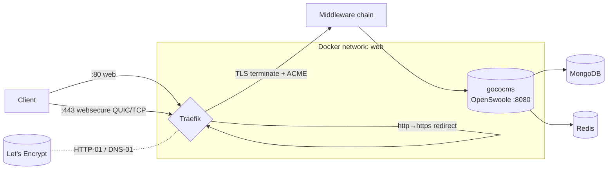
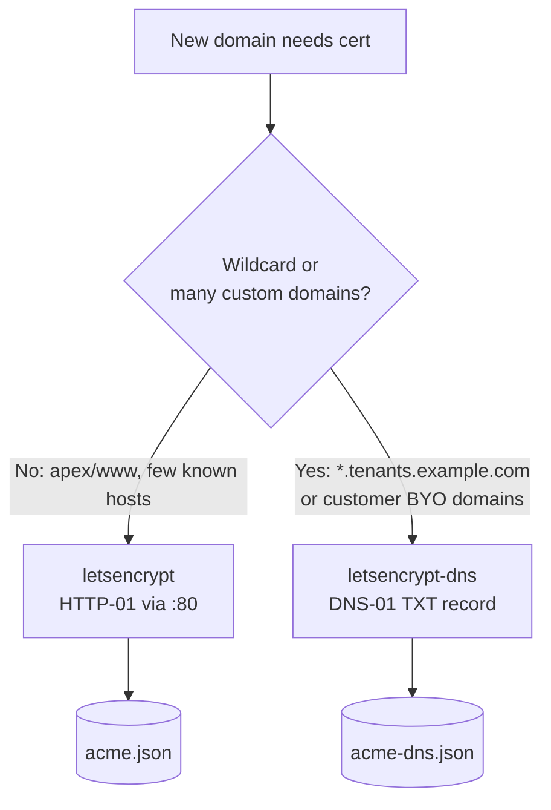

# Traefik Reverse Proxy

> The official edge router for GOCO CMS: Traefik terminates TLS, auto-issues Let's Encrypt certificates, speaks HTTP/3, and routes every workspace, website, and custom domain to the single `gococms` OpenSwoole service — no Nginx or Apache anywhere in the stack.

GOCO CMS is **Docker-first**, and its front door is **Traefik**. Traefik is the *only* supported production reverse proxy: it discovers the `gococms` container through the Docker provider, issues and renews certificates automatically, applies the security middleware chain, and multiplexes thousands of tenant domains onto one long-lived OpenSwoole worker pool. GOCO never ships with, nor recommends, Nginx or Apache in front of the runtime — the ZealPHP/OpenSwoole server binds a single port and Traefik does the rest.

> **Note**
> Nginx and Apache appear in these docs **only** as comparison or migration references. In a canonical GOCO deployment the request path is `Client → Traefik → gococms (OpenSwoole :8080)`. See [Docker Architecture](docker.md) for the full compose topology and [Deployment Guide](deployment-guide.md) for the end-to-end walkthrough.

---

## Why Traefik

| Requirement | How Traefik delivers |
| --- | --- |
| Zero-touch HTTPS | Built-in ACME client (Let's Encrypt) with HTTP-01 and DNS-01 challenges |
| Multi-tenant domains | Dynamic router discovery — new tenant domains route with no proxy reload |
| Wildcard TLS | DNS-01 wildcard certs (`*.example.com`) for subdomain-per-tenant models |
| HTTP/3 | QUIC on `websecure` via a one-line experimental flag |
| Docker-native | Reads container labels; no config file edits to add a route |
| Edge security | Compression, rate-limit, HSTS/CSP, scheme redirect as reusable middlewares |
| Observability | Prometheus metrics, access logs, and a protected dashboard |

Because Traefik reloads its dynamic configuration live (from Docker events **and** watched files), onboarding a new website or a customer's custom domain requires **no restart** of either Traefik or GOCO — a property GOCO's multi-tenancy layer relies on. See [Multi-Tenancy](../architecture/multi-tenancy.md).

---

## Request path at a glance



Traefik and `gococms` share a Docker network (conventionally named `web`). MongoDB, Redis, MinIO, Meilisearch and Mailpit live on an internal network and are never exposed to Traefik directly.

---

## Static configuration (`traefik.yml`)

Static configuration is read once at startup: it defines entrypoints, providers, and certificate resolvers. It lives at `docker/traefik/traefik.yml` in the monorepo and is mounted read-only into the container.

```yaml
# docker/traefik/traefik.yml
global:
  checkNewVersion: true
  sendAnonymousUsage: false

# ---- Entrypoints -----------------------------------------------------------
entryPoints:
  web:
    address: ":80"
    http:
      redirections:
        entryPoint:
          to: websecure
          scheme: https
          permanent: true            # global http → https 301
    # Trust the Docker network's forwarded headers only
    forwardedHeaders:
      trustedIPs:
        - "127.0.0.1/32"
        - "10.0.0.0/8"
        - "172.16.0.0/12"
        - "192.168.0.0/16"

  websecure:
    address: ":443"
    http3:
      advertisedPort: 443            # advertise QUIC via Alt-Svc
    http:
      tls:
        certResolver: letsencrypt    # default resolver for TLS routers
    transport:
      respondingTimeouts:
        readTimeout: "60s"
        writeTimeout: "0s"           # 0 = unlimited, required for SSE/streaming
        idleTimeout: "180s"

  # QUIC needs UDP/443 published in compose; see the ports block below.

# ---- Providers -------------------------------------------------------------
providers:
  docker:
    exposedByDefault: false          # only containers with traefik.enable=true
    network: web
    watch: true
    endpoint: "unix:///var/run/docker.sock"
  file:
    directory: /etc/traefik/dynamic  # file-provider dynamic config (TLS opts, static routers)
    watch: true

# ---- ACME / Let's Encrypt certificate resolvers ----------------------------
certificatesResolvers:
  # HTTP-01: single domains / apex + www (per-domain issuance)
  letsencrypt:
    acme:
      email: "ops@example.com"
      storage: /letsencrypt/acme.json
      caServer: "https://acme-v02.api.letsencrypt.org/directory"
      httpChallenge:
        entryPoint: web

  # DNS-01: wildcard + multi-tenant custom domains (no inbound challenge needed)
  letsencrypt-dns:
    acme:
      email: "ops@example.com"
      storage: /letsencrypt/acme-dns.json
      caServer: "https://acme-v02.api.letsencrypt.org/directory"
      dnsChallenge:
        provider: cloudflare         # any Traefik-supported DNS provider
        resolvers:
          - "1.1.1.1:53"
          - "8.8.8.8:53"
        delayBeforeCheck: "10s"

# ---- API / dashboard (exposed via a secured router, NOT insecure) ----------
api:
  dashboard: true
  insecure: false                    # never expose :8080 dashboard unauthenticated

# ---- Observability ---------------------------------------------------------
log:
  level: INFO
  filePath: /var/log/traefik/traefik.log
accessLog:
  filePath: /var/log/traefik/access.log
  bufferingSize: 100
metrics:
  prometheus:
    addEntryPointsLabels: true
    addRoutersLabels: true

# ---- HTTP/3 (QUIC) experimental gate on older minors -----------------------
experimental:
  http3: true
```

> **Warning**
> `acme.json` must be `chmod 600`. Traefik refuses to start if the ACME storage file is group- or world-readable. Create it before first boot: `touch docker/traefik/letsencrypt/acme.json && chmod 600 docker/traefik/letsencrypt/acme.json`.

### DNS provider credentials

The DNS-01 resolver reads provider credentials from environment variables passed to the Traefik container. For Cloudflare:

```env
# docker/traefik/.env  (referenced by the traefik service env_file)
CF_DNS_API_TOKEN=<scoped-token-with-Zone:DNS:Edit>
# Legacy alternative:
# CF_API_EMAIL=ops@example.com
# CF_API_KEY=<global-api-key>
```

Swap `provider: cloudflare` and these vars for Route 53 (`AWS_*`), DigitalOcean (`DO_AUTH_TOKEN`), Google Cloud DNS, etc. The provider name and its required env vars are the only things that change.

---

## The Traefik service in `docker-compose.yml`

Static config is mounted; every route below is expressed as **labels** so adding a tenant never touches this file.

```yaml
# docker/docker-compose.yml (traefik service excerpt)
services:
  traefik:
    image: traefik:v3.3
    container_name: gococms-traefik
    restart: unless-stopped
    command: []                       # all config via traefik.yml + dynamic files
    env_file:
      - ./traefik/.env                # DNS provider credentials
    ports:
      - "80:80"
      - "443:443/tcp"
      - "443:443/udp"                 # HTTP/3 (QUIC) needs UDP published
    volumes:
      - /var/run/docker.sock:/var/run/docker.sock:ro
      - ./traefik/traefik.yml:/etc/traefik/traefik.yml:ro
      - ./traefik/dynamic:/etc/traefik/dynamic:ro
      - ./traefik/letsencrypt:/letsencrypt
      - traefik_logs:/var/log/traefik
    networks:
      - web
    healthcheck:
      test: ["CMD", "traefik", "healthcheck", "--ping"]
      interval: 10s
      timeout: 5s
      retries: 5
    labels:
      - "traefik.enable=true"
      # Secured dashboard router (see "Securing the dashboard")
      - "traefik.http.routers.dashboard.rule=Host(`traefik.example.com`)"
      - "traefik.http.routers.dashboard.entrypoints=websecure"
      - "traefik.http.routers.dashboard.service=api@internal"
      - "traefik.http.routers.dashboard.tls.certresolver=letsencrypt"
      - "traefik.http.routers.dashboard.middlewares=dashboard-auth@file,sec-headers@file"

networks:
  web:
    name: web
    external: false

volumes:
  traefik_logs:
```

> **Note**
> Traefik must also enable `ping: {}` in `traefik.yml` (or `--ping` as a flag) for the healthcheck above to succeed. Add a top-level `ping: {}` block if you rely on the container healthcheck.

---

## Routing the `gococms` service (Docker-provider labels)

The GOCO runtime is a single container listening on `:8080`. All routing, TLS, and middleware attachment happen through labels on that container — this is the **dynamic** half of the configuration and the only thing you touch to add primary and marketing domains.

```yaml
# docker/docker-compose.yml (gococms service excerpt)
services:
  gococms:
    image: gococms/core:latest
    container_name: gococms-app
    restart: unless-stopped
    env_file:
      - ../.env
    depends_on:
      mongodb: { condition: service_healthy }
      redis:   { condition: service_healthy }
    networks:
      - web
      - internal
    healthcheck:
      test: ["CMD", "php", "app.php", "status"]
      interval: 15s
      timeout: 5s
      retries: 5
    stop_grace_period: 30s            # let OpenSwoole drain coroutines
    labels:
      - "traefik.enable=true"

      # --- Primary router: apex + www over HTTPS -------------------------
      - "traefik.http.routers.goco-web.rule=Host(`example.com`) || Host(`www.example.com`)"
      - "traefik.http.routers.goco-web.entrypoints=websecure"
      - "traefik.http.routers.goco-web.tls=true"
      - "traefik.http.routers.goco-web.tls.certresolver=letsencrypt"
      - "traefik.http.routers.goco-web.service=goco-svc"
      - "traefik.http.routers.goco-web.middlewares=sec-headers@file,compress@file,ratelimit@file"

      # --- Backend service: where OpenSwoole listens ---------------------
      - "traefik.http.services.goco-svc.loadbalancer.server.port=8080"
      - "traefik.http.services.goco-svc.loadbalancer.passhostheader=true"
      # Streaming/SSE + WebSocket friendliness
      - "traefik.http.services.goco-svc.loadbalancer.responseforwarding.flushinterval=-1"
```

Key points:

- **`passhostheader=true`** preserves the original `Host` header so GOCO's multi-tenancy resolver can map the request to the correct `workspace_id`/`website_id`. See [Request Lifecycle](../architecture/request-lifecycle.md).
- **`flushinterval=-1`** flushes each chunk immediately — required for ZealPHP generator streaming, SSE responses (`$response->sse()`), and WebSocket upgrades (`$app->ws(...)`). Combined with `writeTimeout: 0s` on the entrypoint, long-lived connections stay open.
- The router **references middlewares by `@file`** — reusable definitions declared once in the file provider (below), not redefined per router.

---

## Dynamic configuration via the file provider

Middlewares, TLS options, and any non-Docker static routers live in watched YAML files under `docker/traefik/dynamic/`. Editing them hot-reloads without a restart.

### Middlewares (`dynamic/middlewares.yml`)

```yaml
# docker/traefik/dynamic/middlewares.yml
http:
  middlewares:

    # --- Compression: gzip + Brotli ---------------------------------------
    compress:
      compress:
        encodings:
          - gzip
          - br
        minResponseBodyBytes: 1024

    # --- Rate limiting (per client IP; token bucket) ----------------------
    ratelimit:
      rateLimit:
        average: 100          # sustained req/s per source
        burst: 200            # bucket depth
        period: "1s"
        sourceCriterion:
          ipStrategy:
            depth: 1          # trust one hop (Traefik) in X-Forwarded-For

    # Stricter limit for auth/API surfaces
    ratelimit-strict:
      rateLimit:
        average: 20
        burst: 40
        period: "1s"

    # --- Security headers -------------------------------------------------
    sec-headers:
      headers:
        stsSeconds: 31536000            # HSTS: 1 year
        stsIncludeSubdomains: true
        stsPreload: true
        forceSTSHeader: true
        frameDeny: true                 # X-Frame-Options: DENY
        contentTypeNosniff: true        # X-Content-Type-Options: nosniff
        browserXssFilter: true
        referrerPolicy: "strict-origin-when-cross-origin"
        permissionsPolicy: "camera=(), microphone=(), geolocation=(self)"
        customResponseHeaders:
          X-Powered-By: ""              # strip fingerprint
          Server: ""
        # Baseline CSP — GOCO tightens per-response via the response.headers filter
        contentSecurityPolicy: >-
          default-src 'self';
          img-src 'self' data: https:;
          style-src 'self' 'unsafe-inline';
          script-src 'self';
          connect-src 'self';
          frame-ancestors 'none';
          base-uri 'self';
          form-action 'self'

    # --- HTTP → HTTPS scheme redirect (belt-and-suspenders) ---------------
    https-redirect:
      redirectScheme:
        scheme: https
        permanent: true

    # --- Dashboard basic auth --------------------------------------------
    dashboard-auth:
      basicAuth:
        # htpasswd -nbB admin '<password>' — bcrypt; $ doubled if inlined in labels
        users:
          - "admin:$2y$05$q0m5b8m2sT0J9c8oQ0m5bO0m5b8m2sT0J9c8oQ0m5bO0m5b8m2sT0"
        removeHeader: true
```

> **Tip**
> The Traefik `contentSecurityPolicy` here is a conservative **baseline**. GOCO can override or extend it per-response inside the runtime via the `response.headers` filter (`Hook::apply('response.headers', $headers, $ctx)`) — for example to add a nonce for a page-builder preview. See the [Security Model](../security/security-model.md) and [Event & Hook System](../architecture/event-hook-system.md).

> **Warning**
> In `docker-compose.yml` **labels**, every literal `$` in a bcrypt hash must be doubled (`$$`). In the **file provider** (shown above) use a single `$`. Prefer defining `basicAuth` in the file provider so hashes stay readable and versionable.

### TLS options (`dynamic/tls.yml`)

```yaml
# docker/traefik/dynamic/tls.yml
tls:
  options:
    default:
      minVersion: "VersionTLS12"
      sniStrict: true
      cipherSuites:
        - "TLS_AES_256_GCM_SHA384"
        - "TLS_CHACHA20_POLY1305_SHA256"
        - "TLS_ECDHE_ECDSA_WITH_AES_256_GCM_SHA384"
        - "TLS_ECDHE_RSA_WITH_AES_256_GCM_SHA384"
      curvePreferences:
        - "X25519"
        - "CurveP256"
    modern:
      minVersion: "VersionTLS13"
      sniStrict: true
```

---

## Let's Encrypt: HTTP-01 vs DNS-01

GOCO uses **two** ACME resolvers because the two tenancy models have different certificate needs.



### HTTP-01 — single domains

Best for the platform's own apex, `www`, marketing, and any host you control DNS for and that resolves publicly to Traefik. Traefik answers the challenge on `entryPoint: web` (:80) automatically. This is what the `goco-web` router uses via `tls.certresolver=letsencrypt`.

Constraints: HTTP-01 **cannot** issue wildcard certificates, and the domain must publicly resolve to the Traefik host before issuance.

### DNS-01 — wildcards and multi-tenant custom domains

Required when:

- You run **subdomain-per-tenant** (`acme.tenants.example.com`, `blog.tenants.example.com`, …) and want a single `*.tenants.example.com` wildcard.
- Customers bring **their own domains** and you provision certs programmatically without waiting for their traffic to hit :80.

Attach the DNS resolver and request the wildcard via router labels or a file router:

```yaml
# gococms label: wildcard tenant router using DNS-01
- "traefik.http.routers.goco-tenants.rule=HostRegexp(`^.+\\.tenants\\.example\\.com$`)"
- "traefik.http.routers.goco-tenants.entrypoints=websecure"
- "traefik.http.routers.goco-tenants.tls=true"
- "traefik.http.routers.goco-tenants.tls.certresolver=letsencrypt-dns"
- "traefik.http.routers.goco-tenants.tls.domains[0].main=tenants.example.com"
- "traefik.http.routers.goco-tenants.tls.domains[0].sans=*.tenants.example.com"
- "traefik.http.routers.goco-tenants.service=goco-svc"
- "traefik.http.routers.goco-tenants.middlewares=sec-headers@file,compress@file,ratelimit@file"
```

> **Note**
> DNS-01 needs the provider API token from `traefik/.env`. The wildcard covers **one** DNS label of depth (`foo.tenants.example.com` ✅, `a.b.tenants.example.com` ❌). For BYO customer apex domains you cannot wildcard, GOCO issues **per-domain** certs on demand — see multi-tenant routing below.

---

## HTTP/3 (QUIC)

HTTP/3 is enabled in three places, all shown above:

1. `experimental.http3: true` in `traefik.yml` (gate on older 3.x minors; a no-op on current builds).
2. `entryPoints.websecure.http3.advertisedPort: 443` so Traefik sends the `Alt-Svc` header advertising QUIC.
3. **Publish UDP/443** in compose: `"443:443/udp"`. Without the UDP port mapping, browsers silently fall back to HTTP/2 over TCP.

Verify from a client:

```bash
# Expect: alt-svc: h3=":443"; ma=...
curl -sI https://example.com | grep -i alt-svc

# Force HTTP/3 (curl built with HTTP/3 support)
curl --http3 -sI https://example.com | head -1
```

OpenSwoole terminates plain HTTP/1.1 from Traefik on the internal network; HTTP/3 is purely an edge concern between the client and Traefik, so the `gococms` runtime needs no changes.

---

## Multi-domain / multi-tenant routing

GOCO serves many websites and many custom domains from **one** backend service. Traefik's job is to route each `Host` to `goco-svc`; GOCO's job is to resolve that `Host` to a tenant. See [Multi-Tenancy](../architecture/multi-tenancy.md) for how `workspace_id` + `website_id` are derived from the domain via the `domains` collection.

### Model A — wildcard subdomains (one cert, many tenants)

Use the `goco-tenants` DNS-01 wildcard router above. New subdomains route instantly with **no cert issuance and no reload** because they are already covered by `*.tenants.example.com`. This is the cheapest, fastest path and the default for SaaS-style signups.

### Model B — customer bring-your-own domains (per-domain certs)

When a customer points `shop.customer-brand.com` at your Traefik, GOCO writes the mapping into the `domains` collection and reconciles a Traefik router for it. Two supported mechanisms:

**B1 — Dynamic file, written by GOCO's domain reconciler.** GOCO renders a router into a watched file; Traefik hot-reloads it and issues the cert (HTTP-01 once the customer's DNS resolves, or DNS-01 if you host their zone).

```yaml
# docker/traefik/dynamic/tenant-domains.yml  (generated by the domain reconciler)
http:
  routers:
    tenant-shop-customer-brand:
      rule: "Host(`shop.customer-brand.com`)"
      entryPoints: [websecure]
      service: goco-svc
      middlewares: [sec-headers, compress, ratelimit]
      tls:
        certResolver: letsencrypt        # HTTP-01 per-domain
  services:
    goco-svc:
      loadBalancer:
        passHostHeader: true
        servers:
          - url: "http://gococms:8080"
```

**B2 — On-demand TLS.** For truly dynamic BYO domains at scale, front GOCO with a wildcard where possible and reconcile file routers per verified custom domain (B1). Traefik does not do fully lazy "issue-on-first-SNI" like some CDNs; GOCO therefore drives issuance deterministically from the `domains` collection state machine (`pending → verifying → active`), which is auditable via `audit_logs`.

```mermaid
sequenceDiagram
  participant U as Customer
  participant G as GOCO (domains svc)
  participant F as dynamic/tenant-domains.yml
  participant T as Traefik
  participant L as Let's Encrypt
  U->>G: Add domain shop.customer-brand.com + points DNS
  G->>G: Verify CNAME/A → mark verifying
  G->>F: Render router (file provider)
  T-->>F: Watch detects change (hot reload)
  T->>L: ACME HTTP-01 challenge on :80
  L-->>T: Certificate issued → acme.json
  T-->>U: HTTPS live; GOCO marks domain active
```

> **Tip**
> Keep the platform's own hosts on the **HTTP-01** resolver and tenant wildcards on the **DNS-01** resolver. Splitting ACME storage (`acme.json` vs `acme-dns.json`) isolates rate-limit blast radius — Let's Encrypt limits are per-registered-domain, and wildcards consume a different budget than per-host certs.

---

## Securing the dashboard

The Traefik dashboard exposes routing internals and **must never** run with `api.insecure: true` in production. GOCO's hardened pattern:

1. `api.insecure: false` in `traefik.yml` (no unauthenticated `:8080`).
2. Route the internal `api@internal` service through a normal HTTPS router on a dedicated host (`traefik.example.com`).
3. Attach `dashboard-auth` (basic auth, bcrypt) **and** `sec-headers`.
4. Optionally add an `ipAllowList` middleware to restrict to office/VPN ranges.

```yaml
# docker/traefik/dynamic/dashboard.yml (alternative to labels; file provider)
http:
  routers:
    dashboard:
      rule: "Host(`traefik.example.com`)"
      entryPoints: [websecure]
      service: api@internal
      middlewares: [dashboard-auth, sec-headers, dashboard-ipallow]
      tls:
        certResolver: letsencrypt
  middlewares:
    dashboard-ipallow:
      ipAllowList:
        sourceRange:
          - "203.0.113.0/24"     # office egress
          - "10.8.0.0/24"        # VPN
```

Generate the bcrypt credential:

```bash
# Interactive prompt for the password; outputs user:hash
htpasswd -nB admin
# → admin:$2y$05$....   (single $ in file provider; double $$ if pasted into compose labels)
```

> **Warning**
> Do not publish port `8080` in the Traefik compose service. If the legacy insecure dashboard was ever enabled, remove the `--api.insecure=true` flag and the `8080:8080` port mapping before going to production.

---

## Operations

### Validate and reload

```bash
# Sanity-check static config before boot
docker run --rm -v "$PWD/docker/traefik/traefik.yml:/etc/traefik/traefik.yml:ro" \
  traefik:v3.3 traefik --configFile=/etc/traefik/traefik.yml --dry-run || true

# Bring up the edge
docker compose -f docker/docker-compose.yml up -d traefik gococms

# Tail router/cert activity
docker compose logs -f traefik | grep -Ei 'acme|router|error'
```

Dynamic (file provider + Docker labels) changes reload automatically — no `restart` needed. Only `traefik.yml` (static) changes require `docker compose restart traefik`.

### Inspect ACME state

```bash
docker compose exec traefik sh -c 'jq ".[].Certificates | length" /letsencrypt/acme*.json'
```

### Health

- Container healthcheck uses `traefik healthcheck --ping` (enable `ping:` in static config).
- Prometheus metrics scrape target: the Traefik entrypoint on the internal metrics port (configure `metrics.prometheus.entryPoint` if you split it out).
- Access logs at `/var/log/traefik/access.log` feed the analytics pipeline; see [Deployment Guide](deployment-guide.md).

---

## Common pitfalls

| Symptom | Cause | Fix |
| --- | --- | --- |
| `acme.json` permission error, Traefik won't start | File is group/world readable | `chmod 600 acme.json` |
| Certs not issued (HTTP-01) | Domain doesn't resolve to Traefik, or :80 blocked | Fix DNS/A record; ensure port 80 published |
| Wildcard cert fails | Used HTTP-01 for `*.` | Switch that router to `letsencrypt-dns` |
| HTTP/3 not negotiated | UDP/443 not published | Add `"443:443/udp"` to ports |
| Wrong tenant served | Host header rewritten | Set `passhostheader=true` |
| SSE/WebSocket drops | Buffered forwarding / write timeout | `flushinterval=-1`, entrypoint `writeTimeout: 0s` |
| Dashboard publicly reachable | `api.insecure: true` / `8080` published | Disable insecure, route via secured router |
| Rate limit too aggressive behind CDN | `X-Forwarded-For` depth wrong | Tune `ipStrategy.depth` |

---

## Related

- [Docker Architecture](docker.md)
- [Deployment Guide](deployment-guide.md)
- [Scaling Strategy](scaling.md)
- [Backup & Restore](backup-restore.md)
- [Multi-Tenancy](../architecture/multi-tenancy.md)
- [Request Lifecycle](../architecture/request-lifecycle.md)
- [Caching, Queue & Realtime (Redis)](../architecture/caching-and-queue.md)
- [Security Model](../security/security-model.md)
- [Event & Hook System](../architecture/event-hook-system.md)
- [Configuration Reference](../reference/configuration-reference.md)
- [Documentation Index](../README.md)
