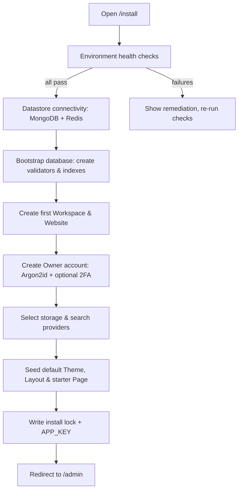

# Installation

> Stand up a complete GOCO CMS stack — ZealPHP on OpenSwoole, MongoDB, Redis, Traefik, and object storage — using one of three supported install paths, then verify it with the `goco` CLI and the installer app.

GOCO CMS — **The Open Source Website Operating System** — is designed to be brought up with a single command. This page covers the system requirements, the three official install paths, the first-run installer flow, health verification, and troubleshooting for the parts that most often bite (OpenSwoole, `ext-zealphp`, ports, and datastore connectivity).

If you are new here, read the [Overview](../introduction/overview.md) and [Quick Start](quick-start.md) first, then come back to pick an install path.

---

## 1. Requirements

GOCO CMS runs on the ZealPHP runtime ([sibidharan/zealphp](https://github.com/sibidharan/zealphp)) atop OpenSwoole. The **Docker Compose** path bundles every dependency and is the recommended way to start — you only need Docker on the host. The **local dev** and **from source** paths require you to provide the runtime and datastores yourself.

### 1.1 Host requirements (Docker path)

| Component | Minimum | Notes |
| --- | --- | --- |
| Docker Engine | 24.0+ | With the Compose V2 plugin (`docker compose`, not `docker-compose`). |
| CPU | 2 cores | 4+ recommended for the OpenSwoole worker pool. |
| RAM | 2 GB | 4 GB+ recommended when MinIO + Meilisearch are enabled. |
| Disk | 5 GB free | MongoDB data, Redis snapshots, object storage, and images. |
| OS | Linux, macOS, or Windows (WSL2) | Traefik auto-HTTPS requires reachable ports 80/443 in production. |

### 1.2 Runtime requirements (local dev / from source)

| Component | Version | Purpose |
| --- | --- | --- |
| PHP | **8.4+** | ZealPHP requires PHP 8.4 or newer. |
| OpenSwoole | **22.1+** | Coroutine runtime and HTTP server (`ext-openswoole`). |
| `ext-zealphp` | latest | ZealPHP native extension: per-coroutine superglobal isolation, session isolation, shared `Store`. |
| Composer | 2.6+ | Dependency management and `create-project`. |
| MongoDB | 6.0+ (7.0+ recommended) | Primary datastore; **replica set required** for multi-document transactions. |
| Redis | 7.0+ | Cache, queue, realtime pub/sub, locks, rate-limit, sessions. |
| `ext-mongodb` | 1.17+ | PHP driver for MongoDB. |
| `ext-redis` | 6.0+ | PHP driver for Redis. |

> **Warning**
> GOCO CMS uses MongoDB **multi-document transactions** to keep cross-collection invariants (for example, publishing a page and writing its `page_revisions` + `audit_logs` entries atomically). Transactions require MongoDB to run as a **replica set** — even a single-node replica set (`rs0`) is fine. The Docker image configures this for you.

### 1.3 Optional services

| Service | When you need it | Docs |
| --- | --- | --- |
| **MinIO** | S3-compatible object storage for media without a cloud account. | [Storage & Media](../architecture/storage.md) |
| **Amazon S3** | Production object storage. | [Storage & Media](../architecture/storage.md) |
| **Meilisearch** / **OpenSearch** | Faster/typo-tolerant search than the MongoDB text provider. | [Search](../architecture/search.md) |
| **Mailpit** | Local SMTP capture for dev email. | [Configuration](configuration.md) |
| **Watchtower** | Automatic container image updates. | [Docker Architecture](../deployment/docker.md) |

> **Note**
> Reverse proxying, automatic HTTPS (Let's Encrypt), HTTP/3, and per-tenant routing are handled by **Traefik**. GOCO CMS does **not** use Nginx or Apache as the primary proxy. See [Traefik Reverse Proxy](../deployment/traefik.md).

---

## 2. Path A — Docker Compose (recommended) `stable`

This is the fastest, most reproducible way to run GOCO CMS. Everything — the ZealPHP runtime, MongoDB, Redis, Traefik, MinIO, Meilisearch, and Mailpit — starts from one Compose file.

### 2.1 Clone and configure

```bash
git clone https://github.com/gococms/gococms.git
cd gococms
cp .env.example .env
```

Open `.env` and set at minimum a base domain and the datastore credentials. A working local default looks like this:

```env
# --- Core ---
APP_ENV=local
APP_URL=http://localhost
APP_KEY=                      # generated on first boot if empty
BASE_DOMAIN=localhost

# --- ZealPHP runtime ---
ZEAL_HOST=0.0.0.0
ZEAL_PORT=8080
APP_MODE=coroutine           # coroutine | legacy_cgi | coroutine_legacy | mixed
ZEAL_WORKERS=4

# --- MongoDB (single-node replica set rs0) ---
MONGODB_URI=mongodb://mongodb:27017/?replicaSet=rs0
MONGODB_DB=goco

# --- Redis ---
REDIS_URL=redis://redis:6379

# --- Object storage (MinIO by default) ---
STORAGE_DRIVER=minio          # local | minio | s3
MINIO_ENDPOINT=http://minio:9000
MINIO_KEY=gococms
MINIO_SECRET=change-me-please
MINIO_BUCKET=gococms-media

# --- Search ---
SEARCH_PROVIDER=meilisearch   # mongodb | meilisearch | opensearch
MEILISEARCH_HOST=http://meilisearch:7700
MEILISEARCH_KEY=change-me-please

# --- Dev mail ---
MAIL_DSN=smtp://mailpit:1025

# --- Traefik ---
ACME_EMAIL=you@example.com
```

See the full list in the [Configuration Reference](../reference/configuration-reference.md) and the annotated walkthrough in [Configuration](configuration.md).

### 2.2 Bring the stack up

```bash
docker compose up -d
```

That single command builds/pulls images and starts every service. Watch them become healthy:

```bash
docker compose ps
```

### 2.3 Services that start

| Compose service | Image role | Ports | Health |
| --- | --- | --- | --- |
| `gococms` | ZealPHP + OpenSwoole app server (runs `app.php`) | 8080 (internal) | `php app.php status` / HTTP `/healthz` |
| `mongodb` | Primary database (replica set `rs0`) | 27017 | `mongosh --eval "db.adminCommand('ping')"` |
| `redis` | Cache / queue / realtime / sessions | 6379 | `redis-cli ping` -> `PONG` |
| `traefik` | Reverse proxy, auto-HTTPS, HTTP/3, routing | 80, 443, 8081 (dashboard) | Traefik ping route |
| `minio` | S3-compatible object storage | 9000 (API), 9001 (console) | `/minio/health/live` |
| `meilisearch` | Search provider | 7700 | `/health` |
| `mailpit` | Dev SMTP capture + web UI | 1025 (SMTP), 8025 (UI) | `/readyz` |
| `watchtower` *(optional)* | Container auto-update | — | logs |

Each service defines a **healthcheck**, a **restart policy**, environment, and graceful shutdown. Traefik discovers `gococms` through Docker provider labels and creates per-tenant routers. For the full topology see [Docker Architecture](../deployment/docker.md).

> **Tip**
> The `gococms` container is **not** published directly on a host port — Traefik fronts it. Reach the site at `http://localhost` (Traefik) and the installer at `http://localhost/install`. The Traefik dashboard is at `http://localhost:8081`, MinIO console at `http://localhost:9001`, and Mailpit at `http://localhost:8025`.

Once containers report `healthy`, continue to the [first-run installer](#5-first-run-installer-appsinstaller).

---

## 3. Path B — Composer create-project (local dev) `stable`

Use this when you want to hack on GOCO CMS itself with the runtime installed natively on your machine (faster edit/reload, native debugger). You still typically run MongoDB and Redis in containers.

### 3.1 Verify the runtime

```bash
php -v                        # expect PHP 8.4.x
php -m | grep -i openswoole   # expect openswoole
php -m | grep -i zealphp      # expect zealphp
php --ri openswoole | grep -i version   # expect 22.1+
```

If any are missing, jump to [Installing OpenSwoole and ext-zealphp](#71-installing-openswoole-and-ext-zealphp).

### 3.2 Create the project

```bash
composer create-project gococms/gococms gococms --stability=dev
cd gococms
```

This scaffolds the full monorepo:

```text
gococms/
├── app.php                 # ZealPHP runtime entry file
├── goco                    # developer CLI (PHP console app)
├── composer.json
├── .env.example
├── apps/                   # admin, api, website, installer
├── core/
├── packages/               # auth, widget-engine, template-engine, plugin-engine,
│                           # database, queue, storage, seo, ai, analytics, forms
├── cli/
├── plugins/  themes/  widgets/  templates/
├── docker/
└── docs/  tests/  scripts/  examples/
```

See [Project Structure](project-structure.md) for a field-by-field tour.

### 3.3 Provide datastores

Run just the data services from the bundled Compose file (leave the app to run natively):

```bash
docker compose up -d mongodb redis minio meilisearch mailpit
```

### 3.4 Configure and boot

```bash
cp .env.example .env
# point the URIs at localhost since the app runs on the host:
#   MONGODB_URI=mongodb://127.0.0.1:27017/?replicaSet=rs0
#   REDIS_URL=redis://127.0.0.1:6379
composer install
php app.php                  # foreground; Ctrl-C to stop
```

`app.php` boots ZealPHP, which under the hood does:

```php
require 'vendor/autoload.php';

use ZealPHP\App;

App::superglobals(false);              // per-coroutine superglobal isolation via ext-zealphp
App::mode(App::MODE_COROUTINE);        // modern default
$app = App::init('0.0.0.0', 8080);
$app->run();
```

To run it detached and manage it like a service, use the ZealPHP process CLI:

```bash
php app.php start -d      # start detached
php app.php status        # show worker/master status
php app.php logs          # tail logs (also in /tmp/zealphp/)
php app.php restart
php app.php stop
```

Then open `http://localhost:8080/install`.

---

## 4. Path C — From source (contributors) `beta`

For contributors who want the raw monorepo checkout, tests, and packages linked from Git.

```bash
git clone https://github.com/gococms/gococms.git
cd gococms
composer install                      # installs root + all packages/* via path repositories
cp .env.example .env
```

The monorepo wires the internal packages (`gococms/core`, `gococms/cli`, `gococms/widget-engine`, …) as Composer **path repositories**, so edits in `packages/*` and `core/` are picked up without republishing.

Bring up datastores and boot exactly as in [Path B](#3-path-b--composer-create-project-local-dev):

```bash
docker compose up -d mongodb redis minio meilisearch mailpit
php app.php start -d
```

Run the test suite to confirm the checkout is healthy:

```bash
./goco test                 # or: composer test
```

For coding conventions and the contribution workflow, see [Contributing](../community/contributing.md), [Coding Standards](../community/coding-standards.md), and [Testing Strategy](../community/testing-strategy.md).

---

## 5. First-run installer (`apps/installer`)

Regardless of path, the first time GOCO CMS boots without a completed installation, requests are routed to the installer app at **`/install`**. The installer is itself a GOCO app under `apps/installer` and runs its checks inside the ZealPHP runtime, so it validates the *actual* environment your site will use.

### 5.1 Installer flow



Step by step:

1. **Environment checks** — PHP 8.4+, OpenSwoole 22.1+, `ext-zealphp`, `ext-mongodb`, `ext-redis`, writable `storage/`, and required `.env` keys.
2. **Datastore connectivity** — pings MongoDB (and confirms replica-set/transaction support) and Redis.
3. **Database bootstrap** — creates the collections with their **JSON-Schema validators** and documented **indexes** (`workspaces`, `websites`, `users`, `pages`, `page_revisions`, `audit_logs`, …). See [Data Model](../architecture/data-model.md).
4. **Workspace + Website** — creates the first `workspace` and `website`, establishing the tenant scope (`workspace_id` + `website_id`).
5. **Owner account** — creates the `owner` role account with an **Argon2id**-hashed password; optionally enrolls **TOTP 2FA** or a **Passkey (WebAuthn)**. See [Authentication](../core/authentication.md).
6. **Providers** — confirms the storage driver (Local / MinIO / S3) and search provider (MongoDB / Meilisearch / OpenSearch).
7. **Seed** — installs the default theme, a starter layout, and a home page so the site renders immediately.
8. **Lock** — writes the install lock (`storage/install.lock`) and persists `APP_KEY`; subsequent visits to `/install` return `409 Already Installed`.

> **Note**
> The installer can be driven non-interactively for CI and automated deployments:
> ```bash
> ./goco install \
>   --owner-email you@example.com \
>   --owner-password 'strong-passphrase' \
>   --workspace "Acme" \
>   --website "acme.com" \
>   --non-interactive
> ```

---

## 6. Verifying the installation

### 6.1 Container and service health (Docker path)

```bash
docker compose ps                          # every service should read "healthy"
docker compose logs -f gococms             # boot log for the app server
```

### 6.2 The `goco` CLI health command

The `goco` binary (a PHP console app for lifecycle + generators) exposes a doctor command that checks every dependency from inside the app:

```bash
# Docker path — run inside the app container:
docker compose exec gococms ./goco doctor

# Local/source path — run on the host:
./goco doctor
```

Expected output:

```text
GOCO CMS Doctor
  [ok] PHP 8.4.3
  [ok] OpenSwoole 22.1.0
  [ok] ext-zealphp loaded (superglobal isolation: on)
  [ok] MongoDB reachable — replica set rs0, transactions supported
  [ok] Redis reachable — PONG (12ms)
  [ok] Storage driver: minio — bucket "gococms-media" writable
  [ok] Search provider: meilisearch — /health ok
  [ok] Mail DSN: smtp://mailpit:1025 — reachable
  [ok] Install lock present — installation complete
Environment healthy.
```

Related `goco` commands:

```bash
./goco status          # app + datastore status summary
./goco migrate:status  # collection validators & index sync state
./goco cache:health    # Redis latency and keyspace summary
```

See the full command set in the [CLI Reference](../reference/cli-reference.md) and [CLI SDK](../sdk/cli.md).

### 6.3 ZealPHP process status

```bash
# Docker path:
docker compose exec gococms php app.php status

# Local/source path:
php app.php status
```

This reports the ZealPHP master/manager/worker PIDs, the active `App::mode()`, worker count, and uptime. Logs live in `/tmp/zealphp/` (`php app.php logs` tails them).

### 6.4 HTTP smoke test

```bash
curl -fsS http://localhost/healthz && echo "  <- app OK"
curl -fsS http://localhost/api/health          # file-based REST endpoint (apps/api)
```

The `/healthz` route returns `200` with a JSON body summarizing datastore reachability; a non-`200` means the app booted but a dependency is unhealthy — check `goco doctor`.

---

## 7. Troubleshooting

### 7.1 Installing OpenSwoole and ext-zealphp

If `php -m` does not list `openswoole` or `zealphp`, install them via PECL (do **not** install `ext-swoole` alongside `ext-openswoole` — they conflict):

```bash
# OpenSwoole 22.1+
pecl install openswoole
# During the prompts, enable: sockets, openssl, http2, curl
echo "extension=openswoole.so" | sudo tee /etc/php/8.4/cli/conf.d/20-openswoole.ini

# ext-zealphp (per-coroutine superglobal & session isolation, shared Store)
pecl install zealphp
echo "extension=zealphp.so" | sudo tee /etc/php/8.4/cli/conf.d/30-zealphp.ini

php --ri openswoole | grep -i version   # confirm 22.1+
php -m | grep -i zealphp
```

> **Warning**
> `ext-zealphp` must load **after** `openswoole` (note the `30-` vs `20-` filename ordering). If you see `superglobal isolation: off` in `goco doctor`, the extension is not loaded or is loaded before OpenSwoole. The Docker image already builds both extensions with the correct ordering — prefer [Path A](#2-path-a--docker-compose-recommended-stable) if the native build is troublesome.

### 7.2 Port conflicts

Symptoms: `docker compose up` fails with `address already in use`, or Traefik cannot bind 80/443.

```bash
# Find what holds the port (example: 80)
sudo lsof -iTCP:80 -sTCP:LISTEN
```

Common culprits and fixes:

- A host Nginx/Apache already owns 80/443 — stop it, or remap Traefik entrypoints in `.env`:
  ```env
  TRAEFIK_HTTP_PORT=8080
  TRAEFIK_HTTPS_PORT=8443
  ```
- The native ZealPHP server ([Path B](#3-path-b--composer-create-project-local-dev)) collides on 8080 — change `ZEAL_PORT` in `.env` or pass a port to `App::init()`.
- MongoDB 27017 / Redis 6379 already running on the host — either stop the host service or remove the port publish from the datastore services (containers still reach each other on the Compose network).

### 7.3 MongoDB connectivity and transactions

```bash
docker compose exec mongodb mongosh --eval "db.adminCommand('ping')"
docker compose exec mongodb mongosh --eval "rs.status().ok"   # expect 1
```

- **`Transaction numbers are only allowed on a replica set member`** — MongoDB is running standalone. Initialize the single-node replica set:
  ```javascript
  // in mongosh
  rs.initiate({ _id: "rs0", members: [{ _id: 0, host: "mongodb:27017" }] })
  ```
  Ensure `MONGODB_URI` includes `?replicaSet=rs0`.
- **`Server selection timed out`** from the app — the `gococms` container cannot resolve `mongodb`. Confirm both are on the same Compose network (`docker compose ps`) and that `MONGODB_URI` uses the **service name** (`mongodb`), not `127.0.0.1`, when the app runs in a container.
- Native/local runs must instead point at `127.0.0.1:27017`.

### 7.4 Redis connectivity

```bash
docker compose exec redis redis-cli ping        # expect PONG
```

- **`Connection refused`** — check `REDIS_URL` host: `redis` inside Compose, `127.0.0.1` for native runs.
- **`NOAUTH Authentication required`** — set the password in the URL: `redis://:password@redis:6379`.

### 7.5 Installer will not open / loops back to `/install`

- `storage/` not writable: `chmod -R u+rwX storage` (or fix the container volume permissions).
- Health checks failing silently: run `./goco doctor` to see the specific failing dependency.
- Stuck "already installed": if you intend to re-run a fresh install, remove the lock and re-run — this is destructive to the install state only, not your data:
  ```bash
  rm storage/install.lock
  ```

### 7.6 Reading logs

```bash
docker compose logs -f gococms      # app server (Docker)
php app.php logs                     # ZealPHP logs (native) — files in /tmp/zealphp/
docker compose logs traefik         # routing / TLS / ACME issues
```

---

## 8. Next steps

- [Quick Start](quick-start.md) — build your first page, widget, and theme.
- [Configuration](configuration.md) — every `.env` key explained.
- [Project Structure](project-structure.md) — the monorepo layout.
- [Docker Architecture](../deployment/docker.md) — production Compose topology.
- [Deployment Guide](../deployment/deployment-guide.md) — going to production with Traefik + Let's Encrypt.

---

## Related

- [Quick Start](quick-start.md)
- [Configuration](configuration.md)
- [Project Structure](project-structure.md)
- [Configuration Reference](../reference/configuration-reference.md)
- [CLI Reference](../reference/cli-reference.md)
- [Docker Architecture](../deployment/docker.md)
- [Traefik Reverse Proxy](../deployment/traefik.md)
- [Deployment Guide](../deployment/deployment-guide.md)
- [ZealPHP Foundation](../architecture/zealphp-foundation.md)
- [MongoDB Data Layer](../architecture/database-mongodb.md)
- [Storage & Media](../architecture/storage.md)
- [Search](../architecture/search.md)
- [Authentication](../core/authentication.md)
- [Overview](../introduction/overview.md)
- [Documentation Index](../README.md)
