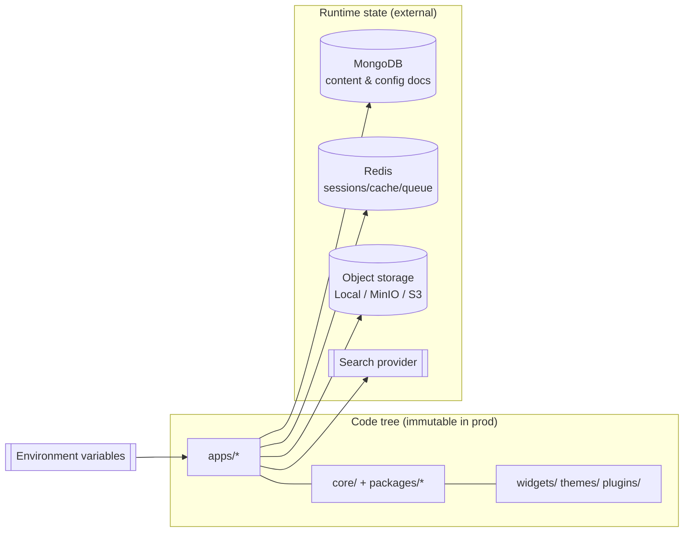
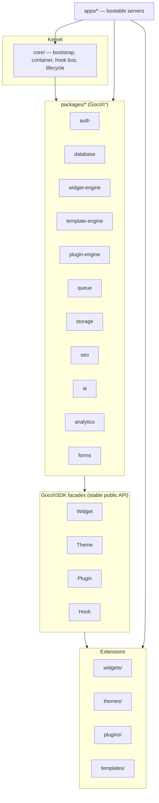

# Project Structure

> The complete map of the GOCO CMS monorepo — every top-level folder, a single app's internal ZealPHP layout, and the precise boundary between **core**, **package**, and **extension**.

GOCO CMS ships as a **modular monorepo**: one repository, many independently versioned Composer packages, plus runnable apps, extensions (widgets/themes/plugins/templates), and the infrastructure (Docker, Traefik) that wires them together. This page is the authoritative reference for *where things live and why*. Read it once and you will be able to predict the location of any file in the project.

If you have not yet cloned and run the project, start with [Installation](./installation.md) and the [Quick Start](./quick-start.md), then come back here to understand what you are looking at.

---

## Design principles behind the layout

The structure is not accidental. Five rules govern where a file goes:

1. **Core is small.** The `core/` module and `packages/*` implement the "operating system"; everything user-facing is an extension. This is the [Website Operating System](../introduction/philosophy.md) principle in physical form.
2. **Packages are libraries; apps are executables.** A package in `packages/` never assumes an HTTP context, a tenant, or a request. An app in `apps/` is a bootable ZealPHP server that composes packages.
3. **Extensions live in flat, discoverable roots.** `widgets/`, `themes/`, `plugins/`, `templates/` are scanned at boot and can be added or removed without touching core.
4. **One namespace, many packages.** Everything is PSR-4 under `Goco\`, sub-namespaced per package. There is no `App\` god-namespace.
5. **Runtime state is never in the code tree.** Uploads, compiled templates, logs, and sessions live under a writable `storage/` per app (and in MongoDB/Redis/object storage), never mixed with source.

> **Note** GOCO uses **Semantic Versioning** and **Conventional Commits**. Each Composer package under `packages/` carries its own `composer.json` and can be tagged and released independently, even though they share one Git history. See [Contributing](../community/contributing.md).

---

## Top-level tree

```text
gococms/
├── apps/                     # Bootable ZealPHP servers (executables)
│   ├── admin/                #   Admin dashboard (Page Builder, settings, RBAC UI)
│   ├── api/                  #   Headless REST/JSON + WebSocket API surface
│   ├── website/             #   Public front-end renderer (themes + widgets)
│   └── installer/            #   First-run setup wizard & health checks
│
├── core/                     # The kernel: bootstrap, container, hooks, lifecycle
│
├── packages/                 # Independently versioned Composer libraries (Goco\*)
│   ├── auth/                 #   Sessions, JWT, OAuth2, 2FA, Passkeys, RBAC/ABAC
│   ├── widget-engine/        #   Widget registration, rendering, property schemas
│   ├── template-engine/      #   PHP template compiler, regions, fragments (htmx)
│   ├── plugin-engine/        #   Plugin lifecycle, sandboxing, capability grants
│   ├── database/             #   MongoDB document-mapper + Repository pattern
│   ├── queue/                #   Redis jobs, scheduler, realtime, locks, rate-limit
│   ├── storage/              #   Object-storage drivers: Local, MinIO, S3
│   ├── seo/                  #   Meta, sitemaps, structured data, redirects
│   ├── ai/                   #   AI provider abstraction & content assist
│   ├── analytics/            #   Event capture, aggregation pipelines, reports
│   └── forms/                #   Form builder, validation, submissions
│
├── cli/                      # The `goco` developer console (lifecycle + generators)
│
├── plugins/                  # Installed/first-party plugins (extensions)
├── themes/                   # Installed themes (extensions)
├── widgets/                  # Standalone/first-party widgets (extensions)
├── templates/                # Reusable page/layout templates (extensions)
│
├── docker/                   # Dockerfiles, compose files, Traefik config, env
├── docs/                     # This documentation set (README.md is the index)
├── tests/                    # Cross-package integration & end-to-end suites
├── scripts/                  # Dev/ops scripts (seed, migrate-index, release)
├── examples/                 # Runnable example widgets/plugins/themes
│
├── composer.json             # Root manifest: path repositories + monorepo scripts
├── app.php                   # Runtime entry file (bootstraps a ZealPHP App)
└── goco                      # Symlink/shim to cli/ — the developer CLI binary
```

> **Tip** The two files developers touch most often at the root are **`app.php`** (the ZealPHP bootstrap that turns a folder into a running server) and **`goco`** (the CLI). Everything else you interact with lives one directory deeper.

---

## Folder → responsibility → namespace

| Path | Responsibility | Namespace / Composer package | Kind |
|------|----------------|------------------------------|------|
| `apps/admin/` | Admin UI: Page Builder, settings, users, plugins | `Goco\App\Admin` · `gococms/app-admin` | App |
| `apps/api/` | Headless REST + WebSocket/SSE surface | `Goco\App\Api` · `gococms/app-api` | App |
| `apps/website/` | Public site rendering (theme + widgets) | `Goco\App\Website` · `gococms/app-website` | App |
| `apps/installer/` | First-run wizard, DB/index provisioning, health checks | `Goco\App\Installer` · `gococms/app-installer` | App |
| `core/` | Kernel: bootstrap, service container, hook bus, request lifecycle | `Goco\Core` · `gococms/core` | Core |
| `packages/auth/` | Auth: Redis sessions, JWT, OAuth2, 2FA (TOTP), Passkeys, RBAC/ABAC | `Goco\Auth` · `gococms/auth` | Package |
| `packages/widget-engine/` | Widget registry, rendering, `PropertySchema`, preview | `Goco\Widget` · `gococms/widget-engine` | Package |
| `packages/template-engine/` | Template compiler, regions, streams, htmx fragments | `Goco\Template` · `gococms/template-engine` | Package |
| `packages/plugin-engine/` | Plugin install/boot/route/permission lifecycle | `Goco\Plugin` · `gococms/plugin-engine` | Package |
| `packages/database/` | MongoDB document-mapper + Repository, validators, indexes | `Goco\Database` · `gococms/database` | Package |
| `packages/queue/` | Redis jobs, cron/scheduler, realtime pub/sub, locks, rate-limits | `Goco\Queue` · `gococms/queue` | Package |
| `packages/storage/` | Object storage driver interface (Local, MinIO, S3) | `Goco\Storage` · `gococms/storage` | Package |
| `packages/seo/` | Meta tags, sitemaps, JSON-LD, canonical, redirects | `Goco\Seo` · `gococms/seo` | Package |
| `packages/ai/` | AI provider abstraction, content assist, embeddings | `Goco\Ai` · `gococms/ai` | Package |
| `packages/analytics/` | Event capture + aggregation-pipeline reporting | `Goco\Analytics` · `gococms/analytics` | Package |
| `packages/forms/` | Form definitions, validation, submissions | `Goco\Forms` · `gococms/forms` | Package |
| `cli/` | `goco` console: lifecycle commands + code generators | `Goco\Cli` · `gococms/cli` | Core tooling |
| `plugins/` | Installed plugins (feature extensions) | `Goco\Plugins\<Slug>` | Extension |
| `themes/` | Installed themes (presentation) | `Goco\Themes\<Slug>` | Extension |
| `widgets/` | Standalone widgets (UI building blocks) | `Goco\Widgets\<Type>` | Extension |
| `templates/` | Reusable page/layout templates | resources (no PHP namespace) | Extension |
| `docker/` | Dockerfiles, `compose.yml`, Traefik dynamic config | infra (no namespace) | Infra |
| `docs/` | Documentation (this set) | docs (no namespace) | Docs |
| `tests/` | Cross-package integration + e2e | `Goco\Tests` | Tests |
| `scripts/` | Ops scripts: seed, index sync, release | shell/PHP (no namespace) | Tooling |
| `examples/` | Runnable reference extensions | `Goco\Examples\*` | Examples |

The SDK facades your extensions actually import — `Goco\SDK\{Widget,Theme,Plugin,Hook}` — are thin, stable public entry points that delegate into the packages above. See the [Widget SDK](../sdk/widget-sdk.md), [Theme SDK](../sdk/theme-sdk.md), [Plugin SDK](../sdk/plugin-sdk.md), and [Hook SDK](../sdk/hook-sdk.md).

---

## The four apps

Each folder under `apps/` is a **complete, bootable ZealPHP server**. They share the same packages but expose different surfaces and are deployed as separate processes (and separate Traefik routers). None of them contains business logic that is not delegated to a package.

| App | Surface | Typical Traefik host | Notes |
|-----|---------|----------------------|-------|
| `website` | Public HTML (htmx), themes, widgets, SSE | `example.com`, tenant domains | The renderer. Read-heavy, cache-first. |
| `admin` | Authenticated dashboard, Page Builder (htmx) | `admin.example.com` | Requires session; RBAC-gated. |
| `api` | REST/JSON, WebSocket, JWT | `api.example.com` | Stateless, token-authenticated. |
| `installer` | Setup wizard, health, provisioning | `install.example.com` (temporary) | Run once; can be disabled post-install. |

> **Note** In development you can run a single unified process, but production deploys the apps independently so each scales on its own. See [Scaling Strategy](../deployment/scaling.md) and [Docker Architecture](../deployment/docker.md).

> **Frontend model** The `website` and `admin` apps render **server HTML enhanced with [htmx](https://htmx.org)** — interactions swap `App::fragment()` regions over the wire (with SSE/WebSocket for live updates) rather than shipping a client-side SPA. See [Rendering Pipeline](../architecture/rendering-pipeline.md) and [ZealPHP Foundation](../architecture/zealphp-foundation.md).

---

## Inside a single app (ZealPHP layout)

Every app follows the same internal layout. Using `apps/website/` as the example:

```text
apps/website/
├── app.php                # Bootstraps the ZealPHP App and calls $app->run()
├── composer.json          # App manifest (requires gococms/core + packages)
│
├── public/                # Web root — the ONLY publicly served directory
│   ├── index.php          #   Front controller (delegates to ../app.php)
│   ├── assets/            #   Compiled CSS/JS, theme assets, favicons
│   └── robots.txt         #   Static public files
│
├── api/                   # File-based REST — path maps 1:1 to URL
│   ├── health.php         #   GET /api/health           -> returns array (auto-JSON)
│   ├── search/query.php   #   GET /api/search/query      -> Generator/array
│   └── menu/items.php     #   GET /api/menu/items
│
├── src/                   # App-specific PHP (controllers, route defs, middleware)
│   ├── Bootstrap.php      #   Wires container, registers hooks/middleware
│   ├── Routes.php         #   $app->route(...) / nsRoute(...) definitions
│   ├── Controllers/       #   Handlers invoked by routes
│   └── Middleware/        #   App-local PSR-15 middleware
│
├── template/              # PHP view templates rendered by App::render()
│   ├── layouts/           #   Layout shells (regions defined by the theme)
│   ├── partials/          #   Reusable partials & htmx fragments
│   └── pages/             #   Page-level views
│
└── storage/               # Writable runtime state — NOT source, NOT public
    ├── cache/             #   Compiled templates, computed fragments
    ├── uploads/           #   Local object-storage driver root (dev)
    ├── sessions/          #   Fallback session files (Redis is primary)
    ├── logs/              #   App logs (ZealPHP also writes to /tmp/zealphp/)
    └── tmp/               #   Scratch / in-flight upload buffers
```

### How the ZealPHP conventions map to these folders

- **`app.php`** is the runtime entry file. It bootstraps the framework and starts the OpenSwoole server:

  ```php
  <?php
  require 'vendor/autoload.php';

  use ZealPHP\App;

  App::superglobals(false);           // per-coroutine superglobal isolation
  $app = App::init('0.0.0.0', 8080);  // host + port
  App::mode(App::MODE_COROUTINE);    // modern coroutine default

  (new \Goco\App\Website\Bootstrap())->register($app); // hooks, middleware, routes

  $app->run();
  ```

- **`public/`** is the web root Traefik/OpenSwoole serves. Nothing outside `public/` is directly reachable over HTTP. This is the security boundary — see [Security Model](../security/security-model.md).

- **`api/`** uses ZealPHP **file-based REST**: dropping `api/menu/items.php` automatically creates `GET /api/menu/items`. The file returns an `array` or `Generator` and ZealPHP serialises it to JSON. No route registration needed.

  ```php
  <?php // apps/website/api/menu/items.php  ->  GET /api/menu/items
  return \Goco\SDK\Hook::apply('menu.items', [
      ['label' => 'Home',  'url' => '/'],
      ['label' => 'Blog',  'url' => '/blog'],
  ]);
  ```

- **`src/Routes.php`** holds explicit Flask-style routes with reflection-injected parameters:

  ```php
  <?php
  $app->route('/hello/{name}', function ($name, $request, $response) {
      return ['hello' => $name];           // array -> JSON automatically
  });

  $app->route('/', function () {
      return \ZealPHP\App::render('/pages/home.php', ['title' => 'Welcome']);
  });
  ```

- **`template/`** holds the PHP views rendered by `App::render()`, `App::renderToString()`, `App::renderStream()` (Generator streaming), and `App::fragment()` (htmx region). The [Template Engine](../core/template-engine.md) and [Rendering Pipeline](../architecture/rendering-pipeline.md) explain compilation and streaming.

- **`storage/`** is the only writable path in the app tree. In production the `uploads/` role is typically handled by MinIO or S3 via the [Storage driver](../architecture/storage.md); the local driver uses `storage/uploads/` for development. ZealPHP process logs additionally land in `/tmp/zealphp/` (`goco`/`php app.php` CLI: `logs`, `status`).

> **Warning** Never place secrets, `.env` files, source code, or `storage/` inside `public/`. Only compiled, public assets belong there. Configuration is loaded from environment variables — see [Configuration](./configuration.md) and the [Configuration Reference](../reference/configuration-reference.md).

---

## Where content, config, and uploads live at runtime

A common point of confusion: most of what a running GOCO instance "contains" is **not on disk in the code tree at all**. Here is the authoritative mapping.

| Concern | Lives in | Not in |
|---------|----------|--------|
| Pages, posts, media metadata, users, settings | **MongoDB** collections (see [Data Model](../architecture/data-model.md)) | the filesystem |
| Sessions, cache, queues, locks, rate-limits, realtime | **Redis** (see [Caching, Queue & Realtime](../architecture/caching-and-queue.md)) | files (except dev fallback in `storage/sessions/`) |
| Uploaded binaries (images, docs, video) | **Object storage**: Local driver (`storage/uploads/`) → MinIO → S3 | MongoDB (only metadata is stored there) |
| Configuration | **Environment variables** (injected by Docker/compose) | committed config files |
| Compiled templates & fragments | app `storage/cache/` | the `template/` source |
| Full-text/search index | **Search provider**: MongoDB text/Atlas, Meilisearch, or OpenSearch | the app tree |
| Process logs | `storage/logs/` and `/tmp/zealphp/` | MongoDB |



> **Tip** Because content lives in MongoDB and binaries in object storage, deploying a new build is just replacing the code tree — no content migration. Backups target MongoDB + object storage, not the app folder. See [Backup & Restore](../deployment/backup-restore.md).

---

## Core vs Package vs Extension

The single most important distinction in the project. When you add code, decide which of the three it is.



| | Core | Package | Extension |
|--|------|---------|-----------|
| **Where** | `core/` (and `cli/`) | `packages/*` | `widgets/`, `themes/`, `plugins/`, `templates/` |
| **Namespace** | `Goco\Core` | `Goco\<Package>` | `Goco\Widgets\*`, `Goco\Themes\*`, `Goco\Plugins\*` |
| **Purpose** | Boot, container, hook bus, request lifecycle | Reusable engine libraries | User-facing features & presentation |
| **Depends on** | ZealPHP only | core + other packages | SDK facades + hooks only |
| **API used** | internal | internal + facades | **only** `Goco\SDK\{Widget,Theme,Plugin,Hook}` |
| **Versioned** | with the platform | independently (SemVer) | independently, via marketplace |
| **Who writes it** | GOCO maintainers | GOCO maintainers | anyone |
| **Removable** | no | no (but swappable drivers) | yes — drop-in / drop-out |

**Rule of thumb:** if it powers the platform, it is core or a package. If it *is* the website — a widget, a look, a feature — it is an extension and it must talk to the platform only through SDK facades and [hooks](../architecture/event-hook-system.md). This keeps the core small and the ecosystem large, exactly as the [Architecture Overview](../architecture/overview.md) intends.

### Extension folder shapes

An extension is a small self-describing directory. Minimal shapes:

```text
widgets/hero-banner/          plugins/newsletter/           themes/aurora/
├── widget.json               ├── plugin.json               ├── theme.json      (manifest)
├── src/HeroBanner.php        ├── src/Newsletter.php        ├── layouts/
├── template/hero.php         ├── routes.php                ├── template/
└── preview.php               └── migrations/               └── assets/
```

- A **widget** registers with `Widget::register($type, $definition)` and exposes a `PropertySchema` via `Widget::properties($type)`. See the [Widget Guide](../guides/widget-guide.md).
- A **plugin** registers with `Plugin::register($slug, $manifest)`, declares capabilities via `Plugin::permissions()`, and adds routes via `Plugin::routes()`. See the [Plugin Guide](../guides/plugin-guide.md).
- A **theme** registers with `Theme::register($slug, $manifest)` and declares layouts/regions/assets. See the [Theme Guide](../guides/theme-guide.md).
- A **template** is a resource bundle (no PHP namespace) consumed by the page builder. See the [Template Guide](../guides/template-guide.md).

The website composition hierarchy these extensions plug into is: **Workspace → Website → Theme → Layout → Section → Container → Row → Column → Widget**.

---

## Infrastructure & supporting folders

### `docker/`

Holds everything needed to run the stack. This is the deployment source of truth.

```text
docker/
├── compose.yml            # Services: gococms, mongodb, redis, traefik,
│                          #           minio, meilisearch, mailpit, watchtower(opt)
├── Dockerfile             # PHP 8.4 + OpenSwoole 22.1+ image for the apps
├── traefik/               # Traefik dynamic config, middlewares, TLS/ACME
│   ├── traefik.yml
│   └── dynamic/           #   routers, security headers, rate-limit middleware
└── env/                   # Per-environment env templates (.env.example)
```

Each service defines a healthcheck, restart policy, and graceful shutdown; `gococms` carries Traefik labels for HTTP/3 and Let's Encrypt wildcard/multi-domain routing. Details in [Docker Architecture](../deployment/docker.md) and [Traefik Reverse Proxy](../deployment/traefik.md).

### `cli/` and the `goco` binary

`cli/` implements the `goco` developer console (`Goco\Cli`, package `gococms/cli`) — lifecycle commands and code generators (scaffold a widget, plugin, theme; sync MongoDB indexes; manage migrations). Full command list in the [CLI Reference](../reference/cli-reference.md) and usage in the [CLI SDK](../sdk/cli.md).

```bash
# lifecycle (delegates to the ZealPHP process manager)
php app.php                 # run in foreground
./goco start -d             # start detached
./goco status               # process status
./goco logs                 # tail /tmp/zealphp/ logs

# generators
./goco make:widget hero-banner
./goco make:plugin newsletter
./goco db:index:sync        # apply documented MongoDB indexes
```

### `tests/`, `scripts/`, `examples/`, `docs/`

| Folder | Contents |
|--------|----------|
| `tests/` | Cross-package integration and end-to-end suites (`Goco\Tests`). Per-package unit tests live beside their package. See [Testing Strategy](../community/testing-strategy.md). |
| `scripts/` | Ops/dev scripts: seed data, `db:index:sync` helpers, release automation, backup wrappers. |
| `examples/` | Runnable reference widgets, plugins, and themes (`Goco\Examples\*`) — copy-paste starting points. |
| `docs/` | This documentation set. `README.md` is the index; every page cross-links with relative paths. |

---

## Autoloading & namespace resolution

The root `composer.json` declares each package as a **path repository**, so the whole monorepo resolves under one PSR-4 tree without publishing to Packagist during development:

```json
{
  "name": "gococms/monorepo",
  "repositories": [
    { "type": "path", "url": "core" },
    { "type": "path", "url": "packages/*" },
    { "type": "path", "url": "cli" }
  ],
  "require": {
    "php": ">=8.4",
    "sibidharan/zealphp": "^1.0",
    "gococms/core": "*",
    "gococms/database": "*",
    "gococms/widget-engine": "*"
  },
  "autoload": {
    "psr-4": {
      "Goco\\Core\\":   "core/src/",
      "Goco\\Widget\\": "packages/widget-engine/src/",
      "Goco\\Auth\\":   "packages/auth/src/",
      "Goco\\SDK\\":    "packages/sdk/src/"
    }
  }
}
```

Extensions under `widgets/`, `themes/`, and `plugins/` are **discovered at boot** (their manifests scanned) rather than hard-required in the root manifest — that is what makes them drop-in. The discovery and boot order is handled by `Goco\Core` and documented in [Service Container & Dependency Injection](../architecture/service-container.md) and the [Plugin Engine](../core/plugin-engine.md).

> **Note** Namespaces are stable public API for extension authors: `Goco\SDK\{Widget,Theme,Plugin,Hook}`. Internal package namespaces (`Goco\Core`, `Goco\Database`, …) may evolve between pre-1.0 releases — depend on the SDK, not on internals. See [Coding Standards](../community/coding-standards.md).

---

## Quick reference: "Where do I put…?"

| I want to add… | Put it in… |
|----------------|-----------|
| A new UI building block | `widgets/<type>/` (or `packages/widget-engine` if it is engine-level) |
| A new site look | `themes/<slug>/` |
| A new feature/integration | `plugins/<slug>/` |
| A reusable page layout | `templates/<name>/` |
| A REST endpoint for one app | that app's `api/…​.php` (file-based) or `src/Routes.php` |
| Shared engine logic | the relevant `packages/<pkg>/src/` |
| A container/proxy change | `docker/` |
| A CLI command | `cli/` |
| A migration or index change | `scripts/` + `./goco db:index:sync` |
| Environment/config | environment variables (see [Configuration](./configuration.md)) |

---

## Related

- [Installation](./installation.md)
- [Quick Start](./quick-start.md)
- [Configuration](./configuration.md)
- [Architecture Overview](../architecture/overview.md)
- [ZealPHP Foundation](../architecture/zealphp-foundation.md)
- [Service Container & Dependency Injection](../architecture/service-container.md)
- [Event & Hook System](../architecture/event-hook-system.md)
- [MongoDB Data Layer](../architecture/database-mongodb.md)
- [Data Model (Collections & Indexes)](../architecture/data-model.md)
- [Storage & Media](../architecture/storage.md)
- [Widget SDK](../sdk/widget-sdk.md) · [Theme SDK](../sdk/theme-sdk.md) · [Plugin SDK](../sdk/plugin-sdk.md) · [Hook SDK](../sdk/hook-sdk.md)
- [Docker Architecture](../deployment/docker.md) · [Traefik Reverse Proxy](../deployment/traefik.md)
- [CLI Reference](../reference/cli-reference.md)
- [Documentation Index](../README.md)
