# Quick Start

> Go from an empty machine to a **published web page** in about ten minutes — clone GOCO CMS, boot the Docker stack, run the installer, create a Workspace and Website, pick a theme, build a page with the visual Page Builder, bind live data, and view it over HTTPS through Traefik.

This tutorial is the fastest path through GOCO CMS. Every step shows the **UI action** and its **`goco` CLI equivalent**, so you can follow along in the browser or automate the whole thing from a terminal. If you have not installed the prerequisites yet, read [Installation](installation.md) first; this guide assumes Docker Engine 24+, Docker Compose v2, and Git are already present.

> **Note** — GOCO CMS is pre-1.0 and under active development. Commands follow Semantic Versioning and are stable within a minor series, but flags may gain new options between minor releases. Pin an image tag in production.

---

## What you will build

A single published page named **Home** on a website called `quickstart.localhost`, containing a **Hero** widget, a **Heading**, and a **Button**, with the Hero subtitle bound to a live field from the `settings` collection. The finished page is served over HTTP/3 by Traefik with an automatic local TLS certificate.

```mermaid
flowchart LR
  A[Clone repo] --> B[docker compose up -d]
  B --> C[Run installer / goco setup]
  C --> D[Create Workspace]
  D --> E[Create Website + Domain]
  E --> F[Activate Theme]
  F --> G[Page Builder: Hero + Heading + Button]
  G --> H[Bind dynamic data]
  H --> I[Save - autosave + revision]
  I --> J[Publish]
  J --> K[View live via Traefik]
```



The estimated time budget: ~3 min pulling images and booting, ~2 min install wizard, ~4 min building the page, ~1 min publish and verify.

---

## Prerequisites check

Before you start, confirm the toolchain:

```bash
docker --version          # Docker Engine 24+
docker compose version    # Compose v2.x
git --version             # any recent Git
```

You do **not** need PHP, OpenSwoole, MongoDB, or Redis installed on the host — they all run inside containers. The stack ships **ZealPHP on OpenSwoole 22.1+ / PHP 8.4+**, **MongoDB**, **Redis**, **Traefik**, **MinIO**, **Meilisearch**, and **Mailpit**.

> **Tip** — Add `127.0.0.1 quickstart.localhost` to your hosts file if your OS does not already resolve `*.localhost` to loopback. macOS and most Linux distros resolve `.localhost` automatically.

---

## Step 1 — Clone and boot the stack

Clone the repository and start every service in the background:

```bash
git clone https://github.com/gococms/gococms.git
cd gococms
cp .env.example .env
docker compose up -d
```

`docker compose up -d` launches the compose services: `gococms`, `mongodb`, `redis`, `traefik`, `minio`, `meilisearch`, and `mailpit` (with optional `watchtower`). Each has a healthcheck and a restart policy, so wait until they report healthy:

```bash
docker compose ps
```

You should see `gococms` and its dependencies as `running (healthy)`. The `gococms` container runs the ZealPHP process manager; its entry file is `app.php` and logs land in `/tmp/zealphp/` inside the container.

```bash
# Tail the runtime logs if you want to watch boot
docker compose logs -f gococms
```

Under the hood the container executes the equivalent of:

```php
// app.php (illustrative — already provided in the repo)
require 'vendor/autoload.php';
use ZealPHP\App;

App::superglobals(false);
$app = App::init('0.0.0.0', 8080);
$app->run();
```

Traefik is now listening on ports 80/443 (and HTTP/3 on 443/udp), issuing a local certificate and routing `*.localhost` hostnames to the `gococms` service via Docker provider labels. See [Traefik Reverse Proxy](../deployment/traefik.md) for the label scheme.

---

## Step 2 — Run the installer

Open the installer app in your browser:

```
https://admin.localhost/install
```

The wizard verifies the MongoDB and Redis connections (already wired through `.env`), then asks for the first **owner** account. Fill in an email and password — GOCO hashes it with **Argon2id** and stores the owner in the `users` collection.

The CLI equivalent runs the same bootstrap non-interactively. Every `goco` command is executed inside the `gococms` container:

```bash
docker compose exec gococms goco install \
  --owner-email="you@example.com" \
  --owner-password="change-me-please" \
  --site-name="Quick Start"
```

`goco install` creates the logical database, applies all MongoDB **JSON-Schema validators** and **indexes**, seeds the default **roles** (`owner`, `super-admin`, `website-admin`, `developer`, `designer`, `editor`, `author`, `seo-manager`, `marketing`, `moderator`, `support`, `viewer`, `guest`) and their **capabilities**, and writes the first audit-log entry. When it finishes you are dropped at the admin sign-in page.

> **Note** — The `owner` role is the only account created by the installer. Create scoped users later from **Admin → Users** or via `goco user:create`. Roles and capabilities are documented in [Permission System](../architecture/permission-system.md).

Sign in at `https://admin.localhost` with the owner credentials.

---

## Step 3 — Create a Workspace

GOCO's hierarchy is **Workspace → Website → Theme → Layout → Section → Container → Row → Column → Widget**. A **Workspace** is the top-level tenant boundary; every tenant-scoped document carries a `workspace_id`.

**UI:** In the admin, click **Workspaces → New Workspace**, name it `Acme`, and save.

**CLI:**

```bash
docker compose exec gococms goco workspace:create \
  --name="Acme" \
  --slug="acme"
```

This inserts a document into the `workspaces` collection with `_id`, `created_at`, `updated_at`, `version`, and `created_by`. Note the returned `workspace_id` — later commands accept `--workspace=acme` (by slug) or the raw id.

---

## Step 4 — Create a Website and attach a domain

A **Website** lives inside a workspace and owns pages, posts, menus, and a domain. We will use the hostname `quickstart.localhost`.

**UI:** **Websites → New Website** → name `Quick Start`, workspace `Acme`, primary domain `quickstart.localhost`. Save.

**CLI:**

```bash
docker compose exec gococms goco website:create \
  --workspace="acme" \
  --name="Quick Start" \
  --slug="quickstart" \
  --domain="quickstart.localhost"
```

This writes a `websites` document (with `workspace_id` + `website_id`) and a `domains` document mapping `quickstart.localhost` to the website. Traefik picks up the per-tenant router automatically — no manual proxy config needed. Multi-tenancy details are in [Multi-Tenancy](../architecture/multi-tenancy.md).

Verify the domain is registered:

```bash
docker compose exec gococms goco domain:list --website="quickstart"
```

---

## Step 5 — Choose and activate a theme

A **Theme** provides layouts, regions, and an asset bundle. GOCO ships a default theme; list what is available and activate one.

**UI:** **Appearance → Themes**, hover the **Aurora** starter theme, click **Activate**.

**CLI:**

```bash
# See installed themes
docker compose exec gococms goco theme:list

# Activate one for this website
docker compose exec gococms goco theme:activate \
  --website="quickstart" \
  --slug="aurora"
```

Activation records the active theme on the `websites` document and resolves the theme's layouts via the Theme SDK (`Theme::layouts('aurora')`) and regions (`Theme::regions('default')`). The Page Builder will render inside the theme's `default` layout regions. See [Theme Engine](../core/theme-engine.md) and the [Theme SDK](../sdk/theme-sdk.md).

---

## Step 6 — Create the Home page

Now create the page you will build visually.

**UI:** **Content → Pages → New Page** → title `Home`, slug `/`. Save as **draft**. Click **Edit in Page Builder**.

**CLI:**

```bash
docker compose exec gococms goco page:create \
  --website="quickstart" \
  --title="Home" \
  --slug="/" \
  --status="draft"
```

This inserts a `pages` document (status `draft`, `version: 1`) scoped by `workspace_id` + `website_id`. The Page Builder URL is:

```
https://admin.localhost/builder/quickstart/home
```

---

## Step 7 — Drop a Hero, a Heading, and a Button

The **Page Builder** is a drag-and-drop visual editor that composes the **Section → Container → Row → Column → Widget** tree. Widgets come from the Widget Engine and are registered through `Widget::register()`.

In the builder canvas:

1. Drag a **Section** onto the empty layout region.
2. Inside it, the builder auto-creates a **Container → Row → Column**. Drop a **Hero** widget into the column.
3. In the Hero, set **Title** = `Welcome to Quick Start`, **Subtitle** = `Built with GOCO CMS` (we will bind this to live data next), and **Background** = the theme's default image.
4. Below the Hero, add a **Heading** widget: level `H2`, text `What you get`.
5. Add a **Button** widget: label `Get Started`, link `/docs`, style `primary`.

Every widget you drop is validated against its **PropertySchema** (`Widget::properties($type)`) and preview-rendered server-side via `Widget::render()`. If you prefer to script the initial tree, `goco` accepts a JSON layout fragment:

```bash
docker compose exec gococms goco page:layout:set \
  --website="quickstart" \
  --page="home" \
  --from-json=- <<'JSON'
{
  "section": {
    "container": { "row": { "column": { "widgets": [
      { "type": "hero", "props": {
          "title": "Welcome to Quick Start",
          "subtitle": "Built with GOCO CMS",
          "background": "theme:aurora/hero.jpg"
      }},
      { "type": "heading", "props": { "level": 2, "text": "What you get" } },
      { "type": "button",  "props": { "label": "Get Started", "href": "/docs", "variant": "primary" } }
    ]}}}
  }
}
JSON
```

The layout tree is stored on the `pages` document (referenced by `layouts` where shared). Learn to build your own widgets in the [Widget Guide](../guides/widget-guide.md) and [Widget Engine](../core/widget-engine.md).

---

## Step 8 — Bind dynamic data

Instead of a static subtitle, bind the Hero **Subtitle** to a live value. GOCO exposes data bindings that resolve at render time from MongoDB collections — here we pull the site tagline from the `settings` collection.

**UI:** Click the Hero's **Subtitle** field, toggle the **{ } Bind** switch, and choose source **Setting → `site.tagline`**. The field now shows a chip `{{ setting('site.tagline') }}`.

First make sure the setting exists:

```bash
docker compose exec gococms goco setting:set \
  --website="quickstart" \
  --key="site.tagline" \
  --value="The Open Source Website Operating System"
```

**CLI binding equivalent:**

```bash
docker compose exec gococms goco widget:bind \
  --website="quickstart" \
  --page="home" \
  --widget="hero" \
  --prop="subtitle" \
  --expr="setting('site.tagline')"
```

At render the pipeline resolves the binding through the `widget.output` filter and the `page.rendering` hook, so plugins can transform the value. When the setting changes, the page reflects it without a rebuild. The full render path is covered in [Rendering Pipeline](../architecture/rendering-pipeline.md).

> **Tip** — Bindings can target any tenant-scoped collection: `collection('team')`, `post('latest')`, or a Database Builder entry. See [Database Builder](../core/database-builder.md).

---

## Step 9 — Save (autosave + revision) and Publish

The Page Builder **autosaves** as you work: every change is debounced and persisted to the draft, and each explicit **Save** snapshots a document into `page_revisions` (with `version` incremented on the parent `pages` doc). You can browse and restore revisions from the builder's **History** panel.

**UI:** Click **Save** (creates a revision), then **Publish**.

**CLI:**

```bash
# Snapshot a revision explicitly
docker compose exec gococms goco page:save --website="quickstart" --page="home"

# Publish: flips status to published and fires content.publishing / content.published
docker compose exec gococms goco page:publish --website="quickstart" --page="home"
```

Publishing runs inside a MongoDB **multi-document transaction**: it sets the page `status` to `published`, writes the final `page_revisions` snapshot, updates any menu references, and records an `audit_logs` entry — all atomically. The `content.publishing` (before) and `content.published` (after) hooks let plugins hook the transition; caches keyed in Redis are invalidated on `content.published`.

---

## Step 10 — View the live site through Traefik

Open the published site:

```
https://quickstart.localhost/
```

Traefik terminates TLS with a local certificate, negotiates **HTTP/3**, and routes the request to the `gococms` service, which resolves the domain to the website, renders the `Home` page through the active theme and layout regions, and streams the response. You should see the Hero with the bound subtitle (`The Open Source Website Operating System`), the `What you get` heading, and the `Get Started` button.

Confirm from the terminal:

```bash
curl -sk https://quickstart.localhost/ | grep -i "Open Source Website Operating System"
```

Prove the binding is live by changing the setting and reloading:

```bash
docker compose exec gococms goco setting:set \
  --website="quickstart" \
  --key="site.tagline" \
  --value="Ship websites at the speed of thought"
```

Reload the page — the Hero subtitle updates without republishing.

> **Warning** — `admin.localhost` and `quickstart.localhost` use a self-signed local CA in development, so browsers show a certificate warning the first time. In production Traefik issues real certificates via Let's Encrypt (wildcard/multi-domain, HTTP/3). See the [Deployment Guide](../deployment/deployment-guide.md).

---

## The whole thing as a script

For automation or CI smoke tests, the entire flow condenses to:

```bash
git clone https://github.com/gococms/gococms.git && cd gococms
cp .env.example .env
docker compose up -d
docker compose exec -T gococms bash -lc '
  goco install --owner-email="you@example.com" --owner-password="change-me-please" --site-name="Quick Start" &&
  goco workspace:create --name="Acme" --slug="acme" &&
  goco website:create --workspace="acme" --name="Quick Start" --slug="quickstart" --domain="quickstart.localhost" &&
  goco theme:activate --website="quickstart" --slug="aurora" &&
  goco page:create --website="quickstart" --title="Home" --slug="/" --status="draft" &&
  goco setting:set --website="quickstart" --key="site.tagline" --value="The Open Source Website Operating System" &&
  goco page:publish --website="quickstart" --page="home"
'
curl -sk https://quickstart.localhost/
```

The full command surface — every subcommand, flag, and exit code — is in the [CLI Reference](../reference/cli-reference.md) and the [CLI SDK](../sdk/cli.md).

---

## Troubleshooting

| Symptom | Likely cause | Fix |
| --- | --- | --- |
| `docker compose ps` shows `gococms` unhealthy | MongoDB/Redis not ready yet | Wait ~20s; re-run `docker compose ps`; check `docker compose logs mongodb redis` |
| `quickstart.localhost` does not resolve | OS not resolving `.localhost` | Add `127.0.0.1 quickstart.localhost` to your hosts file |
| Installer says database not empty | A previous install exists | `docker compose down -v` to reset volumes, then `docker compose up -d` |
| 404 at `quickstart.localhost` | Page still draft or wrong slug | Confirm `goco page:publish` ran and slug is `/` |
| Bound subtitle renders empty | Setting key missing | Run `goco setting:set --key="site.tagline" ...` |
| Certificate warning in browser | Local dev CA | Expected in dev; trust the local CA or proceed |

Runtime logs live in `/tmp/zealphp/` inside the container: `docker compose exec gococms goco logs` (or `docker compose logs -f gococms`).

---

## Next steps

You now have a published GOCO site. From here:

- **Build custom widgets** — [Widget Guide](../guides/widget-guide.md) and [Widget SDK](../sdk/widget-sdk.md)
- **Master the visual editor** — [Page Builder](../core/page-builder.md)
- **Design themes and layouts** — [Theme Guide](../guides/theme-guide.md) and [Theme Engine](../core/theme-engine.md)
- **Add functionality with plugins** — [Plugin Guide](../guides/plugin-guide.md) and [Plugin Engine](../core/plugin-engine.md)
- **Model dynamic content** — [Database Builder](../core/database-builder.md)
- **Understand the tenant layout** — [Project Structure](project-structure.md) and [Configuration](configuration.md)
- **Ship it** — [Docker Architecture](../deployment/docker.md) and [Deployment Guide](../deployment/deployment-guide.md)

---

## Related

- [Installation](installation.md)
- [Project Structure](project-structure.md)
- [Configuration](configuration.md)
- [Architecture Overview](../architecture/overview.md)
- [Rendering Pipeline](../architecture/rendering-pipeline.md)
- [Multi-Tenancy](../architecture/multi-tenancy.md)
- [Permission System](../architecture/permission-system.md)
- [Page Builder](../core/page-builder.md)
- [Widget Engine](../core/widget-engine.md)
- [Theme Engine](../core/theme-engine.md)
- [CLI Reference](../reference/cli-reference.md)
- [Traefik Reverse Proxy](../deployment/traefik.md)
- [Documentation Index](../README.md)
