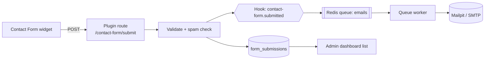
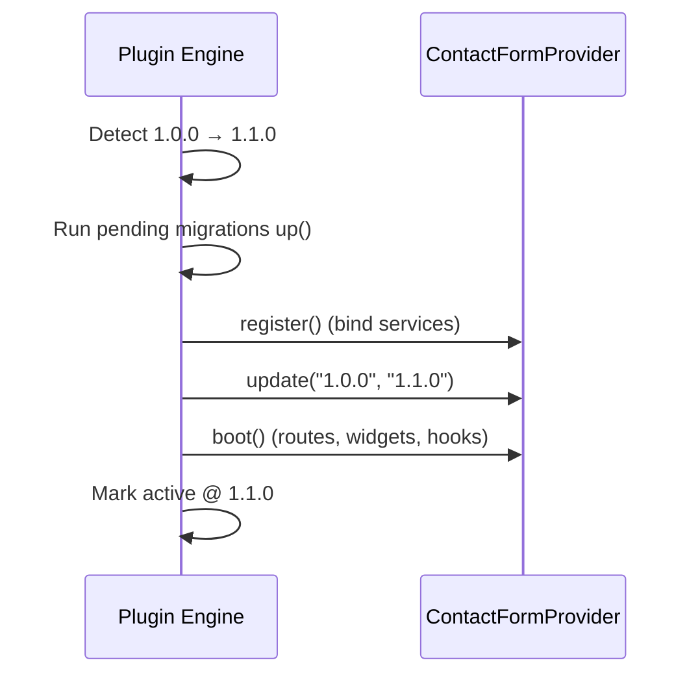

# Plugin Guide

> A complete, copy-paste-ready tutorial that builds a real **Contact Form** plugin for GOCO CMS — from `goco make:plugin` to a package published on the Marketplace — covering the manifest, a service provider, a widget, an API route, a MongoDB collection with a migration, a capability, a settings page, an admin dashboard, a queued email hook, activation, testing, dependencies, and update hooks.

**Stability:** `stable` · **Audience:** plugin authors · **Prerequisites:** a running GOCO CMS dev stack (see [Installation](../getting-started/installation.md)), the `goco` CLI on your `PATH`, and familiarity with the [Plugin SDK](../sdk/plugin-sdk.md).

This guide is a **hands-on companion** to the reference material. If you want the conceptual model of how plugins are discovered, resolved, and sandboxed, read the [Plugin Engine](../core/plugin-engine.md) first. If you want the exact facade signatures, keep the [Plugin SDK](../sdk/plugin-sdk.md) and [Hook SDK](../sdk/hook-sdk.md) open in another tab. Here, we build one plugin, end to end.

---

## What we are building

A **Contact Form** plugin (`goco/contact-form`) that a site owner can activate and drop onto any page. When we are done, the plugin will:

| Capability | Delivered by |
| --- | --- |
| A placeable **Contact Form** widget with configurable fields | [Widget SDK](../sdk/widget-sdk.md) registration in `boot()` |
| A **POST endpoint** that validates and stores submissions | A namespaced plugin route + file-based REST fallback |
| Persistent storage in a **`form_submissions`** collection | A reversible migration with a JSON-Schema validator + indexes |
| A **`forms.manage`** capability gating admin access | `Plugin::permissions()` + RBAC |
| A **settings page** (recipient, spam threshold, redirect URL) | Typed settings schema + admin template |
| An **admin dashboard** listing submissions | A capability-gated admin route + paginated repository query |
| An **email on submit**, sent off the request path | A `Hook::listen()` handler that enqueues a Redis job |



> **Note**
> Every path in this guide is relative to the plugin's own directory unless noted. The plugin lives at `plugins/contact-form/` inside your GOCO monorepo (see [Project Structure](../getting-started/project-structure.md)).

---

## Step 1 — Scaffold with `goco make:plugin`

The `goco` CLI generates a compilable skeleton so you never start from a blank page.

```bash
# From the repo root
goco make:plugin ContactForm \
  --slug=goco/contact-form \
  --namespace="Goco\\ContactForm" \
  --description="A configurable contact form widget with submission storage and email notifications." \
  --author="Your Name <you@example.com>" \
  --license=MIT \
  --with-widget --with-migration --with-settings --with-admin
```

This writes:

```text
plugins/contact-form/
├── plugin.json                       # manifest (identity, requires, provides)
├── composer.json                     # PSR-4 autoload for Goco\ContactForm\
├── src/
│   ├── ContactFormProvider.php       # the ServiceProvider (register/boot)
│   ├── Widget/ContactFormWidget.php  # widget definition + property schema
│   ├── Http/SubmitController.php     # POST handler
│   └── Repository/SubmissionRepository.php
├── api/
│   └── contact-form/submit.php       # file-based REST fallback endpoint
├── migrations/
│   └── 2026_07_18_000001_create_form_submissions.php
├── template/
│   ├── widget/contact-form.php       # front-end widget markup
│   ├── admin/settings.php            # settings page
│   └── admin/submissions.php         # dashboard list
├── assets/
│   ├── contact-form.css
│   └── contact-form.js
├── config/settings.schema.php        # typed settings schema
└── tests/
    ├── Unit/SubmissionRepositoryTest.php
    └── Feature/SubmitEndpointTest.php
```

> **Tip**
> `goco make:plugin --dry-run` prints the file tree without writing anything — handy for reviewing scaffolding before committing. See the [CLI Reference](../reference/cli-reference.md).

---

## Step 2 — The `plugin.json` manifest

The manifest is the plugin's identity card. The [Plugin Engine](../core/plugin-engine.md) reads it during **discovery** and **resolution**; it declares what the plugin *provides* and *requires* so the engine can compute a safe boot order.

```json
{
  "slug": "goco/contact-form",
  "name": "Contact Form",
  "version": "1.0.0",
  "description": "A configurable contact form widget with submission storage and email notifications.",
  "author": "Your Name <you@example.com>",
  "license": "MIT",
  "homepage": "https://github.com/your-org/goco-contact-form",
  "provider": "Goco\\ContactForm\\ContactFormProvider",
  "stability": "stable",
  "requires": {
    "goco/core": "^0.9",
    "php": ">=8.4",
    "ext-mongodb": "*",
    "plugins": {
      "goco/queue": "^0.9"
    }
  },
  "provides": {
    "widgets": ["contact-form"],
    "capabilities": ["forms.manage"],
    "collections": ["form_submissions"],
    "routes": ["/contact-form/submit"],
    "admin": [
      { "path": "/admin/contact-form", "capability": "forms.manage", "label": "Submissions" },
      { "path": "/admin/contact-form/settings", "capability": "forms.manage", "label": "Contact Form Settings" }
    ],
    "hooks": {
      "listens": ["contact-form.submitted"],
      "filters": ["contact-form.mail.payload"]
    }
  },
  "settings": "config/settings.schema.php",
  "migrations": "migrations/",
  "assets": {
    "css": ["assets/contact-form.css"],
    "js": ["assets/contact-form.js"]
  }
}
```

Key fields:

- **`provider`** — the fully qualified service-provider class the engine instantiates. Everything the plugin does is wired up here.
- **`requires`** — compatibility ranges. `plugins.goco/queue` makes the queue plugin a hard dependency; the engine refuses to activate Contact Form unless Queue is active first. See [Dependencies](#step-11--declaring-dependencies).
- **`provides`** — a declarative inventory. The engine uses it to reserve the widget type, register the capability, and pre-index the admin routes even before `boot()` runs. It is also what the [Marketplace](../marketplace/overview.md) indexes for search.

> **Warning**
> Everything in `provides` is a **contract**. If you list `contact-form` under `widgets` but never call `Widget::register('contact-form', ...)` in `boot()`, activation fails a self-check. Keep the manifest and the code in sync.

---

## Step 3 — The ServiceProvider (`register` / `boot`)

The provider is the plugin's entry point. The engine calls **`register()`** during resolution (bind services, declare settings and capabilities — do *not* touch the network or DB yet) and **`boot()`** once all dependencies are active (register routes, widgets, hooks, timers). This mirrors the two-phase lifecycle documented in the [Plugin Engine](../core/plugin-engine.md#8-services).

```php
<?php

namespace Goco\ContactForm;

use Goco\SDK\Plugin;
use Goco\SDK\Widget;
use Goco\SDK\Hook;
use Goco\Plugin\ServiceProvider;
use Goco\ContactForm\Widget\ContactFormWidget;
use Goco\ContactForm\Http\SubmitController;
use Goco\ContactForm\Http\AdminController;
use Goco\ContactForm\Repository\SubmissionRepository;
use Goco\ContactForm\Listener\SendNotificationEmail;

final class ContactFormProvider extends ServiceProvider
{
    public const SLUG = 'goco/contact-form';

    /**
     * Phase 1 — bind services, declare capabilities and settings.
     * No I/O here: this runs during dependency resolution.
     */
    public function register(): void
    {
        // Bind the repository into the container as a shared singleton.
        $this->container->singleton(
            SubmissionRepository::class,
            fn ($c) => new SubmissionRepository($c->get('db'))
        );

        // Declare the capability this plugin introduces.
        Plugin::permissions([
            'forms.manage' => 'Manage contact form settings and view submissions',
        ]);

        // Register the plugin manifest so the engine tracks lifecycle + settings.
        Plugin::register(self::SLUG, $this->manifest());
    }

    /**
     * Phase 2 — wire runtime behavior. Runs after every dependency is active.
     */
    public function boot(): void
    {
        // 3a. Register the placeable widget.
        Widget::register('contact-form', ContactFormWidget::definition());

        // 3b. Register HTTP routes, namespaced by the plugin slug.
        Plugin::routes(function ($router) {
            $router->post('/contact-form/submit', [SubmitController::class, 'handle'])
                   ->name('contact-form.submit')
                   ->rateLimit('20/minute');

            // Admin dashboard + settings — capability-gated.
            $router->get('/admin/contact-form', [AdminController::class, 'index'])
                   ->capability('forms.manage');
            $router->get('/admin/contact-form/settings', [AdminController::class, 'settings'])
                   ->capability('forms.manage');
            $router->post('/admin/contact-form/settings', [AdminController::class, 'saveSettings'])
                   ->capability('forms.manage')
                   ->csrf();
        });

        // 3c. Listen for submissions and send email off the request path.
        Hook::listen('contact-form.submitted', [SendNotificationEmail::class, 'handle'], priority: 20);
    }
}
```

> **Note**
> `Plugin::routes()` registers routes **namespaced by the plugin slug** so two plugins can never collide. Under the hood these map onto ZealPHP's `nsRoute()` / `patternRoute()` (see [Routing](../core/routing.md)). The `->rateLimit()` and `->csrf()` helpers attach ZealPHP's `RateLimit` and `Csrf` middleware to just those routes.

---

## Step 4 — Register the Contact Form widget

The widget is what a site editor drags onto a page in the [Page Builder](../core/page-builder.md). It declares a **property schema** (so the editor can render a settings panel) and a **render** callback. Signatures follow the [Widget SDK](../sdk/widget-sdk.md): `Widget::register(string $type, array|callable $definition)`.

```php
<?php

namespace Goco\ContactForm\Widget;

use Goco\SDK\Hook;
use Goco\Widget\Context;

final class ContactFormWidget
{
    public static function definition(): array
    {
        return [
            'label'    => 'Contact Form',
            'icon'     => 'mail',
            'category' => 'Forms',
            'properties' => [
                'title'      => ['type' => 'string', 'default' => 'Get in touch', 'label' => 'Heading'],
                'submitText' => ['type' => 'string', 'default' => 'Send message', 'label' => 'Button label'],
                'fields'     => [
                    'type'    => 'repeater',
                    'label'   => 'Fields',
                    'default' => [
                        ['name' => 'name',    'label' => 'Name',    'type' => 'text',     'required' => true],
                        ['name' => 'email',   'label' => 'Email',   'type' => 'email',    'required' => true],
                        ['name' => 'message', 'label' => 'Message', 'type' => 'textarea', 'required' => true],
                    ],
                ],
                'successMessage' => ['type' => 'string', 'default' => 'Thanks — we will be in touch.'],
            ],
            'render' => function (array $props, ?Context $ctx = null): string {
                // The CSRF token and the endpoint are injected so the front-end POSTs safely.
                $props['action'] = '/contact-form/submit';
                $props['csrf']   = $ctx?->csrfToken() ?? '';
                // Allow other plugins to alter the rendered fields.
                $props['fields'] = Hook::apply('contact-form.fields', $props['fields'], $ctx);

                return \Goco\SDK\Theme::view('goco/contact-form::widget/contact-form', $props);
            },
        ];
    }
}
```

The template is a plain ZealPHP view (see [Template Engine](../core/template-engine.md)):

```php
<!-- template/widget/contact-form.php -->
<form class="goco-contact-form" method="post" action="<?= htmlspecialchars($action) ?>" data-goco-form>
  <h3><?= htmlspecialchars($title) ?></h3>
  <input type="hidden" name="_csrf" value="<?= htmlspecialchars($csrf) ?>">
  <input type="text" name="company" class="goco-cf-hp" tabindex="-1" autocomplete="off" aria-hidden="true">
  <?php foreach ($fields as $f): ?>
    <label>
      <span><?= htmlspecialchars($f['label']) ?><?= !empty($f['required']) ? ' *' : '' ?></span>
      <?php if ($f['type'] === 'textarea'): ?>
        <textarea name="<?= htmlspecialchars($f['name']) ?>" <?= !empty($f['required']) ? 'required' : '' ?>></textarea>
      <?php else: ?>
        <input type="<?= htmlspecialchars($f['type']) ?>" name="<?= htmlspecialchars($f['name']) ?>"
               <?= !empty($f['required']) ? 'required' : '' ?>>
      <?php endif; ?>
    </label>
  <?php endforeach; ?>
  <button type="submit"><?= htmlspecialchars($submitText) ?></button>
  <div class="goco-cf-result" role="status" aria-live="polite"></div>
</form>
```

The hidden `company` field is a **honeypot**: real users leave it empty, bots fill it. We check it server-side in Step 6.

> **Tip**
> Preview your widget in isolation with `goco widget:preview contact-form --props='{"title":"Say hello"}'`, which calls `Widget::preview()` under the hood. See the [Widget Guide](widget-guide.md).

---

## Step 5 — The `form_submissions` collection + migration

Submissions persist in MongoDB. Following the [Data Model](../architecture/data-model.md) conventions, the collection is **tenant-scoped** (carries `workspace_id` + `website_id`), uses a **JSON-Schema validator**, and ships **documented indexes**. Migrations are **reversible** — the [Plugin Engine](../core/plugin-engine.md) runs `up()` on install and `down()` on uninstall.

```php
<?php
// migrations/2026_07_18_000001_create_form_submissions.php

use Goco\Database\Migration;
use Goco\Database\Blueprint;

return new class extends Migration {
    public function up(Blueprint $db): void
    {
        $db->createCollection('form_submissions', [
            'validator' => ['$jsonSchema' => [
                'bsonType' => 'object',
                'required' => ['_id', 'workspace_id', 'website_id', 'page_id', 'data', 'status', 'created_at'],
                'properties' => [
                    'workspace_id' => ['bsonType' => 'objectId'],
                    'website_id'   => ['bsonType' => 'objectId'],
                    'page_id'      => ['bsonType' => 'objectId'],
                    'data'         => ['bsonType' => 'object', 'description' => 'Submitted field values'],
                    'status'       => ['enum' => ['new', 'read', 'spam', 'archived']],
                    'meta'         => ['bsonType' => 'object'],   // ip, user_agent, referer
                    'created_at'   => ['bsonType' => 'date'],
                    'updated_at'   => ['bsonType' => ['date', 'null']],
                    'deleted_at'   => ['bsonType' => ['date', 'null']],
                    'version'      => ['bsonType' => 'int'],
                ],
            ]],
            'validationLevel'  => 'moderate',
            'validationAction' => 'error',
        ]);

        // Tenant + recency index for the admin list.
        $db->collection('form_submissions')->createIndex(
            ['workspace_id' => 1, 'website_id' => 1, 'created_at' => -1],
            ['name' => 'tenant_recent']
        );
        // Status filter for the dashboard tabs.
        $db->collection('form_submissions')->createIndex(
            ['website_id' => 1, 'status' => 1, 'created_at' => -1],
            ['name' => 'by_status']
        );
        // Soft-delete-aware full-text search over submitted values.
        $db->collection('form_submissions')->createIndex(
            ['data.email' => 1],
            ['name' => 'by_email', 'partialFilterExpression' => ['deleted_at' => null]]
        );
    }

    public function down(Blueprint $db): void
    {
        $db->dropCollection('form_submissions');
    }
};
```

Run migrations locally:

```bash
goco migrate --plugin=goco/contact-form          # apply up()
goco migrate:rollback --plugin=goco/contact-form # apply down()
goco migrate:status --plugin=goco/contact-form   # show applied/pending
```

The repository is a thin [Repository-pattern](../architecture/database-mongodb.md) wrapper — no heavy ORM:

```php
<?php

namespace Goco\ContactForm\Repository;

use Goco\Database\Repository;
use Goco\Database\RequestScope;
use MongoDB\BSON\ObjectId;
use MongoDB\BSON\UTCDateTime;

final class SubmissionRepository extends Repository
{
    protected string $collection = 'form_submissions';

    public function store(array $data, ObjectId $pageId, array $meta, string $status = 'new'): ObjectId
    {
        $doc = RequestScope::stamp([          // injects workspace_id, website_id, created_by, timestamps, version
            'page_id' => $pageId,
            'data'    => $data,
            'meta'    => $meta,
            'status'  => $status,
        ]);
        return $this->insert($doc);
    }

    /** Paginated, tenant-scoped, soft-delete-aware list for the admin dashboard. */
    public function paginate(int $page = 1, int $perPage = 25, ?string $status = null): array
    {
        $filter = $status ? ['status' => $status] : [];
        return $this->query()
            ->where($filter)
            ->whereNull('deleted_at')
            ->orderByDesc('created_at')
            ->paginate($page, $perPage);   // RequestScope adds workspace_id + website_id automatically
    }
}
```

---

## Step 6 — The submission endpoint

The route registered in Step 3 targets this controller. It validates, applies the honeypot + rate-limit spam checks, persists, and **dispatches a hook** — it never sends email inline.

```php
<?php

namespace Goco\ContactForm\Http;

use Goco\SDK\Hook;
use Goco\SDK\Plugin;
use Goco\ContactForm\Repository\SubmissionRepository;
use MongoDB\BSON\ObjectId;

final class SubmitController
{
    public function __construct(private SubmissionRepository $repo) {}

    public function handle($request, $response): array
    {
        $settings = Plugin::settings('goco/contact-form');
        $input    = $request->post();

        // Honeypot: a filled hidden field means a bot. Accept silently, store as spam.
        $isSpam = !empty($input['company']);

        // Minimal server-side validation (mirror the widget's required fields).
        $errors = $this->validate($input);
        if ($errors && !$isSpam) {
            return $response->status(422)->json(['ok' => false, 'errors' => $errors]);
        }

        unset($input['_csrf'], $input['company']);

        $id = $this->repo->store(
            data:   $input,
            pageId: new ObjectId($request->header('X-Goco-Page-Id') ?? $request->post('_page')),
            meta:   [
                'ip'         => $request->ip(),
                'user_agent' => $request->header('User-Agent'),
                'referer'    => $request->header('Referer'),
            ],
            status: $isSpam ? 'spam' : 'new',
        );

        // Off the request path — the email is sent by a queued worker (Step 8).
        if (!$isSpam) {
            Hook::dispatch('contact-form.submitted', (string) $id, $input, $settings);
        }

        return $response->json([
            'ok'      => true,
            'id'      => (string) $id,
            'message' => $settings['success_message'] ?? 'Thanks — we will be in touch.',
        ]);
    }

    private function validate(array $input): array
    {
        $errors = [];
        if (empty($input['email']) || !filter_var($input['email'], FILTER_VALIDATE_EMAIL)) {
            $errors['email'] = 'A valid email is required.';
        }
        if (empty(trim($input['message'] ?? ''))) {
            $errors['message'] = 'Message cannot be empty.';
        }
        return $errors;
    }
}
```

GOCO also supports **file-based REST** (drop a file, get an endpoint). The scaffold includes an equivalent fallback so the plugin works even if programmatic routing is disabled:

```php
<?php
// api/contact-form/submit.php  ->  POST /api/contact-form/submit
use Goco\SDK\Plugin;

/** @var \ZealPHP\Http\Request $request */
/** @var \ZealPHP\Http\Response $response */
return Plugin::container('goco/contact-form')
    ->get(\Goco\ContactForm\Http\SubmitController::class)
    ->handle($request, $response);
```

> **Warning**
> Always let the [Csrf middleware](../security/security-model.md) validate the `_csrf` token for browser POSTs. For API clients using JWT, exempt the route and rely on the bearer token instead — see [Authentication](../core/authentication.md).

---

## Step 7 — The `forms.manage` capability

The capability was **declared** in `register()` and **enforced** on the admin routes in `boot()` via `->capability('forms.manage')`. To make it usable, grant it to roles. Following the [Permission System](../architecture/permission-system.md), capabilities are `resource.action` strings resolved per `(workspace, website)`.

Attach it to the default roles the plugin expects (done idempotently in an install hook — see Step 12):

```php
use Goco\SDK\Plugin;

Plugin::grantCapability('forms.manage', roles: [
    'owner', 'super-admin', 'website-admin', 'marketing',
]);
```

Now `marketing` and administrators see the **Submissions** and **Contact Form Settings** menu items; an `editor` or `viewer` gets a `403` from the guarded routes. The optional ABAC `PolicyEngine` can narrow this further (e.g. "only submissions for websites this user owns"), but RBAC alone is enough for this plugin.

---

## Step 8 — The queued email hook listener

The listener registered in Step 3 receives the `contact-form.submitted` event and enqueues a job onto Redis, keeping the request fast. This uses the queue plugin we declared as a dependency. See [Caching, Queue & Realtime](../architecture/caching-and-queue.md) and the [Hook SDK](../sdk/hook-sdk.md).

```php
<?php

namespace Goco\ContactForm\Listener;

use Goco\SDK\Hook;
use Goco\Queue\Queue;

final class SendNotificationEmail
{
    /**
     * @param string $submissionId
     * @param array  $data     Submitted field values
     * @param array  $settings Plugin settings snapshot
     */
    public static function handle(string $submissionId, array $data, array $settings): void
    {
        // Let other plugins reshape the mail payload (subject line, reply-to, cc).
        $payload = Hook::apply('contact-form.mail.payload', [
            'to'      => $settings['recipient'] ?? 'webmaster@localhost',
            'subject' => sprintf('New contact from %s', $data['name'] ?? $data['email'] ?? 'a visitor'),
            'template' => 'goco/contact-form::mail/notification',
            'context'  => ['submission_id' => $submissionId, 'data' => $data],
        ], $data);

        // Push onto the "emails" queue; a worker delivers via SMTP/Mailpit.
        Queue::push('emails', 'mail.send', $payload, [
            'attempts'    => 5,
            'backoff'     => [10, 60, 300, 900, 3600],   // exponential retry (seconds)
            'dedupe_key'  => "contact-form:{$submissionId}",
        ]);
    }
}
```

In development, mail lands in **Mailpit** (`mailpit` service, UI on `http://localhost:8025`). In production, configure a real SMTP transport in [Configuration](../getting-started/configuration.md). The worker runs inside the `gococms` container via `App::onWorkerStart()` timers (see [ZealPHP Foundation](../architecture/zealphp-foundation.md)); no separate cron is required.

> **Tip**
> Because the listener only **enqueues**, a slow or unavailable SMTP server never delays the visitor's response. If you need synchronous send-and-confirm, use `Hook::dispatch` with a listener that calls `Queue::pushSync()` — but that couples response latency to mail latency, so avoid it for public forms.

---

## Step 9 — Settings page

Settings are declared as a **typed schema** so the engine can validate values, render a form, and persist them to the `settings` collection scoped to the plugin slug.

```php
<?php
// config/settings.schema.php
return [
    'recipient' => [
        'type'    => 'email',
        'label'   => 'Notification recipient',
        'default' => 'webmaster@localhost',
        'required' => true,
    ],
    'success_message' => [
        'type'    => 'string',
        'label'   => 'Success message',
        'default' => 'Thanks — we will be in touch.',
    ],
    'redirect_url' => [
        'type'    => 'url',
        'label'   => 'Redirect after submit (optional)',
        'default' => '',
    ],
    'spam_threshold' => [
        'type'    => 'int',
        'label'   => 'Rate limit (submissions per IP per hour)',
        'default' => 10,
        'min'     => 1,
        'max'     => 100,
    ],
];
```

The admin controller renders and saves them:

```php
<?php

namespace Goco\ContactForm\Http;

use Goco\SDK\Plugin;
use Goco\SDK\Theme;
use Goco\ContactForm\Repository\SubmissionRepository;

final class AdminController
{
    public function __construct(private SubmissionRepository $repo) {}

    public function index($request, $response): string
    {
        $result = $this->repo->paginate(
            page:    (int) ($request->query('page') ?? 1),
            status:  $request->query('status')   // new | read | spam | archived
        );
        return Theme::view('goco/contact-form::admin/submissions', [
            'submissions' => $result['items'],
            'pagination'  => $result['pagination'],
            'activeTab'   => $request->query('status') ?? 'new',
        ]);
    }

    public function settings($request, $response): string
    {
        return Theme::view('goco/contact-form::admin/settings', [
            'schema'   => Plugin::settingsSchema('goco/contact-form'),
            'values'   => Plugin::settings('goco/contact-form'),
            'csrf'     => $request->csrfToken(),
        ]);
    }

    public function saveSettings($request, $response)
    {
        // Validated against the schema; invalid values throw and re-render with errors.
        Plugin::saveSettings('goco/contact-form', $request->post());
        return $response->redirect('/admin/contact-form/settings?saved=1');
    }
}
```

---

## Step 10 — Admin dashboard list

The `template/admin/submissions.php` view renders the paginated list, with status tabs and per-row actions:

```php
<!-- template/admin/submissions.php -->
<div class="goco-admin">
  <h1>Contact Form Submissions</h1>
  <nav class="goco-tabs">
    <?php foreach (['new' => 'New', 'read' => 'Read', 'spam' => 'Spam', 'archived' => 'Archived'] as $key => $label): ?>
      <a href="?status=<?= $key ?>" class="<?= $activeTab === $key ? 'is-active' : '' ?>"><?= $label ?></a>
    <?php endforeach; ?>
  </nav>
  <table class="goco-table">
    <thead><tr><th>Received</th><th>Name</th><th>Email</th><th>Message</th><th></th></tr></thead>
    <tbody>
      <?php foreach ($submissions as $s): ?>
        <tr>
          <td><?= $s['created_at']->toDateTime()->format('Y-m-d H:i') ?></td>
          <td><?= htmlspecialchars($s['data']['name'] ?? '—') ?></td>
          <td><?= htmlspecialchars($s['data']['email'] ?? '—') ?></td>
          <td class="goco-truncate"><?= htmlspecialchars($s['data']['message'] ?? '') ?></td>
          <td><a href="/admin/contact-form/<?= (string) $s['_id'] ?>">View</a></td>
        </tr>
      <?php endforeach; ?>
    </tbody>
  </table>
  <?= Theme::partial('admin/pagination', ['pagination' => $pagination]) ?>
</div>
```

Because the route is registered with `->capability('forms.manage')`, the admin app ([apps/admin](../getting-started/project-structure.md)) automatically surfaces the two menu entries declared under `provides.admin` in the manifest — no separate menu registration needed.

---

## Step 11 — Declaring dependencies

Our plugin needs the queue plugin. Dependencies are declared in `plugin.json` (`requires.plugins`) **and** in `composer.json` for autoloading:

```json
{
  "name": "goco/contact-form",
  "type": "goco-plugin",
  "require": {
    "php": ">=8.4",
    "ext-mongodb": "*",
    "gococms/queue": "^0.9"
  },
  "autoload": {
    "psr-4": { "Goco\\ContactForm\\": "src/" }
  }
}
```

The [Plugin Engine](../core/plugin-engine.md) builds a dependency graph across all `requires.plugins` entries, validates version ranges, and produces a **topologically sorted boot order**. If `goco/queue` is inactive or too old, activation fails with a precise message instead of a runtime error:

```text
$ goco plugin:activate goco/contact-form
✗ Cannot activate goco/contact-form 1.0.0
  requires goco/queue ^0.9 — found 0.8.2 (inactive).
  Fix: goco plugin:activate goco/queue
```

> **Note**
> Never call another plugin's classes directly during `register()` — its provider may not have booted yet. Use hooks (`Hook::listen` / `Hook::apply`) or facades (`Queue::push`) which are safe once your `boot()` runs, because the engine guarantees dependencies boot first.

---

## Step 12 — Install & update hooks

Plugins expose lifecycle hooks the engine invokes at the right moment. Implement them on the provider (or as methods declared in the manifest). `install()` runs **once** on first activation; `update()` runs when a newer version is detected.

```php
public function install(): void
{
    // Runs once. Migrations already ran; seed defaults + grant capabilities here.
    Plugin::grantCapability('forms.manage', roles: ['owner', 'super-admin', 'website-admin', 'marketing']);
    Plugin::saveSettings(self::SLUG, [
        'recipient'       => 'webmaster@localhost',
        'success_message' => 'Thanks — we will be in touch.',
        'spam_threshold'  => 10,
    ]);
}

public function update(string $from, string $to): void
{
    // Version-aware, idempotent forward migration of plugin-owned state.
    if (version_compare($from, '1.1.0', '<') && version_compare($to, '1.1.0', '>=')) {
        // 1.1.0 added a "status" tab for archived items — backfill nulls.
        $this->container->get('db')
            ->collection('form_submissions')
            ->updateMany(['status' => ['$exists' => false]], ['$set' => ['status' => 'new']]);
    }
    // The engine has already run any new collection migrations before calling update().
}

public function uninstall(): void
{
    // Optional. The engine auto-runs migration down() and removes routes/hooks/capabilities.
    // Only add manual cleanup for state the migrations do not cover.
    Plugin::revokeCapability('forms.manage');
}
```

The ordering the engine guarantees on an upgrade:



Bump the version in `plugin.json` following [Semantic Versioning](../reference/configuration-reference.md); the engine compares the manifest version against the recorded installed version to decide whether to call `update()`.

---

## Step 13 — Activate & test

Activate locally:

```bash
goco plugin:list                          # discover + show status
goco plugin:install goco/contact-form     # runs migrations + install()
goco plugin:activate goco/contact-form    # boots the provider
goco plugin:status goco/contact-form      # verify: active, routes/hooks registered
```

Smoke-test the endpoint:

```bash
# Grab a CSRF token by loading a page with the widget, then POST:
curl -sS -X POST http://localhost:8080/contact-form/submit \
  -H "Content-Type: application/x-www-form-urlencoded" \
  -H "X-Goco-Page-Id: 6699a1b2c3d4e5f601020304" \
  --data-urlencode "_csrf=$TOKEN" \
  --data-urlencode "name=Ada Lovelace" \
  --data-urlencode "email=ada@example.com" \
  --data-urlencode "message=Hello GOCO"
# => {"ok":true,"id":"...","message":"Thanks — we will be in touch."}
```

Check the email landed in **Mailpit** (`http://localhost:8025`) and the row appears at `/admin/contact-form`.

Write automated tests (see [Testing Strategy](../community/testing-strategy.md)). The scaffold seeds two:

```php
<?php
// tests/Feature/SubmitEndpointTest.php
use Goco\Testing\PluginTestCase;

final class SubmitEndpointTest extends PluginTestCase
{
    protected string $plugin = 'goco/contact-form';

    public function test_valid_submission_is_stored_and_dispatches_hook(): void
    {
        $this->fakeQueue();                       // capture pushes instead of enqueuing
        $this->activatePlugin();

        $res = $this->postJson('/contact-form/submit', [
            'name' => 'Grace', 'email' => 'grace@example.com', 'message' => 'Hi',
        ], csrf: true);

        $res->assertStatus(200)->assertJson(['ok' => true]);
        $this->assertCollectionCount('form_submissions', 1);
        $this->assertQueuePushed('emails', 'mail.send');
        $this->assertHookDispatched('contact-form.submitted');
    }

    public function test_honeypot_marks_submission_as_spam_and_sends_no_mail(): void
    {
        $this->fakeQueue();
        $this->activatePlugin();

        $res = $this->postJson('/contact-form/submit', [
            'email' => 'bot@spam.test', 'message' => 'buy now', 'company' => 'BotCorp',
        ], csrf: true);

        $res->assertStatus(200);
        $this->assertCollectionCount('form_submissions', 1);   // stored...
        $this->assertQueueEmpty('emails');                     // ...but no email
    }
}
```

```bash
goco test --plugin=goco/contact-form
# or: vendor/bin/phpunit plugins/contact-form/tests
```

---

## Step 14 — Package & publish to the Marketplace

Validate, version, package, and publish. The [Marketplace](../marketplace/overview.md) verifies the manifest, runs static checks, and (for verified authors) scans for capability abuse.

```bash
# 1. Lint the manifest, settings schema, and migrations.
goco plugin:validate goco/contact-form

# 2. Tag a release (Conventional Commits drive the changelog).
git tag v1.0.0 && git push --tags

# 3. Build a distributable archive (respects .gocoignore; excludes tests, .git, dev deps).
goco plugin:package goco/contact-form --out=dist/
# => dist/goco-contact-form-1.0.0.zip  (+ SHA-256 checksum + signed manifest)

# 4. Authenticate and publish.
goco login
goco plugin:publish dist/goco-contact-form-1.0.0.zip \
  --visibility=public \
  --categories=forms,marketing
```

What the Marketplace does on submit:

| Check | Result |
| --- | --- |
| Manifest schema + `provides`/code parity | Rejected if the widget/route/capability are not actually registered |
| Declared capabilities vs. usage | Flags a plugin that requests `users.manage` but never uses it |
| Version + changelog present | Requires SemVer tag and a `CHANGELOG.md` |
| Checksum + signature | Archive is signed; installs verify integrity |
| License = OSI-approved | MIT here — accepted |

After approval, any site owner installs it in one step:

```bash
goco plugin:install goco/contact-form@1.0.0 --from=marketplace
```

Publishing an update is the same flow with a bumped version; the engine calls your `update()` hook (Step 12) on every site that upgrades.

> **Tip**
> Ship a `README.md`, at least one screenshot, and a `mail/notification` email template in your package. Listings with real screenshots and a clear capability rationale get verified faster. See [Marketplace → Overview](../marketplace/overview.md) for the full submission checklist.

---

## Recap

You built a production-grade plugin that touches every extension point GOCO exposes: a **widget**, a **route + file REST endpoint**, a **MongoDB collection with a reversible migration**, a **capability**, a **settings page**, an **admin dashboard**, and a **queued email hook** — then packaged and published it. The same skeleton scales from a contact form to a full booking system or e-commerce add-on; only the collections, routes, and hooks change.

Next, deepen any piece: the [Widget SDK](../sdk/widget-sdk.md) for advanced property schemas, the [Hook SDK](../sdk/hook-sdk.md) for async and filtered events, or the [Plugin Engine](../core/plugin-engine.md) for the lifecycle internals behind every command you ran.

---

## Related

- [Plugin SDK](../sdk/plugin-sdk.md) — the exact `Plugin::*` facade contract used throughout this guide
- [Plugin Engine](../core/plugin-engine.md) — discovery, resolution, lifecycle, and sandboxing internals
- [Hook SDK](../sdk/hook-sdk.md) — `Hook::listen` / `dispatch` / `filter` / `apply` and async dispatch
- [Widget SDK](../sdk/widget-sdk.md) — property schemas, rendering, and preview
- [Widget Guide](widget-guide.md) — build a standalone widget
- [Theme Guide](theme-guide.md) — build a theme that hosts widgets
- [CLI Reference](../reference/cli-reference.md) — every `goco` command used here
- [Data Model](../architecture/data-model.md) — collection conventions, timestamps, and indexes
- [MongoDB Data Layer](../architecture/database-mongodb.md) — the repository pattern and document mapper
- [Permission System](../architecture/permission-system.md) — RBAC capabilities and ABAC policies
- [Caching, Queue & Realtime](../architecture/caching-and-queue.md) — the Redis queue behind the email hook
- [Security Model](../security/security-model.md) — CSRF, sanitization, and plugin isolation
- [Marketplace Overview](../marketplace/overview.md) — packaging, submission, and verification
- [Testing Strategy](../community/testing-strategy.md) — how to test plugins
- [Documentation Index](../README.md)
