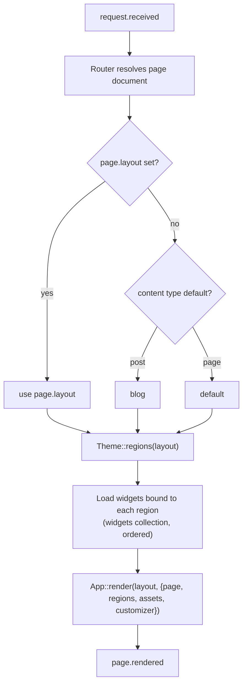
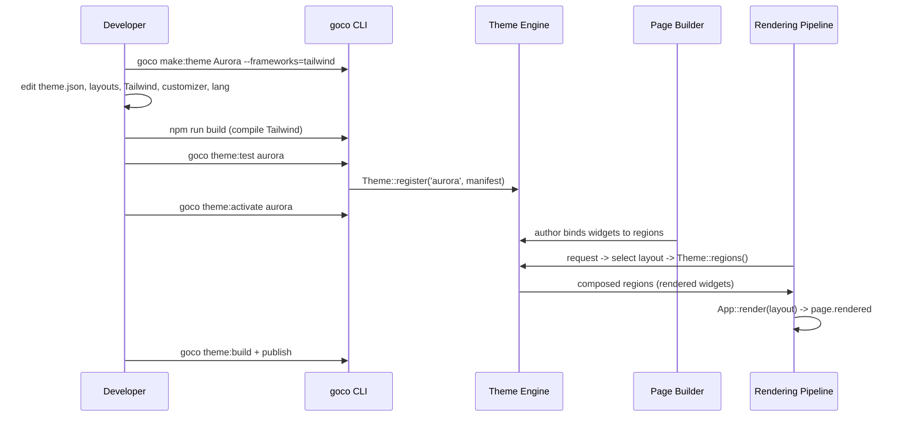

# Theme Guide

> Build, customize, and ship a production Tailwind CSS theme for GOCO CMS — from `goco make:theme Aurora` to a packaged, translatable, child-theme-ready bundle.

This guide is an end-to-end tutorial. You will scaffold a theme named **Aurora**, wire up a compiled Tailwind CSS/JS pipeline, define three layouts (`default`, `blog`, `landing`) with named regions, expose customizer settings (colors, fonts, container width), support a child theme, add translations, then test and package. Along the way you will see exactly how a page selects a layout and how regions are filled with widgets.

The theme APIs used here are the stable `Goco\SDK\Theme` facade documented in the [Theme SDK](../sdk/theme-sdk.md); the runtime that consumes your theme is the [Theme Engine](../core/theme-engine.md).

Stability: `stable`

---

## 1. Prerequisites

You need a working GOCO CMS development environment (see [Installation](../getting-started/installation.md)) and Node.js 20+ for the Tailwind build. The `goco` CLI is on your `PATH` after `composer require gococms/cli` or inside the Docker `gococms` container.

```bash
# Verify tooling
goco --version          # GOCO developer CLI
php -v                  # PHP 8.4+
node -v                 # Node 20+ for Tailwind
```

> **Note** All runtime code in this guide executes on **ZealPHP / OpenSwoole** in coroutine mode. Theme templates are plain PHP views rendered through `App::render()` — there is no Blade/Twig compiler in the core. See [ZealPHP Foundation](../architecture/zealphp-foundation.md).

---

## 2. Scaffold the theme

Generate the theme skeleton with the CLI generator. Themes live under the monorepo `themes/` directory (or a project's `themes/` when built for a single site).

```bash
goco make:theme Aurora \
  --frameworks=tailwind \
  --author="Aurora Labs" \
  --license=MIT
```

This produces:

```text
themes/aurora/
├── theme.json                 # manifest (metadata, frameworks, layouts, regions, settings)
├── screenshot.png             # 1200x900 marketplace/customizer preview
├── layouts/
│   ├── default.php            # standard page layout
│   ├── blog.php               # blog list/single layout
│   └── landing.php            # marketing landing layout
├── partials/
│   ├── head.php               # <head>, meta, asset tags
│   ├── header.php             # site header + primary nav region
│   └── footer.php             # footer region + scripts
├── assets/
│   ├── css/app.css            # Tailwind source (@tailwind directives)
│   ├── js/app.js              # theme JS entry
│   └── dist/                  # compiled output (gitignored during dev)
├── customizer/
│   └── settings.php           # customizer schema builder (optional, see §7)
├── lang/
│   ├── en.json                # base translations
│   └── ta.json                # example locale
├── tailwind.config.js
├── postcss.config.js
├── package.json
└── README.md
```

> **Tip** Run `goco make:theme Aurora --child-of=base` to scaffold a child theme instead of a standalone one. Child themes are covered in §9.

---

## 3. The theme manifest (`theme.json`)

The manifest is the single source of truth the [Theme Engine](../core/theme-engine.md) reads at registration time. It declares metadata, the CSS/JS frameworks in use, the layouts and their regions, and the customizer settings schema.

```json
{
  "$schema": "https://gococms.org/schema/theme.json",
  "slug": "aurora",
  "name": "Aurora",
  "version": "1.0.0",
  "description": "A clean, content-first Tailwind theme with a blog and a marketing landing layout.",
  "author": "Aurora Labs",
  "homepage": "https://aurora-labs.example",
  "license": "MIT",
  "stability": "stable",
  "engines": { "goco": ">=0.9 <2.0", "php": ">=8.4" },
  "frameworks": ["tailwind"],
  "supports": ["dark-mode", "customizer", "rtl", "translations", "child-themes"],

  "layouts": {
    "default": {
      "label": "Default Page",
      "file": "layouts/default.php",
      "regions": ["header", "sidebar", "content", "footer"]
    },
    "blog": {
      "label": "Blog",
      "file": "layouts/blog.php",
      "regions": ["header", "content", "blog-sidebar", "footer"]
    },
    "landing": {
      "label": "Landing Page",
      "file": "layouts/landing.php",
      "regions": ["hero", "content", "cta", "footer"]
    }
  },

  "regions": {
    "header":       { "label": "Header",        "max_widgets": 4 },
    "sidebar":      { "label": "Sidebar",       "max_widgets": 12 },
    "blog-sidebar": { "label": "Blog Sidebar",  "max_widgets": 12 },
    "content":      { "label": "Main Content",  "locked": true },
    "hero":         { "label": "Hero",          "max_widgets": 3 },
    "cta":          { "label": "Call To Action","max_widgets": 2 },
    "footer":       { "label": "Footer",        "max_widgets": 8 }
  },

  "assets": {
    "styles":  [{ "handle": "aurora", "src": "assets/dist/app.css", "media": "all" }],
    "scripts": [{ "handle": "aurora", "src": "assets/dist/app.js", "defer": true }],
    "preload": [{ "as": "font", "src": "assets/dist/fonts/inter-var.woff2", "crossorigin": true }]
  },

  "settings": {
    "groups": [
      {
        "id": "colors",
        "label": "Colors",
        "fields": [
          { "id": "primary",   "type": "color", "label": "Primary",   "default": "#6366f1" },
          { "id": "accent",    "type": "color", "label": "Accent",    "default": "#f59e0b" },
          { "id": "surface",   "type": "color", "label": "Surface",   "default": "#ffffff" },
          { "id": "ink",       "type": "color", "label": "Text",      "default": "#0f172a" }
        ]
      },
      {
        "id": "typography",
        "label": "Typography",
        "fields": [
          { "id": "font_body",    "type": "font",   "label": "Body Font",    "default": "Inter",     "options": ["Inter", "Roboto", "Merriweather", "System"] },
          { "id": "font_heading", "type": "font",   "label": "Heading Font", "default": "Inter",     "options": ["Inter", "Poppins", "Playfair Display", "System"] },
          { "id": "base_size",    "type": "range",  "label": "Base Size (px)", "default": 16, "min": 14, "max": 20, "step": 1 }
        ]
      },
      {
        "id": "layout",
        "label": "Layout",
        "fields": [
          { "id": "container_width", "type": "select", "label": "Container Width",
            "default": "xl", "options": ["md:768px", "lg:1024px", "xl:1280px", "2xl:1536px", "full:100%"] },
          { "id": "dark_mode", "type": "toggle", "label": "Enable Dark Mode", "default": true }
        ]
      }
    ]
  }
}
```

Field notes:

| Field | Meaning |
| --- | --- |
| `frameworks` | Consumed by the build tooling and the engine's asset resolver; `tailwind` marks this as a Tailwind theme. |
| `layouts.*.regions` | Ordered list of region ids a layout exposes. A region **must** also appear under `regions`. |
| `regions.*.locked` | `content` is locked so editors cannot delete the primary content outlet. |
| `regions.*.max_widgets` | Enforced by the [Page Builder](../core/page-builder.md) when authors drop widgets. |
| `settings` | Rendered by the customizer UI and surfaced to templates as CSS variables (see §7). |

---

## 4. Register the theme

Registration hands the manifest to the engine. In a standalone theme package, GOCO auto-discovers `theme.json`; you can also register explicitly (for example inside a plugin that ships a theme) using the [Theme SDK](../sdk/theme-sdk.md) facade.

```php
<?php
// themes/aurora/register.php
use Goco\SDK\Theme;

Theme::register('aurora', json_decode(
    file_get_contents(__DIR__ . '/theme.json'),
    true,
    flags: JSON_THROW_ON_ERROR
));
```

The facade signature (from the SDK) is:

```php
Theme::register(string $slug, array $manifest): void;
Theme::layouts(string $slug): array;        // ['default'=>[...], 'blog'=>[...], ...]
Theme::regions(string $layout): array;      // ['header','sidebar','content','footer']
Theme::assets(string $slug): AssetBundle;   // resolved, hashed asset URLs
```

At boot the engine validates the manifest against the JSON Schema, indexes layouts and regions, and registers the asset bundle. Activation persists the choice to the `themes` collection and sets the active theme on the current `website` document.

```bash
goco theme:list                 # discovered themes
goco theme:activate aurora      # set active theme for the current website
goco theme:info aurora          # manifest summary + validation status
```

---

## 5. Build the Tailwind pipeline

### 5.1 Tailwind source and config

```css
/* themes/aurora/assets/css/app.css */
@tailwind base;
@tailwind components;
@tailwind utilities;

@layer base {
  :root {
    --aurora-primary: #6366f1;
    --aurora-accent:  #f59e0b;
    --aurora-surface: #ffffff;
    --aurora-ink:     #0f172a;
    --aurora-font-body:    "Inter", system-ui, sans-serif;
    --aurora-font-heading: "Inter", system-ui, sans-serif;
    --aurora-base-size: 16px;
  }
  html { font-size: var(--aurora-base-size); }
  body { font-family: var(--aurora-font-body); color: var(--aurora-ink); background: var(--aurora-surface); }
  h1,h2,h3,h4 { font-family: var(--aurora-font-heading); }
}

@layer components {
  .btn-primary { @apply inline-flex items-center rounded-lg px-4 py-2 font-medium text-white; background: var(--aurora-primary); }
  .prose-aurora { @apply prose max-w-none dark:prose-invert; }
}
```

```javascript
// themes/aurora/tailwind.config.js
/** @type {import('tailwindcss').Config} */
module.exports = {
  darkMode: ['class', '[data-theme="dark"]'],
  content: [
    './layouts/**/*.php',
    './partials/**/*.php',
    './customizer/**/*.php',
    // Scan any widget templates the theme overrides:
    './widgets/**/*.php',
  ],
  theme: {
    extend: {
      colors: {
        primary: 'var(--aurora-primary)',
        accent:  'var(--aurora-accent)',
        surface: 'var(--aurora-surface)',
        ink:     'var(--aurora-ink)',
      },
      fontFamily: {
        body:    'var(--aurora-font-body)',
        heading: 'var(--aurora-font-heading)',
      },
      maxWidth: {
        container: 'var(--aurora-container, 1280px)',
      },
    },
  },
  plugins: [require('@tailwindcss/typography'), require('@tailwindcss/forms')],
};
```

Binding Tailwind tokens to CSS variables (rather than hard-coded hex) is the key move: the customizer only needs to rewrite variables at runtime, and the compiled CSS never has to change.

### 5.2 Theme JS entry

```javascript
// themes/aurora/assets/js/app.js
document.addEventListener('DOMContentLoaded', () => {
  // Respect the customizer dark-mode toggle + OS preference.
  const stored = localStorage.getItem('aurora-theme');
  const prefersDark = window.matchMedia('(prefers-color-scheme: dark)').matches;
  document.documentElement.dataset.theme = stored ?? (prefersDark ? 'dark' : 'light');

  document.querySelectorAll('[data-toggle-theme]').forEach((el) =>
    el.addEventListener('click', () => {
      const next = document.documentElement.dataset.theme === 'dark' ? 'light' : 'dark';
      document.documentElement.dataset.theme = next;
      localStorage.setItem('aurora-theme', next);
    }),
  );
});
```

### 5.3 Build scripts

```json
{
  "name": "@aurora/theme",
  "private": true,
  "scripts": {
    "dev": "npx tailwindcss -i assets/css/app.css -o assets/dist/app.css --watch",
    "build": "npx tailwindcss -i assets/css/app.css -o assets/dist/app.css --minify && npm run js",
    "js": "esbuild assets/js/app.js --bundle --minify --outfile=assets/dist/app.js"
  },
  "devDependencies": {
    "tailwindcss": "^3.4",
    "@tailwindcss/typography": "^0.5",
    "@tailwindcss/forms": "^0.5",
    "esbuild": "^0.23",
    "postcss": "^8.4",
    "autoprefixer": "^10.4"
  }
}
```

```bash
cd themes/aurora
npm install
npm run build          # produces assets/dist/app.css and app.js (referenced by theme.json)
```

> **Warning** Only the compiled output in `assets/dist/` is referenced by `theme.json` and served in production. Never point a manifest asset at the raw `assets/css/app.css` source — it still contains unprocessed `@tailwind` directives.

---

## 6. Register assets via `AssetBundle`

The manifest declares assets, but you often want fingerprinted (cache-busted) URLs, conditional loading, or preloads. The engine resolves the manifest `assets` block into an `AssetBundle`; you can also enqueue programmatically from a boot hook.

```php
<?php
// themes/aurora/boot.php
use Goco\SDK\Theme;
use Goco\SDK\Hook;

Hook::listen('theme.assets.resolving', function (array $ctx) {
    if ($ctx['theme'] !== 'aurora') {
        return;
    }

    $bundle = Theme::assets('aurora');            // AssetBundle for the active theme

    // Fingerprinted, immutable-cacheable stylesheet + deferred script.
    $bundle->style('aurora', 'assets/dist/app.css', ['media' => 'all', 'fingerprint' => true]);
    $bundle->script('aurora', 'assets/dist/app.js', ['defer' => true, 'fingerprint' => true]);

    // Preload the variable font to avoid FOUT.
    $bundle->preload('assets/dist/fonts/inter-var.woff2', as: 'font', crossorigin: true);
}, priority: 10);
```

`AssetBundle` emits the tags your `head.php`/`footer.php` partials print. The `fingerprint` option hashes file contents into the URL and sets long-lived immutable cache headers served through [Traefik](../deployment/traefik.md) and the [Storage layer](../architecture/storage.md).

```php
<?php // themes/aurora/partials/head.php ?>
<head>
  <meta charset="utf-8">
  <meta name="viewport" content="width=device-width, initial-scale=1">
  <title><?= htmlspecialchars(Hook::apply('page.title', $page['title'] ?? 'Aurora')) ?></title>
  <?= $assets->styles() /* prints <link rel="preload"> + <link rel="stylesheet"> */ ?>
  <?= $customizer->cssVariables() /* inline :root { --aurora-* } from settings, see §7 */ ?>
</head>
```

---

## 7. Expose customizer settings (colors, fonts, container width)

The `settings` block in `theme.json` (§3) is enough for a working customizer. For richer control (grouping, live preview, validation) add `customizer/settings.php`, which uses the same schema builder the engine consumes.

```php
<?php
// themes/aurora/customizer/settings.php
use Goco\SDK\Theme;

return Theme::customizer('aurora', function ($c) {
    $c->group('colors', 'Colors', function ($g) {
        $g->color('primary', 'Primary', default: '#6366f1')->cssVar('--aurora-primary');
        $g->color('accent',  'Accent',  default: '#f59e0b')->cssVar('--aurora-accent');
        $g->color('surface', 'Surface', default: '#ffffff')->cssVar('--aurora-surface');
        $g->color('ink',     'Text',    default: '#0f172a')->cssVar('--aurora-ink');
    });

    $c->group('typography', 'Typography', function ($g) {
        $g->font('font_body', 'Body Font', default: 'Inter',
            options: ['Inter', 'Roboto', 'Merriweather', 'System'])->cssVar('--aurora-font-body');
        $g->font('font_heading', 'Heading Font', default: 'Inter',
            options: ['Inter', 'Poppins', 'Playfair Display', 'System'])->cssVar('--aurora-font-heading');
        $g->range('base_size', 'Base Size (px)', default: 16, min: 14, max: 20)
            ->cssVar('--aurora-base-size', unit: 'px');
    });

    $c->group('layout', 'Layout', function ($g) {
        $g->select('container_width', 'Container Width', default: 'xl', options: [
            'md'   => '768px',  'lg' => '1024px', 'xl' => '1280px',
            '2xl'  => '1536px', 'full' => '100%',
        ])->cssVar('--aurora-container', map: fn ($v) => [
            'md' => '768px', 'lg' => '1024px', 'xl' => '1280px', '2xl' => '1536px', 'full' => '100%',
        ][$v]);
        $g->toggle('dark_mode', 'Enable Dark Mode', default: true);
    });
});
```

Because each field declares `->cssVar()`, the customizer serializes saved values straight into an inline `:root { … }` block. `$customizer->cssVariables()` (called in `head.php`) renders it:

```php
// Given saved settings, cssVariables() emits:
<style id="aurora-vars">
  :root{
    --aurora-primary:#4f46e5;
    --aurora-accent:#f59e0b;
    --aurora-surface:#ffffff;
    --aurora-ink:#0f172a;
    --aurora-font-body:"Inter",system-ui,sans-serif;
    --aurora-font-heading:"Poppins",system-ui,sans-serif;
    --aurora-base-size:17px;
    --aurora-container:1280px;
  }
</style>
```

Customizer values are stored per website in the `settings` collection (scoped by `workspace_id` + `website_id`, see [Data Model](../architecture/data-model.md)) and cached in Redis for zero-query reads on hot paths ([Caching, Queue & Realtime](../architecture/caching-and-queue.md)).

> **Tip** Keep every visual token behind a CSS variable. This lets the customizer change colors, fonts, and width **without recompiling Tailwind** — the compiled bundle references the variables, and only the tiny `:root` block changes per site.

---

## 8. Build the layouts and fill regions with widgets

### 8.1 How a page selects a layout

When a request hits a page, the [Rendering Pipeline](../architecture/rendering-pipeline.md) resolves the layout in this order:



The page document (in the `pages` collection) stores its chosen layout and, per region, the ordered list of widget instances:

```javascript
// pages document (abridged) — Mongo shell view
{
  _id: ObjectId("..."),
  workspace_id: "ws_01",
  website_id: "site_01",
  slug: "/",
  title: "Home",
  layout: "landing",                 // <- selects layouts/landing.php
  regions: {
    hero:    [ { widget: "hero-banner", instance: "w_hero1" } ],
    content: [ { widget: "feature-grid", instance: "w_feat1" },
               { widget: "rich-text",    instance: "w_copy1" } ],
    cta:     [ { widget: "email-signup", instance: "w_cta1" } ],
    footer:  [ { widget: "nav-menu",     instance: "w_footer1" } ]
  },
  version: 3,
  created_at: ISODate("..."), updated_at: ISODate("...")
}
```

### 8.2 The `default` layout

Layouts are plain PHP views rendered by `App::render()`. The engine injects `$regions`, a map of region-id → pre-rendered widget HTML, so a template just prints each region.

```php
<?php
// themes/aurora/layouts/default.php
/** @var array $page, array $regions, \Goco\Theme\AssetBundle $assets, \Goco\Theme\Customizer $customizer */
use ZealPHP\App;
?>
<!doctype html>
<html lang="<?= $page['locale'] ?? 'en' ?>" data-theme="<?= $customizer->get('dark_mode') ? 'auto' : 'light' ?>">
<?php App::include('partials/head.php', compact('page', 'assets', 'customizer')); ?>
<body class="min-h-screen bg-surface text-ink antialiased">

  <?php App::include('partials/header.php', ['region' => $regions['header'] ?? '']); ?>

  <div class="mx-auto grid max-w-container gap-8 px-4 py-10 lg:grid-cols-[1fr_20rem]">
    <main class="prose-aurora"><?= $regions['content'] ?? '' ?></main>
    <aside class="space-y-6"><?= $regions['sidebar'] ?? '' ?></aside>
  </div>

  <?php App::include('partials/footer.php', ['region' => $regions['footer'] ?? '']); ?>
  <?= $assets->scripts() ?>
</body>
</html>
```

### 8.3 The `blog` layout

```php
<?php
// themes/aurora/layouts/blog.php
/** @var array $page, array $regions, array $posts */
use ZealPHP\App;
?>
<!doctype html>
<html lang="<?= $page['locale'] ?? 'en' ?>">
<?php App::include('partials/head.php', get_defined_vars()); ?>
<body class="min-h-screen bg-surface text-ink">
  <?php App::include('partials/header.php', ['region' => $regions['header'] ?? '']); ?>

  <div class="mx-auto grid max-w-container gap-10 px-4 py-12 lg:grid-cols-[1fr_18rem]">
    <section class="space-y-10">
      <?= $regions['content'] ?? '' /* blog list / single widget */ ?>
    </section>
    <aside class="space-y-8"><?= $regions['blog-sidebar'] ?? '' ?></aside>
  </div>

  <?php App::include('partials/footer.php', ['region' => $regions['footer'] ?? '']); ?>
  <?= $assets->scripts() ?>
</body>
</html>
```

### 8.4 The `landing` layout

```php
<?php
// themes/aurora/layouts/landing.php
/** @var array $regions */
use ZealPHP\App;
?>
<!doctype html>
<html lang="<?= $page['locale'] ?? 'en' ?>">
<?php App::include('partials/head.php', get_defined_vars()); ?>
<body class="bg-surface text-ink">
  <header class="relative isolate overflow-hidden">
    <?= $regions['hero'] ?? '' /* hero-banner widget */ ?>
  </header>

  <main class="mx-auto max-w-container px-4 py-16 space-y-24">
    <?= $regions['content'] ?? '' ?>
  </main>

  <section class="bg-primary/5 py-20">
    <div class="mx-auto max-w-container px-4 text-center">
      <?= $regions['cta'] ?? '' /* email-signup widget */ ?>
    </div>
  </section>

  <?php App::include('partials/footer.php', ['region' => $regions['footer'] ?? '']); ?>
  <?= $assets->scripts() ?>
</body>
</html>
```

### 8.5 What a region actually contains

Each region string is the concatenated output of `Widget::render()` for every widget bound to it, in order. The engine does this for you, but conceptually:

```php
// Simplified region composition (engine-internal, shown for understanding).
use Goco\SDK\Widget;

$regions['hero'] = '';
foreach ($page['regions']['hero'] as $bound) {
    $props = $instances[$bound['instance']]['props'] ?? [];
    $regions['hero'] .= Widget::render($bound['widget'], $props, $ctx);
}
```

See the [Widget Guide](widget-guide.md) and [Widget SDK](../sdk/widget-sdk.md) for building the widgets that fill these regions. The `content` region for a blog is filled automatically by the [Blog Engine](../core/blog-engine.md)'s list/single widgets.

---

## 9. Support a child theme

Child themes inherit everything from a parent and override selectively — perfect for client customizations you want to keep upgrade-safe. Declare the parent in the child's manifest.

```json
{
  "slug": "aurora-acme",
  "name": "Aurora — Acme",
  "version": "1.0.0",
  "parent": "aurora",
  "frameworks": ["tailwind"],
  "settings": {
    "groups": [
      { "id": "colors", "label": "Colors", "fields": [
        { "id": "primary", "type": "color", "label": "Primary", "default": "#0ea5e9" }
      ]}
    ]
  }
}
```

Resolution rules the engine applies (parent → child cascade):

| Concern | Behavior |
| --- | --- |
| Layouts / partials | Child file at the same relative path **overrides** the parent's; missing files fall through to the parent. |
| `theme.json` | Deep-merged; child keys win. Child may add new layouts/regions or override defaults. |
| Assets | Child assets load **after** parent assets (so child CSS can override without `!important`). |
| Customizer settings | Merged by field id; child defaults override parent defaults. |
| Translations | Merged by key; child strings win (§10). |

```php
<?php
// themes/aurora-acme/register.php
use Goco\SDK\Theme;

// Parent must be registered/available; the engine loads it automatically.
Theme::register('aurora-acme', json_decode(
    file_get_contents(__DIR__ . '/theme.json'), true, flags: JSON_THROW_ON_ERROR
));
```

A child theme that only tweaks Tailwind adds a thin `assets/css/app.css` that imports parent components and layers its own utilities, then compiles its own `dist/app.css`. Template lookup uses `Theme::locate($theme, 'layouts/landing.php')`, which walks the child → parent chain.

```bash
goco make:theme AuroraAcme --child-of=aurora
goco theme:activate aurora-acme
```

---

## 10. Add translations

Themes ship UI strings (button labels, ARIA text, region titles) as JSON message catalogs under `lang/`. Templates translate with the `__()` helper, which reads the active locale from the request context.

```json
// themes/aurora/lang/en.json
{
  "theme.aurora.read_more": "Read more",
  "theme.aurora.skip_to_content": "Skip to content",
  "theme.aurora.toggle_theme": "Toggle dark mode",
  "theme.aurora.newsletter.title": "Stay in the loop",
  "theme.aurora.newsletter.cta": "Subscribe"
}
```

```json
// themes/aurora/lang/ta.json
{
  "theme.aurora.read_more": "மேலும் படிக்க",
  "theme.aurora.skip_to_content": "உள்ளடக்கத்திற்கு செல்க",
  "theme.aurora.toggle_theme": "இருள் பயன்முறையை மாற்று",
  "theme.aurora.newsletter.title": "தொடர்பில் இருங்கள்",
  "theme.aurora.newsletter.cta": "பதிவு செய்க"
}
```

Use the keys in templates:

```php
<a href="#main" class="sr-only focus:not-sr-only"><?= __('theme.aurora.skip_to_content') ?></a>
<button data-toggle-theme aria-label="<?= __('theme.aurora.toggle_theme') ?>">🌓</button>
<a class="btn-primary" href="<?= $post['url'] ?>"><?= __('theme.aurora.read_more') ?></a>
```

Register the catalogs so the engine discovers them (auto-loaded from `lang/*.json`, or explicitly):

```php
<?php
use Goco\SDK\Hook;

Hook::listen('theme.booted', function (array $ctx) {
    if ($ctx['theme'] === 'aurora') {
        \Goco\SDK\Theme::translations('aurora', __DIR__ . '/lang');
    }
});
```

RTL locales are handled automatically because the manifest declares `"supports": ["rtl"]`; the engine sets `dir="rtl"` on `<html>` and Tailwind's logical utilities (`ps-*`, `pe-*`, `ms-*`) flip correctly. See [Configuration](../getting-started/configuration.md) for locale setup.

---

## 11. Test the theme

Themes are tested at three levels. Run the suite with the CLI, which wraps PHPUnit and a headless render harness.

```bash
goco theme:test aurora            # validate + unit + render smoke tests
goco theme:lint aurora            # manifest schema + template lint
```

### 11.1 Manifest & structure validation

`goco theme:test` first validates `theme.json` against the schema and asserts every layout region is declared under `regions`, every referenced file exists, and compiled assets are present.

### 11.2 Render tests (PHPUnit)

```php
<?php
// tests/Theme/AuroraRenderTest.php
namespace Tests\Theme;

use Goco\SDK\Theme;
use Goco\Testing\ThemeTestCase;

final class AuroraRenderTest extends ThemeTestCase
{
    protected string $theme = 'aurora';

    public function test_layouts_and_regions_are_declared(): void
    {
        $layouts = Theme::layouts('aurora');
        $this->assertSame(['default', 'blog', 'landing'], array_keys($layouts));
        $this->assertContains('content', Theme::regions('landing'));
    }

    public function test_landing_layout_renders_regions(): void
    {
        $html = $this->renderPage([
            'layout'  => 'landing',
            'regions' => [
                'hero'    => [$this->widget('hero-banner', ['title' => 'Aurora'])],
                'content' => [$this->widget('rich-text', ['html' => '<p>Hello</p>'])],
                'cta'     => [$this->widget('email-signup', [])],
            ],
        ]);

        $this->assertStringContainsString('max-w-container', $html);
        $this->assertStringContainsString('Aurora', $html);
        $this->assertValidHtml($html);          // parses without unclosed tags
    }

    public function test_customizer_emits_css_variables(): void
    {
        $css = $this->customizer('aurora', ['primary' => '#0ea5e9', 'base_size' => 18])->cssVariables();
        $this->assertStringContainsString('--aurora-primary:#0ea5e9', $css);
        $this->assertStringContainsString('--aurora-base-size:18px', $css);
    }
}
```

### 11.3 Visual / accessibility smoke

```bash
goco theme:preview aurora --layout=landing --port=8090   # boots ZealPHP with sample content
# Then run your a11y/visual tools against http://localhost:8090
```

See the project-wide [Testing Strategy](../community/testing-strategy.md) for CI wiring, coverage thresholds, and the render harness internals.

---

## 12. Package and distribute

A theme is distributed as a versioned archive (or a Composer package `gococms/theme-aurora`). The CLI builds a clean, production-only bundle.

```bash
# Ensure assets are compiled and minified first.
npm run build

# Produce a reproducible, signed archive with only shippable files.
goco theme:build aurora --out=dist/
# -> dist/aurora-1.0.0.zip  (+ aurora-1.0.0.zip.sig, manifest checksum)
```

The archive includes: `theme.json`, `layouts/`, `partials/`, `assets/dist/`, `customizer/`, `lang/`, `screenshot.png`, `README.md`, `LICENSE`. It excludes `node_modules/`, `assets/css`/`assets/js` sources, tests, and dotfiles (controlled by `.themeignore`).

```bash
# Install into another site or publish to the marketplace.
goco theme:install ./dist/aurora-1.0.0.zip
goco theme:publish aurora --marketplace          # requires a signed key + passing theme:test
```

> **Note** Follow **Semantic Versioning** for the theme `version`. Breaking a region id, removing a layout, or renaming a customizer field is a **major** bump — child themes and existing pages depend on those ids. See the [Plugin Marketplace](../marketplace/overview.md) for review and signing requirements.

Docker note: in a containerized deployment, bake the theme into an image layer or mount `themes/aurora` as a volume on the `gococms` service; compiled assets are served through [Traefik](../deployment/traefik.md) with HTTP/3 and long-lived cache headers.

---

## 13. Recap: the full flow



---

## Related

- [Theme SDK](../sdk/theme-sdk.md) — the `Goco\SDK\Theme` facade reference.
- [Theme Engine](../core/theme-engine.md) — the runtime that loads, resolves, and renders themes.
- [Widget Guide](widget-guide.md) — build the widgets that fill your regions.
- [Widget SDK](../sdk/widget-sdk.md) — `Widget::register/render/properties/preview`.
- [Template Guide](template-guide.md) & [Template Engine](../core/template-engine.md) — PHP view rendering.
- [Page Builder](../core/page-builder.md) — how authors bind widgets to regions.
- [Rendering Pipeline](../architecture/rendering-pipeline.md) — layout selection and region composition.
- [Hook SDK](../sdk/hook-sdk.md) — theme lifecycle hooks and filters.
- [CLI Reference](../reference/cli-reference.md) — full `goco theme:*` command set.
- [Plugin Marketplace](../marketplace/overview.md) — publishing and signing themes.
- [Docs Home](../README.md)
