# Widget Guide

> Build, test, package, and publish a complete "Testimonial" widget for GOCO CMS — from `goco make:widget` scaffold to a distributable `widget.json` package.

**Stability:** `stable`

This is a hands-on, end-to-end tutorial. By the end you will have a production-grade `gococms/widget-testimonial` package with a typed property schema, an accessible `render()`, dynamic data binding, visibility rules, an editor preview, a passing test, and a publishable manifest.

If you want the reference-level API and contracts behind everything shown here, read the [Widget SDK](../sdk/widget-sdk.md) and the [Widget Engine](../core/widget-engine.md). This guide assumes you already have a running GOCO instance (see [Installation](../getting-started/installation.md)) and the `goco` CLI on your path.

---

## What you will build

A **Testimonial** widget that renders a customer quote with an author name, avatar image, a 1–5 star rating, a selectable layout (card, quote, banner), and responsive spacing. It binds to a live MongoDB collection entry when configured, hides itself on rules you define, and previews cleanly inside the [Page Builder](../core/page-builder.md).

```mermaid
flowchart LR
  A[goco make:widget] --> B[widget.json manifest]
  B --> C[PropertySchema DSL]
  C --> D[render Context to HTML]
  D --> E[preview for editor]
  E --> F[Widget::register on boot]
  F --> G[Test with WidgetTestCase]
  G --> H[goco widget:package]
  H --> I[Publish to Marketplace]
```



---

## Step 1 — Scaffold with `goco make:widget`

Run the generator from anywhere inside your project. The widget type name is `PascalCase`; GOCO derives the widget *type slug* (`testimonial`), the package name (`gococms/widget-testimonial`), and the `Goco\Widget\Testimonial` namespace from it.

```bash
goco make:widget Testimonial \
  --category=content \
  --icon=quote \
  --dir=widgets/testimonial
```

> **Tip:** Add `--collection=testimonials` to also scaffold a MongoDB collection + Repository for dynamic data binding. This guide wires that binding by hand in Step 4 so you can see the moving parts.

### Generated files

```text
widgets/testimonial/
├── widget.json                 # Package manifest (type, version, capabilities)
├── composer.json               # PSR-4 autoload: Goco\Widget\Testimonial\
├── src/
│   ├── TestimonialWidget.php   # Definition: schema + render() + preview()
│   └── Support/Stars.php       # Small helper for rating markup
├── template/
│   └── testimonial.php         # Optional server view rendered by App::render()
├── resources/
│   ├── testimonial.css         # Scoped styles (shipped as an asset)
│   └── icon.svg                # Editor icon
├── tests/
│   └── TestimonialWidgetTest.php
└── README.md
```

The generator prints the next commands:

```text
✔ Created widget "Testimonial" (type: testimonial)
  → Registered in widgets/testimonial/src/TestimonialWidget.php
  → Run:  goco widget:link testimonial     # symlink into the dev widget path
  → Run:  goco test widgets/testimonial     # run the scaffolded test
```

---

## Step 2 — Define the property schema (the DSL)

The **PropertySchema DSL** is a fluent builder that produces the JSON contract the editor uses to render controls, and that the engine uses to validate and normalize props before `render()`. Every field declares a type, a default, validation, and (optionally) responsive behavior.

Open `src/TestimonialWidget.php`. The schema lives in a static `schema()` method so both the SDK and tests can read it without instantiating render state.

```php
<?php

namespace Goco\Widget\Testimonial;

use Goco\SDK\Widget;
use Goco\Widget\Schema\PropertySchema;
use Goco\Widget\Context;
use Goco\Widget\Testimonial\Support\Stars;

final class TestimonialWidget
{
    public const TYPE = 'testimonial';

    public static function schema(): PropertySchema
    {
        return PropertySchema::make('testimonial')
            // .text/.richtext/... each add a field and return the group builder,
            // so a group is one continuous chain (no commas between fields).
            ->group('Content', fn ($g) => $g
                ->text('name')
                    ->label('Author name')
                    ->required()
                    ->max(120)
                    ->bindable()   // can pull from a collection entry (Step 4)
                    ->default('Jane Doe')
                ->richtext('quote')
                    ->label('Quote')
                    ->required()
                    ->max(600)
                    ->bindable()
                    ->default('GOCO shipped our site in a weekend.')
                ->image('avatar')
                    ->label('Avatar')
                    ->hint('Square image, 96px+ recommended')
                    ->accept(['image/png', 'image/jpeg', 'image/webp'])
                    ->bindable()
                    ->nullable()
                ->number('rating')
                    ->label('Rating')
                    ->min(1)->max(5)->step(1)
                    ->default(5)
            )
            ->group('Layout', fn ($g) => $g
                ->select('layout')
                    ->label('Layout')
                    ->options([
                        'card'   => 'Card',
                        'quote'  => 'Quote block',
                        'banner' => 'Full banner',
                    ])
                    ->default('card')
                ->spacing('padding')       // responsive box-spacing control
                    ->label('Padding')
                    ->responsive()
                    ->default([
                        'base' => ['top' => 24, 'right' => 24, 'bottom' => 24, 'left' => 24],
                        'md'   => ['top' => 32, 'right' => 32, 'bottom' => 32, 'left' => 32],
                        'lg'   => ['top' => 48, 'right' => 48, 'bottom' => 48, 'left' => 48],
                    ])
            )
            ->group('Visibility', fn ($g) => $g
                ->rules('visibility')      // conditional show/hide (Step 4)
                    ->label('Visibility rules')
            );
    }
}
```

### DSL field types reference

| DSL method | Control | Stored type | Notes |
| --- | --- | --- | --- |
| `text()` | single line | `string` | `.max()`, `.required()` |
| `richtext()` | WYSIWYG | `string` (sanitized HTML) | server-side purified on save |
| `image()` | media picker | `string` (media `_id`) | `.accept()`, `.nullable()` |
| `number()` | stepper | `int`/`float` | `.min().max().step()` |
| `select()` | dropdown | `string` (enum key) | `.options([key => label])` |
| `spacing()` | box control | responsive map | pair with `.responsive()` |
| `rules()` | rule builder | rule tree | evaluated by the engine |

> **Note:** Any field marked `.bindable()` may be filled from a live data source at render time. Any field marked `.responsive()` stores a **breakpoint map** keyed by `base`, `sm`, `md`, `lg`, `xl` — values cascade upward (a missing `lg` inherits `md`, then `sm`, then `base`).

### Responsive values, concretely

A responsive `spacing` value is stored exactly like this in the widget document's `props`:

```json
{
  "padding": {
    "base": { "top": 24, "right": 24, "bottom": 24, "left": 24 },
    "md":   { "top": 32, "right": 32, "bottom": 32, "left": 48 },
    "lg":   { "top": 48, "right": 48, "bottom": 48, "left": 64 }
  }
}
```

The engine resolves this to CSS custom properties per breakpoint; you emit them once (Step 3) and the shipped stylesheet consumes them inside `@media` queries.

---

## Step 3 — Implement `render()` (accessible HTML)

`render()` receives normalized, schema-validated props plus a `Context` (current request, tenant, breakpoints, and the resolved data binding). It returns a `string` of HTML. GOCO renders on OpenSwoole coroutines, so keep `render()` pure and non-blocking — do all I/O through the injected `Context` (which pools Redis/Mongo connections for you).

Two rules make this widget accessible:

1. The star rating carries an ARIA label and a machine-readable value, not just glyphs.
2. The avatar `` always has meaningful `alt` text derived from the author name.

```php
    public static function render(array $props, Context $ctx): string
    {
        // Resolve dynamic binding + evaluate visibility rules first.
        $props = $ctx->bindings()->resolve($props, static::schema());

        if (! $ctx->rules()->visible($props['visibility'] ?? [])) {
            return ''; // hidden: emit nothing
        }

        $name   = htmlspecialchars($props['name'], ENT_QUOTES);
        $quote  = $ctx->sanitizeHtml($props['quote']);   // richtext already purified on save
        $rating = (int) $props['rating'];
        $layout = $props['layout'];

        $avatar = '';
        if (! empty($props['avatar'])) {
            $media = $ctx->media($props['avatar']);       // resolves media doc -> URL
            $src   = htmlspecialchars($media->url('96x96'), ENT_QUOTES);
            $avatar = "";
        }

        // Responsive padding -> CSS custom properties (base + per-breakpoint).
        $style = $ctx->responsive()->toCssVars('--tst-pad', $props['padding'] ?? []);

        $stars = Stars::render($rating);  // returns <span role="img" aria-label="Rated 5 of 5">…</span>

        return <<<HTML
        <figure class="tst tst--{$layout}" style="{$style}">
          <blockquote class="tst__quote">{$quote}</blockquote>
          <div class="tst__rating">{$stars}</div>
          <figcaption class="tst__author">
            {$avatar}
            <span class="tst__name">{$name}</span>
          </figcaption>
        </figure>
        HTML;
    }
```

The rating helper keeps the markup screen-reader-friendly:

```php
<?php

namespace Goco\Widget\Testimonial\Support;

final class Stars
{
    public static function render(int $rating): string
    {
        $rating = max(1, min(5, $rating));
        $glyphs = str_repeat('★', $rating) . str_repeat('☆', 5 - $rating);
        $label  = "Rated {$rating} out of 5";

        return "<span class=\"tst__stars\" role=\"img\" aria-label=\"{$label}\">"
             . "<span aria-hidden=\"true\">{$glyphs}</span></span>";
    }
}
```

> **Warning:** Never echo `$props['quote']` directly even from a `richtext` field. Content is sanitized on save, but always pass it back through `$ctx->sanitizeHtml()` on render so a widget migrated from an older, laxer sanitizer policy is re-hardened before output.

### Prefer a template? Use `App::render()`

If you want designers to override markup, move the HTML into `template/testimonial.php` and return a rendered string instead:

```php
use ZealPHP\App;

return App::renderToString('/widgets/testimonial/template/testimonial.php', [
    'name' => $name, 'quote' => $quote, 'stars' => $stars,
    'avatar' => $avatar, 'layout' => $layout, 'style' => $style,
]);
```

Templates resolve through the active theme first, so a theme can ship `template/widgets/testimonial.php` to override yours without forking the package. See the [Template Engine](../core/template-engine.md) and [Theme SDK](../sdk/theme-sdk.md).

---

## Step 4 — Dynamic data binding + visibility rules

### Binding fields to a collection entry

A bindable field can point at a source path instead of a literal value. In the editor a "Dynamic" toggle stores a binding descriptor; the engine's `BindingResolver` fills it at render time using the current [multi-tenant](../architecture/multi-tenancy.md) `Context`.

```json
{
  "quote":  { "$bind": "collection:testimonials.quote" },
  "name":   { "$bind": "collection:testimonials.author" },
  "avatar": { "$bind": "collection:testimonials.avatar_media_id" }
}
```

When the widget is placed inside a loop (e.g. a "Testimonials" listing region), the resolver scopes `collection:testimonials.*` to the current iteration entry. Outside a loop, you pin a specific entry:

```json
{ "quote": { "$bind": "entry:65f0…a12.quote" } }
```

Resolution is workspace- and website-scoped automatically — the binding never crosses the `workspace_id` / `website_id` boundary of the request. See the [Data Model](../architecture/data-model.md) and [MongoDB Data Layer](../architecture/database-mongodb.md).

### Visibility rules

The `rules('visibility')` field stores a rule tree the engine evaluates before render. Return `''` when it fails so no empty wrapper leaks into the DOM.

```json
{
  "visibility": {
    "match": "all",
    "conditions": [
      { "fact": "prop.rating", "op": ">=", "value": 4 },
      { "fact": "device",      "op": "in", "value": ["md", "lg", "xl"] },
      { "fact": "user.role",   "op": "!=", "value": "guest" }
    ]
  }
}
```

`match: "all"` = AND, `match: "any"` = OR. Facts include `prop.*` (this widget's props), `device` (resolved breakpoint), `user.role` / `user.capability` (from the [Permission System](../architecture/permission-system.md)), and `query.*` (request params). `$ctx->rules()->visible()` returns a boolean.

---

## Step 5 — Add a `preview()`

`preview()` powers the editor's insert panel and the drag placeholder. It should render fast with representative sample props and never touch live data or perform I/O. Return HTML.

```php
    public static function preview(array $props = []): string
    {
        $sample = array_replace([
            'name'    => 'Ada Lovelace',
            'quote'   => 'The best CMS decision we made all year.',
            'rating'  => 5,
            'layout'  => 'card',
            'padding' => ['base' => ['top' => 24, 'right' => 24, 'bottom' => 24, 'left' => 24]],
        ], $props);

        // Preview uses a stub Context that returns placeholder media + no bindings.
        return static::render($sample, Context::preview());
    }
```

> **Tip:** `Context::preview()` short-circuits `media()` to a neutral placeholder avatar and makes `bindings()->resolve()` a no-op, so `preview()` is a single, deterministic render path shared with production `render()`.

---

## Step 6 — Register via `Widget::register`

Registration is what makes the type available to the engine, the editor, and the API. Register on the `core.boot` action so the widget is present for every request worker. The definition array binds the schema and the two render callables, plus editor metadata.

```php
use Goco\SDK\Widget;
use Goco\SDK\Hook;

Hook::listen('core.boot', function () {
    Widget::register(TestimonialWidget::TYPE, [
        'title'    => 'Testimonial',
        'category' => 'content',
        'icon'     => 'quote',
        'schema'   => TestimonialWidget::schema(),
        'render'   => [TestimonialWidget::class, 'render'],
        'preview'  => [TestimonialWidget::class, 'preview'],
        'assets'   => [
            'css' => ['resources/testimonial.css'],
        ],
        'capability' => 'widgets.manage', // required to place/edit in the builder
    ]);
});
```

The facade signatures you are using (see the [Widget SDK](../sdk/widget-sdk.md)):

```php
Widget::register(string $type, array|callable $definition): void;
Widget::render(string $type, array $props, ?Context $ctx = null): string;
Widget::properties(string $type): PropertySchema;
Widget::preview(string $type, array $props = []): string;
```

The registration itself is discoverable — packaging (Step 8) wires it so the engine autoloads and boots the widget from `widget.json`; you rarely edit a global bootstrap file by hand.

---

## Step 7 — Write a test

The scaffold ships `tests/TestimonialWidgetTest.php` using `WidgetTestCase`, which registers the widget in an isolated context, gives you a `renderWidget()` helper, and asserts against normalized props. Run tests with `goco test`. See the [Testing Strategy](../community/testing-strategy.md).

```php
<?php

namespace Goco\Widget\Testimonial\Tests;

use Goco\Testing\WidgetTestCase;
use Goco\Widget\Testimonial\TestimonialWidget;

final class TestimonialWidgetTest extends WidgetTestCase
{
    protected function widget(): string
    {
        return TestimonialWidget::class;
    }

    public function test_renders_accessible_rating(): void
    {
        $html = $this->renderWidget([
            'name' => 'Grace Hopper',
            'quote' => 'It just works.',
            'rating' => 4,
            'layout' => 'card',
        ]);

        $this->assertStringContainsString('aria-label="Rated 4 out of 5"', $html);
        $this->assertStringContainsString('alt="Photo of Grace Hopper"', $html, 'avatar alt is derived');
        $this->assertStringContainsString('class="tst tst--card"', $html);
    }

    public function test_hidden_when_visibility_rule_fails(): void
    {
        $html = $this->renderWidget([
            'name' => 'Alan Turing',
            'quote' => 'Halt-free rendering.',
            'rating' => 2,
            'visibility' => [
                'match' => 'all',
                'conditions' => [['fact' => 'prop.rating', 'op' => '>=', 'value' => 4]],
            ],
        ]);

        $this->assertSame('', $html, 'low rating is hidden by the rule');
    }

    public function test_schema_validates_and_defaults(): void
    {
        $schema = TestimonialWidget::schema();

        $this->assertTrue($schema->field('rating')->validate(5)->ok());
        $this->assertFalse($schema->field('rating')->validate(9)->ok(), 'rating max is 5');
        $this->assertSame('card', $schema->field('layout')->default());
    }
}
```

```bash
goco test widgets/testimonial
# PASS  Goco\Widget\Testimonial\Tests\TestimonialWidgetTest  (3 assertions)
```

---

## Step 8 — Package (`widget.json`) and publish

### The manifest

`widget.json` is the source of truth for the type. It declares the version (SemVer), engine compatibility, the definition entrypoint, capabilities, assets, and Marketplace metadata.

```json
{
  "$schema": "https://gococms.org/schema/widget-1.json",
  "name": "gococms/widget-testimonial",
  "type": "testimonial",
  "title": "Testimonial",
  "version": "1.0.0",
  "description": "Accessible customer testimonial with rating, avatar, and responsive layouts.",
  "license": "MIT",
  "category": "content",
  "icon": "resources/icon.svg",
  "keywords": ["testimonial", "review", "social-proof"],
  "engine": { "goco": ">=0.9 <2.0" },
  "entry": "src/TestimonialWidget.php",
  "definition": "Goco\\Widget\\Testimonial\\TestimonialWidget",
  "capabilities": ["widgets.manage"],
  "assets": {
    "css": ["resources/testimonial.css"]
  },
  "bindings": {
    "collections": ["testimonials"]
  },
  "author": { "name": "Your Name", "email": "you@example.com" },
  "repository": "https://github.com/you/widget-testimonial"
}
```

> **Note:** `version` follows [Semantic Versioning](../roadmap.md) and every change ships with [Conventional Commits](../community/coding-standards.md). A breaking change to the property schema (renaming/removing a field) is a **major** bump and must ship a migration — see the Upgrade note below.

### Build and validate the package

```bash
goco widget:validate widgets/testimonial     # lints schema + manifest + a11y checks
goco widget:package  widgets/testimonial      # produces dist/widget-testimonial-1.0.0.zip
```

`widget:validate` checks that every `render()` output has non-empty `alt` on images, that all `select` options have labels, that responsive fields declare a `base`, and that declared `capabilities` exist.

### Publish

Publish to a [Plugin Marketplace](../marketplace/overview.md) registry (public or private):

```bash
goco login                                     # authenticates to the registry
goco widget:publish widgets/testimonial        # uploads the signed package
```

Or distribute over Composer — consumers install and the engine discovers `widget.json` automatically:

```bash
composer require gococms/widget-testimonial
```

### Upgrading a published widget

When you change the schema, ship a migration so existing placed widgets normalize forward:

```php
// migrations/1.1.0_rename_padding_to_spacing.php
return function (array $props): array {
    if (isset($props['padding'])) {
        $props['spacing'] = $props['padding'];
        unset($props['padding']);
    }
    return $props;
};
```

The engine runs migrations lazily on read and rewrites the widget doc's `version`, so upgrades are zero-downtime. See the [Widget Engine](../core/widget-engine.md) for the migration lifecycle.

---

## Recap

| Step | Command / API | Output |
| --- | --- | --- |
| Scaffold | `goco make:widget Testimonial` | package skeleton |
| Schema | `PropertySchema::make()` DSL | typed, responsive contract |
| Render | `render(array $props, Context $ctx)` | accessible HTML |
| Bind + rules | `$ctx->bindings()`, `$ctx->rules()` | dynamic + conditional |
| Preview | `preview(array $props = [])` | editor placeholder |
| Register | `Widget::register()` on `core.boot` | live type |
| Test | `goco test widgets/testimonial` | green suite |
| Publish | `goco widget:package` / `:publish` | distributable `widget.json` |

You now have a complete, distributable widget. Take it further with theme-aware styling in the [Theme Guide](theme-guide.md), or wrap widget behavior in a plugin using the [Plugin Guide](plugin-guide.md).

---

## Related

- [Widget SDK](../sdk/widget-sdk.md) — facade signatures, `PropertySchema`, `Context`, `AssetBundle`
- [Widget Engine](../core/widget-engine.md) — registration lifecycle, resolution, migrations
- [Theme SDK](../sdk/theme-sdk.md) — override widget templates and assets from a theme
- [Template Engine](../core/template-engine.md) — `App::render()` and template resolution
- [Hook SDK](../sdk/hook-sdk.md) — `Hook::listen('core.boot', …)` and render hooks
- [CLI SDK](../sdk/cli.md) — `make:widget`, `widget:package`, `widget:publish`
- [Theme Guide](theme-guide.md) · [Plugin Guide](plugin-guide.md) · [Template Guide](template-guide.md)
- [Page Builder](../core/page-builder.md) — where widgets are placed visually
- [Plugin Marketplace](../marketplace/overview.md) — publishing and distribution
- [Documentation Index](../README.md)
