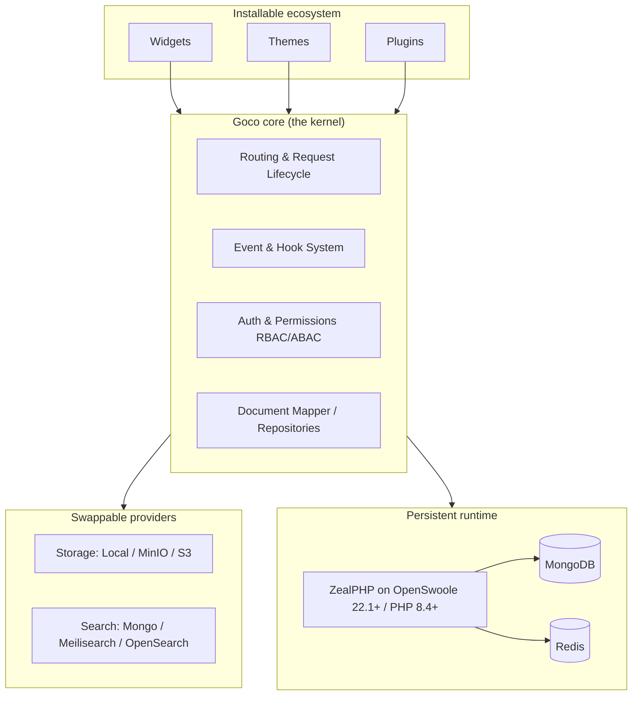

# Overview

> GOCO CMS is **The Open Source Website Operating System** — a lightweight core surrounded by a first-class ecosystem of widgets, themes, and plugins, running on a persistent async PHP runtime instead of the classic request-per-process model.

GOCO CMS lets you build almost any kind of website — a blog, a marketing site, a documentation portal, a storefront, an internal tool, a directory — **without writing HTML, CSS, or JavaScript**, while still giving developers a clean, documented SDK when they want to reach past the visual layer. It is MIT-licensed, pre-1.0, under active development, and versioned with [Semantic Versioning](../glossary.md) and [Conventional Commits](../community/contributing.md).

This page is the front door. It explains what GOCO is, the vision behind it, what you can build, who it is for, where its ideas come from, the pillars that govern every decision, and — in plain language — how the whole thing actually works.

---

## What is a "Website Operating System"?

A traditional CMS ships as one large application: content, theming, routing, plugins, and admin are welded together, and extending it means working *around* the monolith. GOCO inverts that.

Think of an operating system on your laptop. The **kernel** is small and stable; it manages resources and exposes clean interfaces. Everything you actually *use* — the browser, the editor, the terminal — is an application installed on top, and any of it can be swapped without rebuilding the kernel.

GOCO applies the same model to the web:

| OS concept | GOCO equivalent |
| --- | --- |
| Kernel | The `Goco\` **core** — routing, lifecycle, hooks, permissions, data mapper |
| System calls / SDK | The `Goco\SDK\{Widget, Theme, Plugin, Hook}` facades |
| Device drivers | Swappable **providers** — storage (Local/MinIO/S3), search (Mongo/Meilisearch/OpenSearch) |
| Installed applications | **Widgets**, **themes**, and **plugins** from the [marketplace](../marketplace/overview.md) |
| Processes | Persistent **[OpenSwoole](../architecture/zealphp-foundation.md) workers** running coroutines |
| Filesystem | **[MongoDB](../architecture/database-mongodb.md)** collections + object storage |
| Shared memory / IPC | **[Redis](../architecture/caching-and-queue.md)** and `\ZealPHP\Store` (cross-worker tables) |

The core stays small and predictable. Capability arrives as installable, versioned, replaceable units. That is the "operating system" idea in one sentence.



---

## Vision & goals

GOCO exists to close a gap that has persisted for two decades: the tools that are **easy** (Blogger, Wix) are closed and shallow, and the tools that are **powerful** (headless stacks, custom builds) demand a developer for every change. GOCO's vision is a single platform where a non-technical creator and a principal engineer can work on the *same site* without stepping on each other.

The goals that follow from that vision:

- **Zero-code authoring, full-code escape hatch.** Anyone can assemble a real, production site visually; any developer can extend it through a documented SDK, never a hack.
- **Modern runtime, not legacy PHP.** Persistent workers and coroutines ([ZealPHP](../architecture/zealphp-foundation.md) on OpenSwoole) replace the boot-die-per-request model, so requests are fast and real-time features are native.
- **Multi-tenant from day one.** One deployment can host many [workspaces, websites, and domains](../architecture/multi-tenancy.md) with strict isolation.
- **Everything replaceable.** No component — theme engine, search, storage, even the widget renderer — is a dead end. There is always a seam.
- **Open by default.** MIT license, open governance, public [roadmap](../roadmap.md), and a [marketplace](../marketplace/overview.md) that anyone can publish to.
- **Enterprise-serious.** Soft deletes, versioning, [audit logs](../architecture/data-model.md), RBAC + ABAC, backups, and horizontal scaling are core concerns, not afterthoughts.

---

## What you can build without writing code

Every site type below can be assembled entirely from the visual [Page Builder](../core/page-builder.md), [themes](../core/theme-engine.md), and [widgets](../core/widget-engine.md) — no HTML, CSS, or JavaScript required. Developers can, of course, go deeper on any of them.

- **Blogs & publications** — powered by the [Blog Engine](../core/blog-engine.md): posts, revisions, taxonomies, authors, RSS, and comments.
- **Marketing & landing pages** — hero sections, feature grids, pricing tables, testimonials, CTAs, and forms.
- **Business & corporate websites** — multi-page sites with menus, team pages, and localized content.
- **Documentation portals** — structured content trees, search, versioned docs, and code-friendly rendering.
- **Portfolios & creator sites** — galleries, case studies, and media-rich layouts.
- **Directories & listings** — built on the [Database Builder](../core/database-builder.md): dynamic collections with filtered, paginated, searchable views.
- **Knowledge bases & help centers** — categorized articles, search, and contact forms.
- **Landing-page funnels & campaigns** — forms captured to `form_submissions`, with analytics.
- **Community & membership sites** — gated content via [roles and capabilities](../architecture/permission-system.md).
- **Event & conference sites** — schedules, speaker directories, and registration forms.
- **Storefront & catalog sites** — product collections, listing pages, and enquiry/checkout flows (commerce via plugins).
- **Intranets & internal tools** — permissioned dashboards and internal directories per workspace.
- **Multi-brand / agency portfolios** — many isolated websites under one workspace, each with its own theme and domain.
- **University & institutional sites** — departmental sites, news, and program directories under one tenant.

> **Tip** If a site type needs a behavior no widget provides, a developer adds one **plugin** and it becomes available to every future no-code builder on that deployment. Capability compounds.

---

## Who it is for

GOCO is deliberately designed so that very different people can share one platform.

| Audience | What GOCO gives them |
| --- | --- |
| **Developers** | A modern async runtime, a clean SDK, file-based REST routes, hooks, and a real [CLI](../sdk/cli.md) — extend without fighting a monolith. |
| **Designers** | A visual [Page Builder](../core/page-builder.md) and [Theme SDK](../sdk/theme-sdk.md) with layouts, regions, and asset bundles — pixel control without a build step. |
| **Agencies** | [Multi-tenancy](../architecture/multi-tenancy.md): many client websites and domains under one deployment, each isolated, themeable, and separately permissioned. |
| **Enterprises** | RBAC + ABAC, [audit logs](../architecture/data-model.md), versioning, [backup/restore](../deployment/backup-restore.md), [scaling](../deployment/scaling.md), and optional database-per-workspace isolation. |
| **Startups** | Ship a marketing site today, add a product collection tomorrow, and never hit a migration wall as you grow. |
| **Universities** | Departmental sites, news, and directories under one governed tenant with role-scoped editors. |
| **Creators** | Blogging, portfolios, and media sites with zero infrastructure knowledge required. |

---

## Where the ideas come from

GOCO is unapologetic about learning from the best tools in the industry — while keeping its own architecture (ZealPHP + MongoDB + Redis + Docker/Traefik). It borrows *ideas*, never implementations.

| Inspiration | Idea GOCO adopts | How GOCO keeps its own architecture |
| --- | --- | --- |
| **Blogger** | Effortless "just start writing" onboarding | Backed by the [Blog Engine](../core/blog-engine.md) with revisions and multi-tenancy |
| **WordPress** | Hooks, plugins, themes, an open ecosystem | Hooks are a typed [event system](../architecture/event-hook-system.md); no global mutable state |
| **Webflow** | Visual, box-model page building | [Sections → Containers → Rows → Columns → Widgets](../core/page-builder.md) persisted in MongoDB |
| **Framer** | Fast, expressive design surface | Rendered by persistent OpenSwoole workers, streamed via generators |
| **Wix Studio** | Pro-grade visual editing for agencies | Multi-site, multi-domain tenancy under one deployment |
| **Shopify** | Themeable commerce with clean data | Product data via [dynamic collections](../core/database-builder.md); commerce via plugins |
| **Directus / Strapi / Payload** | Headless, API-first content modeling | File-based REST + [JSON-Schema-validated collections](../architecture/database-mongodb.md), not a bolted-on ORM |
| **Sanity** | Structured content and previews | [Widget preview](../sdk/widget-sdk.md) and revisioned documents |
| **Notion** | Block-based, composable content | Widgets as composable blocks inside layouts |
| **GitHub** | Open collaboration and governance | Open [governance](../community/governance.md), Conventional Commits, public roadmap |
| **Vercel** | Zero-config deploy experience | Docker-first with [Traefik](../deployment/traefik.md) auto-HTTPS and HTTP/3 |
| **Figma** | Multiplayer, component-driven design | Realtime via [Redis](../architecture/caching-and-queue.md) and native WebSockets |
| **VS Code** | A small core with a huge extension surface | Extensions are versioned widgets/themes/plugins on stable SDK contracts |

> **Note** "Borrowing an idea" means adopting a *mental model* — WordPress's hooks, Webflow's box model — and re-expressing it on GOCO's stack. GOCO never runs Laravel, Symfony, Apache/Nginx as the primary proxy, or MySQL/PostgreSQL as its database.

---

## The core pillars

Every module in GOCO is held to six non-negotiable properties. They are the design contract that keeps a "Website Operating System" coherent as it grows.

1. **Modular** — the system is a set of packages (`packages/{auth, widget-engine, template-engine, plugin-engine, database, ...}`) with narrow responsibilities and explicit boundaries.
2. **Replaceable** — every capability sits behind an interface: storage drivers, search providers, the theme engine, even the renderer. There is always a seam to swap.
3. **Configurable** — behavior is driven by [configuration](../getting-started/configuration.md) and manifests, not forks. Environment, workspace, and website settings layer cleanly.
4. **Extendable** — the [SDK facades](../sdk/hook-sdk.md) and hooks let you add or alter behavior from a plugin without touching core.
5. **Documented** — each core module follows a fixed 17-section standard, so any component can be understood the same way. See the [architecture overview](../architecture/overview.md).
6. **Testable** — components are designed for isolation and covered by a defined [testing strategy](../community/testing-strategy.md).

---

## How it works, in plain language

You don't need to know the internals to use GOCO — but here is the honest, non-hand-wavy version of what happens under the hood.

**1. Persistent workers, not boot-per-request.** GOCO runs on [ZealPHP](../architecture/zealphp-foundation.md) over **OpenSwoole 22.1+** and **PHP 8.4+**. Instead of starting a fresh PHP process for every request (the classic model), GOCO keeps a pool of **worker processes alive**. Each worker handles thousands of requests using **coroutines**, so slow work (a database call, an HTTP fetch) never blocks other requests. The runtime entry file is `app.php`; the bootstrap is deliberately tiny:

```php
require 'vendor/autoload.php';

use ZealPHP\App;

App::superglobals(false);
$app = App::init('0.0.0.0', 8080);
$app->run();
```

Routes are declared Flask-style, with parameters injected by name, and handlers just return data — an array becomes JSON automatically:

```php
$app->route('/hello/{name}', function ($name, $request, $response) {
    return ['hello' => $name];
});
```

**2. Content lives in MongoDB.** Pages, posts, widgets, layouts, menus, media, users, and settings are stored as documents in [MongoDB](../architecture/database-mongodb.md) collections, validated by JSON-Schema and served through a lightweight document-mapper and Repository pattern in `packages/database` — *not* a heavy ORM. Every document carries `created_at`, `updated_at`, `deleted_at` (soft delete), `version`, and audit fields; tenant-scoped documents also carry `workspace_id` and `website_id`.

**3. Redis makes it fast and real-time.** [Redis](../architecture/caching-and-queue.md) handles caching, the job queue, sessions, distributed locks, rate limiting, and pub/sub for realtime features. Cross-worker shared state uses `\ZealPHP\Store` (an OpenSwoole table) and atomic `\ZealPHP\Counter`.

**4. Docker + Traefik put it online.** GOCO is Docker-first. A single `docker compose` stack runs the app alongside `mongodb`, `redis`, `traefik`, `minio`, `meilisearch`, and `mailpit`. [Traefik](../deployment/traefik.md) is the reverse proxy: it terminates TLS with automatic HTTPS via Let's Encrypt, supports wildcard/multi-domain routing and HTTP/3, and routes each tenant's domain to the right website through Docker labels.

**5. You build with widgets, themes, and plugins.** A [theme](../core/theme-engine.md) provides layouts and regions; you drop [widgets](../core/widget-engine.md) into a page following the hierarchy **Workspace → Website → Theme → Layout → Section → Container → Row → Column → Widget**; and [plugins](../core/plugin-engine.md) add new capabilities. Developers reach all of this through the SDK:

```php
use Goco\SDK\Widget;
use Goco\SDK\Hook;

Widget::register('hero', [
    'title'    => 'Hero Banner',
    'category' => 'marketing',
    'render'   => fn (array $props) => Widget::render('hero', $props),
]);

Hook::listen('page.rendered', function ($page) {
    // observe or augment every rendered page
});
```

Put together: a request hits **Traefik**, is routed to a persistent **ZealPHP worker**, which resolves the tenant, loads the page document from **MongoDB** (cached in **Redis**), renders it through the theme and widgets, fires hooks along the way, and streams the response back — all without ever spawning a new process. For the full step-by-step, see the [Request Lifecycle](../architecture/request-lifecycle.md).

---

## Where to go next

- **[Quick Start](../getting-started/quick-start.md)** — from zero to a published page in about ten minutes.
- **[Installation](../getting-started/installation.md)** — requirements and the Docker, Composer, and source install paths.
- **[Architecture Overview](../architecture/overview.md)** — how the core, packages, and runtime fit together.
- **[Philosophy & Design Principles](philosophy.md)** — the rules behind every decision.
- **[Comparison](comparison.md)** — GOCO next to WordPress, Webflow, Blogger, and headless CMSs.
- **Build something:** the [Widget Guide](../guides/widget-guide.md), [Theme Guide](../guides/theme-guide.md), [Plugin Guide](../guides/plugin-guide.md), and [Template Guide](../guides/template-guide.md).

---

## Related

- [Documentation Home](../README.md)
- [Philosophy & Design Principles](philosophy.md)
- [Comparison](comparison.md)
- [Quick Start](../getting-started/quick-start.md)
- [Architecture Overview](../architecture/overview.md)
- [ZealPHP Foundation](../architecture/zealphp-foundation.md)
- [Widget Engine](../core/widget-engine.md)
- [Roadmap](../roadmap.md)
- [Glossary](../glossary.md)
