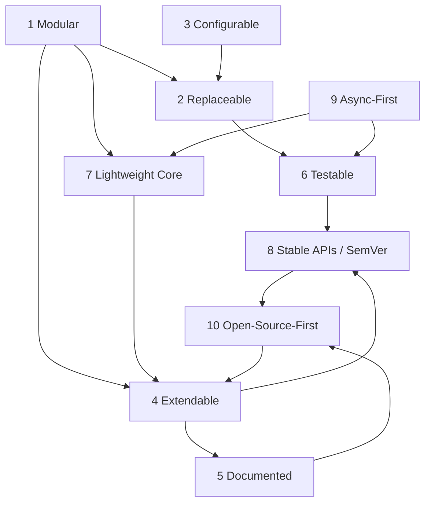

# Philosophy & Design Principles

> The ten rules that govern every architectural decision in GOCO CMS — the "why" behind the Website Operating System, and how each rule is enforced in code, APIs, and infrastructure.

GOCO CMS is not a monolith with an extension mechanism bolted on. It is a **lightweight core surrounded by an ecosystem** of widgets, themes, and plugins — a *Website Operating System*. A kernel this small only stays coherent if every contributor pulls in the same direction, so we encode direction as **principles**, not preferences.

This document is the constitution. Each principle states **the rule**, explains **the why**, and shows **how it is enforced** — concretely, in the [ZealPHP](../architecture/zealphp-foundation.md) runtime, the [MongoDB data layer](../architecture/database-mongodb.md), the [SDK facades](../sdk/plugin-sdk.md), and the [Docker/Traefik](../deployment/docker.md) deployment surface. When two principles appear to conflict, the earlier-numbered one wins, and the tension is documented rather than hidden.

> **Note**
> These principles are binding on the core team and are the basis of every code review. If a pull request violates one, the reviewer cites the principle number. See [Governance](../community/governance.md) and [Coding Standards](../community/coding-standards.md).

---

## Principle 1 — Everything Modular

**Rule.** Every capability lives in a self-contained package with an explicit boundary, an explicit public surface, and no reach-around into another package's internals. The core knows *interfaces*, never concrete implementations.

**Why.** A CMS accretes features forever. Without hard module boundaries, "the CMS" becomes a single ball of mud where a change to the blog breaks the media library. Modularity is what lets a team of thousands ship independently and lets a solo developer reason about one box at a time. It is also the precondition for every other principle: you cannot replace, extend, or test a thing that has no edge.

**How it is enforced.**

- **Monorepo package split.** The repository is divided into `core/` and independently versioned `packages/{auth,widget-engine,template-engine,plugin-engine,database,queue,storage,seo,ai,analytics,forms}`, plus `apps/{admin,api,website,installer}`. Each package is a Composer package (`gococms/*`) under PSR-4 namespace `Goco\`, with its own `composer.json`, tests, and semver line.
- **Facade boundaries.** Cross-package interaction goes through the public facades `Goco\SDK\{Widget,Theme,Plugin,Hook}` — never through concrete classes. A widget author calls `Widget::register()`; they do not `new` the engine.
- **Composition over inheritance.** The [service container](../architecture/service-container.md) wires interfaces to implementations at boot. Modules declare *what they need* (a `SearchProvider`, a `StorageDriver`), never *who provides it*.
- **The website hierarchy is itself modular.** Content composes as *Workspace → Website → Theme → Layout → Section → Container → Row → Column → Widget*. Each level is an independent unit with its own contract; a Widget never assumes which Column it renders in.

```php
// A package depends on an interface it does not own the implementation of.
namespace Goco\Storage;

interface StorageDriver
{
    public function put(string $path, string $contents, array $opts = []): string;
    public function get(string $path): string;
    public function delete(string $path): bool;
    public function url(string $path): string;
}
// Local, MinIO, and S3 drivers implement this. The media library depends on
// StorageDriver — not on any one of them. See ../architecture/storage.md
```

---

## Principle 2 — Everything Replaceable

**Rule.** Any infrastructure dependency and any user-facing surface can be swapped for an alternative that satisfies the same interface — without touching core code.

**Why.** Requirements change and vendors disappear. A CMS that hard-codes one storage backend or one search engine forces its users to fork it. By programming to *provider* and *driver* interfaces, GOCO turns "we need OpenSearch instead of Meilisearch" from a rewrite into a one-line configuration change. Replaceability is also how the same core serves a hobbyist on a single VPS and an enterprise on a managed cluster.

**How it is enforced.**

- **Driver interfaces for infrastructure.**
  - **Object storage** — `StorageDriver` with **Local, MinIO, Amazon S3** implementations ([Storage](../architecture/storage.md)).
  - **Search** — `SearchProvider` with **MongoDB text/Atlas Search, Meilisearch, OpenSearch** implementations, swappable at runtime ([Search](../architecture/search.md)).
- **Swappable presentation.** [Themes](../core/theme-engine.md) and [plugins](../core/plugin-engine.md) are hot-swappable units registered via `Theme::register()` / `Plugin::register()`. A [widget](../core/widget-engine.md) type can be re-registered with a new definition without a redeploy.
- **The proxy edge is replaceable too.** [Traefik](../deployment/traefik.md) is the default reverse proxy, wired via Docker labels — but because the app speaks plain HTTP on `0.0.0.0:8080`, any edge that can forward HTTP works.
- **Config selects the implementation.** Each provider family reads a single env var; the container binds the interface to the chosen class at boot.

```env
# Selecting implementations without a single code change — see Principle 3.
STORAGE_DRIVER=s3            # local | minio | s3
SEARCH_PROVIDER=meilisearch  # mongodb | meilisearch | opensearch
```

```php
// The binding happens once, centrally. Everything else depends on the interface.
$container->bind(Goco\Search\SearchProvider::class, function ($c) {
    return match ($c->config('search.provider')) {
        'meilisearch' => new Goco\Search\Meilisearch\Provider($c->config('search.meili')),
        'opensearch'  => new Goco\Search\OpenSearch\Provider($c->config('search.os')),
        default       => new Goco\Search\Mongo\Provider($c->get(Goco\Database\Connection::class)),
    };
});
```

> **Tip**
> "Replaceable" is a testing feature as much as a production feature: swap the real driver for an in-memory fake and your suite runs with no network. See Principle 6.

---

## Principle 3 — Everything Configurable (12-Factor)

**Rule.** Everything that varies between environments lives in configuration — read from the environment — never in code. One build artifact runs unchanged in development, staging, and production.

**Why.** Config baked into code means a rebuild for every environment and secrets leaking into git history. The [Twelve-Factor](https://12factor.net) discipline — strict separation of config from code — is what makes GOCO reproducible, secure, and container-native. A `docker compose up` on a laptop and a production cluster differ only by their environment.

**How it is enforced.**

- **Env-first configuration.** All tunables — database URIs, Redis, driver selection, mail, JWT secrets — come from environment variables, surfaced through a typed config layer (`config('search.provider')`). See [Configuration](../getting-started/configuration.md) and the [Configuration Reference](../reference/configuration-reference.md).
- **Twelve-factor backing services.** MongoDB, Redis, MinIO, Meilisearch, and Mailpit are attached resources addressed purely by config — never assumed to be local.
- **Docker as the config surface.** Compose service names (`gococms, mongodb, redis, traefik, minio, meilisearch, mailpit, watchtower`) plus per-service env blocks *are* the configuration. Traefik reads dynamic routing from Docker labels, not a rebuilt binary.
- **No secrets in code.** Secrets are injected as env; the repo ships `.env.example`, never `.env`.

```yaml
# docker-compose.yml — configuration is the deployment. See ../deployment/docker.md
services:
  gococms:
    image: gococms/core:latest
    environment:
      APP_MODE: coroutine
      MONGODB_URI: mongodb://mongodb:27017/goco
      REDIS_URL: redis://redis:6379/0
      STORAGE_DRIVER: s3
      SEARCH_PROVIDER: meilisearch
    labels:
      - "traefik.enable=true"
      - "traefik.http.routers.goco.rule=Host(`example.com`)"
    healthcheck:
      test: ["CMD", "php", "app.php", "status"]
    restart: unless-stopped
```

---

## Principle 4 — Everything Extendable

**Rule.** Behavior can be observed, altered, and augmented from outside the core through a stable, documented extension surface — hooks, SDKs, and named extension points — without patching core files.

**Why.** A core that must be edited to be extended is a core that cannot receive upstream updates. Extensibility is the difference between an ecosystem and a fork farm. The [event & hook system](../architecture/event-hook-system.md) lets a plugin change the page title, inject a widget, or veto a publish — all without the core knowing the plugin exists.

**How it is enforced.**

- **Hooks: actions and filters.** The `Goco\SDK\Hook` facade provides `listen()`/`dispatch()` for *actions* (side effects) and `filter()`/`apply()` for *filters* (value transforms), plus `dispatchAsync()` for coroutine-safe fan-out.
- **Disciplined naming.** Actions read `subject.verb[.tense]` (`core.boot`, `request.received`, `page.rendering`/`page.rendered`, `content.publishing`/`content.published`, `widget.render.before`/`widget.render.after`, `plugin.activated`, `user.login`). Filters read `subject.noun` (`page.title`, `widget.output`, `menu.items`, `query.criteria`, `response.headers`). Plugin-owned hooks are namespaced by plugin slug.
- **SDKs as the contract.** [Widget SDK](../sdk/widget-sdk.md), [Theme SDK](../sdk/theme-sdk.md), [Plugin SDK](../sdk/plugin-sdk.md), and [Hook SDK](../sdk/hook-sdk.md) are the sanctioned way to extend. Plugins register routes with `Plugin::routes()` and capabilities with `Plugin::permissions()`.
- **Documented extension points.** Every core module's docs include a mandatory *Extension Points* section (Principle 5).

```php
use Goco\SDK\Hook;

// Filter: transform a value the core will use.
Hook::filter('page.title', fn(string $title, $ctx) => "{$title} — Acme", priority: 20);

// Action: react to a lifecycle event without altering the flow.
Hook::listen('content.published', function ($page) {
    Hook::dispatchAsync('acme.reindex', $page->id); // coroutine-safe, non-blocking (Principle 9)
}, priority: 10);
```

---

## Principle 5 — Everything Documented

**Rule.** No feature is "done" until it is documented. Every core module follows the same 17-section standard so a reader can find any fact in a predictable place.

**Why.** Undocumented power is unusable power. A Website Operating System is only as adoptable as its docs are navigable. A *fixed* structure — not just *some* docs — means the answer to "what are this module's events?" is always Section 9, in every module, forever.

**How it is enforced.**

- **The 17-section module standard.** Every core-module document must contain, in order: **1** Purpose, **2** Functional Specification, **3** Business Requirements, **4** User Stories, **5** Data Model (MongoDB collections & indexes), **6** Folder Structure, **7** API Design, **8** Services, **9** Events, **10** Hooks, **11** UI Architecture, **12** Security Model, **13** Performance Strategy, **14** Testing Strategy, **15** Extension Points, **16** Upgrade Strategy, **17** Future Roadmap.
- **Stability tags.** Public surfaces are tagged `stable` / `beta` / `experimental` / `deprecated` so consumers know what they can lean on.
- **Docs live with code.** Documentation ships in `docs/` in the same monorepo and PR as the feature; a review that lacks docs is incomplete.
- **Conventional Commits** feed a generated [Changelog](../changelog.md), so the historical record documents itself.

> **Note**
> This very file is part of that discipline — the [Doc Map in the README](../README.md) enumerates every planned document, and cross-links are relative so the tree is portable.

---

## Principle 6 — Everything Testable

**Rule.** Every unit of behavior must be reachable by an automated test without standing up the whole world. Design for tests first; if a thing is hard to test, the design is wrong.

**Why.** Confidence to move fast comes from tests, not hope. Pre-1.0 with active development means constant change; a comprehensive suite is what lets us refactor the kernel without fear. Testability is a *design* property — it is bought by Principles 1 (modularity) and 2 (replaceability), and it is why they exist.

**How it is enforced.**

- **Interfaces enable fakes.** Because storage, search, and other backends are interfaces, tests bind in-memory fakes — no MongoDB, Redis, or S3 required for a unit test.
- **Layered strategy.** Unit tests per package, integration tests against real backing services in ephemeral Docker containers, and end-to-end tests through the [request lifecycle](../architecture/request-lifecycle.md). See [Testing Strategy](../community/testing-strategy.md).
- **Deterministic async.** Coroutine code is tested by driving the scheduler and asserting on `Channel` outputs, so async paths are not left uncovered (Principle 9).
- **`tests/` is first-class.** The monorepo carries a top-level `tests/` tree; CI runs the full matrix on every PR.

```php
// A service test with a faked driver — no network, fully deterministic.
$storage = new Goco\Storage\InMemoryDriver();
$media   = new Goco\Media\MediaService($storage);

$id = $media->store('logo.png', $bytes);

$this->assertSame($bytes, $storage->get($media->pathOf($id)));
```

---

## Principle 7 — Lightweight Core, Optional Features as Plugins

**Rule.** The core ships only what *every* site needs. Everything else — even features we build ourselves — is a plugin that could in principle be removed.

**Why.** An "operating system" is a small kernel plus a package ecosystem, not a maximalist bundle. Every feature in the core is a feature every user pays for in surface area, attack area, and cognitive load. Keeping the core small keeps it comprehensible, secure, and fast to boot. It also keeps us honest: if our own AI or analytics feature can be a plugin, the plugin API must be genuinely powerful (Principle 4).

**How it is enforced.**

- **The kernel is boot + routing + hooks + data-mapper.** The core provides the [ZealPHP foundation](../architecture/zealphp-foundation.md), [routing](../core/routing.md), the [hook system](../architecture/event-hook-system.md), and a lightweight document-mapper + Repository pattern in `packages/database` (`Goco\Database`) — deliberately **not** a heavy ORM.
- **First-party features are plugins/packages.** The [AI Platform](../core/ai-platform.md), analytics, SEO, forms, and the [Blog Engine](../core/blog-engine.md) live in their own `packages/` and register through the same public SDK an external author uses.
- **Dogfooding the extension API.** Because our own features consume `Plugin::register()`, `Hook::filter()`, and `Widget::register()`, the extension surface is proven in production by us before third parties rely on it.
- **Marketplace, not bundle.** Optional capability is distributed through the [Plugin Marketplace](../marketplace/overview.md), not stuffed into the default image.

---

## Principle 8 — Stable Public APIs, SemVer & Backward Compatibility

**Rule.** The public surface — SDK facade signatures, hook names, config keys, event contracts — is a promise. It changes only under Semantic Versioning, and breaking changes never land silently.

**Why.** An ecosystem is a web of trust: a theme author writing against `Theme::register()` today must still work after a `patch` and a `minor` upgrade. Break that and the ecosystem stops growing. SemVer is how we communicate risk mechanically, so consumers can automate upgrades.

**How it is enforced.**

- **SemVer + Conventional Commits.** Version bumps are derived from commit types; a `feat` is a minor, a `fix` is a patch, and a `!`/`BREAKING CHANGE` forces a major. Pre-1.0, breaking changes are still flagged loudly, and post-1.0 they are confined to majors.
- **Frozen facade signatures.** The `Goco\SDK` facades are versioned contracts. For example these signatures are stable:
  - `Widget::register(string $type, array|callable $definition): void`
  - `Theme::register(string $slug, array $manifest): void`
  - `Plugin::register(string $slug, array $manifest): void`
  - `Hook::listen(string $action, callable $cb, int $priority = 10): void`
- **Deprecate before remove.** A surface is tagged `deprecated`, kept working for a defined window, and removed only in a subsequent major — with a migration note in the [Changelog](../changelog.md).
- **Stability tags set expectations.** `experimental` and `beta` surfaces are explicitly exempt from the compatibility promise until they graduate to `stable`.

> **Warning**
> Renaming a hook or a config key is a breaking change even if the code still "works" — external plugins reference those strings. Add the new name, alias the old, deprecate, then remove on a major.

---

## Principle 9 — Async-First (No Blocking in Coroutine Mode)

**Rule.** In the default coroutine mode, code must never block the worker. Every I/O operation yields; CPU-bound work is offloaded. A single slow call must not stall the requests sharing that worker.

**Why.** GOCO runs on **OpenSwoole 22.1+** with **PHP 8.4+** under [ZealPHP](../architecture/zealphp-foundation.md), whose default `App::MODE_COROUTINE` multiplexes thousands of concurrent requests over a small pool of workers. That model is only fast if nobody blocks: one synchronous `sleep()` or blocking socket freezes every coroutine on the worker. Async-first is what delivers the concurrency a Website Operating System needs — [WebSockets](../architecture/caching-and-queue.md), [SSE](../architecture/rendering-pipeline.md), and streaming responses included.

**How it is enforced.**

- **Coroutine primitives, not blocking calls.** Use `go(callable)`, `\OpenSwoole\Coroutine\Channel`, and `co::sleep()` / `\OpenSwoole\Coroutine\sleep()` — never PHP's blocking `sleep()`.
- **Non-blocking backing services.** MongoDB and Redis access, and driver I/O, run through coroutine-aware clients so a query yields the worker instead of holding it.
- **Streaming by generators.** Handlers return `int|array|string|Generator`; a generator yields chunks with `co::sleep()` between them for backpressure-friendly streaming and SSE via `$response->sse()`.
- **Cross-worker state without locks-that-block.** Shared state uses `\ZealPHP\Store` (an `OpenSwoole\Table`) and atomic `\ZealPHP\Counter`, with pub/sub via `Store::publish` + `App::subscribe`; Redis backs distributed locks, queues, and rate limits.
- **Timers, not busy-loops.** Periodic work registers with `App::onWorkerStart()` → `App::tick()` / `App::after()`.

```php
use function OpenSwoole\Coroutine\go;
use OpenSwoole\Coroutine\Channel;

$app->route('/report/{id}', function ($id, $request, $response) {
    $chan = new Channel(2);

    // Fan out two non-blocking reads concurrently.
    go(fn() => $chan->push(['stats',  Reports::stats($id)]));   // yields on Mongo I/O
    go(fn() => $chan->push(['charts', Reports::charts($id)]));  // runs concurrently

    $out = [];
    for ($i = 0; $i < 2; $i++) { [$k, $v] = $chan->pop(); $out[$k] = $v; }
    return $out; // array -> auto-JSON
});
```

> **Warning**
> A blocking call in coroutine mode is a latent outage. Code review treats any blocking I/O on the request path as a defect. If you truly must run legacy blocking code, isolate it via `App::MODE_MIXED` — never in the coroutine hot path.

---

## Principle 10 — Open-Source-First

**Rule.** GOCO is built in the open, for a community, under transparent governance. The MIT license, the contribution process, and decision-making are all public and welcoming by default.

**Why.** A Website Operating System is infrastructure; infrastructure earns trust by being inspectable, forkable, and community-governed. Open-source-first is not a distribution tactic — it shapes the product. Public roadmaps, public design discussion, and a real contribution path are what turn users into maintainers and a project into a platform.

**How it is enforced.**

- **MIT license, no strings.** The entire monorepo is MIT; anyone can use, fork, and extend it commercially.
- **A real front door.** [Contributing](../community/contributing.md), the [Code of Conduct](../community/code-of-conduct.md), and [Coding Standards](../community/coding-standards.md) define how to participate, and [Support](../community/support.md) defines where to get help.
- **Transparent decisions.** [Governance](../community/governance.md) documents roles, the RFC/decision process, and how maintainers are made — the same process that ratifies these very principles.
- **Public roadmap.** Direction is planned in the open via the [Roadmap](../roadmap.md); Conventional Commits and a generated [Changelog](../changelog.md) keep the record honest.
- **Contribution-shaped architecture.** Modularity (Principle 1) and documented extension points (Principles 4–5) exist partly so that a first-time contributor can land a widget or plugin without understanding the whole kernel.

---

## How the Principles Reinforce One Another

The ten rules are not a checklist — they are a dependency graph. Modularity makes replaceability possible; replaceability makes testability cheap; a small core makes the extension API load-bearing, which makes stability contracts matter, which is what lets an open-source community build on top without fear.



| # | Principle | Primary enforcement surface | Read next |
|---|-----------|-----------------------------|-----------|
| 1 | Modular | Monorepo packages, `Goco\` PSR-4, SDK facades | [Architecture Overview](../architecture/overview.md) |
| 2 | Replaceable | Driver/provider interfaces (storage, search) | [Storage](../architecture/storage.md), [Search](../architecture/search.md) |
| 3 | Configurable | Env / 12-factor, Docker + Traefik labels | [Configuration](../getting-started/configuration.md) |
| 4 | Extendable | Hooks + SDKs + extension points | [Event & Hook System](../architecture/event-hook-system.md) |
| 5 | Documented | 17-section module standard, stability tags | [Contributing](../community/contributing.md) |
| 6 | Testable | Fakes via interfaces, layered suite | [Testing Strategy](../community/testing-strategy.md) |
| 7 | Lightweight core | Kernel + plugins, marketplace | [Plugin Engine](../core/plugin-engine.md) |
| 8 | Stable APIs | SemVer, Conventional Commits, deprecation window | [Governance](../community/governance.md) |
| 9 | Async-first | OpenSwoole coroutines, `Channel`, `Store` | [ZealPHP Foundation](../architecture/zealphp-foundation.md) |
| 10 | Open-source-first | MIT, public governance & roadmap | [Governance](../community/governance.md) |

> **Tip**
> When you propose a change, name the principle it serves — and the principle it costs. Every design is a trade; making the trade explicit is how this project stays coherent as it grows.

---

## Related

- [Overview](./overview.md) — what GOCO CMS is, in one page
- [Comparison](./comparison.md) — how these principles differ from other CMS platforms
- [Architecture Overview](../architecture/overview.md) — the principles rendered as a system
- [ZealPHP Foundation](../architecture/zealphp-foundation.md) — the async-first runtime (Principle 9)
- [Event & Hook System](../architecture/event-hook-system.md) — the extension surface (Principle 4)
- [Plugin Engine](../core/plugin-engine.md) — lightweight core, features as plugins (Principle 7)
- [Governance](../community/governance.md) — how these principles are decided and upheld
- [Contributing](../community/contributing.md) — participate in an open-source-first project (Principle 10)
- [Roadmap](../roadmap.md) — where the platform is headed
- [Documentation Index](../README.md) — the full doc map
