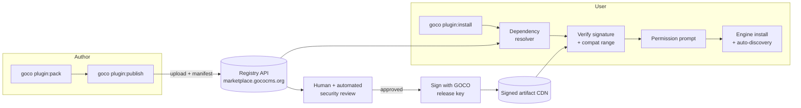

# Plugin Marketplace

> The GOCO Marketplace is the official, signed registry for plugins, themes, widgets, and templates — a single trusted distribution channel where authors publish versioned, compatibility-ranged packages and users discover, install, update, and remove them with permission-aware, sandboxed safety.

**Stability:** `beta` · **Registry host:** `marketplace.gococms.org` · **CLI:** `goco plugin:*`, `goco theme:*`, `goco widget:*`, `goco template:*` · **Signing:** minisign (Ed25519) detached signatures

---

## Overview

The Marketplace is the fourth pillar of the "Website Operating System" model: the [Widget Engine](../core/widget-engine.md), [Theme Engine](../core/theme-engine.md), and [Plugin Engine](../core/plugin-engine.md) define *how* extensions run; the Marketplace defines *how they are distributed and trusted*.

It serves two audiences with one contract:

- **Authors** publish four artifact kinds — **plugins**, **themes**, **widgets**, and **templates** — each described by a typed manifest, versioned with [SemVer](https://semver.org), pinned to `requires` compatibility ranges, reviewed, and cryptographically signed.
- **Users** discover packages by category, install them by slug, receive automatic dependency resolution and permission prompts, and update or remove them idempotently — all mediated by the local Plugin/Theme/Widget engines.

Everything the Marketplace publishes is a **package**: a versioned, immutable tarball (`<slug>-<version>.tgz`) plus a detached signature (`.tgz.minisig`) plus a manifest, addressable by `<slug>@<version>`.



---

## Package Kinds

| Kind | Manifest | Installs into | Backing engine | Runtime effect |
| --- | --- | --- | --- | --- |
| **Plugin** | `plugin.json` | `plugins/<slug>/` | [Plugin Engine](../core/plugin-engine.md) | Routes, hooks, jobs, collections, capabilities, settings |
| **Theme** | `theme.json` | `themes/<slug>/` | [Theme Engine](../core/theme-engine.md) | Layouts, regions, asset bundles |
| **Widget** | `widget.json` | `widgets/<slug>/` | [Widget Engine](../core/widget-engine.md) | A single registered widget `type` + property schema |
| **Template** | `template.json` | `templates/<slug>/` | Template Engine | Page/layout/section presets (no executable PHP required) |

> **Note**
> A **plugin** may bundle widgets and themes internally, but publishing them as first-class package kinds lets users install a single widget or a single template without pulling a whole plugin. Prefer the smallest kind that satisfies the need — ship a widget or template if you do not need routes, jobs, or persisted data.

---

## For Authors

### Publishing Flow

The end-to-end author lifecycle is `init → develop → pack → publish → review → sign → release`.

```bash
# 1. Scaffold (any kind: plugin|theme|widget|template)
goco plugin:init acme/seo-toolkit
cd plugins/seo-toolkit

# 2. Develop and validate against the local runtime
goco plugin:validate            # lint manifest, schema, capabilities, ABI
goco plugin:test                # runs packages/*/tests via Pest

# 3. Authenticate to the registry (device-code OAuth2, token in ~/.goco/credentials)
goco marketplace:login

# 4. Pack into an immutable, reproducible tarball
goco plugin:pack                # -> dist/seo-toolkit-1.4.0.tgz (+ SHA-256)

# 5. Publish for review (uploads tarball + manifest + changelog)
goco plugin:publish --tag=next  # dist-tag; omit for a normal release
```

Publishing does **not** make a package immediately installable. It enters the review queue as a **candidate version**. Only after review approval and signing does it become resolvable by `goco plugin:install`.

Rules enforced at publish time:

- A `<slug>@<version>` is **immutable** — a published version can never be overwritten, only superseded or **deprecated**/**yanked**.
- The `slug` must be namespaced `<vendor>/<name>` (e.g. `acme/seo-toolkit`); the vendor is bound to the author's verified account.
- The manifest `version` must be strictly greater (SemVer precedence) than the current `latest` on the same major line, unless publishing to a distinct dist-tag.

### Manifest Requirements

Every package ships exactly one manifest at its root. The four schemas share a common envelope and differ only in the kind-specific block.

**`plugin.json`** (canonical, most complete):

```json
{
  "$schema": "https://marketplace.gococms.org/schema/plugin-1.json",
  "slug": "acme/seo-toolkit",
  "name": "SEO Toolkit",
  "kind": "plugin",
  "version": "1.4.0",
  "description": "Sitemaps, meta tags, schema.org, and redirects for GOCO CMS.",
  "license": "MIT",
  "homepage": "https://acme.dev/seo-toolkit",
  "repository": "https://github.com/acme/goco-seo-toolkit",
  "authors": [{ "name": "Acme", "email": "dev@acme.dev" }],
  "keywords": ["seo", "sitemap", "schema.org", "redirects"],
  "categories": ["SEO", "Marketing"],
  "requires": {
    "goco": ">=0.8 <0.10",
    "php": ">=8.4",
    "extensions": ["mongodb", "redis"]
  },
  "dependencies": {
    "gococms/sitemap-core": "^1.2"
  },
  "capabilities": ["seo.manage", "redirects.manage"],
  "entry": "src/Plugin.php",
  "settings": "settings.schema.json",
  "hooks": ["page.rendered", "content.published", "response.headers"],
  "migrations": "migrations/",
  "assets": { "admin": "public/admin.js" },
  "icon": "assets/icon.svg",
  "screenshots": ["assets/1.png", "assets/2.png"],
  "monetization": { "model": "free" }
}
```

**`theme.json`** replaces the executable block with presentation metadata:

```json
{
  "$schema": "https://marketplace.gococms.org/schema/theme-1.json",
  "slug": "acme/aurora",
  "kind": "theme",
  "version": "2.1.0",
  "requires": { "goco": ">=0.8 <0.10" },
  "layouts": ["default", "landing", "post", "docs"],
  "regions": { "default": ["header", "main", "sidebar", "footer"] },
  "assets": { "css": ["public/theme.css"], "js": ["public/theme.js"] },
  "supports": ["dark-mode", "rtl", "web-fonts"],
  "categories": ["Marketing", "Documentation"]
}
```

**`widget.json`** describes a single registered widget `type`:

```json
{
  "$schema": "https://marketplace.gococms.org/schema/widget-1.json",
  "slug": "acme/pricing-table",
  "kind": "widget",
  "version": "1.0.3",
  "type": "acme.pricing_table",
  "requires": { "goco": ">=0.8 <0.10", "php": ">=8.4" },
  "properties": "properties.schema.json",
  "preview": true,
  "categories": ["Commerce", "Marketing"]
}
```

**`template.json`** describes a declarative page/section preset (no PHP entry required):

```json
{
  "$schema": "https://marketplace.gococms.org/schema/template-1.json",
  "slug": "acme/saas-landing",
  "kind": "template",
  "version": "1.0.0",
  "requires": { "goco": ">=0.8 <0.10" },
  "targets": ["page", "section"],
  "content": "template/saas-landing.json",
  "usesWidgets": ["core.hero", "acme.pricing_table"],
  "categories": ["Marketing"]
}
```

> **Warning**
> `usesWidgets` and `dependencies` are hard requirements. The resolver refuses to install a template or plugin whose declared dependencies cannot be satisfied within the target's `requires.goco` range. Never assume a widget is present — declare it.

The registry validates every manifest against the published JSON Schema (`$schema`) at publish time. Unknown fields, missing `requires.goco`, malformed SemVer, or unregistered category names are hard failures.

### SemVer & Compatibility Ranges

Packages follow **Semantic Versioning** and **Conventional Commits** (the `goco plugin:pack` step derives the changelog from commit history).

- `MAJOR` — breaking API/ABI or data-model change.
- `MINOR` — backward-compatible feature.
- `PATCH` — backward-compatible fix.

Compatibility with the core is expressed as a **range** in `requires.goco`, using npm/Composer-style operators:

| Range | Matches | Meaning |
| --- | --- | --- |
| `>=0.8 <0.10` | 0.8.x, 0.9.x | Explicit half-open range (recommended pre-1.0) |
| `^1.2` | 1.2.0 – <2.0.0 | Caret: compatible within major |
| `~1.2` | 1.2.0 – <1.3.0 | Tilde: compatible within minor |
| `>=1.0` | 1.0.0 and up | Open-ended (discouraged; brittle across majors) |

> **Note**
> GOCO is **pre-1.0**. Per SemVer, `0.x` minor bumps may break. Authors should pin an explicit upper bound (`>=0.8 <0.10`), not `^0.8`, because caret semantics on `0.x` only lock the minor. The registry warns on unbounded pre-1.0 ranges.

`requires.php` must be `>=8.4` (the platform floor); `requires.extensions` lists mandatory PHP extensions (`mongodb`, `redis`, `openswoole`).

### Review, Signing & Trust

Every candidate version passes through the pipeline described in [Security Review & Sandboxing](#security-review--sandboxing) below. On approval:

1. The registry pins the exact tarball SHA-256.
2. It produces a detached **minisign (Ed25519)** signature with the GOCO release key.
3. The signed artifact is promoted to the CDN and the version becomes resolvable.

A package carries a **trust tier** shown in the UI and the CLI:

| Tier | Badge | How earned |
| --- | --- | --- |
| **Official** | `official` | Maintained by the GOCO core org (`gococms/*`) |
| **Verified** | `verified` | Verified vendor identity + passed review + signed |
| **Community** | `community` | Passed automated review + signed, unverified vendor |
| **Unlisted** | `unlisted` | Private/self-hosted; installable only by explicit URL with `--allow-unsigned` |

Users can configure a minimum acceptable tier per workspace (see [Settings](#settings)).

### Updates & Changelogs

- Each publish attaches a **changelog** entry (`CHANGELOG.md`, Keep-a-Changelog format, auto-derived from Conventional Commits).
- **Dist-tags** (`latest`, `next`, `lts`) let authors ship pre-releases without disturbing the default install target.
- **Deprecating** a version (`goco plugin:deprecate acme/seo-toolkit@1.3.0 --reason="use 1.4"`) keeps it installable but surfaces a warning.
- **Yanking** (`goco plugin:yank acme/seo-toolkit@1.3.1`) removes a version from resolution (used for security-critical releases); already-installed sites are notified via the update channel.

### Licensing & Monetization

The manifest `license` field is a required [SPDX identifier](https://spdx.org/licenses/). The Marketplace supports several monetization models declared under `monetization`:

| Model | `monetization.model` | Enforcement |
| --- | --- | --- |
| Free / open source | `free` | None |
| One-time purchase | `paid` | License key validated against registry on install/update |
| Subscription | `subscription` | Periodic entitlement check via registry API |
| Freemium | `freemium` | Free core; premium features gated by a license key |
| Sponsor / donate | `sponsor` | Link-out; no gating |

```json
{
  "monetization": {
    "model": "subscription",
    "price": { "amount": 9.0, "currency": "USD", "interval": "month" },
    "trialDays": 14,
    "licenseServer": "https://marketplace.gococms.org/entitlements"
  }
}
```

> **Tip**
> Paid packages are still distributed as signed tarballs; the license gate is enforced at **runtime** by the engine (via a hook on `plugin.activated`), not by withholding the artifact. Ship a functional free tier so the plugin degrades gracefully when a subscription lapses.

---

## For Users

### Discovery & Categories

Browse the Marketplace in the admin UI or via `goco marketplace:search`. Every package declares one or more **categories** from the canonical taxonomy:

| Category | Example packages |
| --- | --- |
| **SEO** | Sitemaps, meta/schema.org, redirects |
| **AI** | Content assistants, embeddings, RAG — see [AI Platform](../core/ai-platform.md) |
| **Commerce** | Carts, catalogs, pricing widgets |
| **Analytics** | Dashboards, event tracking, funnels |
| **CRM** | Contacts, pipelines, lead capture |
| **LMS** | Courses, lessons, quizzes |
| **Security** | 2FA policy, WAF rules, audit exports |
| **Email** | Newsletters, transactional templates (dev via Mailpit) |
| **Payments** | Gateways, invoices, subscriptions |
| **Documentation** | Doc themes, API reference generators |
| **Forms** | Form builders, spam filters, webhooks |
| **Marketing** | Landing pages, A/B tests, popups |
| **Integrations** | Slack, GitHub, Zapier, webhooks |

```bash
goco marketplace:search seo --category=SEO --tier=verified --sort=downloads
goco marketplace:info acme/seo-toolkit          # versions, compat, permissions, trust tier
```

### Install, Update & Remove

Installation is always mediated by the local engine, never a raw file copy:

```bash
goco plugin:install acme/seo-toolkit            # latest matching requires.goco
goco plugin:install acme/seo-toolkit@1.4.0      # exact version
goco plugin:install acme/seo-toolkit@^1.2       # range
goco theme:install acme/aurora
goco widget:install acme/pricing-table
goco template:install acme/saas-landing

goco plugin:update acme/seo-toolkit             # to newest compatible
goco plugin:update --all                        # respects each requires range
goco plugin:remove acme/seo-toolkit             # reverses migrations, unregisters
```

Every install is recorded per (workspace, website) so multi-tenant sites can enable different package sets from the same shared artifact cache. Removal is idempotent and **reversible**: the engine runs the package's down-migrations, drops its routes/hooks/timers, and leaves no dangling state (see [Plugin Engine §Lifecycle](../core/plugin-engine.md)).

### Dependency Resolution

`goco plugin:install` builds a dependency graph from `dependencies`/`usesWidgets`, then:

1. Selects the highest version of each dependency satisfying **all** constraints (the intersection of ranges) **and** the site's `requires.goco`.
2. Detects conflicts (incompatible ranges, cycles) and aborts with a readable diff — nothing is written on failure.
3. Presents a **plan** (what will be installed, at which versions, and the aggregate permission set) for confirmation.

```bash
$ goco plugin:install acme/seo-toolkit
Resolving dependencies…
  + acme/seo-toolkit      1.4.0   (verified, signed)
  + gococms/sitemap-core  1.3.2   (official, signed)   [dependency]
This will grant: seo.manage, redirects.manage
Proceed? [y/N]
```

### Permission Prompts on Install

Install surfaces the union of the package's declared `capabilities`. Nothing is granted silently — the installing user must both **confirm** the prompt and **hold** every capability being granted (you cannot grant what you lack). Capabilities are `resource.action` strings scoped per (workspace, website); see the [Permission System](../architecture/permission-system.md) and [Security Model](../security/security-model.md).

> **Warning**
> A plugin can only exercise capabilities it declared and that were confirmed at install. Requesting a capability at runtime that was not in the manifest is denied by the PolicyEngine and logged to `audit_logs`.

### Auto-Discovery

After the artifact lands in `plugins/`, `themes/`, `widgets/`, or `templates/`, the engine **auto-discovers** it on the next worker start (or immediately via `App::onWorkerStart` hot-reload in development): it reads the manifest, registers the entry point through the SDK facades (`Widget::register`, `Theme::register`, `Plugin::register`), binds hooks/routes/jobs, and applies pending migrations. No core edits, no manual wiring.

### Settings

Marketplace behavior is configured per workspace under `settings` (collection `settings`) and via environment:

```env
GOCO_MARKETPLACE_URL=https://marketplace.gococms.org
GOCO_MARKETPLACE_MIN_TRUST=verified     # official|verified|community
GOCO_MARKETPLACE_ALLOW_UNSIGNED=false   # block unsigned/unlisted installs
GOCO_MARKETPLACE_AUTO_UPDATE=security   # off|security|patch|minor
GOCO_MARKETPLACE_CACHE_TTL=3600         # Redis-cached registry responses
```

Auto-update policy `security` applies only yanked-version replacements and patches flagged as security fixes; other updates require explicit action.

---

## Registry API & CLI

The registry is a read-mostly HTTP/JSON API fronted by [Traefik](../deployment/traefik.md), with signed artifacts served from a CDN. The CLI (`goco`) and the admin UI are both clients of it.

| Method & path | Purpose |
| --- | --- |
| `GET /v1/search?q=&category=&tier=&page=` | Full-text + faceted search |
| `GET /v1/packages/{slug}` | Package summary, dist-tags, categories, trust tier |
| `GET /v1/packages/{slug}/{version}` | Manifest, `requires`, `capabilities`, SHA-256, signature URL |
| `GET /v1/packages/{slug}/{version}/download` | 302 to signed CDN artifact |
| `POST /v1/packages` | Publish a candidate version (authenticated) |
| `POST /v1/packages/{slug}/{version}/deprecate` | Deprecate |
| `DELETE /v1/packages/{slug}/{version}` | Yank |
| `GET /v1/entitlements/{slug}` | Validate a paid license/subscription |

```bash
# Resolve and inspect without installing
goco plugin:show acme/seo-toolkit@1.4.0 --json
# Verify a downloaded artifact by hand
minisign -Vm seo-toolkit-1.4.0.tgz -P <GOCO_RELEASE_PUBKEY>
```

Registry responses are cached in **Redis** (`GOCO_MARKETPLACE_CACHE_TTL`) so search and resolution stay fast and survive short registry outages; installs always re-verify the signature against the CDN artifact regardless of cache.

---

## Security Review & Sandboxing

The Marketplace is a trust boundary. Its guarantees are detailed in the [Security Model](../security/security-model.md); the pipeline in brief:

**Automated review (every candidate version):**

- Manifest schema validation and SemVer/range sanity.
- Static analysis: banned functions (`eval`, `exec`, `shell_exec`, `system`, raw `unserialize`), unsafe file/network access, obfuscation heuristics.
- Dependency audit against the CVE feed.
- ABI check: the package targets a supported core range and only calls public `Goco\SDK\*` facades.
- Capability audit: declared `capabilities` must match actual enforced call sites; undeclared capability use is rejected.

**Human review** is required to move from `community` to `verified`/`official` and for any package requesting sensitive capabilities (`users.manage`, `settings.manage`, `plugins.manage`, `domains.manage`).

**Signing:** approved artifacts are pinned by SHA-256 and signed with the GOCO release key (Ed25519/minisign). The CLI and engine **refuse** to install an artifact whose signature does not verify or whose hash differs from the manifest, unless `GOCO_MARKETPLACE_ALLOW_UNSIGNED=true` (development/self-hosted only).

**Runtime sandboxing:** installed plugins run inside the [Plugin Engine](../core/plugin-engine.md)'s constrained boot context — capability-gated data and route access, hook listeners isolated per coroutine, resource limits enforced by OpenSwoole, and every privileged action written to `audit_logs`. A misbehaving or deactivated plugin cannot leave dangling routes, timers, or hook listeners.

> **Note**
> Signing proves **who** published a version and that it was **not altered** in transit; the sandbox constrains **what** it can do once running. The two are complementary — neither alone is sufficient, and the Marketplace requires both for `verified`/`official` tiers.

---

## Related

- [Plugin Engine](../core/plugin-engine.md)
- [Security Model](../security/security-model.md)
- [Widget Engine](../core/widget-engine.md)
- [Theme Engine](../core/theme-engine.md)
- [Template Engine](../core/template-engine.md)
- [Plugin SDK](../sdk/plugin-sdk.md)
- [CLI SDK](../sdk/cli.md)
- [CLI Reference](../reference/cli-reference.md)
- [Permission System (RBAC + ABAC)](../architecture/permission-system.md)
- [Traefik Reverse Proxy](../deployment/traefik.md)
- [Documentation Home](../README.md)
