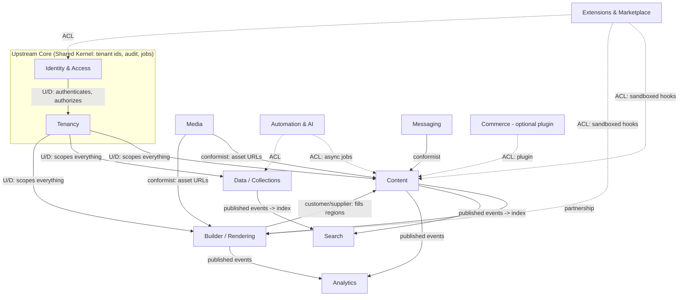
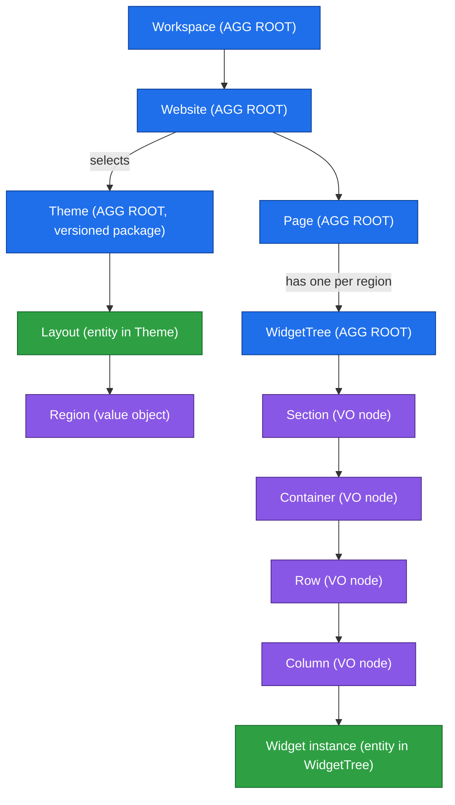
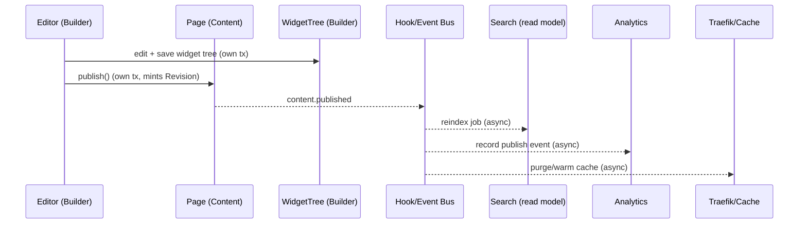

# Domain Model (Domain-Driven Design)

> The strategic and tactical domain model of GOCO CMS — the ubiquitous language, bounded contexts, context map, aggregates and their invariants, entities vs. value objects, domain events, and repository contracts that every module in the monorepo must honour.

This document is the **shared mental model** of GOCO CMS. It is written for architects, senior
contributors, and plugin authors who need to know *where a concept lives*, *who owns it*, and
*what rules protect it*. It uses [Domain-Driven Design](../glossary.md) vocabulary throughout:
**bounded context**, **aggregate**, **aggregate root**, **entity**, **value object**,
**domain event**, and **repository**.

Everything here is normative. The `Goco\` code in `core/`, `packages/`, and `apps/` implements
this model. The [Data Model](../architecture/data-model.md) document is its physical projection
onto MongoDB collections; this document is the *conceptual* layer that sits above it.

- **Status:** `beta` — the strategic design is stable; a few tactical boundaries (Commerce, Analytics) are still `experimental`.
- **Applies to:** GOCO CMS core, first-party packages, and the plugin SDK.

---

## 1. Why DDD for a Website Operating System

A "Website Operating System" is not one application — it is a **lightweight core** hosting an
open ecosystem of widgets, themes, and plugins. Without an explicit domain model, that ecosystem
collapses into accidental coupling: a plugin reaches into the rendering internals, a widget
mutates a user record, a theme assumes a content schema. DDD gives us the discipline to draw
**boundaries** and keep the core small.

Three forces make DDD the right lens here:

1. **Multi-tenancy.** Every meaningful concept is scoped by `workspace_id` and often `website_id`.
   The tenant boundary must be expressed in the model itself, not bolted on. See [Multi-Tenancy](../architecture/multi-tenancy.md).
2. **Extensibility.** Third parties extend the domain through the [Hook SDK](../sdk/hook-sdk.md).
   Domain events *are* the public extension surface, so they must be named and stable.
3. **Async runtime.** On ZealPHP/OpenSwoole a worker is long-lived and handles many coroutines.
   Aggregates must be small, consistency boundaries explicit, and no shared mutable global state
   may leak between requests. Per-request state lives in `\ZealPHP\G` / `RequestContext`.

> **Note**
> GOCO does **not** use a heavy ORM. The tactical patterns below are implemented by a lightweight
> document-mapper + Repository layer in `packages/database` (`Goco\Database`). Aggregates map to
> MongoDB documents; repositories load and persist whole aggregates within transactions.

---

## 2. Ubiquitous Language

The following terms have **one** meaning across code, UI, docs, and conversation. Deviating from
them is a bug. The full alphabetical list lives in the [Glossary](../glossary.md); this table is
the domain-critical subset.

| Term | Definition | Kind |
| --- | --- | --- |
| **Workspace** | The top-level tenant — a billing/ownership boundary that contains websites, users, and settings. | Aggregate root |
| **Website** | A single published site (its own domains, theme, content, menus) inside a workspace. | Aggregate root |
| **Domain** | A hostname bound to a website, with a verification and TLS state. | Value object / Entity |
| **Theme** | A versioned package providing layouts, regions, and an asset bundle for a website. | Aggregate root |
| **Layout** | A named page skeleton exposed by a theme (e.g. `default`, `full-width`, `landing`). | Entity (within Theme) |
| **Region** | A named insertion point inside a layout that a widget tree can fill. | Value object |
| **Section → Container → Row → Column** | The nested structural grid of the visual builder that positions widgets. | Value objects (structural nodes) |
| **Widget** | A reusable, typed UI unit with a property schema; rendered to HTML. | Entity (instance) / registered type |
| **Widget Tree** | The ordered composition of structural nodes and widget instances that fills a region. | Aggregate root |
| **Page** | An addressable, routable document of structured content and a widget tree. | Aggregate root |
| **Post** | A blog entry with taxonomy, scheduling, and a revision history. | Aggregate root |
| **Collection** | A dynamic, user-defined content type (a schema) created via the Database Builder. | Aggregate root |
| **Entry** | A single record conforming to a Collection's schema. | Aggregate root |
| **User** | An authenticated principal (may belong to many workspaces with different roles). | Aggregate root |
| **Role** | A named bundle of capabilities, scoped to a (workspace, website). | Entity |
| **Capability** | A `resource.action` permission string (e.g. `pages.publish`). | Value object |
| **Plugin** | An installable extension package with routes, hooks, permissions, and a lifecycle. | Aggregate root |
| **Slug** | A URL-safe, normalized identifier unique within a scope. | Value object |
| **ResponsiveValue** | A value that varies per breakpoint (`base`, `sm`, `md`, `lg`, `xl`). | Value object |
| **Revision** | An immutable snapshot of a Page/Post at a version number. | Entity |
| **Hook** | An action (event) or filter that decouples the core from extensions. | Domain event / pipeline |

> **Tip**
> When a UI label, a MongoDB field, a `Goco\` class name, and a hook name disagree about a term,
> the Ubiquitous Language above wins and the others are corrected.

---

## 3. Bounded Contexts

GOCO is partitioned into the following bounded contexts. Each owns its aggregates, its language,
and its persistence; cross-context communication happens through **domain events** and
**published contracts**, never by reaching into another context's collections.

| Context | Responsibility | Owns (aggregates) | Package(s) | Stability |
| --- | --- | --- | --- | --- |
| **Identity & Access (IAM)** | Authentication, sessions, users, roles, capabilities, RBAC/ABAC. | User, Role | `packages/auth` | `stable` |
| **Tenancy** | Workspaces, websites, domains, billing/ownership boundary. | Workspace, Website | `core/` | `stable` |
| **Content** | Pages, posts, taxonomies, revisions, menus, comments, redirects. | Page, Post, Taxonomy, Menu | `packages/seo`, `core/`, blog engine | `stable` |
| **Data / Collections** | User-defined dynamic content types and their entries. | Collection, Entry | `packages/database`, database builder | `beta` |
| **Builder / Rendering** | Themes, layouts, regions, widget trees; the visual editor and render pipeline. | Theme, WidgetTree | `packages/widget-engine`, `packages/template-engine` | `stable` |
| **Extensions & Marketplace** | Plugin lifecycle, discovery, install, marketplace listings. | Plugin, ThemePackage, WidgetPackage, Listing | `packages/plugin-engine` | `beta` |
| **Media** | Uploads, transforms, object-storage drivers, media library. | MediaAsset | `packages/storage` | `stable` |
| **Search** | Indexing and query across content via a swappable provider. | SearchIndex (read model) | `packages/seo`/search | `beta` |
| **Analytics** | Page views, events, aggregated reports. | AnalyticsEvent, Report (read model) | `packages/analytics` | `experimental` |
| **Commerce** _(optional)_ | Products, carts, orders — shipped as a plugin, not core. | Product, Order | plugin | `experimental` |
| **Automation & AI** | Content generation, embeddings, assistants. | AiJob | `packages/ai` | `experimental` |
| **Messaging** | Notifications, forms, form submissions, email. | Form, Notification | `packages/forms`, `packages/queue` | `beta` |

Two categories cut **across** contexts and are treated as **shared kernels**:

- **Auditing** (`audit_logs`) and **Jobs/Queue** (`jobs`) — every context emits into them.
- **Tenancy identifiers** (`workspace_id`, `website_id`) — a shared value-object kernel every
  tenant-scoped aggregate embeds.

---

## 4. Context Map

The context map records the *relationships* between contexts and the direction of dependency.
GOCO favours a small, upstream **Tenancy + IAM** core that everything conforms to, with
**Anti-Corruption Layers (ACL)** protecting the core from volatile edges (Marketplace, AI,
Commerce).



**Relationship legend**

- **U/D (Upstream/Downstream):** the downstream conforms to the upstream's contract; the upstream
  is unaware of the downstream. Tenancy and IAM are upstream of everything.
- **Partnership:** Content and Builder evolve together — a page is content *and* a widget tree.
- **Customer/Supplier:** Builder is a customer of Content (it needs the page it renders); Content
  is a supplier and prioritizes Builder's needs.
- **Conformist:** Media, Messaging, and Commerce accept the upstream contract as-is.
- **Anti-Corruption Layer (dashed):** Extensions/Marketplace, AI, and Commerce interact **only**
  through the [Hook SDK](../sdk/hook-sdk.md) and published events. They can never obtain a direct
  handle to another context's repository. This is what keeps a third-party plugin from corrupting
  the core.

> **Warning**
> A plugin lives behind the ACL by construction. If you find core code importing a class from a
> plugin namespace, or a plugin calling a `Goco\...\Repository` directly, that is a boundary
> violation — route it through a hook or a published domain service instead.

---

## 5. The Composition Hierarchy & Where Aggregate Boundaries Fall

GOCO's signature structure is the nesting:

```
Workspace → Website → Theme → Layout → Section → Container → Row → Column → Widget
```

Not every level in that chain is an aggregate root. Drawing the boundary correctly is the single
most important tactical decision in the model, because it defines **transactional consistency**
and **contention**.



Key boundary decisions:

- **Workspace** and **Website** are separate roots. A workspace can have thousands of websites;
  loading a workspace must not load its websites. They are linked by identity (`workspace_id`),
  and cross-root invariants (e.g. "website count ≤ plan limit") are enforced by a **domain service**
  inside a transaction, not by object containment.
- **Theme** is its own root — a *versioned package*, shared across websites. A website **references**
  a theme slug + version; it does not own the theme. Layouts and regions are internal to the Theme
  aggregate.
- **Page** is a root. Critically, the **WidgetTree** for a page is modeled as its own aggregate root,
  keyed by `(page_id, region)`. Sections/Containers/Rows/Columns are **value-object structural nodes
  inside** the tree — they have no independent identity and are never loaded or saved on their own.
  A widget *instance* is an entity within the tree (it has an `_id` so it can be targeted by revisions,
  A/B tests, and analytics).

Why split Page from WidgetTree? Because editing layout (dragging widgets in the visual builder,
see [Page Builder](../core/page-builder.md)) is high-frequency and would otherwise contend with
metadata edits (title, slug, SEO) on the Page. Splitting them keeps each transaction small and
lets the [rendering pipeline](../architecture/rendering-pipeline.md) cache the tree independently.

---

## 6. Aggregates & Invariants

Each aggregate is a **consistency boundary**: everything inside it is saved atomically (a MongoDB
document, or a multi-document transaction when the root spans collections), and its invariants
always hold after any operation. Cross-aggregate consistency is *eventual*, driven by domain events.

### 6.1 Workspace

- **Root:** `Workspace` · **Collection:** `workspaces`
- **Contains:** owner reference, plan, quotas, feature flags, default settings.
- **Invariants:**
  - Exactly one `owner` at all times; ownership transfer is a single atomic operation.
  - `slug` is globally unique and immutable after creation.
  - Website and user counts never exceed the plan's quota (enforced by `TenancyService` in a transaction).
  - Cannot be hard-deleted while it owns non-deleted websites; soft delete cascades a scheduled purge job.

### 6.2 Website

- **Root:** `Website` · **Collection:** `websites` (+ `domains`)
- **Contains:** name, `active_theme` (slug + version), locale/timezone, publication state, domain set.
- **Invariants:**
  - Belongs to exactly one workspace (`workspace_id` immutable).
  - At most one **primary** domain; every attached domain is unique across the whole deployment.
  - `active_theme` must reference an installed, compatible theme version.
  - A website in `published` state must have a resolvable primary domain and a valid layout mapping.

### 6.3 Page

- **Root:** `Page` · **Collections:** `pages`, `page_revisions`
- **Contains:** title, `Slug`, SEO metadata, layout selection, status, schedule, region→WidgetTree references.
- **Invariants:**
  - `Slug` is unique per `(website_id, parent_id)`.
  - Status transitions follow the state machine `draft → scheduled → published → archived` (no skips backward except `unpublish`).
  - Publishing creates an immutable `Revision`; the published render is always a committed revision.
  - The selected `layout` must exist in the website's active theme, and every non-optional region must be fillable.

### 6.4 Post

- **Root:** `Post` · **Collections:** `posts`, `post_revisions`, `term_relationships`
- **Contains:** title, `Slug`, body, author, taxonomy terms, `published_at`, comment policy.
- **Invariants:**
  - `Slug` unique per `(website_id)`; scheduled posts require a future `published_at`.
  - Every referenced term must belong to a taxonomy enabled for the website.
  - Revision history is append-only and monotonic in `version`.

### 6.5 WidgetTree & Widget Instance

- **Root:** `WidgetTree` · **Collection:** `widgets` (or embedded within the page document; see [Data Model](../architecture/data-model.md)) · key `(page_id | template_id, region)`
- **Contains:** ordered tree of Section/Container/Row/Column value nodes, each leaf a Widget instance.
- **Invariants:**
  - The tree is well-formed: `Section ⊃ Container ⊃ Row ⊃ Column ⊃ Widget` nesting is enforced; no other nesting is legal.
  - Every Widget instance's `type` is a registered widget type, and its `props` validate against that type's `PropertySchema` (`Widget::properties($type)`).
  - Every `ResponsiveValue` in the tree spans only known breakpoints.
  - Column widths within a Row sum to the grid total (e.g. 12) per breakpoint.
  - Widget instance ids are unique within the tree.

### 6.6 Collection & Entry (Database Builder)

- **Roots:** `Collection` and `Entry` (separate) · **Collections:** `collections`, `collection_entries`
- See [Database Builder](../core/database-builder.md).
- **Invariants:**
  - A `Collection` owns a JSON-Schema; changing it produces a **schema version**, and existing entries are migrated or flagged.
  - An `Entry` always validates against a specific schema version of its parent Collection.
  - `Entry` slug/unique fields are enforced per Collection per website.
  - Collection and its entries share `(workspace_id, website_id)`; an entry can never point at a Collection in another tenant.

### 6.7 User

- **Root:** `User` · **Collections:** `users`, `sessions` (sessions live in Redis; see [Authentication](../core/authentication.md))
- **Contains:** credentials (Argon2id hash), profile, MFA/passkey factors, per-(workspace,website) role assignments.
- **Invariants:**
  - Email is globally unique (case-folded).
  - A user may hold different roles in different workspaces; each assignment references a valid `Role`.
  - Disabling a user invalidates all active sessions (event → session store purge).
  - The last `owner`-capable user of a workspace cannot be removed from it.

### 6.8 Plugin

- **Root:** `Plugin` · **Collection:** `plugins`
- See [Plugin Engine](../core/plugin-engine.md) and the [Hook SDK](../sdk/hook-sdk.md).
- **Contains:** slug, manifest, version, lifecycle state, granted capabilities, declared hooks/routes.
- **Invariants:**
  - Lifecycle is a state machine: `registered → installed → active ⇄ inactive → uninstalled`.
  - A plugin can only be `active` if its declared dependencies (other plugins/versions) are active.
  - Granted capabilities are a subset of the capabilities the installing user could delegate.
  - Uninstall runs the plugin's teardown and revokes its hooks and routes atomically.

### 6.9 Theme

- **Root:** `Theme` · **Collection:** `themes`
- **Contains:** slug, version, manifest, layouts, regions, `AssetBundle`.
- **Invariants:**
  - `(slug, version)` is unique; a published theme version is immutable.
  - Every declared layout enumerates its regions; region names are unique within a layout.
  - Removing a layout that a published page depends on is blocked (referential guard via event).

---

## 7. Entities vs. Value Objects

The distinction is about **identity**. An entity is tracked by id and has a lifecycle; a value
object is defined entirely by its attributes, is immutable, and is freely replaceable.

| Concept | Classification | Rationale |
| --- | --- | --- |
| Workspace, Website, Page, Post, WidgetTree, Collection, Entry, User, Plugin, Theme | **Entity (aggregate root)** | Have identity, lifecycle, and a repository. |
| Layout, Widget instance, Role, Revision, Domain | **Entity (non-root)** | Have identity *within* a parent aggregate. |
| **Slug** | **Value object** | Normalized, immutable, compared by value; uniqueness is a scoped invariant, not identity. |
| **Capability** | **Value object** | A `resource.action` string; two equal strings are the same capability. |
| **ResponsiveValue** | **Value object** | `{ base, sm?, md?, lg?, xl? }`; equal maps are equal values. |
| **Section / Container / Row / Column** | **Value object (structural node)** | Positional; carry no independent identity, replaced wholesale on edit. |
| **Region** | **Value object** | A named slot; defined by its name + constraints. |
| **AssetBundle** | **Value object** | The immutable set of CSS/JS/font URLs a theme ships. |
| **Money / Locale / Timezone / Color** | **Value object** | Self-validating primitives. |
| **DomainName + TLS state** | **Value object embedded in Domain entity** | The hostname is a value; the binding+verification is an entity. |

Illustrative value objects (conceptual; the physical mapper lives in `Goco\Database`):

```php
final class Slug
{
    private function __construct(public readonly string $value) {}

    public static function from(string $raw): self
    {
        $normalized = strtolower(trim(preg_replace('/[^\p{L}\p{N}]+/u', '-', $raw), '-'));
        if ($normalized === '') {
            throw new \Goco\Domain\Exception\InvalidSlug($raw);
        }
        return new self($normalized);
    }

    public function equals(Slug $other): bool { return $this->value === $other->value; }
}

final class Capability // e.g. "pages.publish"
{
    public function __construct(public readonly string $resource, public readonly string $action) {}

    public function __toString(): string { return "{$this->resource}.{$this->action}"; }
    public function satisfies(string $required): bool { return (string) $this === $required; }
}

final class ResponsiveValue
{
    /** @param array<'base'|'sm'|'md'|'lg'|'xl', mixed> $byBreakpoint */
    public function __construct(public readonly array $byBreakpoint) {}

    public function at(string $breakpoint): mixed
    {
        return $this->byBreakpoint[$breakpoint]
            ?? $this->byBreakpoint['base']
            ?? null;
    }
}
```

> **Note**
> Value objects are the safest extension points for widget authors: a widget's `props` are a bag
> of value objects (colors, responsive spacings, slugs, media references), never entities. See the
> [Widget Engine](../core/widget-engine.md).

---

## 8. Domain Events

Domain events are **facts that already happened**, named in the past tense, and they are the
public backbone of extensibility. Every domain event is dispatched through the Hook system as an
**action** and mirrors the canonical hook naming (`subject.verb.tense`). Handlers subscribe with
`Hook::listen(...)` / `Hook::on(...)`; see the [Event & Hook System](../architecture/event-hook-system.md)
and the [Hook SDK](../sdk/hook-sdk.md).

| Domain event | Hook action | Emitted by (context) | Typical downstream reaction |
| --- | --- | --- | --- |
| System booted | `core.boot` | Tenancy/core | Warm caches, register providers |
| Request received | `request.received` | Rendering | Tracing, rate-limit accounting |
| Workspace created | `workspace.created` | Tenancy | Provision defaults, seed roles |
| Website published | `website.published` | Tenancy | Traefik router refresh, cache warm |
| Domain verified | `domain.verified` | Tenancy | Request TLS cert, mark routable |
| Page rendering / rendered | `page.rendering` / `page.rendered` | Rendering | Inject scripts, measure, cache |
| Content publishing / published | `content.publishing` / `content.published` | Content | Reindex search, purge CDN, notify |
| Post published | `post.published` | Content | Ping feeds, social syndication |
| Widget rendered | `widget.render.before` / `widget.render.after` | Rendering | Wrap output, lazy-load, instrument |
| Entry saved | `entry.saved` | Data/Collections | Reindex, run automations |
| Collection schema changed | `collection.schema.changed` | Data/Collections | Migrate entries, rebuild index |
| User logged in | `user.login` | IAM | Audit, anomaly detection |
| Plugin activated | `plugin.activated` | Extensions | Register routes/hooks/permissions |
| Media uploaded | `media.uploaded` | Media | Generate transforms, virus scan |

Alongside actions, **filters** (`subject.noun`) let extensions transform values in the pipeline —
`page.title`, `widget.output`, `menu.items`, `query.criteria`, `response.headers` — applied via
`Hook::apply(...)`. Filters are *not* domain events; they are synchronous transformation points.

```php
// A Content-context service raises a domain event after committing the aggregate.
final class PublishPage
{
    public function __construct(private PageRepository $pages) {}

    public function __invoke(PageId $id, UserId $actor): void
    {
        $page = $this->pages->get($id);
        $revision = $page->publish($actor);           // enforces the status invariant, mints a Revision
        $this->pages->save($page, $revision);          // atomic (transaction across pages + page_revisions)

        // Filters can still shape the payload; the action announces the fact.
        Hook::dispatch('content.published', $page->id(), $revision->version());
    }
}
```

Events are dispatched **after** the aggregate is durably persisted, so subscribers always observe a
committed state. Long-running reactions (reindexing, transforms, syndication) are handed to the
Redis-backed queue via `Hook::dispatchAsync(...)` and processed as `jobs`, keeping the request
coroutine responsive.

> **Warning**
> Never let a subscriber mutate another aggregate *synchronously* inside an event handler and
> assume atomicity with the originating transaction — there is none across aggregates. Emit a
> command/job instead. This is the boundary that keeps consistency reasoning tractable.

---

## 9. Repository Interfaces

Each aggregate root has exactly one repository. Repositories deal in **whole aggregates**, hide
MongoDB details, enforce the tenant scope, and are the only sanctioned persistence path. They live
in `packages/database` under `Goco\Database` and per-context sub-namespaces. Query-side read models
(search, analytics) are **not** repositories — they are separate read stores fed by events.

```php
namespace Goco\Domain\Content;

interface PageRepository
{
    public function get(PageId $id): Page;                       // throws if missing
    public function find(PageId $id): ?Page;
    public function bySlug(WebsiteId $site, Slug $slug): ?Page;
    public function save(Page $page, ?Revision $revision = null): void;   // atomic, tenant-scoped
    public function softDelete(PageId $id, UserId $by): void;
    public function nextIdentity(): PageId;
}

interface WorkspaceRepository
{
    public function get(WorkspaceId $id): Workspace;
    public function bySlug(Slug $slug): ?Workspace;
    public function save(Workspace $w): void;
}

interface WidgetTreeRepository
{
    public function forRegion(PageId $page, string $region): WidgetTree;
    public function save(WidgetTree $tree): void;                 // whole-tree replace, versioned
}

interface CollectionRepository { /* get, bySlug, save, schema versioning */ }
interface EntryRepository      { /* get, query(criteria), save, softDelete */ }
interface UserRepository       { /* get, byEmail, save, assignRole */ }
interface PluginRepository     { /* get, bySlug, save (lifecycle transitions) */ }
interface ThemeRepository      { /* get(slug,version), installed(), save */ }
```

Contract rules every repository obeys:

- **Tenant scoping is implicit.** The repository reads the active `workspace_id` / `website_id` from
  `RequestContext`; it can never return an aggregate from another tenant. See [Multi-Tenancy](../architecture/multi-tenancy.md).
- **Whole-aggregate loads.** No partial hydration that could break an invariant. Projections for
  lists/reports use dedicated read queries, not the repository's `get`.
- **Optimistic concurrency.** `save` checks the aggregate's `version`; a mismatch raises a conflict
  rather than silently overwriting (last-write-wins is forbidden for aggregates).
- **Soft delete + audit.** Every mutating method stamps `updated_by`/`deleted_by` and appends to
  `audit_logs`.
- **Transactions.** When a root spans collections (Page + page_revisions, Website + domains) `save`
  wraps them in a multi-document transaction.

---

## 10. Putting It Together: an End-to-End Trace

Publishing a page touches multiple contexts, but each stays within its own consistency boundary
and communicates by events:



Note that Builder and Content each commit **their own** aggregate transactionally, and search,
analytics, and cache converge **eventually** from the published event — exactly the consistency
model the bounded contexts and aggregate boundaries were drawn to produce.

---

## 11. Mapping to the Physical & Product Layers

- The **conceptual** aggregates here map onto MongoDB collections and indexes in the
  [Data Model](../architecture/data-model.md) and the [MongoDB Data Layer](../architecture/database-mongodb.md).
- The **capabilities/roles** value objects and RBAC/ABAC rules are realized in the
  [Permission System](../architecture/permission-system.md).
- The **requirements** that these aggregates satisfy are traced in the
  [PRD](prd.md) and [SRS](srs.md).
- The **extension surface** (events + filters + repositories-behind-ACL) is documented for authors
  in the [Hook SDK](../sdk/hook-sdk.md) and [Plugin Engine](../core/plugin-engine.md).

---

## Related

- [Product Requirements Document (PRD)](prd.md)
- [Software Requirements Specification (SRS)](srs.md)
- [Data Model (Collections & Indexes)](../architecture/data-model.md)
- [MongoDB Data Layer](../architecture/database-mongodb.md)
- [Multi-Tenancy](../architecture/multi-tenancy.md)
- [Permission System (RBAC + ABAC)](../architecture/permission-system.md)
- [Event & Hook System](../architecture/event-hook-system.md)
- [Rendering Pipeline](../architecture/rendering-pipeline.md)
- [Widget Engine](../core/widget-engine.md)
- [Page Builder (Visual Editor)](../core/page-builder.md)
- [Database Builder (Dynamic Collections)](../core/database-builder.md)
- [Plugin Engine](../core/plugin-engine.md)
- [Hook SDK](../sdk/hook-sdk.md)
- [Glossary](../glossary.md)
- [Documentation Index](../README.md)
