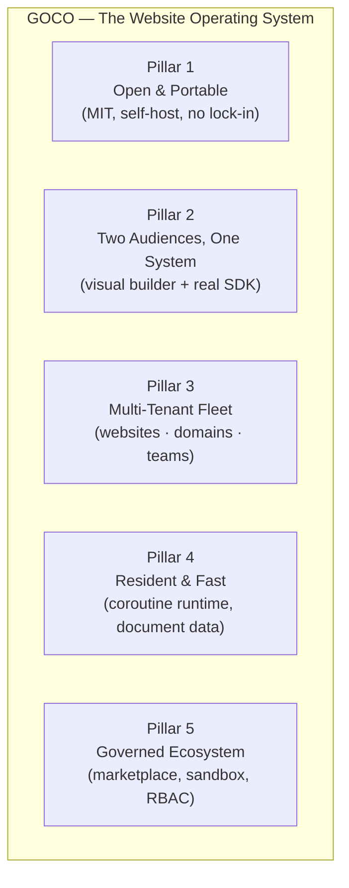

# Product Requirements Document (PRD)

> The authoritative product-level definition of GOCO CMS — the problems it solves, who it serves, what we build, in what order, and how we measure success.

**Document status:** `beta` · Living document · Pre-1.0
**Owners:** Product & Architecture Council
**Audience:** Founders, maintainers, contributors, design partners, and downstream implementers

This PRD describes the *what* and the *why* of GOCO CMS — "The Open Source Website Operating System." It deliberately avoids implementation detail; for the *how*, follow the cross-links into the [Architecture](../architecture/overview.md) and [Core](../core/routing.md) sections. Requirements traceability into engineering specification lives in the [SRS](srs.md); the bounded contexts and ubiquitous language live in the [Domain Model](domain-model.md).

---

## 1. Problem Statement

Building and operating a modern website is fragmented, expensive, and brittle. The teams who need websites — agencies, product companies, SaaS platforms, and independent builders — are forced to choose between three unsatisfying options:

1. **Legacy CMS platforms** (WordPress-class) are approachable and have huge ecosystems, but they carry two decades of architectural debt: synchronous PHP behind a per-request bootstrap, a plugin culture that trades security for convenience, weak multi-tenancy, and relational schemas that resist the document-shaped content real websites produce. Performance and security become the operator's full-time job.

2. **Headless / API-first CMS** (contentful-class) deliver clean content APIs but externalize the hardest 80% of the problem — presentation, page composition, theming, routing, media, SEO — onto a bespoke front-end the customer must build and maintain forever. There is no "website" out of the box, only content.

3. **Proprietary website builders** (Webflow / Wix / Squarespace-class) give non-technical users a delightful visual canvas, but lock content, data, and extensibility behind a closed platform. You cannot self-host, you cannot own your data model, you cannot ship first-class custom code, and you pay per-seat, per-site, forever.

Nobody offers the combination that modern teams actually want: **an open-source, self-hostable, high-concurrency runtime that ships a visual website builder AND a real developer platform AND native multi-tenancy AND a document-first data model — as one coherent system.**

The market has "content management systems" and it has "website builders." It does not have a **Website Operating System**: a lightweight core that boots once and stays resident, surrounded by a governed ecosystem of widgets, themes, and plugins, that treats websites, tenants, custom data collections, and domains as first-class, multi-tenant primitives.

GOCO CMS exists to close that gap.

---

## 2. Vision & Goals

**Vision.** GOCO becomes the default open foundation on which agencies and product teams build, operate, and scale many websites at once — the way an operating system lets many applications share one well-run machine. A single GOCO deployment runs hundreds of tenant websites, each with its own theme, domain, data, and permissions, on a resident, coroutine-driven runtime.

**Positioning statement.** *For technical teams and agencies who run many websites, GOCO CMS is an open-source Website Operating System that unifies a visual page builder, a document database, and a governed extension ecosystem on a high-concurrency runtime — unlike legacy CMS (slow, insecure, single-tenant), headless CMS (no front-end), or proprietary builders (closed, non-portable).*

### Product Goals

| # | Goal | Why it matters |
|---|------|----------------|
| G1 | **Open by default** — MIT-licensed, self-hostable, no feature held hostage behind a proprietary edition. | Trust, portability, and community leverage. |
| G2 | **One system, two audiences** — a visual builder non-developers love *and* a real SDK developers respect. | Neither audience should feel bolted on. See [Page Builder](../core/page-builder.md) and [Widget SDK](../sdk/widget-sdk.md). |
| G3 | **Multi-tenant to the core** — many websites, domains, and teams on one deployment with hard isolation. | The economic unit is the fleet, not the single site. See [Multi-Tenancy](../architecture/multi-tenancy.md). |
| G4 | **Fast and resident by design** — built on a coroutine runtime that boots once, not per request. | Concurrency and latency are platform properties, not tuning chores. See [ZealPHP Foundation](../architecture/zealphp-foundation.md). |
| G5 | **Document-first data** — content and custom collections model naturally, with validation, versioning, and audit built in. | The data model should fit the domain, not the other way around. See [Data Model](../architecture/data-model.md). |
| G6 | **Governed extensibility** — a marketplace and SDK where third-party code is sandboxed, permissioned, and reviewable. | Ecosystems die from supply-chain rot; ours must be safe by construction. See [Marketplace](../marketplace/overview.md). |
| G7 | **Operable in production** — Docker-first, auto-HTTPS, backups, scaling, and observability are day-one features. | Adoption follows operability. See [Deployment Guide](../deployment/deployment-guide.md). |

---

## 3. Non-Goals

To keep the product coherent, the following are explicitly **out of scope** for GOCO as a product (some may be satisfiable via plugins, but the core will not own them):

- **Not a general-purpose application framework.** GOCO is a Website Operating System; developers extend it through the [Plugin SDK](../sdk/plugin-sdk.md), not by forking the runtime. Arbitrary non-website workloads belong elsewhere.
- **Not a hosted SaaS in v1.** GOCO ships as self-hostable open source. A managed cloud offering may follow commercially, but the product's success is not defined by it and no feature is withheld to force it.
- **Not a relational ORM / SQL platform.** The data layer is a document-mapper over MongoDB (see [MongoDB Data Layer](../architecture/database-mongodb.md)). We will not ship a relational schema builder; SQL appears only in migration/comparison contexts.
- **Not a replacement for a CDN, WAF, or load balancer.** GOCO integrates with [Traefik](../deployment/traefik.md) and standard edge infrastructure; it does not reimplement them.
- **Not an e-commerce, LMS, or CRM in core.** These are marketplace verticals built on the [Database Builder](../core/database-builder.md), [Forms](../architecture/overview.md), and plugin ecosystem — not core modules.
- **Not a design tool** (Figma-class). The [Page Builder](../core/page-builder.md) composes and themes existing widgets and layouts; it is not a freeform vector canvas.
- **No lock-in formats.** Every export (content, theme, data) must be portable. We will not introduce opaque proprietary bundle formats.

---

## 4. Target Personas

Each persona is described with its **Jobs To Be Done (JTBD)** — the progress the persona is trying to make — and the GOCO surfaces that serve it.

### 4.1 Priya — Agency Technical Lead (primary)
Runs delivery for a 20-person digital agency managing ~80 client websites.
- **JTBD:** "When a new client signs, I want to spin up an isolated, branded, custom-domain website in minutes and hand editing to the client, so my team can move to the next project instead of babysitting infrastructure."
- **Cares about:** multi-tenancy, per-tenant themes/domains, RBAC handoff, repeatable provisioning, upgrade safety across the fleet.
- **Serving surfaces:** [Multi-Tenancy](../architecture/multi-tenancy.md), [Traefik](../deployment/traefik.md), [Permission System](../architecture/permission-system.md), [CLI](../reference/cli-reference.md).

### 4.2 Dev — Platform / Plugin Developer (primary)
Builds custom widgets, integrations, and data-driven features on top of GOCO.
- **JTBD:** "When a client needs behavior GOCO doesn't ship, I want a stable, documented SDK and generators so I can build a sandboxed, permissioned extension — and optionally publish it — without patching core."
- **Cares about:** SDK stability, hook coverage, local DX, testing, marketplace distribution, security review.
- **Serving surfaces:** [Widget SDK](../sdk/widget-sdk.md), [Plugin SDK](../sdk/plugin-sdk.md), [Hook SDK](../sdk/hook-sdk.md), [CLI SDK](../sdk/cli.md), [Event & Hook System](../architecture/event-hook-system.md).

### 4.3 Maya — Marketing / Content Editor (primary)
Owns the content and campaigns for one or more client websites; not a coder.
- **JTBD:** "When a campaign launches, I want to build and edit pages visually, publish posts, run forms, and see what's working — without filing a ticket to engineering."
- **Cares about:** visual editing, revisions, scheduling, SEO guidance, analytics, forms.
- **Serving surfaces:** [Page Builder](../core/page-builder.md), [Blog Engine](../core/blog-engine.md), [AI Platform](../core/ai-platform.md), Analytics, [SEO](../architecture/overview.md).

### 4.4 Sam — Owner / Operator (secondary)
The self-hoster or platform owner responsible for the deployment as a whole.
- **JTBD:** "When I run GOCO for my organization, I want it secure, backed up, observable, and cheap to scale, so uptime and data safety are never in question."
- **Cares about:** Docker operability, auto-HTTPS, backups, scaling, audit logs, cost.
- **Serving surfaces:** [Docker Architecture](../deployment/docker.md), [Backup & Restore](../deployment/backup-restore.md), [Scaling Strategy](../deployment/scaling.md), [Security Model](../security/security-model.md).

### 4.5 Theme Designer (secondary)
Produces sellable themes and templates.
- **JTBD:** "When I design a look, I want to package layouts, regions, and asset bundles as a portable theme others can install and customize."
- **Serving surfaces:** [Theme SDK](../sdk/theme-sdk.md), [Theme Engine](../core/theme-engine.md), [Template Engine](../core/template-engine.md).

---

## 5. Product Pillars

Everything GOCO ships must reinforce one of five pillars. Features that serve none are candidates for cutting.

| Pillar | Promise | Proof surfaces |
|--------|---------|----------------|
| **P1 — Open & Portable** | You own the code, the data, and the exit. | MIT license, self-host, portable exports, [Comparison](../introduction/comparison.md) |
| **P2 — Two Audiences, One System** | Editors get a canvas; developers get an SDK; both act on the same objects. | [Page Builder](../core/page-builder.md), SDK suite |
| **P3 — Multi-Tenant Fleet** | One deployment, many isolated websites and domains. | [Multi-Tenancy](../architecture/multi-tenancy.md), [Traefik](../deployment/traefik.md) |
| **P4 — Resident & Fast** | Boot once; serve concurrently; model content as documents. | [ZealPHP Foundation](../architecture/zealphp-foundation.md), [Caching & Queue](../architecture/caching-and-queue.md) |
| **P5 — Governed Ecosystem** | Extensions are permissioned, reviewed, and safe. | [Marketplace](../marketplace/overview.md), [Permission System](../architecture/permission-system.md) |

---

## 6. Feature Epics

Each epic states the **user value**, a short **scope**, and **acceptance-level** criteria (product-level "done," not implementation detail). Phase mapping is summarized in [§7](#7-mvp-scope-vs-phases) and detailed in the [Roadmap](../roadmap.md).

### E1 — Visual Page Builder
**Value:** Editors compose pages visually against the canonical hierarchy *Layout → Section → Container → Row → Column → Widget*, with no code.
**Scope:** Drag-and-drop canvas, live preview, responsive breakpoints, widget property panels, revision history, draft/scheduled/published states.
**Acceptance:**
- An editor can build, preview, and publish a multi-section page without writing code.
- Every change produces a revision; any prior revision can be restored.
- Publishing respects role capability `pages.publish`; scheduling honors a future publish time.
- The built page is rendered by the same [Rendering Pipeline](../architecture/rendering-pipeline.md) that serves production traffic (WYSIWYG parity).
- Details: [Page Builder](../core/page-builder.md).

### E2 — Widget Engine
**Value:** The atomic unit of composition; a governed catalog of reusable UI blocks.
**Scope:** Widget registration, typed property schemas, server-rendered output, preview rendering, before/after render hooks.
**Acceptance:**
- A widget declares a property schema that drives an auto-generated editor panel.
- Widgets render deterministically server-side and expose a preview mode.
- Third parties register widgets through the [Widget SDK](../sdk/widget-sdk.md) without core changes.
- Render is observable via `widget.render.before/after` and filterable via `widget.output`.
- Details: [Widget Engine](../core/widget-engine.md).

### E3 — Theme & Template System
**Value:** A website's look is a portable, installable package; templates control document structure.
**Scope:** Theme manifests, layouts, named regions, asset bundles; template resolution and inheritance.
**Acceptance:**
- A theme is installed/activated per website; switching themes re-maps regions without content loss.
- Layouts declare regions that the Page Builder and menus target.
- Asset bundles are versioned and cache-busted.
- Details: [Theme Engine](../core/theme-engine.md), [Template Engine](../core/template-engine.md), [Theme SDK](../sdk/theme-sdk.md).

### E4 — Plugin Ecosystem + Marketplace
**Value:** Extend GOCO safely; discover and install trusted extensions.
**Scope:** Plugin lifecycle (register/install/boot), plugin-scoped routes/permissions/hooks; marketplace listing, versioning, install/update, review & signing.
**Acceptance:**
- A plugin declares required capabilities; installation prompts an operator to grant them.
- Plugins register namespaced hooks and routes without touching core files.
- Marketplace items carry semantic versions, changelogs, and a review status; install/rollback is one action.
- Details: [Plugin Engine](../core/plugin-engine.md), [Plugin SDK](../sdk/plugin-sdk.md), [Marketplace](../marketplace/overview.md).

### E5 — Blog Engine
**Value:** First-class publishing: posts, taxonomies, revisions, comments, feeds.
**Scope:** Posts with revisions, categories/tags via taxonomies, author roles, scheduling, comments/moderation, RSS/Atom, SEO fields.
**Acceptance:**
- Authors draft, schedule, and publish posts subject to `posts.*` capabilities.
- Posts support categories, tags, and per-post SEO metadata.
- Comments can be moderated by the `moderator` role.
- Details: [Blog Engine](../core/blog-engine.md).

### E6 — Database / Collection Builder (auto REST + GraphQL)
**Value:** Non-developers define custom content types; developers get instant APIs.
**Scope:** Visual collection/field designer backed by MongoDB collections with JSON-Schema validation; automatic REST endpoints and a GraphQL schema; relationships, validation, versioning, soft-delete.
**Acceptance:**
- Defining a collection with fields immediately yields validated documents and CRUD APIs.
- REST endpoints are generated per collection; a GraphQL schema exposes the same types with pagination and filtering.
- Field-level and role-level access control apply to generated APIs (see [API Reference](../reference/api-reference.md)).
- Details: [Database Builder](../core/database-builder.md).

### E7 — AI Platform
**Value:** Content and workflow assistance embedded where work happens.
**Scope:** Assisted content generation/editing, SEO suggestions, alt-text/media tagging, provider-agnostic model interface, per-workspace quotas and `ai.manage` capability.
**Acceptance:**
- Editors invoke assistance inline in the Page Builder and Blog Engine.
- AI usage is gated by capability and metered per workspace.
- The provider is swappable and configurable; no provider is hard-coded as mandatory.
- Details: [AI Platform](../core/ai-platform.md).

### E8 — Multi-Tenancy & Custom Domains
**Value:** Operate many isolated websites and domains from one deployment.
**Scope:** Workspace → Website hierarchy, tenant-scoped data (`workspace_id` + `website_id`), custom-domain mapping with automatic HTTPS, optional database-per-workspace for enterprise.
**Acceptance:**
- Data reads/writes are always tenant-scoped; cross-tenant access is impossible by default.
- Mapping a custom domain provisions a TLS certificate automatically via Traefik/Let's Encrypt.
- An operator can provision a new tenant website end-to-end from the CLI or admin.
- Details: [Multi-Tenancy](../architecture/multi-tenancy.md), [Traefik](../deployment/traefik.md).

### E9 — RBAC (Roles, Capabilities, Policies)
**Value:** Safe delegation across teams and tenants.
**Scope:** Hierarchical roles, `resource.action` capabilities, optional attribute-based policies, scoping per (workspace, website).
**Acceptance:**
- Every privileged action checks a capability scoped to the active tenant.
- Roles are assignable per website; a user may hold different roles in different tenants.
- An optional policy engine can express attribute conditions (e.g., ownership) on top of RBAC.
- Details: [Permission System](../architecture/permission-system.md), [Security Model](../security/security-model.md).

### E10 — Media
**Value:** Reliable, pluggable asset storage and delivery.
**Scope:** Upload pipeline, image transforms/derivatives, a driver interface (Local, MinIO, S3), soft-deletable media documents, per-tenant scoping.
**Acceptance:**
- Uploads produce a media document plus derivatives; storage backend is configurable without code changes.
- Media respects `media.*` capabilities and tenant scoping.
- Details: [Storage & Media](../architecture/storage.md).

### E11 — Search
**Value:** Fast, relevant discovery of content across a website.
**Scope:** Provider interface (MongoDB text/Atlas Search, Meilisearch, OpenSearch), index lifecycle, tenant-scoped queries.
**Acceptance:**
- Content is indexed on publish and queryable with ranked results, scoped to the tenant.
- The search provider is swappable via configuration.
- Details: [Search](../architecture/search.md).

### E12 — Analytics
**Value:** Editors and operators see what content performs.
**Scope:** First-party, privacy-respecting page/post metrics, form conversions, per-website dashboards.
**Acceptance:**
- Each website exposes traffic and engagement metrics without third-party trackers required.
- Metrics are tenant-scoped and role-gated.
- Details: [Architecture Overview](../architecture/overview.md).

---

## 7. MVP Scope vs Phases

Phases map to the [Roadmap](../roadmap.md). The rule: **the MVP must let one operator run one deployment with multiple tenant websites, edited visually, extended by developers, deployed securely.** Anything not required to prove that loop is deferred.

| Epic | Phase 0 — Foundation | Phase 1 — MVP | Phase 2 — Platform | Phase 3 — Ecosystem |
|------|:---:|:---:|:---:|:---:|
| Runtime, routing, data layer, auth ([core](../architecture/overview.md)) | ● | | | |
| E1 Visual Page Builder | | ● | ◐ (advanced blocks) | |
| E2 Widget Engine | ◐ | ● | | |
| E3 Theme & Template | ◐ | ● | | ◐ (theme market) |
| E8 Multi-Tenancy & Domains | ◐ | ● | ◐ (db-per-workspace) | |
| E9 RBAC | ◐ | ● | ◐ (ABAC policies) | |
| E10 Media | | ● | ◐ (S3/MinIO) | |
| E5 Blog Engine | | ● | | |
| E4 Plugin Engine | | ◐ (local) | ● | |
| E4 Marketplace | | | ◐ | ● |
| E6 Database/Collection Builder | | | ● | ◐ (GraphQL) |
| E11 Search | | ◐ (Mongo text) | ● (providers) | |
| E7 AI Platform | | | ● | ◐ |
| E12 Analytics | | | ◐ | ● |

Legend: ● primary deliverable · ◐ partial / incremental.

**MVP definition of done (Phase 1 exit):**
- A fresh Docker deployment brings up gococms + mongodb + redis + traefik with auto-HTTPS.
- An operator creates a workspace and a website, maps a custom domain, and assigns an editor.
- The editor builds and publishes a themed page visually and publishes a blog post.
- A developer registers a custom widget via the SDK and it appears in the builder.
- All actions are RBAC-gated, tenant-scoped, versioned, and audit-logged.

---

## 8. Success Metrics & KPIs

Metrics are grouped by the outcome they prove. Targets are directional for the pre-1.0 window and will be re-baselined at 1.0.

### Adoption & Community
| KPI | Target (12 mo post-MVP) |
|-----|-------------------------|
| GitHub stars / active watchers | Sustained upward trend; >5k stars |
| Self-hosted deployments (opt-in telemetry) | >2,000 active deployments |
| External contributors merged | >100 unique |
| Published marketplace extensions | >150 (widgets/themes/plugins) |

### Product Efficacy (activation & retention)
| KPI | Target |
|-----|--------|
| Time-to-first-published-page (new install → live page) | < 30 minutes (P50) |
| Time-to-provision a new tenant website | < 5 minutes (P50) |
| Editor tasks completed without engineering ticket | > 90% |
| 30-day deployment retention | > 60% |

### Developer Experience
| KPI | Target |
|-----|--------|
| Time to scaffold + run a custom widget locally | < 15 minutes |
| SDK breaking changes per minor release (post-1.0) | 0 (SemVer discipline) |
| Marketplace submission → review decision | < 5 business days |

### Operability & Trust
| KPI | Target |
|-----|--------|
| Critical security advisories with fix > 7 days open | 0 |
| Documented backup/restore success in drills | 100% |
| Fleet upgrade with zero tenant data loss | 100% |

> **Note**
> Telemetry is opt-in and privacy-respecting, consistent with Pillar P1. KPIs that depend on telemetry degrade gracefully when operators decline it, and no feature is withheld to coerce data sharing.

---

## 9. Constraints & Assumptions

### Technical constraints (non-negotiable)
- **Runtime:** ZealPHP on OpenSwoole 22.1+, PHP 8.4+. The product assumes a *resident, coroutine* execution model, not a per-request CGI model. See [ZealPHP Foundation](../architecture/zealphp-foundation.md).
- **Primary datastore:** MongoDB. The product's content, custom collections, versioning, soft-delete, and audit design assume a document database. See [MongoDB Data Layer](../architecture/database-mongodb.md).
- **State & realtime:** Redis for cache, queue, sessions, locks, rate-limit, pub/sub. See [Caching & Queue](../architecture/caching-and-queue.md).
- **Edge:** Traefik as the reverse proxy providing auto-HTTPS, HTTP/3, and per-tenant routing. GOCO does not embed its own TLS termination for production. See [Traefik](../deployment/traefik.md).
- **Distribution:** Docker-first. Compose service names and healthchecks are part of the product contract. See [Docker Architecture](../deployment/docker.md).
- **Versioning discipline:** Semantic Versioning + Conventional Commits; the SDK is a stability boundary. See [Coding Standards](../community/coding-standards.md).

### Assumptions
- Operators can run Docker and manage DNS for custom domains.
- The primary economic unit is the *fleet of websites*, so multi-tenancy is worth its complexity from day one.
- A visual builder and a code SDK acting on the same objects is a differentiator worth the design cost.
- An open MIT core with a governed marketplace can sustain a healthy ecosystem (see [Governance](../community/governance.md)).
- Editors will accept AI assistance as opt-in augmentation, not automation of their judgment.

---

## 10. Risks & Mitigations

| # | Risk | Impact | Likelihood | Mitigation |
|---|------|:------:|:----------:|------------|
| R1 | **Runtime maturity** — ZealPHP/OpenSwoole is younger than legacy PHP stacks; resident-process bugs (leaks, coroutine state) are subtle. | High | Med | Invest early in [Testing Strategy](../community/testing-strategy.md); strict per-coroutine state isolation; load/soak tests in CI; document the resident model for contributors. |
| R2 | **Plugin supply-chain rot** — untrusted marketplace code becomes an attack vector, repeating legacy-CMS failures. | High | Med | Capability-scoped permissions, review + signing pipeline, sandboxed lifecycle; see [Security Model](../security/security-model.md) and [Marketplace](../marketplace/overview.md). |
| R3 | **Two-audience tension** — trying to please editors and developers yields a product that half-serves both. | High | Med | Single object model under both surfaces; persona-driven acceptance criteria (§6); design partners from each persona. |
| R4 | **Multi-tenant isolation failure** — a cross-tenant data leak is existential for trust. | Critical | Low | Tenant scoping enforced in the data layer, not per-feature; default-deny; audit logs; isolation tests; optional db-per-workspace. See [Multi-Tenancy](../architecture/multi-tenancy.md). |
| R5 | **Ecosystem cold-start** — a builder platform is only as good as its widgets/themes/plugins. | High | High | First-party widget/theme library at MVP; excellent [SDK](../sdk/widget-sdk.md) DX and generators; seed the [Marketplace](../marketplace/overview.md) with maintained extensions. |
| R6 | **Scope creep into verticals** (commerce, LMS) diluting the core. | Med | Med | Enforce Non-Goals (§3); push verticals to plugins on the [Database Builder](../core/database-builder.md). |
| R7 | **Operational burden of self-hosting** deters adoption. | Med | Med | Docker-first with sane defaults, healthchecks, backups, and one-command bring-up; see [Deployment Guide](../deployment/deployment-guide.md) and [Backup & Restore](../deployment/backup-restore.md). |
| R8 | **SemVer/SDK stability slips pre-1.0**, breaking early extension authors. | Med | Med | Clearly tag stability (`beta`/`experimental`); communicate breaking changes; converge the SDK boundary before 1.0. |
| R9 | **AI provider dependency / cost volatility.** | Med | Med | Provider-agnostic interface, per-workspace quotas, AI features opt-in and non-blocking. See [AI Platform](../core/ai-platform.md). |

> **Warning**
> R1 and R4 are the two risks that can independently sink the product. Every phase gate in the [Roadmap](../roadmap.md) must re-verify resident-runtime stability and tenant-isolation guarantees before advancing.

---

## Related

- [Software Requirements Specification (SRS)](srs.md) — engineering-level requirements and traceability
- [Domain Model (DDD)](domain-model.md) — bounded contexts and ubiquitous language
- [Roadmap](../roadmap.md) — phase plan and release milestones
- [Overview](../introduction/overview.md) · [Philosophy & Design Principles](../introduction/philosophy.md) · [Comparison](../introduction/comparison.md)
- [Architecture Overview](../architecture/overview.md) · [Multi-Tenancy](../architecture/multi-tenancy.md) · [Permission System](../architecture/permission-system.md)
- [Page Builder](../core/page-builder.md) · [Widget Engine](../core/widget-engine.md) · [Plugin Engine](../core/plugin-engine.md) · [Database Builder](../core/database-builder.md) · [AI Platform](../core/ai-platform.md)
- [Marketplace](../marketplace/overview.md) · [Security Model](../security/security-model.md) · [Governance](../community/governance.md)
- [Documentation Home](../README.md)
