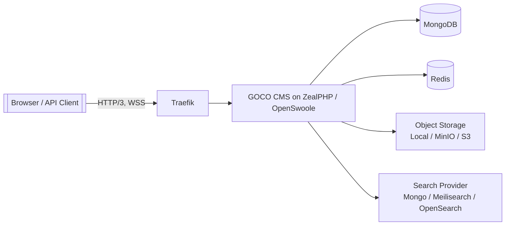

# Software Requirements Specification (SRS)

> IEEE-style requirements specification for GOCO CMS — "The Open Source Website Operating System" — defining the numbered, testable functional and non-functional requirements that govern the platform.

- **Document ID:** GOCO-SRS
- **Status:** `beta` (pre-1.0, tracks active development under Semantic Versioning)
- **License:** MIT
- **Audience:** Architects, engineers, QA, and contributors implementing or verifying GOCO CMS.

This SRS follows the intent of IEEE 830 / ISO/IEC/IEEE 29148. Requirements are numbered by module and written as single, testable statements. Each requirement is atomic enough to map to one or more acceptance tests (see [§10 Acceptance Criteria Approach](#10-acceptance-criteria-approach)). It complements — and never contradicts — the [Product Requirements Document](prd.md) and the [Domain Model](domain-model.md).

---

## 1. Introduction

### 1.1 Purpose

This document specifies the software requirements for GOCO CMS, a lightweight core surrounded by an ecosystem of widgets, themes, and plugins — a "Website Operating System." It is the authoritative source for **what** the system must do (functional requirements) and **how well** it must do it (non-functional requirements). It does not prescribe implementation beyond the [canonical stack](../architecture/overview.md).

The PRD answers *why* and *for whom*; this SRS answers *what*, testably. Where the two overlap, the PRD sets product intent and the SRS sets verifiable acceptance conditions.

### 1.2 Scope

GOCO CMS delivers:

- A visual **Page Builder** over the hierarchy Workspace → Website → Theme → Layout → Section → Container → Row → Column → Widget.
- A **Widget / Theme / Plugin** extensibility model exposed through the `Goco\SDK` facades.
- A **Blog Engine**, **Database Builder** (dynamic collections), and an **AI Platform**.
- **Multi-tenant** hosting (workspace/website isolation) with **RBAC + optional ABAC**.
- First-class **REST, file-based REST, WebSocket, and SSE** interfaces (with an optional, *experimental* **GraphQL** layer) plus the `goco` CLI.

Out of scope for this SRS: marketplace commerce policy (see [Marketplace Overview](../marketplace/overview.md)), governance process (see [Governance](../community/governance.md)), and deployment runbooks (see [Deployment Guide](../deployment/deployment-guide.md)).

### 1.3 Definitions, Acronyms, Abbreviations

Canonical terminology lives in the [Glossary](../glossary.md). Frequently used terms in this document:

| Term | Meaning |
| --- | --- |
| **WOS** | Website Operating System — GOCO's architectural model: minimal core + ecosystem. |
| **Tenant** | A `(workspace_id, website_id)` scope on tenant-scoped documents. |
| **Widget** | A registered, renderable UI unit (`Goco\SDK\Widget`). |
| **Hook** | An action or filter extension point (`Goco\SDK\Hook`). |
| **RBAC / ABAC** | Role-Based / Attribute-Based Access Control. |
| **Coroutine** | An OpenSwoole green thread; ZealPHP's default concurrency unit. |
| **FR / NFR** | Functional / Non-Functional Requirement. |
| **SC** | Success Criterion (WCAG 2.2). |

Requirement keywords **MUST**, **MUST NOT**, **SHOULD**, and **MAY** are used per RFC 2119.

### 1.4 References

- [Overview](../introduction/overview.md), [Philosophy](../introduction/philosophy.md), [Comparison](../introduction/comparison.md)
- [Architecture Overview](../architecture/overview.md), [ZealPHP Foundation](../architecture/zealphp-foundation.md), [Request Lifecycle](../architecture/request-lifecycle.md)
- [Data Model](../architecture/data-model.md), [Permission System](../architecture/permission-system.md), [Multi-Tenancy](../architecture/multi-tenancy.md)
- [Security Model](../security/security-model.md), [Testing Strategy](../community/testing-strategy.md)
- ZealPHP runtime: <https://github.com/sibidharan/zealphp>

---

## 2. Overall Description

### 2.1 Product Perspective

GOCO CMS runs on the **ZealPHP** framework atop **OpenSwoole 22.1+** and **PHP 8.4+**. It is a persistent, coroutine-based application server — not a per-request CGI process. **MongoDB** is the system of record; **Redis** provides cache, queue, realtime pub/sub, locks, rate limiting, and sessions. **Traefik** is the reverse proxy (auto HTTPS, HTTP/3, per-tenant routing). Object storage and search are pluggable via driver interfaces (Local/MinIO/S3; MongoDB text / Meilisearch / OpenSearch).



### 2.2 Product Functions (Summary)

Authenticate users and API clients; author pages and posts visually; register and render widgets, themes, and plugins; model dynamic collections; run AI-assisted content workflows; enforce per-tenant RBAC/ABAC; and expose typed programmatic interfaces. Each function is elaborated as numbered requirements in [§3](#3-functional-requirements).

### 2.3 User Classes and Characteristics

Roles are hierarchical: `owner`, `super-admin`, `website-admin`, `developer`, `designer`, `editor`, `author`, `seo-manager`, `marketing`, `moderator`, `support`, `viewer`, `guest`. Capabilities are `resource.action` strings scoped per `(workspace, website)`. See [Permission System](../architecture/permission-system.md).

### 2.4 Operating Environment

Docker-first. Compose services: `gococms`, `mongodb`, `redis`, `traefik`, `minio`, `meilisearch`, `mailpit`, and optional `watchtower`. Each service defines a healthcheck, restart policy, environment, and graceful shutdown.

### 2.5 Constraints

- The runtime **MUST** target the canonical stack; primary proxy/DB/framework substitutions (Nginx, MySQL, Laravel, etc.) are out of scope except in explicit comparison/migration contexts.
- Persistent-process semantics apply: handlers **MUST NOT** rely on request-scoped global mutation across coroutines; per-request state uses `\ZealPHP\G` / `RequestContext`.

### 2.6 Assumptions and Dependencies

MongoDB is deployed as a replica set (transactions require it); Redis is reachable and persistent enough for queue durability guarantees; Traefik terminates TLS. Failure of these dependencies is addressed under availability requirements ([§4.3](#43-availability--high-availability)).

---

## 3. Functional Requirements

Each requirement below is a single testable statement. IDs are stable across revisions; deprecated IDs are retired, never reassigned.

### 3.1 Authentication & Authorization (FR-AUTH)

| ID | Requirement (testable) | Priority |
| --- | --- | --- |
| **FR-AUTH-1** | The system **MUST** authenticate interactive users with email + password, hashing passwords with **Argon2id**; a login with a correct password succeeds and an incorrect password fails without revealing which factor was wrong. | Must |
| **FR-AUTH-2** | The system **MUST** persist interactive sessions in **Redis** with a configurable idle and absolute TTL; a session **MUST** be invalid after its TTL elapses. | Must |
| **FR-AUTH-3** | The system **MUST** issue and validate **JWT** access tokens for API clients, rejecting tokens with an invalid signature, expired `exp`, or revoked `jti`. | Must |
| **FR-AUTH-4** | The system **MUST** support **OAuth2** authorization-code login with at least one external provider, creating or linking a local user on first successful callback. | Should |
| **FR-AUTH-5** | The system **MUST** support **TOTP 2FA**; when enabled for an account, login **MUST** require a valid time-based code within the accepted skew window. | Must |
| **FR-AUTH-6** | The system **MUST** support **Passkeys (WebAuthn)** registration and assertion; a registered passkey **MUST** authenticate without a password. | Should |
| **FR-AUTH-7** | The system **MUST** enforce **CSRF** protection on state-changing browser requests via the ZealPHP `Csrf` middleware; a missing or invalid token **MUST** yield HTTP 403. | Must |
| **FR-AUTH-8** | The system **MUST** evaluate access with **RBAC** (role → capabilities) and **MAY** additionally apply an **ABAC** `PolicyEngine`; a subject lacking the required `resource.action` capability **MUST** be denied. | Must |
| **FR-AUTH-9** | Every authorization decision **MUST** be scoped to a `(workspace, website)`; a capability granted in one website **MUST NOT** authorize an action in another. | Must |
| **FR-AUTH-10** | The system **MUST** record authentication and authorization-relevant events (`user.login`, denials, 2FA changes) to the `audit_logs` collection with actor, timestamp, and outcome. | Must |

See [Authentication](../core/authentication.md) and [Security Model](../security/security-model.md).

### 3.2 Page Builder / Visual Editor (FR-BUILDER)

| ID | Requirement (testable) | Priority |
| --- | --- | --- |
| **FR-BUILDER-1** | The builder **MUST** let an authorized user compose a page following the hierarchy Layout → Section → Container → Row → Column → Widget; a saved page **MUST** round-trip its tree without structural loss. | Must |
| **FR-BUILDER-2** | The builder **MUST** support drag-and-drop insertion, reordering, and nesting of nodes with server-side validation of legal parent/child relationships. | Must |
| **FR-BUILDER-3** | Saving a page **MUST** create an immutable entry in `page_revisions`, enabling restore of any prior version. | Must |
| **FR-BUILDER-4** | The builder **MUST** provide a live preview that renders the page through the same [Rendering Pipeline](../architecture/rendering-pipeline.md) used for publishing. | Must |
| **FR-BUILDER-5** | The builder **MUST** support responsive per-breakpoint properties (columns, visibility, spacing) that are honored in the rendered output. | Should |
| **FR-BUILDER-6** | Concurrent edits to the same page **MUST** be arbitrated by a Redis lock; a second editor **MUST** be warned rather than silently overwriting. | Should |
| **FR-BUILDER-7** | Publishing a page **MUST** dispatch `content.publishing` before and `content.published` after the state transition, and set the page status atomically. | Must |
| **FR-BUILDER-8** | The builder **MUST** allow saving reusable node subtrees as `templates` that can be inserted into other pages. | Should |

See [Page Builder](../core/page-builder.md).

### 3.3 Widget Engine & SDK (FR-WIDGET)

| ID | Requirement (testable) | Priority |
| --- | --- | --- |
| **FR-WIDGET-1** | The system **MUST** register a widget via `Widget::register(string $type, array\|callable $definition): void`; a duplicate `$type` **MUST** fail deterministically. | Must |
| **FR-WIDGET-2** | The system **MUST** render a widget via `Widget::render(string $type, array $props, ?Context $ctx=null): string`, returning HTML validated against the widget's property schema. | Must |
| **FR-WIDGET-3** | `Widget::properties(string $type): PropertySchema` **MUST** return the typed schema used to drive the builder's inspector; invalid props **MUST** be rejected before render. | Must |
| **FR-WIDGET-4** | `Widget::preview(string $type, array $props=[]): string` **MUST** produce a representative preview using default props when props are omitted. | Should |
| **FR-WIDGET-5** | Widget rendering **MUST** fire `widget.render.before` and `widget.render.after` actions and pass output through the `widget.output` filter. | Must |
| **FR-WIDGET-6** | A widget render error **MUST** be isolated: it **MUST NOT** crash the page render, and **MUST** emit a bounded error placeholder plus an audit/log entry. | Must |
| **FR-WIDGET-7** | Widgets **MUST** declare asset dependencies (CSS/JS) that the pipeline deduplicates and injects once per page. | Should |

See [Widget Engine](../core/widget-engine.md) and [Widget SDK](../sdk/widget-sdk.md).

### 3.4 Content Management (FR-CONTENT)

| ID | Requirement (testable) | Priority |
| --- | --- | --- |
| **FR-CONTENT-1** | The system **MUST** support CRUD for `pages` and `posts` with `draft`, `scheduled`, `published`, and `archived` states; state transitions **MUST** be validated. | Must |
| **FR-CONTENT-2** | Every content mutation **MUST** write a revision (`page_revisions` / `post_revisions`) and update `version`, `updated_at`, and `updated_by`. | Must |
| **FR-CONTENT-3** | The system **MUST** support taxonomies and terms (`taxonomies`, `terms`, `term_relationships`) with many-to-many assignment to content. | Must |
| **FR-CONTENT-4** | The Blog Engine **MUST** support scheduled publishing; a `scheduled` post **MUST** transition to `published` at or after its scheduled time via a worker tick. | Must |
| **FR-CONTENT-5** | The system **MUST** implement **soft delete**: deleting content sets `deleted_at` and excludes it from default queries while retaining it for restore. | Must |
| **FR-CONTENT-6** | The system **MUST** support comments and moderation (`comments`) gated by `moderator` capabilities. | Should |
| **FR-CONTENT-7** | The system **MUST** manage `redirects` so that a request to a retired path returns the configured 301/302 to its target. | Should |
| **FR-CONTENT-8** | SEO metadata (title, description, canonical, Open Graph) **MUST** be editable per content item and applied by the rendering pipeline; page title **MUST** be filterable via `page.title`. | Must |

See [Blog Engine](../core/blog-engine.md).

### 3.5 Plugin Engine & SDK (FR-PLUGIN)

| ID | Requirement (testable) | Priority |
| --- | --- | --- |
| **FR-PLUGIN-1** | The system **MUST** register a plugin via `Plugin::register(string $slug, array $manifest): void`; the manifest **MUST** declare required capabilities, hooks, and routes. | Must |
| **FR-PLUGIN-2** | `Plugin::install(string $slug): void` **MUST** run install-time migrations idempotently; re-running install **MUST NOT** corrupt state. | Must |
| **FR-PLUGIN-3** | `Plugin::boot(string $slug): void` **MUST** register the plugin's hooks and routes; an inactive plugin's hooks **MUST NOT** fire. | Must |
| **FR-PLUGIN-4** | Plugins **MUST** register routes via `Plugin::routes(callable $registrar)` and declare capabilities via `Plugin::permissions(array $caps)`; plugin hooks **MUST** be namespaced by slug. | Must |
| **FR-PLUGIN-5** | Activation/deactivation **MUST** dispatch `plugin.activated` / deactivation events and be recorded in the `plugins` collection and `audit_logs`. | Must |
| **FR-PLUGIN-6** | A plugin failure during boot **MUST** be contained so that the core and other plugins continue to operate; the failing plugin **MUST** be marked errored. | Must |

See [Plugin Engine](../core/plugin-engine.md) and [Plugin SDK](../sdk/plugin-sdk.md).

### 3.6 Theme Engine & SDK (FR-THEME)

| ID | Requirement (testable) | Priority |
| --- | --- | --- |
| **FR-THEME-1** | The system **MUST** register a theme via `Theme::register(string $slug, array $manifest): void` declaring layouts, regions, and assets. | Must |
| **FR-THEME-2** | `Theme::layouts(string $slug): array` and `Theme::regions(string $layout): array` **MUST** return the layouts and named regions the builder can target. | Must |
| **FR-THEME-3** | `Theme::assets(string $slug): AssetBundle` **MUST** return the theme's compiled asset bundle for injection into rendered pages. | Must |
| **FR-THEME-4** | Activating a theme for a website **MUST** be reversible and **MUST NOT** destroy content authored under a previous theme. | Must |
| **FR-THEME-5** | A theme **MAY** provide child-theme overrides; overrides **MUST** take precedence over parent assets and templates. | May |

See [Theme Engine](../core/theme-engine.md) and [Theme SDK](../sdk/theme-sdk.md).

### 3.7 Data Layer & Database Builder (FR-DATA)

| ID | Requirement (testable) | Priority |
| --- | --- | --- |
| **FR-DATA-1** | The Database Builder **MUST** let an authorized user define a dynamic collection (`collections`) with a typed field schema enforced by a MongoDB JSON-Schema validator. | Must |
| **FR-DATA-2** | Entries (`collection_entries`) **MUST** be validated against the collection schema on write; a non-conforming document **MUST** be rejected. | Must |
| **FR-DATA-3** | The data layer **MUST** expose a Repository-pattern API (`Goco\Database`) — a lightweight document-mapper, not a heavy ORM — supporting find, paginate, aggregate, and transactional writes. | Must |
| **FR-DATA-4** | Cross-collection invariants (e.g., publishing a page and updating a menu) **MUST** be applied within a multi-document transaction. | Must |
| **FR-DATA-5** | All queries against tenant-scoped collections **MUST** inject `workspace_id` + `website_id` filters and exclude soft-deleted documents by default. | Must |
| **FR-DATA-6** | Query criteria **MUST** be filterable via the `query.criteria` filter to allow plugins to constrain results. | Should |
| **FR-DATA-7** | The Database Builder **MUST** generate REST endpoints for a collection so entries are readable/writable through the API subject to capability checks. | Should |

See [Database Builder](../core/database-builder.md) and [MongoDB Data Layer](../architecture/database-mongodb.md).

### 3.8 AI Platform (FR-AI)

| ID | Requirement (testable) | Priority |
| --- | --- | --- |
| **FR-AI-1** | The AI Platform **MUST** expose a provider-abstracted interface so at least one text-generation provider can be configured without code changes. | Must |
| **FR-AI-2** | AI content actions (generate, summarize, translate, alt-text) **MUST** require the `ai.manage` capability and be scoped per tenant. | Must |
| **FR-AI-3** | AI requests and token usage **MUST** be metered and recorded so per-workspace consumption is reportable. | Should |
| **FR-AI-4** | AI-generated content **MUST** be inserted as an editable draft, never auto-published, and **MUST** be attributable in revision history. | Must |
| **FR-AI-5** | AI provider calls **MUST** run on coroutines with a bounded timeout; a provider timeout **MUST** surface a recoverable error, not hang the worker. | Must |

See [AI Platform](../core/ai-platform.md).

### 3.9 Multi-Tenancy (FR-TENANCY)

| ID | Requirement (testable) | Priority |
| --- | --- | --- |
| **FR-TENANCY-1** | Every tenant-scoped document **MUST** carry `workspace_id` and `website_id`; documents lacking them **MUST NOT** be persisted to tenant collections. | Must |
| **FR-TENANCY-2** | A request **MUST** resolve its tenant from the host/route before any data access, and all subsequent queries **MUST** be constrained to that tenant. | Must |
| **FR-TENANCY-3** | The system **MUST** prevent cross-tenant reads/writes; an attempt to access another tenant's document by `_id` **MUST** return not-found. | Must |
| **FR-TENANCY-4** | The system **MUST** support the default shared-database isolation model and **MAY** support optional database-per-workspace (enterprise); switching models **MUST** preserve data. | Should |
| **FR-TENANCY-5** | Traefik per-tenant routers **MUST** map custom `domains` to the correct website; an unmapped domain **MUST** return a controlled 404/holding response. | Must |

See [Multi-Tenancy](../architecture/multi-tenancy.md).

### 3.10 Programmatic Interfaces (FR-API)

| ID | Requirement (testable) | Priority |
| --- | --- | --- |
| **FR-API-1** | The system **MUST** expose a REST API where handlers return `int\|array\|string\|Generator`, with arrays auto-serialized to JSON. | Must |
| **FR-API-2** | The system **MUST** support **file-based REST**: placing `api/foo/bar.php` **MUST** expose `GET /api/foo/bar` returning JSON. | Must |
| **FR-API-3** | The API **MUST** enforce authentication (JWT/session) and capability checks on every non-public endpoint. | Must |
| **FR-API-4** | The API **MUST** apply rate limiting via the ZealPHP `RateLimit` middleware backed by Redis; exceeding the limit **MUST** return HTTP 429 with a `Retry-After` header. | Must |
| **FR-API-5** | The system **MAY** provide an optional, *experimental* **GraphQL** endpoint for content and collection queries with field-level authorization. | May |
| **FR-API-6** | The system **MUST** provide **WebSocket** endpoints (`$app->ws(...)`) for realtime features (e.g., builder presence, notifications). | Should |
| **FR-API-7** | The system **MUST** provide **SSE** streams (generator + `$response->sse()`) for one-way realtime updates. | Should |
| **FR-API-8** | The `goco` CLI **MUST** cover project lifecycle and code generation (widgets, themes, plugins, collections) and return non-zero exit codes on failure. | Must |
| **FR-API-9** | The REST API **MUST** version its contract and support `response.headers` filtering so extensions can add headers. | Should |

See [Routing](../core/routing.md), [API Reference](../reference/api-reference.md), and [CLI Reference](../reference/cli-reference.md).

---

## 4. Non-Functional Requirements

### 4.1 Performance

Targets are stated against the ZealPHP / OpenSwoole persistent-worker throughput profile: a single node keeps warmed connection pools (MongoDB, Redis) and serves requests on coroutines without per-request bootstrap.

| ID | Requirement (testable) |
| --- | --- |
| **NFR-PERF-1** | A cached, published page **MUST** be served with a p95 server-side latency ≤ **50 ms** and p99 ≤ **120 ms** on the reference node (4 vCPU, MongoDB + Redis co-located or LAN-local). |
| **NFR-PERF-2** | An uncached page render (full pipeline, ≤ 30 widgets) **MUST** complete with p95 ≤ **200 ms**. |
| **NFR-PERF-3** | A reference node **MUST** sustain ≥ **2,000 req/s** on cached content and ≥ **500 req/s** on uncached renders without error-rate exceeding 0.1%. |
| **NFR-PERF-4** | The rendering pipeline **MUST** cache rendered fragments in Redis and serve a warm cache hit without touching MongoDB. |
| **NFR-PERF-5** | No request handler **MUST** block the worker event loop on synchronous I/O; all DB/cache/HTTP calls **MUST** be coroutine-aware. |

> **Note**
> Absolute numbers are engineering targets for the reference topology and are validated by the load-test suite ([Testing Strategy](../community/testing-strategy.md)), not a service-level guarantee for arbitrary hardware.

### 4.2 Scalability

| ID | Requirement (testable) |
| --- | --- |
| **NFR-SCALE-1** | The application tier **MUST** be horizontally scalable behind Traefik; adding a node **MUST NOT** require sticky sessions (session state lives in Redis). |
| **NFR-SCALE-2** | Shared cross-worker state **MUST** use `\ZealPHP\Store` / `\ZealPHP\Counter` (with `Store::BACKEND_REDIS` for cross-node), never process-local statics. |
| **NFR-SCALE-3** | The system **MUST** support ≥ **10,000 websites** and ≥ **1,000 workspaces** in a single logical database without schema change. |
| **NFR-SCALE-4** | Background work **MUST** be dispatched to a Redis-backed queue and processed by workers that scale independently of web workers. |

See [Scaling Strategy](../deployment/scaling.md).

### 4.3 Availability & High Availability

| ID | Requirement (testable) |
| --- | --- |
| **NFR-AVAIL-1** | Every Docker service **MUST** define a healthcheck and a restart policy; an unhealthy container **MUST** be restarted automatically. |
| **NFR-AVAIL-2** | The system **MUST** support zero-downtime rolling deploys behind Traefik (drain + graceful shutdown of OpenSwoole workers). |
| **NFR-AVAIL-3** | With MongoDB deployed as a replica set, a primary failover **MUST** be tolerated by the driver with automatic reconnection and retryable writes. |
| **NFR-AVAIL-4** | A Redis outage **MUST** degrade gracefully: cache misses fall back to source, and queue writes surface a controlled error rather than data loss of committed content. |
| **NFR-AVAIL-5** | The target service availability **MUST** be ≥ **99.9%** monthly for the application tier on the reference HA topology. |

### 4.4 Security

| ID | Requirement (testable) |
| --- | --- |
| **NFR-SEC-1** | All external traffic **MUST** be served over HTTPS (Traefik + Let's Encrypt), with HTTP/3 available and HTTP redirected to HTTPS. |
| **NFR-SEC-2** | Security headers (HSTS, X-Content-Type-Options, Referrer-Policy, CSP baseline) **MUST** be applied via Traefik middleware and/or the `response.headers` filter. |
| **NFR-SEC-3** | Secrets **MUST** be provided via environment/secret store, never committed; the repository **MUST** contain no plaintext credentials. |
| **NFR-SEC-4** | All input crossing a trust boundary **MUST** be validated (JSON-Schema for data, PropertySchema for widgets) and output **MUST** be context-escaped to prevent XSS. |
| **NFR-SEC-5** | The system **MUST** enforce least privilege: default roles grant only the capabilities their function requires, and privilege escalation attempts **MUST** be denied and audited. |
| **NFR-SEC-6** | Passwords **MUST** use Argon2id; JWTs **MUST** be signed with a rotating key; sessions **MUST** be invalidated on password change or explicit logout. |

See [Security Model](../security/security-model.md).

### 4.5 Accessibility (WCAG 2.2 AA)

| ID | Requirement (testable) |
| --- | --- |
| **NFR-A11Y-1** | Admin, builder, and default theme output **MUST** conform to **WCAG 2.2 Level AA**; automated audits **MUST** report zero AA violations on core flows. |
| **NFR-A11Y-2** | All interactive builder controls **MUST** be keyboard operable (SC 2.1.1) with a visible focus indicator (SC 2.4.7, 2.4.11). |
| **NFR-A11Y-3** | Text and UI contrast **MUST** meet SC 1.4.3 / 1.4.11 thresholds in both light and dark themes. |
| **NFR-A11Y-4** | Widgets that render images **MUST** require or generate alternative text (SC 1.1.1); the AI Platform's alt-text action supports this. |
| **NFR-A11Y-5** | Drag-and-drop editing **MUST** provide a non-pointer alternative (SC 2.5.7 Dragging Movements). |

### 4.6 Internationalization & Localization

| ID | Requirement (testable) |
| --- | --- |
| **NFR-I18N-1** | All user-facing strings in core and admin **MUST** be externalized for translation; no hard-coded display strings in handlers. |
| **NFR-I18N-2** | Content **MUST** support per-locale variants; a request **MUST** resolve locale from route/host/user preference and render the matching variant or a defined fallback. |
| **NFR-I18N-3** | The system **MUST** be encoding-safe end to end (UTF-8) and support RTL layouts in the default theme. |
| **NFR-I18N-4** | Dates, numbers, and currencies **MUST** be formatted per the active locale. |

### 4.7 Observability

| ID | Requirement (testable) |
| --- | --- |
| **NFR-OBS-1** | The system **MUST** emit structured logs (JSON) with a correlation/request ID propagated across coroutines; ZealPHP process logs are available under `/tmp/zealphp/`. |
| **NFR-OBS-2** | The system **MUST** expose health and readiness endpoints usable by Docker healthchecks and Traefik. |
| **NFR-OBS-3** | Key metrics (request rate, latency percentiles, error rate, queue depth, cache hit ratio) **MUST** be exportable for scraping. |
| **NFR-OBS-4** | Security-relevant and content lifecycle events **MUST** be written to `audit_logs` with actor, tenant, action, and outcome. |

### 4.8 Maintainability

| ID | Requirement (testable) |
| --- | --- |
| **NFR-MAINT-1** | Code **MUST** follow the project [Coding Standards](../community/coding-standards.md) (PSR-4 `Goco\`, PSR-12) and pass static analysis in CI. |
| **NFR-MAINT-2** | The repository **MUST** use Semantic Versioning and Conventional Commits; a breaking change **MUST** be reflected in a major-version bump and the [Changelog](../changelog.md). |
| **NFR-MAINT-3** | Public extension surfaces (SDK facades, hook names) **MUST** be documented and covered by tests before release. |
| **NFR-MAINT-4** | Core **MUST** remain lightweight: functionality that can be a widget, theme, or plugin **SHOULD NOT** be embedded in core. |

---

## 5. External Interface Requirements

### 5.1 REST & File-Based REST

Handlers return `int|array|string|Generator`; arrays serialize to JSON automatically.

```php
// Flask-style route with reflection-based param injection
$app->route('/api/pages/{id}', function ($id, $request, $response) {
    $page = Goco\Database\Repository::for('pages')->find($id);
    return $page ?? $response->status(404) && ['error' => 'not_found'];
});
```

```php
// File-based REST: api/health/status.php  ->  GET /api/health/status
<?php
return ['status' => 'ok', 'time' => time()];
```

- **IR-REST-1** — Endpoints **MUST** authenticate and authorize per [FR-API-3](#310-programmatic-interfaces-fr-api).
- **IR-REST-2** — Error responses **MUST** use a consistent JSON envelope with an HTTP status that matches the error class.

### 5.2 GraphQL (optional, experimental)

> GraphQL is an **optional, experimental** interface layered over the document data model — not a core interface. REST, file-based REST, WebSocket, and SSE are the canonical programmatic surfaces.

- **IR-GQL-1** — The optional GraphQL layer, **when enabled**, exposes a single endpoint for queries/mutations over content and collections with field-level capability checks.
- **IR-GQL-2** — **When the GraphQL layer is enabled**, query depth/complexity **MUST** be bounded to prevent abusive queries (returns a controlled error when exceeded).

### 5.3 WebSocket

```php
$app->ws('/ws/notifications',
    onOpen:    fn($server, $req)          => $server->push($req->fd, json_encode(['ready' => true])),
    onMessage: fn($server, $frame)        => $server->push($frame->fd, $frame->data),
    onClose:   fn($server, $fd)           => null,
);
```

- **IR-WS-1** — WebSocket connections **MUST** authenticate before subscribing to tenant-scoped channels.

### 5.4 Server-Sent Events (SSE)

```php
$app->route('/sse/jobs/{id}', function ($id, $response) {
    $response->sse();
    return (function () use ($id) {
        while (true) {
            yield "data: " . json_encode(Goco\Queue\Job::status($id)) . "\n\n";
            \OpenSwoole\Coroutine::sleep(1);
        }
    })();
});
```

- **IR-SSE-1** — SSE generators **MUST** yield cooperatively (`co::sleep()`) and terminate cleanly on client disconnect.

### 5.5 CLI

```bash
goco new my-site           # scaffold a project
goco make:widget Hero      # generate a widget
goco make:plugin seo-boost # generate a plugin
goco migrate               # apply data migrations
php app.php start -d        # start the ZealPHP runtime (daemon)
```

- **IR-CLI-1** — Every CLI command **MUST** return exit code 0 on success and non-zero on failure, with actionable error output.

See [CLI SDK](../sdk/cli.md) and [CLI Reference](../reference/cli-reference.md).

---

## 6. Data Requirements

The system of record is **MongoDB** (one logical DB per deployment). Requirements:

| ID | Requirement (testable) |
| --- | --- |
| **DR-1** | Every document **MUST** carry `_id`, `created_at`, `updated_at`, `deleted_at`, `version`, `created_by`, `updated_by`; tenant-scoped documents **MUST** additionally carry `workspace_id` and `website_id`. |
| **DR-2** | Collections **MUST** define **JSON-Schema validators**; writes that violate the validator **MUST** be rejected by the database. |
| **DR-3** | Collections are `snake_case` plural and **MUST** match the canonical set (`workspaces`, `websites`, `domains`, `users`, `roles`, `sessions`, `pages`, `page_revisions`, `posts`, `post_revisions`, `taxonomies`, `terms`, `term_relationships`, `widgets`, `layouts`, `menus`, `media`, `collections`, `collection_entries`, `plugins`, `themes`, `settings`, `forms`, `form_submissions`, `comments`, `redirects`, `audit_logs`, `jobs`, `notifications`). |
| **DR-4** | Cross-collection invariants **MUST** be enforced with multi-document transactions (requires a replica set). |
| **DR-5** | Tenant-scoped collections **MUST** be indexed on `(workspace_id, website_id, ...)` to keep tenant-filtered queries index-covered; every documented query pattern **MUST** have a supporting index. |
| **DR-6** | Soft-deleted documents (`deleted_at` set) **MUST** be excluded from default reads and included only via explicit trashed queries. |
| **DR-7** | Reporting/aggregation **MUST** use aggregation pipelines against MongoDB, not application-side joins over full scans. |
| **DR-8** | Full-text search **MUST** be served through the pluggable search provider interface (MongoDB text/Atlas, Meilisearch, or OpenSearch). |

Example index declaration (Mongo shell):

```javascript
db.pages.createIndex(
  { workspace_id: 1, website_id: 1, status: 1, updated_at: -1 },
  { name: "tenant_status_recent" }
);
db.pages.createIndex(
  { workspace_id: 1, website_id: 1, slug: 1 },
  { name: "tenant_slug_unique", unique: true, partialFilterExpression: { deleted_at: null } }
);
```

See [Data Model](../architecture/data-model.md) and [MongoDB Data Layer](../architecture/database-mongodb.md).

---

## 7. Events & Hooks Requirements

| ID | Requirement (testable) |
| --- | --- |
| **HR-1** | Lifecycle events **MUST** be dispatched with canonical `subject.verb[.tense]` names (`core.boot`, `request.received`, `page.rendering`/`page.rendered`, `content.publishing`/`content.published`, `widget.render.before`/`widget.render.after`, `plugin.activated`, `user.login`). |
| **HR-2** | Filters **MUST** use `subject.noun` names (`page.title`, `widget.output`, `menu.items`, `query.criteria`, `response.headers`) and return a transformed value via `Hook::apply`. |
| **HR-3** | Listener priority **MUST** be honored (lower runs earlier); registering with a priority **MUST** deterministically order execution. |
| **HR-4** | Plugin-emitted hooks **MUST** be namespaced by plugin slug to prevent collisions. |
| **HR-5** | Asynchronous dispatch (`Hook::dispatchAsync`) **MUST** run listeners on coroutines without blocking the triggering request. |

See [Event & Hook System](../architecture/event-hook-system.md) and [Hook SDK](../sdk/hook-sdk.md).

---

## 8. Requirements Traceability

Each requirement traces to a source (PRD feature or architectural constraint) and to verification. The matrix below is illustrative; the full matrix is maintained with the test suite.

| Requirement | Source | Verification | Module Doc |
| --- | --- | --- | --- |
| FR-AUTH-1..10 | PRD Auth | Unit + integration | [Authentication](../core/authentication.md) |
| FR-BUILDER-1..8 | PRD Editor | E2E + snapshot | [Page Builder](../core/page-builder.md) |
| FR-WIDGET-1..7 | PRD Widgets | Unit + contract | [Widget Engine](../core/widget-engine.md) |
| FR-DATA-1..7 | PRD Data | Integration (replica set) | [Database Builder](../core/database-builder.md) |
| FR-TENANCY-1..5 | PRD Multi-tenant | Isolation tests | [Multi-Tenancy](../architecture/multi-tenancy.md) |
| NFR-PERF-1..5 | SRS §4.1 | Load test | [Scaling](../deployment/scaling.md) |
| NFR-A11Y-1..5 | SRS §4.5 | Automated + manual audit | [Testing Strategy](../community/testing-strategy.md) |

---

## 9. Priority Classification

Priorities use MoSCoW mapped to release gates:

| Priority | Meaning | Release gate |
| --- | --- | --- |
| **Must** | Blocks release; required for a correct, secure, multi-tenant CMS. | 1.0 GA |
| **Should** | High value; targeted for 1.0 but may slip to a minor release. | 1.x |
| **May** | Optional/enterprise; behind flags or editions. | As scheduled |

---

## 10. Acceptance Criteria Approach

Requirements are verified with a layered, Given–When–Then approach:

1. **Traceable** — every FR/NFR maps to at least one automated test identified by requirement ID.
2. **Given–When–Then** — acceptance tests state preconditions, action, and observable outcome. Example for **FR-TENANCY-3**:

   > **Given** a page `P` owned by tenant `(W1, S1)`
   > **When** a user authenticated only for `(W2, S2)` requests `P` by `_id`
   > **Then** the response is `404 Not Found` and an `audit_logs` entry records the denied cross-tenant access.

3. **Layered verification** — unit (services, schemas), contract (SDK facades, hook names), integration (MongoDB replica set, Redis), E2E (builder flows, Traefik routing), non-functional (load, a11y audit, security scan).
4. **Definition of Done** — a requirement is Done only when its tests pass in CI, its module doc reflects the behavior, and no `Must` requirement it depends on is failing.
5. **Regression protection** — accepted requirements gain regression tests so later changes cannot silently break them.

Full methodology, tooling, and coverage gates are defined in the [Testing Strategy](../community/testing-strategy.md).

---

## Related

- [Product Requirements Document (PRD)](prd.md)
- [Domain Model (DDD)](domain-model.md)
- [Architecture Overview](../architecture/overview.md)
- [Permission System (RBAC + ABAC)](../architecture/permission-system.md)
- [Multi-Tenancy](../architecture/multi-tenancy.md)
- [Data Model (Collections & Indexes)](../architecture/data-model.md)
- [Security Model](../security/security-model.md)
- [Testing Strategy](../community/testing-strategy.md)
- [Glossary](../glossary.md)
- [Documentation Index](../README.md)
