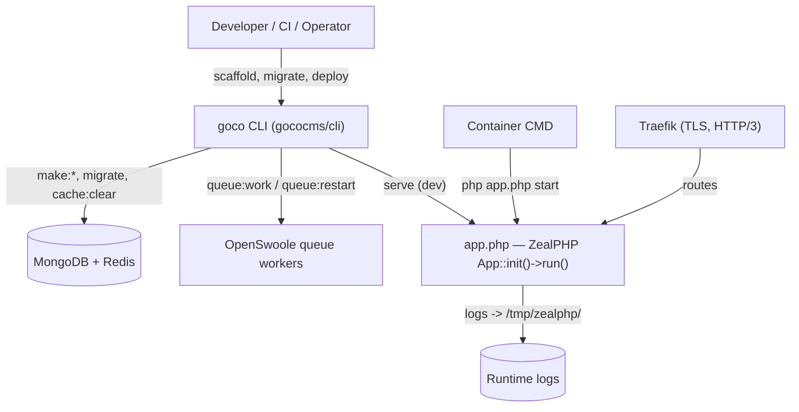

# CLI Reference

> Exhaustive reference for the `goco` developer CLI — every command, argument, flag, exit code, and its relationship to the `php app.php` runtime lifecycle.

The `goco` binary is a PHP console application (shipped as the `gococms/cli` Composer package) that drives the **developer and operator lifecycle** of a GOCO CMS project: scaffolding, database migrations, cache and queue control, plugin and theme management, and day-to-day operations. It is the human-facing counterpart to the ZealPHP runtime entry file `app.php`.

- `goco` — high-level lifecycle, code generators, and orchestration commands (this document).
- `php app.php` — the low-level ZealPHP process supervisor (`start -d`, `restart`, `stop`, `status`, `logs`). See [Relationship to `php app.php`](#relationship-to-php-apphp).

For the design of the console application itself — how commands are discovered, how `make:command` scaffolds new commands, and how to publish CLI extensions from a plugin — see the [CLI SDK](../sdk/cli.md).

> **Note**
> `goco` targets **PHP 8.4+** and expects an **OpenSwoole 22.1+** runtime for any command that boots the application container (`serve`, `tinker`, `queue:work`). Pure scaffolding commands (`make:*`, `key:generate`) run without OpenSwoole.

---

## Installation & Invocation

`goco` is installed as a project dependency and exposed through Composer's `vendor/bin` directory. A convenience wrapper lives at the repository root.

```bash
# Global (recommended for scaffolding new projects)
composer global require gococms/cli
export PATH="$HOME/.composer/vendor/bin:$PATH"

# Per-project (already present after `goco new`)
./vendor/bin/goco <command>

# Root wrapper (equivalent, resolves the project automatically)
./goco <command>
```

**Synopsis**

```bash
goco [global options] <command> [command arguments] [command options]
```

Run `goco` with no arguments (or `goco list`) to print the grouped command index; run `goco help <command>` (or `goco <command> --help`) for per-command usage. Commands are namespaced with a colon (`make:widget`, `queue:work`), mirroring the [monorepo package layout](../getting-started/project-structure.md).

---

## Global Options

These options are accepted by **every** command and are parsed before the command name is resolved. Command-specific flags are documented per command below.

| Option | Shorthand | Default | Description |
| --- | --- | --- | --- |
| `--env=<name>` | `-e` | `local` | Selects the environment profile. Loads `.env.<name>` layered over `.env`. Common values: `local`, `testing`, `staging`, `production`. |
| `--workspace=<id>` | `-w` | *(all)* | Scopes a command to a single [workspace](../architecture/multi-tenancy.md) by `workspace_id` or slug. Applies to migrations, seeders, plugin/theme activation, and maintenance mode. |
| `--website=<id>` | | *(all)* | Further scopes tenant-aware commands to a single website within the workspace. |
| `--verbose` | `-v`, `-vv`, `-vvv` | off | Increases output verbosity. `-v` normal, `-vv` verbose (SQL-equivalent Mongo queries, hook dispatch), `-vvv` debug (full stack traces, coroutine ids). |
| `--quiet` | `-q` | off | Suppresses all output except errors. Mutually exclusive with `-v`. |
| `--no-interaction` | `-n` | off | Never prompt; use defaults or fail. Required for CI and non-TTY contexts. |
| `--no-ansi` | | auto | Disables colored output (auto-detected for non-TTY). Use `--ansi` to force. |
| `--config=<path>` | `-c` | `./goco.json` | Overrides the CLI configuration file path. |
| `--version` | `-V` | | Prints the `goco` and `gococms/core` versions, then exits `0`. |
| `--help` | `-h` | | Prints help for the resolved command (or global help), then exits `0`. |

> **Tip**
> Global options may appear before or after the command name. `goco -w acme migrate` and `goco migrate --workspace=acme` are equivalent. The `--env` value also seeds `APP_ENV` for the booted container so runtime code observes the same profile.

---

## Exit Codes

`goco` follows conventional Unix exit-code semantics so that shell scripts, CI pipelines, and Docker healthchecks can branch on the outcome.

| Code | Symbol | Meaning |
| --- | --- | --- |
| `0` | `SUCCESS` | Command completed successfully. |
| `1` | `FAILURE` | Generic runtime failure (unhandled exception, assertion failed). |
| `2` | `INVALID_USAGE` | Bad arguments, unknown option, or missing required argument. |
| `3` | `MISCONFIGURED` | Configuration or environment error (missing `.env`, unreadable `goco.json`, bad `APP_KEY`). |
| `4` | `DEPENDENCY_UNAVAILABLE` | A required service (MongoDB, Redis) is unreachable. |
| `5` | `MIGRATION_FAILED` | A database migration or seeder aborted; changes rolled back where transactional. |
| `6` | `LOCK_CONTENDED` | Could not acquire a Redis operation lock (another `goco` process holds it). |
| `7` | `MAINTENANCE_ACTIVE` | Command refused because the target is in maintenance mode and `--force` was not given. |
| `130` | `INTERRUPTED` | Terminated by `SIGINT` (Ctrl+C); long-running workers exit gracefully. |

```bash
goco migrate --no-interaction
if [ $? -eq 5 ]; then echo "migration failed, aborting deploy"; exit 1; fi
```

---

## Project Commands

Scaffold, run, and compile a GOCO project.

### `goco new`

**Synopsis**

```bash
goco new <name> [--template=<template>] [--git] [--no-install] [--mongo=<uri>] [--redis=<uri>]
```

**Description** — Scaffolds a new GOCO CMS project into a directory `<name>`, generating the [monorepo skeleton](../getting-started/project-structure.md) (`apps/`, `core/`, `packages/`, `docker/`, `app.php`, `composer.json`, `.env`, `docker-compose.yml`), installing Composer dependencies, and generating an application key. This is the only command runnable outside an existing project.

**Arguments**

| Argument | Required | Description |
| --- | --- | --- |
| `name` | yes | Target directory / project slug (kebab-case). |

**Options**

| Option | Default | Description |
| --- | --- | --- |
| `--template=<name>` | `standard` | Starter template: `standard`, `blog`, `headless` (API-only), `minimal`. |
| `--git` | on | Initialize a git repository and create the first commit. Use `--no-git` to skip. |
| `--no-install` | off | Skip `composer install` (scaffold files only). |
| `--mongo=<uri>` | `mongodb://mongodb:27017` | Seeds `MONGODB_URI` in `.env`. |
| `--redis=<uri>` | `redis://redis:6379` | Seeds `REDIS_URL` in `.env`. |

**Examples**

```bash
# Standard site, Docker-first defaults
goco new acme-site

# Headless (API-only) project without touching git, custom Mongo
goco new acme-api --template=headless --no-git --mongo=mongodb://localhost:27017
```

### `goco serve`

**Synopsis**

```bash
goco serve [--host=<ip>] [--port=<n>] [--mode=<mode>] [--watch] [--workers=<n>]
```

**Description** — Boots the ZealPHP application for local development by invoking the runtime entry `app.php` in the foreground with hot-reload wiring. Under the hood this maps to `App::init($host, $port)->run()`; `goco serve` adds file watching, developer-friendly error rendering, and Mailpit/MinIO connectivity checks. For production you run `php app.php start -d` instead (see [lifecycle](#relationship-to-php-apphp)).

**Options**

| Option | Default | Description |
| --- | --- | --- |
| `--host=<ip>` | `0.0.0.0` | Bind address passed to `App::init()`. |
| `--port=<n>` | `8080` | Listen port. |
| `--mode=<mode>` | `coroutine` | ZealPHP mode: `coroutine` (`App::MODE_COROUTINE`, default), `legacy-cgi`, `coroutine-legacy`, `mixed`. |
| `--watch` | off | Watch `apps/`, `packages/`, `themes/`, `widgets/` and restart workers on change. |
| `--workers=<n>` | CPU count | Number of OpenSwoole worker processes. |

**Examples**

```bash
# Dev server with hot reload
goco serve --watch

# Emulate a legacy-CGI request path on a custom port
goco serve --mode=legacy-cgi --port=9000
```

> **Warning**
> `goco serve` is a development front door. Behind [Traefik](../deployment/traefik.md) in production, the `gococms` container runs `php app.php start` and Traefik terminates TLS and provides HTTP/3 — do not expose `goco serve` publicly.

### `goco build`

**Synopsis**

```bash
goco build [--assets] [--minify] [--optimize] [--no-cache]
```

**Description** — Produces production build artifacts: compiles theme and widget assets (CSS/JS bundles into per-theme `AssetBundle`s), warms the template cache, dumps an optimized Composer autoloader, and precompiles the hook/route manifest. Intended to run in CI or the Docker build stage.

**Options**

| Option | Default | Description |
| --- | --- | --- |
| `--assets` | on | Compile theme/widget asset bundles. `--no-assets` to skip. |
| `--minify` | on in `production` | Minify emitted CSS/JS. |
| `--optimize` | on | Dump optimized autoloader and cache config/routes/hooks. |
| `--no-cache` | off | Rebuild all caches from scratch. |

**Example**

```bash
goco build --env=production --minify --optimize
```

---

## Make (Generator) Commands

Scaffold framework primitives into the correct [monorepo](../getting-started/project-structure.md) location with GOCO conventions (PSR-4 `Goco\` namespace, SDK facade wiring, stub tests). All generators accept `--force` to overwrite and `--dry-run` to preview file paths without writing.

### `goco make:widget`

**Synopsis**

```bash
goco make:widget <Name> [--type=<type>] [--category=<cat>] [--preview] [--package=<pkg>]
```

**Description** — Generates a widget class implementing the [Widget SDK](../sdk/widget-sdk.md) contract plus a `PropertySchema`, a render template, and a preview stub. Registers the widget via `Widget::register()` in the package's service provider.

**Arguments**

| Argument | Required | Description |
| --- | --- | --- |
| `Name` | yes | StudlyCase widget class name (e.g. `HeroBanner`). |

**Options**

| Option | Default | Description |
| --- | --- | --- |
| `--type=<type>` | kebab of `Name` | The registered `$type` string passed to `Widget::register`. |
| `--category=<cat>` | `general` | Palette grouping in the [Page Builder](../core/page-builder.md). |
| `--preview` | off | Also generate a `preview()` fixture. |
| `--package=<pkg>` | `widgets/` | Destination package/directory. |

**Example**

```bash
goco make:widget HeroBanner --category=marketing --preview
```

### `goco make:theme`

**Synopsis**

```bash
goco make:theme <Name> [--layouts=<a,b>] [--base=<slug>]
```

**Description** — Scaffolds a theme package under `themes/` with a `theme.json` manifest, layout templates, region definitions, and an `AssetBundle`, wired through `Theme::register()`. See the [Theme SDK](../sdk/theme-sdk.md).

**Options**

| Option | Default | Description |
| --- | --- | --- |
| `--layouts=<list>` | `default` | Comma-separated layout slugs to scaffold (e.g. `default,landing,post`). |
| `--base=<slug>` | *(none)* | Parent theme to inherit layouts/regions from. |

**Example**

```bash
goco make:theme aurora --layouts=default,landing,post
```

### `goco make:plugin`

**Synopsis**

```bash
goco make:plugin <Name> [--slug=<slug>] [--with-routes] [--with-migration]
```

**Description** — Scaffolds a plugin package under `plugins/` with a `plugin.json` manifest, a bootstrap class using the [Plugin SDK](../sdk/plugin-sdk.md) (`Plugin::register/install/boot`), declared `permissions`, and optional route registrar and migration.

**Options**

| Option | Default | Description |
| --- | --- | --- |
| `--slug=<slug>` | kebab of `Name` | The plugin slug; namespaces its [hooks](../sdk/hook-sdk.md). |
| `--with-routes` | off | Generate a `Plugin::routes()` registrar stub. |
| `--with-migration` | off | Generate a paired migration for the plugin's collections. |

**Example**

```bash
goco make:plugin SeoRedirects --with-routes --with-migration
```

### `goco make:controller`

**Synopsis**

```bash
goco make:controller <Name> [--app=<app>] [--api] [--resource]
```

**Description** — Generates a controller class in an app's `src/` directory. With `--api`, emits a file-based REST controller compatible with ZealPHP's `api/` auto-routing (a handler returning `array|Generator` that auto-serializes to JSON). With `--resource`, stubs index/show/store/update/destroy actions. See [Routing](../core/routing.md).

**Options**

| Option | Default | Description |
| --- | --- | --- |
| `--app=<app>` | `website` | Target app: `admin`, `api`, `website`, `installer`. |
| `--api` | off | Generate a JSON REST controller for `api/` auto-routing. |
| `--resource` | off | Stub full CRUD action set. |

**Example**

```bash
goco make:controller PostController --app=api --api --resource
```

### `goco make:model`

**Synopsis**

```bash
goco make:model <Name> [--collection=<name>] [--migration] [--schema] [--tenant]
```

**Description** — Generates a document model + Repository (the lightweight document-mapper in [`Goco\Database`](../architecture/database-mongodb.md)) for a MongoDB collection. Adds the standard envelope fields (`_id`, `created_at`, `updated_at`, `deleted_at`, `version`, `created_by`, `updated_by`); with `--tenant` also adds `workspace_id` + `website_id`.

**Options**

| Option | Default | Description |
| --- | --- | --- |
| `--collection=<name>` | snake plural of `Name` | Target collection name. |
| `--migration` | off | Also generate an index/validator migration. |
| `--schema` | off | Generate a JSON-Schema validator document. |
| `--tenant` | off | Include `workspace_id` + `website_id` scoping. |

**Example**

```bash
goco make:model Product --collection=products --migration --schema --tenant
```

### `goco make:migration`

**Synopsis**

```bash
goco make:migration <name> [--collection=<name>] [--indexes] [--validator]
```

**Description** — Creates a timestamped migration file under `packages/database/migrations` (or a plugin's `migrations/`). Migrations declare `up()` / `down()` operations against MongoDB: create/drop collections, apply JSON-Schema validators, and manage [indexes](../architecture/data-model.md). Migrations run inside multi-document transactions where the operation supports it.

**Options**

| Option | Default | Description |
| --- | --- | --- |
| `--collection=<name>` | *(none)* | Pre-fill the target collection. |
| `--indexes` | off | Stub `createIndex` calls. |
| `--validator` | off | Stub a `collMod`/create validator block. |

**Example**

```bash
goco make:migration add_slug_index_to_pages --collection=pages --indexes
```

### `goco make:command`

**Synopsis**

```bash
goco make:command <Name> [--signature=<sig>] [--package=<pkg>]
```

**Description** — Generates a new console command class that plugs into `goco`'s command registry, so plugins and packages can publish their own CLI verbs. See the [CLI SDK](../sdk/cli.md) for discovery and registration details.

**Options**

| Option | Default | Description |
| --- | --- | --- |
| `--signature=<sig>` | kebab of `Name` | The command invocation signature (e.g. `reports:export {--format=csv}`). |
| `--package=<pkg>` | `cli/` | Destination package. |

**Example**

```bash
goco make:command ExportReports --signature="reports:export {--format=csv}"
```

---

## Database Commands

Manage MongoDB schema, indexes, validators, and seed data. All database commands honor `--workspace`/`--website` for the [database-per-workspace](../architecture/multi-tenancy.md) enterprise mode and require a reachable MongoDB (exit `4` otherwise).

### `goco migrate`

**Synopsis**

```bash
goco migrate [--pretend] [--step] [--force] [--path=<dir>]
```

**Description** — Runs all pending migrations in timestamp order, recording each in the `migrations` ledger. Applies collection creation, JSON-Schema validators, and index definitions. Cross-collection invariants execute inside multi-document transactions; a failure rolls the transaction back and exits `5`.

**Options**

| Option | Default | Description |
| --- | --- | --- |
| `--pretend` | off | Print the operations that would run without applying them. |
| `--step` | off | Record each migration so it can be rolled back individually. |
| `--force` | off | Run in `production` without the confirmation prompt (required with `-n`). |
| `--path=<dir>` | all registered | Restrict to a specific migrations directory (e.g. a plugin's). |

**Examples**

```bash
# Dry run before a production deploy
goco migrate --pretend --env=production

# Apply for one workspace only (enterprise DB-per-workspace)
goco migrate --workspace=acme --force
```

### `goco migrate:rollback`

**Synopsis**

```bash
goco migrate:rollback [--step=<n>] [--batch=<n>] [--force]
```

**Description** — Reverts migrations by executing their `down()` methods, newest first. By default reverts the last batch; `--step=<n>` reverts the last *n* migrations regardless of batch.

**Options**

| Option | Default | Description |
| --- | --- | --- |
| `--step=<n>` | *(last batch)* | Number of individual migrations to revert. |
| `--batch=<n>` | latest | Revert a specific batch number. |
| `--force` | off | Bypass the production confirmation. |

**Related sibling commands**

- `goco migrate:reset` — revert every migration.
- `goco migrate:fresh` — drop all collections and re-migrate (destructive; refuses in `production` without `--force`).
- `goco migrate:status` — list applied vs. pending migrations.

**Example**

```bash
goco migrate:rollback --step=1
```

### `goco db:seed`

**Synopsis**

```bash
goco db:seed [--class=<Seeder>] [--force]
```

**Description** — Populates collections with seed data (default roles/capabilities, demo workspace/website, sample pages and widgets). Idempotent seeders upsert by natural key so re-running is safe.

**Options**

| Option | Default | Description |
| --- | --- | --- |
| `--class=<Seeder>` | `DatabaseSeeder` | Run a specific seeder class. |
| `--force` | off | Allow seeding in `production`. |

**Example**

```bash
goco db:seed --class=RolesSeeder --workspace=acme
```

---

## Cache & Queue Commands

These commands operate against [Redis](../architecture/caching-and-queue.md), which backs GOCO's cache, queues, realtime pub/sub, locks, rate limiting, and sessions.

### `goco cache:clear`

**Synopsis**

```bash
goco cache:clear [--tags=<a,b>] [--store=<name>] [--pattern=<glob>]
```

**Description** — Flushes cached application data from Redis: config cache, route/hook manifest, template fragments, and tagged content caches. Without options, clears the default application cache namespace for the selected env/workspace.

**Options**

| Option | Default | Description |
| --- | --- | --- |
| `--tags=<list>` | *(all)* | Only invalidate entries carrying these cache tags (e.g. `pages,menus`). |
| `--store=<name>` | `default` | Named cache store to clear. |
| `--pattern=<glob>` | *(none)* | Delete keys matching a Redis glob (use with care). |

**Companion commands**

- `goco config:cache` / `goco config:clear` — compile or drop the merged configuration cache.
- `goco route:cache` — precompile the route + hook manifest (also run by `goco build`).
- `goco view:clear` — purge compiled templates and cached [render fragments](../architecture/rendering-pipeline.md).

**Example**

```bash
goco cache:clear --tags=pages,menus --workspace=acme
```

### `goco queue:work`

**Synopsis**

```bash
goco queue:work [--queue=<names>] [--tries=<n>] [--timeout=<s>] [--sleep=<s>] [--max-jobs=<n>] [--once]
```

**Description** — Starts a long-running worker that consumes jobs from the `jobs` queue in Redis and processes them inside OpenSwoole coroutines. This is the process run by the queue worker container in production. It handles signals gracefully: `SIGTERM`/`SIGINT` finish the in-flight job, then exit `130`.

**Options**

| Option | Default | Description |
| --- | --- | --- |
| `--queue=<names>` | `default` | Comma-separated priority-ordered queues (e.g. `high,default,low`). |
| `--tries=<n>` | `3` | Max attempts before a job is marked failed. |
| `--timeout=<s>` | `60` | Per-job wall-clock timeout. |
| `--sleep=<s>` | `3` | Idle poll interval when no jobs are ready. |
| `--max-jobs=<n>` | `0` (∞) | Exit after processing *n* jobs (for memory hygiene / cron). |
| `--once` | off | Process a single job then exit. |

**Examples**

```bash
# Production worker draining priority queues
goco queue:work --queue=high,default,low --tries=5 --timeout=120

# Run once (useful in CI or a scheduled cron dispatch)
goco queue:work --once
```

> **Tip**
> Prefer `goco queue:work` over `queue:listen` in production; combine `--max-jobs` with a container restart policy so each worker recycles periodically, matching the [scaling guidance](../deployment/scaling.md).

### `goco queue:restart`

**Synopsis**

```bash
goco queue:restart
```

**Description** — Broadcasts a graceful-restart signal over Redis to all running `queue:work` processes. Each worker finishes its current job, then exits so its supervisor (Docker restart policy) relaunches it with fresh code — the standard way to roll out new code to workers after a deploy.

**Example**

```bash
goco build --env=production && goco queue:restart
```

---

## Operations Commands

Day-to-day operator tooling: keys, an interactive REPL, health, logs, and maintenance mode.

### `goco key:generate`

**Synopsis**

```bash
goco key:generate [--show] [--force]
```

**Description** — Generates a cryptographically secure application key (used for encryption, signed cookies, and CSRF secret derivation via the [ZealPHP Csrf middleware](../core/authentication.md)) and writes it to `APP_KEY` in `.env`. Runs automatically during `goco new`.

**Options**

| Option | Default | Description |
| --- | --- | --- |
| `--show` | off | Print the key to stdout instead of writing `.env`. |
| `--force` | off | Overwrite an existing `APP_KEY` (invalidates existing sessions/tokens). |

**Example**

```bash
goco key:generate --show
```

### `goco tinker`

**Synopsis**

```bash
goco tinker [--execute=<code>]
```

**Description** — Opens an interactive REPL with the full application container booted, letting you exercise the SDK facades and repositories against live MongoDB/Redis. Because it boots the container it requires OpenSwoole and reachable services.

**Options**

| Option | Default | Description |
| --- | --- | --- |
| `--execute=<code>` | *(interactive)* | Evaluate a single expression non-interactively and print the result. |

**Example**

```bash
goco tinker --execute="Widget::properties('hero-banner')"
```

### `goco status`

**Synopsis**

```bash
goco status [--json] [--services=<a,b>]
```

**Description** — Prints a health summary: `gococms` app reachability, MongoDB and Redis connectivity, object-storage driver ([Local/MinIO/S3](../architecture/storage.md)), search provider ([Mongo/Meilisearch/OpenSearch](../architecture/search.md)), pending migration count, queue depth, and version info. Designed for Docker healthchecks and dashboards; exits `4` if a critical dependency is down.

**Options**

| Option | Default | Description |
| --- | --- | --- |
| `--json` | off | Emit machine-readable JSON (for healthchecks/monitoring). |
| `--services=<list>` | all | Check only the named services (e.g. `mongodb,redis`). |

**Example**

```bash
goco status --json --services=mongodb,redis
```

### `goco logs`

**Synopsis**

```bash
goco logs [--follow] [--lines=<n>] [--level=<lvl>] [--channel=<name>]
```

**Description** — Tails structured application logs. By default reads the runtime log stream that ZealPHP writes under `/tmp/zealphp/`; can filter by level and channel. For the raw process supervisor log use `php app.php logs` (see [lifecycle](#relationship-to-php-apphp)).

**Options**

| Option | Default | Description |
| --- | --- | --- |
| `--follow` | off | Stream new lines (`-f`). |
| `--lines=<n>` | `100` | Number of trailing lines to show. |
| `--level=<lvl>` | `debug`+ | Minimum level: `debug`, `info`, `warning`, `error`. |
| `--channel=<name>` | all | Filter to a log channel (e.g. `http`, `queue`, `audit`). |

**Example**

```bash
goco logs --follow --level=error --channel=queue
```

### `goco up` / `goco down` (Maintenance Mode)

**Synopsis**

```bash
goco down [--message=<text>] [--retry=<s>] [--allow=<cidr>] [--secret=<token>] [--render=<view>]
goco up
```

**Description** — `goco down` places the application (or a scoped `--workspace`/`--website`) into maintenance mode: a flag is set in Redis, and inbound requests receive an HTTP 503 with `Retry-After`, except allow-listed IPs or requests bearing the bypass secret. `goco up` clears the flag and returns to service. Deploy scripts wrap migrations between the two.

**Options (`down`)**

| Option | Default | Description |
| --- | --- | --- |
| `--message=<text>` | default copy | Message rendered on the maintenance page. |
| `--retry=<s>` | `60` | `Retry-After` header value in seconds. |
| `--allow=<cidr>` | *(none)* | IP/CIDR allowed through (repeatable). |
| `--secret=<token>` | *(none)* | Bypass token; append `?secret=<token>` or send as a cookie to bypass. |
| `--render=<view>` | `errors/503` | Template used for the maintenance response. |

**Example**

```bash
goco down --message="Upgrading to v0.9" --retry=120 --allow=203.0.113.0/24 --secret=$BYPASS
goco migrate --force --env=production
goco up
```

> **Note**
> Maintenance mode is enforced by application middleware, not [Traefik](../deployment/traefik.md); the proxy still routes traffic so allow-listed IPs and the bypass secret keep working during the window.

---

## Plugin Commands

Install, list, and toggle plugins. Activation is scoped per `(workspace, website)`; without a scope the command targets the current default site. See the [Plugin SDK](../sdk/plugin-sdk.md) and [Marketplace](../marketplace/overview.md).

### `goco plugin:install`

**Synopsis**

```bash
goco plugin:install <slug|path|url> [--version=<constraint>] [--enable] [--migrate]
```

**Description** — Resolves a plugin from the [marketplace](../marketplace/overview.md) (by slug), a local path, or a VCS URL; installs it into `plugins/`, runs `Plugin::install()`, registers its declared permissions, and optionally enables it and runs its migrations.

**Arguments**

| Argument | Required | Description |
| --- | --- | --- |
| `slug\|path\|url` | yes | Marketplace slug, local directory, or repository URL. |

**Options**

| Option | Default | Description |
| --- | --- | --- |
| `--version=<constraint>` | latest stable | SemVer constraint (e.g. `^1.2`). |
| `--enable` | off | Enable (boot) the plugin immediately after install. |
| `--migrate` | off | Run the plugin's migrations after install. |

**Example**

```bash
goco plugin:install seo-toolkit --version="^1.0" --enable --migrate --workspace=acme
```

### `goco plugin:list`

**Synopsis**

```bash
goco plugin:list [--enabled] [--disabled] [--updates] [--json]
```

**Description** — Lists installed plugins with slug, version, state (enabled/disabled), and available updates. Scope with `--workspace`/`--website` to see per-site activation.

**Example**

```bash
goco plugin:list --updates --json
```

### `goco plugin:enable` / `goco plugin:disable`

**Synopsis**

```bash
goco plugin:enable <slug> [--migrate]
goco plugin:disable <slug> [--purge]
```

**Description** — `enable` boots a plugin for the scoped site (`Plugin::boot()`), registering its routes and hooks; `disable` deactivates it. `--purge` on disable also removes the plugin's collections/data (destructive).

**Options**

| Option | Command | Description |
| --- | --- | --- |
| `--migrate` | `enable` | Run pending plugin migrations on enable. |
| `--purge` | `disable` | Drop the plugin's data on disable. |

**Example**

```bash
goco plugin:enable seo-toolkit --migrate --website=acme-main
goco plugin:disable legacy-forms --purge
```

### `goco plugin:update`

**Synopsis**

```bash
goco plugin:update [<slug>] [--all] [--version=<constraint>] [--migrate]
```

**Description** — Updates a single plugin (or `--all`) to the latest compatible version, running any new migrations. Respects SemVer constraints recorded at install time.

**Example**

```bash
goco plugin:update --all --migrate
```

---

## Theme Commands

Install, list, and activate themes. Activation binds a theme to a website in the [Workspace → Website → Theme](../core/theme-engine.md) hierarchy.

### `goco theme:install`

**Synopsis**

```bash
goco theme:install <slug|path|url> [--version=<constraint>] [--activate]
```

**Description** — Installs a theme from the marketplace, a local path, or a VCS URL into `themes/`, registering it via `Theme::register()` and compiling its `AssetBundle`. See the [Theme SDK](../sdk/theme-sdk.md).

**Options**

| Option | Default | Description |
| --- | --- | --- |
| `--version=<constraint>` | latest stable | SemVer constraint. |
| `--activate` | off | Activate on the scoped website after install. |

**Example**

```bash
goco theme:install aurora --activate --website=acme-main
```

### `goco theme:list`

**Synopsis**

```bash
goco theme:list [--active] [--json]
```

**Description** — Lists installed themes with slug, version, available layouts, and which website(s) currently have each activated.

**Example**

```bash
goco theme:list --json
```

### `goco theme:activate`

**Synopsis**

```bash
goco theme:activate <slug> [--layout=<layout>]
```

**Description** — Activates a theme for the scoped website, optionally setting the default [layout](../core/theme-engine.md). Recompiles the theme's assets and invalidates the affected render cache.

**Options**

| Option | Default | Description |
| --- | --- | --- |
| `--layout=<layout>` | theme default | Default layout slug to apply. |

**Example**

```bash
goco theme:activate aurora --layout=landing --website=acme-main
```

---

## AI Commands

Optional; requires the `gococms/ai` package and configured provider credentials. See the [AI Platform](../core/ai-platform.md).

### `goco ai:generate`

**Synopsis**

```bash
goco ai:generate <kind> [--prompt=<text>] [--target=<id>] [--provider=<name>] [--dry-run]
```

**Description** — Invokes the AI platform to generate content or scaffolding: page copy, a widget layout, alt text for media, SEO metadata, or a taxonomy suggestion. Output can be previewed (`--dry-run`) or written to the target document. Requires the `ai.manage` capability.

**Arguments**

| Argument | Required | Description |
| --- | --- | --- |
| `kind` | yes | What to generate: `page`, `copy`, `alt-text`, `seo-meta`, `layout`. |

**Options**

| Option | Default | Description |
| --- | --- | --- |
| `--prompt=<text>` | *(interactive)* | Instruction / brief for the generator. |
| `--target=<id>` | *(none)* | Document `_id` to write the result into. |
| `--provider=<name>` | configured default | Override the AI provider. |
| `--dry-run` | off | Print the generated result without persisting. |

**Example**

```bash
goco ai:generate seo-meta --target=6630f... --prompt="e-commerce landing page for outdoor gear" --dry-run
```

---

## Relationship to `php app.php` Lifecycle

`goco` and `php app.php` are complementary. The runtime entry file `app.php` **is** the ZealPHP process — it calls `App::init()` and `->run()`, and ZealPHP exposes a small process-supervisor CLI on it. `goco` sits above and orchestrates the developer/operator workflow.

| Concern | Use `php app.php` | Use `goco` |
| --- | --- | --- |
| Start the server (foreground) | `php app.php` | `goco serve` (adds watch/dev errors) |
| Start daemonized | `php app.php start -d` | *(delegates to `app.php`)* |
| Restart / stop workers | `php app.php restart` / `stop` | `goco queue:restart` (workers only) |
| Process status | `php app.php status` | `goco status` (full dependency health) |
| Raw process logs | `php app.php logs` (`/tmp/zealphp/`) | `goco logs` (structured, filterable) |
| Scaffolding, migrations, plugins, themes | — | `goco` (exclusively) |

A typical container command is `php app.php start`, while `goco` commands run as build steps, one-shot deploy tasks, or the queue-worker entrypoint (`goco queue:work`).



> **Tip**
> In Docker, keep the two roles distinct: the `gococms` service runs `php app.php start`, a separate worker service runs `goco queue:work`, and one-shot tasks (`goco migrate`, `goco build`) run as deploy jobs or the image's build stage. See the [Docker Architecture](../deployment/docker.md).

---

## Related

- [CLI SDK](../sdk/cli.md) — build and register custom `goco` commands.
- [Project Structure](../getting-started/project-structure.md) — where generators place files.
- [Installation](../getting-started/installation.md) and [Quick Start](../getting-started/quick-start.md).
- [Configuration](../getting-started/configuration.md) and [Configuration Reference](configuration-reference.md).
- [API Reference](api-reference.md) — the HTTP surface `make:controller --api` targets.
- [MongoDB Data Layer](../architecture/database-mongodb.md) and [Data Model](../architecture/data-model.md) — migrations, indexes, validators.
- [Caching, Queue & Realtime (Redis)](../architecture/caching-and-queue.md) — what `cache:*` and `queue:*` operate on.
- [Docker Architecture](../deployment/docker.md), [Traefik Reverse Proxy](../deployment/traefik.md), and [Deployment Guide](../deployment/deployment-guide.md).
- [Plugin SDK](../sdk/plugin-sdk.md), [Theme SDK](../sdk/theme-sdk.md), and [Widget SDK](../sdk/widget-sdk.md).
- [Documentation Index](../README.md).
