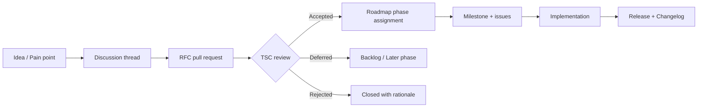

# Roadmap

> The phased delivery plan for GOCO CMS — from the ZealPHP-powered kernel to a fully multi-tenant, highly available Website Operating System — governed transparently and shipped under Semantic Versioning.

GOCO CMS is pre-1.0 and under active development. This roadmap describes **what we build, in what order, and why** — expressed in **version milestones**, never fixed calendar dates. Milestones move only in one direction: a feature can slip to a later version, but we do not promise a delivery day we cannot guarantee. If you need a hard date for a commercial commitment, track the tagged releases on the milestone board rather than this document.

The roadmap is a living artifact. It is amended through the community process described in [Governance](community/governance.md), informed by [RFCs](community/contributing.md), and reflected — as work lands — in the [Changelog](changelog.md).

---

## How the Roadmap Is Governed

The roadmap is not owned by a single person. It is stewarded by the maintainer team and the Technical Steering Committee (TSC) under the rules in [Governance](community/governance.md). Every change to the phase plan below follows the same lifecycle:

Key principles:

- **Phases are ordered, not dated.** A phase begins only when the previous phase's exit criteria are met. Milestones are expressed as `0.x`, `0.y`, or `1.0`.
- **RFCs gate large changes.** Anything that alters a public SDK signature, the [MongoDB data model](architecture/data-model.md), the [hook naming contract](sdk/hook-sdk.md), or the [security model](security/security-model.md) requires an accepted RFC before it can be assigned to a phase.
- **The default answer is "core stays small."** GOCO is a *Website Operating System*: a lightweight core surrounded by widgets, themes, and plugins. Features that can live in a plugin will live in a plugin. This bias keeps the kernel maintainable and is a permanent constraint on the roadmap, not a phase.
- **Nothing is final until it is tagged.** Items marked `experimental` or `beta` may change or be withdrawn without a deprecation cycle. Only `stable` surfaces carry compatibility guarantees.

---

## Release Cadence & Semantic Versioning

GOCO CMS follows [Semantic Versioning 2.0.0](https://semver.org/) and [Conventional Commits](https://www.conventionalcommits.org/). During the pre-1.0 period, the meaning of each version segment is:

| Segment | Pre-1.0 (`0.y.z`) | Post-1.0 (`x.y.z`) |
| --- | --- | --- |
| **MAJOR** (`x`) | Pinned at `0`. | Incremented for breaking changes to any `stable` public API. |
| **MINOR** (`y`) | May contain breaking changes; each `0.y` is treated as a soft major. | New backward-compatible features. |
| **PATCH** (`z`) | Bug fixes and internal improvements only. | Bug fixes only. |

> **Warning**
> While GOCO is `0.y`, a bump of the **minor** number (for example `0.6 -> 0.7`) may include breaking changes. Read the [Changelog](changelog.md) and the per-release upgrade notes before upgrading a `0.y` deployment.

Cadence conventions:

- **Patch releases** ship as needed — security fixes ship immediately.
- **Minor releases** align to the phase milestones in the table below.
- **Pre-releases** use SemVer pre-release identifiers: `0.7.0-alpha.1`, `0.7.0-beta.2`, `0.7.0-rc.1`.
- **Stability tags** (`stable` / `beta` / `experimental` / `deprecated`) are attached per feature in its own doc, independent of the overall version number. A `1.0` release simply means the surfaces listed as Phase 1–2 exit criteria are all `stable`.
- **Deprecations** get at least one full minor cycle of overlap after 1.0, announced in the Changelog and surfaced by the `goco doctor` command.

Every release is cut from `main`, tagged, and published to Packagist as `gococms/core` and the companion `gococms/*` packages, with matching Docker images for the `gococms` compose service.

---

## Roadmap at a Glance

| Phase | Theme | Target Milestone | Status |
| --- | --- | --- | --- |
| **Phase 1** | Core Framework — kernel, CLI, auth, workspace, routing, widget engine | `0.1 -> 0.4` | `beta` — in progress |
| **Phase 2** | Presentation — theme/template engine, page builder, blog engine | `0.4 -> 0.6` | `beta` — active |
| **Phase 3** | Extensibility — Plugin SDK, marketplace, database builder, dynamic content | `0.6 -> 0.8` | `experimental` — early |
| **Phase 4** | Intelligence — AI platform, analytics, automation, collaboration | `0.8 -> 1.0` | planned |
| **Phase 5** | Enterprise — multi-tenant at scale, HA, clustering | `1.0 -> 1.x` | planned |

The remaining sections expand each phase: its goals, headline features, exit criteria, and the docs that describe the surfaces it delivers.

---

## Phase 1 — Core Framework

**Target milestone:** `0.1 -> 0.4`  ·  **Status:** `beta`, in progress

### Goals

Establish the kernel that everything else stands on: boot GOCO on [ZealPHP](architecture/zealphp-foundation.md) over OpenSwoole, wire the [MongoDB data layer](architecture/database-mongodb.md) and [Redis](architecture/caching-and-queue.md), and prove that the [hook system](architecture/event-hook-system.md) can carry the weight of an extensible platform. This phase is deliberately unglamorous: if the foundation is wrong, no later phase can be right.

### Headline Features

| Feature | Description | Docs |
| --- | --- | --- |
| **Kernel & bootstrap** | `app.php` entrypoint, `App::init()` lifecycle, coroutine mode, worker start/tick timers, graceful shutdown. | [Request Lifecycle](architecture/request-lifecycle.md) |
| **`goco` CLI** | Developer console: lifecycle (`start`, `restart`, `status`, `logs`), scaffolding generators for widgets/themes/plugins. | [CLI Reference](reference/cli-reference.md) |
| **Routing** | Flask-style `route()`, `nsRoute()`, `patternRoute()`, file-based REST under `api/`, PSR-15 middleware chain. | [Routing](core/routing.md) |
| **Authentication** | Redis-backed sessions, JWT for API, Argon2id hashing, CSRF middleware; 2FA/passkey scaffolding. | [Authentication](core/authentication.md) |
| **Workspaces & tenancy scaffolding** | `workspaces`, `websites`, `domains`, `users`, `roles`, `sessions` collections with `workspace_id` / `website_id` scoping. | [Multi-Tenancy](architecture/multi-tenancy.md) |
| **RBAC** | Role → capability mapping, `resource.action` capability strings, per-(workspace, website) scope. | [Permission System](architecture/permission-system.md) |
| **Widget Engine** | `Widget::register/render/properties/preview`, property schemas, server-side render into the section tree. | [Widget Engine](core/widget-engine.md) |
| **Service container & DI** | Reflection-based dependency injection, request context (`Goco\G`), per-coroutine state isolation. | [Service Container](architecture/service-container.md) |

### Exit Criteria

- A fresh `docker compose up` boots the `gococms`, `mongodb`, `redis`, and `traefik` services with healthchecks green.
- A developer can scaffold and register a widget end-to-end using the [Widget SDK](sdk/widget-sdk.md).
- Auth, RBAC, and the hook dispatcher are documented and covered by the [testing strategy](community/testing-strategy.md).
- The public SDK facade signatures (`Widget`, `Hook`) are frozen for the `0.x` line.

---

## Phase 2 — Presentation

**Target milestone:** `0.4 -> 0.6`  ·  **Status:** `beta`, active

### Goals

Turn the kernel into something you can *look at*. Ship the rendering path from theme manifest to rendered HTML, the visual [page builder](core/page-builder.md) over the `Layout -> Section -> Container -> Row -> Column -> Widget` hierarchy, and a first-class [blog engine](core/blog-engine.md) so GOCO can power real content sites.

### Headline Features

| Feature | Description | Docs |
| --- | --- | --- |
| **Theme Engine** | `Theme::register/layouts/regions/assets`, theme manifests, asset bundles, layout regions. | [Theme Engine](core/theme-engine.md) |
| **Template Engine** | `App::render/renderToString/renderStream/fragment`, streaming generators, htmx fragment regions. | [Template Engine](core/template-engine.md) |
| **Rendering Pipeline** | `page.rendering` / `page.rendered` events, `widget.output` / `page.title` filters, streamed responses. | [Rendering Pipeline](architecture/rendering-pipeline.md) |
| **Page Builder** | Visual editor over the section/container/row/column tree; `pages` + `page_revisions` with versioning. | [Page Builder](core/page-builder.md) |
| **Blog Engine** | `posts` + `post_revisions`, taxonomies, terms, term relationships, feeds, scheduled publishing. | [Blog Engine](core/blog-engine.md) |
| **Storage & Media** | Driver interface — Local, MinIO, S3 — behind a `media` collection; image variants. | [Storage & Media](architecture/storage.md) |
| **SEO foundations** | Metadata, sitemaps, redirects (`redirects` collection), canonical URLs. | [Overview](introduction/overview.md) |

### Exit Criteria

- A non-developer can assemble and publish a page and a blog post through the admin app.
- `Theme` and `Template` SDK signatures are frozen for `0.x`; see the [Theme SDK](sdk/theme-sdk.md).
- Media storage works against all three drivers (Local, MinIO, S3) with documented configuration.
- Content revisioning and soft delete are verified against the [data model](architecture/data-model.md).

---

## Phase 3 — Extensibility

**Target milestone:** `0.6 -> 0.8`  ·  **Status:** `experimental`, early

### Goals

Open the platform to the ecosystem. Finalize the [Plugin SDK](sdk/plugin-sdk.md), stand up the [Marketplace](marketplace/overview.md), and let users model their own content types through the [Database Builder](core/database-builder.md) — dynamic collections with JSON-Schema validation, without leaving the CMS.

### Headline Features

| Feature | Description | Docs |
| --- | --- | --- |
| **Plugin SDK & engine** | `Plugin::register/install/boot/routes/permissions`, lifecycle events (`plugin.activated`), namespaced hooks. | [Plugin Engine](core/plugin-engine.md) |
| **Plugin Marketplace** | Discovery, install, update, and signing of `gococms/*` packages; capability manifests. | [Marketplace Overview](marketplace/overview.md) |
| **Database Builder** | User-defined `collections` + `collection_entries`, JSON-Schema validators, generated CRUD and admin UI. | [Database Builder](core/database-builder.md) |
| **Dynamic content & forms** | `forms`, `form_submissions`, relationships between dynamic collections, query filters via `query.criteria`. | [Forms & Data Model](architecture/data-model.md) |
| **Search providers** | Swappable provider interface — MongoDB text/Atlas Search, Meilisearch, OpenSearch. | [Search](architecture/search.md) |
| **Full Hook SDK** | Async dispatch (`Hook::dispatchAsync`), documented action/filter catalog, priority ordering. | [Hook SDK](sdk/hook-sdk.md) |

### Exit Criteria

- A third-party developer can publish a plugin to the marketplace and a user can install it in one action.
- Dynamic collections created in the Database Builder are queryable, validated, and indexable.
- `Plugin` and `Hook` async APIs reach `beta`; the [Plugin Guide](guides/plugin-guide.md) covers the full lifecycle.
- At least two search providers pass the same conformance suite.

---

## Phase 4 — Intelligence

**Target milestone:** `0.8 -> 1.0`  ·  **Status:** planned

### Goals

Layer intelligence and teamwork on top of a stable platform, and reach **`1.0`** — the point at which every Phase 1–3 public surface is `stable`. This phase delivers the [AI Platform](core/ai-platform.md), analytics, workflow automation, and real-time multi-user collaboration.

### Headline Features

| Feature | Description | Docs |
| --- | --- | --- |
| **AI Platform** | Provider-agnostic AI services: content generation, summarization, semantic search, `ai.manage` capability. | [AI Platform](core/ai-platform.md) |
| **Analytics** | Privacy-respecting page/event analytics via aggregation pipelines and the `jobs` queue. | [Overview](introduction/overview.md) |
| **Automation** | Rule/trigger engine on the hook bus; scheduled and event-driven `jobs`; `notifications`. | [Event & Hook System](architecture/event-hook-system.md) |
| **Real-time collaboration** | Multi-cursor editing and presence over ZealPHP WebSockets and Redis pub/sub. | [Caching, Queue & Realtime](architecture/caching-and-queue.md) |
| **Audit & compliance** | Complete `audit_logs`, per-tenant retention, exportable trails. | [Security Model](security/security-model.md) |

### Exit Criteria — the `1.0` bar

- All SDK facades (`Widget`, `Theme`, `Plugin`, `Hook`) and the [API](reference/api-reference.md) are `stable` and versioned.
- The [data model](architecture/data-model.md) carries documented JSON-Schema validators and indexes for every collection.
- The [security model](security/security-model.md) — sessions, JWT, OAuth2, 2FA (TOTP), passkeys (WebAuthn), CSRF — is complete and independently reviewed.
- A documented [upgrade path](changelog.md) and deprecation policy are in force.

---

## Phase 5 — Enterprise

**Target milestone:** `1.0 -> 1.x`  ·  **Status:** planned

### Goals

Scale GOCO from a single deployment to fleets. Deliver true multi-tenancy at scale, high availability, and horizontal clustering — without abandoning the "small core" principle.

### Headline Features

| Feature | Description | Docs |
| --- | --- | --- |
| **Multi-tenant at scale** | Default `workspace_id`/`website_id` isolation *plus* optional database-per-workspace (enterprise). | [Multi-Tenancy](architecture/multi-tenancy.md) |
| **High availability** | Redis-backed sessions/locks across nodes, MongoDB replica sets, graceful rolling restarts. | [Scaling Strategy](deployment/scaling.md) |
| **Clustering & load balancing** | Multiple `gococms` workers behind Traefik with HTTP/3, per-tenant routers, health-based routing. | [Traefik Reverse Proxy](deployment/traefik.md) |
| **Backup, restore & DR** | Point-in-time backups, tenant-scoped export/import, disaster-recovery runbooks. | [Backup & Restore](deployment/backup-restore.md) |
| **Fleet operations** | Zero-downtime deploys, optional Watchtower auto-update, observability and rate-limit controls. | [Deployment Guide](deployment/deployment-guide.md) |

### Exit Criteria

- A single control plane manages many workspaces with enforced isolation and per-tenant quotas.
- Documented HA topology survives the loss of any single node without data loss.
- Backup/restore is verified by a tested runbook, including cross-region restore.

---

## Cross-Phase & Continuous Work

Some work is not confined to a phase — it runs across all of them:

- **Documentation.** Every shipped feature lands with its doc in the same release; the [glossary](glossary.md) and [comparison](introduction/comparison.md) stay current.
- **Security.** Fixes ship out-of-band as patch releases regardless of the active phase. See the [Security Model](security/security-model.md).
- **Developer experience.** The `goco` CLI, [coding standards](community/coding-standards.md), and [testing strategy](community/testing-strategy.md) improve continuously.
- **Performance.** Coroutine tuning, caching, and index review are ongoing, not a milestone.

---

## How to Influence the Roadmap

The roadmap is shaped by its users. Here is how to move it, in increasing order of formality:

1. **Start a discussion.** Have an idea or a pain point? Open a discussion thread first. Most changes begin as a conversation, not a spec. This is the lowest-friction entry point and the best place to gauge interest.
2. **File a focused issue.** For a concrete bug or a small, well-scoped enhancement, open an issue with a reproduction or a clear use case. Small improvements can be scheduled without an RFC.
3. **Write an RFC.** For anything that touches a public SDK signature, the data model, the hook contract, or the security model, submit an RFC pull request per the [Contributing guide](community/contributing.md). RFCs are how large changes earn a phase slot. A good RFC states the problem, the proposed design, alternatives considered, and the migration/upgrade impact.
4. **Bring it to the TSC.** Accepted RFCs are assigned to a phase and a milestone by the Technical Steering Committee under [Governance](community/governance.md). If a change is contested, the TSC decides transparently and records the rationale.

> **Tip**
> The fastest way to advance a feature is to help build it. An RFC accompanied by a proof-of-concept pull request — even a rough one — is far more likely to be scheduled than a request alone. See [Contributing](community/contributing.md) to get set up.

> **Note**
> Priorities can shift between phases when security, correctness, or the "small core" principle demands it. When that happens, the change is recorded in the [Changelog](changelog.md) and this document is amended. Watch the milestone board for the authoritative, up-to-the-commit status.

---

## Related

- [Changelog](changelog.md)
- [Glossary](glossary.md)
- [Governance](community/governance.md)
- [Contributing](community/contributing.md)
- [Testing Strategy](community/testing-strategy.md)
- [Architecture Overview](architecture/overview.md)
- [Product Requirements Document (PRD)](product/prd.md)
- [Overview](introduction/overview.md)
