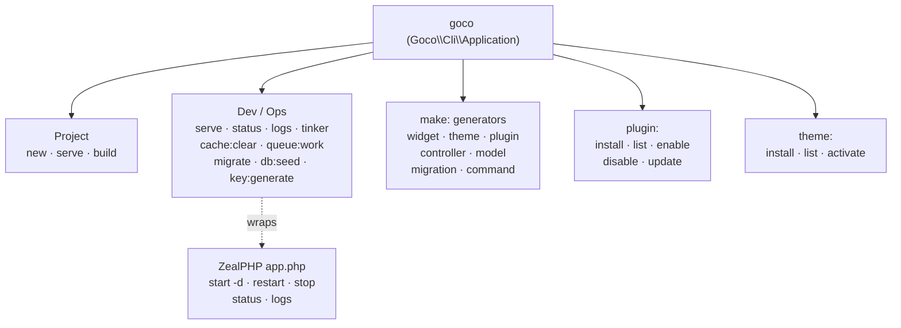
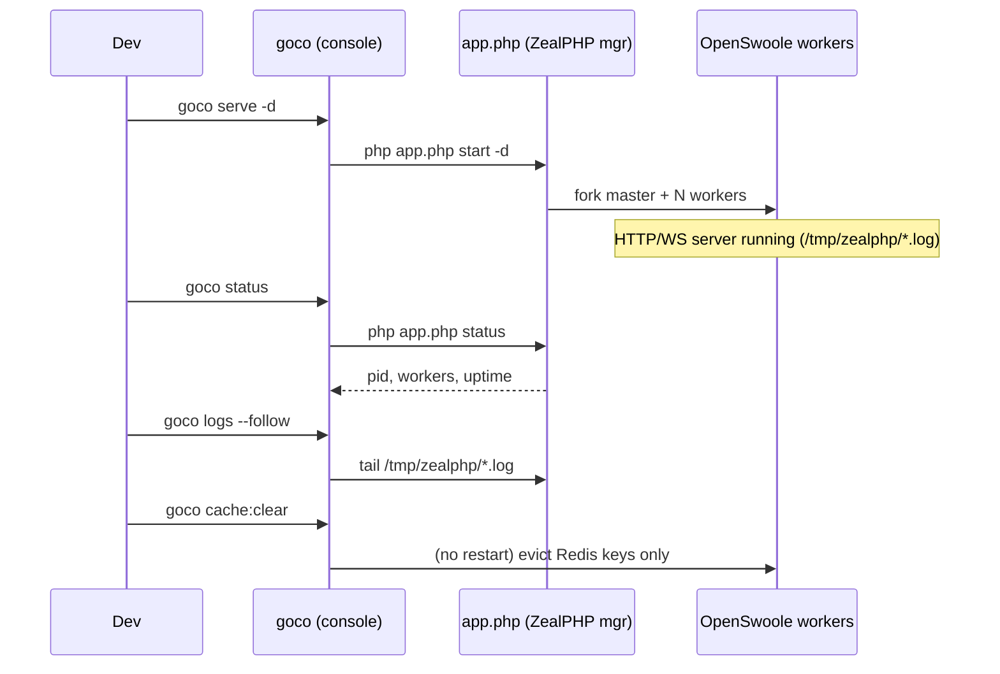

# CLI SDK

> The `goco` developer console — its full command surface, IO helpers, and the SDK for registering your own commands from plugins — and how it relates to the ZealPHP `app.php` process lifecycle.

`goco` is the human-facing developer and operations console for GOCO CMS: project scaffolding, code generators, database migrations, cache and queue operations, plugin and theme management, and an interactive REPL. It is a PHP console application (built on `gococms/cli`, namespace `Goco\Cli`) shipped as the `goco` binary at the repository root and on your `PATH` after `composer global require gococms/cli`.

`goco` is **not** the server. The long-running HTTP/WebSocket server is a ZealPHP process started with `php app.php` (foreground) or `php app.php start -d` (daemon). `goco serve` is a thin, developer-friendly wrapper around that lifecycle. This document covers the entire command surface, the extension SDK for adding commands from plugins, the IO/argument/option helpers, and the exact relationship between `goco` and ZealPHP's own process manager.

> **Note** — Stability: the command **contract** (names, arguments, primary options) is `stable` for the groups documented here. Interactive `tinker` internals and machine-readable `--json` envelopes are `beta`. Anything marked inline is called out explicitly.

---

## 1. Installation & Invocation

The binary is available three ways, in order of precedence resolved at runtime:

```bash
# 1. Project-local (preferred — pinned to the project's gococms/cli version)
./vendor/bin/goco status

# 2. Repository root shim (monorepo checkouts)
./goco status

# 3. Global install (scaffolding new projects, no project yet)
composer global require gococms/cli
goco new my-site
```

Every invocation follows the standard `goco <group>:<command> [arguments] [--options]` grammar (project-level commands like `new`, `serve`, `build` omit the group prefix).

```bash
goco                     # list every registered command, grouped
goco list                # same, explicit
goco help make:widget    # detailed help for one command
goco make:widget --help   # equivalent
goco --version           # print goco + core + ZealPHP + PHP versions
```

Global flags accepted by **every** command:

| Flag | Effect |
|------|--------|
| `-h`, `--help` | Show the command's synopsis and exit. |
| `-q`, `--quiet` | Suppress all output except errors. |
| `-v`, `-vv`, `-vvv` | Verbosity: normal, verbose, debug (stack traces). |
| `--no-ansi` / `--ansi` | Force color off / on (auto-detected by default). |
| `-n`, `--no-interaction` | Never prompt; fail instead of asking. Required in CI. |
| `--json` | Emit a machine-readable JSON envelope on stdout (where supported). `beta` |
| `--env=<name>` | Load `.env.<name>` before `.env`. Default: `GOCO_ENV` or `local`. |
| `--website=<id>` | Scope tenant-aware commands to a `website_id`. |
| `--workspace=<id>` | Scope tenant-aware commands to a `workspace_id`. |

Exit codes are POSIX-conventional and CI-friendly: `0` success, `1` general failure, `2` invalid usage/arguments, `3` misconfiguration, `4` dependency unavailable (Mongo/Redis unreachable), `130` interrupted (SIGINT). See the [CLI Reference](../reference/cli-reference.md#exit-codes) for the full table.

---

## 2. Command Map at a Glance



---

## 3. Project Commands

Bootstrap and run a project. These are the only commands that do not require an existing project in the working directory.

| Command | Usage | Description |
|---------|-------|-------------|
| `goco new` | `goco new <name> [--template=<slug>] [--git] [--no-install]` | Scaffold a new GOCO CMS project into `./<name>` from a starter template. |
| `goco serve` | `goco serve [--host=0.0.0.0] [--port=8080] [--watch] [-d]` | Start the ZealPHP dev server (foreground by default; `-d` daemonizes via `app.php start -d`). |
| `goco build` | `goco build [--env=production] [--no-assets] [--prune]` | Compile the production build: warm caches, build asset bundles, freeze the plugin/theme registry, verify indexes. |

### 3.1 `goco new`

```bash
goco new acme-site --template=blog --git
```

Scaffolds the standard monorepo-style project skeleton (`apps/`, `core/`, `packages/`, `docker/`, `app.php`, `composer.json`, `.env.example`), runs `composer install` unless `--no-install`, generates an `APP_KEY` via `key:generate`, and — with `--git` — initializes a repository with a Conventional-Commits-friendly `.gitignore`. Available `--template` slugs: `blank`, `blog`, `business`, `docs`, `saas`.

### 3.2 `goco serve`

`serve` is the developer's front door to the runtime. In the foreground it execs ZealPHP directly so you see live logs and coroutine output:

```bash
goco serve                 # foreground, http://0.0.0.0:8080  (Ctrl-C to stop)
goco serve --port=9501     # custom port
goco serve --watch         # restart workers on *.php / template changes (dev only)
goco serve -d              # daemonize -> delegates to: php app.php start -d
```

Under the hood `goco serve` composes and executes the ZealPHP bootstrap (see [ZealPHP Foundation](../architecture/zealphp-foundation.md)):

```php
// app.php — the runtime entry file goco serve drives
require 'vendor/autoload.php';

use ZealPHP\App;

App::superglobals(false);          // per-coroutine $_SESSION/$_GET isolation
App::mode(App::MODE_COROUTINE);    // modern default

$app = App::init(getenv('APP_HOST') ?: '0.0.0.0', (int)(getenv('APP_PORT') ?: 8080));

// Goco boots its container, hooks, plugins and routes here.
Goco\Kernel::boot($app);

$app->run();
```

> **Tip** — `--watch` uses OpenSwoole's inotify reload and is intended for `local` only. In production, do not use `--watch`; deploy the built image and let Traefik route to the container (see [Docker Architecture](../deployment/docker.md) and [Traefik Reverse Proxy](../deployment/traefik.md)).

### 3.3 `goco build`

```bash
goco build --env=production --prune
```

Runs the ordered release pipeline: (1) validate configuration and required services, (2) run pending migrations in `--check` mode (fails if drift), (3) build and fingerprint theme/widget asset bundles, (4) compile the plugin/theme registry into a cached manifest, (5) warm the route and hook caches into Redis, (6) with `--prune`, evict stale cache keys. The command is idempotent and safe to run in a Docker build stage.

---

## 4. Dev & Ops Commands

Day-to-day operational commands. All require a bootable project and reachable MongoDB/Redis (see [Configuration](../getting-started/configuration.md)).

| Command | Usage | Description |
|---------|-------|-------------|
| `goco status` | `goco status [--json]` | Print health of the runtime, MongoDB, Redis, storage, search, and the ZealPHP process. |
| `goco logs` | `goco logs [--follow] [--lines=200] [--level=info]` | Tail the ZealPHP process logs from `/tmp/zealphp/`. |
| `goco key:generate` | `goco key:generate [--show] [--force]` | Generate and persist `APP_KEY` (base64, 32 bytes) into `.env`. |
| `goco migrate` | `goco migrate [--check] [--pretend] [--step] [--to=<version>]` | Apply pending MongoDB schema/index migrations. |
| `goco migrate:rollback` | `goco migrate:rollback [--step=1] [--to=<version>]` | Revert the last migration batch (or to a target version). |
| `goco db:seed` | `goco db:seed [--class=<Seeder>] [--fresh]` | Populate collections with seed data (roles, demo content). |
| `goco cache:clear` | `goco cache:clear [--tag=<t>] [--store=<name>]` | Flush Redis-backed caches (route, hook, config, view, tag-scoped). |
| `goco queue:work` | `goco queue:work [--queue=default] [--tries=3] [--timeout=60] [--once]` | Run a queue worker consuming jobs from the `jobs` collection / Redis stream. |
| `goco tinker` | `goco tinker [--execute=<php>]` | Interactive coroutine-aware REPL bootstrapped with the full container. |

### 4.1 `goco status`

```bash
goco status
```

```text
GOCO CMS  0.7.3   (core 0.7.3 · ZealPHP 1.x · OpenSwoole 22.1 · PHP 8.4.2)
Runtime    ● running   pid 4812   workers 8   uptime 3h12m   mode COROUTINE
MongoDB    ● ok        gococms@mongodb:27017   ping 1.4ms   collections 31
Redis      ● ok        redis:6379   used 42MB   hit-rate 96.1%
Storage    ● ok        driver=minio   bucket=goco-media
Search     ● ok        provider=meilisearch   index=content   docs 12,904
Queue      ● ok        pending 3   reserved 0   failed 0
```

`--json` emits a stable envelope suitable for a Docker `HEALTHCHECK` or an uptime probe:

```bash
goco status --json | jq -e '.services[] | select(.status != "ok")' && exit 1 || echo healthy
```

### 4.2 `goco logs`

`goco logs` reads the ZealPHP process logs written to `/tmp/zealphp/` and merges structured application log lines:

```bash
goco logs --follow --level=warn          # live tail, warnings and above
goco logs --lines=500 | grep request.id  # last 500 lines
```

### 4.3 `goco key:generate`

```bash
goco key:generate           # writes APP_KEY=base64:... to .env if absent
goco key:generate --force   # rotate (re-encrypts nothing; rotate secrets deliberately)
goco key:generate --show    # print a new key without writing it
```

`APP_KEY` seeds the encrypter used for signed cookies, CSRF tokens, and at-rest field encryption. See [Security Model](../security/security-model.md).

### 4.4 `goco migrate` & `goco db:seed`

Migrations are versioned PHP classes under `database/migrations/` (timestamped, applied in order, recorded in a `migrations` collection). They create collections, apply JSON-Schema validators, and declare indexes idempotently — the document data layer is a lightweight mapper, not an ORM (see [MongoDB Data Layer](../architecture/database-mongodb.md)).

```bash
goco migrate                       # apply all pending
goco migrate --pretend             # print the operations without executing
goco migrate --check               # exit non-zero if migrations are pending (CI gate)
goco migrate:rollback --step=1     # undo the last batch
goco db:seed --class=RolesSeeder   # seed the RBAC roles/capabilities
goco db:seed --fresh               # drop soft-deletable demo data, then re-seed
```

A migration is a class with `up()` / `down()`:

```php
<?php
// database/migrations/2026_07_18_090000_create_forms_collection.php

namespace Goco\Database\Migrations;

use Goco\Database\Migration;
use Goco\Database\Schema;

final class CreateFormsCollection extends Migration
{
    public function up(Schema $schema): void
    {
        $schema->create('forms', function ($c) {
            $c->validator([
                'bsonType' => 'object',
                'required' => ['_id', 'workspace_id', 'website_id', 'slug', 'created_at'],
                'properties' => [
                    'slug'   => ['bsonType' => 'string'],
                    'fields' => ['bsonType' => 'array'],
                ],
            ]);
            $c->index(['workspace_id' => 1, 'website_id' => 1, 'slug' => 1], ['unique' => true]);
            $c->index(['deleted_at' => 1]);
        });
    }

    public function down(Schema $schema): void
    {
        $schema->drop('forms');
    }
}
```

### 4.5 `goco cache:clear` & `goco queue:work`

Both operate against Redis (cache, queue, realtime, locks — see [Caching, Queue & Realtime](../architecture/caching-and-queue.md)).

```bash
goco cache:clear                      # flush all managed cache stores
goco cache:clear --tag=widget         # evict only widget-tagged entries
goco queue:work --queue=emails --tries=5
goco queue:work --once                # process a single job then exit (cron-friendly)
```

`queue:work` is a long-running coroutine consumer. In containers, run it as a **separate** service replica of the `gococms` image with the command overridden to `goco queue:work`, so worker and web scale independently (see [Scaling Strategy](../deployment/scaling.md)).

### 4.6 `goco tinker`

`tinker` is a coroutine-aware REPL with the container, SDK facades, and models preloaded. Because it runs inside an OpenSwoole coroutine context, `co::sleep()`, channels, and `go()` work exactly as in the app.

```bash
goco tinker
```

```php
>>> use Goco\SDK\{Widget, Hook};
>>> Widget::properties('hero')->keys();
=> ["title", "subtitle", "image", "cta"]
>>> Hook::apply('page.title', 'Home');
=> "Home — Acme"
>>> go(fn() => \Goco\Database\Repository::for('pages')->count());
=> 42
```

```bash
goco tinker --execute='echo \Goco\Database\Repository::for("users")->count();'
```

---

## 5. `make:` Generators

Generators write idiomatic, PSR-4 scaffolding and register it where the engine expects it. All accept `--force` (overwrite) and `--dry-run` (print planned files).

| Command | Usage | Description |
|---------|-------|-------------|
| `make:widget` | `goco make:widget <Name> [--type=<slug>] [--preview]` | Scaffold a widget class + property schema + template + preview. |
| `make:theme` | `goco make:theme <Name> [--layouts=<a,b>]` | Scaffold a theme package with manifest, layouts, regions, assets. |
| `make:plugin` | `goco make:plugin <Name> [--with-routes] [--with-migration]` | Scaffold a plugin package with manifest and service provider. |
| `make:controller` | `goco make:controller <Name> [--api] [--resource]` | Scaffold a route handler / file-based REST controller. |
| `make:model` | `goco make:model <Name> [--collection=<c>] [--migration]` | Scaffold a document model bound to a MongoDB collection. |
| `make:migration` | `goco make:migration <name> [--collection=<c>]` | Scaffold a timestamped migration class. |
| `make:command` | `goco make:command <Name> [--group=<g>] [--plugin=<slug>]` | Scaffold a custom `goco` command class. |

### 5.1 `make:widget`

```bash
goco make:widget PricingTable --preview
```

Generates a class using the [Widget SDK](widget-sdk.md) facade signatures:

```php
<?php
// widgets/pricing-table/src/PricingTableWidget.php

namespace Acme\Widgets\PricingTable;

use Goco\SDK\Widget;
use Goco\Widget\Context;
use Goco\Widget\PropertySchema;

final class PricingTableWidget
{
    public static function register(): void
    {
        Widget::register('pricing-table', [
            'title'      => 'Pricing Table',
            'category'   => 'commerce',
            'properties' => self::properties(),
            'render'     => [self::class, 'render'],
            'preview'    => [self::class, 'preview'],
        ]);
    }

    public static function properties(): PropertySchema
    {
        return PropertySchema::make()
            ->text('heading', default: 'Pricing')
            ->repeater('plans', fn ($p) => $p->text('name')->number('price')->list('features'));
    }

    public static function render(array $props, ?Context $ctx = null): string
    {
        return \ZealPHP\App::renderToString('/widgets/pricing-table/template/pricing-table.php', $props);
    }

    public static function preview(array $props = []): string
    {
        return self::render($props + ['heading' => 'Pro', 'plans' => []]);
    }
}
```

See the [Widget Guide](../guides/widget-guide.md) for the full authoring workflow.

### 5.2 `make:model`

```bash
goco make:model Product --collection=collection_entries --migration
```

```php
<?php
// src/Models/Product.php

namespace App\Models;

use Goco\Database\Model;

final class Product extends Model
{
    protected string $collection = 'collection_entries';
    protected bool   $softDeletes = true;   // deleted_at
    protected bool   $timestamps  = true;   // created_at / updated_at
    protected bool   $tenant      = true;   // workspace_id + website_id
    protected bool   $versioned   = true;   // version + audit_logs
}
```

### 5.3 `make:controller`

```bash
goco make:controller Health --api
```

For `--api`, the generator writes a file-based REST endpoint — ZealPHP maps `api/health.php` to `GET /api/health` automatically (see [Routing](../core/routing.md)):

```php
<?php
// apps/api/api/health.php  ->  GET /api/health

use Goco\Database\Repository;

return [
    'status'    => 'ok',
    'pages'     => Repository::for('pages')->count(),
    'timestamp' => time(),
];
```

Without `--api`, it registers a Flask-style route on the `$app`:

```php
$app->route('/health/{scope}', function ($scope, $request, $response) {
    return ['status' => 'ok', 'scope' => $scope];
});
```

### 5.4 `make:command`

See [§8 Extending the CLI](#8-extending-the-cli-command-sdk).

---

## 6. `plugin:` Commands

Lifecycle management for plugins built on the [Plugin SDK](plugin-sdk.md). Plugins are registered, installed (migrations + assets), and booted (hooks + routes) — mirroring `Plugin::register/install/boot`.

| Command | Usage | Description |
|---------|-------|-------------|
| `plugin:install` | `goco plugin:install <slug> [--version=<v>] [--enable]` | Download/resolve a plugin from the marketplace or a path and run its installer. |
| `plugin:list` | `goco plugin:list [--enabled] [--json]` | List installed plugins with version, state, and provided hooks. |
| `plugin:enable` | `goco plugin:enable <slug>` | Activate an installed plugin (boots hooks/routes, fires `plugin.activated`). |
| `plugin:disable` | `goco plugin:disable <slug>` | Deactivate a plugin without removing it. |
| `plugin:update` | `goco plugin:update <slug> [--to=<v>] [--all]` | Update a plugin (runs new migrations, rebuilds assets). |

```bash
goco plugin:install gococms/seo-toolkit --enable
goco plugin:list --enabled
goco plugin:disable acme-analytics
goco plugin:update --all
```

`plugin:enable` invokes the plugin's boot path, which registers its permissions and routes:

```php
Plugin::register('acme-analytics', $manifest);
Plugin::install('acme-analytics');
Plugin::permissions(['analytics.view', 'analytics.manage']);
Plugin::routes(function ($registrar) {
    $registrar->nsRoute('acme-analytics', '/dashboard', [DashboardController::class, 'index']);
});
Plugin::boot('acme-analytics');
```

See the [Plugin Marketplace](../marketplace/overview.md) for distribution and the [Plugin Guide](../guides/plugin-guide.md) for authoring.

---

## 7. `theme:` Commands

Manage themes built on the [Theme SDK](theme-sdk.md).

| Command | Usage | Description |
|---------|-------|-------------|
| `theme:install` | `goco theme:install <slug> [--version=<v>]` | Install a theme package and register its layouts/regions/assets. |
| `theme:list` | `goco theme:list [--json]` | List installed themes and mark the active one per website. |
| `theme:activate` | `goco theme:activate <slug> [--website=<id>]` | Set the active theme for a website (tenant-scoped). |

```bash
goco theme:install gococms/aurora
goco theme:list
goco theme:activate aurora --website=64f...c1
```

`theme:activate` is tenant-aware: it updates the target website's `theme` setting and warms that theme's asset bundle. See [Multi-Tenancy](../architecture/multi-tenancy.md) and the [Theme Guide](../guides/theme-guide.md).

---

## 8. Extending the CLI (Command SDK)

Plugins and application code register custom `goco` commands by (1) writing a command class and (2) registering it in a service provider's `commands()` method. `goco` discovers commands from the core, from enabled plugins, and from the application at boot.

### 8.1 A command class

Extend `Goco\Cli\Command`. Declare the signature (name + arguments + options) with attributes or the `configure()` method, and put logic in `handle()`. Arguments and options are injected by name — the same reflection convention ZealPHP uses for routes.

```php
<?php
// packages/acme-analytics/src/Cli/ReportCommand.php

namespace Acme\Analytics\Cli;

use Goco\Cli\Command;
use Goco\Cli\IO;
use Goco\Cli\Attribute\{Argument, Option, AsCommand};

#[AsCommand(
    name: 'analytics:report',
    description: 'Generate a traffic report for a website and date range.',
    group: 'analytics',
)]
final class ReportCommand extends Command
{
    public function handle(
        IO $io,
        #[Argument('Website id to report on')] string $website,
        #[Option('Days to include', shortcut: 'd')] int $days = 30,
        #[Option('Write CSV to this path')] ?string $out = null,
    ): int {
        $io->title("Analytics report · website {$website}");

        $rows = $this->service(ReportService::class)->build($website, $days);

        $io->table(['Date', 'Views', 'Visitors'], $rows);

        if ($out !== null) {
            $io->progressStart(count($rows));
            // ... write rows, $io->progressAdvance() ...
            $io->progressFinish();
            $io->success("Report written to {$out}");
        }

        return self::SUCCESS;   // 0 ; also FAILURE (1), INVALID (2)
    }
}
```

Key points:

- `handle()` returns an `int` exit code (`self::SUCCESS`, `self::FAILURE`, `self::INVALID`).
- `#[Argument]` values are positional and required unless a default is given; `#[Option]` values are `--name=value` (or `-d` via `shortcut`). A `bool` option becomes a flag (`--force`).
- The container is available via `$this->service(Class::class)` and via constructor injection.
- Long-running work can spawn coroutines with `go()` and use `\OpenSwoole\Coroutine\Channel`, since `goco` runs commands inside a coroutine scheduler.

### 8.2 Registering commands in a service provider

A plugin's service provider (the same one that wires hooks and routes) declares its commands. `goco` collects them only from **enabled** plugins.

```php
<?php
// packages/acme-analytics/src/AnalyticsServiceProvider.php

namespace Acme\Analytics;

use Goco\Support\ServiceProvider;
use Acme\Analytics\Cli\ReportCommand;

final class AnalyticsServiceProvider extends ServiceProvider
{
    /** Commands contributed to the `goco` console. */
    public function commands(): array
    {
        return [
            ReportCommand::class,
        ];
    }

    public function boot(): void
    {
        // hooks, routes, bindings ...
    }
}
```

The application itself registers first-party commands the same way via `app/Providers/AppServiceProvider::commands()`. Alternatively, `goco make:command` scaffolds a class and wires the registration for you:

```bash
goco make:command SyncInventory --group=inventory
goco make:command Report --group=analytics --plugin=acme-analytics
```

### 8.3 IO & output helpers

`Goco\Cli\IO` is the single injected surface for input and output. It wraps ANSI styling, respects `--quiet`/`--no-ansi`/`--json`, and provides interactive prompts (disabled under `--no-interaction`).

| Helper | Purpose |
|--------|---------|
| `$io->title($s)` / `$io->section($s)` | Headings. |
| `$io->line($s)` / `$io->text($s)` | Plain output (`line` always shown, `text` respects verbosity). |
| `$io->info/comment/note/success/warning/error($s)` | Semantic, colorized blocks. |
| `$io->table($headers, $rows)` | Aligned table. |
| `$io->listing($items)` | Bulleted list. |
| `$io->json($data)` | Emit a JSON envelope (honors `--json`). |
| `$io->ask($q, $default=null)` | Free-text prompt. |
| `$io->secret($q)` | Hidden prompt (passwords/tokens). |
| `$io->confirm($q, $default=false)` | Yes/no prompt. |
| `$io->choice($q, $choices, $default=null)` | Single-choice menu. |
| `$io->progressStart($max)` / `progressAdvance()` / `progressFinish()` | Progress bar. |
| `$io->isVerbose()` / `isQuiet()` / `isInteractive()` | Environment introspection. |

```php
public function handle(IO $io): int
{
    if (! $io->confirm('Purge failed jobs?', default: false)) {
        $io->warning('Aborted.');
        return self::SUCCESS;
    }

    $store = $io->choice('Cache store', ['redis', 'array'], 'redis');
    $token = $io->secret('API token');

    $io->success("Using {$store}.");
    return self::SUCCESS;
}
```

> **Tip** — For scriptable output, prefer `$io->json(...)` guarded by `$io->isInteractive()`, and always pass `-n`/`--no-interaction` in CI so a missing answer fails fast instead of hanging.

---

## 9. `goco` vs. ZealPHP `app.php` Lifecycle

`goco` is a **console** that starts and exits per invocation. The **server** is a persistent ZealPHP/OpenSwoole process managed by `app.php`. Understanding the boundary prevents footguns (e.g., expecting `goco cache:clear` to restart workers — it does not).



ZealPHP's own process CLI is the authority for the running server; `goco` delegates to it:

| Intent | ZealPHP native | `goco` wrapper |
|--------|----------------|----------------|
| Foreground run | `php app.php` | `goco serve` |
| Daemonize | `php app.php start -d` | `goco serve -d` |
| Restart workers | `php app.php restart` | `goco serve --restart` |
| Stop | `php app.php stop` | `goco serve --stop` |
| Process status | `php app.php status` | `goco status` (adds Mongo/Redis/etc.) |
| Tail logs | `php app.php logs` | `goco logs` |

```bash
# Native ZealPHP lifecycle (always available, no project services needed)
php app.php                 # foreground
php app.php start -d        # background daemon
php app.php restart         # reload workers (pick up new code)
php app.php stop            # graceful shutdown
php app.php status          # pid / workers / uptime
php app.php logs            # /tmp/zealphp/ logs

# goco equivalents (add richer, service-aware output)
goco serve
goco serve -d
goco serve --restart
goco serve --stop
goco status
goco logs --follow
```

> **Warning** — Config, hook, and route changes are compiled at worker start. After enabling a plugin or activating a theme in a running server, reload workers (`php app.php restart` / `goco serve --restart`) so the new hooks and routes take effect. Code changes never hot-reload in production; `--watch` reloads are `local`-only.

In Docker, you do not call `goco serve` as the container command — the `gococms` image runs the ZealPHP process directly and Traefik routes to it. Use `goco` for one-shot operational tasks via `docker compose exec`:

```bash
docker compose exec gococms goco migrate
docker compose exec gococms goco cache:clear
docker compose exec gococms goco status --json
```

See [Docker Architecture](../deployment/docker.md), [Deployment Guide](../deployment/deployment-guide.md), and [Backup & Restore](../deployment/backup-restore.md).

---

## 10. CI/CD Recipes

```bash
# Fail the pipeline on schema drift or pending migrations
goco migrate --check -n || { echo "Pending migrations"; exit 1; }

# Build a production image layer
goco build --env=production --prune -n

# One-shot job container: run pending migrations then exit
docker compose run --rm gococms goco migrate -n

# Cron-driven queue drain (process available jobs, then exit)
goco queue:work --once -n
```

Always pass `-n`/`--no-interaction` in automation, and prefer `--json` where a machine consumes the output.

---

## Related

- [CLI Reference](../reference/cli-reference.md) — exhaustive flag-by-flag reference for every command.
- [Widget SDK](widget-sdk.md) · [Theme SDK](theme-sdk.md) · [Plugin SDK](plugin-sdk.md) · [Hook SDK](hook-sdk.md)
- [ZealPHP Foundation](../architecture/zealphp-foundation.md) — the runtime `goco serve` drives.
- [Routing](../core/routing.md) · [Plugin Engine](../core/plugin-engine.md) · [Theme Engine](../core/theme-engine.md)
- [MongoDB Data Layer](../architecture/database-mongodb.md) · [Caching, Queue & Realtime](../architecture/caching-and-queue.md)
- [Docker Architecture](../deployment/docker.md) · [Traefik Reverse Proxy](../deployment/traefik.md) · [Scaling Strategy](../deployment/scaling.md)
- [Configuration](../getting-started/configuration.md) · [Security Model](../security/security-model.md)
- [Documentation Index](../README.md)
