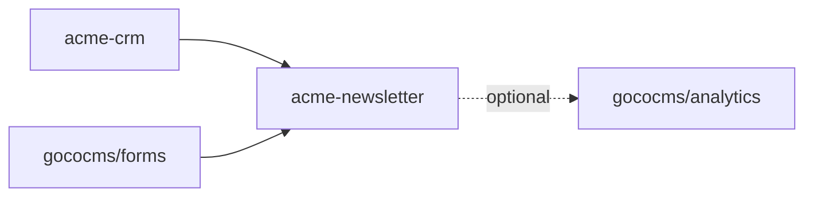

# Plugin SDK

> The stable, versioned developer surface for building GOCO CMS plugins — `Goco\SDK\Plugin` — covering the manifest, the ServiceProvider lifecycle, and every extension point a plugin can register.

**Stability:** `stable` · **Namespace:** `Goco\SDK\Plugin` · **Package:** `gococms/core` · **Since:** 0.4.0

The Plugin SDK is the contract between a plugin and the GOCO runtime. A plugin is a self-contained unit that extends the [Plugin Engine](../core/plugin-engine.md) by registering widgets, routes, hooks, CLI commands, settings pages, admin dashboards, MongoDB collections, migrations, scheduled jobs, and capabilities. This document is the **API reference** for the facade and manifest; for a hands-on walkthrough use the [Plugin Guide](../guides/plugin-guide.md), and to understand the engine that loads and sandboxes plugins read the [Plugin Engine](../core/plugin-engine.md).

Every symbol on this page is part of the SemVer-stable public API. Anything not documented here is internal and may change between minor releases.

---

## The facade at a glance

`Goco\SDK\Plugin` is a thin static facade over the plugin engine. Five methods make up the entire surface:

| Method | Signature | Purpose |
| --- | --- | --- |
| `register` | `Plugin::register(string $slug, array $manifest): void` | Declare a plugin and its metadata to the engine. |
| `install` | `Plugin::install(string $slug): void` | Run first-time installation (migrations, seeds, default settings). |
| `boot` | `Plugin::boot(string $slug): void` | Wire the plugin into the running app on every worker start. |
| `routes` | `Plugin::routes(callable $registrar): void` | Register HTTP/WS/SSE routes, namespaced under the plugin. |
| `permissions` | `Plugin::permissions(array $caps): void` | Declare the capabilities the plugin introduces. |

```php
use Goco\SDK\Plugin;

Plugin::register('acme-newsletter', require __DIR__ . '/plugin.php');
```

> **Note** — You rarely call `install()` and `boot()` yourself. The engine calls them at the correct lifecycle moment. You call `register()` from your entry file and implement the behaviour inside a **ServiceProvider** (see [ServiceProvider pattern](#serviceprovider-pattern)).

---

## `plugin.json` schema

Every plugin ships a `plugin.json` at its root. It is the static, machine-readable manifest used by the CLI, the marketplace, and the engine to resolve dependencies **before** any PHP is executed. The runtime `manifest` array passed to `Plugin::register()` (see below) is the dynamic counterpart; `plugin.json` is its source of truth and the two must agree on `slug` and `version`.

```json
{
  "$schema": "https://gococms.org/schema/plugin.schema.json",
  "slug": "acme-newsletter",
  "name": "Acme Newsletter",
  "version": "1.3.0",
  "description": "Double opt-in newsletter subscriptions, campaigns, and delivery.",
  "license": "MIT",
  "author": { "name": "Acme Inc.", "email": "dev@acme.example", "url": "https://acme.example" },
  "homepage": "https://acme.example/gococms/newsletter",
  "keywords": ["email", "newsletter", "marketing"],
  "category": "marketing",
  "icon": "assets/icon.svg",
  "screenshots": ["assets/list.png", "assets/campaign.png"],

  "entry": "src/NewsletterServiceProvider.php",
  "provider": "Acme\\Newsletter\\NewsletterServiceProvider",
  "namespace": "Acme\\Newsletter\\",
  "autoload": { "psr-4": { "Acme\\Newsletter\\": "src/" } },

  "engine": {
    "goco": ">=0.4.0 <1.0.0",
    "php": ">=8.4",
    "extensions": ["mongodb", "openswoole", "redis"]
  },

  "requires": {
    "gococms/forms": "^1.0",
    "acme-crm": ">=2.1.0"
  },
  "conflicts": { "legacy-mailer": "*" },
  "optional": { "gococms/analytics": "^1.0" },

  "provides": {
    "capabilities": ["newsletter.manage", "newsletter.send", "newsletter.subscribers.export"],
    "widgets": ["newsletter/signup", "newsletter/archive"],
    "collections": ["newsletter_subscribers", "newsletter_campaigns"],
    "settings": "settings"
  },

  "migrations": "database/migrations",
  "assets": { "admin": "assets/admin", "public": "assets/public" },
  "translations": "lang",

  "marketplace": {
    "pricing": "free",
    "support": "https://acme.example/support",
    "repository": "https://github.com/acme/gococms-newsletter"
  }
}
```

### Field reference

| Field | Type | Required | Notes |
| --- | --- | --- | --- |
| `slug` | string | yes | Kebab-case, globally unique on the marketplace. Immutable after publish. |
| `name` | string | yes | Human-readable display name. |
| `version` | string | yes | SemVer. Must match the `version` in the runtime manifest. |
| `license` | string | yes | SPDX identifier. GOCO core is MIT; plugins may choose their own. |
| `entry` | string | yes | Relative path to the ServiceProvider file. |
| `provider` | string | yes | Fully-qualified ServiceProvider class name. |
| `autoload.psr-4` | object | yes | PSR-4 map merged into the app autoloader at load time. |
| `engine.goco` | semver range | yes | Supported GOCO core range. The engine refuses to load on mismatch. |
| `engine.php` | semver range | yes | Minimum PHP; GOCO requires `>=8.4`. |
| `engine.extensions` | string[] | no | Required PHP extensions; checked at install. |
| `requires` | object | no | Hard dependencies — `gococms/*` Composer packages or other plugin slugs, each with a version constraint. |
| `conflicts` | object | no | Slugs that cannot be active simultaneously. |
| `optional` | object | no | Soft dependencies; the plugin degrades gracefully if absent. |
| `provides.capabilities` | string[] | no | `resource.action` capabilities this plugin introduces. Mirrors `Plugin::permissions()`. |
| `provides.collections` | string[] | no | MongoDB collections owned by the plugin (created via migrations). |
| `migrations` | string | no | Directory of migration classes. |
| `marketplace` | object | no | Metadata consumed by the [Plugin Marketplace](../marketplace/overview.md). |

> **Warning** — The `slug` and the PSR-4 root namespace are identity. Changing either after publishing breaks upgrades and orphans a plugin's data. Choose both carefully.

---

## Lifecycle overview

A plugin moves through discrete states. The engine drives the transitions; your ServiceProvider reacts to them.

```mermaid
stateDiagram-v2
    [*] --> Discovered: plugin.json read
    Discovered --> Registered: Plugin::register()
    Registered --> Installed: install() (once)
    Installed --> Active: activate() + boot()
    Active --> Inactive: deactivate()
    Inactive --> Active: activate() + boot()
    Active --> Updating: version bump
    Updating --> Active: update($from,$to) + migrate
    Inactive --> Uninstalled: uninstall()
    Uninstalled --> [*]
```

| Phase | When it runs | Called by | Idempotent? |
| --- | --- | --- | --- |
| `register` | Every process start, before the server accepts traffic | `Plugin::register()` in the entry file | yes |
| `install` | Once, on first activation | engine → `provider::install()` | must be |
| `activate` | Each time an operator enables the plugin | engine → `provider::activate()` | yes |
| `boot` | Every OpenSwoole worker start | engine → `provider::boot()` | yes |
| `update` | When the installed version differs from the packaged version | engine → `provider::update($from, $to)` | must be |
| `deactivate` | When an operator disables the plugin | engine → `provider::deactivate()` | yes |
| `uninstall` | When an operator removes the plugin | engine → `provider::uninstall()` | must be |

> **Note** — GOCO runs on [ZealPHP](../architecture/zealphp-foundation.md) atop OpenSwoole. `register()` and `boot()` run **per worker** on `App::onWorkerStart`. `install()`, `update()`, and `uninstall()` run **once**, out of band, under a Redis lock so concurrent workers never double-migrate. Keep `boot()` cheap and side-effect-free beyond wiring.

---

## ServiceProvider pattern

The recommended structure is a `ServiceProvider` extending `Goco\SDK\Plugin\ServiceProvider`. It splits concerns into two phases mirroring the ZealPHP/OpenSwoole model:

- **`register()`** — bind services into the [service container](../architecture/service-container.md). No I/O, no route registration, no hook dispatch. Runs for every plugin before any `boot()`.
- **`boot()`** — everything is now bound and resolvable; wire routes, hooks, widgets, jobs, and menus.

```php
<?php
namespace Acme\Newsletter;

use Goco\SDK\Plugin\ServiceProvider;
use Goco\SDK\{Plugin, Hook, Widget};
use Acme\Newsletter\Service\CampaignService;
use Acme\Newsletter\Service\SubscriberRepository;

final class NewsletterServiceProvider extends ServiceProvider
{
    public string $slug = 'acme-newsletter';

    /** Phase 1 — bind services. No side effects. */
    public function register(): void
    {
        $this->app->singleton(SubscriberRepository::class, fn($c) =>
            new SubscriberRepository($c->get('db')->collection('newsletter_subscribers'))
        );

        $this->app->singleton(CampaignService::class, fn($c) => new CampaignService(
            $c->get(SubscriberRepository::class),
            $c->get('mailer'),
            $c->get('queue'),
        ));

        // Declare the capabilities this plugin introduces.
        Plugin::permissions([
            'newsletter.manage',
            'newsletter.send',
            'newsletter.subscribers.export',
        ]);
    }

    /** Phase 2 — wire into the running app. Runs on every worker start. */
    public function boot(): void
    {
        $this->registerWidgets();
        $this->registerRoutes();
        $this->registerHooks();
        $this->registerCommands();
        $this->registerSettings();
        $this->registerDashboard();
        $this->registerSchedule();
    }

    private function registerHooks(): void
    {
        Hook::listen('user.registered', function (array $user) {
            $this->app->get(SubscriberRepository::class)->subscribeFromUser($user);
        });

        Hook::filter('menu.items', fn(array $items) => $this->injectAdminMenu($items), 20);
    }

    // ... registerWidgets(), registerRoutes(), etc. shown in sections below.
}
```

The entry file referenced by `plugin.json → entry` simply hands the provider to the engine:

```php
<?php
// src/entry.php (or wherever plugin.json → entry points)
use Goco\SDK\Plugin;

Plugin::register('acme-newsletter', [
    'version'  => '1.3.0',
    'provider' => \Acme\Newsletter\NewsletterServiceProvider::class,
]);
```

> **Tip** — `$this->app` is the GOCO application container (see [Service Container](../architecture/service-container.md)). `$this->config('key', $default)` reads merged plugin settings, and `$this->path('database/migrations')` resolves a path relative to the plugin root.

---

## Registering widgets

Register widget types through the [Widget SDK](./widget-sdk.md). Namespace widget types with your plugin slug to avoid collisions.

```php
use Goco\SDK\Widget;

private function registerWidgets(): void
{
    Widget::register('newsletter/signup', [
        'label'      => 'Newsletter Signup',
        'category'   => 'marketing',
        'icon'       => 'mail-plus',
        'properties' => [
            'heading'     => ['type' => 'string', 'default' => 'Subscribe'],
            'list_id'     => ['type' => 'select', 'source' => 'newsletter.lists', 'required' => true],
            'double_optin'=> ['type' => 'boolean', 'default' => true],
        ],
        'render' => [\Acme\Newsletter\Widget\SignupWidget::class, 'render'],
    ]);

    // Class-based alternative for complex widgets.
    Widget::register('newsletter/archive', \Acme\Newsletter\Widget\ArchiveWidget::class);
}
```

See the [Widget SDK](./widget-sdk.md) and [Widget Guide](../guides/widget-guide.md) for the full property schema, `Context`, and preview APIs.

---

## Registering routes

`Plugin::routes()` receives a registrar bound to a plugin-scoped router. All routes are automatically prefixed and their names namespaced under the slug, so two plugins can both expose `/subscribe` without clashing. Handlers use ZealPHP's Flask-style reflection injection — parameters are resolved by name from the path, plus `$request` and `$response`.

```php
use Goco\SDK\Plugin;

private function registerRoutes(): void
{
    Plugin::routes(function ($r) {
        // Public API: POST /plugins/acme-newsletter/subscribe
        $r->post('/subscribe', [\Acme\Newsletter\Http\SubscribeController::class, 'store']);

        // Confirmation link with a path param (reflection-injected by name).
        $r->get('/confirm/{token}', function (string $token, $response) {
            return app(\Acme\Newsletter\Service\SubscriberRepository::class)->confirm($token)
                ? ['confirmed' => true]
                : $response->status(410)->json(['error' => 'expired']);
        });

        // Admin-only routes gated by a capability.
        $r->group(['capability' => 'newsletter.manage', 'area' => 'admin'], function ($r) {
            $r->get('/campaigns', [\Acme\Newsletter\Http\Admin\CampaignController::class, 'index']);
            $r->post('/campaigns/{id}/send', [\Acme\Newsletter\Http\Admin\CampaignController::class, 'send']);
        });

        // Realtime delivery progress over a WebSocket.
        $r->ws('/campaigns/{id}/progress', [\Acme\Newsletter\Ws\ProgressSocket::class, 'handle']);
    });
}
```

Handlers may return `int|array|string|Generator`; arrays serialize to JSON, generators stream. File-based REST endpoints under a plugin's `api/` directory are also auto-mapped (e.g. `api/stats.php` → `GET /plugins/acme-newsletter/api/stats`). See [Routing](../core/routing.md) for precedence and pattern rules.

> **Note** — Route middleware such as capability gating, CSRF, and rate limiting come from ZealPHP's PSR-15 middleware stack. The `capability` group option resolves against the [Permission System](../architecture/permission-system.md).

---

## Registering hooks and filters

Wire into the [Event & Hook System](../architecture/event-hook-system.md) with the [Hook SDK](./hook-sdk.md). Actions follow `subject.verb[.tense]`; filters follow `subject.noun`.

```php
use Goco\SDK\Hook;

// Action: react to a lifecycle event.
Hook::listen('content.published', function (array $page) {
    if (($page['type'] ?? null) === 'post') {
        app(\Acme\Newsletter\Service\CampaignService::class)->queueDigest($page['_id']);
    }
}, priority: 20);

// Filter: transform a value in the pipeline.
Hook::filter('page.title', function (string $title, array $ctx) {
    return $ctx['is_newsletter_archive'] ?? false ? "Newsletter — {$title}" : $title;
});

// Dispatch your own namespaced action for other plugins to extend.
Hook::dispatch('acme-newsletter.subscriber.confirmed', $subscriber);
```

Plugin-defined hooks **must** be namespaced with the slug (`acme-newsletter.*`). Document them so downstream plugins can listen. See the [Hook SDK](./hook-sdk.md) for `dispatchAsync`, priorities, and the full action/filter catalog.

---

## Registering CLI commands

Plugins extend the `goco` developer CLI. Register commands in `boot()`; they appear under a slug-prefixed namespace and are discoverable via `goco list`.

```php
use Goco\SDK\Plugin\Console\Command;

private function registerCommands(): void
{
    $this->commands([
        \Acme\Newsletter\Console\SendPendingCommand::class,
        \Acme\Newsletter\Console\ImportSubscribersCommand::class,
    ]);
}
```

```php
<?php
namespace Acme\Newsletter\Console;

use Goco\SDK\Plugin\Console\Command;

final class SendPendingCommand extends Command
{
    // Invoked as: goco newsletter:send-pending --limit=500
    protected string $signature = 'newsletter:send-pending {--limit=100 : Max campaigns per run}';
    protected string $description = 'Dispatch queued newsletter campaigns.';

    public function handle(): int
    {
        $limit = (int) $this->option('limit');
        $sent = app(\Acme\Newsletter\Service\CampaignService::class)->dispatchPending($limit);
        $this->info("Dispatched {$sent} campaigns.");
        return self::SUCCESS;
    }
}
```

See the [CLI SDK](./cli.md) and [CLI Reference](../reference/cli-reference.md) for arguments, options, prompts, and progress bars.

---

## Registering settings pages

Declare a settings schema; GOCO renders the admin form, validates input, and persists to the `settings` collection scoped to `(workspace_id, website_id, plugin_slug)`. Read values with `$this->config()`.

```php
use Goco\SDK\Plugin\Settings;

private function registerSettings(): void
{
    Settings::page($this->slug, [
        'title'      => 'Newsletter',
        'capability' => 'newsletter.manage',
        'sections'   => [
            'delivery' => [
                'label'  => 'Delivery',
                'fields' => [
                    'from_name'  => ['type' => 'string', 'label' => 'From name', 'default' => 'Acme'],
                    'from_email' => ['type' => 'email',  'label' => 'From address', 'required' => true],
                    'batch_size' => ['type' => 'integer','label' => 'Batch size', 'default' => 200, 'min' => 1, 'max' => 2000],
                    'provider'   => ['type' => 'select', 'options' => ['smtp' => 'SMTP', 'ses' => 'Amazon SES']],
                ],
            ],
            'optin' => [
                'label'  => 'Opt-in',
                'fields' => [
                    'double_optin' => ['type' => 'boolean', 'label' => 'Require confirmation', 'default' => true],
                    'consent_text' => ['type' => 'richtext', 'label' => 'Consent statement'],
                ],
            ],
        ],
    ]);
}
```

```php
// Reading settings anywhere in the plugin:
$batch = $this->config('delivery.batch_size', 200);
```

> **Tip** — Field types map to admin form controls and to JSON-Schema validators applied before persistence. Secrets (`type => 'secret'`) are encrypted at rest and never returned to the client in plaintext.

---

## Registering an admin dashboard

Register a dashboard panel (a menu entry plus a rendered surface) for the admin app. The route is capability-gated and rendered through the [Template Engine](../core/template-engine.md).

```php
use Goco\SDK\Plugin\Admin;

private function registerDashboard(): void
{
    Admin::menu($this->slug, [
        'label'      => 'Newsletter',
        'icon'       => 'mail',
        'capability' => 'newsletter.manage',
        'position'   => 60,
        'children'   => [
            ['label' => 'Subscribers', 'route' => 'acme-newsletter.subscribers.index'],
            ['label' => 'Campaigns',   'route' => 'acme-newsletter.campaigns.index'],
            ['label' => 'Settings',    'route' => 'settings.acme-newsletter'],
        ],
    ]);

    Admin::dashboardCard($this->slug . '.summary', [
        'capability' => 'newsletter.manage',
        'size'       => 'md',
        'render'     => [\Acme\Newsletter\Admin\SummaryCard::class, 'render'],
    ]);
}
```

The `render` callback returns HTML (or an `App::fragment()` for htmx regions). Admin assets declared in `plugin.json → assets.admin` are versioned and served through the [storage/asset pipeline](../architecture/storage.md).

---

## MongoDB collections and migrations

Plugins own collections through the [MongoDB Data Layer](../architecture/database-mongodb.md) using the repository pattern from `Goco\Database` — a lightweight document mapper, **not** a heavy ORM. Every collection a plugin creates must be listed in `plugin.json → provides.collections`, follow snake_case plural naming, and carry the standard document envelope: `_id, created_at, updated_at, deleted_at, version, created_by, updated_by`, plus `workspace_id` and `website_id` on tenant-scoped documents.

Migrations are versioned classes discovered under `plugin.json → migrations`. The engine runs `up()` on install/update and `down()` on rollback/uninstall, inside a Redis lock, recording applied migrations in the plugin's install record.

```php
<?php
namespace Acme\Newsletter\Database\Migrations;

use Goco\Database\Migration;
use Goco\Database\Schema;

final class M20260701_000001_CreateSubscribers extends Migration
{
    public function up(Schema $schema): void
    {
        $schema->createCollection('newsletter_subscribers', [
            // MongoDB JSON-Schema validator.
            'validator' => [
                '$jsonSchema' => [
                    'bsonType' => 'object',
                    'required' => ['workspace_id', 'website_id', 'email', 'status', 'created_at'],
                    'properties' => [
                        'email'  => ['bsonType' => 'string', 'pattern' => '^.+@.+$'],
                        'status' => ['enum' => ['pending', 'confirmed', 'unsubscribed']],
                        'list_id'=> ['bsonType' => 'objectId'],
                    ],
                ],
            ],
        ]);

        $schema->collection('newsletter_subscribers')->indexes([
            ['keys' => ['workspace_id' => 1, 'website_id' => 1, 'email' => 1], 'unique' => true, 'name' => 'uniq_tenant_email'],
            ['keys' => ['status' => 1, 'list_id' => 1], 'name' => 'status_list'],
            ['keys' => ['confirm_token' => 1], 'name' => 'confirm_token', 'sparse' => true],
        ]);
    }

    public function down(Schema $schema): void
    {
        $schema->dropCollection('newsletter_subscribers');
    }
}
```

```php
// Repository usage inside a service.
use Goco\Database\Repository;

final class SubscriberRepository extends Repository
{
    protected string $collection = 'newsletter_subscribers';

    public function confirm(string $token): bool
    {
        return (bool) $this->updateWhere(
            ['confirm_token' => $token, 'status' => 'pending'],
            ['$set' => ['status' => 'confirmed', 'confirmed_at' => new \MongoDB\BSON\UTCDateTime()]]
        );
    }
}
```

> **Warning** — Cross-collection invariants (e.g. deleting a list and reassigning its subscribers) must run in a **multi-document transaction**. Never write raw indexes outside a migration — undocumented indexes drift between environments. See the [Data Model](../architecture/data-model.md) for the collection catalog and index conventions.

---

## Scheduled jobs

Register recurring or deferred work through the [Queue & Realtime layer](../architecture/caching-and-queue.md) (Redis-backed). Under the hood, cron-style schedules are driven by ZealPHP timers (`App::tick`) on a single elected worker, while ad-hoc jobs are enqueued to Redis and consumed by workers.

```php
use Goco\SDK\Plugin\Schedule;

private function registerSchedule(): void
{
    Schedule::job($this->slug)
        ->command('newsletter:send-pending --limit=500')
        ->everyFiveMinutes()
        ->withoutOverlapping()      // Redis lock; skips if the previous run is active.
        ->onOneWorker();            // Runs on the elected leader only.

    Schedule::job($this->slug)
        ->call([\Acme\Newsletter\Service\CampaignService::class, 'purgeUnconfirmed'])
        ->dailyAt('03:15')
        ->timezone('UTC');
}
```

Deferred, one-off jobs are dispatched imperatively:

```php
use Goco\SDK\Plugin\Queue;

Queue::dispatch(new \Acme\Newsletter\Jobs\SendCampaign($campaignId))
    ->onQueue('newsletter')
    ->delay(30);
```

---

## Declaring capabilities

`Plugin::permissions()` registers the `resource.action` capabilities a plugin introduces so they become assignable in the [Permission System](../architecture/permission-system.md) (RBAC + optional ABAC), scoped per `(workspace, website)`. Declare the same list in `plugin.json → provides.capabilities` for static resolution.

```php
Plugin::permissions([
    'newsletter.manage',              // full admin
    'newsletter.send',               // dispatch campaigns
    'newsletter.subscribers.export', // GDPR export
]);
```

Optionally map default grants onto existing roles at install time:

```php
public function install(): void
{
    // ...migrations run automatically; grant sensible defaults:
    $this->grant('marketing', ['newsletter.manage', 'newsletter.send']);
    $this->grant('editor', ['newsletter.manage']);
}
```

> **Note** — Capabilities are additive and namespaced by resource. Do not reuse a core capability name (`pages.*`, `users.*`, etc.); prefix with your plugin's resource domain instead. The 13 hierarchical roles and core capability strings are defined in the [Permission System](../architecture/permission-system.md).

---

## Dependencies and version constraints

Dependencies are resolved from `plugin.json` **before** any plugin PHP runs, so a broken dependency graph fails fast at load with a clear error rather than mid-request.

- **`requires`** — hard dependencies. Each entry is either a Composer package (`gococms/forms`) or a plugin slug (`acme-crm`), paired with a SemVer constraint (`^1.0`, `>=2.1.0 <3.0.0`). The plugin will not activate unless all are satisfied.
- **`conflicts`** — slugs that cannot be active at the same time. Activation is refused if a conflict is active.
- **`optional`** — soft dependencies. The plugin activates regardless; guard usage at runtime.
- **`engine.goco` / `engine.php` / `engine.extensions`** — platform constraints checked at install.

```php
// Guarding an optional dependency at runtime.
if (Plugin::isActive('gococms/analytics')) {
    Hook::dispatch('acme-newsletter.metric.recorded', $event);
}
```

The engine performs **topological ordering** using the dependency graph, so a plugin's `register()`/`boot()` always run after its hard dependencies. Circular hard dependencies are rejected at load.



---

## Install, activate, deactivate, uninstall, and update hooks

Implement the lifecycle methods on your ServiceProvider. The engine invokes them at the right moment; you never call them directly.

```php
final class NewsletterServiceProvider extends ServiceProvider
{
    /** Once, on first activation. Migrations run automatically before this. */
    public function install(): void
    {
        $this->config()->setDefaults([
            'delivery.batch_size' => 200,
            'optin.double_optin'  => true,
        ]);
        $this->grant('marketing', ['newsletter.manage', 'newsletter.send']);
    }

    /** Each time the plugin is enabled. Keep it idempotent. */
    public function activate(): void
    {
        Hook::dispatch('acme-newsletter.activated');
    }

    /** Each time the plugin is disabled. Stop timers/consumers; keep data. */
    public function deactivate(): void
    {
        Schedule::forget($this->slug);
    }

    /**
     * When packaged version > installed version. Must be idempotent and
     * safe to re-run. New migrations run automatically around this call.
     */
    public function update(string $from, string $to): void
    {
        if (version_compare($from, '1.2.0', '<')) {
            // Backfill introduced in 1.2.0.
            app(SubscriberRepository::class)->backfillConsentTimestamps();
        }
    }

    /** On removal. Drop owned collections/settings ONLY if the operator opts in. */
    public function uninstall(bool $purgeData = false): void
    {
        // Migrations' down() run automatically when $purgeData is true.
        if ($purgeData) {
            $this->config()->deleteAll();
        }
    }
}
```

Lifecycle events are also broadcast on the global hook bus so other plugins can react: `plugin.installed`, `plugin.activated`, `plugin.deactivated`, `plugin.updated`, `plugin.uninstalled` — each carrying the slug and version.

> **Warning** — `uninstall()` is destructive when `$purgeData` is true. Respect the operator's choice: default to preserving data. Soft-deleted documents (`deleted_at`) remain recoverable per the [Backup & Restore](../deployment/backup-restore.md) policy until purged.

---

## Packaging and publishing to the marketplace

A publishable plugin is a directory (or Composer package) with this layout:

```text
acme-newsletter/
├── plugin.json                 # manifest (required)
├── composer.json               # if distributed via Composer
├── README.md
├── LICENSE
├── src/
│   ├── NewsletterServiceProvider.php
│   ├── Http/  Ws/  Console/  Service/  Widget/  Admin/  Jobs/
├── database/migrations/
├── assets/{admin,public}/
├── lang/
├── template/
└── tests/
```

Validate, build, and publish with the `goco` CLI:

```bash
# 1. Lint the manifest and static structure against the plugin schema.
goco plugin:validate .

# 2. Run the plugin test suite in an isolated harness.
goco plugin:test

# 3. Build a signed, versioned artifact (tarball + checksum + SBOM).
goco plugin:build --version 1.3.0

# 4. Authenticate and publish to the marketplace registry.
goco plugin:login
goco plugin:publish dist/acme-newsletter-1.3.0.gpk
```

Publishing rules enforced by the registry:

- `slug` is claimed once and immutable; releases are **append-only** SemVer versions.
- Every release is signed; the engine verifies the signature before install.
- `engine.goco` must resolve against a currently supported core range.
- Conventional Commits + a `changelog.md` entry are required for each release.
- Security-relevant releases may be yanked; yanked versions stay installed but are not offered to new installs.

Installation from the marketplace is symmetric:

```bash
goco plugin:install acme-newsletter          # latest compatible
goco plugin:install acme-newsletter@1.3.0     # pinned
goco plugin:update acme-newsletter
goco plugin:activate acme-newsletter
```

See the [Plugin Marketplace](../marketplace/overview.md) for listing metadata, pricing tiers, review, and update-channel details.

> **Note** — In Docker deployments, plugins persist on the `gococms` service's mounted volume and survive container recycling. Optional [Watchtower](../deployment/docker.md) updates the container image, not plugins — plugin updates always go through `goco plugin:update` so migrations run under lock.

---

## Testing plugins

The SDK ships a test harness (`Goco\SDK\Plugin\Testing`) that boots a minimal app with an ephemeral MongoDB database and Redis namespace, loads only your plugin and its declared dependencies, and rolls everything back after each test.

```php
<?php
namespace Acme\Newsletter\Tests;

use Goco\SDK\Plugin\Testing\PluginTestCase;
use Acme\Newsletter\Service\SubscriberRepository;

final class SubscribeTest extends PluginTestCase
{
    protected string $plugin = 'acme-newsletter';

    public function test_subscribe_creates_pending_subscriber(): void
    {
        $this->installPlugin();               // runs migrations + install()

        $res = $this->post('/plugins/acme-newsletter/subscribe', [
            'email'   => 'reader@example.com',
            'list_id' => $this->fixtureListId(),
        ]);

        $res->assertStatus(202);
        $this->assertCollectionHas('newsletter_subscribers', [
            'email'  => 'reader@example.com',
            'status' => 'pending',
        ]);
    }

    public function test_confirmation_marks_subscriber_confirmed(): void
    {
        $this->installPlugin();
        $sub = $this->makeSubscriber(['status' => 'pending', 'confirm_token' => 'tok-1']);

        $this->get('/plugins/acme-newsletter/confirm/tok-1')->assertOk();

        $this->assertTrue($this->app->get(SubscriberRepository::class)->isConfirmed($sub['_id']));
    }

    public function test_capabilities_are_registered(): void
    {
        $this->installPlugin();
        $this->assertCapabilityExists('newsletter.send');
    }
}
```

Useful harness affordances:

| Helper | Purpose |
| --- | --- |
| `installPlugin()` / `activatePlugin()` | Drive the lifecycle exactly as production does. |
| `get()/post()/put()/delete()` | Exercise plugin routes with full middleware. |
| `assertCollectionHas()` / `assertCollectionMissing()` | Assert MongoDB state. |
| `fakeQueue()` / `assertJobDispatched()` | Assert scheduled/deferred jobs without running them. |
| `actingAs($user, $caps)` | Run a request under a specific role/capability set. |
| `assertHookDispatched()` / `assertFilterApplied()` | Assert hook interactions. |

Run them with the CLI:

```bash
goco plugin:test                       # full suite in the isolated harness
goco plugin:test --filter Subscribe    # a subset
goco plugin:test --coverage            # with coverage report
```

See the project-wide [Testing Strategy](../community/testing-strategy.md) for coverage expectations, CI wiring, and integration-vs-unit boundaries.

---

## Complete minimal example

A whole functional plugin in one provider — the smallest useful shape.

```php
<?php
namespace Acme\Hello;

use Goco\SDK\Plugin\ServiceProvider;
use Goco\SDK\{Plugin, Hook};

final class HelloServiceProvider extends ServiceProvider
{
    public string $slug = 'acme-hello';

    public function register(): void
    {
        Plugin::permissions(['hello.read']);
    }

    public function boot(): void
    {
        Plugin::routes(function ($r) {
            $r->get('/greet/{name}', fn(string $name) => ['message' => "Hello, {$name}!"]);
        });

        Hook::filter('page.title', fn(string $t) => "{$t} · Acme");
    }
}
```

```json
{
  "slug": "acme-hello",
  "name": "Acme Hello",
  "version": "0.1.0",
  "license": "MIT",
  "entry": "src/entry.php",
  "provider": "Acme\\Hello\\HelloServiceProvider",
  "autoload": { "psr-4": { "Acme\\Hello\\": "src/" } },
  "engine": { "goco": ">=0.4.0 <1.0.0", "php": ">=8.4" },
  "provides": { "capabilities": ["hello.read"] }
}
```

---

## Related

- [Plugin Engine](../core/plugin-engine.md) — the engine that discovers, sandboxes, and runs plugins.
- [Plugin Guide](../guides/plugin-guide.md) — a step-by-step tutorial building a plugin end to end.
- [Plugin Marketplace](../marketplace/overview.md) — listing, publishing, pricing, and updates.
- [Widget SDK](./widget-sdk.md) · [Theme SDK](./theme-sdk.md) · [Hook SDK](./hook-sdk.md) · [CLI SDK](./cli.md)
- [Event & Hook System](../architecture/event-hook-system.md) · [Service Container](../architecture/service-container.md)
- [MongoDB Data Layer](../architecture/database-mongodb.md) · [Data Model](../architecture/data-model.md)
- [Permission System](../architecture/permission-system.md) · [Caching, Queue & Realtime](../architecture/caching-and-queue.md)
- [Routing](../core/routing.md) · [Template Engine](../core/template-engine.md) · [ZealPHP Foundation](../architecture/zealphp-foundation.md)
- [CLI Reference](../reference/cli-reference.md) · [Testing Strategy](../community/testing-strategy.md) · [Docker Architecture](../deployment/docker.md)
- [Documentation Index](../README.md)
