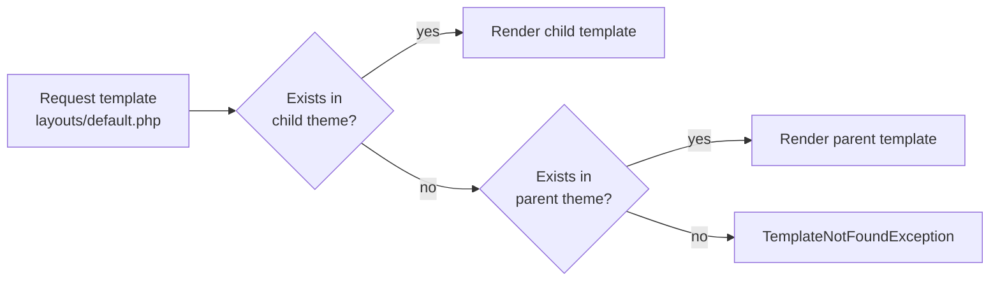

# Theme SDK

> The stable, versioned API surface for building, registering, and extending GOCO CMS themes — `Goco\SDK\Theme` plus the `theme.json` manifest, layouts, regions, asset bundles, the customizer, child themes, partials, and i18n.

**Stability:** `stable` · **Namespace:** `Goco\SDK\Theme` · **Package:** `gococms/template-engine` (facade), `gococms/core` (runtime)

The Theme SDK is the public contract between a theme package and the GOCO runtime. A theme contributes the visual layer of a website: its **layouts** (page skeletons), **regions** (named insertion points that hold widgets), its **asset bundle** (CSS/JS/fonts with dependency + version metadata), and its **settings schema** (surfaced in the visual customizer). Everything a theme declares is validated against the `theme.json` manifest and exposed through four facade methods. This document is the reference for those methods and the manifest schema; for conceptual background and the render internals see [../core/theme-engine.md](../core/theme-engine.md), and for a hands-on build walkthrough see [../guides/theme-guide.md](../guides/theme-guide.md).

---

## The API Surface

Four static methods on the `Theme` facade cover the entire lifecycle. All signatures are frozen for the 1.x line.

```php
use Goco\SDK\Theme;

// Register a theme from its manifest.
Theme::register(string $slug, array $manifest): void;

// Enumerate the layouts a registered theme exposes.
Theme::layouts(string $slug): array;

// Enumerate the regions a given layout exposes.
Theme::regions(string $layout): array;

// Resolve the compiled asset bundle for a theme.
Theme::assets(string $slug): AssetBundle;
```

| Method | Returns | When to call | Idempotent |
|--------|---------|--------------|------------|
| `Theme::register()` | `void` | Theme boot (once per process) | Yes — re-registering the same slug replaces the definition |
| `Theme::layouts()` | `array<string, Layout>` | Page-builder layout picker, router | Yes (read-only) |
| `Theme::regions()` | `array<string, Region>` | Rendering pipeline, editor drop-zones | Yes (read-only) |
| `Theme::assets()` | `AssetBundle` | Rendering pipeline, `<head>` assembly | Yes (memoized per request) |

> **Note** — The SDK is a thin, stable facade. It delegates to `Goco\TemplateEngine\ThemeRegistry` internally, but you should only ever depend on `Goco\SDK\Theme`. Internal classes may change between minor versions; the facade will not.

---

## Registering a Theme

A theme is a Composer package whose `boot()` entry point calls `Theme::register()`. GOCO discovers installed themes at worker start, so registration happens inside `App::onWorkerStart()` — once per OpenSwoole worker, not per request.

```php
// themes/aurora/src/bootstrap.php
use Goco\SDK\Theme;
use ZealPHP\App;

App::onWorkerStart(function ($server, $workerId) {
    // Load the manifest and register. The manifest path is resolved
    // relative to the theme package root.
    $manifest = json_decode(
        file_get_contents(__DIR__ . '/../theme.json'),
        associative: true,
        flags: JSON_THROW_ON_ERROR
    );

    Theme::register('aurora', $manifest);
});
```

You may also pass an inline array instead of loading `theme.json`, which is convenient for tests and for themes generated programmatically:

```php
Theme::register('aurora', [
    'name'       => 'Aurora',
    'slug'       => 'aurora',
    'version'    => '2.4.0',
    'frameworks' => ['tailwind@3.4'],
    'layouts'    => [
        'default' => [
            'template' => 'layouts/default.php',
            'regions'  => ['header', 'main', 'sidebar', 'footer'],
        ],
    ],
    'regions'  => [
        'header'  => ['label' => 'Header',  'max_widgets' => 1],
        'main'    => ['label' => 'Main',     'constrained' => false],
        'sidebar' => ['label' => 'Sidebar',  'max_widgets' => 8],
        'footer'  => ['label' => 'Footer'],
    ],
    'settings' => [ /* customizer schema — see below */ ],
    'assets'   => [ /* AssetBundle definition — see below */ ],
    'supports' => ['dark-mode', 'rtl', 'editor-styles', 'custom-logo'],
]);
```

> **Warning** — `Theme::register()` validates the manifest against the `theme.json` JSON-Schema and throws `Goco\TemplateEngine\Exception\InvalidManifestException` on failure. Do not swallow this exception during boot; a malformed theme should fail loudly at worker start rather than render a broken page at request time.

---

## The `theme.json` Manifest

`theme.json` is the single source of truth for a theme. It lives at the theme package root and is validated by a JSON-Schema shipped in `packages/template-engine/schema/theme.schema.json`.

### Top-level fields

| Field | Type | Required | Purpose |
|-------|------|----------|---------|
| `name` | `string` | ✔ | Human-readable display name |
| `slug` | `string` | ✔ | URL-safe unique id; must match the registration slug and folder name |
| `version` | `string` (SemVer) | ✔ | Theme version; drives cache-busting and upgrade logic |
| `frameworks` | `string[]` | — | CSS/JS frameworks the theme builds on, `name@range` form (e.g. `tailwind@3.4`, `bootstrap@5.3`, `vanilla`) |
| `layouts` | `object` | ✔ | Map of layout key → layout definition |
| `regions` | `object` | ✔ | Map of region key → region definition |
| `settings` | `object` | — | Customizer settings schema (panels → sections → controls) |
| `assets` | `object` | — | Asset bundle: styles, scripts, fonts, with deps and versions |
| `supports` | `string[]` | — | Feature flags the theme opts into |
| `parent` | `string` | — | Slug of the parent theme (child-theme inheritance) |
| `screenshot` | `string` | — | Path to a preview image, relative to theme root |
| `author` | `object` | — | `{ name, url, email }` |
| `license` | `string` | — | SPDX id (e.g. `MIT`) |
| `textdomain` | `string` | — | i18n text domain; defaults to `slug` |

### Full annotated example

```json
{
  "name": "Aurora",
  "slug": "aurora",
  "version": "2.4.0",
  "author": { "name": "GOCO Labs", "url": "https://gococms.dev" },
  "license": "MIT",
  "textdomain": "aurora",
  "frameworks": ["tailwind@3.4"],
  "supports": ["dark-mode", "rtl", "editor-styles", "custom-logo", "block-templates"],

  "layouts": {
    "default": {
      "label": "Default",
      "template": "layouts/default.php",
      "regions": ["header", "hero", "main", "sidebar", "footer"],
      "container": "constrained"
    },
    "full-width": {
      "label": "Full Width",
      "template": "layouts/full-width.php",
      "regions": ["header", "main", "footer"],
      "container": "fluid"
    },
    "landing": {
      "label": "Landing Page",
      "template": "layouts/landing.php",
      "regions": ["main"],
      "container": "fluid",
      "chrome": false
    }
  },

  "regions": {
    "header":  { "label": "Header",  "max_widgets": 3, "reusable": true },
    "hero":    { "label": "Hero",    "max_widgets": 1, "constrained": false },
    "main":    { "label": "Main Content", "constrained": false },
    "sidebar": { "label": "Sidebar", "max_widgets": 12 },
    "footer":  { "label": "Footer",  "reusable": true }
  },

  "settings": {
    "colors": {
      "label": "Colors",
      "controls": {
        "primary":    { "type": "color", "label": "Primary",    "default": "#4f46e5" },
        "secondary":  { "type": "color", "label": "Secondary",  "default": "#0ea5e9" },
        "background": { "type": "color", "label": "Background",  "default": "#ffffff" }
      }
    },
    "typography": {
      "label": "Typography",
      "controls": {
        "body_font": {
          "type": "select", "label": "Body Font", "default": "inter",
          "choices": { "inter": "Inter", "system": "System UI", "lora": "Lora" }
        },
        "base_size": { "type": "range", "label": "Base Size (px)", "default": 16, "min": 14, "max": 20, "step": 1 }
      }
    },
    "layout": {
      "label": "Layout",
      "controls": {
        "container_width": { "type": "range", "label": "Max Width (px)", "default": 1200, "min": 960, "max": 1600, "step": 20 },
        "sticky_header":   { "type": "toggle", "label": "Sticky Header", "default": true }
      }
    }
  },

  "assets": {
    "styles": {
      "aurora-base": {
        "src": "dist/aurora.css",
        "version": "2.4.0",
        "media": "all",
        "priority": 10
      },
      "aurora-print": {
        "src": "dist/print.css",
        "version": "2.4.0",
        "media": "print"
      }
    },
    "scripts": {
      "aurora-main": {
        "src": "dist/aurora.js",
        "version": "2.4.0",
        "deps": ["goco-runtime"],
        "strategy": "defer",
        "in_footer": true
      }
    },
    "fonts": {
      "inter": {
        "family": "Inter",
        "src": "fonts/inter-var.woff2",
        "weight": "100 900",
        "display": "swap",
        "preload": true
      }
    }
  }
}
```

> **Tip** — Keep `theme.json` declarative. Anything that requires PHP logic (conditional asset loading, dynamic region content) belongs in the theme's `functions.php`/`bootstrap.php` using [Hooks](../sdk/hook-sdk.md), not in the manifest.

---

## Layouts

A **layout** is a PHP template that defines the page skeleton and declares which regions it exposes. The full site hierarchy is:

```
Workspace → Website → Theme → Layout → Section → Container → Row → Column → Widget
```

A layout sits directly under the theme and is selected per-page in the page builder. `Theme::layouts()` returns the registered layouts for use by the router and the editor.

### Layout definition fields

| Field | Type | Purpose |
|-------|------|---------|
| `label` | `string` | Display name in the layout picker |
| `template` | `string` | Path to the PHP template, relative to theme root |
| `regions` | `string[]` | Region keys this layout renders (a subset of the theme's `regions`) |
| `container` | `string` | `constrained` \| `fluid` — default content-width behaviour |
| `chrome` | `bool` | `false` disables theme header/footer chrome (e.g. landing pages) |

### Reading layouts

```php
use Goco\SDK\Theme;

$layouts = Theme::layouts('aurora');
// [
//   'default'    => Layout { key: 'default', label: 'Default', regions: [...] },
//   'full-width' => Layout { ... },
//   'landing'    => Layout { ... },
// ]

foreach ($layouts as $key => $layout) {
    printf("%s → %s (%d regions)\n", $key, $layout->label, count($layout->regions));
}
```

### A layout template

Layout templates render with the ZealPHP view engine (`App::render()` under the hood). The rendering pipeline injects `$region` — a helper that renders every widget assigned to a named region — and the resolved `$settings` for the active theme.

```php
<?php /* themes/aurora/layouts/default.php */ ?>
<!doctype html>
<html lang="<?= $locale->tag() ?>" dir="<?= $locale->dir() ?>"
      data-theme="<?= $settings->get('layout.color_scheme', 'light') ?>">
<head>
    <meta charset="utf-8">
    <meta name="viewport" content="width=device-width, initial-scale=1">
    <?= $head /* asset bundle + SEO tags injected by the pipeline */ ?>
</head>
<body class="theme-aurora <?= $settings->bool('layout.sticky_header') ? 'has-sticky-header' : '' ?>">

    <header class="site-header"><?= $region('header') ?></header>

    <?= $region('hero') ?>

    <div class="container <?= $layout->container === 'fluid' ? 'is-fluid' : 'is-constrained' ?>">
        <main class="site-main"><?= $region('main') ?></main>
        <?php if ($layout->hasRegion('sidebar')): ?>
            <aside class="site-sidebar"><?= $region('sidebar') ?></aside>
        <?php endif ?>
    </div>

    <footer class="site-footer"><?= $region('footer') ?></footer>

    <?= $foot /* footer-strategy scripts injected by the pipeline */ ?>
</body>
</html>
```

---

## Regions

A **region** is a named insertion point inside a layout. Editors drop widgets into regions in the page builder; at render time the pipeline resolves each region to the concatenated output of its widgets. `Theme::regions()` returns the regions for a given **layout key** (not a theme slug), because a layout may expose only a subset of the theme's declared regions.

### Region definition fields

| Field | Type | Purpose |
|-------|------|---------|
| `label` | `string` | Editor-facing name |
| `max_widgets` | `int\|null` | Cap on widgets in the region (`null` = unlimited) |
| `constrained` | `bool` | Wrap output in the content container (default `true`) |
| `reusable` | `bool` | Region content is shared site-wide (e.g. header/footer) rather than per-page |

### Reading regions

```php
use Goco\SDK\Theme;

$regions = Theme::regions('default'); // layout key
// [
//   'header'  => Region { key: 'header',  label: 'Header',  maxWidgets: 3, reusable: true },
//   'hero'    => Region { key: 'hero',    label: 'Hero',    maxWidgets: 1 },
//   'main'    => Region { key: 'main',    label: 'Main Content' },
//   'sidebar' => Region { key: 'sidebar', label: 'Sidebar', maxWidgets: 12 },
//   'footer'  => Region { key: 'footer',  label: 'Footer',  reusable: true },
// ]
```

> **Note** — `reusable` regions are stored once per website (in the `widgets` collection keyed by `website_id` + region, no `page_id`) and shared across all pages. Non-reusable regions are stored per page. See [../architecture/data-model.md](../architecture/data-model.md) for the widget storage model.

---

## The Asset Bundle

`Theme::assets($slug)` returns an immutable `AssetBundle` — the resolved set of styles, scripts, and fonts a theme contributes, with dependency ordering and version metadata already applied. The rendering pipeline calls this once per request and assembles the `<head>`/footer markup from it.

### `AssetBundle` API

```php
namespace Goco\TemplateEngine\Asset;

final class AssetBundle
{
    /** @return Style[]  Ordered by resolved dependency graph, then priority. */
    public function styles(): array;

    /** @return Script[] Ordered by resolved dependency graph, then priority. */
    public function scripts(): array;

    /** @return Font[] */
    public function fonts(): array;

    /** Only assets flagged in_footer (footer strategy). */
    public function footerScripts(): array;

    /** Fingerprinted, cache-busted public URL for one handle. */
    public function url(string $handle): string;

    /** Merge another bundle (child theme over parent) — later wins per handle. */
    public function merge(AssetBundle $other): AssetBundle;

    /** Immutable copy with one extra handle enqueued at runtime. */
    public function with(Asset $asset): AssetBundle;
}
```

### Asset fields

**Styles** — `src`, `version`, `media` (default `all`), `priority` (lower first), `deps`.
**Scripts** — `src`, `version`, `deps`, `strategy` (`defer` \| `async` \| `blocking`), `in_footer`, `module` (bool → `type="module"`).
**Fonts** — `family`, `src`, `weight`, `style`, `display` (default `swap`), `preload`.

### Dependencies and versions

Every asset carries an explicit `version` (SemVer, usually the theme version) and an optional `deps` array of other handles. GOCO topologically sorts by `deps`, then by `priority`, guaranteeing a script never loads before something it depends on. Versions are appended as a fingerprint query (`aurora.css?v=2.4.0` in dev; content-hashed filename in production builds), so a version bump automatically busts CDN and browser caches.

```php
use Goco\SDK\Theme;

$bundle = Theme::assets('aurora');

foreach ($bundle->styles() as $style) {
    printf('<link rel="stylesheet" href="%s" media="%s">' . "\n",
        $bundle->url($style->handle), $style->media);
}

// Runtime enqueue (e.g. only load the gallery CSS on pages that use it):
$bundle = $bundle->with(new Style(
    handle: 'aurora-gallery',
    src: 'dist/gallery.css',
    version: '2.4.0',
    deps: ['aurora-base'],
));
```

> **Tip** — Declare a `goco-runtime` dependency on any script that uses the client SDK (`window.Goco`). It is always registered first, so `deps: ['goco-runtime']` guarantees your code runs after the runtime is initialised.

---

## Theme Settings & the Customizer API

The `settings` block in `theme.json` declares a schema of **panels → controls** that the admin visual customizer renders as a live-preview form. Saved values are persisted per website in the `settings` collection under the key `theme.{slug}` and exposed to templates as a `ThemeSettings` object.

### Control types

| `type` | Renders as | Value |
|--------|-----------|-------|
| `color` | Color picker | Hex string |
| `text` | Single-line input | String |
| `textarea` | Multi-line input | String |
| `select` | Dropdown (`choices`) | Key string |
| `range` | Slider (`min`/`max`/`step`) | Number |
| `toggle` | Switch | Bool |
| `image` | Media picker | Media `_id` |
| `radio` | Radio group (`choices`) | Key string |

### Reading settings in a template

```php
// $settings is a Goco\TemplateEngine\ThemeSettings instance,
// injected into every layout/partial by the rendering pipeline.

$primary   = $settings->get('colors.primary', '#4f46e5');
$maxWidth  = $settings->int('layout.container_width', 1200);
$sticky    = $settings->bool('layout.sticky_header');
$bodyFont  = $settings->get('typography.body_font', 'inter');

// Emit CSS custom properties from settings — the standard bridge
// between the customizer and your stylesheet:
echo $settings->toCssVariables(prefix: '--aurora', only: ['colors', 'typography']);
// :root { --aurora-primary:#4f46e5; --aurora-body-font:Inter; ... }
```

### Reading/writing programmatically

```php
use Goco\SDK\Theme;

// Read the effective settings for the active website.
$values = Theme::settings('aurora');       // array<string, mixed>

// Persist a change (goes through validation against the schema).
Theme::saveSettings('aurora', ['colors' => ['primary' => '#dc2626']]);
```

> **Warning** — Settings values are validated against the control schema on save. Unknown keys and out-of-range values are rejected; do not assume arbitrary data can be stashed in theme settings — use the site `settings` collection or a plugin for that.

---

## Child Themes & Inheritance

A child theme sets `parent` in its manifest and inherits everything the parent declares, overriding selectively. Resolution is per-file and per-handle: the child's template wins if present, otherwise the parent's is used; asset bundles are **merged** (child handles override parent handles of the same name); settings schemas are deep-merged.

```json
{
  "name": "Aurora Nordic",
  "slug": "aurora-nordic",
  "version": "1.0.0",
  "parent": "aurora",
  "settings": {
    "colors": {
      "controls": {
        "primary":    { "type": "color", "default": "#1e3a8a" },
        "background": { "type": "color", "default": "#f8fafc" }
      }
    }
  },
  "assets": {
    "styles": {
      "aurora-base": { "src": "dist/nordic.css", "version": "1.0.0", "deps": [] }
    }
  }
}
```

### Template resolution order



Inside a child template, reach the parent's version of a partial explicitly:

```php
<?php /* aurora-nordic/layouts/default.php */ ?>
<?= $this->parent('partials/header.php', ['sticky' => $settings->bool('layout.sticky_header')]) ?>
```

The parent chain is registered automatically: registering `aurora-nordic` while `aurora` is installed wires the inheritance. `Theme::assets('aurora-nordic')` returns the already-merged bundle.

> **Note** — Inheritance is single-level by convention (child → parent). A grandchild is technically resolvable but discouraged; flatten deep hierarchies into a single child.

---

## Template Partials & Component Includes

Themes compose templates from **partials** (reusable template fragments) and **components** (self-contained UI units with their own optional data). Both render through the ZealPHP view engine, so `App::include()`, `App::render()`, and `App::fragment()` are available; the theme SDK adds `$this->partial()` and `$this->component()` helpers that respect child-theme resolution.

### Partials

```php
<?php /* themes/aurora/layouts/default.php */ ?>

<?= $this->partial('partials/site-header.php', [
    'menu'   => $menu('primary'),          // resolved menu items for location "primary"
    'logo'   => $settings->image('branding.logo'),
    'sticky' => $settings->bool('layout.sticky_header'),
]) ?>

<?php /* themes/aurora/partials/site-header.php */ ?>
<header class="site-header <?= $sticky ? 'is-sticky' : '' ?>">
    <?php if ($logo): ?>url() ?>" alt=""><?php endif ?>
    <nav><?php foreach ($menu as $item): ?>
        <a href="<?= $item['url'] ?>" <?= $item['active'] ? 'aria-current="page"' : '' ?>>
            <?= e($item['label']) ?>
        </a>
    <?php endforeach ?></nav>
</header>
```

### Components with htmx fragments

For interactive regions, a component can be rendered as a standalone htmx-swappable fragment using `App::fragment()`, so it can be re-fetched independently of a full page render:

```php
<?php /* themes/aurora/components/cart-badge.php */ ?>
<span id="cart-badge" hx-get="/api/cart/count" hx-trigger="cart:changed from:body">
    <?= $count ?> item<?= $count === 1 ? '' : 's' ?>
</span>
```

```php
// themes/aurora/api/cart/count.php  → GET /api/cart/count (file-based REST, auto-JSON off for fragments)
use ZealPHP\App;
return App::fragment('components/cart-badge.php', ['count' => cart_count()]);
```

> **Tip** — Prefer `$this->partial()` over raw `include` inside theme templates: it resolves through the child→parent chain and passes an isolated data scope, preventing variable leakage between fragments.

---

## Internationalization (i18n)

Themes are translation-ready by default. The `textdomain` (defaulting to the theme `slug`) namespaces all strings. Use the translation helpers in templates; extract strings with the CLI; ship `.po`/`.mo` (or JSON) catalogs under `themes/{slug}/languages/`.

```php
<?php /* Translation helpers available in every theme template */ ?>

<h1><?= __('Welcome to our site', 'aurora') ?></h1>

<p><?= _n('%d comment', '%d comments', $count, 'aurora', $count) ?></p>

<button><?= _x('Post', 'verb (submit)', 'aurora') ?></button>

<?php /* Escaped + translated in one call */ ?>
<title><?= esc_html__($page->title, 'aurora') ?></title>
```

Locale, text direction, and the active catalog are resolved per request and exposed as `$locale`:

```php
<html lang="<?= $locale->tag() ?>" dir="<?= $locale->dir() /* ltr | rtl */ ?>">
```

Extract and compile catalogs with the developer CLI:

```bash
# Scan the theme for translatable strings → languages/aurora.pot
goco theme:i18n:extract aurora

# Compile .po files to the runtime .mo / JSON catalogs
goco theme:i18n:compile aurora
```

Declare RTL support in `supports` (`"rtl"`); the pipeline then loads `dist/aurora-rtl.css` automatically when `$locale->dir() === 'rtl'`.

---

## Hooks a Theme May Use

Themes participate in the render lifecycle through the [Hook SDK](../sdk/hook-sdk.md). Actions fire at lifecycle points; filters let a theme transform values. Register them in the theme's `bootstrap.php`.

### Common actions a theme listens to

| Action | Fires when | Typical theme use |
|--------|-----------|-------------------|
| `core.boot` | Runtime booting | Register the theme |
| `page.rendering` | Before a page renders | Enqueue conditional assets |
| `page.rendered` | After a page renders | Inject analytics markup |
| `widget.render.before` | Before each widget | Open a wrapper element |
| `widget.render.after` | After each widget | Close a wrapper element |

### Common filters a theme applies

| Filter | Transforms | Typical theme use |
|--------|-----------|-------------------|
| `page.title` | The `<title>` value | Append site name / separators |
| `menu.items` | Resolved menu items | Add active-state classes, split menus |
| `widget.output` | A widget's rendered HTML | Wrap widgets in theme grid markup |
| `response.headers` | Outgoing HTTP headers | Set theme-specific CSP / preload hints |

### Example: theme bootstrap using hooks

```php
// themes/aurora/src/bootstrap.php
use Goco\SDK\Theme;
use Goco\SDK\Hook;
use ZealPHP\App;

App::onWorkerStart(function () {
    Theme::register('aurora', require __DIR__ . '/manifest.php');

    // Append the site name to every page title.
    Hook::filter('page.title', function (string $title): string {
        return $title . ' — ' . site_setting('name');
    }, priority: 20);

    // Wrap each widget in the theme's grid cell.
    Hook::filter('widget.output', function (string $html, array $ctx): string {
        return sprintf('<div class="aurora-cell aurora-cell--%s">%s</div>',
            $ctx['type'], $html);
    });

    // Preload the hero font on landing pages only.
    Hook::listen('page.rendering', function ($page): void {
        if ($page->layout === 'landing') {
            Theme::assets('aurora')->footerScripts(); // warm bundle
            Hook::apply('response.headers', [
                'Link' => '</themes/aurora/fonts/inter-var.woff2>; rel=preload; as=font; crossorigin',
            ]);
        }
    });
});
```

> **Note** — Theme hooks run in the OpenSwoole coroutine context. Keep callbacks non-blocking; offload heavy work to the queue (see [../architecture/caching-and-queue.md](../architecture/caching-and-queue.md)) rather than sleeping inside a filter.

---

## Distribution & Docker Notes

A theme is a Composer package (`gococms/theme-aurora`) or a drop-in under `themes/{slug}/`. In the Docker-first deployment, themes baked into the image are available to the `gococms` service at boot; themes installed at runtime live under a mounted `themes/` volume so they survive container recreation (relevant when `watchtower` auto-updates the image). No Traefik configuration is theme-specific — themes only affect rendered output, not routing.

```bash
# Scaffold, then validate a theme against the theme.json schema
goco make:theme aurora --framework=tailwind
goco theme:validate aurora     # lints theme.json + checks referenced files exist
goco theme:build aurora        # compiles + fingerprints the asset bundle
```

---

## Version Compatibility

| SDK method | Since | Stability |
|------------|-------|-----------|
| `Theme::register()` | 0.1.0 | `stable` |
| `Theme::layouts()` | 0.1.0 | `stable` |
| `Theme::regions()` | 0.1.0 | `stable` |
| `Theme::assets()` | 0.2.0 | `stable` |
| `Theme::settings()` / `saveSettings()` | 0.4.0 | `beta` |
| Child-theme `$this->parent()` | 0.5.0 | `beta` |

The four core methods are frozen for 1.x. Settings persistence helpers and child-theme escalation carry `beta` until 1.0.

---

## Related

- [../core/theme-engine.md](../core/theme-engine.md) — Theme Engine internals: resolution, compilation, the render pipeline
- [../guides/theme-guide.md](../guides/theme-guide.md) — Step-by-step guide to building a theme
- [./widget-sdk.md](./widget-sdk.md) — Widget SDK (regions hold widgets)
- [./hook-sdk.md](./hook-sdk.md) — Hook SDK: actions and filters a theme uses
- [./cli.md](./cli.md) — CLI SDK: `make:theme`, `theme:build`, `theme:i18n:*`
- [../architecture/rendering-pipeline.md](../architecture/rendering-pipeline.md) — How layouts, regions, and assets become a response
- [../architecture/data-model.md](../architecture/data-model.md) — `settings`, `widgets`, and `themes` collections
- [../reference/cli-reference.md](../reference/cli-reference.md) — Full CLI command reference
- [../README.md](../README.md) — Documentation index
