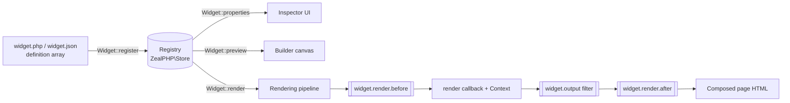

# Widget SDK

> The stable, versioned public API for defining, rendering, previewing, and packaging GOCO CMS widgets — the atomic building blocks of every page.

**Stability:** `stable`

The Widget SDK is the developer-facing contract exposed by the facade `Goco\SDK\Widget`. A *widget* is the smallest renderable unit in the [Website Hierarchy](../architecture/data-model.md) (`Workspace → Website → Theme → Layout → Section → Container → Row → Column → Widget`). This document specifies every public method, the property-schema DSL, the responsive value model, the render `Context`, output filtering, previews, property versioning/migration, distributable packaging (`widget.json`), and testing.

For the internals that back this SDK (registry, resolver, render cache, sandbox), see the [Widget Engine](../core/widget-engine.md). For a task-oriented walkthrough, see the [Widget Guide](../guides/widget-guide.md).

---

## The Facade at a Glance

```php
use Goco\SDK\Widget;
use Goco\Widget\Context;
use Goco\Widget\PropertySchema;
use Goco\Widget\AssetBundle;

final class Widget
{
    public static function register(string $type, array|callable $definition): void;
    public static function render(string $type, array $props, ?Context $ctx = null): string;
    public static function properties(string $type): PropertySchema;
    public static function preview(string $type, array $props = []): string;
}
```

Every method is coroutine-safe. `register()` mutates a shared, copy-on-write registry backed by `\ZealPHP\Store` so that all OpenSwoole workers observe the same catalog; the other three methods are read-only and never block the event loop.

| Method | Purpose | Returns | Called from |
| --- | --- | --- | --- |
| `register()` | Declare a widget type + its schema | `void` | Plugin/theme boot, `widgets/*/widget.php` |
| `render()` | Produce final HTML for a widget instance | `string` | Rendering pipeline, page builder |
| `properties()` | Introspect the property schema | `PropertySchema` | Admin UI, validation, docs |
| `preview()` | Render a self-contained preview (design-time) | `string` | Page builder canvas, marketplace |

---

## 1. `Widget::register(string $type, array|callable $definition): void`

Registers a widget `$type` (a stable, kebab-case identifier, optionally namespaced by owner: `hero-banner`, `acme/pricing-table`). The `$definition` is either an associative array or a callable returning one (deferred definitions let you resolve services lazily on first use).

### Definition shape

```php
use Goco\SDK\Widget;
use Goco\Widget\Context;

Widget::register('hero-banner', [
    // --- Identity & metadata ---
    'name'        => 'Hero Banner',
    'description' => 'Full-width hero with headline, subheadline, CTA and background.',
    'category'    => 'marketing',           // groups the widget in the inserter
    'icon'        => 'layout-hero',          // icon token from the design system
    'keywords'    => ['hero', 'banner', 'cta', 'header'],
    'version'     => '2.0.0',                // SemVer of the widget itself
    'schema'      => 2,                       // prop-schema version (see §Versioning)
    'stability'   => 'stable',

    // --- Capabilities & placement rules ---
    'supports'    => [
        'responsive' => true,   // per-breakpoint props allowed
        'spacing'    => true,   // exposes margin/padding controls
        'visibility' => true,   // per-breakpoint show/hide
        'animation'  => true,
        'anchor'     => true,   // stable #id for deep links
        'dynamic'    => true,   // dynamic-binding controls allowed
    ],
    'allowedParents'  => ['column', 'container'],  // hierarchy constraint
    'maxInstances'    => null,                       // null = unlimited per page

    // --- Property schema (the DSL, see §Property Schema) ---
    'properties'  => [ /* ... controls ... */ ],

    // --- Render callback ---
    'render' => function (array $props, Context $ctx): string {
        return \ZealPHP\App::renderToString('/widgets/hero-banner.php', [
            'headline' => $props['headline'],
            'cta'      => $props['cta'],
            'ctx'      => $ctx,
        ]);
    },

    // --- Optional lifecycle callbacks ---
    'preview'   => function (array $props, Context $ctx): string { /* ... */ },
    'migrate'   => function (array $props, int $from, int $to): array { /* ... */ },
    'validate'  => function (array $props): array { /* returns error map */ },
    'assets'    => [
        'css' => ['hero-banner.css'],
        'js'  => ['hero-banner.js'],
        'defer' => true,
    ],
]);
```

> **Note** `register()` is idempotent per `$type` within a worker: a second registration with the same `$type` **replaces** the prior definition and emits the filter `widget.registered` so tooling can detect overrides. Registration order does not matter — the registry is resolved at render time, not boot time.

### Deferred (callable) definitions

Use a callable when the definition needs container services or should not be built at boot:

```php
Widget::register('pricing-table', function (): array {
    /** @var \Goco\Billing\PlanRepository $plans */
    $plans = app(\Goco\Billing\PlanRepository::class);

    return [
        'name'       => 'Pricing Table',
        'category'   => 'commerce',
        'schema'     => 1,
        'properties' => [
            'plans' => [
                'type'    => 'select',
                'label'   => 'Plan set',
                'options' => $plans->optionMap(),   // resolved lazily
            ],
        ],
        'render' => fn (array $p, Context $c): string =>
            \ZealPHP\App::renderToString('/widgets/pricing-table.php', $p + ['ctx' => $c]),
    ];
});
```

The callable runs **once**, memoized, on first access to that `$type`. Exceptions raised inside it surface as a `WidgetDefinitionException` and are logged to `/tmp/zealphp/`.

### Where registration happens

| Source | File | Loaded by |
| --- | --- | --- |
| First-party / bundled | `widgets/<type>/widget.php` | Widget Engine autoloader |
| Theme-provided | `themes/<slug>/widgets/<type>/widget.php` | [Theme SDK](theme-sdk.md) on `theme.activated` |
| Plugin-provided | plugin `boot()` calling `Widget::register()` | [Plugin SDK](plugin-sdk.md) |

The recommended hook for plugin-provided widgets is `core.boot`:

```php
use Goco\SDK\{Hook, Widget};

Hook::listen('core.boot', function (): void {
    Widget::register('acme/testimonial', require __DIR__ . '/widgets/testimonial/definition.php');
}, priority: 10);
```

---

## 2. Property Schema — the Control DSL

`properties` is an ordered map of `field => control`. Each control declares a `type`, a human `label`, an optional `default`, `help` text, `group` (tab/section in the inspector), `responsive` flag, `bindable` flag, and `when` (conditional visibility). GOCO validates props against this schema on save (server-side) and mirrors it in the inspector UI.

### Control reference

| `type` | Stored value | Notes |
| --- | --- | --- |
| `text` | `string` | Single-line; `maxlength`, `placeholder`, `pattern` |
| `textarea` | `string` | Multi-line; `rows` |
| `number` | `int\|float` | `min`, `max`, `step`, `unit` |
| `toggle` (alias `switch`) | `bool` | On/off |
| `select` | scalar | `options` map or `optionsFrom` callable |
| `radio` | scalar | Small option sets; renders inline |
| `color` | `string` (token or hex/rgba) | Palette + custom picker; supports theme tokens `--goco-*` |
| `spacing` | `array{top,right,bottom,left}` | Per-side; per-breakpoint when responsive |
| `typography` | `array` | family/size/weight/line-height/letter-spacing/transform |
| `image` | `array{id,url,alt,width,height}` | Media library reference (`media` collection `_id`) |
| `richtext` | `string` (sanitized HTML) | Block editor output; server-sanitized allowlist |
| `url` | `array{href,target,rel,label}` | Link with dynamic-binding support |
| `repeater` | `array<array>` | Nested sub-schema, drag-reorderable |
| `dynamic-binding` | `array{source,path,fallback}` | Binds to page/collection/query data |

### Control examples

```php
'properties' => [

    'headline' => [
        'type'       => 'text',
        'label'      => 'Headline',
        'default'    => 'Build something great',
        'maxlength'  => 120,
        'responsive' => false,
        'bindable'   => true,   // may be replaced by a dynamic-binding
        'group'      => 'content',
    ],

    'body' => [
        'type'    => 'richtext',
        'label'   => 'Body copy',
        'toolbar' => ['bold', 'italic', 'link', 'list', 'heading'],
        'group'   => 'content',
    ],

    'columns' => [
        'type'       => 'number',
        'label'      => 'Columns',
        'default'    => 3,
        'min'        => 1,
        'max'        => 6,
        'step'       => 1,
        'responsive' => true,     // different count per breakpoint
        'group'      => 'layout',
    ],

    'boxed' => [
        'type'    => 'toggle',
        'label'   => 'Boxed width',
        'default' => true,
        'group'   => 'layout',
    ],

    'align' => [
        'type'    => 'radio',
        'label'   => 'Text alignment',
        'default' => 'left',
        'options' => ['left' => 'Left', 'center' => 'Center', 'right' => 'Right'],
        'responsive' => true,
        'group'   => 'layout',
    ],

    'theme' => [
        'type'    => 'select',
        'label'   => 'Color theme',
        'default' => 'light',
        'options' => ['light' => 'Light', 'dark' => 'Dark', 'brand' => 'Brand'],
        'group'   => 'style',
    ],

    'accent' => [
        'type'    => 'color',
        'label'   => 'Accent color',
        'default' => 'var(--goco-color-primary)',
        'palette' => ['var(--goco-color-primary)', 'var(--goco-color-secondary)', '#111827'],
        'alpha'   => true,
        'group'   => 'style',
    ],

    'padding' => [
        'type'       => 'spacing',
        'label'      => 'Padding',
        'sides'      => ['top', 'right', 'bottom', 'left'],
        'units'      => ['px', 'rem', '%'],
        'default'    => ['top' => 48, 'right' => 24, 'bottom' => 48, 'left' => 24],
        'responsive' => true,
        'group'      => 'spacing',
    ],

    'title_type' => [
        'type'    => 'typography',
        'label'   => 'Title typography',
        'default' => [
            'family'      => 'var(--goco-font-heading)',
            'size'        => ['value' => 2.5, 'unit' => 'rem'],
            'weight'      => 700,
            'lineHeight'  => 1.15,
            'transform'   => 'none',
        ],
        'responsive' => true,
        'group'      => 'style',
    ],

    'background' => [
        'type'    => 'image',
        'label'   => 'Background image',
        'accept'  => ['image/jpeg', 'image/png', 'image/webp', 'image/avif'],
        'sizes'   => ['hero'],     // named responsive derivative from Storage
        'group'   => 'style',
    ],

    'cta' => [
        'type'     => 'url',
        'label'    => 'Call to action',
        'default'  => ['href' => '#', 'target' => '_self', 'rel' => '', 'label' => 'Get started'],
        'bindable' => true,
        'group'    => 'content',
    ],

    // Conditional control: only visible when `theme === 'brand'`
    'brand_logo' => [
        'type'  => 'image',
        'label' => 'Brand logo',
        'when'  => ['field' => 'theme', 'is' => 'brand'],
        'group' => 'style',
    ],
],
```

### Repeater (nested sub-schema)

```php
'features' => [
    'type'    => 'repeater',
    'label'   => 'Feature list',
    'min'     => 0,
    'max'     => 12,
    'itemLabel' => '{{title}}',        // derived from a child field
    'default' => [],
    'fields'  => [
        'icon'  => ['type' => 'select', 'label' => 'Icon', 'options' => ['check' => 'Check', 'star' => 'Star']],
        'title' => ['type' => 'text', 'label' => 'Title', 'maxlength' => 60],
        'text'  => ['type' => 'textarea', 'label' => 'Description', 'rows' => 2],
        'link'  => ['type' => 'url', 'label' => 'Link', 'bindable' => true],
    ],
],
```

Repeaters may nest one level deep by default; deeper nesting is `experimental` and gated behind `supports.deepRepeater`.

### `optionsFrom` — dynamic option sources

For `select`/`radio` whose choices come from data, use `optionsFrom` (a resolver invoked with the render/inspector `Context`):

```php
'category' => [
    'type'  => 'select',
    'label' => 'Post category',
    'optionsFrom' => function (Context $ctx): array {
        return app(\Goco\Blog\TaxonomyRepository::class)
            ->terms($ctx->websiteId(), 'category')
            ->pluck('name', 'slug')
            ->all();
    },
],
```

`optionsFrom` results are cached in Redis per `(website_id, field, args)` with a short TTL; invalidate via the `widget.options.invalidate` action.

---

## 3. The Responsive Value Model

Any control marked `'responsive' => true` stores a **breakpoint map** instead of a bare value. Breakpoints are theme-defined but default to:

| Key | Label | Min width | Cascade |
| --- | --- | --- | --- |
| `base` | Mobile (default) | `0` | required — the fallback for all others |
| `sm` | Small | `640px` | inherits `base` |
| `md` | Medium | `768px` | inherits `sm` |
| `lg` | Large | `1024px` | inherits `md` |
| `xl` | Extra large | `1280px` | inherits `lg` |

The stored shape is *sparse* — only overridden breakpoints are persisted; missing ones resolve by cascading down to the nearest smaller defined value (mobile-first):

```json
{
  "columns": { "base": 1, "md": 2, "lg": 3 },
  "align":   { "base": "center", "lg": "left" },
  "padding": {
    "base": { "top": 24, "right": 16, "bottom": 24, "left": 16 },
    "lg":   { "top": 96, "right": 32, "bottom": 96, "left": 32 }
  }
}
```

### Resolving responsive values in `render`

The SDK gives you a helper so your render callback never has to walk the cascade manually:

```php
use Goco\Widget\Responsive;

'render' => function (array $props, Context $ctx): string {
    // Emit CSS custom properties that the theme's utility CSS consumes:
    $vars = Responsive::cssVars('--cols', $props['columns']);
    // => "--cols:1; @media(min-width:768px){--cols:2} @media(min-width:1024px){--cols:3}"

    // Or resolve for a single active breakpoint (e.g. server-side preview at 'lg'):
    $cols = Responsive::at($props['columns'], $ctx->breakpoint());  // int

    return \ZealPHP\App::renderToString('/widgets/feature-grid.php', [
        'cols'      => $cols,
        'styleVars' => $vars,
        'ctx'       => $ctx,
    ]);
},
```

`Responsive::cssVars()` is the recommended path: it renders once and lets the browser pick the breakpoint, which keeps the render output cacheable regardless of viewport. `Responsive::at()` is for previews and static/AMP output where a single viewport is assumed.

> **Tip** Keep responsive props sparse. Writing a full value at every breakpoint defeats the mobile-first cascade, bloats the stored document, and makes theme retargeting harder. Only override where the design actually changes.

---

## 4. The Render `Context`

`render()`, `preview()`, and every callable resolver receive a `Goco\Widget\Context` — an immutable, per-request value object carrying tenant scope, the current page/entry, data bindings, and render-mode flags. It is derived from [`\ZealPHP\G` / `RequestContext`](../architecture/request-lifecycle.md) at the top of the rendering pipeline.

```php
namespace Goco\Widget;

interface Context
{
    // --- Tenant scope (see architecture/multi-tenancy.md) ---
    public function workspaceId(): string;      // ObjectId hex
    public function websiteId(): string;        // ObjectId hex
    public function locale(): string;           // e.g. "en-US"

    // --- Placement ---
    public function pageId(): ?string;          // pages/posts _id, if any
    public function widgetInstanceId(): string; // this instance's _id
    public function region(): ?string;          // layout region slug

    // --- Render mode ---
    public function mode(): string;             // 'live' | 'preview' | 'editor' | 'export'
    public function isEditor(): bool;
    public function breakpoint(): string;        // active bp for single-viewport modes
    public function device(): string;            // 'mobile' | 'tablet' | 'desktop'

    // --- Data bindings ---
    public function bindings(): DataBag;         // resolved dynamic-binding sources
    public function bind(string $path, mixed $default = null): mixed;

    // --- User / auth (see core/authentication.md) ---
    public function user(): ?User;               // null for anonymous visitors
    public function can(string $capability): bool;

    // --- Asset & escaping helpers ---
    public function enqueueCss(string $handle, string $href): void;
    public function enqueueJs(string $handle, string $src, bool $defer = true): void;
    public function nonce(): string;             // CSP nonce for inline script/style
    public function e(string $value): string;    // context-aware HTML escape
    public function url(string $path): string;   // tenant-aware absolute URL
}
```

### Using the Context

```php
'render' => function (array $props, Context $ctx): string {
    // Personalize without leaking across tenants — scope is guaranteed by $ctx.
    $greeting = $ctx->user()
        ? "Welcome back, {$ctx->e($ctx->user()->displayName())}"
        : 'Welcome';

    // Dynamic binding: headline may be bound to the current page's title.
    $headline = $ctx->bind($props['headline_binding'] ?? null, $props['headline']);

    // Enqueue a scoped stylesheet only when this widget actually renders.
    $ctx->enqueueCss('hero-banner', $ctx->url('/widgets/hero-banner/hero-banner.css'));

    return \ZealPHP\App::renderToString('/widgets/hero-banner.php', [
        'greeting' => $greeting,
        'headline' => $ctx->e($headline),
        'nonce'    => $ctx->nonce(),
    ]);
},
```

### Dynamic bindings

A `dynamic-binding` control (or any `bindable` field switched to bound mode) stores a source descriptor:

```json
{
  "headline_binding": {
    "source": "page",
    "path": "title",
    "fallback": "Untitled"
  }
}
```

Available `source` values and their `path` roots:

| `source` | Resolves against | Example `path` |
| --- | --- | --- |
| `page` | current `pages`/`posts` document | `title`, `meta.description`, `author.name` |
| `entry` | current `collection_entries` document (Database Builder) | `fields.price`, `fields.gallery.0.url` |
| `query` | a saved query (`query.criteria` filter) result set | `results.0.title` |
| `site` | website settings (`settings` collection) | `name`, `logo.url` |
| `user` | authenticated visitor (nullable) | `displayName`, `email` |
| `param` | route/query parameter | `slug`, `q` |

`$ctx->bind('page.title', $default)` walks the resolved `DataBag`, applies the field's `fallback`, and returns a scalar or structured value. Bindings are resolved **once per request** and memoized on the `Context`, so multiple widgets reading `page.title` cause a single lookup. See the [Database Builder](../core/database-builder.md) for `entry`/`query` source details.

---

## 5. Output Filtering — `widget.output`

Every widget's rendered HTML passes through the filter `widget.output` before it is composed into the page. This is the supported extension point for wrapping, transforming, or instrumenting widget markup without touching the widget itself. Filter naming follows the convention `subject.noun` (see the [Hook SDK](hook-sdk.md)).

```php
use Goco\SDK\Hook;
use Goco\Widget\Context;

Hook::filter('widget.output', function (string $html, string $type, array $props, Context $ctx): string {
    // Wrap every marketing-category widget in an A/B experiment marker.
    if (($props['_category'] ?? null) === 'marketing' && $ctx->mode() === 'live') {
        $variant = $ctx->e($props['_experiment'] ?? 'control');
        return "<div data-exp=\"{$variant}\">{$html}</div>";
    }
    return $html;
}, priority: 20);
```

Related filters and actions in the render path:

| Hook | Type | Signature | Fires |
| --- | --- | --- | --- |
| `widget.render.before` | action | `($type, &$props, $ctx)` | before the render callback; may mutate props |
| `widget.output` | filter | `(string $html, $type, $props, $ctx): string` | after render, before composition |
| `widget.render.after` | action | `($type, $html, $props, $ctx)` | after output filtering (instrumentation) |
| `widget.props.default` | filter | `(array $props, $type): array` | fills defaults before validation |
| `widget.properties` | filter | `(PropertySchema $s, $type): PropertySchema` | lets plugins add/hide controls |

> **Warning** `widget.output` receives already-escaped, sanitized HTML. If your filter injects untrusted data (experiment IDs, user input) you must escape it yourself with `$ctx->e()`. Returning malformed HTML can break page composition — the engine does not re-parse your output.

---

## 6. Previews

`Widget::preview(string $type, array $props = []): string` renders a **self-contained** representation for design-time surfaces: the page-builder canvas, the widget inserter thumbnail, and the [marketplace](../marketplace/overview.md) listing. A preview must render with `$props` possibly empty (fall back to defaults) and must not depend on a live page, an authenticated user, or tenant data that may be absent.

Resolution order:

1. If the definition supplies a `'preview'` callback, it is invoked with `($props, $ctx)` where `$ctx->mode() === 'preview'`.
2. Otherwise the normal `'render'` callback runs against a **sandbox context** with synthetic bindings and demo data.

```php
'preview' => function (array $props, Context $ctx): string {
    // Merge caller props over demo defaults so an empty-props call still looks real.
    $demo = [
        'headline' => 'Your headline here',
        'cta'      => ['href' => '#', 'label' => 'Get started', 'target' => '_self'],
        'theme'    => 'light',
    ];
    $props = array_replace_recursive($demo, $props);

    return \ZealPHP\App::renderToString('/widgets/hero-banner.php', $props + ['ctx' => $ctx, 'preview' => true]);
},
```

The preview sandbox:

- runs with `mode = 'preview'`, `user = null`, and a fixed `breakpoint` (default `lg`, overridable by the builder for device previews);
- resolves dynamic bindings against **sample data**, not the live document, so previews are deterministic and safe to cache in Redis;
- disables side-effecting hooks (`dispatchAsync`, queue jobs) — only pure filters run;
- strips forms' live action endpoints and replaces them with `#` to prevent accidental submission.

---

## 7. Property Versioning & Migration

Widgets evolve. The `schema` integer in the definition is the **prop-schema version**; every stored widget instance persists the `schema` it was authored under. When a page loads an instance whose stored `schema` is lower than the registered `schema`, GOCO runs your `migrate` callback to upgrade the props **in memory** (and lazily persists the upgrade on next save). This keeps old content rendering correctly forever without a big-bang migration.

```php
Widget::register('hero-banner', [
    'schema'  => 3,   // current
    'migrate' => function (array $props, int $from, int $to): array {
        // v1 -> v2: split single `cta_url` string into a structured url control.
        if ($from < 2) {
            $props['cta'] = [
                'href'   => $props['cta_url'] ?? '#',
                'label'  => $props['cta_label'] ?? 'Learn more',
                'target' => '_self',
                'rel'    => '',
            ];
            unset($props['cta_url'], $props['cta_label']);
        }
        // v2 -> v3: `columns` became responsive; wrap the scalar as a base value.
        if ($from < 3 && isset($props['columns']) && !is_array($props['columns'])) {
            $props['columns'] = ['base' => (int) $props['columns']];
        }
        return $props;
    },
    // ...
]);
```

Rules the engine enforces:

- `migrate` must be **pure and idempotent** — running it twice from the same `$from` yields the same result.
- Migrations are **cumulative and forward-only**: the engine calls `migrate($props, $stored, $current)` once; your callback must handle every intermediate step with `if ($from < N)` guards, ordered ascending.
- Never delete a field a still-supported migration reads. To retire a control, keep the field readable for at least one minor cycle and remove it only on a major bump. See the [Widget Engine upgrade strategy](../core/widget-engine.md).
- Migration failures are logged and the instance renders with a non-fatal fallback placeholder in `editor` mode, and is silently skipped in `live` mode with an `audit_logs` entry.

The `version` field (SemVer of the widget package) is independent of `schema`; bump `schema` only when the **stored prop shape** changes.

---

## 8. Packaging a Distributable Widget

A widget shipped outside the core repo (via the marketplace or Composer) lives in its own directory with a `widget.json` manifest. This is what the [marketplace](../marketplace/overview.md) indexes and what `goco widget:validate` checks.

### Directory layout

```
acme-hero-banner/
├── widget.json            # manifest (below)
├── src/
│   └── definition.php     # returns the register() array
├── views/
│   └── hero-banner.php    # ZealPHP/PHP template (App::render)
├── assets/
│   ├── hero-banner.css
│   └── hero-banner.js
├── preview/
│   └── thumbnail.svg      # inserter/marketplace image
├── tests/
│   └── HeroBannerTest.php
├── translations/
│   └── en-US.json
└── README.md
```

### `widget.json`

```json
{
  "$schema": "https://gococms.dev/schema/widget.v1.json",
  "type": "acme/hero-banner",
  "name": "Hero Banner",
  "description": "Full-width hero with headline, CTA and background.",
  "version": "2.1.0",
  "schema": 3,
  "stability": "stable",
  "license": "MIT",
  "author": { "name": "Acme Inc.", "url": "https://acme.example" },
  "homepage": "https://acme.example/widgets/hero-banner",
  "category": "marketing",
  "icon": "layout-hero",
  "keywords": ["hero", "banner", "cta"],
  "requires": {
    "goco": ">=0.9.0 <1.0.0",
    "php": ">=8.4"
  },
  "supports": {
    "responsive": true,
    "spacing": true,
    "dynamic": true
  },
  "allowedParents": ["column", "container"],
  "entry": "src/definition.php",
  "views": "views",
  "assets": {
    "css": ["assets/hero-banner.css"],
    "js": ["assets/hero-banner.js"],
    "defer": true
  },
  "preview": {
    "thumbnail": "preview/thumbnail.svg",
    "sampleProps": "preview/sample.json"
  },
  "translations": "translations",
  "capabilities": ["widgets.manage"]
}
```

`entry` returns the exact array passed to `Widget::register()`:

```php
// src/definition.php
use Goco\Widget\Context;

return [
    'name'       => 'Hero Banner',
    'category'   => 'marketing',
    'schema'     => 3,
    'properties' => require __DIR__ . '/properties.php',
    'render'     => function (array $props, Context $ctx): string {
        return \ZealPHP\App::renderToString('/widgets/hero-banner.php', $props + ['ctx' => $ctx]);
    },
    'migrate'    => require __DIR__ . '/migrations.php',
];
```

### Install & validate

```bash
# Scaffold a new distributable widget
goco make:widget acme/hero-banner --category=marketing --package

# Lint the manifest, schema, and render signature against the SDK contract
goco widget:validate ./acme-hero-banner

# Register locally for development (symlinks into widgets/)
goco widget:link ./acme-hero-banner

# Publish to the configured marketplace registry
goco widget:publish ./acme-hero-banner
```

As a Composer package, `gococms/*` widgets are discovered via the `extra.goco.widgets` key in `composer.json` and auto-registered on `core.boot`. See the [CLI Reference](../reference/cli-reference.md) for full command flags.

---

## 9. Testing Widgets

The SDK ships `Goco\Testing\WidgetTestCase` (PHPUnit) with render assertions, a fake `Context` builder, and snapshot support. Tests run in a coroutine-free harness so they are fast and deterministic. See the project-wide [Testing Strategy](../community/testing-strategy.md).

### Render assertions

```php
use Goco\Testing\WidgetTestCase;
use Goco\SDK\Widget;

final class HeroBannerTest extends WidgetTestCase
{
    protected function setUp(): void
    {
        parent::setUp();
        Widget::register('hero-banner', require __DIR__ . '/../src/definition.php');
    }

    public function test_renders_headline_and_cta(): void
    {
        $ctx = $this->fakeContext(['websiteId' => 'w1', 'mode' => 'live']);

        $html = Widget::render('hero-banner', [
            'headline' => 'Ship faster',
            'cta'      => ['href' => '/signup', 'label' => 'Start now', 'target' => '_self'],
        ], $ctx);

        $this->assertWidgetRenders($html)
            ->hasText('Ship faster')
            ->hasElement('a[href="/signup"]')
            ->hasText('Start now')
            ->doesNotContainRawHtml('<script');   // XSS guard
    }

    public function test_escapes_untrusted_props(): void
    {
        $ctx = $this->fakeContext();
        $html = Widget::render('hero-banner', ['headline' => ''], $ctx);

        $this->assertStringNotContainsString('assertStringContainsString('&lt;img', $html);
    }
}
```

### Responsive resolution assertions

```php
public function test_columns_cascade(): void
{
    $ctx = $this->fakeContext(['breakpoint' => 'md']);
    $html = Widget::render('feature-grid', [
        'columns' => ['base' => 1, 'lg' => 3],   // no 'md' -> should inherit 'base'
    ], $ctx);

    $this->assertStringContainsString('--cols:1', $html);   // md resolves down to base
}
```

### Migration assertions

```php
public function test_migrates_v1_cta_to_structured_url(): void
{
    $migrated = $this->migrateProps('hero-banner', [
        'cta_url'   => '/pricing',
        'cta_label' => 'See plans',
    ], from: 1);

    $this->assertSame('/pricing', $migrated['cta']['href']);
    $this->assertSame('See plans', $migrated['cta']['label']);
    $this->assertArrayNotHasKey('cta_url', $migrated);
}
```

### Snapshot testing

```php
public function test_matches_snapshot(): void
{
    $ctx  = $this->fakeContext(['mode' => 'preview']);
    $html = Widget::preview('hero-banner', require __DIR__ . '/fixtures/hero.props.php');

    // Writes __snapshots__/hero-banner.html on first run; diffs thereafter.
    $this->assertMatchesHtmlSnapshot($html);
}
```

Run the suite:

```bash
goco test packages/widget-engine
# or a single widget package
vendor/bin/phpunit acme-hero-banner/tests
```

> **Tip** Snapshot tests catch unintended markup drift, but pair them with explicit `hasElement`/`hasText` assertions for the parts that matter semantically — a snapshot alone will happily "pass" a broken layout as long as the bytes are stable. Regenerate snapshots deliberately with `--update-snapshots`, never blindly.

---

## 10. End-to-End Example

A complete, production-shaped widget definition tying the pieces together:

```php
// widgets/callout/widget.php
use Goco\SDK\{Widget, Hook};
use Goco\Widget\{Context, Responsive};

Widget::register('callout', [
    'name'        => 'Callout',
    'description' => 'Attention box with icon, message and optional action.',
    'category'    => 'content',
    'icon'        => 'megaphone',
    'version'     => '1.2.0',
    'schema'      => 2,
    'stability'   => 'stable',
    'supports'    => ['responsive' => true, 'spacing' => true, 'dynamic' => true],
    'allowedParents' => ['column', 'container'],

    'properties' => [
        'tone' => [
            'type' => 'radio', 'label' => 'Tone', 'default' => 'info', 'group' => 'style',
            'options' => ['info' => 'Info', 'success' => 'Success', 'warning' => 'Warning', 'danger' => 'Danger'],
        ],
        'message' => [
            'type' => 'richtext', 'label' => 'Message', 'group' => 'content', 'bindable' => true,
        ],
        'action' => [
            'type' => 'url', 'label' => 'Action', 'group' => 'content', 'bindable' => true,
            'default' => ['href' => '', 'label' => '', 'target' => '_self', 'rel' => ''],
        ],
        'padding' => [
            'type' => 'spacing', 'label' => 'Padding', 'group' => 'spacing', 'responsive' => true,
            'default' => ['top' => 16, 'right' => 20, 'bottom' => 16, 'left' => 20],
        ],
    ],

    'migrate' => function (array $props, int $from, int $to): array {
        if ($from < 2) {
            // v1 stored `type`; renamed to `tone`.
            $props['tone'] = $props['type'] ?? 'info';
            unset($props['type']);
        }
        return $props;
    },

    'render' => function (array $props, Context $ctx): string {
        $message = $ctx->bind($props['message_binding'] ?? null, $props['message'] ?? '');
        $padVars = Responsive::cssVars('--pad', $props['padding'] ?? []);
        $ctx->enqueueCss('callout', $ctx->url('/widgets/callout/callout.css'));

        return \ZealPHP\App::renderToString('/widgets/callout.php', [
            'tone'     => $props['tone'] ?? 'info',
            'message'  => $message,          // richtext -> sanitized in template via {{{ }}}
            'action'   => $props['action'] ?? null,
            'padVars'  => $padVars,
            'nonce'    => $ctx->nonce(),
            'ctx'      => $ctx,
        ]);
    },

    'preview' => function (array $props, Context $ctx): string {
        $props = array_replace_recursive([
            'tone' => 'info', 'message' => '<strong>Heads up!</strong> This is a callout.',
        ], $props);
        return \ZealPHP\App::renderToString('/widgets/callout.php', $props + ['ctx' => $ctx, 'preview' => true]);
    },
]);

// Instrument every callout render for analytics.
Hook::listen('widget.render.after', function (string $type, string $html, array $props, Context $ctx): void {
    if ($type === 'callout' && $ctx->mode() === 'live') {
        app(\Goco\Analytics\Recorder::class)->count('widget.callout.rendered', $ctx->websiteId());
    }
});
```

---

## API Summary



| Concern | Mechanism |
| --- | --- |
| Declare a widget | `Widget::register($type, $definition)` |
| Render HTML | `Widget::render($type, $props, $ctx)` |
| Introspect schema | `Widget::properties($type): PropertySchema` |
| Design-time preview | `Widget::preview($type, $props)` |
| Per-breakpoint props | `'responsive' => true` + `Responsive::cssVars()/at()` |
| Data binding | `dynamic-binding` control + `$ctx->bind()` |
| Transform output | `Hook::filter('widget.output', …)` |
| Version props | `schema` int + `migrate($props, $from, $to)` |
| Distribute | `widget.json` + `goco widget:publish` |
| Test | `Goco\Testing\WidgetTestCase` |

---

## Related

- [Widget Engine](../core/widget-engine.md) — the runtime that backs this SDK (registry, resolver, render cache, sandbox)
- [Widget Guide](../guides/widget-guide.md) — step-by-step tutorial for building your first widget
- [Theme SDK](theme-sdk.md) — themes register widgets and provide views/regions
- [Plugin SDK](plugin-sdk.md) — plugins register widgets during `boot()`
- [Hook SDK](hook-sdk.md) — `widget.output`, `widget.render.*`, and filter conventions
- [CLI SDK](cli.md) — `goco make:widget`, `widget:validate`, `widget:publish`
- [Rendering Pipeline](../architecture/rendering-pipeline.md) — where `render()` is invoked
- [Data Model](../architecture/data-model.md) — the `widgets` collection and Website Hierarchy
- [Multi-Tenancy](../architecture/multi-tenancy.md) — how `Context` scopes tenant data
- [Marketplace](../marketplace/overview.md) — distributing packaged widgets
- [Documentation Index](../README.md)
